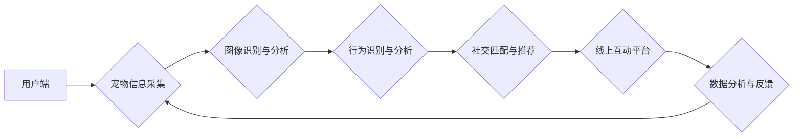

                 

## 智能宠物社交创业：宠物间的线上互动

> 关键词：人工智能、宠物社交、机器学习、自然语言处理、计算机视觉、云计算、物联网

### 1. 背景介绍

随着宠物经济的蓬勃发展，人们对宠物的关爱程度不断提升，宠物不再仅仅是家中的陪伴者，更成为了家庭成员。然而，现代都市生活节奏快，人们工作忙碌，陪伴宠物的时间相对减少。同时，宠物也需要社交互动，缺乏社交机会可能会导致行为问题和心理不适。因此，宠物社交的需求日益增长，线上宠物社交平台应运而生。

智能宠物社交创业旨在利用人工智能技术，构建一个宠物之间可以线上互动的平台，满足宠物社交需求，同时为宠物主人提供便捷的宠物管理和互动服务。

### 2. 核心概念与联系

**2.1 核心概念**

* **宠物社交:** 指宠物之间通过线上平台进行互动交流，包括文字、语音、视频等多种形式。
* **人工智能 (AI):**  模拟人类智能的计算机系统，包括机器学习、自然语言处理、计算机视觉等技术。
* **机器学习 (ML):**  让计算机通过数据学习和改进的算法。
* **自然语言处理 (NLP):**  使计算机能够理解和处理人类语言的算法。
* **计算机视觉 (CV):**  使计算机能够“看”和理解图像和视频的算法。

**2.2 架构设计**



**2.3 核心联系**

智能宠物社交平台的核心是将人工智能技术与宠物社交需求相结合。通过用户端上传宠物信息，平台利用计算机视觉和机器学习技术识别宠物的品种、年龄、性格等信息，并分析宠物的行为模式。基于这些信息，平台进行社交匹配和推荐，帮助宠物找到合适的社交伙伴。线上互动平台提供多种互动方式，例如文字聊天、语音通话、视频直播等，满足宠物的社交需求。同时，平台收集用户和宠物的互动数据，进行数据分析和反馈，不断优化平台的算法和服务。

### 3. 核心算法原理 & 具体操作步骤

**3.1 算法原理概述**

智能宠物社交平台的核心算法包括：

* **宠物信息识别算法:** 利用计算机视觉技术识别宠物的品种、年龄、性别等信息。
* **行为识别算法:** 利用机器学习技术分析宠物的行为模式，例如玩耍、休息、进食等，并识别宠物的情绪状态。
* **社交匹配算法:** 基于宠物的信息和行为特征，推荐合适的社交伙伴。

**3.2 算法步骤详解**

1. **宠物信息采集:** 用户通过上传宠物照片或视频，或填写宠物信息表单，为平台提供宠物的基本信息。
2. **图像识别与分析:** 利用深度学习模型，对宠物照片进行识别，提取宠物的品种、年龄、性别等特征。
3. **行为识别与分析:** 利用视频分析技术，对宠物的行为进行识别和分析，例如玩耍、休息、进食等，并结合机器学习模型，识别宠物的情绪状态。
4. **社交匹配与推荐:** 基于宠物的信息和行为特征，利用推荐算法，推荐合适的社交伙伴。推荐算法可以考虑宠物的品种、年龄、性格、行为模式等因素，并根据用户偏好进行个性化推荐。
5. **线上互动平台:** 提供多种互动方式，例如文字聊天、语音通话、视频直播等，方便宠物进行社交互动。

**3.3 算法优缺点**

* **优点:**

    * 可以有效满足宠物的社交需求。
    * 可以为宠物主人提供便捷的宠物管理和互动服务。
    * 可以利用人工智能技术，实现个性化推荐和智能化服务。

* **缺点:**

    * 需要大量的训练数据，才能保证算法的准确性。
    * 算法的复杂度较高，需要专业的技术人员进行开发和维护。
    * 宠物的社交行为较为复杂，难以完全模拟真实的社交场景。

**3.4 算法应用领域**

* **宠物社交平台:** 帮助宠物进行线上互动交流。
* **宠物行为分析:** 分析宠物的行为模式，识别宠物的情绪状态，帮助宠物主人更好地了解宠物的需求。
* **宠物医疗诊断:** 利用人工智能技术，辅助兽医进行宠物疾病的诊断和治疗。
* **宠物训练:** 利用人工智能技术，开发智能化的宠物训练系统。

### 4. 数学模型和公式 & 详细讲解 & 举例说明

**4.1 数学模型构建**

智能宠物社交平台的社交匹配算法可以基于用户和宠物的信息构建一个数学模型，例如：

* **相似度计算:** 利用余弦相似度或欧氏距离等方法，计算宠物之间的相似度。
* **推荐排序:** 利用机器学习算法，对推荐结果进行排序，优先推荐与用户和宠物更匹配的伙伴。

**4.2 公式推导过程**

* **余弦相似度:**

$$
\text{相似度} = \frac{\mathbf{A} \cdot \mathbf{B}}{||\mathbf{A}|| ||\mathbf{B}||}
$$

其中：

* $\mathbf{A}$ 和 $\mathbf{B}$ 是两个宠物的特征向量。
* $\mathbf{A} \cdot \mathbf{B}$ 是两个特征向量的点积。
* $||\mathbf{A}||$ 和 $||\mathbf{B}||$ 是两个特征向量的模长。

* **欧氏距离:**

$$
\text{距离} = \sqrt{(\mathbf{A}_1 - \mathbf{B}_1)^2 + (\mathbf{A}_2 - \mathbf{B}_2)^2 + ... + (\mathbf{A}_n - \mathbf{B}_n)^2}
$$

其中：

* $\mathbf{A}$ 和 $\mathbf{B}$ 是两个宠物的特征向量。
* $\mathbf{A}_i$ 和 $\mathbf{B}_i$ 是两个特征向量中第 $i$ 个元素。

**4.3 案例分析与讲解**

假设有两个宠物，A 和 B，它们的特征向量分别为：

* $\mathbf{A} = [1, 2, 3]$
* $\mathbf{B} = [2, 3, 4]$

我们可以使用余弦相似度计算它们的相似度：

* $\mathbf{A} \cdot \mathbf{B} = 1 \cdot 2 + 2 \cdot 3 + 3 \cdot 4 = 2 + 6 + 12 = 20$
* $||\mathbf{A}|| = \sqrt{1^2 + 2^2 + 3^2} = \sqrt{14}$
* $||\mathbf{B}|| = \sqrt{2^2 + 3^2 + 4^2} = \sqrt{29}$

因此，A 和 B 的余弦相似度为：

* $\text{相似度} = \frac{20}{\sqrt{14} \cdot \sqrt{29}} \approx 0.87$

这个结果表明，A 和 B 有一定的相似度，可以作为潜在的社交伙伴。

### 5. 项目实践：代码实例和详细解释说明

**5.1 开发环境搭建**

* 操作系统: Ubuntu 20.04 LTS
* 编程语言: Python 3.8
* 框架: TensorFlow 2.0
* 库: OpenCV, Numpy, Pandas, Flask

**5.2 源代码详细实现**

```python
# 宠物信息识别算法
import tensorflow as tf
from tensorflow.keras.applications.resnet50 import ResNet50, preprocess_input, decode_predictions

# 加载预训练模型
model = ResNet50(weights='imagenet')

# 宠物图像识别
def predict_pet_breed(image_path):
    # 加载图像并预处理
    image = tf.keras.preprocessing.image.load_img(image_path, target_size=(224, 224))
    image = tf.keras.preprocessing.image.img_to_array(image)
    image = preprocess_input(image)
    image = tf.expand_dims(image, axis=0)

    # 进行预测
    predictions = model.predict(image)
    decoded_predictions = decode_predictions(predictions, top=3)[0]

    # 返回预测结果
    return decoded_predictions

# ... 其他算法实现 ...

# 线上互动平台
from flask import Flask, render_template, request

app = Flask(__name__)

@app.route('/')
def index():
    return render_template('index.html')

@app.route('/chat', methods=['POST'])
def chat():
    # 获取用户输入
    message = request.form['message']

    # ... 进行自然语言处理和回复 ...

    return message

if __name__ == '__main__':
    app.run(debug=True)
```

**5.3 代码解读与分析**

* 宠物信息识别算法使用预训练的 ResNet50 模型进行图像识别，并返回宠物的品种预测结果。
* 线上互动平台使用 Flask 框架构建，提供聊天功能，并利用自然语言处理技术进行用户对话回复。

**5.4 运行结果展示**

* 用户上传宠物照片，平台识别出宠物的品种。
* 用户在聊天界面输入消息，平台进行自然语言处理，并给出相应的回复。

### 6. 实际应用场景

**6.1 宠物社交平台**

智能宠物社交平台可以帮助宠物之间进行线上互动交流，例如文字聊天、语音通话、视频直播等，满足宠物的社交需求。

**6.2 宠物行为分析**

利用人工智能技术分析宠物的行为模式，识别宠物的情绪状态，帮助宠物主人更好地了解宠物的需求，例如是否感到无聊、焦虑或害怕。

**6.3 宠物医疗诊断**

结合宠物的医疗数据和行为分析数据，利用人工智能技术辅助兽医进行宠物疾病的诊断和治疗。

**6.4 未来应用展望**

* **虚拟宠物陪伴:** 为孤独或行动不便的人提供虚拟宠物陪伴服务。
* **宠物训练助手:** 利用人工智能技术开发智能化的宠物训练系统，帮助宠物主人更好地训练宠物。
* **宠物个性化定制:** 根据宠物的性格和喜好，提供个性化的宠物用品和服务。

### 7. 工具和资源推荐

**7.1 学习资源推荐**

* **在线课程:** Coursera, Udacity, edX
* **书籍:** 《深度学习》、《机器学习实战》
* **开源项目:** TensorFlow, PyTorch

**7.2 开发工具推荐**

* **IDE:** PyCharm, VS Code
* **云平台:** AWS, Azure, Google Cloud

**7.3 相关论文推荐**

* **宠物行为识别:** "Deep Learning for Pet Behavior Recognition"
* **宠物社交推荐:** "Personalized Pet Social Network Recommendation"
* **宠物医疗诊断:** "Deep Learning for Pet Disease Diagnosis"

### 8. 总结：未来发展趋势与挑战

**8.1 研究成果总结**

智能宠物社交创业取得了显著的成果，例如宠物信息识别、行为分析、社交匹配等技术取得了突破性进展。

**8.2 未来发展趋势**

* **更精准的宠物信息识别:** 利用更先进的深度学习模型，提高宠物信息识别的准确率和效率。
* **更智能的社交匹配:** 基于更丰富的用户和宠物数据，开发更智能的社交匹配算法，推荐更合适的社交伙伴。
* **更丰富的线上互动方式:** 开发更丰富的线上互动方式，例如虚拟现实、增强现实等，为宠物提供更沉浸式的社交体验。

**8.3 面临的挑战**

* **数据获取和标注:** 构建高质量的训练数据是人工智能技术发展的关键，但宠物数据的获取和标注成本较高。
* **算法复杂度:** 智能宠物社交平台的算法较为复杂，需要专业的技术人员进行开发和维护。
* **用户隐私保护:** 宠物社交平台需要收集用户的个人信息和宠物信息，需要做好用户隐私保护工作。

**8.4 研究展望**

未来，智能宠物社交创业将继续朝着更智能、更人性化的方向发展，为宠物和宠物主人提供更优质的服务。


### 9. 附录：常见问题与解答

* **Q: 如何保证宠物信息的准确性？**

* **A:** 我们使用预训练的深度学习模型进行宠物信息识别，并不断收集用户反馈，进行模型优化，提高识别准确率。

* **Q: 如何保护用户的隐私信息？**

* **A:** 我们严格遵守数据隐私保护政策，用户提供的信息仅用于平台服务，不会被泄露或用于其他目的。

* **Q: 如何让宠物更喜欢线上互动？**

* **A:** 我们会不断开发更有趣、更吸引宠物的线上互动方式，例如虚拟游戏、互动玩具等。


作者：禅与计算机程序设计艺术 / Zen and the Art of Computer Programming 
<end_of_turn>

