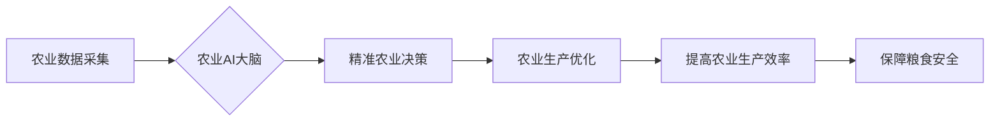

                 

## 未来的智慧农业：2050年的农业AI大脑与精准农业

> 关键词：农业AI、精准农业、机器学习、深度学习、物联网、数据分析、智能决策、可持续发展

## 1. 背景介绍

全球人口持续增长，粮食需求不断攀升，而气候变化、资源短缺等挑战也给农业生产带来了巨大压力。传统农业模式面临着效率低下、资源浪费、环境污染等问题。为了应对这些挑战，智慧农业应运而生，并逐渐成为农业发展的重要趋势。

智慧农业的核心是利用信息技术和人工智能技术，实现农业生产的智能化、数字化和可持续化。其中，人工智能（AI）作为智慧农业的关键驱动力，正在深刻地改变着农业生产方式。

## 2. 核心概念与联系

**2.1 农业AI大脑**

农业AI大脑是一个集成了多种人工智能技术、传感器数据、地理信息系统（GIS）和农业专家知识的智能平台。它能够通过对海量农业数据进行分析和处理，为农业生产提供精准的决策支持。

**2.2 精准农业**

精准农业是指利用信息技术和数据分析技术，对农业生产进行细化管理，实现资源的优化配置和生产效率的提升。它强调根据不同田块、不同作物、不同生长阶段的具体需求，采取个性化的管理措施。

**2.3 核心概念架构**



## 3. 核心算法原理 & 具体操作步骤

**3.1 算法原理概述**

农业AI大脑的核心算法主要包括机器学习、深度学习、自然语言处理等。

* **机器学习**：通过训练模型，从数据中学习规律，并对新的数据进行预测和分类。例如，可以利用机器学习算法预测作物产量、识别病虫害、优化施肥方案等。
* **深度学习**：是一种更高级的机器学习算法，能够处理更复杂的数据，例如图像、语音、文本等。深度学习可以用于识别作物品种、分析土壤状况、预测天气变化等。
* **自然语言处理**：能够理解和处理人类语言，例如可以用于分析农业新闻、研究报告、专家意见等，提取有价值的信息。

**3.2 算法步骤详解**

以机器学习算法为例，其具体操作步骤如下：

1. **数据采集和预处理**: 收集农业相关数据，例如土壤数据、气象数据、作物生长数据等，并进行清洗、转换、归一化等预处理操作。
2. **特征工程**: 从原始数据中提取有价值的特征，例如土壤肥力、温度、湿度等，这些特征将作为机器学习模型的输入。
3. **模型选择**: 根据具体任务选择合适的机器学习算法，例如回归算法、分类算法、聚类算法等。
4. **模型训练**: 利用训练数据训练机器学习模型，调整模型参数，使其能够准确地预测或分类目标变量。
5. **模型评估**: 利用测试数据评估模型的性能，例如准确率、召回率、F1-score等指标。
6. **模型部署**: 将训练好的模型部署到生产环境中，用于对新的数据进行预测或分类。

**3.3 算法优缺点**

* **优点**: 能够自动学习数据规律，提高预测精度，自动化程度高，能够处理海量数据。
* **缺点**: 需要大量的训练数据，算法解释性较差，对数据质量要求高。

**3.4 算法应用领域**

* 作物产量预测
* 病虫害识别
* 施肥方案优化
* 灌溉管理
* 农作物品种选育

## 4. 数学模型和公式 & 详细讲解 & 举例说明

**4.1 数学模型构建**

农业AI大脑的决策模型通常基于统计学和机器学习算法，例如线性回归、逻辑回归、支持向量机、决策树等。这些模型可以将农业数据映射到决策结果，例如预测作物产量、识别病虫害、优化施肥方案等。

**4.2 公式推导过程**

以线性回归为例，其目标是找到一条直线，使得预测值与实际值之间的误差最小。

假设我们有n个样本数据，每个样本包含一个输入特征x和一个输出目标y。线性回归模型的公式如下：

$$y = w_0 + w_1x$$

其中，$w_0$和$w_1$是模型参数，需要通过训练数据进行估计。

**4.3 案例分析与讲解**

假设我们想要预测小麦产量，输入特征包括土壤肥力、温度、降雨量等，输出目标是小麦产量。我们可以利用线性回归模型，将这些数据进行训练，得到一个预测模型。

例如，训练结果表明，小麦产量与土壤肥力呈正相关，每增加1单位的土壤肥力，小麦产量可以增加0.5吨。

**4.4 公式应用**

我们可以利用这个模型，预测不同土壤肥力的小麦产量。例如，如果土壤肥力为10，则预测小麦产量为：

$$y = w_0 + w_1 * 10$$

其中，$w_0$和$w_1$是训练得到的模型参数。

## 5. 项目实践：代码实例和详细解释说明

**5.1 开发环境搭建**

* 操作系统：Ubuntu 20.04
* Python 版本：3.8
* 必要的库：pandas、numpy、scikit-learn、matplotlib

**5.2 源代码详细实现**

```python
import pandas as pd
from sklearn.linear_model import LinearRegression
from sklearn.model_selection import train_test_split
from sklearn.metrics import mean_squared_error

# 加载数据
data = pd.read_csv("wheat_yield_data.csv")

# 选择特征和目标变量
features = ["soil_fertility", "temperature", "rainfall"]
target = "yield"

# 将数据分为训练集和测试集
X_train, X_test, y_train, y_test = train_test_split(data[features], data[target], test_size=0.2)

# 创建线性回归模型
model = LinearRegression()

# 训练模型
model.fit(X_train, y_train)

# 预测测试集数据
y_pred = model.predict(X_test)

# 计算模型性能
mse = mean_squared_error(y_test, y_pred)
print(f"Mean Squared Error: {mse}")

# 打印模型参数
print(f"Intercept: {model.intercept_}")
print(f"Coefficients: {model.coef_}")
```

**5.3 代码解读与分析**

* 首先，我们加载数据，选择特征和目标变量。
* 然后，我们将数据分为训练集和测试集，用于训练和评估模型。
* 创建线性回归模型，并使用训练数据进行训练。
* 利用训练好的模型，预测测试集数据，并计算模型性能。
* 最后，打印模型参数，例如截距和系数。

**5.4 运行结果展示**

运行代码后，会输出模型的性能指标，例如均方误差（MSE）。

## 6. 实际应用场景

**6.1 智慧农场管理**

农业AI大脑可以帮助农场管理者实现精准的作物管理，例如：

* **精准施肥**: 根据土壤肥力、作物生长需求等信息，制定个性化的施肥方案，提高肥料利用率，减少环境污染。
* **精准灌溉**: 根据土壤湿度、气象预报等信息，制定精准的灌溉方案，节约用水资源，提高作物产量。
* **病虫害监测**: 利用图像识别技术，识别作物病虫害，及时采取防治措施，减少病虫害损失。

**6.2 农业生产决策支持**

农业AI大脑可以为农业生产决策提供数据支持，例如：

* **作物品种选育**: 分析不同作物品种的生长特性、产量、抗病性等信息，为选育优良品种提供参考。
* **市场预测**: 分析市场需求、价格趋势等信息，为农业生产决策提供参考。
* **风险管理**: 分析自然灾害、市场波动等风险因素，帮助农民制定风险管理方案。

**6.3 农业资源优化配置**

农业AI大脑可以帮助优化农业资源配置，例如：

* **土地利用**: 分析土地肥力、水资源、地形等信息，优化土地利用方案，提高土地利用效率。
* **水资源管理**: 分析水资源分布、需求、利用效率等信息，优化水资源管理方案，节约用水资源。
* **肥料和农药管理**: 分析肥料和农药的施用量、效果、环境影响等信息，优化肥料和农药管理方案，提高资源利用效率，减少环境污染。

**6.4 未来应用展望**

随着人工智能技术的不断发展，农业AI大脑的应用场景将更加广泛，例如：

* **无人化农业**: 利用无人机、机器人等技术，实现农业生产的无人化管理。
* **垂直农业**: 利用人工智能技术，优化垂直农业的生产环境和管理方案，提高生产效率和产量。
* **可持续农业**: 利用人工智能技术，实现农业生产的资源节约、环境友好、可持续发展。

## 7. 工具和资源推荐

**7.1 学习资源推荐**

* **在线课程**: Coursera、edX、Udacity等平台提供人工智能、机器学习等相关课程。
* **书籍**: 《深度学习》、《机器学习实战》等书籍可以帮助深入了解人工智能相关知识。
* **开源项目**: TensorFlow、PyTorch等开源项目可以帮助实践人工智能算法。

**7.2 开发工具推荐**

* **Python**: 作为人工智能开发的主要语言，Python拥有丰富的库和工具，例如pandas、numpy、scikit-learn等。
* **Jupyter Notebook**: 用于编写和运行Python代码，并可视化数据分析结果。
* **云计算平台**: AWS、Azure、GCP等云计算平台提供强大的计算资源和数据存储服务，可以加速人工智能模型的训练和部署。

**7.3 相关论文推荐**

* **《Attention Is All You Need》**: 介绍了Transformer模型，在自然语言处理领域取得了突破性进展。
* **《Deep Learning》**: 深入介绍了深度学习算法和应用。
* **《Generative Adversarial Networks》**: 介绍了生成对抗网络，在图像生成、文本生成等领域取得了成功。

## 8. 总结：未来发展趋势与挑战

**8.1 研究成果总结**

近年来，人工智能技术在农业领域的应用取得了显著进展，例如：

* **作物产量预测**: 利用机器学习算法，可以准确预测作物产量，帮助农民制定生产计划。
* **病虫害识别**: 利用图像识别技术，可以识别作物病虫害，及时采取防治措施。
* **精准施肥**: 利用传感器数据和机器学习算法，可以制定个性化的施肥方案，提高肥料利用率，减少环境污染。

**8.2 未来发展趋势**

* **更强大的计算能力**: 随着计算能力的提升，人工智能模型将更加复杂，能够处理更复杂的数据，提供更精准的决策支持。
* **更丰富的传感器数据**: 随着物联网技术的普及，农业传感器将更加普及，能够收集更丰富的数据，为人工智能模型提供更全面的信息。
* **更智能的决策系统**: 未来，农业AI大脑将更加智能，能够自主学习、分析和决策，帮助农民更高效地管理农业生产。

**8.3 面临的挑战**

* **数据质量**: 农业数据往往存在不完整、不准确、格式不统一等问题，需要进行有效的数据清洗和预处理。
* **算法解释性**: 一些人工智能算法的解释性较差，难以理解模型的决策过程，这可能会影响农民的信任和接受度。
* **技术普及**: 农业AI技术的普及需要克服技术门槛、成本问题等挑战。

**8.4 研究展望**

未来，我们需要继续加强人工智能在农业领域的应用研究，例如：

* 开发更适用于农业场景的算法模型。
* 研究人工智能算法的解释性，提高模型的可解释性。
* 探索人工智能与其他技术（例如生物技术、纳米技术）的融合应用。


## 9. 附录：常见问题与解答

**9.1 如何获取农业数据？**

农业数据可以从以下渠道获取：

* **政府机构**: 许多国家和地区的政府机构会发布农业统计数据。
* **科研机构**: 农业科研机构会收集和分析农业数据。
* **企业**: 一些农业企业会收集和分析其自身的农业数据。
* **传感器**: 利用传感器可以实时采集农业数据，例如土壤湿度、温度、光照等。

**9.2 如何选择合适的农业AI模型？**

选择合适的农业AI模型需要根据具体任务和数据特点进行选择。例如：

* **预测作物产量**: 可以选择线性回归、支持向量机等回归模型。
* **识别病虫害**: 可以选择卷积神经网络等图像识别模型。
* **优化施肥方案**: 可以选择决策树、随机森林等分类模型。

**9.3 如何部署农业AI模型？**

农业AI模型的部署方式可以根据具体需求选择，例如：

* **云端部署**: 利用云计算平台部署模型，可以方便地进行模型训练、更新和访问。
* **边缘部署**: 将模型部署到边缘设备，例如无人机、传感器等，可以实现实时决策和数据处理。


作者：禅与计算机程序设计艺术 / Zen and the Art of Computer Programming 
<end_of_turn>

