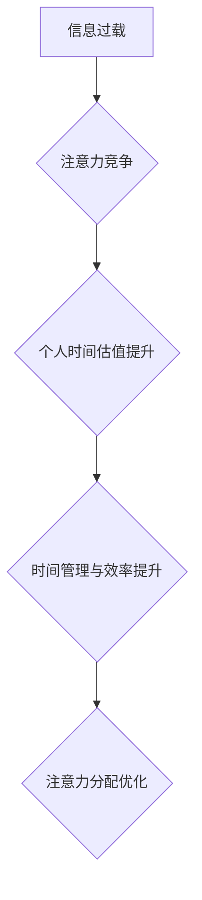

                 

## 1. 背景介绍

在当今信息爆炸的时代，我们每个人都被无休止的数字信息所包围。从社交媒体的推送通知到电子邮件的轰炸，从新闻网站的滚动条到视频平台的推荐算法，各种信息源争夺着我们的注意力。这种信息过载状态，催生了“注意力经济”的概念。

注意力经济的核心在于，注意力是稀缺的资源，而能够有效获取和利用注意力的人或组织，就拥有了巨大的竞争优势。在这个背景下，个人时间估值也发生了显著的变化。

传统的价值观中，时间被视为一种无限的资源，人们往往会将时间浪费在低效的活动上。然而，随着注意力经济的兴起，人们开始意识到时间的宝贵，并更加注重时间管理和效率提升。

## 2. 核心概念与联系

### 2.1 注意力经济

注意力经济是指在信息时代，注意力成为一种稀缺资源，而能够有效获取和利用注意力的人或组织，就拥有了巨大的竞争优势。

**核心要素：**

* **注意力：** 作为一种有限的资源，注意力是认知过程的基础，也是人们获取信息、做出决策和完成任务的关键。
* **信息过载：** 互联网时代，信息量呈指数级增长，人们面临着来自各个方向的信息轰炸，注意力被分散和碎片化。
* **竞争：** 各类平台和内容创作者都在争夺用户的注意力，通过各种手段吸引用户，例如推送通知、个性化推荐、内容碎片化等。

**影响：**

* **消费行为：** 用户注意力被碎片化，导致消费决策更加冲动和不理性。
* **内容生产：** 内容创作者需要更加注重内容的吸引力和互动性，才能获得用户的关注。
* **商业模式：** 广告、订阅、会员制等商业模式都依赖于用户的注意力。

### 2.2 个人时间估值

个人时间估值是指个人对自身时间的价值判断和认知。

**影响因素：**

* **社会文化：** 不同的文化背景对时间价值的理解和认知存在差异。
* **个人价值观：** 个人的兴趣爱好、目标追求、生活方式等都会影响时间估值。
* **经济条件：** 收入水平、职业类型等经济因素也会影响时间估值。

**变化趋势：**

* **时间越来越宝贵：** 信息时代，时间被视为一种稀缺资源，个人对时间价值的认知越来越高。
* **时间碎片化：** 碎片化时间成为主流，人们更加注重时间利用效率。
* **个性化时间估值：** 随着个人需求和价值观的差异化，时间估值也更加个性化。

### 2.3 注意力经济与个人时间估值的关系

注意力经济和个人时间估值是相互关联的。

* **注意力经济影响时间估值：** 信息过载和竞争激烈的注意力经济环境，促使人们更加重视时间价值，并更加注重时间管理和效率提升。
* **个人时间估值影响注意力分配：** 个人对时间价值的认知和判断，会影响他们如何分配注意力，以及如何选择花费时间在哪些活动上。

**Mermaid 流程图：**



## 3. 核心算法原理 & 具体操作步骤

### 3.1 算法原理概述

注意力机制是一种模仿人类注意力机制的算法，旨在帮助模型专注于输入数据中最重要的部分。它通过学习一个权重向量，将不同输入元素的权重分配不同，从而突出重要信息，抑制无关信息。

### 3.2 算法步骤详解

1. **输入数据：** 将输入数据（例如文本、图像、音频等）转换为模型可处理的格式。
2. **计算权重：** 使用注意力机制计算每个输入元素的权重，权重越高，表示该元素越重要。
3. **加权求和：** 根据计算出的权重，对输入元素进行加权求和，得到一个新的表示向量。
4. **输出结果：** 将加权求和后的向量作为模型的输出，用于后续的预测或分类任务。

### 3.3 算法优缺点

**优点：**

* **提高模型性能：** 通过关注重要信息，注意力机制可以提高模型的准确性和效率。
* **解释性增强：** 注意力权重可以帮助我们理解模型的决策过程，并解释模型对哪些信息更加关注。
* **适用于多种任务：** 注意力机制可以应用于各种自然语言处理、计算机视觉和语音识别等任务。

**缺点：**

* **计算复杂度高：** 计算注意力权重需要大量的计算资源，可能会增加模型训练时间和成本。
* **参数量大：** 注意力机制通常需要大量的参数，可能会导致模型过拟合。
* **可解释性有限：** 尽管注意力权重可以提供一些解释性，但模型的决策过程仍然比较复杂，难以完全理解。

### 3.4 算法应用领域

* **自然语言处理：** 机器翻译、文本摘要、问答系统、情感分析等。
* **计算机视觉：** 图像分类、目标检测、图像 Captioning 等。
* **语音识别：** 语音转文本、语音搜索等。
* **推荐系统：** 用户个性化推荐、商品推荐等。

## 4. 数学模型和公式 & 详细讲解 & 举例说明

### 4.1 数学模型构建

注意力机制的核心是计算每个输入元素的权重。常用的注意力机制模型包括：

* **点积注意力：** 使用点积运算计算输入元素之间的相似度，作为权重。
* **加性注意力：** 使用线性变换和激活函数计算输入元素之间的相似度，作为权重。

### 4.2 公式推导过程

**点积注意力：**

假设输入序列为 $x = (x_1, x_2, ..., x_n)$，查询向量为 $q$，键向量为 $k$，值向量为 $v$。点积注意力计算公式如下：

$$
\text{Attention}(q, k, v) = \text{softmax}\left(\frac{q \cdot k^T}{\sqrt{d_k}}\right) v
$$

其中：

* $q \cdot k^T$ 表示查询向量和键向量的点积。
* $d_k$ 表示键向量的维度。
* $\text{softmax}$ 函数将点积结果转换为概率分布。

**加性注意力：**

加性注意力计算公式如下：

$$
\text{Attention}(q, k, v) = \text{softmax}\left(\frac{v^T \cdot \text{tanh}(W_q q + W_k k)}{\sqrt{d_v}}\right) v
$$

其中：

* $W_q$ 和 $W_k$ 是线性变换矩阵。
* $\text{tanh}$ 是双曲正切激活函数。
* $d_v$ 表示值向量的维度。

### 4.3 案例分析与讲解

**机器翻译：**

在机器翻译任务中，注意力机制可以帮助模型关注源语言中与目标语言单词相关的关键信息。例如，在翻译句子“The cat sat on the mat”时，注意力机制可以帮助模型关注“cat”和“sat”这两个单词，并将其翻译为目标语言中的“猫”和“坐”。

**图像 Captioning：**

在图像 Captioning 任务中，注意力机制可以帮助模型关注图像中与描述相关的关键区域。例如，在描述图像“一只猫在草地上玩耍”时，注意力机制可以帮助模型关注猫的区域和草地的区域，并将其描述为“一只猫在草地上玩耍”。

## 5. 项目实践：代码实例和详细解释说明

### 5.1 开发环境搭建

* Python 3.6+
* TensorFlow 或 PyTorch

### 5.2 源代码详细实现

```python
import tensorflow as tf

# 定义点积注意力机制
def dot_product_attention(query, key, value, mask=None):
    scores = tf.matmul(query, key, transpose_b=True) / tf.math.sqrt(tf.shape(key)[-1])
    if mask is not None:
        scores += (mask * -1e9)
    attention_weights = tf.nn.softmax(scores, axis=-1)
    context_vector = tf.matmul(attention_weights, value)
    return context_vector, attention_weights

# 定义一个简单的 Transformer 模型
class Transformer(tf.keras.Model):
    def __init__(self, vocab_size, embedding_dim, num_heads, num_layers):
        super(Transformer, self).__init__()
        self.embedding = tf.keras.layers.Embedding(vocab_size, embedding_dim)
        self.transformer_layers = [
            tf.keras.layers.MultiHeadAttention(num_heads=num_heads, key_dim=embedding_dim)
            for _ in range(num_layers)
        ]
        self.linear = tf.keras.layers.Dense(vocab_size)

    def call(self, inputs):
        x = self.embedding(inputs)
        for layer in self.transformer_layers:
            x = layer(x, x, x)
        x = self.linear(x)
        return x

# 实例化模型
model = Transformer(vocab_size=10000, embedding_dim=512, num_heads=8, num_layers=6)

# 训练模型
# ...

```

### 5.3 代码解读与分析

* **点积注意力机制：** 代码中定义了 `dot_product_attention` 函数，实现点积注意力机制的计算。
* **Transformer 模型：** 代码中定义了一个简单的 Transformer 模型，包含嵌入层、多头注意力层和全连接层。
* **模型训练：** 代码中省略了模型训练部分，但可以根据实际需求进行训练。

### 5.4 运行结果展示

* 训练完成后，模型可以用于各种自然语言处理任务，例如机器翻译、文本摘要、问答系统等。
* 运行结果可以根据具体任务进行评估，例如机器翻译的 BLEU 分数、文本摘要的 ROUGE 分数等。

## 6. 实际应用场景

### 6.1  搜索引擎

搜索引擎利用注意力机制来理解用户搜索意图，并返回与用户需求最相关的结果。例如，Google 的 BERT 模型就使用了注意力机制来分析搜索词之间的关系，从而提高搜索结果的准确性。

### 6.2  聊天机器人

聊天机器人利用注意力机制来关注对话历史中的关键信息，并生成更自然、更相关的回复。例如，OpenAI 的 GPT-3 模型就使用了注意力机制来理解对话上下文，从而生成更流畅、更自然的对话。

### 6.3  个性化推荐

个性化推荐系统利用注意力机制来分析用户的行为数据，并推荐与用户兴趣相符的商品或内容。例如，Netflix 的推荐系统就使用了注意力机制来分析用户的观看历史，并推荐与用户观看习惯相似的电影或电视剧。

### 6.4 未来应用展望

注意力机制在未来将有更广泛的应用场景，例如：

* **医疗诊断：** 利用注意力机制分析病人的医学影像和病历，辅助医生进行诊断。
* **金融风险管理：** 利用注意力机制分析金融数据的异常波动，识别潜在的风险。
* **自动驾驶：** 利用注意力机制分析驾驶场景中的关键信息，提高自动驾驶系统的安全性。

## 7. 工具和资源推荐

### 7.1 学习资源推荐

* **书籍：**
    * 《深度学习》 by Ian Goodfellow, Yoshua Bengio, and Aaron Courville
    * 《Attention Is All You Need》
* **在线课程：**
    * Coursera: Deep Learning Specialization
    * Udacity: Deep Learning Nanodegree

### 7.2 开发工具推荐

* **TensorFlow:** https://www.tensorflow.org/
* **PyTorch:** https://pytorch.org/
* **Hugging Face Transformers:** https://huggingface.co/transformers/

### 7.3 相关论文推荐

* 《Attention Is All You Need》
* 《BERT: Pre-training of Deep Bidirectional Transformers for Language Understanding》
* 《Transformer-XL: Attentive Language Models Beyond a Fixed-Length Context》

## 8. 总结：未来发展趋势与挑战

### 8.1 研究成果总结

注意力机制在自然语言处理、计算机视觉等领域取得了显著的成果，提高了模型的性能和效率。

### 8.2 未来发展趋势

* **更强大的注意力机制：** 研究人员将继续探索更强大的注意力机制，例如长距离依赖的注意力机制、自注意力机制等。
* **注意力机制的应用扩展：** 注意力机制将应用于更多领域，例如医疗诊断、金融风险管理、自动驾驶等。
* **注意力机制的可解释性提升：** 研究人员将致力于提高注意力机制的可解释性，帮助人们更好地理解模型的决策过程。

### 8.3 面临的挑战

* **计算复杂度：** 某些注意力机制的计算复杂度较高，难以在资源有限的设备上运行。
* **参数量：** 注意力机制通常需要大量的参数，可能会导致模型过拟合。
* **可解释性：** 尽管注意力机制可以提供一些解释性，但模型的决策过程仍然比较复杂，难以完全理解。

### 8.4 研究展望

未来，注意力机制的研究将继续深入，探索更强大的、更可解释的注意力机制，并将其应用于更多领域，推动人工智能技术的发展。

## 9. 附录：常见问题与解答

**Q1：注意力机制是如何工作的？**

A1：注意力机制通过学习一个权重向量，将不同输入元素的权重分配不同，从而突出重要信息，抑制无关信息。

**Q2：注意力机制有哪些应用场景？**

A2：注意力机制在自然语言处理、计算机视觉等领域都有广泛的应用，例如机器翻译、文本摘要、图像 Captioning 等。

**Q3：注意力机制的优缺点是什么？**

A3：注意力机制的优点是提高模型性能、增强解释性，适用于多种任务。缺点是计算复杂度高、参数量大、可解释性有限。


作者：禅与计算机程序设计艺术 / Zen and the Art of Computer Programming<end_of_turn>

