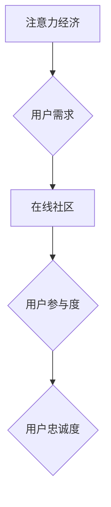

                 

##  注意力经济与在线社区：如何建立参与度高、忠诚度高的受众

> 关键词：注意力经济、在线社区、用户参与度、忠诚度、内容策略、社区运营、算法推荐、用户体验

## 1. 背景介绍

在当今数字时代，信息爆炸和竞争日益激烈，人们的注意力成为稀缺资源。这被称为“注意力经济”。在这个背景下，在线社区作为连接用户、分享内容和构建关系的重要平台，面临着如何吸引和留住用户注意力的挑战。建立参与度高、忠诚度高的受众，是社区运营的关键。

传统的社区运营模式往往依赖于内容的质量和数量，但随着用户获取信息的渠道越来越多，单纯依靠内容难以满足用户的需求。用户对内容的接受度和参与度越来越低，社区运营者需要探索新的方法来提升用户体验，激发用户参与。

## 2. 核心概念与联系

### 2.1 注意力经济

注意力经济是指在信息过载的时代，人们对信息的筛选和选择能力成为重要的经济资源。注意力是有限的，用户会根据自身兴趣和需求选择关注的内容和平台。

### 2.2 在线社区

在线社区是指基于互联网平台，用户聚集在一起，进行交流、分享和互动的一种虚拟空间。在线社区可以是基于特定主题、兴趣爱好、职业等，也可以是开放式的社交平台。

### 2.3 用户参与度

用户参与度是指用户在社区中进行的各种活动，例如发布内容、评论、点赞、转发等。参与度越高，表明用户对社区的兴趣和粘性越强。

### 2.4 忠诚度

用户忠诚度是指用户对社区的长期依赖和支持。忠诚度高的用户会经常访问社区，积极参与活动，并推荐社区给其他用户。

**核心概念与联系流程图**



## 3. 核心算法原理 & 具体操作步骤

### 3.1 算法原理概述

建立参与度高、忠诚度高的受众，需要利用算法推荐、内容个性化、社区互动等技术手段，提升用户体验，激发用户参与。

**算法推荐**

算法推荐是指根据用户的历史行为、兴趣偏好等信息，推荐用户可能感兴趣的内容。常用的算法推荐方法包括协同过滤、内容过滤、混合推荐等。

**内容个性化**

内容个性化是指根据用户的个人特征和需求，定制化内容的展示和推送。例如，根据用户的年龄、性别、兴趣爱好等信息，推荐个性化的内容。

**社区互动**

社区互动是指鼓励用户之间进行交流、分享和互动，构建社区氛围。例如，设置话题讨论区、发起线上活动等。

### 3.2 算法步骤详解

**算法推荐步骤**

1. 收集用户数据：包括用户的历史行为、兴趣偏好、社交关系等信息。
2. 数据预处理：对收集到的数据进行清洗、转换和特征提取。
3. 选择推荐算法：根据用户的需求和社区的特点，选择合适的推荐算法。
4. 建立推荐模型：利用训练数据，训练推荐模型。
5. 生成推荐结果：根据用户的当前状态和兴趣，生成个性化的推荐结果。
6. 评估推荐效果：通过用户点击、停留时间、转化率等指标，评估推荐效果。

**内容个性化步骤**

1. 用户画像构建：根据用户的行为数据和个人信息，构建用户画像。
2. 内容分类和标签化：对社区内容进行分类和标签化，以便进行个性化推荐。
3. 个性化内容推荐：根据用户的兴趣偏好和用户画像，推荐个性化的内容。
4. 内容呈现优化：根据用户的设备和浏览习惯，优化内容的呈现方式。

**社区互动步骤**

1. 构建互动机制：设置话题讨论区、发起线上活动、鼓励用户评论和点赞等。
2. 社区管理和运营：及时回复用户问题、引导用户参与互动、维护社区秩序。
3. 社区活动策划：定期举办线上线下活动，增强用户之间的互动和粘性。

### 3.3 算法优缺点

**算法推荐**

* **优点:** 可以精准推荐用户感兴趣的内容，提高用户体验。
* **缺点:** 可能存在推荐偏差，导致用户陷入信息茧房。

**内容个性化**

* **优点:** 可以满足用户的个性化需求，提高用户满意度。
* **缺点:** 需要大量的数据和计算资源，成本较高。

**社区互动**

* **优点:** 可以增强用户之间的粘性，构建社区氛围。
* **缺点:** 需要投入大量的人力资源，维护社区秩序较为困难。

### 3.4 算法应用领域

* **电商平台:** 推荐商品、个性化营销
* **社交媒体:** 推荐好友、内容推送
* **新闻网站:** 推荐新闻资讯、个性化订阅
* **在线教育:** 推荐课程、个性化学习路径

## 4. 数学模型和公式 & 详细讲解 & 举例说明

### 4.1 数学模型构建

**用户参与度模型**

用户参与度可以看作是一个复杂的函数，受多种因素影响，例如用户兴趣、内容质量、社区氛围等。我们可以构建一个简单的数学模型来表示用户参与度的基本关系：

$$
U = f(I, C, A)
$$

其中：

* $U$ 表示用户参与度
* $I$ 表示用户兴趣
* $C$ 表示内容质量
* $A$ 表示社区氛围

### 4.2 公式推导过程

由于用户兴趣、内容质量和社区氛围都是多维度的概念，难以直接量化，我们可以将它们分别用一些指标来表示。例如：

* $I$ 可以用用户对特定主题的关注度、浏览时长等指标来表示。
* $C$ 可以用内容的原创性、信息量、阅读量等指标来表示。
* $A$ 可以用社区活跃度、用户互动频率、用户评价等指标来表示。

将这些指标代入到用户参与度模型中，我们可以得到一个更具体的数学模型。

### 4.3 案例分析与讲解

假设我们有一个关于编程技术的在线社区，我们想要分析用户参与度的影响因素。我们可以收集以下数据：

* 用户对编程技术的关注度
* 内容的原创性、信息量、阅读量
* 社区活跃度、用户互动频率、用户评价

通过对这些数据的分析，我们可以发现：

* 用户对编程技术的关注度越高，参与度越高。
* 内容的原创性和信息量越高，参与度越高。
* 社区活跃度和用户互动频率越高，参与度越高。

## 5. 项目实践：代码实例和详细解释说明

### 5.1 开发环境搭建

* 操作系统：Windows/macOS/Linux
* 编程语言：Python
* 开发工具：VS Code/PyCharm
* 依赖库：Flask/Django、Scikit-learn、Numpy

### 5.2 源代码详细实现

```python
# 这是一个简单的用户参与度预测模型的代码示例

import numpy as np
from sklearn.linear_model import LinearRegression

# 数据集
data = np.array([
    [1, 5, 3, 4],  # 用户1
    [2, 8, 6, 7],  # 用户2
    [3, 4, 2, 5],  # 用户3
    [4, 7, 5, 6],  # 用户4
])

# 特征和目标变量
X = data[:, 0:3]  # 用户兴趣、内容质量、社区氛围
y = data[:, 3]  # 用户参与度

# 训练模型
model = LinearRegression()
model.fit(X, y)

# 预测用户参与度
new_data = np.array([[5, 7, 4]])  # 新用户的特征
predicted_participation = model.predict(new_data)

print(f"新用户的预测参与度: {predicted_participation}")
```

### 5.3 代码解读与分析

* 该代码示例使用线性回归模型来预测用户的参与度。
* 数据集包含用户兴趣、内容质量、社区氛围和用户参与度的四列数据。
* 首先，我们将特征和目标变量分离出来。
* 然后，我们使用Scikit-learn库中的LinearRegression类来训练模型。
* 最后，我们使用训练好的模型来预测新用户的参与度。

### 5.4 运行结果展示

运行该代码后，会输出新用户的预测参与度。

## 6. 实际应用场景

### 6.1 社区运营

在线社区运营者可以使用用户参与度模型来分析用户行为，优化内容策略，提高用户粘性。例如，可以根据用户兴趣偏好，推荐更相关的主题内容；可以根据用户参与度，筛选优质用户，进行重点培养。

### 6.2 内容创作

内容创作者可以使用用户参与度模型来评估内容质量，调整创作方向。例如，可以根据用户对不同类型内容的参与度，调整创作内容的风格和主题；可以根据用户对内容的评论和反馈，改进内容的质量。

### 6.3 市场营销

企业可以使用用户参与度模型来进行精准营销，提高营销效果。例如，可以根据用户兴趣和参与度，推送个性化的广告；可以根据用户参与度，筛选潜在客户，进行精准推广。

### 6.4 未来应用展望

随着人工智能技术的不断发展，用户参与度模型将更加精准和智能。未来，用户参与度模型可以应用于更广泛的领域，例如教育、医疗、金融等，帮助人们更好地理解用户行为，提供更个性化的服务。

## 7. 工具和资源推荐

### 7.1 学习资源推荐

* **书籍:**
    * 《注意力经济》
    * 《算法设计手册》
    * 《机器学习实战》
* **在线课程:**
    * Coursera: 数据科学、机器学习
    * edX: 人工智能、深度学习
    * Udemy: Python编程、数据分析

### 7.2 开发工具推荐

* **编程语言:** Python
* **机器学习库:** Scikit-learn, TensorFlow, PyTorch
* **数据分析工具:** Pandas, NumPy
* **开发环境:** VS Code, PyCharm

### 7.3 相关论文推荐

* **用户参与度预测模型:**
    * "A Survey of User Engagement Prediction Models"
    * "Deep Learning for User Engagement Prediction"
* **注意力经济:**
    * "The Attention Economy: A New Framework for Understanding User Behavior"
    * "Attention Is All You Need"

## 8. 总结：未来发展趋势与挑战

### 8.1 研究成果总结

本文探讨了注意力经济与在线社区的关系，并介绍了用户参与度模型的构建原理和应用场景。用户参与度模型可以帮助社区运营者、内容创作者和企业更好地理解用户行为，提供更个性化的服务。

### 8.2 未来发展趋势

* **模型更加精准:** 随着人工智能技术的进步，用户参与度模型将更加精准，能够更准确地预测用户的行为。
* **个性化程度更高:** 用户参与度模型将更加注重个性化，能够根据用户的不同特征和需求，提供更精准的推荐和服务。
* **跨平台应用:** 用户参与度模型将应用于更多平台，例如社交媒体、电商平台、教育平台等。

### 8.3 面临的挑战

* **数据隐私:** 用户参与度模型需要大量用户数据，如何保护用户隐私是一个重要的挑战。
* **算法公平性:** 用户参与度模型的算法可能存在偏见，导致某些用户被歧视。如何保证算法的公平性是一个需要解决的问题。
* **用户信任:** 用户需要信任用户参与度模型，才能接受其推荐和服务。如何建立用户信任是一个重要的挑战。

### 8.4 研究展望

未来，用户参与度模型的研究将更加注重以下几个方面:

* **解释性模型:** 研究更易于解释的模型，帮助用户理解模型的决策过程。
* **联邦学习:** 研究联邦学习技术，在不泄露用户数据的情况下，训练用户参与度模型。
* **伦理规范:** 制定用户参与度模型的伦理规范，确保模型的公平、透明和可控。

## 9. 附录：常见问题与解答

**Q1: 如何提高用户参与度？**

**A1:** 提高用户参与度需要从多个方面入手，例如：

* 提供高质量、有价值的内容
* 营造积极、友好的社区氛围
* 鼓励用户互动，例如评论、点赞、分享
* 利用算法推荐，推荐用户可能感兴趣的内容
* 定期举办线上线下活动，增强用户粘性

**Q2: 用户参与度模型的准确度如何？**

**A2:** 用户参与度模型的准确度取决于模型的复杂度、训练数据的质量和特征选择的合理性。一般来说，模型的准确度在60%-80%之间。

**Q3: 如何保护用户隐私？**

**A3:** 在构建用户参与度模型时，需要采取以下措施保护用户隐私：

*  anonymize 用户数据，去除个人识别信息
* 使用联邦学习技术，在不泄露用户数据的情况下，训练模型
* 明确告知用户数据的使用目的和方式，获得用户同意


作者：禅与计算机程序设计艺术 / Zen and the Art of Computer Programming 
<end_of_turn>

