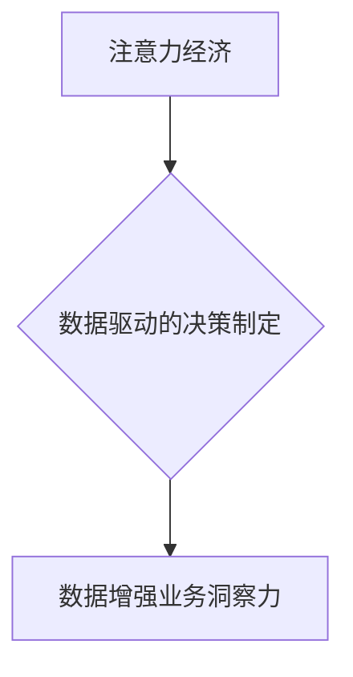

                 

## 1. 背景介绍

在当今信息爆炸的时代，人们面临着前所未有的信息过载。注意力已经成为一种稀缺资源，而如何有效地获取和利用注意力，成为了企业和个人都面临的重大挑战。数据驱动的决策制定，则成为了应对信息过载、提升决策效率的有效手段。

传统决策制定往往依赖于经验和直觉，容易受到主观因素的影响，难以保证决策的客观性和准确性。而数据驱动的决策制定，则通过收集、分析和挖掘数据，为决策提供科学依据，从而提升决策的质量和效率。

随着人工智能技术的快速发展，数据分析和挖掘能力得到了显著提升。深度学习、机器学习等算法能够从海量数据中提取出隐藏的模式和规律，为决策制定提供更精准的洞察力。

## 2. 核心概念与联系

### 2.1 注意力经济

注意力经济是指在信息过载的时代，人们对信息的获取和处理能力有限，而注意力成为了稀缺资源的经济学理论。

在注意力经济中，人们会根据自身的需求和兴趣，选择关注特定的信息，而忽略其他信息。企业需要通过各种手段，吸引用户的注意力，并提供有价值的信息，才能在竞争激烈的市场中脱颖而出。

### 2.2 数据驱动的决策制定

数据驱动的决策制定是指利用数据分析和挖掘技术，为决策提供科学依据的决策方式。

数据驱动的决策制定流程通常包括以下几个步骤：

1. 数据收集：收集相关领域的各种数据，包括结构化数据、非结构化数据等。
2. 数据清洗：对收集到的数据进行清洗和处理，去除噪声和异常值，保证数据的质量。
3. 数据分析：利用数据挖掘、机器学习等技术，对数据进行分析和挖掘，提取出有价值的洞察力。
4. 模型构建：根据分析结果，构建决策模型，预测未来趋势或优化决策方案。
5. 决策执行：根据模型预测结果，制定决策方案，并进行执行和评估。

### 2.3 数据增强业务洞察力

数据能够增强业务洞察力，帮助企业更好地了解市场趋势、客户需求和自身运营状况。

通过数据分析，企业可以：

* 识别市场趋势：分析市场数据，识别潜在的市场机会和风险。
* 了解客户需求：分析客户行为数据，了解客户需求和偏好。
* 优化运营效率：分析运营数据，优化生产流程、销售策略和客户服务等。
* 提升产品创新：分析用户反馈数据，改进现有产品和开发新产品。

**核心概念与联系流程图**



## 3. 核心算法原理 & 具体操作步骤

### 3.1 算法原理概述

数据驱动的决策制定中，常用的算法包括：

* **回归算法:** 用于预测连续数值型变量，例如销售额、客户流失率等。
* **分类算法:** 用于预测类别型变量，例如客户是否会购买产品、产品是否会发生故障等。
* **聚类算法:** 用于将数据点分组，例如将客户分为不同消费群体、将产品分为不同类别等。
* **关联规则挖掘算法:** 用于发现数据中存在的关联关系，例如哪些产品经常一起购买、哪些客户具有相似的购买行为等。

### 3.2 算法步骤详解

以回归算法为例，其步骤如下：

1. **数据收集和预处理:** 收集相关数据，并进行清洗、转换和特征工程等预处理操作。
2. **模型选择:** 根据具体问题选择合适的回归算法，例如线性回归、逻辑回归、支持向量机回归等。
3. **模型训练:** 使用训练数据训练模型，调整模型参数，使模型能够准确预测目标变量。
4. **模型评估:** 使用测试数据评估模型的性能，例如使用均方误差、R-squared等指标。
5. **模型部署:** 将训练好的模型部署到生产环境中，用于预测新的数据。

### 3.3 算法优缺点

不同的算法具有不同的优缺点，需要根据具体问题选择合适的算法。

例如，线性回归算法简单易实现，但对数据分布有较高的要求；支持向量机回归算法能够处理非线性关系，但训练时间较长。

### 3.4 算法应用领域

数据驱动的决策制定算法广泛应用于各个领域，例如：

* **金融领域:** 预测股票价格、评估信用风险、识别欺诈行为等。
* **电商领域:** 预测用户购买行为、推荐商品、优化广告投放等。
* **医疗领域:** 诊断疾病、预测患者风险、个性化治疗等。
* **制造业:** 预测设备故障、优化生产流程、控制质量等。

## 4. 数学模型和公式 & 详细讲解 & 举例说明

### 4.1 数学模型构建

数据驱动的决策制定中，常用的数学模型包括线性回归模型、逻辑回归模型、支持向量机模型等。

例如，线性回归模型的数学表达式为：

$$y = \beta_0 + \beta_1x_1 + \beta_2x_2 + ... + \beta_nx_n + \epsilon$$

其中：

* $y$ 是目标变量
* $x_1, x_2, ..., x_n$ 是自变量
* $\beta_0, \beta_1, \beta_2, ..., \beta_n$ 是模型参数
* $\epsilon$ 是误差项

### 4.2 公式推导过程

模型参数的估计可以通过最小二乘法等方法进行。

最小二乘法是指通过最小化模型预测值与实际值之间的平方误差，来估计模型参数。

### 4.3 案例分析与讲解

例如，假设我们想要预测房屋价格，自变量包括房屋面积、房屋朝向、房屋楼层等。

我们可以使用线性回归模型，将房屋价格作为目标变量，将房屋面积、房屋朝向、房屋楼层等作为自变量。

通过训练模型，我们可以得到模型参数，并使用这些参数预测新的房屋价格。

## 5. 项目实践：代码实例和详细解释说明

### 5.1 开发环境搭建

数据驱动的决策制定项目开发环境通常包括：

* 操作系统：Windows、Linux、macOS等
* 编程语言：Python、R、Java等
* 数据分析工具：Pandas、NumPy、Scikit-learn等
* 可视化工具：Matplotlib、Seaborn等

### 5.2 源代码详细实现

以下是一个使用Python语言和Scikit-learn库实现线性回归模型的代码示例：

```python
import pandas as pd
from sklearn.linear_model import LinearRegression
from sklearn.model_selection import train_test_split

# 加载数据
data = pd.read_csv('housing_data.csv')

# 分割数据
X = data[['面积', '朝向', '楼层']]
y = data['价格']
X_train, X_test, y_train, y_test = train_test_split(X, y, test_size=0.2, random_state=42)

# 创建线性回归模型
model = LinearRegression()

# 训练模型
model.fit(X_train, y_train)

# 预测测试数据
y_pred = model.predict(X_test)

# 评估模型性能
from sklearn.metrics import mean_squared_error
mse = mean_squared_error(y_test, y_pred)
print('均方误差:', mse)
```

### 5.3 代码解读与分析

* 首先，我们使用Pandas库加载数据，并使用Scikit-learn库的train_test_split函数将数据分割成训练集和测试集。
* 然后，我们创建线性回归模型，并使用fit函数训练模型。
* 训练完成后，我们可以使用predict函数预测测试数据的目标变量值。
* 最后，我们使用mean_squared_error函数评估模型的性能。

### 5.4 运行结果展示

运行上述代码后，会输出模型的均方误差值。

均方误差值越小，模型的预测精度越高。

## 6. 实际应用场景

### 6.1 市场营销

数据驱动的决策制定可以帮助企业优化营销策略，提高营销效率。

例如，企业可以利用客户行为数据，进行精准营销，向目标客户推送个性化的广告和产品推荐。

### 6.2 产品开发

数据驱动的决策制定可以帮助企业了解客户需求，开发更符合市场需求的产品。

例如，企业可以利用用户反馈数据，改进现有产品，并开发新的产品。

### 6.3 风险管理

数据驱动的决策制定可以帮助企业识别和评估风险，制定有效的风险管理策略。

例如，金融机构可以利用客户信用数据，评估客户的信用风险，并制定相应的贷款政策。

### 6.4 未来应用展望

随着人工智能技术的不断发展，数据驱动的决策制定将会在更多领域得到应用。

例如，在医疗领域，数据驱动的决策制定可以帮助医生进行更精准的诊断和治疗；在教育领域，数据驱动的决策制定可以帮助老师个性化教学，提高学生的学习效果。

## 7. 工具和资源推荐

### 7.1 学习资源推荐

* **书籍:**
    * 《Python数据科学手册》
    * 《机器学习实战》
    * 《数据挖掘：概念与技术》
* **在线课程:**
    * Coursera上的数据科学课程
    * edX上的机器学习课程
    * Udemy上的数据分析课程

### 7.2 开发工具推荐

* **编程语言:** Python
* **数据分析工具:** Pandas, NumPy, Scikit-learn
* **可视化工具:** Matplotlib, Seaborn
* **云计算平台:** AWS, Azure, GCP

### 7.3 相关论文推荐

* **Attention Is All You Need**
* **BERT: Pre-training of Deep Bidirectional Transformers for Language Understanding**
* **Deep Learning**

## 8. 总结：未来发展趋势与挑战

### 8.1 研究成果总结

数据驱动的决策制定已经取得了显著的成果，在各个领域得到了广泛应用。

人工智能技术的不断发展，为数据驱动的决策制定提供了强大的技术支撑。

### 8.2 未来发展趋势

未来，数据驱动的决策制定将会朝着以下几个方向发展：

* **更加智能化:** 利用深度学习等更先进的算法，实现更加智能化的决策制定。
* **更加个性化:** 根据用户的个人特征和需求，提供更加个性化的决策建议。
* **更加实时化:** 利用实时数据流，实现更加实时的数据分析和决策制定。

### 8.3 面临的挑战

数据驱动的决策制定也面临着一些挑战：

* **数据质量问题:** 数据质量问题会影响决策的准确性。
* **算法解释性问题:** 一些深度学习算法的决策过程难以解释，这可能会导致决策的可信度降低。
* **伦理问题:** 数据驱动的决策制定可能会带来一些伦理问题，例如数据隐私问题、算法偏见问题等。

### 8.4 研究展望

未来，需要进一步研究如何解决数据驱动的决策制定面临的挑战，使其更加智能化、个性化、实时化，并确保其伦理安全性。

## 9. 附录：常见问题与解答

### 9.1 如何选择合适的算法？

选择合适的算法需要根据具体问题和数据特点进行考虑。

例如，如果目标变量是连续数值型变量，可以选择回归算法；如果目标变量是类别型变量，可以选择分类算法。

### 9.2 如何评估模型性能？

模型性能可以通过各种指标进行评估，例如均方误差、R-squared、准确率、召回率等。

选择合适的评估指标需要根据具体问题和算法类型进行考虑。

### 9.3 如何解决数据质量问题？

数据质量问题可以通过数据清洗、数据转换、数据集成等方法进行解决。

数据清洗包括删除重复数据、处理缺失值、去除噪声等操作；数据转换包括将数据转换为统一格式、进行数据编码等操作；数据集成包括将来自不同来源的数据整合在一起等操作。


作者：禅与计算机程序设计艺术 / Zen and the Art of Computer Programming 
<end_of_turn>

