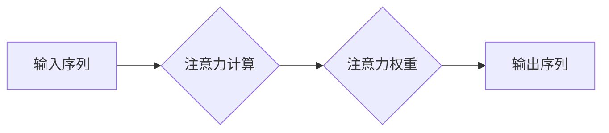

                 

## 深度学习在注意力预测中的应用

> 关键词：深度学习、注意力机制、预测模型、自然语言处理、计算机视觉

## 1. 背景介绍

注意力机制（Attention Mechanism）是近年来深度学习领域的一项重要突破，它能够帮助模型聚焦于输入序列中最重要的部分，从而提高模型的性能。注意力机制最初在机器翻译领域得到应用，后来被广泛应用于自然语言处理（NLP）、计算机视觉（CV）等多个领域。

注意力机制的核心思想是赋予模型“注意力”的能力，使其能够根据输入序列的不同位置的重要性，分配不同的权重。例如，在机器翻译中，模型可以将注意力集中在与目标语言单词相关的源语言单词上，从而更好地理解语义关系。

传统的深度学习模型，例如循环神经网络（RNN），在处理长序列数据时会面临“梯度消失”和“梯度爆炸”的问题，导致模型难以学习长距离依赖关系。注意力机制能够有效解决这些问题，因为它能够捕捉到输入序列中不同位置之间的关系，并根据这些关系分配注意力权重。

## 2. 核心概念与联系

### 2.1 注意力机制的原理

注意力机制的核心是计算每个输入元素与输出元素之间的相关性，并根据相关性分配注意力权重。

**流程图：**



### 2.2 注意力机制的类型

常见的注意力机制类型包括：

* **软注意力（Soft Attention）：** 使用一个权重向量来表示每个输入元素的重要性，权重向量通过softmax函数归一化得到。
* **硬注意力（Hard Attention）：** 在每个时间步选择一个输入元素作为注意力焦点，忽略其他元素。

### 2.3 注意力机制的应用场景

注意力机制在以下场景中得到了广泛应用：

* **机器翻译:** 帮助模型关注与目标语言单词相关的源语言单词。
* **文本摘要:** 帮助模型识别文本中最关键的信息。
* **问答系统:** 帮助模型找到与问题相关的关键信息。
* **图像识别:** 帮助模型关注图像中最相关的区域。

## 3. 核心算法原理 & 具体操作步骤

### 3.1 算法原理概述

深度学习在注意力预测中的应用主要基于以下核心算法：

* **Transformer:** Transformer是一种基于注意力机制的序列到序列模型，它能够有效处理长序列数据，并取得了在机器翻译、文本摘要等任务上的优异性能。
* **BERT:** BERT是一种基于Transformer的预训练语言模型，它在大量的文本数据上进行预训练，能够捕捉到语言的深层语义关系，并应用于各种自然语言处理任务。

### 3.2 算法步骤详解

**Transformer模型的注意力机制步骤：**

1. **计算查询（Query）、键（Key）和值（Value）:** 将输入序列中的每个词向量分别转换为查询向量、键向量和值向量。
2. **计算注意力权重:** 使用查询向量和键向量之间的点积计算注意力权重。
3. **加权求和:** 使用注意力权重对值向量进行加权求和，得到注意力输出。

**BERT模型的注意力机制步骤:**

1. **嵌入层:** 将输入文本转换为词向量。
2. **多头注意力层:** 使用多头注意力机制对词向量进行处理，捕捉到不同词之间的关系。
3. **前馈神经网络层:** 对注意力输出进行进一步处理。
4. **输出层:** 根据任务类型，输出相应的预测结果。

### 3.3 算法优缺点

**Transformer模型的优点:**

* 能够有效处理长序列数据。
* 并行计算能力强。
* 表现出优异的性能。

**Transformer模型的缺点:**

* 计算复杂度高。
* 参数量大。

**BERT模型的优点:**

* 预训练模型，能够在多种任务上取得良好的性能。
* 捕捉到语言的深层语义关系。

**BERT模型的缺点:**

* 需要大量的训练数据。
* 计算复杂度高。

### 3.4 算法应用领域

注意力机制在以下领域得到了广泛应用:

* **自然语言处理:** 机器翻译、文本摘要、问答系统、情感分析等。
* **计算机视觉:** 图像识别、目标检测、图像分割等。
* **语音识别:** 语音转文本、语音合成等。

## 4. 数学模型和公式 & 详细讲解 & 举例说明

### 4.1 数学模型构建

注意力机制的数学模型可以概括为以下公式：

$$
\text{Attention}(Q, K, V) = \text{softmax}\left(\frac{Q K^T}{\sqrt{d_k}}\right) V
$$

其中：

* $Q$：查询向量
* $K$：键向量
* $V$：值向量
* $d_k$：键向量的维度
* $\text{softmax}$：softmax函数

### 4.2 公式推导过程

注意力机制的核心是计算查询向量与键向量的相关性。

* 点积运算：$QK^T$ 计算查询向量与键向量的点积，表示两者之间的相关性。
* 归一化：$\frac{QK^T}{\sqrt{d_k}}$ 对点积结果进行归一化，使得注意力权重在0到1之间。
* softmax函数：$\text{softmax}$ 函数将归一化后的结果转换为概率分布，表示每个键向量的重要性。

### 4.3 案例分析与讲解

**举例说明：**

假设我们有一个句子“我爱学习编程”，我们要预测每个单词的注意力权重。

* 将每个单词转换为词向量，作为查询向量、键向量和值向量。
* 计算每个词向量之间的点积，得到注意力权重。
* 使用softmax函数将注意力权重转换为概率分布。

最终，每个单词的注意力权重表示了它在句子中被关注的程度。例如，“学习”和“编程”的注意力权重可能较高，因为它们是句子中最重要的信息。

## 5. 项目实践：代码实例和详细解释说明

### 5.1 开发环境搭建

* Python 3.6+
* TensorFlow 2.0+
* PyTorch 1.0+

### 5.2 源代码详细实现

```python
import tensorflow as tf

# 定义注意力机制层
class AttentionLayer(tf.keras.layers.Layer):
    def __init__(self, units):
        super(AttentionLayer, self).__init__()
        self.Wq = tf.keras.layers.Dense(units)
        self.Wk = tf.keras.layers.Dense(units)
        self.Wv = tf.keras.layers.Dense(units)
        self.softmax = tf.keras.layers.Softmax()

    def call(self, inputs):
        # 分别计算查询向量、键向量和值向量
        q = self.Wq(inputs)
        k = self.Wk(inputs)
        v = self.Wv(inputs)

        # 计算注意力权重
        attention_weights = self.softmax(tf.matmul(q, k, transpose_b=True) / tf.math.sqrt(tf.cast(units, tf.float32)))

        # 加权求和得到注意力输出
        output = tf.matmul(attention_weights, v)
        return output

# 定义Transformer模型
class Transformer(tf.keras.Model):
    def __init__(self, units, num_heads):
        super(Transformer, self).__init__()
        self.attention_layer = AttentionLayer(units)
        # ... 其他层

    def call(self, inputs):
        # ... 模型前向传播过程
        return output

```

### 5.3 代码解读与分析

* `AttentionLayer` 类定义了一个注意力机制层，包含三个稠密层用于计算查询向量、键向量和值向量，以及一个softmax函数用于计算注意力权重。
* `Transformer` 类定义了一个Transformer模型，包含一个注意力层和其他层。

### 5.4 运行结果展示

运行模型并评估其性能，例如在机器翻译任务上的BLEU分数。

## 6. 实际应用场景

### 6.1 机器翻译

注意力机制在机器翻译中被广泛应用，能够帮助模型更好地理解源语言和目标语言之间的语义关系，从而提高翻译质量。

### 6.2 文本摘要

注意力机制可以帮助模型识别文本中最关键的信息，并生成简洁准确的摘要。

### 6.3 问答系统

注意力机制可以帮助模型找到与问题相关的关键信息，并生成准确的答案。

### 6.4 未来应用展望

注意力机制在未来将继续在更多领域得到应用，例如：

* **对话系统:** 帮助模型更好地理解用户意图，并生成更自然流畅的对话。
* **代码生成:** 帮助模型生成更准确、更符合语法的代码。
* **药物发现:** 帮助模型识别潜在的药物靶点。

## 7. 工具和资源推荐

### 7.1 学习资源推荐

* **论文:**
    * Vaswani, A., Shazeer, N., Parmar, N., Uszkoreit, J., Jones, L., Gomez, A. N., ... & Polosukhin, I. (2017). Attention is all you need. Advances in neural information processing systems, 30.
    * Devlin, J., Chang, M. W., Lee, K., & Toutanova, K. (2018). Bert: Pre-training of deep bidirectional transformers for language understanding. arXiv preprint arXiv:1810.04805.
* **博客:**
    * Jay Alammar's Blog: https://jalammar.github.io/
    * TensorFlow Blog: https://blog.tensorflow.org/

### 7.2 开发工具推荐

* **TensorFlow:** https://www.tensorflow.org/
* **PyTorch:** https://pytorch.org/

### 7.3 相关论文推荐

* **Transformer-XL:** https://arxiv.org/abs/1901.08316
* **BERT:** https://arxiv.org/abs/1810.04805
* **XLNet:** https://arxiv.org/abs/1906.08237

## 8. 总结：未来发展趋势与挑战

### 8.1 研究成果总结

深度学习在注意力预测中的应用取得了显著的成果，例如Transformer和BERT模型在多个任务上取得了state-of-the-art性能。

### 8.2 未来发展趋势

* **更强大的注意力机制:** 研究更有效的注意力机制，例如长距离依赖关系的注意力机制。
* **多模态注意力:** 研究跨模态的注意力机制，例如将文本和图像信息融合在一起。
* **可解释性:** 研究注意力机制的可解释性，以便更好地理解模型的决策过程。

### 8.3 面临的挑战

* **计算复杂度:** 现有的注意力机制计算复杂度较高，难以应用于大规模数据。
* **参数量:** 现有的注意力机制参数量较大，需要大量的计算资源进行训练。
* **数据标注:** 训练注意力机制模型需要大量的标注数据，这在某些领域比较困难。

### 8.4 研究展望

未来，注意力机制将继续是深度学习研究的热点方向，并将在更多领域得到应用。


## 9. 附录：常见问题与解答

* **Q: 注意力机制的原理是什么？**

A: 注意力机制的核心是计算输入序列中每个元素与输出元素之间的相关性，并根据相关性分配注意力权重。

* **Q: 注意力机制有哪些类型？**

A: 常见的注意力机制类型包括软注意力和硬注意力。

* **Q: 注意力机制有哪些应用场景？**

A: 注意力机制在自然语言处理、计算机视觉等多个领域得到了广泛应用。


作者：禅与计算机程序设计艺术 / Zen and the Art of Computer Programming 
<end_of_turn>

