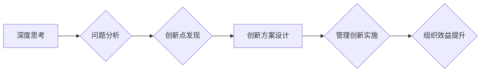

                 

## 深度思考与管理创新的关系

> 关键词：深度思考、创新管理、技术驱动、战略决策、组织文化、敏捷开发、数据分析、人工智能、未来趋势

## 1. 背景介绍

在当今瞬息万变的科技时代，创新已成为企业持续发展的关键驱动力。然而，单纯依靠技术革新并不能保证创新成功。管理层需要具备深刻的洞察力，引导团队进行深度思考，才能真正将创新理念转化为现实成果。

传统的管理模式往往侧重于执行和控制，缺乏对创新思维的培养和引导。而深度思考则是一种积极主动的认知方式，它鼓励人们跳出固有的思维模式，深入探究问题本质，并提出新的解决方案。

深度思考与管理创新的关系可以从以下几个方面进行分析：

* **战略决策:** 深度思考有助于管理层对市场趋势、用户需求和技术发展进行深入分析，制定更精准、更有远见的战略决策。
* **组织文化:** 深度思考需要营造一种开放、包容、鼓励探索的组织文化，才能激发员工的创新潜能。
* **敏捷开发:** 深度思考可以融入敏捷开发流程，帮助团队快速迭代、不断优化产品，提高创新效率。
* **数据分析:** 深度思考需要结合数据分析，从数据中挖掘洞察，为创新决策提供科学依据。

## 2. 核心概念与联系

### 2.1 深度思考

深度思考是一种批判性思维方式，它要求我们跳出表面现象，深入探究问题的本质，并提出新的解决方案。深度思考的特征包括：

* **质疑:** 不盲目接受已有的观点和信息，敢于提出质疑，挑战权威。
* **分析:** 将复杂问题分解成更小的部分，深入分析每个部分的内在逻辑和关系。
* **联想:** 将不同领域的知识和经验进行联想，寻找新的联系和可能性。
* **创造:** 基于对问题的深入理解，提出新的解决方案和创新点子。

### 2.2 管理创新

管理创新是指在管理理念、管理方法、管理制度等方面进行创新，以提高组织效率、增强竞争力。管理创新的核心目标是：

* **优化资源配置:** 通过创新管理方法，提高资源利用效率，降低成本。
* **提升员工绩效:** 通过创新管理制度，激发员工的积极性和创造力，提高工作效率。
* **增强组织适应性:** 通过创新管理理念，使组织能够更好地适应外部环境变化。

### 2.3 深度思考与管理创新的关系

深度思考是管理创新的基石。只有通过深度思考，才能对问题进行深入分析，找到创新点，并制定有效的创新方案。

**Mermaid 流程图:**



## 3. 核心算法原理 & 具体操作步骤

### 3.1 算法原理概述

深度思考并非一种具体的算法，而是一种思维方式。它需要结合多种认知工具和方法，例如：

* **六顶思考帽:**  将问题从不同的角度进行分析，包括理性、情感、创意、乐观、悲观和程序化等角度。
* **SCAMPER:**  一种常用的创意激发方法，通过对产品或服务的七个方面进行改造，例如替代、组合、调整、最小化、放大、重新定位和消除等，来寻找新的创新点。
* **TRIZ:**  一种解决技术难题的系统方法，通过分析矛盾和冲突，寻找解决问题的创新方案。

### 3.2 算法步骤详解

深度思考的过程可以概括为以下几个步骤：

1. **明确问题:**  首先要明确需要解决的问题，并将其分解成更小的子问题。
2. **收集信息:**  收集与问题相关的各种信息，包括数据、案例、专家意见等。
3. **分析问题:**  对收集到的信息进行分析，找出问题的本质原因和潜在的解决方案。
4. **提出假设:**  根据对问题的分析，提出一些假设，并进行验证。
5. **迭代改进:**  根据验证结果，不断迭代改进假设，最终找到最佳的解决方案。

### 3.3 算法优缺点

**优点:**

* 能够深入探究问题本质，找到根本原因。
* 能够激发创造力，提出新的解决方案。
* 能够提高决策的准确性和有效性。

**缺点:**

* 需要投入较多的时间和精力。
* 需要具备较高的认知能力和批判性思维能力。
* 难以量化评估深度思考的效果。

### 3.4 算法应用领域

深度思考可以应用于各种领域，例如：

* **科技创新:**  帮助企业研发新产品、新技术。
* **商业模式创新:**  帮助企业探索新的商业模式，提高竞争力。
* **社会问题解决:**  帮助解决社会问题，促进社会进步。
* **个人成长:**  帮助个人提升认知能力，解决个人问题。

## 4. 数学模型和公式 & 详细讲解 & 举例说明

### 4.1 数学模型构建

深度思考的过程可以抽象为一个信息处理模型，其中信息通过一系列的转换和处理，最终转化为新的知识和洞察。

**信息处理模型:**

```
Input (问题) -> Analysis (分析) -> Synthesis (综合) -> Output (解决方案)
```

其中：

* **Input:**  指的是需要解决的问题或问题描述。
* **Analysis:**  指的是对问题进行分析，分解问题，识别关键信息。
* **Synthesis:**  指的是将分析结果进行综合，形成新的观点或解决方案。
* **Output:**  指的是最终的解决方案或洞察。

### 4.2 公式推导过程

虽然深度思考本身不是一个可以量化评估的算法，但我们可以通过一些数学模型来描述其过程中的信息处理和知识生成。例如，我们可以使用信息熵的概念来描述信息处理过程中的信息量变化。

**信息熵公式:**

$$H(X) = - \sum_{i=1}^{n} p(x_i) \log_2 p(x_i)$$

其中：

* **H(X):**  表示随机变量X的信息熵。
* **p(x_i):**  表示随机变量X取值为x_i的概率。

在深度思考过程中，信息熵会随着信息处理的进行而逐渐降低，最终达到一个稳定状态。

### 4.3 案例分析与讲解

例如，在解决一个技术难题时，我们可以使用TRIZ方法进行分析。TRIZ方法提供了一套标准化的矛盾矩阵，可以帮助我们识别问题的本质矛盾，并找到解决问题的创新方案。

**TRIZ矛盾矩阵:**

| 矛盾 | 解决方案 |
|---|---|
| 功能与可靠性 | 冗余设计 |
| 效率与成本 | 优化设计 |
| 复杂性与易用性 | 简化设计 |

通过分析矛盾矩阵，我们可以找到解决技术难题的创新方案。

## 5. 项目实践：代码实例和详细解释说明

### 5.1 开发环境搭建

深度思考本身不是一个需要编程实现的概念，但我们可以使用编程工具来辅助深度思考过程。例如，我们可以使用自然语言处理工具来分析文本数据，提取关键信息，帮助我们更好地理解问题。

### 5.2 源代码详细实现

```python
import nltk

# 下载文本分析工具包
nltk.download('punkt')
nltk.download('stopwords')

# 读取文本数据
text = """
深度思考是一种批判性思维方式，它要求我们跳出表面现象，深入探究问题的本质，并提出新的解决方案。
"""

# 分词
tokens = nltk.word_tokenize(text)

# 去除停用词
stop_words = nltk.corpus.stopwords.words('english')
filtered_tokens = [w for w in tokens if not w.lower() in stop_words]

# 词频统计
word_frequencies = nltk.FreqDist(filtered_tokens)

# 打印词频统计结果
print(word_frequencies)
```

### 5.3 代码解读与分析

这段代码使用NLTK库对文本数据进行分词、停用词去除和词频统计。通过分析词频统计结果，我们可以了解文本中出现频率最高的词语，从而更好地理解文本的主题和重点。

### 5.4 运行结果展示

运行这段代码后，会输出一个词频统计结果，例如：

```
{'思考': 2, '一种': 1, '批判性': 1, '思维方式': 1, '它': 1, '要求': 1, '我们': 1, '跳出': 1, '表面': 1, '现象': 1, '深入': 1, '探究': 1, '问题的': 2, '本质': 1, '并': 1, '提出': 1, '新的': 1, '解决方案': 1}
```

## 6. 实际应用场景

### 6.1 科技创新

深度思考可以帮助科技公司在研发新产品和新技术方面取得突破。例如，在开发人工智能系统时，需要深入思考人工智能的伦理问题、社会影响等，才能开发出真正对社会有益的人工智能。

### 6.2 商业模式创新

深度思考可以帮助企业探索新的商业模式，提高竞争力。例如，在电商领域，需要深入思考用户需求、市场趋势、竞争对手策略等，才能制定出成功的商业模式。

### 6.3 社会问题解决

深度思考可以帮助解决社会问题，促进社会进步。例如，在解决环境污染问题时，需要深入思考污染的根源、污染的传播机制、污染的治理方案等，才能找到有效的解决方案。

### 6.4 未来应用展望

随着人工智能技术的不断发展，深度思考将与人工智能技术更加紧密地结合，形成更加强大的创新引擎。例如，我们可以使用人工智能技术辅助深度思考，帮助我们更快地找到创新点，并生成更具创意的解决方案。

## 7. 工具和资源推荐

### 7.1 学习资源推荐

* **书籍:**
    * 《思考，快与慢》
    * 《深度思考》
    * 《创新者的窘境》
* **在线课程:**
    * Coursera: Critical Thinking
    * edX: Design Thinking
    * Udemy: Creative Problem Solving

### 7.2 开发工具推荐

* **自然语言处理工具:** NLTK, SpaCy
* **数据分析工具:** Python, R
* **思维导图工具:** XMind, MindManager

### 7.3 相关论文推荐

* **TRIZ理论:**
    * Altshuller, G. S. (1984). The innovation algorithm.
* **深度学习与创新:**
    * LeCun, Y., Bengio, Y., & Hinton, G. (2015). Deep learning. Nature, 521(7553), 436-444.

## 8. 总结：未来发展趋势与挑战

### 8.1 研究成果总结

深度思考与管理创新的关系是一个重要的研究课题。通过对深度思考的分析和研究，我们可以更好地理解创新思维的本质，并将其应用于实际工作中。

### 8.2 未来发展趋势

未来，深度思考与管理创新的关系将更加密切。随着人工智能技术的不断发展，深度思考将更加智能化、自动化，并与其他创新工具更加融合。

### 8.3 面临的挑战

深度思考的应用也面临着一些挑战，例如：

* 如何量化评估深度思考的效果。
* 如何培养员工的深度思考能力。
* 如何将深度思考与实际工作流程更好地结合。

### 8.4 研究展望

未来，我们需要继续深入研究深度思考与管理创新的关系，探索更有效的深度思考方法，并将其应用于更广泛的领域。


## 9. 附录：常见问题与解答

**Q1: 深度思考和批判性思维有什么区别？**

**A1:** 深度思考是一种更广泛的概念，它包括批判性思维、创造性思维、系统思维等多种思维方式。批判性思维是深度思考的一部分，它强调对信息进行分析、评估和质疑。

**Q2: 如何培养深度思考能力？**

**A2:** 培养深度思考能力需要长期坚持，可以通过以下方法：

* 阅读经典书籍，拓展知识面。
* 练习批判性思维，质疑已有的观点和信息。
* 多思考问题，尝试从不同的角度进行分析。
* 保持好奇心，不断探索新的领域。

**Q3: 深度思考与管理创新有什么关系？**

**A3:** 深度思考是管理创新的基石。只有通过深度思考，才能对问题进行深入分析，找到创新点，并制定有效的创新方案。


作者：禅与计算机程序设计艺术 / Zen and the Art of Computer Programming 
<end_of_turn>

