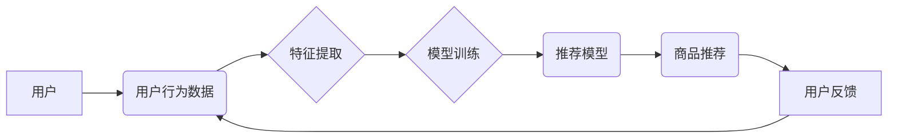

                 

## 电商平台中AI推荐算法的实现方案

> 关键词：推荐算法、协同过滤、内容过滤、深度学习、电商平台、个性化推荐、模型评估、A/B测试

## 1. 背景介绍

在当今数据爆炸的时代，电商平台面临着海量商品和用户，如何精准推荐用户感兴趣的商品，提升用户体验和转化率成为关键挑战。传统的推荐方法，例如基于规则的推荐，难以满足个性化需求和数据规模的增长。因此，人工智能（AI）推荐算法应运而生，利用机器学习和深度学习技术，从用户行为、商品属性等多方面数据中挖掘用户偏好，实现个性化、精准的商品推荐。

## 2. 核心概念与联系

**2.1 核心概念**

* **推荐系统:**  旨在根据用户的历史行为、偏好和上下文信息，预测用户对商品的兴趣，并提供个性化的商品推荐。
* **协同过滤:**  一种基于用户-商品交互矩阵的推荐算法，通过分析用户对相似商品的评分或购买行为，预测用户对其他商品的兴趣。
* **内容过滤:**  一种基于商品属性和用户偏好的推荐算法，通过分析商品的特征和用户对商品特征的喜好，推荐用户可能感兴趣的商品。
* **深度学习:**  一种机器学习方法，利用多层神经网络学习数据特征，能够处理复杂的数据关系和模式，实现更精准的推荐。

**2.2 架构图**



## 3. 核心算法原理 & 具体操作步骤

**3.1 算法原理概述**

本文将介绍两种常用的推荐算法：协同过滤和内容过滤。

* **协同过滤:**  基于用户-商品交互矩阵，通过计算用户之间的相似度或商品之间的相似度，预测用户对其他商品的兴趣。
    * **用户-基于用户的协同过滤:**  根据用户对商品的评分或购买行为，计算用户之间的相似度，然后推荐给某个用户，其他相似用户喜欢的商品。
    * **商品-基于商品的协同过滤:**  根据用户对商品的评分或购买行为，计算商品之间的相似度，然后推荐给某个用户，与用户之前购买或评分相似的商品。
* **内容过滤:**  基于商品的属性和用户对商品属性的偏好，推荐用户可能感兴趣的商品。
    * **基于关键词匹配:**  根据用户搜索的关键词或浏览过的商品，推荐包含相同关键词或类似属性的商品。
    * **基于机器学习:**  利用机器学习算法，学习用户对商品属性的偏好，并推荐符合用户偏好的商品。

**3.2 算法步骤详解**

**协同过滤算法步骤:**

1. **数据收集:**  收集用户对商品的评分或购买行为数据。
2. **数据预处理:**  处理缺失值、异常值等问题，并对数据进行标准化或归一化。
3. **相似度计算:**  计算用户之间的相似度或商品之间的相似度。常用的相似度计算方法包括余弦相似度、皮尔逊相关系数等。
4. **推荐生成:**  根据用户相似度或商品相似度，推荐用户可能感兴趣的商品。

**内容过滤算法步骤:**

1. **商品特征提取:**  提取商品的属性特征，例如商品类别、品牌、价格、描述等。
2. **用户偏好学习:**  利用机器学习算法，学习用户对商品属性的偏好。
3. **推荐生成:**  根据用户偏好和商品特征，推荐用户可能感兴趣的商品。

**3.3 算法优缺点**

| 算法 | 优点 | 缺点 |
|---|---|---|
| 协同过滤 |  能够发现隐含的用户偏好，推荐个性化商品 | 需要大量用户数据，容易出现冷启动问题 |
| 内容过滤 |  不需要大量用户数据，能够解释推荐理由 | 容易陷入局部最优，难以发现用户潜在需求 |

**3.4 算法应用领域**

* **电商平台:**  推荐商品、个性化营销
* **视频网站:**  推荐视频、内容发现
* **音乐平台:**  推荐歌曲、音乐发现
* **社交媒体:**  推荐好友、内容

## 4. 数学模型和公式 & 详细讲解 & 举例说明

**4.1 数学模型构建**

协同过滤算法的核心是用户-商品交互矩阵，用 $R$ 表示，其中 $R_{ui}$ 表示用户 $u$ 对商品 $i$ 的评分或购买行为。

**4.2 公式推导过程**

**用户-基于用户的协同过滤:**

1. 计算用户 $u$ 和用户 $v$ 的相似度 $sim(u,v)$:

$$sim(u,v) = \frac{\sum_{i=1}^{N} (R_{ui} - \bar{R}_u)(R_{vi} - \bar{R}_v)}{\sqrt{\sum_{i=1}^{N} (R_{ui} - \bar{R}_u)^2} \sqrt{\sum_{i=1}^{N} (R_{vi} - \bar{R}_v)^2}}$$

其中， $\bar{R}_u$ 和 $\bar{R}_v$ 分别是用户 $u$ 和用户 $v$ 的平均评分。

2. 预测用户 $u$ 对商品 $i$ 的评分 $\hat{R}_{ui}$:

$$\hat{R}_{ui} = \bar{R}_u + \frac{\sum_{v \in N(u)} sim(u,v) (R_{vi} - \bar{R}_v)}{\sum_{v \in N(u)} sim(u,v)}$$

其中， $N(u)$ 是用户 $u$ 的邻居用户集合。

**4.3 案例分析与讲解**

假设有两个用户 $u$ 和 $v$，他们对三件商品 $i$, $j$, $k$ 的评分如下:

| 用户 | 商品 $i$ | 商品 $j$ | 商品 $k$ |
|---|---|---|---|
| $u$ | 5 | 3 | 4 |
| $v$ | 4 | 5 | 3 |

我们可以计算用户 $u$ 和用户 $v$ 的相似度，并预测用户 $u$ 对商品 $k$ 的评分。

**5. 项目实践：代码实例和详细解释说明**

**5.1 开发环境搭建**

* Python 3.x
* scikit-learn
* pandas
* numpy

**5.2 源代码详细实现**

```python
import pandas as pd
from sklearn.metrics.pairwise import cosine_similarity

# 加载用户-商品交互数据
data = pd.read_csv('user_item_data.csv')

# 构建用户-商品交互矩阵
user_item_matrix = data.pivot_table(index='user_id', columns='item_id', values='rating')

# 计算用户相似度
user_similarity = cosine_similarity(user_item_matrix)

# 预测用户对商品的评分
def predict_rating(user_id, item_id):
    # 获取用户邻居
    neighbors = get_neighbors(user_id, user_similarity)
    # 计算预测评分
    predicted_rating = (
        user_item_matrix.loc[neighbors, item_id].mean() * user_similarity[user_id][neighbors]
    ).sum() / user_similarity[user_id][neighbors].sum()
    return predicted_rating

# 获取用户邻居
def get_neighbors(user_id, user_similarity):
    # 根据相似度排序，选择前k个邻居
    return user_similarity[user_id].argsort()[-5:][::-1]

# 预测用户对商品的评分
predicted_rating = predict_rating(1, 3)
print(f'用户1对商品3的预测评分: {predicted_rating}')
```

**5.3 代码解读与分析**

* 代码首先加载用户-商品交互数据，并构建用户-商品交互矩阵。
* 然后，使用余弦相似度计算用户之间的相似度。
* 接着，定义一个函数 `predict_rating` 来预测用户对商品的评分，该函数根据用户邻居的评分和用户相似度进行加权平均。
* 最后，调用 `predict_rating` 函数预测用户1对商品3的评分。

**5.4 运行结果展示**

运行代码后，会输出用户1对商品3的预测评分。

## 6. 实际应用场景

**6.1 电商平台商品推荐**

电商平台可以利用协同过滤和内容过滤算法，根据用户的浏览历史、购买记录、收藏等行为，推荐用户可能感兴趣的商品。

**6.2 个性化营销**

电商平台可以根据用户的兴趣偏好，进行个性化营销，例如推荐相关的优惠券、促销活动等。

**6.3 内容推荐**

视频网站、音乐平台等可以利用推荐算法，推荐用户可能感兴趣的视频、歌曲等内容。

**6.4 未来应用展望**

随着人工智能技术的不断发展，推荐算法将更加智能化、个性化。未来，推荐算法可能能够：

* 更准确地预测用户的兴趣
* 提供更个性化的推荐
* 更好地理解用户的需求
* 提升用户体验

## 7. 工具和资源推荐

**7.1 学习资源推荐**

* **书籍:**
    * 《推荐系统实践》
    * 《机器学习》
* **在线课程:**
    * Coursera: Recommender Systems
    * edX: Machine Learning

**7.2 开发工具推荐**

* **Python:**  推荐算法开发的常用语言
* **scikit-learn:**  机器学习库
* **pandas:**  数据处理库
* **numpy:**  数值计算库

**7.3 相关论文推荐**

* 《Collaborative Filtering for Implicit Feedback Datasets》
* 《Matrix Factorization Techniques for Recommender Systems》

## 8. 总结：未来发展趋势与挑战

**8.1 研究成果总结**

本文介绍了电商平台中常用的推荐算法，包括协同过滤和内容过滤，并详细讲解了算法原理、步骤和应用场景。

**8.2 未来发展趋势**

* **深度学习:**  深度学习算法能够学习更复杂的特征，提高推荐的准确性。
* **个性化推荐:**  利用用户行为、偏好、上下文等信息，提供更加个性化的推荐。
* **跨平台推荐:**  将用户数据整合到多个平台，实现跨平台的推荐。

**8.3 面临的挑战**

* **数据稀疏性:**  用户-商品交互数据往往是稀疏的，难以训练有效的推荐模型。
* **冷启动问题:**  对于新用户和新商品，缺乏历史数据，难以进行推荐。
* **用户隐私保护:**  推荐算法需要处理大量用户数据，需要保证用户隐私安全。

**8.4 研究展望**

未来，推荐算法的研究将更加注重数据稀疏性、冷启动问题和用户隐私保护等方面的研究，并探索更智能、更个性化的推荐方法。

## 9. 附录：常见问题与解答

* **Q1: 协同过滤和内容过滤哪个算法更好？**

A1: 两种算法各有优缺点，选择哪种算法取决于具体场景和数据特点。

* **Q2: 如何解决数据稀疏性问题？**

A2: 可以使用矩阵分解、隐语义模型等方法，从低维空间中学习用户和商品的特征。

* **Q3: 如何评估推荐算法的性能？**

A3: 常用的评估指标包括准确率、召回率、NDCG等。

作者：禅与计算机程序设计艺术 / Zen and the Art of Computer Programming


<end_of_turn>

