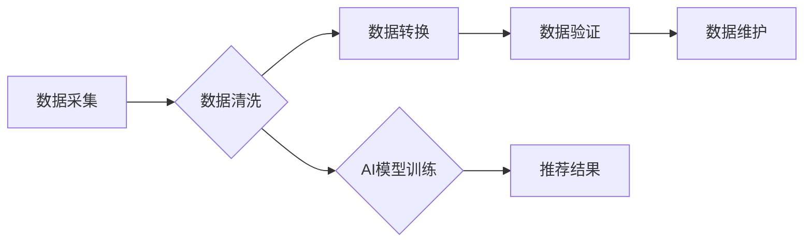

                 

## 电商平台的AI 大模型转型：搜索推荐系统是核心，数据质量控制是关键

> 关键词：电商平台、AI大模型、搜索推荐系统、数据质量控制、Transformer模型、深度学习、自然语言处理、推荐算法、个性化推荐

## 1. 背景介绍

随着人工智能技术的飞速发展，电商平台正经历一场深刻的变革。传统基于规则的搜索和推荐系统逐渐被基于深度学习的AI大模型所取代。AI大模型凭借其强大的学习能力和泛化能力，能够更精准地理解用户需求，提供更个性化的商品推荐，从而提升用户体验和商业效益。

然而，AI大模型的应用并非一帆风顺。数据质量问题是AI大模型应用中面临的一大挑战。电商平台的数据往往庞大、复杂、多类型，存在着大量噪声、缺失值和不一致性等问题。这些问题会直接影响AI大模型的训练效果和推荐精度，甚至导致模型的不可用。

因此，电商平台的AI大模型转型需要从两个方面入手：

* **构建高效的搜索推荐系统：** 充分利用AI大模型的优势，实现精准的商品搜索和个性化的商品推荐。
* **加强数据质量控制：** 确保数据质量，为AI大模型提供高质量的训练数据，提升模型的准确性和可靠性。

## 2. 核心概念与联系

### 2.1  AI大模型

AI大模型是指在海量数据上训练的深度学习模型，具有强大的泛化能力和学习能力。常见的AI大模型包括：

* **Transformer模型:**  Transformer模型是一种基于注意力机制的深度学习模型，在自然语言处理领域取得了突破性的进展，例如BERT、GPT、T5等。
* **生成式对抗网络(GAN):** GAN是一种生成式模型，通过对抗训练生成逼真的数据，例如图像、文本、音频等。
* **图神经网络(GNN):** GNN是一种专门用于处理图结构数据的模型，能够学习图中节点和边的关系，例如社交网络分析、知识图谱构建等。

### 2.2  搜索推荐系统

搜索推荐系统是电商平台的核心功能之一，旨在帮助用户快速找到所需商品，并提供个性化的商品推荐。

**搜索系统**负责根据用户输入的关键词，从海量商品数据中检索出相关商品。

**推荐系统**则根据用户的历史浏览记录、购买行为、兴趣偏好等信息，预测用户可能感兴趣的商品，并将其推荐给用户。

### 2.3  数据质量控制

数据质量控制是指确保数据准确、完整、一致、及时等方面的过程。

在电商平台的AI大模型应用中，数据质量控制至关重要，因为它直接影响AI模型的训练效果和推荐精度。

**数据质量控制的步骤包括：**

* **数据采集:** 从各种来源收集数据，例如用户行为数据、商品信息数据、市场数据等。
* **数据清洗:** 去除数据中的噪声、缺失值、重复数据等问题。
* **数据转换:** 将数据转换为AI模型可以理解的格式。
* **数据验证:** 验证数据准确性和一致性。
* **数据维护:** 定期更新和维护数据，确保数据及时性和准确性。

**数据质量控制的工具和技术包括：**

* **数据清洗工具:**  例如Trifacta、OpenRefine等。
* **数据验证工具:**  例如Talend、Apache Spark等。
* **数据质量监控平台:**  例如Dataiku、Alteryx等。

### 2.4  数据质量与AI模型的关系

数据质量直接影响AI模型的训练效果和推荐精度。

* **低质量数据会导致模型训练不稳定，模型精度低，推荐结果不准确。**
* **高质量数据可以帮助模型更好地学习用户需求，提升推荐精度，提高用户体验。**

**数据质量与AI模型的关系可以用以下流程图表示：**



## 3. 核心算法原理 & 具体操作步骤

### 3.1  算法原理概述

电商平台的搜索推荐系统通常采用基于深度学习的算法，例如Transformer模型、协同过滤算法、基于内容的推荐算法等。

**Transformer模型**是一种基于注意力机制的深度学习模型，能够捕捉文本序列中的长距离依赖关系，在搜索和推荐任务中表现出色。

**协同过滤算法**通过分析用户之间的行为相似性，推荐用户可能感兴趣的商品。

**基于内容的推荐算法**根据商品的属性和特征，推荐与用户兴趣相符的商品。

### 3.2  算法步骤详解

**以Transformer模型为例，其训练步骤如下：**

1. **数据预处理:** 将文本数据转换为模型可以理解的格式，例如词嵌入。
2. **模型训练:** 使用训练数据训练Transformer模型，优化模型参数。
3. **模型评估:** 使用测试数据评估模型性能，例如准确率、召回率等。
4. **模型部署:** 将训练好的模型部署到生产环境中，用于搜索和推荐。

### 3.3  算法优缺点

**Transformer模型的优点:**

* 能够捕捉文本序列中的长距离依赖关系。
* 在搜索和推荐任务中表现出色。
* 可迁移学习，可以应用于不同的领域。

**Transformer模型的缺点:**

* 训练成本高，需要大量的计算资源。
* 模型参数量大，部署成本高。

### 3.4  算法应用领域

Transformer模型在搜索推荐系统、自然语言处理、机器翻译、文本摘要等领域都有广泛的应用。

## 4. 数学模型和公式 & 详细讲解 & 举例说明

### 4.1  数学模型构建

Transformer模型的核心是注意力机制，它能够捕捉文本序列中的长距离依赖关系。

**注意力机制的数学模型可以表示为：**

$$
Attention(Q, K, V) = softmax(\frac{QK^T}{\sqrt{d_k}})V
$$

其中：

* $Q$：查询矩阵
* $K$：键矩阵
* $V$：值矩阵
* $d_k$：键向量的维度
* $softmax$：softmax函数

### 4.2  公式推导过程

注意力机制的公式推导过程如下：

1. 计算查询矩阵 $Q$ 和键矩阵 $K$ 的点积，并除以 $\sqrt{d_k}$。
2. 应用softmax函数对点积结果进行归一化，得到注意力权重。
3. 将注意力权重与值矩阵 $V$ 进行加权求和，得到最终的注意力输出。

### 4.3  案例分析与讲解

**举例说明：**

假设我们有一个句子 "我爱吃苹果"，我们想计算 "吃" 这个词对整个句子的注意力权重。

1. 将句子中的每个词转换为词向量，得到 $Q$、$K$ 和 $V$ 矩阵。
2. 计算 $Q$ 和 $K$ 的点积，并除以 $\sqrt{d_k}$。
3. 应用softmax函数对点积结果进行归一化，得到每个词对 "吃" 的注意力权重。
4. 将注意力权重与 $V$ 进行加权求和，得到 "吃" 这个词对整个句子的注意力输出。

## 5. 项目实践：代码实例和详细解释说明

### 5.1  开发环境搭建

* **操作系统:** Linux
* **编程语言:** Python
* **深度学习框架:** TensorFlow 或 PyTorch
* **其他工具:** Git、Jupyter Notebook

### 5.2  源代码详细实现

```python
# 使用TensorFlow构建Transformer模型
import tensorflow as tf

# 定义Transformer模型
class Transformer(tf.keras.Model):
    def __init__(self, vocab_size, embedding_dim, num_heads, num_layers):
        super(Transformer, self).__init__()
        self.embedding = tf.keras.layers.Embedding(vocab_size, embedding_dim)
        self.transformer_layers = tf.keras.layers.StackedRNNCells([
            tf.keras.layers.TransformerLayer(num_heads, embedding_dim)
            for _ in range(num_layers)
        ])

    def call(self, inputs):
        embedded = self.embedding(inputs)
        output = self.transformer_layers(embedded)
        return output

# 实例化Transformer模型
model = Transformer(vocab_size=10000, embedding_dim=128, num_heads=8, num_layers=6)

# 训练模型
model.compile(optimizer='adam', loss='mse')
model.fit(train_data, train_labels, epochs=10)

# 预测结果
predictions = model.predict(test_data)
```

### 5.3  代码解读与分析

* **模型定义:** 代码定义了一个名为 `Transformer` 的类，继承自 `tf.keras.Model`，实现了 Transformer 模型的结构。
* **嵌入层:** `embedding` 层将输入的词索引转换为词向量。
* **Transformer层:** `transformer_layers` 层是一个堆叠的 `TransformerLayer`，用于处理文本序列。
* **训练模型:** 使用 `model.compile` 方法配置模型的优化器和损失函数，然后使用 `model.fit` 方法训练模型。
* **预测结果:** 使用 `model.predict` 方法对测试数据进行预测。

### 5.4  运行结果展示

训练完成后，可以评估模型的性能，例如准确率、召回率等。

## 6. 实际应用场景

### 6.1  电商搜索推荐

* **商品搜索:** 根据用户输入的关键词，推荐相关商品。
* **个性化推荐:** 根据用户的浏览历史、购买记录、兴趣偏好等信息，推荐个性化的商品。
* **跨界推荐:** 根据用户的兴趣爱好，推荐跨界商品。

### 6.2  用户画像分析

* **用户行为分析:** 分析用户的浏览、购买、评价等行为，构建用户画像。
* **用户兴趣分析:** 分析用户的浏览历史和购买记录，挖掘用户的兴趣爱好。
* **用户分群:** 将用户根据他们的特征和行为进行分群，以便进行精准营销。

### 6.3  内容推荐

* **新闻推荐:** 根据用户的阅读历史和兴趣偏好，推荐相关的新闻文章。
* **视频推荐:** 根据用户的观看历史和兴趣偏好，推荐相关的视频内容。
* **音乐推荐:** 根据用户的听歌历史和兴趣偏好，推荐相关的音乐作品。

### 6.4  未来应用展望

随着AI技术的不断发展，电商平台的AI大模型应用将更加广泛和深入。

* **多模态推荐:** 将文本、图像、视频等多模态数据融合，实现更精准的商品推荐。
* **实时推荐:** 基于用户的实时行为，提供更及时和个性化的商品推荐。
* **智能客服:** 利用AI大模型构建智能客服系统，为用户提供更便捷和高效的客户服务。

## 7. 工具和资源推荐

### 7.1  学习资源推荐

* **书籍:**
    * 《深度学习》
    * 《自然语言处理》
    * 《机器学习》
* **在线课程:**
    * Coursera
    * edX
    * Udacity

### 7.2  开发工具推荐

* **深度学习框架:** TensorFlow、PyTorch
* **数据处理工具:** Pandas、NumPy
* **云计算平台:** AWS、Azure、GCP

### 7.3  相关论文推荐

* **Attention Is All You Need:** https://arxiv.org/abs/1706.03762
* **BERT: Pre-training of Deep Bidirectional Transformers for Language Understanding:** https://arxiv.org/abs/1810.04805
* **GPT-3: Language Models are Few-Shot Learners:** https://arxiv.org/abs/2005.14165

## 8. 总结：未来发展趋势与挑战

### 8.1  研究成果总结

电商平台的AI大模型转型取得了显著成果，搜索推荐系统更加精准，用户体验得到提升。

### 8.2  未来发展趋势

* **模型规模和能力的提升:** 未来AI大模型将更加庞大，拥有更强的学习能力和泛化能力。
* **多模态融合:** AI大模型将融合文本、图像、视频等多模态数据，实现更全面的用户理解和服务。
* **个性化定制:** AI大模型将更加注重个性化定制，为每个用户提供独一无二的商品推荐和服务。

### 8.3  面临的挑战

* **数据质量问题:** 数据质量问题仍然是AI大模型应用中的主要挑战。
* **模型解释性:** AI大模型的决策过程往往难以解释，这可能会导致用户信任问题。
* **伦理问题:** AI大模型的应用可能引发一些伦理问题，例如数据隐私、算法偏见等。

### 8.4  研究展望

未来研究将重点关注以下几个方面:

* **开发更有效的算法和模型:** 提高AI大模型的效率、准确性和鲁棒性。
* **解决数据质量问题:** 开发更有效的工具和技术，确保数据质量。
* **提升模型解释性:** 研究更易于理解的AI模型，提高用户信任。
* **探讨AI大模型的伦理问题:** 制定相应的规范和政策，引导AI大模型的健康发展。

## 9. 附录：常见问题与解答

### 9.1  常见问题

* **如何评估AI大模型的性能？**

可以使用准确率、召回率、F1-score等指标评估AI大模型的性能。

* **如何解决数据质量问题？**

可以使用数据清洗、数据转换、数据验证等技术解决数据质量问题。

* **如何提高AI大模型的效率？**

可以使用模型压缩、模型剪枝等技术提高AI大模型的效率。

### 9.2  解答

* **如何部署AI大模型？**

可以使用云计算平台或本地服务器部署AI大模型。

* **如何维护AI大模型？**

需要定期更新模型参数，并进行性能评估和调整。


作者：禅与计算机程序设计艺术 / Zen and the Art of Computer Programming<end_of_turn>

