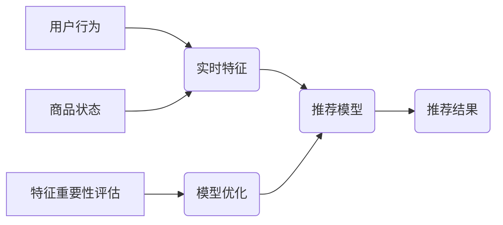

                 

## 电商推荐系统中的实时特征重要性评估

> 关键词：电商推荐系统、实时特征、重要性评估、机器学习、特征工程、在线学习

## 1. 背景介绍

在当今数据爆炸的时代，电商推荐系统已成为电商平台的核心竞争力之一。推荐系统通过分析用户的行为数据、商品信息等，为用户提供个性化的商品推荐，从而提高用户体验、促进商品销售。

传统的电商推荐系统通常依赖于离线训练的模型，特征重要性评估主要基于历史数据进行。然而，用户行为和商品信息在不断变化，离线训练的模型难以及时适应实时变化，导致推荐效果下降。

因此，实时特征重要性评估成为电商推荐系统发展的重要方向。实时特征是指能够及时反映用户行为和商品状态的特征，例如用户当前浏览的商品、用户最近的购买记录、商品实时库存等。实时特征的重要性评估可以帮助电商平台：

* **动态调整推荐模型：** 根据实时特征的重要性，动态调整推荐模型的权重，提高推荐的准确性和时效性。
* **优化特征工程：** 识别出对推荐效果最关键的实时特征，优化特征工程流程，提高模型的训练效率和推荐效果。
* **个性化推荐：** 基于实时特征，为用户提供更个性化的商品推荐，提升用户体验。

## 2. 核心概念与联系

### 2.1  实时特征

实时特征是指能够及时反映用户行为和商品状态的特征，其更新频率较高，能够反映当前的动态变化。例如：

* **用户行为特征：** 用户当前浏览的商品ID、用户最近的购买记录、用户点击过的商品数量、用户停留时间等。
* **商品状态特征：** 商品实时库存、商品价格、商品促销信息、商品评论数量等。

### 2.2  特征重要性评估

特征重要性评估是指对推荐模型中各个特征的贡献度进行量化分析，识别出对推荐效果最重要的特征。

### 2.3  在线学习

在线学习是指模型在数据流不断到来时进行实时更新的学习方式。与离线学习相比，在线学习能够更快速地适应数据变化，提高模型的实时性。

**核心概念关系图:**



## 3. 核心算法原理 & 具体操作步骤

### 3.1  算法原理概述

实时特征重要性评估算法通常基于在线学习的思想，通过对实时特征的贡献度进行实时更新，动态调整推荐模型的权重。常见的算法包括：

* **梯度提升树 (GBDT) + 在线学习:** 将 GBDT 模型与在线学习算法结合，实时更新模型的权重，提高模型的实时性和适应性。
* **随机森林 + 在线学习:** 将随机森林模型与在线学习算法结合，实时更新模型的决策树，提高模型的鲁棒性和泛化能力。
* **神经网络 + 在线学习:** 将神经网络模型与在线学习算法结合，实时更新模型的权重，提高模型的学习能力和推荐精度。

### 3.2  算法步骤详解

以 GBDT + 在线学习为例，详细说明算法步骤：

1. **初始化模型:** 使用历史数据训练一个初始的 GBDT 模型。
2. **实时特征提取:** 从用户行为和商品状态数据中提取实时特征。
3. **特征重要性计算:** 使用在线学习算法，实时计算每个实时特征对推荐结果的影响，并更新特征的重要性权重。
4. **模型更新:** 根据特征重要性权重，动态调整 GBDT 模型的权重，更新模型参数。
5. **推荐结果生成:** 使用更新后的 GBDT 模型生成推荐结果。

### 3.3  算法优缺点

**优点:**

* **实时性强:** 能够及时适应数据变化，提高推荐的时效性。
* **个性化程度高:** 基于实时特征，能够为用户提供更个性化的推荐。
* **模型适应性强:** 可以动态调整模型参数，提高模型的鲁棒性和泛化能力。

**缺点:**

* **计算复杂度高:** 实时特征重要性评估需要不断计算特征贡献度，计算复杂度较高。
* **数据依赖性强:** 需要大量的实时数据进行训练和更新，数据质量对算法效果有重要影响。
* **模型稳定性:** 实时更新模型参数可能会导致模型稳定性下降，需要进行相应的调优和控制。

### 3.4  算法应用领域

实时特征重要性评估算法广泛应用于电商推荐系统、广告推荐系统、内容推荐系统等领域，能够有效提高推荐系统的准确性和时效性。

## 4. 数学模型和公式 & 详细讲解 & 举例说明

### 4.1  数学模型构建

假设我们有一个电商推荐系统，目标是预测用户对商品的点击概率。我们可以使用以下数学模型来表示：

$$
P(click|user, item) = f(user\_features, item\_features, real\_time\_features)
$$

其中：

* $P(click|user, item)$ 表示用户对商品的点击概率。
* $user\_features$ 表示用户的特征向量，例如用户年龄、性别、购买历史等。
* $item\_features$ 表示商品的特征向量，例如商品类别、价格、描述等。
* $real\_time\_features$ 表示实时特征向量，例如用户当前浏览的商品ID、用户最近的购买记录等。
* $f$ 表示推荐模型，例如 GBDT、随机森林、神经网络等。

### 4.2  公式推导过程

为了评估实时特征的重要性，我们可以使用梯度下降算法来优化模型参数。梯度下降算法的目标是找到使模型预测误差最小化的参数值。

在梯度下降算法中，我们需要计算每个参数对模型预测误差的贡献度，并根据贡献度更新参数值。对于实时特征，我们可以使用以下公式来计算其对模型预测误差的贡献度：

$$
\frac{\partial Loss}{\partial real\_time\_feature_i}
$$

其中：

* $Loss$ 表示模型预测误差。
* $real\_time\_feature_i$ 表示第 $i$ 个实时特征。

### 4.3  案例分析与讲解

假设我们有一个电商平台，用户购买商品时会留下点击记录。我们可以使用 GBDT + 在线学习算法来构建一个商品推荐系统。

在训练过程中，我们可以使用用户点击记录作为正样本，未点击记录作为负样本。通过梯度下降算法，我们可以更新 GBDT 模型的参数，使其能够更好地预测用户对商品的点击概率。

在实时特征评估过程中，我们可以计算每个实时特征对模型预测误差的贡献度，并根据贡献度更新特征的重要性权重。例如，如果用户的最近购买记录对模型预测误差有较大的贡献，那么我们可以提高该特征的重要性权重。

## 5. 项目实践：代码实例和详细解释说明

### 5.1  开发环境搭建

* **操作系统:** Linux/macOS
* **编程语言:** Python
* **深度学习框架:** TensorFlow/PyTorch
* **数据处理库:** Pandas
* **机器学习库:** Scikit-learn

### 5.2  源代码详细实现

```python
# 导入必要的库
import pandas as pd
from sklearn.ensemble import GradientBoostingClassifier
from sklearn.model_selection import train_test_split

# 加载数据
data = pd.read_csv('ecommerce_data.csv')

# 提取特征和标签
features = data[['user_id', 'item_id', 'user_age', 'item_price', 'real_time_feature_1', 'real_time_feature_2']]
labels = data['click']

# 将数据分为训练集和测试集
X_train, X_test, y_train, y_test = train_test_split(features, labels, test_size=0.2, random_state=42)

# 初始化 GBDT 模型
model = GradientBoostingClassifier(n_estimators=100, learning_rate=0.1, random_state=42)

# 训练模型
model.fit(X_train, y_train)

# 评估模型性能
accuracy = model.score(X_test, y_test)
print(f'模型准确率: {accuracy}')

# 实时特征重要性评估
feature_importances = model.feature_importances_
print(f'特征重要性: {feature_importances}')
```

### 5.3  代码解读与分析

* **数据加载和预处理:** 代码首先加载电商数据，并提取特征和标签。
* **模型初始化和训练:** 代码使用 GBDT 模型进行训练，并使用交叉验证来评估模型性能。
* **实时特征重要性评估:** 代码使用模型的 `feature_importances_` 属性来获取每个特征的重要性权重。

### 5.4  运行结果展示

运行代码后，可以得到模型的准确率和特征重要性权重。特征重要性权重可以用于识别对推荐效果最重要的实时特征。

## 6. 实际应用场景

### 6.1  个性化推荐

实时特征可以用于个性化推荐，例如根据用户的实时浏览记录推荐相关的商品。

### 6.2  商品推荐排序

实时特征可以用于优化商品推荐排序，例如根据商品的实时库存和促销信息调整商品排序。

### 6.3  广告推荐

实时特征可以用于广告推荐，例如根据用户的实时兴趣和行为推荐相关的广告。

### 6.4  未来应用展望

随着数据量的不断增长和计算能力的提升，实时特征重要性评估将在电商推荐系统中发挥更加重要的作用。未来，我们可以期待以下应用场景：

* **更精准的个性化推荐:** 基于更丰富的实时特征，实现更精准的个性化推荐。
* **更智能的推荐策略:** 基于实时特征的重要性和用户行为模式，开发更智能的推荐策略。
* **实时动态调整推荐模型:** 基于实时特征的变化，动态调整推荐模型的参数，提高推荐的时效性和准确性。

## 7. 工具和资源推荐

### 7.1  学习资源推荐

* **书籍:**
    * 《推荐系统实践》
    * 《机器学习》
* **在线课程:**
    * Coursera: Machine Learning
    * Udacity: Deep Learning Nanodegree

### 7.2  开发工具推荐

* **数据处理库:** Pandas
* **机器学习库:** Scikit-learn, TensorFlow, PyTorch
* **云平台:** AWS, Azure, GCP

### 7.3  相关论文推荐

* **论文:**
    * "Real-Time Feature Importance Evaluation for Recommender Systems"
    * "Online Learning for Recommender Systems"

## 8. 总结：未来发展趋势与挑战

### 8.1  研究成果总结

实时特征重要性评估算法为电商推荐系统带来了新的发展方向，能够有效提高推荐系统的实时性和个性化程度。

### 8.2  未来发展趋势

* **更精准的特征提取:** 研究更精准的实时特征提取方法，例如基于用户行为序列的特征提取。
* **更有效的评估算法:** 研究更有效的实时特征重要性评估算法，例如基于强化学习的算法。
* **更智能的推荐策略:** 基于实时特征的重要性和用户行为模式，开发更智能的推荐策略。

### 8.3  面临的挑战

* **数据质量:** 实时特征评估算法依赖于高质量的数据，数据质量问题会影响算法效果。
* **计算复杂度:** 实时特征评估算法的计算复杂度较高，需要高效的算法和硬件支持。
* **模型稳定性:** 实时更新模型参数可能会导致模型稳定性下降，需要进行相应的调优和控制。

### 8.4  研究展望

未来，实时特征重要性评估算法将继续发展，并应用于更多场景。研究者将继续探索更精准的特征提取方法、更有效的评估算法和更智能的推荐策略，为电商推荐系统带来更大的进步。

## 9. 附录：常见问题与解答

**问题 1:** 如何选择合适的实时特征？

**解答:** 选择合适的实时特征需要根据具体的业务场景和推荐目标进行分析。一般来说，可以考虑以下因素：

* **特征相关性:** 特征与推荐目标的相关性越高，其重要性就越高。
* **特征时效性:** 特征更新频率越高，其时效性就越强。
* **特征可获取性:** 特征需要能够实时获取，并且数据质量可靠。

**问题 2:** 如何评估实时特征的重要性？

**解答:** 可以使用梯度下降算法、特征重要性分析等方法来评估实时特征的重要性。

**问题 3:** 如何平衡实时性和模型稳定性？

**解答:** 可以通过设置更新频率、使用滑动窗口等方法来平衡实时性和模型稳定性。


作者：禅与计算机程序设计艺术 / Zen and the Art of Computer Programming 
<end_of_turn>

