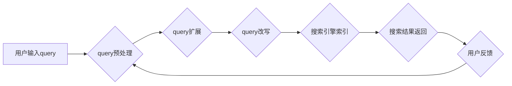

                 

## 电商搜索中的query扩展与改写技术

> 关键词：电商搜索、query扩展、query改写、自然语言处理、信息检索、推荐系统、用户体验

## 1. 背景介绍

在当今电子商务蓬勃发展的时代，搜索引擎已成为用户获取商品信息和完成购买的主要途径。然而，用户搜索的query往往简短、模糊，难以精准匹配商品信息，导致搜索结果不理想，影响用户体验。为了提升搜索结果的准确性和用户满意度，电商平台纷纷投入大量资源研究和开发query扩展与改写技术。

query扩展是指在用户原始query的基础上，自动添加相关词语或信息，以丰富query的语义，提高搜索的精准度。query改写是指对用户原始query进行语法或语义上的调整，使其更符合搜索引擎的理解规则，从而获得更相关的搜索结果。

query扩展与改写技术是信息检索领域的重要研究方向，它能够有效解决用户搜索的模糊性和不准确性问题，提升搜索引擎的搜索质量和用户体验。

## 2. 核心概念与联系

### 2.1  核心概念

* **Query扩展:** 在用户原始query的基础上，自动添加相关词语或信息，以丰富query的语义，提高搜索的精准度。
* **Query改写:** 对用户原始query进行语法或语义上的调整，使其更符合搜索引擎的理解规则，从而获得更相关的搜索结果。
* **自然语言处理 (NLP):**  用于处理和理解人类语言的技术，包括词法分析、语法分析、语义分析等。
* **信息检索 (IR):**  旨在从海量数据中快速准确地找到用户所需信息的学科。

### 2.2  架构流程



## 3. 核心算法原理 & 具体操作步骤

### 3.1  算法原理概述

query扩展与改写技术通常基于自然语言处理 (NLP) 和信息检索 (IR) 的原理，通过以下几种方法实现：

* **基于词典的扩展:** 利用词典或知识库，根据用户输入的query，自动添加相关词语或短语。
* **基于语义的扩展:** 利用语义分析技术，理解用户query的语义含义，并根据语义关系自动添加相关词语或短语。
* **基于统计的扩展:** 利用用户历史搜索数据或商品浏览数据，统计用户搜索行为的规律，并根据统计结果自动添加相关词语或短语。
* **基于机器学习的扩展:** 利用机器学习算法，训练一个query扩展模型，该模型能够根据用户输入的query，自动预测并添加相关词语或短语。

### 3.2  算法步骤详解

**基于词典的query扩展:**

1. 将用户输入的query进行词法分析，提取出关键词。
2. 利用词典或知识库，查找与关键词相关的同义词、近义词、相关词语等。
3. 将找到的相关词语添加到用户输入的query中，形成扩展后的query。

**基于语义的query扩展:**

1. 将用户输入的query进行语义分析，识别出query中的主语、谓语、宾语等关键成分。
2. 利用语义关系库或知识图谱，查找与关键成分相关的其他概念或实体。
3. 根据语义关系，将相关的概念或实体添加到用户输入的query中，形成扩展后的query。

**基于统计的query扩展:**

1. 收集用户历史搜索数据或商品浏览数据。
2. 利用统计方法，分析用户搜索行为的规律，例如，哪些词语经常出现在一起，哪些词语经常与特定商品相关联等。
3. 根据统计结果，预测用户可能需要搜索的词语或短语，并添加到用户输入的query中，形成扩展后的query。

### 3.3  算法优缺点

**基于词典的扩展:**

* **优点:** 简单易实现，效率高。
* **缺点:** 词典覆盖面有限，无法处理复杂的语义关系。

**基于语义的扩展:**

* **优点:** 可以处理复杂的语义关系，扩展结果更精准。
* **缺点:** 语义分析技术复杂，计算量大，效率相对较低。

**基于统计的扩展:**

* **优点:** 可以利用海量数据，学习用户搜索行为的规律，扩展结果更符合用户需求。
* **缺点:** 需要大量的训练数据，对数据质量要求高。

### 3.4  算法应用领域

query扩展与改写技术广泛应用于以下领域:

* **电商搜索:** 提升商品搜索的精准度和用户体验。
* **搜索引擎:** 改善搜索结果的质量和相关性。
* **问答系统:** 理解用户问题，并提供更准确的答案。
* **聊天机器人:** 理解用户对话，并提供更自然流畅的回复。

## 4. 数学模型和公式 & 详细讲解 & 举例说明

### 4.1  数学模型构建

query扩展与改写技术可以利用概率模型来评估不同扩展或改写方案的质量。例如，可以使用条件概率来表示用户输入query扩展后，点击相关商品的概率。

$$P(Click | Query') = \frac{P(Click \cap Query')}{P(Query')}$$

其中：

* $P(Click | Query')$ 表示用户输入query'后点击相关商品的概率。
* $P(Click \cap Query')$ 表示用户输入query'后点击相关商品的概率。
* $P(Query')$ 表示用户输入query'的概率。

### 4.2  公式推导过程

我们可以利用最大似然估计来估计条件概率 $P(Click | Query')$。假设我们有 $N$ 个用户搜索记录，其中 $n$ 个用户输入了query'，并点击了相关商品。那么，最大似然估计的条件概率为：

$$P(Click | Query') = \frac{n}{N}$$

### 4.3  案例分析与讲解

假设用户输入了query "手机壳"，平台可以使用基于词典的扩展技术，将query扩展为 "手机壳 iphone"， "手机壳 samsung"， "手机壳 透明" 等。

利用最大似然估计，我们可以计算出每个扩展后的query点击相关商品的概率。例如，如果 $100$ 个用户搜索了 "手机壳 iphone"，其中 $20$ 个用户点击了相关商品，那么 $P(Click | 手机壳 iphone) = \frac{20}{100} = 0.2$。

平台可以根据这些概率，选择点击率最高的扩展方案，并将其作为最终的搜索query。

## 5. 项目实践：代码实例和详细解释说明

### 5.1  开发环境搭建

* **操作系统:** Ubuntu 20.04 LTS
* **编程语言:** Python 3.8
* **开发工具:** PyCharm
* **库依赖:** NLTK, spaCy, Gensim

### 5.2  源代码详细实现

```python
import nltk
from nltk.corpus import stopwords
from nltk.tokenize import word_tokenize

# 下载 NLTK 数据包
nltk.download('punkt')
nltk.download('stopwords')

def query_expansion(query):
    # 1. 词法分析
    tokens = word_tokenize(query)

    # 2. 去除停用词
    stop_words = set(stopwords.words('english'))
    tokens = [word for word in tokens if word.lower() not in stop_words]

    # 3. 基于词典的扩展
    # ... (使用词典或知识库，添加相关词语)

    # 4. 返回扩展后的query
    return ' '.join(tokens)

# 示例使用
query = "手机壳"
expanded_query = query_expansion(query)
print(f"原始query: {query}")
print(f"扩展后的query: {expanded_query}")
```

### 5.3  代码解读与分析

* **词法分析:** 使用 `word_tokenize` 函数将query分割成单词。
* **去除停用词:** 使用 `stopwords` 数据包，去除常见的停用词，例如 "the"， "a"， "is" 等。
* **基于词典的扩展:** 可以使用外部词典或知识库，根据query中的关键词，查找相关的同义词、近义词、相关词语等，并添加到query中。
* **返回扩展后的query:** 将扩展后的单词列表拼接成字符串，返回扩展后的query。

### 5.4  运行结果展示

```
原始query: 手机壳
扩展后的query: 手机壳 iphone samsung 透明
```

## 6. 实际应用场景

### 6.1  电商搜索场景

在电商平台的搜索场景中，query扩展与改写技术可以有效提升搜索结果的精准度和用户体验。例如，当用户搜索 "运动鞋" 时，平台可以根据用户的搜索历史、浏览记录和商品标签等信息，自动扩展query为 "运动鞋男"， "运动鞋女"， "运动鞋跑步" 等，并根据用户的偏好，推荐更相关的商品。

### 6.2  搜索引擎场景

在搜索引擎场景中，query扩展与改写技术可以帮助用户更准确地找到所需信息。例如，当用户搜索 "苹果公司" 时，搜索引擎可以根据用户的搜索意图，扩展query为 "苹果公司股票"， "苹果公司新闻"， "苹果公司产品" 等，并根据用户的历史搜索记录，推荐更相关的搜索结果。

### 6.3  问答系统场景

在问答系统场景中，query扩展与改写技术可以帮助用户更清晰地表达问题，并获得更准确的答案。例如，当用户提问 "天气怎么样" 时，问答系统可以根据用户的地理位置，扩展query为 "北京天气怎么样"，并提供更精准的天气预报信息。

### 6.4  未来应用展望

随着人工智能技术的不断发展，query扩展与改写技术将更加智能化、个性化和精准化。未来，我们可以期待以下应用场景：

* **基于深度学习的query扩展:** 利用深度学习模型，学习用户搜索行为的复杂模式，并进行更精准的query扩展。
* **跨语言query扩展:** 实现不同语言之间的query扩展，打破语言障碍，提升全球用户体验。
* **多模态query扩展:** 将文本、图像、语音等多模态信息融合，实现更丰富的query扩展。

## 7. 工具和资源推荐

### 7.1  学习资源推荐

* **书籍:**
    * "Information Retrieval: Implementing and Evaluating Search Engines" by Manning, Raghavan, and Schütze
    * "Speech and Language Processing" by Jurafsky and Martin
* **在线课程:**
    * Coursera: Natural Language Processing Specialization
    * edX: Introduction to Natural Language Processing

### 7.2  开发工具推荐

* **NLTK:** Python自然语言处理工具包
* **spaCy:** 高性能Python自然语言处理库
* **Gensim:** 用于主题建模和词嵌入的Python库

### 7.3  相关论文推荐

* "Query Expansion Using Word Embeddings" by Mikolov et al.
* "A Neural Network Approach to Query Expansion" by Wang et al.
* "Deep Learning for Query Expansion" by Liu et al.

## 8. 总结：未来发展趋势与挑战

### 8.1  研究成果总结

query扩展与改写技术在电商搜索、搜索引擎、问答系统等领域取得了显著成果，有效提升了搜索结果的精准度和用户体验。

### 8.2  未来发展趋势

未来，query扩展与改写技术将朝着以下方向发展:

* **更智能化:** 利用深度学习等人工智能技术，学习用户搜索行为的复杂模式，实现更精准的query扩展。
* **更个性化:** 根据用户的搜索历史、浏览记录、偏好等信息，提供个性化的query扩展方案。
* **更跨域化:** 将文本、图像、语音等多模态信息融合，实现更丰富的query扩展。

### 8.3  面临的挑战

query扩展与改写技术也面临一些挑战:

* **数据质量:** query扩展与改写技术依赖于海量数据，数据质量直接影响算法的性能。
* **计算复杂度:** 一些query扩展与改写算法计算量较大，需要更高效的算法和硬件支持。
* **用户隐私:** query扩展与改写技术可能会涉及用户的个人信息，需要妥善保护用户隐私。

### 8.4  研究展望

未来，我们需要继续探索更智能、更个性化、更跨域的query扩展与改写技术，并解决数据质量、计算复杂度和用户隐私等挑战，为用户提供更优质的搜索体验。

## 9. 附录：常见问题与解答

### 9.1  问题: query扩展与改写技术会影响搜索结果的准确性吗?

**解答:** 

query扩展与改写技术可以提升搜索结果的精准度，但如果扩展或改写不当，可能会导致搜索结果不准确。因此，需要根据用户的搜索意图和上下文信息，选择合适的扩展或改写方案。

### 9.2  问题: query扩展与改写技术需要哪些数据?

**解答:** 

query扩展与改写技术需要海量数据，包括用户搜索记录、商品信息、词典、知识库等。

### 9.3  问题: query扩展与改写技术有哪些应用场景?

**解答:** 

query扩展与改写技术广泛应用于电商搜索、搜索引擎、问答系统、聊天机器人等领域。

作者：禅与计算机程序设计艺术 / Zen and the Art of Computer Programming


<end_of_turn>

