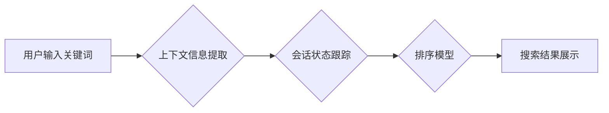

                 

## 电商搜索中的上下文感知排序模型与会话状态跟踪

> 关键词：电商搜索、上下文感知排序、会话状态跟踪、推荐系统、深度学习、自然语言处理

## 1. 背景介绍

电商搜索是电商平台的核心功能之一，用户通过输入关键词或语音查询商品信息，平台会返回相关商品列表。传统的电商搜索模型主要依赖于关键词匹配和商品特征，缺乏对用户搜索意图和上下文信息的理解，导致搜索结果不精准，用户体验差。

随着人工智能技术的快速发展，上下文感知排序模型和会话状态跟踪技术逐渐成为电商搜索领域的研究热点。上下文感知排序模型能够根据用户的搜索历史、浏览记录、购买行为等上下文信息，对商品进行排序，提供更精准的搜索结果。会话状态跟踪技术能够记录用户的搜索会话，理解用户的搜索意图，并根据会话状态动态调整搜索结果，提升用户体验。

## 2. 核心概念与联系

### 2.1 上下文感知排序

上下文感知排序是指根据用户搜索历史、浏览记录、购买行为等上下文信息，对商品进行排序，提供更精准的搜索结果。

### 2.2 会话状态跟踪

会话状态跟踪是指记录用户的搜索会话，理解用户的搜索意图，并根据会话状态动态调整搜索结果。

**核心概念与联系流程图:**



## 3. 核心算法原理 & 具体操作步骤

### 3.1 算法原理概述

上下文感知排序模型通常基于深度学习算法，例如Transformer、BERT等，能够学习用户上下文信息和商品特征之间的关系，并根据学习到的关系对商品进行排序。

会话状态跟踪技术通常使用RNN、LSTM等循环神经网络，能够记录用户的搜索历史，理解用户的搜索意图，并根据会话状态动态调整搜索结果。

### 3.2 算法步骤详解

**上下文感知排序算法步骤:**

1. **数据预处理:** 将用户搜索历史、浏览记录、购买行为等上下文信息和商品特征进行预处理，例如文本清洗、特征提取等。
2. **模型训练:** 使用深度学习算法，例如Transformer、BERT等，对预处理后的数据进行训练，学习用户上下文信息和商品特征之间的关系。
3. **排序预测:** 将用户输入的关键词和上下文信息作为输入，模型输出商品的排序分数。
4. **结果展示:** 根据商品的排序分数，将商品列表展示给用户。

**会话状态跟踪算法步骤:**

1. **会话记录:** 记录用户的搜索历史，包括关键词、点击商品、浏览时间等信息。
2. **状态更新:** 使用RNN、LSTM等循环神经网络，根据用户的搜索历史更新会话状态。
3. **状态融合:** 将会话状态与商品特征融合，作为排序模型的输入。
4. **结果展示:** 根据排序模型的输出，将商品列表展示给用户。

### 3.3 算法优缺点

**上下文感知排序算法:**

* **优点:** 能够根据用户上下文信息提供更精准的搜索结果，提升用户体验。
* **缺点:** 需要大量的训练数据，模型训练复杂度高。

**会话状态跟踪算法:**

* **优点:** 能够理解用户的搜索意图，并根据会话状态动态调整搜索结果，提升用户体验。
* **缺点:** 会话状态的维护和更新需要考虑复杂性，容易出现状态丢失等问题。

### 3.4 算法应用领域

上下文感知排序模型和会话状态跟踪技术广泛应用于电商搜索、推荐系统、个性化服务等领域。

## 4. 数学模型和公式 & 详细讲解 & 举例说明

### 4.1 数学模型构建

上下文感知排序模型通常使用深度学习框架，例如TensorFlow、PyTorch等，构建数学模型。模型的结构通常包括编码器和解码器。

* **编码器:** 用于提取用户上下文信息和商品特征的表示。
* **解码器:** 用于根据编码器的输出，预测商品的排序分数。

### 4.2 公式推导过程

深度学习模型的训练过程通常使用反向传播算法，通过优化模型参数，最小化预测结果与真实结果之间的误差。

**损失函数:**

$$
L = \sum_{i=1}^{N} \log(P(y_i|x_i))
$$

其中:

* $L$ 是损失函数
* $N$ 是样本数量
* $y_i$ 是真实标签
* $x_i$ 是输入特征
* $P(y_i|x_i)$ 是模型预测的概率

**梯度下降算法:**

$$
\theta = \theta - \alpha \nabla L(\theta)
$$

其中:

* $\theta$ 是模型参数
* $\alpha$ 是学习率
* $\nabla L(\theta)$ 是损失函数对参数的梯度

### 4.3 案例分析与讲解

假设我们有一个电商平台，用户搜索关键词“手机”。上下文感知排序模型会根据用户的搜索历史、浏览记录、购买行为等信息，对手机商品进行排序，并展示给用户。

例如，如果用户之前搜索过“华为手机”，并且浏览过华为手机的商品页面，那么上下文感知排序模型会将华为手机排在前面。

## 5. 项目实践：代码实例和详细解释说明

### 5.1 开发环境搭建

* 操作系统: Ubuntu 20.04
* Python 版本: 3.8
* 深度学习框架: TensorFlow 2.0

### 5.2 源代码详细实现

```python
import tensorflow as tf

# 定义上下文感知排序模型
class ContextAwareRanker(tf.keras.Model):
    def __init__(self, embedding_dim, num_heads, num_layers):
        super(ContextAwareRanker, self).__init__()
        self.encoder = tf.keras.layers.TransformerEncoder(
            tf.keras.layers.MultiHeadAttention(num_heads=num_heads, key_dim=embedding_dim),
            num_layers=num_layers
        )
        self.dense = tf.keras.layers.Dense(1)

    def call(self, context, item_features):
        # 编码上下文信息
        context_embedding = self.encoder(context)
        # 融合上下文信息和商品特征
        combined_embedding = tf.concat([context_embedding, item_features], axis=-1)
        # 预测排序分数
        score = self.dense(combined_embedding)
        return score

# 实例化模型
model = ContextAwareRanker(embedding_dim=128, num_heads=8, num_layers=4)

# 训练模型
# ...

# 预测排序分数
scores = model(context, item_features)
```

### 5.3 代码解读与分析

* **模型结构:** 模型结构包括编码器和全连接层。编码器用于提取上下文信息和商品特征的表示，全连接层用于预测排序分数。
* **数据输入:** 模型接受两个输入：上下文信息和商品特征。
* **模型训练:** 模型使用反向传播算法进行训练，损失函数为交叉熵损失函数。
* **预测结果:** 模型输出商品的排序分数，分数越高，商品排名越靠前。

### 5.4 运行结果展示

训练完成后，模型可以用于预测商品的排序分数。

## 6. 实际应用场景

### 6.1 电商搜索

上下文感知排序模型可以根据用户的搜索历史、浏览记录、购买行为等信息，对商品进行排序，提供更精准的搜索结果。

### 6.2 商品推荐

会话状态跟踪技术可以记录用户的搜索历史，理解用户的兴趣偏好，并根据会话状态推荐相关的商品。

### 6.3 个性化服务

上下文感知排序模型和会话状态跟踪技术可以用于提供个性化的服务，例如个性化广告、个性化内容推荐等。

### 6.4 未来应用展望

上下文感知排序模型和会话状态跟踪技术在未来将有更广泛的应用场景，例如：

* **智能客服:** 理解用户的需求，提供更精准的客服服务。
* **医疗诊断:** 辅助医生诊断疾病，提供个性化的治疗方案。
* **教育教学:** 理解学生的学习情况，提供个性化的学习方案。

## 7. 工具和资源推荐

### 7.1 学习资源推荐

* **书籍:**
    * Deep Learning by Ian Goodfellow
    * Natural Language Processing with Python by Steven Bird
* **在线课程:**
    * TensorFlow Tutorials
    * Deep Learning Specialization by Andrew Ng

### 7.2 开发工具推荐

* **深度学习框架:** TensorFlow, PyTorch
* **自然语言处理库:** NLTK, spaCy
* **数据处理工具:** Pandas, NumPy

### 7.3 相关论文推荐

* **BERT:** Devlin, J., Chang, M. W., Lee, K., & Toutanova, K. (2018). Bert: Pre-training of deep bidirectional transformers for language understanding. arXiv preprint arXiv:1810.04805.
* **Transformer:** Vaswani, A., Shazeer, N., Parmar, N., Uszkoreit, J., Jones, L., Gomez, A. N., ... & Polosukhin, I. (2017). Attention is all you need. In Advances in neural information processing systems (pp. 5998-6008).

## 8. 总结：未来发展趋势与挑战

### 8.1 研究成果总结

上下文感知排序模型和会话状态跟踪技术在电商搜索领域取得了显著的成果，能够提供更精准的搜索结果和个性化服务。

### 8.2 未来发展趋势

* **模型复杂度提升:** 研究更复杂的深度学习模型，例如Transformer-XL、GPT-3等，提升模型的表达能力和泛化能力。
* **多模态融合:** 将文本、图像、音频等多模态信息融合到排序模型中，提升模型的理解能力和服务质量。
* **联邦学习:** 利用联邦学习技术，在保护用户隐私的前提下，训练更强大的排序模型。

### 8.3 面临的挑战

* **数据稀疏性:** 某些用户搜索行为数据稀疏，难以训练有效的排序模型。
* **用户隐私保护:** 用户数据敏感，需要采取有效的措施保护用户隐私。
* **模型解释性:** 深度学习模型的决策过程难以解释，需要研究更可解释的排序模型。

### 8.4 研究展望

未来，上下文感知排序模型和会话状态跟踪技术将继续发展，为电商搜索、推荐系统、个性化服务等领域提供更智能、更精准的服务。


## 9. 附录：常见问题与解答

### 9.1 如何处理数据稀疏性问题？

可以使用数据增强技术，例如文本聚类、关键词替换等，增加训练数据的规模和多样性。

### 9.2 如何保护用户隐私？

可以使用联邦学习技术，在不收集用户数据的情况下，训练排序模型。

### 9.3 如何评估排序模型的性能？

可以使用NDCG、MAP等指标评估排序模型的性能。


作者：禅与计算机程序设计艺术 / Zen and the Art of Computer Programming 
<end_of_turn>

