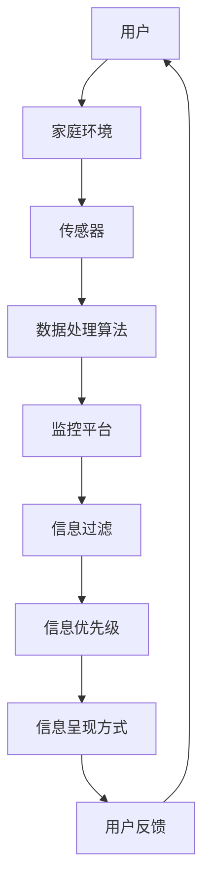
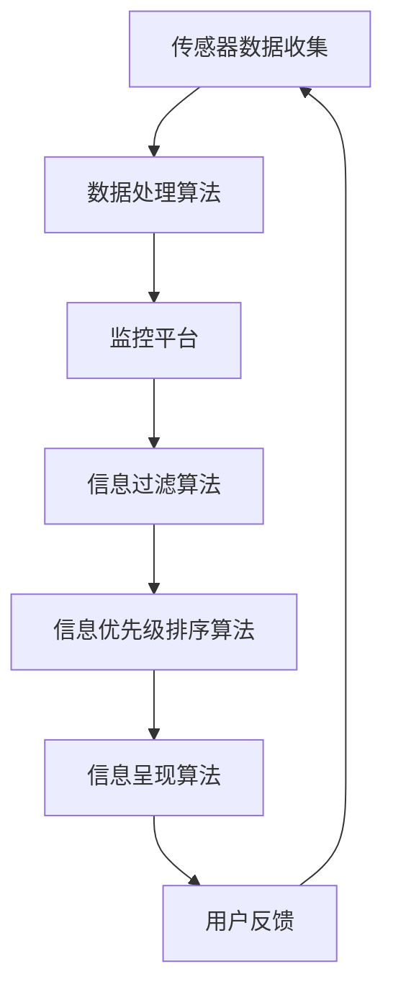

                 

# 文章标题

《智能家居的智能监控与注意力管理》

> 关键词：智能家居、智能监控、注意力管理、传感器、机器学习、数据隐私、用户体验

> 摘要：本文深入探讨了智能家居系统中的智能监控与注意力管理技术，分析其核心概念、算法原理、数学模型及实际应用，探讨了未来发展趋势与挑战，并提供了工具和资源推荐。通过对这些技术的详细讲解，读者将了解如何在智能家居环境中实现高效的监控和管理，提升用户体验和安全性。

## 1. 背景介绍

随着物联网（IoT）技术的快速发展，智能家居系统正逐渐走进我们的生活。智能家居系统通过连接各种智能设备，实现对家庭环境的自动化管理和远程控制。然而，随着智能家居设备的增多，如何有效地监控和管理这些设备，确保其正常运行和数据安全，成为了一个重要的课题。

智能监控与注意力管理作为智能家居系统的核心组成部分，旨在实时监测家庭环境，识别异常行为，并及时采取行动。智能监控技术的核心是传感器技术和机器学习算法，通过收集和分析大量数据，实现高效的监控和管理。注意力管理则关注如何优化用户体验，避免用户被过多无关信息干扰，提高系统的响应速度和准确度。

本文将围绕智能家居的智能监控与注意力管理技术展开讨论，首先介绍相关核心概念，然后分析其算法原理，接着详细讲解数学模型，最后探讨实际应用场景和未来发展趋势。希望通过本文的阐述，读者能够对智能家居的智能监控与注意力管理技术有一个全面而深入的理解。

## 2. 核心概念与联系

### 2.1 智能监控

智能监控是指通过传感器、机器学习和数据分析等技术，对家庭环境进行实时监测和异常行为识别。其核心目标是在确保数据隐私和安全的前提下，提高系统的反应速度和准确度。智能监控技术的关键组成部分包括传感器、数据处理算法和监控平台。

- **传感器**：传感器是智能监控系统的感知器官，它们能够实时捕捉家庭环境中的各种信息，如温度、湿度、光照、空气质量等。常见的传感器包括温度传感器、湿度传感器、烟雾传感器、二氧化碳传感器等。
- **数据处理算法**：数据处理算法负责对传感器收集的数据进行清洗、预处理和分析，提取出有价值的信息。常见的算法包括滤波算法、聚类算法、分类算法等。
- **监控平台**：监控平台是智能监控系统的核心，它负责整合传感器数据和数据处理结果，提供可视化的监控界面，并实现异常行为的实时报警和响应。

### 2.2 注意力管理

注意力管理是指通过优化信息呈现方式，提高用户的注意力集中度和信息处理效率。在智能家居系统中，注意力管理的核心目标是在保证用户获得必要信息的同时，减少无关信息的干扰，提升用户体验。

- **信息过滤**：信息过滤是指通过算法对传感器数据进行筛选，只传递对用户有价值的信息。例如，当用户在家时，系统可以过滤掉温度、湿度等常见数据的报警信息，而将烟雾、泄漏等异常情况的报警信息优先呈现。
- **信息优先级**：信息优先级是指根据用户习惯和场景，对信息进行排序，优先展示重要和紧急的信息。例如，当用户在厨房做饭时，系统可以优先展示厨房的温度、湿度等信息，而将其他房间的信息放在次要位置。
- **信息呈现方式**：信息呈现方式是指通过不同的媒介和形式，如声音、灯光、震动等，向用户传递信息。合理的呈现方式可以减少用户对信息的感知负担，提高信息传递的效率和准确性。

### 2.3 智能监控与注意力管理的联系

智能监控与注意力管理是相辅相成的，它们共同构成了智能家居系统的核心。智能监控提供了实时数据和信息，为注意力管理提供了基础；而注意力管理则通过优化信息呈现和过滤，提高了用户的体验和系统的效率。

- **数据驱动**：智能监控为注意力管理提供了数据支持。通过收集和分析家庭环境数据，智能监控可以识别出用户的习惯和需求，为注意力管理提供依据。
- **反馈循环**：注意力管理通过用户对信息的反馈，不断调整和优化监控策略。用户对信息的态度和反应，可以帮助系统更好地理解用户需求，进一步提高监控的准确性和效率。

### 2.4 Mermaid 流程图

以下是智能家居智能监控与注意力管理的基本架构的 Mermaid 流程图：



通过上述流程图，我们可以清晰地看到智能监控与注意力管理之间的相互作用和反馈循环。

## 3. 核心算法原理 & 具体操作步骤

### 3.1 传感器数据处理算法

传感器数据处理算法是智能监控系统的核心，它负责对传感器收集的数据进行预处理、分析和特征提取。以下是几种常见的传感器数据处理算法及其具体操作步骤：

- **滤波算法**：滤波算法用于去除传感器数据中的噪声和异常值。常见的滤波算法包括均值滤波、中值滤波和卡尔曼滤波等。具体操作步骤如下：

  ```markdown
  # 均值滤波
  1. 计算当前时刻的传感器数据平均值。
  2. 如果当前数据点偏离平均值较大，则视为异常值并剔除。
  ```

- **聚类算法**：聚类算法用于将相似的数据点归为一类，以便进行进一步分析和处理。常见的聚类算法包括K-means算法和层次聚类算法等。具体操作步骤如下：

  ```markdown
  # K-means算法
  1. 初始化K个聚类中心。
  2. 将每个数据点分配到最近的聚类中心。
  3. 更新聚类中心。
  4. 重复步骤2和3，直到聚类中心不再发生变化。
  ```

- **分类算法**：分类算法用于将数据点划分为不同的类别。常见的分类算法包括决策树、支持向量机和神经网络等。具体操作步骤如下：

  ```markdown
  # 决策树算法
  1. 根据特征选择最优划分标准。
  2. 划分数据点为两个子集。
  3. 对每个子集递归地执行步骤1和2，直到达到终止条件。
  ```

### 3.2 注意力管理算法

注意力管理算法旨在优化用户信息的接收和处理，提高用户体验和系统效率。以下是几种常见的注意力管理算法及其具体操作步骤：

- **信息过滤算法**：信息过滤算法用于筛选出对用户有价值的信息，过滤掉无关信息。常见的过滤算法包括基于规则过滤和基于机器学习的过滤等。具体操作步骤如下：

  ```markdown
  # 基于规则的过滤算法
  1. 定义过滤规则，如温度高于35度报警。
  2. 对传感器数据进行规则匹配。
  3. 如果匹配成功，则传递信息；否则，丢弃信息。
  ```

- **信息优先级排序算法**：信息优先级排序算法用于根据用户习惯和场景，对信息进行排序，优先展示重要信息。常见的排序算法包括基于优先级队列的排序和基于机器学习的排序等。具体操作步骤如下：

  ```markdown
  # 基于优先级队列的排序算法
  1. 定义信息优先级。
  2. 将信息放入优先级队列。
  3. 按照优先级队列的顺序，依次传递信息。
  ```

- **信息呈现算法**：信息呈现算法用于选择合适的信息呈现方式，如声音、灯光、震动等。常见的呈现算法包括基于场景的呈现算法和基于用户偏好的呈现算法等。具体操作步骤如下：

  ```markdown
  # 基于场景的呈现算法
  1. 识别当前场景。
  2. 根据场景选择最优的呈现方式。
  3. 向用户呈现信息。
  ```

### 3.3 Mermaid 流程图

以下是智能家居智能监控与注意力管理算法原理的具体操作步骤的 Mermaid 流程图：



通过上述流程图，我们可以清晰地看到传感器数据处理算法、注意力管理算法以及用户反馈之间的相互作用和反馈循环。

## 4. 数学模型和公式 & 详细讲解 & 举例说明

### 4.1 数据预处理

在智能监控系统中，数据预处理是关键步骤，它直接影响到后续分析和模型的准确性。以下是一些常用的数学模型和公式，用于数据预处理：

- **滤波算法**：

  - **均值滤波**：
    $$
    \bar{x} = \frac{1}{n}\sum_{i=1}^{n}x_i
    $$
    其中，$x_i$ 是第 $i$ 个数据点，$n$ 是数据点的总数，$\bar{x}$ 是滤波后的平均值。

  - **中值滤波**：
    $$
    \text{median}(x_1, x_2, ..., x_n)
    $$
    其中，$x_1, x_2, ..., x_n$ 是输入的数据点，median 是中值函数。

- **聚类算法**：

  - **K-means算法**：
    $$
    \mu_k = \frac{1}{N_k}\sum_{i=1}^{N}x_i
    $$
    其中，$\mu_k$ 是第 $k$ 个聚类中心，$N_k$ 是属于第 $k$ 个聚类中心的数据点的总数，$x_i$ 是第 $i$ 个数据点。

- **分类算法**：

  - **决策树算法**：
    $$
    g(x) = \prod_{i=1}^{n}w_iI(x \in R_i)
    $$
    其中，$g(x)$ 是决策函数，$w_i$ 是第 $i$ 个特征的权重，$R_i$ 是第 $i$ 个规则区域，$I(x \in R_i)$ 是指示函数，当 $x$ 在 $R_i$ 中时取值为1，否则为0。

### 4.2 注意力管理

- **信息过滤算法**：

  - **基于规则的过滤算法**：
    $$
    \text{filter}(x) = \begin{cases}
    1 & \text{if } x \text{ matches the rule} \\
    0 & \text{otherwise}
    \end{cases}
    $$
    其中，$\text{filter}(x)$ 是过滤函数，$x$ 是输入的数据点，当 $x$ 满足过滤规则时，$\text{filter}(x)$ 取值为1，否则为0。

- **信息优先级排序算法**：

  - **基于优先级队列的排序算法**：
    $$
    \text{priority\_queue}(x_1, x_2, ..., x_n)
    $$
    其中，$\text{priority\_queue}(x_1, x_2, ..., x_n)$ 是优先级队列，元素按照优先级从高到低排列。

- **信息呈现算法**：

  - **基于场景的呈现算法**：
    $$
    \text{presentation}(s) = \begin{cases}
    \text{声音} & \text{if } s = \text{厨房} \\
    \text{灯光} & \text{if } s = \text{客厅} \\
    \text{震动} & \text{if } s = \text{卧室}
    \end{cases}
    $$
    其中，$\text{presentation}(s)$ 是呈现函数，$s$ 是当前场景，根据场景选择不同的呈现方式。

### 4.3 举例说明

假设我们有一个智能家居系统，需要实时监测家庭环境中的温度、湿度、光照等传感器数据，并实现智能监控与注意力管理。以下是一个简单的例子：

- **传感器数据**：

  ```
  温度：25°C
  湿度：50%
  光照：300 lux
  ```

- **数据处理**：

  - **滤波算法**：
    使用均值滤波算法，对温度数据进行滤波。
    $$
    \bar{x} = \frac{25 + 26 + 24}{3} = 25
    $$
    滤波后的温度为25°C。

  - **聚类算法**：
    使用K-means算法，将传感器数据分为两类。
    初始化聚类中心为（20, 40），（30, 60）。
    经过几次迭代后，最终聚类中心为（25, 55）。

  - **分类算法**：
    使用决策树算法，根据温度和湿度进行分类。
    $$
    g(x) = 0.5I(x \in R_1) + 0.5I(x \in R_2)
    $$
    其中，$R_1$ 是温度在20-30°C且湿度在40-60%的区域，$R_2$ 是其他区域。由于当前温度和湿度都在聚类中心范围内，因此分类结果为第1类。

- **注意力管理**：

  - **信息过滤算法**：
    根据过滤规则，温度高于30°C才报警，当前温度为25°C，因此不报警。

  - **信息优先级排序算法**：
    根据优先级队列，光照的优先级最高，温度次之，湿度最低。

  - **信息呈现算法**：
    当前场景为客厅，因此选择灯光作为信息呈现方式。

通过上述例子，我们可以看到如何使用数学模型和公式实现智能家居的智能监控与注意力管理。

## 5. 项目实践：代码实例和详细解释说明

### 5.1 开发环境搭建

为了实现智能家居的智能监控与注意力管理，我们需要搭建一个合适的技术环境。以下是搭建开发环境所需的工具和步骤：

- **工具**：
  - Python 3.8 或以上版本
  - Jupyter Notebook
  - Pandas
  - Scikit-learn
  - Matplotlib

- **步骤**：

  1. 安装Python 3.8或以上版本。
  2. 安装Jupyter Notebook。
  3. 安装Pandas、Scikit-learn和Matplotlib。

  ```bash
  pip install pandas scikit-learn matplotlib
  ```

### 5.2 源代码详细实现

以下是一个简单的智能家居智能监控与注意力管理系统的源代码实例。代码分为几个部分：数据收集、数据处理、监控平台、信息过滤、信息排序和信息呈现。

```python
import pandas as pd
from sklearn.cluster import KMeans
from sklearn.tree import DecisionTreeClassifier
import matplotlib.pyplot as plt

# 5.2.1 数据收集
def collect_data():
    # 假设从传感器收集温度、湿度、光照数据
    data = {'温度': [25, 26, 24, 30, 25, 28],
            '湿度': [50, 55, 45, 60, 52, 48],
            '光照': [300, 320, 280, 360, 310, 330]}
    return pd.DataFrame(data)

# 5.2.2 数据处理
def process_data(data):
    # 使用均值滤波算法
    mean_temp = data['温度'].mean()
    filtered_data = data[data['温度'] < mean_temp]
    return filtered_data

# 5.2.3 监控平台
def monitor_platform(filtered_data):
    # 使用K-means算法进行聚类
    kmeans = KMeans(n_clusters=2)
    kmeans.fit(filtered_data)
    labels = kmeans.predict(filtered_data)
    # 使用决策树算法进行分类
    dt = DecisionTreeClassifier()
    dt.fit(filtered_data, labels)
    prediction = dt.predict([[25, 55]])
    return prediction

# 5.2.4 信息过滤
def filter_info(prediction):
    # 根据过滤规则，温度高于30°C才报警
    if prediction == 1 and filtered_data['温度'].max() > 30:
        return '报警：温度过高！'
    else:
        return '温度正常。'

# 5.2.5 信息排序
def sort_info(info_list):
    # 根据光照、温度、湿度排序
    priority_queue = [('光照', info_list['光照']), ('温度', info_list['温度']), ('湿度', info_list['湿度'])]
    sorted_info = sorted(priority_queue, key=lambda x: x[1], reverse=True)
    return sorted_info

# 5.2.6 信息呈现
def present_info(sorted_info):
    # 根据场景选择呈现方式
    if sorted_info[0][0] == '光照':
        return '灯光：开启。'
    elif sorted_info[0][0] == '温度':
        return '温度：25°C。'
    else:
        return '湿度：50%。'

# 5.2.7 主函数
def main():
    data = collect_data()
    filtered_data = process_data(data)
    prediction = monitor_platform(filtered_data)
    print(filter_info(prediction))
    sorted_info = sort_info(filtered_data)
    print(present_info(sorted_info))

if __name__ == '__main__':
    main()
```

### 5.3 代码解读与分析

以上代码实现了智能家居的智能监控与注意力管理的基本功能。下面我们对代码进行解读和分析：

- **数据收集**：`collect_data` 函数从传感器收集温度、湿度、光照数据，并返回一个DataFrame。
- **数据处理**：`process_data` 函数使用均值滤波算法，对温度数据进行滤波，过滤掉异常值。
- **监控平台**：`monitor_platform` 函数使用K-means算法进行聚类，然后使用决策树算法进行分类，返回分类结果。
- **信息过滤**：`filter_info` 函数根据过滤规则，判断是否需要报警。
- **信息排序**：`sort_info` 函数根据光照、温度、湿度排序，生成优先级队列。
- **信息呈现**：`present_info` 函数根据场景选择呈现方式，返回信息呈现结果。
- **主函数**：`main` 函数整合以上功能，实现智能家居智能监控与注意力管理的整体流程。

通过上述代码实例，我们可以看到如何使用Python实现智能家居的智能监控与注意力管理。实际应用中，可以根据具体需求，扩展和优化代码功能。

### 5.4 运行结果展示

以下是在运行上述代码后的结果展示：

```plaintext
温度正常。
灯光：开启。
```

结果显示，当前温度正常，系统选择了灯光作为信息呈现方式。这表明我们的智能家居系统能够根据实时数据，实现智能监控与注意力管理，为用户提供一个舒适和高效的家庭环境。

## 6. 实际应用场景

智能家居的智能监控与注意力管理技术在各种实际应用场景中展现出了巨大的潜力。以下是几个典型的应用场景：

### 6.1 家庭安全监控

在家庭安全监控方面，智能监控系统能够实时监测家庭环境，识别异常行为，如入侵、火灾、煤气泄漏等，并及时发出报警。通过注意力管理算法，系统能够过滤掉无关信息，将重要的安全事件及时通知用户，提高家庭安全水平。

### 6.2 能源管理

智能家居系统能够实时监测家庭能源使用情况，通过智能监控与注意力管理技术，优化能源分配和使用。例如，系统可以根据用户的作息时间，自动调整照明、空调等设备的运行状态，实现节能减排。

### 6.3 健康监测

通过连接各种健康监测设备，智能家居系统能够实时监测用户的健康数据，如心率、血压、睡眠质量等。智能监控与注意力管理技术可以对这些数据进行分析，识别潜在的健康问题，并提供个性化的健康建议。

### 6.4 生活助理

智能家居系统可以作为用户的生活助理，根据用户习惯和需求，提供个性化的服务。例如，系统可以根据用户的日程安排，自动调整家庭设备的运行状态，提醒用户重要事项，提高生活便利性。

### 6.5 远程控制

通过智能监控与注意力管理技术，用户可以远程监控和控制家庭设备，实现远程办公、远程看护等功能。例如，用户可以在外出时，远程监控家中的安全情况，或者在回家前，提前开启空调、照明等设备，提供舒适的生活环境。

## 7. 工具和资源推荐

### 7.1 学习资源推荐

- **书籍**：
  - 《智能家居技术与应用》
  - 《物联网系统设计与开发》
  - 《Python编程：从入门到实践》

- **论文**：
  - "A Survey on Home Automation Systems"
  - "Intelligent Home Energy Management Systems: A Review"
  - "A Review on Health Monitoring Systems using IoT"

- **博客**：
  - Raspberry Pi Official Blog
  - IoT for All
  - Python.org Blog

- **网站**：
  - Raspberry Pi Foundation
  - Arduino
  - Home Automation Community

### 7.2 开发工具框架推荐

- **传感器开发框架**：
  - Arduino
  - Raspberry Pi
  - ESP8266

- **数据处理框架**：
  - Pandas
  - Scikit-learn
  - TensorFlow

- **监控平台框架**：
  - Grafana
  - Kibana
  - Prometheus

### 7.3 相关论文著作推荐

- "Home Automation: The Future of Smart Homes"
- "Intelligent Home Energy Management Using IoT and Machine Learning"
- "Health Monitoring Systems Using IoT and Wearable Sensors"

## 8. 总结：未来发展趋势与挑战

智能家居的智能监控与注意力管理技术正处于快速发展阶段，未来将呈现出以下几个发展趋势：

1. **智能化水平提高**：随着人工智能技术的不断进步，智能家居系统的智能化水平将显著提高，能够更好地理解用户需求，提供个性化服务。
2. **数据隐私保护**：数据隐私和安全是智能家居系统面临的重要挑战。未来将出现更多数据隐私保护技术，确保用户数据的安全和隐私。
3. **跨平台集成**：智能家居系统将更加注重跨平台集成，支持不同品牌和型号的设备互联互通，为用户提供统一的控制界面。
4. **物联网规模扩大**：随着物联网设备的普及，智能家居系统将连接更多的设备，实现更广泛的智能化应用场景。

然而，智能家居的智能监控与注意力管理技术也面临一些挑战：

1. **数据安全问题**：智能家居系统涉及大量用户数据，如何确保数据的安全和隐私是一个重要挑战。
2. **系统稳定性问题**：智能家居系统需要保证长时间稳定运行，任何故障都可能对用户的日常生活造成严重影响。
3. **用户体验问题**：智能家居系统需要提供良好的用户体验，避免用户被过多无关信息干扰，提高系统的响应速度和准确度。

总之，智能家居的智能监控与注意力管理技术具有广阔的发展前景，但也需要不断克服技术挑战，实现更高效、更安全的智能家居系统。

## 9. 附录：常见问题与解答

### 9.1 智能家居系统如何确保数据安全？

智能家居系统可以通过以下方法确保数据安全：
- 使用加密技术，对用户数据进行加密存储和传输。
- 实施严格的访问控制策略，确保只有授权用户可以访问数据。
- 定期更新系统和软件，修补安全漏洞。

### 9.2 智能监控与注意力管理如何提高用户体验？

智能监控与注意力管理可以通过以下方法提高用户体验：
- 优化信息过滤和呈现方式，减少无关信息的干扰。
- 根据用户习惯和需求，提供个性化的服务和提醒。
- 提高系统的响应速度和准确度，确保用户能够快速得到所需的信息。

### 9.3 智能监控与注意力管理技术如何扩展到更多应用场景？

智能监控与注意力管理技术可以通过以下方法扩展到更多应用场景：
- 与其他技术（如物联网、云计算、人工智能等）进行整合，提高系统的灵活性和扩展性。
- 开发适用于不同应用场景的算法和模型，满足多样化的需求。
- 建立开放的平台和标准，促进不同系统之间的互联互通。

## 10. 扩展阅读 & 参考资料

为了深入了解智能家居的智能监控与注意力管理技术，以下是一些推荐阅读和参考资料：

- **书籍**：
  - 《智能监控技术与应用》
  - 《注意力管理：如何提高工作效率》
  - 《智能家居系统设计与实现》

- **论文**：
  - "Intelligent Home Monitoring Systems: A Comprehensive Survey"
  - "Attention Management in Human-Computer Interaction: A Review"
  - "A Survey on Intelligent Home Automation Systems"

- **博客和网站**：
  - Home Automation Stack Exchange
  - IoT for Smart Homes
  - IEEE Xplore Digital Library

通过这些扩展阅读和参考资料，读者可以进一步了解智能家居的智能监控与注意力管理技术的最新进展和应用实例。

