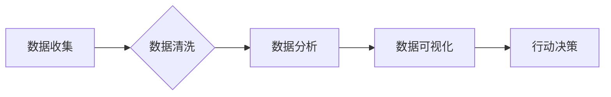

                 

## 知识付费创业中的数据分析技巧

> 关键词：数据分析、知识付费、用户行为、市场趋势、个性化推荐、A/B测试、数据可视化

## 1. 背景介绍

知识付费行业近年来发展迅速，从在线课程、直播带货到付费咨询，各种形式的知识付费模式层出不穷。在这个竞争激烈的市场环境下，数据分析已成为知识付费创业者不可或缺的利器。通过对用户行为、市场趋势等数据的深入分析，创业者可以洞察用户需求，优化产品和服务，提升用户粘性和转化率，最终实现可持续发展。

## 2. 核心概念与联系

### 2.1 数据分析在知识付费中的应用

数据分析在知识付费行业中主要应用于以下几个方面：

* **用户画像分析:** 通过分析用户年龄、性别、职业、兴趣爱好等信息，构建用户画像，了解用户的需求和偏好，为内容创作和营销提供参考。
* **学习行为分析:** 分析用户学习时长、课程完成率、互动频率等数据，了解用户的学习习惯和效果，为课程设计和教学方法提供改进方向。
* **市场趋势分析:** 分析市场上热门课程、用户关注领域等数据，洞察市场趋势，为内容开发和产品迭代提供方向。
* **营销效果分析:** 分析广告投放、推广活动的效果数据，优化营销策略，提高营销效率。

### 2.2 数据分析流程

数据分析流程通常包括以下几个步骤：

1. **数据收集:** 收集来自用户行为、课程平台、市场调研等方面的原始数据。
2. **数据清洗:** 对收集到的数据进行清洗，去除重复数据、错误数据等，保证数据质量。
3. **数据分析:** 使用统计学方法、机器学习算法等对数据进行分析，挖掘数据中的潜在规律和价值。
4. **数据可视化:** 将分析结果以图表、报告等形式呈现，方便用户理解和决策。
5. **行动决策:** 根据数据分析结果，制定相应的行动策略，优化产品、服务和营销活动。

**数据分析流程图**



## 3. 核心算法原理 & 具体操作步骤

### 3.1 算法原理概述

在知识付费行业中，常用的数据分析算法包括：

* **聚类算法:** 将用户根据相似特征进行分组，构建用户画像，例如K-Means聚类算法。
* **推荐算法:** 根据用户的历史行为和偏好，推荐相关的课程或内容，例如协同过滤算法、内容基准算法。
* **A/B测试算法:** 对不同的产品或营销方案进行对比测试，选择效果更好的方案，例如显著性检验。

### 3.2 算法步骤详解

以K-Means聚类算法为例，详细介绍其步骤：

1. **初始化:** 随机选择K个数据点作为初始聚类中心。
2. **分配:** 将每个数据点分配到距离其最近的聚类中心所属的类别。
3. **更新:** 计算每个聚类中心的新的位置，即所有属于该类别的点的平均值。
4. **重复:** 重复步骤2和步骤3，直到聚类中心不再移动或达到预设的迭代次数。

### 3.3 算法优缺点

**K-Means聚类算法**

* **优点:** 算法简单易懂，计算效率高。
* **缺点:** 需要预先设定聚类数K，对初始聚类中心的选择敏感，容易陷入局部最优解。

### 3.4 算法应用领域

* **用户画像分析:** 将用户根据学习习惯、兴趣爱好等特征进行分组，构建用户画像。
* **个性化推荐:** 为不同用户推荐个性化的课程或内容。
* **市场细分:** 将市场根据用户需求、消费能力等特征进行细分，制定针对性的营销策略。

## 4. 数学模型和公式 & 详细讲解 & 举例说明

### 4.1 数学模型构建

**K-Means聚类算法**的数学模型可以描述为：

* **目标函数:** 
$$
J = \sum_{i=1}^{K} \sum_{x \in C_i} ||x - \mu_i||^2
$$

其中：

* $J$ 为目标函数值，表示所有数据点到其所属聚类中心的距离平方和。
* $K$ 为聚类数。
* $C_i$ 为第i个聚类。
* $x$ 为数据点。
* $\mu_i$ 为第i个聚类中心的坐标。

* **优化目标:** 找到使目标函数值最小的聚类中心。

### 4.2 公式推导过程

K-Means算法通过迭代更新聚类中心的方式来最小化目标函数值。

1. **初始化:** 随机选择K个数据点作为初始聚类中心。
2. **分配:** 计算每个数据点到所有聚类中心的距离，并将每个数据点分配到距离其最近的聚类中心所属的类别。
3. **更新:** 计算每个聚类中心的新的位置，即所有属于该类别的点的平均值。
4. **重复:** 重复步骤2和步骤3，直到聚类中心不再移动或达到预设的迭代次数。

### 4.3 案例分析与讲解

假设我们有以下用户数据：

| 用户ID | 年龄 | 性别 | 职业 |
|---|---|---|---|
| 1 | 25 | 男 | 学生 |
| 2 | 30 | 女 | 职场人士 |
| 3 | 28 | 男 | 职场人士 |
| 4 | 35 | 女 | 创业者 |
| 5 | 22 | 男 | 学生 |

我们想要将这些用户进行聚类分析，并找出用户的潜在特征。

我们可以使用K-Means算法将用户进行两类聚类。

* **初始聚类中心:** 随机选择用户1和用户4作为初始聚类中心。
* **分配:** 计算每个用户到两个聚类中心的距离，并将每个用户分配到距离其最近的聚类中心所属的类别。
* **更新:** 计算每个聚类中心的新的位置，即所有属于该类别的用户的平均值。
* **重复:** 重复步骤2和步骤3，直到聚类中心不再移动。

最终，我们可以得到以下两个聚类：

* **聚类1:** 用户1、用户5（学生）
* **聚类2:** 用户2、用户3、用户4（职场人士、创业者）

通过分析这两个聚类，我们可以发现，用户年龄、职业等特征与聚类结果相关。

## 5. 项目实践：代码实例和详细解释说明

### 5.1 开发环境搭建

* **编程语言:** Python
* **数据分析库:** pandas, scikit-learn
* **可视化库:** matplotlib, seaborn

### 5.2 源代码详细实现

```python
import pandas as pd
from sklearn.cluster import KMeans

# 加载用户数据
data = pd.read_csv('user_data.csv')

# 选择特征变量
features = ['年龄', '性别', '职业']
X = data[features]

# 使用K-Means算法进行聚类
kmeans = KMeans(n_clusters=2, random_state=0)
kmeans.fit(X)

# 获取聚类结果
labels = kmeans.labels_
data['聚类'] = labels

# 查看聚类结果
print(data)

# 数据可视化
import matplotlib.pyplot as plt
plt.scatter(data['年龄'], data['性别'], c=data['聚类'])
plt.xlabel('年龄')
plt.ylabel('性别')
plt.title('用户聚类分析')
plt.show()
```

### 5.3 代码解读与分析

* **数据加载:** 使用pandas库加载用户数据。
* **特征选择:** 选择年龄、性别、职业等特征变量进行聚类分析。
* **K-Means算法:** 使用scikit-learn库中的K-Means算法进行聚类，设定聚类数为2。
* **聚类结果:** 获取聚类结果，并将聚类标签添加到用户数据中。
* **数据可视化:** 使用matplotlib库绘制散点图，展示用户聚类结果。

### 5.4 运行结果展示

运行代码后，会生成一个散点图，将用户根据聚类结果进行区分。

## 6. 实际应用场景

### 6.1 用户画像分析

通过对用户学习行为、兴趣爱好等数据的分析，可以构建用户画像，了解用户的需求和偏好，为内容创作和营销提供参考。例如，可以根据用户的学习时长、课程完成率等数据，将用户分为“活跃用户”、“沉睡用户”等类别，针对不同类别用户制定不同的营销策略。

### 6.2 个性化推荐

根据用户的历史行为和偏好，推荐相关的课程或内容，提高用户学习兴趣和参与度。例如，可以根据用户的学习记录，推荐与之前学习内容相关的课程，或者推荐用户感兴趣的领域内的课程。

### 6.3 市场趋势分析

分析市场上热门课程、用户关注领域等数据，洞察市场趋势，为内容开发和产品迭代提供方向。例如，可以分析用户搜索关键词、课程评论等数据，了解用户对哪些知识点感兴趣，并根据这些信息开发新的课程或内容。

### 6.4 未来应用展望

随着人工智能技术的不断发展，数据分析在知识付费行业将发挥更加重要的作用。未来，我们可以期待以下应用场景：

* **智能化课程推荐:** 利用深度学习算法，实现更加精准的个性化课程推荐。
* **智能化学习助手:** 利用自然语言处理技术，开发智能化学习助手，帮助用户制定学习计划、解答学习疑问。
* **虚拟化教学环境:** 利用虚拟现实技术，构建虚拟化教学环境，提供更加沉浸式的学习体验。

## 7. 工具和资源推荐

### 7.1 学习资源推荐

* **书籍:**
    * 《Python数据分析实战》
    * 《机器学习实战》
    * 《数据挖掘：概念与技术》
* **在线课程:**
    * Coursera: 数据科学与分析
    * edX: 机器学习
    * Udemy: Python数据分析

### 7.2 开发工具推荐

* **Python:** 数据分析和机器学习的常用编程语言。
* **pandas:** 数据分析和处理库。
* **scikit-learn:** 机器学习库。
* **matplotlib:** 数据可视化库。
* **seaborn:** 数据可视化库。

### 7.3 相关论文推荐

* **K-Means聚类算法:**
    * MacQueen, J. (1967). Some methods for classification and analysis of multivariate observations.
* **推荐算法:**
    * Resnick, P., Iacovou, N., Suchak, M., Bergstrom, P., & Riedl, J. (1994). GroupLens: An open architecture for collaborative filtering of netnews.
* **A/B测试算法:**
    *  Kohavi, R. (2013). A/B testing: Experimentation for data-driven optimization.

## 8. 总结：未来发展趋势与挑战

### 8.1 研究成果总结

数据分析在知识付费行业的发展中发挥着越来越重要的作用。通过对用户行为、市场趋势等数据的分析，创业者可以洞察用户需求，优化产品和服务，提升用户粘性和转化率。

### 8.2 未来发展趋势

* **人工智能技术的应用:** 利用深度学习、自然语言处理等人工智能技术，实现更加精准的个性化推荐、智能化学习助手等功能。
* **数据安全与隐私保护:** 随着数据量的不断增加，数据安全和隐私保护问题日益突出，需要加强数据安全技术的研究和应用。
* **跨平台数据整合:** 知识付费平台众多，需要开发跨平台数据整合技术，实现数据共享和协同分析。

### 8.3 面临的挑战

* **数据质量问题:** 知识付费平台的数据质量参差不齐，需要加强数据清洗和预处理工作。
* **算法模型的复杂性:** 一些数据分析算法模型过于复杂，需要降低模型复杂度，提高算法的可解释性和可操作性。
* **人才短缺:** 知识付费行业对数据分析人才的需求量大，但人才供给不足，需要加强数据分析人才的培养和引进。

### 8.4 研究展望

未来，数据分析在知识付费行业将继续发挥重要作用，需要不断探索新的算法模型、技术手段和应用场景，推动知识付费行业健康发展。

## 9. 附录：常见问题与解答

### 9.1 如何选择合适的聚类算法？

选择合适的聚类算法需要根据实际数据特点和分析目标进行选择。

* **K-Means算法:** 适合数据分布较为均匀、类别边界清晰的情况。
* **DBSCAN算法:** 适合数据分布不均匀、类别边界模糊的情况。
* **层次聚类算法:** 可以生成不同层次的聚类结果，方便用户理解数据结构。

### 9.2 如何评估聚类结果的质量？

常用的聚类结果评估指标包括：

* **Silhouette score:** 衡量每个数据点与其所属类别的相似度。
* **Dunn index:** 衡量聚类间距离与聚类内距离的比例。
* **Calinski-Harabasz index:** 衡量聚类间方差与聚类内方差的比值。

### 9.3 如何进行数据可视化？

常用的数据可视化工具包括：

* **matplotlib:** Python的绘图库，可以生成各种类型的图表。
* **seaborn:** 基于matplotlib的绘图库，提供更直观的图表风格。
* **Tableau:** 商业化的数据可视化工具，功能强大，易于使用。

作者：禅与计算机程序设计艺术 / Zen and the Art of Computer Programming


<end_of_turn>

