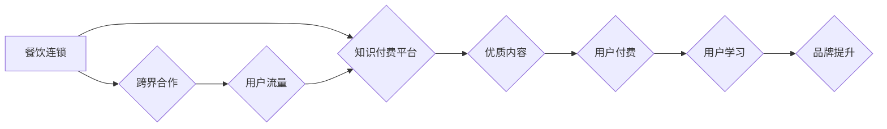

                 

## 关键词：知识付费、跨界营销、餐饮连锁、数字化转型、用户体验、数据分析、人工智能

## 1. 背景介绍

在当今数字化时代，传统商业模式面临着前所未有的挑战。消费者需求日益多元化，竞争日益激烈。为了在激烈的市场竞争中脱颖而出，企业纷纷寻求新的增长点和突破口。知识付费和跨界营销成为两种备受关注的商业模式，它们各自拥有独特的优势，并呈现出强大的协同效应。

知识付费是指通过付费的方式获取知识、技能或服务的商业模式。它以内容为核心，提供有价值的信息和服务，满足用户不断提升自我、学习成长的需求。餐饮连锁作为传统线下行业，近年来也积极拥抱数字化转型，寻求线上线下融合的新发展模式。

跨界营销是指企业跨越行业界限，与其他行业或品牌合作，共同进行营销推广。通过整合资源、共享用户群体，实现资源互补、优势叠加，从而扩大市场影响力，提升品牌知名度和用户粘性。

## 2. 核心概念与联系

### 2.1 知识付费的核心概念

知识付费的核心概念在于提供有价值的信息和服务，并通过付费机制实现商业化。它涵盖了以下几个关键要素：

* **优质内容：** 知识付费的核心是优质的内容，它需要具有专业性、实用性和独特性，能够满足用户的学习需求和提升价值。
* **付费机制：** 知识付费需要建立合理的付费机制，例如订阅制、课程购买、会员体系等，确保内容的价值得到认可和回报。
* **用户体验：** 知识付费平台需要提供良好的用户体验，包括内容的易读性、交互性、学习进度追踪等，提升用户学习效率和满意度。

### 2.2 跨界营销的核心概念

跨界营销的核心概念在于打破行业界限，通过合作共赢的方式实现资源整合和市场拓展。它需要以下几个关键要素：

* **目标用户匹配：** 跨界合作的品牌需要拥有相似的目标用户群体，才能实现资源共享和用户互补。
* **价值互补：** 跨界合作的品牌需要在产品、服务、品牌形象等方面具有互补性，才能共同创造更大的价值。
* **营销策略协同：** 跨界合作的品牌需要制定统一的营销策略，确保营销活动的效果最大化。

### 2.3 知识付费与跨界营销的联系

知识付费和跨界营销可以相互促进，形成协同效应。

* **知识付费为跨界营销提供内容支持：** 餐饮连锁可以通过知识付费平台提供烹饪技巧、食谱分享、营养健康知识等内容，吸引用户关注，提升品牌形象。
* **跨界营销为知识付费提供用户流量：** 餐饮连锁可以通过与其他品牌合作，例如生活方式品牌、教育机构等，推广知识付费产品，扩大用户群体。

**Mermaid 流程图**



## 3. 核心算法原理 & 具体操作步骤

### 3.1 算法原理概述

知识付费与跨界营销的结合，需要借助数据分析和人工智能算法来实现精准用户匹配、个性化内容推荐和营销策略优化。

* **用户画像构建：** 通过收集用户行为数据、消费记录、兴趣偏好等信息，构建用户画像，了解用户的需求和特征。
* **内容推荐算法：** 基于用户的兴趣偏好、学习历史、消费行为等数据，推荐个性化的知识付费内容，提高用户参与度和转化率。
* **营销策略优化：** 通过数据分析，评估不同营销策略的效果，优化营销方案，提高营销效率和ROI。

### 3.2 算法步骤详解

1. **数据收集与清洗：** 收集用户行为数据、消费记录、兴趣偏好等信息，并进行清洗和预处理，确保数据质量。
2. **用户画像构建：** 使用机器学习算法，例如聚类分析、关联规则挖掘等，构建用户画像，将用户分为不同的群体，例如美食爱好者、健康生活者、学习型用户等。
3. **内容推荐算法：** 使用协同过滤、内容过滤、混合推荐等算法，根据用户的兴趣偏好、学习历史、消费行为等数据，推荐个性化的知识付费内容。
4. **营销策略优化：** 使用A/B测试、数据分析等方法，评估不同营销策略的效果，优化营销方案，提高营销效率和ROI。

### 3.3 算法优缺点

**优点：**

* **精准用户匹配：** 通过数据分析和算法，实现精准的用户匹配，提高营销效果。
* **个性化内容推荐：** 根据用户的兴趣偏好和学习需求，推荐个性化的知识付费内容，提升用户体验。
* **营销策略优化：** 通过数据分析，优化营销方案，提高营销效率和ROI。

**缺点：**

* **数据依赖：** 算法的准确性依赖于数据的质量和数量，数据不足或质量差会导致算法效果不佳。
* **算法复杂度：** 一些算法的复杂度较高，需要强大的计算能力和技术支持。
* **隐私安全：** 数据分析和算法可能会涉及用户隐私信息，需要做好数据安全和隐私保护工作。

### 3.4 算法应用领域

* **电商平台：** 商品推荐、用户画像构建、营销策略优化。
* **社交媒体：** 内容推荐、用户兴趣分析、广告投放。
* **教育行业：** 个性化学习推荐、学生行为分析、教学效果评估。
* **金融行业：** 风险评估、欺诈检测、客户服务优化。

## 4. 数学模型和公式 & 详细讲解 & 举例说明

### 4.1 数学模型构建

知识付费与跨界营销的结合可以构建一个多变量数学模型，用于预测用户付费意愿和营销效果。

* **用户付费意愿模型：**

$$
P = f(U, C, I, R)
$$

其中：

* $P$：用户付费意愿
* $U$：用户价值
* $C$：内容价值
* $I$：信息获取成本
* $R$：推荐效果

* **营销效果模型：**

$$
E = g(M, T, C, P)
$$

其中：

* $E$：营销效果
* $M$：营销投入
* $T$：目标用户群体
* $C$：内容传播效果
* $P$：用户付费意愿

### 4.2 公式推导过程

用户付费意愿模型和营销效果模型的具体推导过程需要根据实际情况进行调整和优化，可以采用回归分析、神经网络等方法进行建模。

### 4.3 案例分析与讲解

假设一家餐饮连锁想要通过知识付费平台推广其品牌和产品。

* **用户价值：** 用户对餐饮的兴趣、消费能力、品牌忠诚度等因素。
* **内容价值：** 餐饮知识、食谱分享、营养健康知识等内容的实用性和吸引力。
* **信息获取成本：** 用户获取内容的成本，例如时间成本、金钱成本等。
* **推荐效果：** 内容推荐的精准度和用户点击率等因素。

通过分析这些因素，可以构建用户付费意愿模型，预测用户付费意愿。

## 5. 项目实践：代码实例和详细解释说明

### 5.1 开发环境搭建

* **操作系统：** Linux/macOS/Windows
* **编程语言：** Python
* **框架：** Django/Flask
* **数据库：** MySQL/PostgreSQL
* **云服务：** AWS/Azure/GCP

### 5.2 源代码详细实现

以下是一个简单的Python代码示例，用于实现用户画像构建：

```python
import pandas as pd
from sklearn.cluster import KMeans

# 加载用户数据
data = pd.read_csv('user_data.csv')

# 选择特征变量
features = ['age', 'gender', 'income', 'education', 'cuisine_preference']

# 构建KMeans聚类模型
kmeans = KMeans(n_clusters=5)

# 训练模型
kmeans.fit(data[features])

# 获取聚类标签
data['cluster'] = kmeans.labels_

# 查看聚类结果
print(data.groupby('cluster').mean())
```

### 5.3 代码解读与分析

* **数据加载：** 使用pandas库加载用户数据。
* **特征选择：** 选择用户画像构建所需的特征变量。
* **模型构建：** 使用KMeans聚类算法构建模型，将用户分为5个聚类。
* **模型训练：** 使用训练数据训练模型。
* **聚类标签获取：** 获取每个用户的聚类标签。
* **结果分析：** 使用groupby函数查看每个聚类用户的特征平均值，分析不同聚类的用户特征。

### 5.4 运行结果展示

运行代码后，会输出每个聚类用户的特征平均值，例如年龄、收入、教育水平等。通过分析这些结果，可以了解不同聚类用户的特征差异，构建不同用户群体的用户画像。

## 6. 实际应用场景

### 6.1 餐饮连锁知识付费平台

餐饮连锁可以建立知识付费平台，提供烹饪技巧、食谱分享、营养健康知识等内容，吸引用户付费学习，提升品牌形象和用户粘性。

### 6.2 跨界营销案例

* **餐饮连锁与生活方式品牌合作：** 餐饮连锁与健康生活方式品牌合作，推出健康食谱课程，吸引目标用户群体。
* **餐饮连锁与教育机构合作：** 餐饮连锁与烹饪学校合作，提供线上线下烹饪课程，提升用户学习体验。

### 6.3 未来应用展望

* **个性化定制：** 基于用户画像和数据分析，提供个性化的知识付费内容和营销方案。
* **沉浸式体验：** 利用VR/AR技术，打造沉浸式的烹饪体验，提升用户参与度和学习效果。
* **社区互动：** 建立用户社区，促进用户互动和交流，增强用户粘性。

## 7. 工具和资源推荐

### 7.1 学习资源推荐

* **在线课程：** Coursera、edX、Udemy等平台提供数据分析、人工智能等相关课程。
* **书籍：** 《Python数据科学手册》、《机器学习实战》等书籍。
* **博客和论坛：** Kaggle、Stack Overflow等平台提供数据科学和人工智能相关的博客和论坛。

### 7.2 开发工具推荐

* **编程语言：** Python
* **框架：** Django、Flask
* **数据库：** MySQL、PostgreSQL
* **云服务：** AWS、Azure、GCP

### 7.3 相关论文推荐

* **推荐系统：** 《Collaborative Filtering for Implicit Feedback Datasets》
* **聚类算法：** 《K-Means Clustering》
* **数据分析：** 《Data Mining: Concepts and Techniques》

## 8. 总结：未来发展趋势与挑战

### 8.1 研究成果总结

知识付费与跨界营销的结合，为企业提供了新的增长点和突破口。通过数据分析和人工智能算法，可以实现精准用户匹配、个性化内容推荐和营销策略优化，提升营销效果和用户体验。

### 8.2 未来发展趋势

* **更精准的用户画像：** 利用更丰富的用户数据和更先进的算法，构建更精准的用户画像，实现更细分的用户分群和个性化服务。
* **更智能的内容推荐：** 利用深度学习和自然语言处理等技术，实现更智能的内容推荐，提升用户学习体验和内容价值。
* **更丰富的跨界合作模式：** 探索更多跨界合作模式，例如与游戏、娱乐、文化等行业合作，拓展知识付费的应用场景。

### 8.3 面临的挑战

* **数据安全和隐私保护：** 数据分析和算法可能会涉及用户隐私信息，需要做好数据安全和隐私保护工作。
* **算法可解释性和透明度：** 一些算法的决策过程难以解释，需要提高算法的可解释性和透明度，增强用户信任。
* **内容质量和原创性：** 知识付费平台需要提供高质量、原创性的内容，才能吸引用户付费学习。

### 8.4 研究展望

未来，知识付费与跨界营销将继续发展，并与其他新兴技术融合，例如区块链、元宇宙等，创造更多新的商业模式和价值。


## 9. 附录：常见问题与解答

**Q1：知识付费平台如何保证内容质量？**

**A1：** 知识付费平台可以通过以下方式保证内容质量：

* **严格审核机制：** 对所有内容进行严格审核，确保内容的准确性、原创性和实用性。
* **专家团队：** 建立专家团队，负责内容创作和审核。
* **用户评价机制：** 建立用户评价机制，鼓励用户对内容进行评价和反馈，提高内容质量。

**Q2：跨界营销如何避免用户反感？**

**A2：** 跨界营销需要遵循以下原则，避免用户反感：

* **目标用户匹配：** 选择与自身品牌和用户群体相匹配的合作对象。
* **价值互补：** 合作内容需要为用户提供价值，而不是单纯的广告推销。
* **尊重用户隐私：** 避免过度收集用户数据，尊重用户隐私。


作者：禅与计算机程序设计艺术 / Zen and the Art of Computer Programming 
<end_of_turn>

