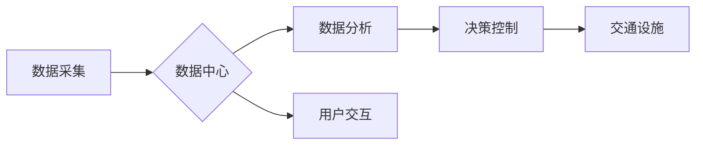

                 

## 硅谷智能交通系统的城市应用

> 关键词：智能交通系统，城市规划，机器学习，预测模型，交通流量优化，数据分析，自动驾驶

## 1. 背景介绍

随着全球人口的快速增长和城市化的进程不断加速，城市交通拥堵问题日益严峻。传统的交通管理模式已难以应对日益复杂的交通需求，智能交通系统 (ITS) 应运而生，成为解决城市交通问题的关键技术之一。

硅谷作为全球科技创新中心，在智能交通系统领域也取得了显著成就。其先进的科技水平、丰富的经验和强大的创新能力，为构建高效、便捷、安全的城市交通系统提供了坚实基础。本文将深入探讨硅谷智能交通系统的核心概念、技术架构、算法原理、实际应用场景以及未来发展趋势，为城市交通管理提供借鉴和启示。

## 2. 核心概念与联系

智能交通系统 (ITS) 是利用先进的传感器、通信技术、数据处理和人工智能等技术，对交通系统进行智能化管理和控制的系统。其核心目标是通过优化交通流量、提高道路安全、降低交通拥堵和环境污染，从而提升城市交通效率和居民生活质量。

**2.1 核心概念**

* **数据采集:** 利用各种传感器，如摄像头、雷达、激光雷达等，实时采集交通流量、道路状况、车辆位置等数据。
* **数据分析:** 对采集到的数据进行分析和处理，提取有价值的信息，例如交通流量模式、拥堵区域、事故发生概率等。
* **决策控制:** 基于数据分析结果，对交通信号灯、道路限速、车辆导航等进行智能控制，优化交通流量分配和道路通行效率。
* **用户交互:** 通过手机APP、车载系统等方式，向驾驶员提供实时交通信息、导航路线规划、停车位预订等服务，提高驾驶体验和出行便利性。

**2.2 架构图**



## 3. 核心算法原理 & 具体操作步骤

**3.1 算法原理概述**

硅谷智能交通系统广泛应用于机器学习、深度学习、预测建模等算法，以实现对交通流量的精准预测和优化控制。

* **机器学习:** 利用历史交通数据训练机器学习模型，例如线性回归、支持向量机、决策树等，预测未来交通流量、拥堵情况等。
* **深度学习:** 采用深度神经网络，例如卷积神经网络 (CNN)、循环神经网络 (RNN) 等，对复杂交通数据进行更深入的分析和学习，提高预测精度。
* **预测建模:** 基于统计学和数学模型，构建交通流量预测模型，例如 ARIMA、SARIMA 等，预测未来交通状况，为交通管理决策提供依据。

**3.2 算法步骤详解**

1. **数据收集:** 收集历史交通数据，包括时间、地点、交通流量、道路状况、天气情况等。
2. **数据预处理:** 对收集到的数据进行清洗、转换、归一化等处理，去除噪声和异常值，确保数据质量。
3. **模型选择:** 根据具体应用场景和数据特点，选择合适的机器学习或深度学习模型。
4. **模型训练:** 利用历史数据训练模型，调整模型参数，使其能够准确预测未来交通流量。
5. **模型评估:** 使用测试数据评估模型的预测精度，并进行模型调优，提高预测效果。
6. **模型部署:** 将训练好的模型部署到生产环境中，实时预测交通流量，为交通管理决策提供支持。

**3.3 算法优缺点**

* **优点:** 能够准确预测未来交通流量，提高交通管理效率，优化道路通行状况。
* **缺点:** 需要大量历史数据进行训练，对数据质量要求较高，模型训练和部署成本较高。

**3.4 算法应用领域**

* **交通流量预测:** 预测未来交通流量，为交通信号灯控制、道路限速调整等提供依据。
* **拥堵区域识别:** 识别交通拥堵区域，及时采取措施疏导交通。
* **事故预警:** 基于历史事故数据和实时交通状况，预测事故发生概率，及时发出预警。
* **导航路线规划:** 提供最优导航路线，避免交通拥堵。

## 4. 数学模型和公式 & 详细讲解 & 举例说明

**4.1 数学模型构建**

交通流量预测模型通常采用时间序列分析方法，将交通流量视为一个随时间变化的序列。常用的数学模型包括 ARIMA、SARIMA 等。

**4.2 公式推导过程**

ARIMA 模型的公式如下：

$$
y_t = c + \phi_1 y_{t-1} + \phi_2 y_{t-2} + ... + \phi_p y_{t-p} + \theta_1 \epsilon_{t-1} + \theta_2 \epsilon_{t-2} + ... + \theta_q \epsilon_{t-q} + \epsilon_t
$$

其中：

* $y_t$ 表示时间 $t$ 的交通流量。
* $c$ 是截距项。
* $\phi_i$ 是自回归系数。
* $p$ 是自回归阶数。
* $\theta_i$ 是移动平均系数。
* $q$ 是移动平均阶数。
* $\epsilon_t$ 是白噪声项。

**4.3 案例分析与讲解**

假设我们想要预测某条道路的未来交通流量，可以使用 ARIMA 模型进行预测。首先，我们需要收集该道路的历史交通流量数据，然后根据数据特点选择合适的 $p$ 和 $q$ 值。最后，利用历史数据训练 ARIMA 模型，并使用训练好的模型预测未来交通流量。

## 5. 项目实践：代码实例和详细解释说明

**5.1 开发环境搭建**

* 操作系统: Ubuntu 20.04
* Python 版本: 3.8
* 必要的库: pandas, numpy, scikit-learn, matplotlib

**5.2 源代码详细实现**

```python
import pandas as pd
from sklearn.model_selection import train_test_split
from sklearn.linear_model import LinearRegression
from sklearn.metrics import mean_squared_error

# 加载交通流量数据
data = pd.read_csv('traffic_data.csv')

# 选择特征和目标变量
features = ['hour', 'weekday', 'temperature']
target = 'traffic_volume'

# 将数据分为训练集和测试集
X_train, X_test, y_train, y_test = train_test_split(data[features], data[target], test_size=0.2)

# 创建线性回归模型
model = LinearRegression()

# 训练模型
model.fit(X_train, y_train)

# 预测测试集数据
y_pred = model.predict(X_test)

# 计算模型精度
mse = mean_squared_error(y_test, y_pred)
print(f'Mean Squared Error: {mse}')
```

**5.3 代码解读与分析**

这段代码演示了如何使用线性回归模型预测交通流量。首先，加载交通流量数据，然后选择特征和目标变量。接着，将数据分为训练集和测试集，训练线性回归模型，并使用训练好的模型预测测试集数据。最后，计算模型精度，评估模型性能。

**5.4 运行结果展示**

运行代码后，会输出模型的均方误差 (MSE) 值，该值越小，模型的预测精度越高。

## 6. 实际应用场景

**6.1 交通信号灯优化**

利用智能交通系统，可以根据实时交通流量情况，动态调整交通信号灯的绿灯时间，优化交通流量分配，减少拥堵。

**6.2 道路限速调整**

根据实时交通流量和道路状况，智能交通系统可以动态调整道路限速，避免交通拥堵和事故发生。

**6.3 智能导航**

智能交通系统可以提供实时交通信息和导航路线规划，帮助驾驶员避开拥堵路段，提高出行效率。

**6.4 公共交通优化**

智能交通系统可以优化公交车线路和调度方案，提高公共交通效率和服务质量。

**6.5 未来应用展望**

未来，智能交通系统将更加智能化、个性化和融合化。例如，将结合自动驾驶技术，实现无人驾驶车辆的协同行驶，进一步优化交通流量和道路安全。

## 7. 工具和资源推荐

**7.1 学习资源推荐**

* **书籍:**
    * 《智能交通系统》
    * 《机器学习实战》
* **在线课程:**
    * Coursera: Machine Learning
    * edX: Artificial Intelligence

**7.2 开发工具推荐**

* **Python:** 广泛应用于智能交通系统开发，拥有丰富的机器学习和数据分析库。
* **TensorFlow:** 深度学习框架，用于训练和部署深度学习模型。
* **PyTorch:** 深度学习框架，灵活易用，适合研究和开发。

**7.3 相关论文推荐**

* **Traffic Flow Prediction Using Deep Learning**
* **A Survey of Machine Learning Techniques for Traffic Flow Forecasting**

## 8. 总结：未来发展趋势与挑战

**8.1 研究成果总结**

硅谷智能交通系统取得了显著成果，为城市交通管理提供了新的思路和方法。机器学习、深度学习等算法在交通流量预测、拥堵区域识别、事故预警等方面发挥了重要作用。

**8.2 未来发展趋势**

* **更智能化:** 利用人工智能技术，实现交通系统的自主决策和控制。
* **更个性化:** 根据用户的出行需求，提供个性化的交通服务。
* **更融合化:** 将智能交通系统与其他城市基础设施融合，构建智慧城市。

**8.3 面临的挑战**

* **数据安全:** 智能交通系统需要处理大量敏感数据，数据安全问题需要得到重视。
* **算法可靠性:** 算法的准确性和可靠性直接影响到交通管理决策，需要不断改进和优化算法。
* **技术成本:** 智能交通系统的建设和维护成本较高，需要政府和企业共同投入。

**8.4 研究展望**

未来，智能交通系统将朝着更智能化、更安全、更便捷的方向发展，为城市交通管理提供更有效的解决方案。


## 9. 附录：常见问题与解答

**9.1 如何提高交通流量预测的精度？**

* 使用更丰富的特征数据，例如天气情况、节日活动等。
* 选择更合适的机器学习模型，并进行模型调优。
* 采用更先进的深度学习算法，例如 Transformer 等。

**9.2 智能交通系统如何保障数据安全？**

* 建立完善的数据安全体系，采用加密技术保护敏感数据。
* 加强数据访问控制，确保只有授权人员才能访问数据。
* 定期进行安全评估和漏洞修复。


作者：禅与计算机程序设计艺术 / Zen and the Art of Computer Programming 
<end_of_turn>

