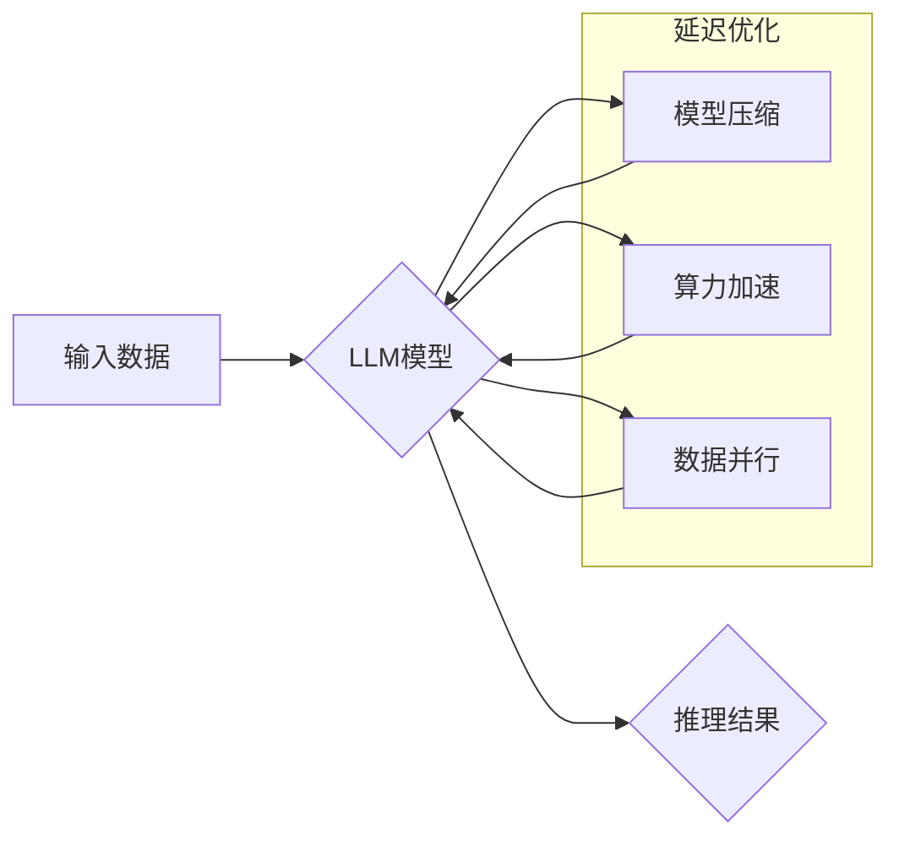

                 

## 秒推时代:LLM极速推理创新高

> 关键词：LLM, 极速推理, 延迟优化, 算力效率, 模型压缩, 硬件加速,  推理加速,  应用场景

## 1. 背景介绍

近年来，大型语言模型（LLM）在自然语言处理领域取得了令人瞩目的成就，从文本生成、翻译到对话系统，LLM展现出强大的能力。然而，LLM的推理速度仍然是一个瓶颈，限制了其在实时应用中的广泛部署。 传统的LLM推理过程通常需要耗费大量的时间和计算资源，导致延迟过高，无法满足许多实时应用的需求，例如聊天机器人、语音助手、自动驾驶等。

为了解决这一问题，研究者们积极探索各种加速LLM推理的方法，旨在实现“秒推时代”，即让LLM能够在毫秒级甚至更短的时间内完成推理，从而满足实时应用的苛刻要求。

## 2. 核心概念与联系

**2.1 核心概念**

* **LLM推理:** 指的是利用预训练的LLM模型对新的输入进行处理，并生成相应的输出。
* **延迟优化:** 指的是通过各种技术手段，减少LLM推理过程中的延迟时间。
* **算力效率:** 指的是LLM模型在单位时间内完成推理任务的能力。

**2.2 架构关系**



**2.3 核心联系**

延迟优化是LLM推理加速的核心目标。通过模型压缩、算力加速和数据并行等技术手段，可以有效降低LLM推理的延迟时间，提高算力效率。

## 3. 核心算法原理 & 具体操作步骤

**3.1 算法原理概述**

LLM推理加速算法主要围绕以下几个方面展开：

* **模型压缩:** 通过量化、剪枝、知识蒸馏等方法，减少模型参数量和计算复杂度，从而缩短推理时间。
* **算力加速:** 利用GPU、TPU等专用硬件加速LLM推理，提高算力利用率。
* **数据并行:** 将输入数据拆分并行处理，利用多核CPU或多GPU加速推理速度。

**3.2 算法步骤详解**

**3.2.1 模型压缩**

1. **量化:** 将模型参数从高精度浮点数（例如32位）降级到低精度整数（例如8位），减少存储空间和计算量。
2. **剪枝:** 移除模型中不重要的权重参数，减少模型参数量和计算复杂度。
3. **知识蒸馏:** 利用大模型的知识，训练更小的模型，保留大模型的核心能力，同时降低模型规模。

**3.2.2 算力加速**

1. **GPU加速:** 利用GPU的并行计算能力，加速LLM推理过程中的矩阵运算。
2. **TPU加速:** 利用TPU的专门设计架构，进一步提高LLM推理的算力效率。

**3.2.3 数据并行**

1. **数据拆分:** 将输入数据拆分成多个子数据块。
2. **并行处理:** 将子数据块分别分配给不同的计算单元（例如CPU核或GPU），并行进行推理。
3. **结果合并:** 将各个计算单元的推理结果合并，得到最终的输出。

**3.3 算法优缺点**

| 算法 | 优点 | 缺点 |
|---|---|---|
| 模型压缩 | 降低模型大小，减少存储空间和计算量 | 可能导致模型精度下降 |
| 算力加速 | 提高推理速度，提升算力效率 | 需要专用硬件支持，成本较高 |
| 数据并行 | 充分利用多核CPU或多GPU的计算能力 | 需要复杂的并行编程技术 |

**3.4 算法应用领域**

* **聊天机器人:** 提供更快速、更流畅的对话体验。
* **语音助手:** 降低语音识别和响应延迟，提高用户体验。
* **自动驾驶:** 提高决策速度，增强车辆的安全性。
* **实时翻译:** 提供更快速的翻译服务，满足实时沟通需求。

## 4. 数学模型和公式 & 详细讲解 & 举例说明

**4.1 数学模型构建**

LLM推理可以看作是一个复杂的函数映射，输入为文本序列，输出为预测的下一个词或整个文本段落。

假设LLM模型的输入为文本序列 $x = (x_1, x_2, ..., x_n)$，输出为预测词 $y$。则LLM推理过程可以表示为：

$$y = f(x; \theta)$$

其中，$f$ 为LLM模型的函数，$\theta$ 为模型参数。

**4.2 公式推导过程**

LLM模型的训练过程通常使用交叉熵损失函数，目标是最小化模型预测结果与真实结果之间的差异。

$$Loss = -\sum_{i=1}^{n} log(p(y_i|x_{1:i}; \theta))$$

其中，$p(y_i|x_{1:i}; \theta)$ 为模型预测第 $i$ 个词为 $y_i$ 的概率。

通过反向传播算法，更新模型参数 $\theta$，使得损失函数最小化。

**4.3 案例分析与讲解**

例如，在文本生成任务中，LLM模型需要预测下一个词。假设输入文本序列为 "今天天气真好"，模型需要预测下一个词为 "吗" 或 "是"。

模型会根据输入文本序列和训练数据，计算每个词的预测概率。

$$p("吗"| "今天天气真好"; \theta) = 0.7$$

$$p("是"| "今天天气真好"; \theta) = 0.3$$

模型会选择概率最高的词作为预测结果，即 "吗"。

## 5. 项目实践：代码实例和详细解释说明

**5.1 开发环境搭建**

* Python 3.7+
* PyTorch 或 TensorFlow
* CUDA Toolkit (如果使用GPU加速)

**5.2 源代码详细实现**

```python
import torch
import torch.nn as nn

class LLM(nn.Module):
    def __init__(self, vocab_size, embedding_dim, hidden_dim):
        super(LLM, self).__init__()
        self.embedding = nn.Embedding(vocab_size, embedding_dim)
        self.lstm = nn.LSTM(embedding_dim, hidden_dim)
        self.fc = nn.Linear(hidden_dim, vocab_size)

    def forward(self, x):
        embedded = self.embedding(x)
        output, (hidden, cell) = self.lstm(embedded)
        output = self.fc(output[:, -1, :])
        return output

# 实例化模型
model = LLM(vocab_size=10000, embedding_dim=128, hidden_dim=256)

# 定义损失函数和优化器
criterion = nn.CrossEntropyLoss()
optimizer = torch.optim.Adam(model.parameters())

# 训练模型
for epoch in range(num_epochs):
    # ... 训练代码 ...

# 保存模型
torch.save(model.state_dict(), "model.pth")
```

**5.3 代码解读与分析**

* 该代码实现了一个简单的LLM模型，包含嵌入层、LSTM层和全连接层。
* 嵌入层将词语转换为向量表示。
* LSTM层捕捉文本序列中的上下文信息。
* 全连接层将LSTM输出映射到词语概率分布。
* 训练过程使用交叉熵损失函数和Adam优化器。

**5.4 运行结果展示**

训练完成后，可以将模型用于文本生成任务。

```python
# 加载模型
model.load_state_dict(torch.load("model.pth"))

# 输入文本序列
input_text = "今天天气"

# 生成预测文本
output_text = model.generate_text(input_text)

# 打印预测结果
print(output_text)
```

## 6. 实际应用场景

**6.1 聊天机器人**

LLM可以用于构建更智能、更自然的聊天机器人，能够理解用户意图，并提供更精准的回复。

**6.2 语音助手**

LLM可以提高语音助手识别的准确率和响应速度，使语音助手更智能、更便捷。

**6.3 自动驾驶**

LLM可以帮助自动驾驶系统理解道路场景，识别交通标志和行人，提高驾驶安全性。

**6.4 其他应用场景**

* 文本摘要
* 机器翻译
* 代码生成
* 内容创作

**6.5 未来应用展望**

随着LLM推理加速技术的不断发展，LLM将在更多领域得到应用，例如医疗诊断、教育辅导、金融分析等。

## 7. 工具和资源推荐

**7.1 学习资源推荐**

* **书籍:**
    * 《深度学习》
    * 《自然语言处理》
* **在线课程:**
    * Coursera: 自然语言处理
    * edX: 深度学习

**7.2 开发工具推荐**

* **框架:** PyTorch, TensorFlow
* **库:** Hugging Face Transformers

**7.3 相关论文推荐**

* 《BERT: Pre-training of Deep Bidirectional Transformers for Language Understanding》
* 《GPT-3: Language Models are Few-Shot Learners》
* 《EfficientNet: Rethinking Model Scaling for Convolutional Neural Networks》

## 8. 总结：未来发展趋势与挑战

**8.1 研究成果总结**

近年来，LLM推理加速取得了显著进展，模型压缩、算力加速和数据并行等技术有效降低了LLM推理的延迟时间，提高了算力效率。

**8.2 未来发展趋势**

* **模型架构优化:** 研究更轻量、更高效的LLM模型架构。
* **硬件加速:** 开发更强大的专用硬件，进一步提高LLM推理速度。
* **推理优化算法:** 探索更有效的推理优化算法，例如动态推理、模型蒸馏等。

**8.3 面临的挑战**

* **模型精度与效率的平衡:** 模型压缩可能会导致模型精度下降，需要找到最佳的压缩策略。
* **硬件成本:** 专用硬件成本较高，限制了LLM推理的普及。
* **数据隐私:** LLM推理需要大量数据，如何保护数据隐私是一个重要挑战。

**8.4 研究展望**

未来，LLM推理加速将继续是一个重要的研究方向，随着技术的不断发展，LLM将在更多领域得到应用，为人类社会带来更多价值。

## 9. 附录：常见问题与解答

**9.1 如何选择合适的LLM推理加速方法？**

选择合适的LLM推理加速方法需要根据具体应用场景和模型特点进行综合考虑。

* **模型规模:** 模型规模较大，可以考虑模型压缩和算力加速。
* **延迟要求:** 延迟要求较高，可以考虑数据并行和硬件加速。
* **资源限制:** 资源有限，可以考虑轻量级模型和软件加速。

**9.2 如何评估LLM推理加速效果？**

可以根据以下指标评估LLM推理加速效果：

* **延迟时间:** 减少LLM推理的时间。
* **算力效率:** 提高LLM推理的算力利用率。
* **模型精度:** 保持或提高LLM推理的模型精度。


作者：禅与计算机程序设计艺术 / Zen and the Art of Computer Programming 
<end_of_turn>

