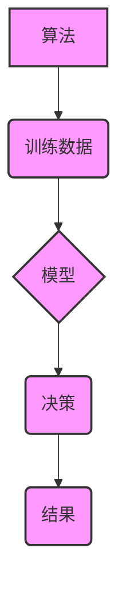

                 

## 1. 背景介绍

人工智能（AI）正以惊人的速度发展，其应用领域从医疗保健到金融、交通运输再到娱乐，无处不在。然而，随着AI技术的进步，也引发了人们对算法伦理的日益关注。算法本身是无意识的，但其背后的设计、训练数据和应用场景却可能潜在地反映和放大社会中的偏见、歧视和不公平。

**1.1 AI伦理的必要性**

AI技术的快速发展带来了前所未有的机遇，但也带来了新的挑战和风险。算法伦理的必要性体现在以下几个方面：

* **公平性:** AI算法应公平公正地对待所有个体，避免因种族、性别、宗教等因素而产生歧视。
* **透明度:** AI算法的决策过程应透明可解释，让人们能够理解算法是如何做出决定的，从而建立信任。
* **责任:** AI算法的开发和应用应承担相应的责任，确保其不会造成负面影响。
* **隐私:** AI算法在处理个人数据时应保护用户的隐私，避免滥用和泄露。
* **安全:** AI算法应安全可靠，避免被恶意利用或造成不可预知的风险。

**1.2 算法偏见**

算法偏见是指AI算法由于训练数据中的偏差而导致对不同群体产生不公平的对待。例如，如果一个用于招聘的AI算法训练数据中男性占多数，那么该算法可能会倾向于选择男性候选人，从而导致性别歧视。

**1.3 算法透明度**

算法透明度是指人们能够理解AI算法是如何工作的。缺乏透明度会导致人们对AI算法的信任度降低，并难以识别和解决算法中的潜在问题。

## 2. 核心概念与联系

**2.1 核心概念**

* **算法:** 一组用于解决特定问题的指令或规则。
* **训练数据:** 用于训练AI算法的数据集。
* **模型:** AI算法经过训练后形成的知识表示。
* **偏见:** 算法对特定群体的歧视或不公平对待。
* **透明度:** 人们能够理解算法是如何工作的程度。

**2.2 核心概念联系**



## 3. 核心算法原理 & 具体操作步骤

**3.1 算法原理概述**

机器学习算法是一种能够从数据中学习并改进的算法。它通过分析大量数据，识别出其中的模式和规律，从而能够对新的数据进行预测或分类。常见的机器学习算法包括：

* **监督学习:** 利用标记数据训练模型，例如分类和回归问题。
* **无监督学习:** 利用未标记数据发现数据中的隐藏结构，例如聚类和降维。
* **强化学习:** 通过试错学习，在环境中获得最大奖励。

**3.2 算法步骤详解**

1. **数据收集和预处理:** 收集相关数据并进行清洗、转换和特征工程。
2. **模型选择:** 根据具体问题选择合适的机器学习算法。
3. **模型训练:** 利用训练数据训练模型，调整模型参数。
4. **模型评估:** 利用测试数据评估模型的性能，例如准确率、召回率和F1-score。
5. **模型部署:** 将训练好的模型部署到实际应用场景中。

**3.3 算法优缺点**

* **优点:** 能够自动学习数据中的模式，无需人工编程，能够处理复杂的数据。
* **缺点:** 需要大量的数据进行训练，容易受到训练数据中的偏差影响，解释性较差。

**3.4 算法应用领域**

机器学习算法广泛应用于各个领域，例如：

* **医疗保健:** 疾病诊断、药物研发、个性化治疗。
* **金融:** 欺诈检测、风险评估、投资决策。
* **交通运输:** 自动驾驶、交通流量预测、物流优化。
* **娱乐:** 内容推荐、游戏开发、虚拟助手。

## 4. 数学模型和公式 & 详细讲解 & 举例说明

**4.1 数学模型构建**

机器学习算法通常基于数学模型进行构建。例如，线性回归模型可以表示为：

$$y = w_0 + w_1x_1 + w_2x_2 + ... + w_nx_n + \epsilon$$

其中：

* $y$ 是预测值。
* $w_0, w_1, ..., w_n$ 是模型参数。
* $x_1, x_2, ..., x_n$ 是输入特征。
* $\epsilon$ 是误差项。

**4.2 公式推导过程**

机器学习算法的模型参数通常通过优化目标函数来确定。目标函数通常是模型预测误差的平方和，例如：

$$J(w) = \frac{1}{2}\sum_{i=1}^{m}(y_i - \hat{y}_i)^2$$

其中：

* $J(w)$ 是目标函数。
* $w$ 是模型参数。
* $m$ 是训练样本数量。
* $y_i$ 是真实值。
* $\hat{y}_i$ 是模型预测值。

通过梯度下降算法等优化方法，可以迭代更新模型参数，使得目标函数最小化。

**4.3 案例分析与讲解**

例如，在图像分类任务中，可以使用卷积神经网络（CNN）模型进行训练。CNN模型通过多个卷积层和池化层来提取图像特征，然后通过全连接层进行分类。

## 5. 项目实践：代码实例和详细解释说明

**5.1 开发环境搭建**

* Python 3.x
* TensorFlow 或 PyTorch 等深度学习框架
* Jupyter Notebook 或 VS Code 等代码编辑器

**5.2 源代码详细实现**

```python
import tensorflow as tf

# 定义模型结构
model = tf.keras.models.Sequential([
    tf.keras.layers.Conv2D(32, (3, 3), activation='relu', input_shape=(28, 28, 1)),
    tf.keras.layers.MaxPooling2D((2, 2)),
    tf.keras.layers.Conv2D(64, (3, 3), activation='relu'),
    tf.keras.layers.MaxPooling2D((2, 2)),
    tf.keras.layers.Flatten(),
    tf.keras.layers.Dense(10, activation='softmax')
])

# 编译模型
model.compile(optimizer='adam',
              loss='sparse_categorical_crossentropy',
              metrics=['accuracy'])

# 训练模型
model.fit(x_train, y_train, epochs=10)

# 评估模型
loss, accuracy = model.evaluate(x_test, y_test)
print('Test loss:', loss)
print('Test accuracy:', accuracy)
```

**5.3 代码解读与分析**

这段代码定义了一个简单的卷积神经网络模型，用于手写数字识别任务。模型包含两个卷积层、两个池化层、一个全连接层和一个softmax输出层。

**5.4 运行结果展示**

训练完成后，可以将模型应用于新的图像数据进行预测。

## 6. 实际应用场景

**6.1 医疗诊断**

AI算法可以分析医学影像数据，辅助医生诊断疾病，例如癌症、心血管疾病等。

**6.2 金融风险评估**

AI算法可以分析客户的财务数据，评估其信用风险，帮助金融机构做出更明智的贷款决策。

**6.3 自动驾驶**

AI算法可以帮助车辆感知周围环境，做出驾驶决策，实现自动驾驶功能。

**6.4 未来应用展望**

随着AI技术的不断发展，其应用场景将更加广泛，例如：

* **个性化教育:** 根据学生的学习情况，提供个性化的学习方案。
* **智能客服:** 利用自然语言处理技术，提供更智能的客服服务。
* **科学研究:** 加速科学研究，例如药物研发、材料科学等。

## 7. 工具和资源推荐

**7.1 学习资源推荐**

* **在线课程:** Coursera、edX、Udacity 等平台提供丰富的机器学习课程。
* **书籍:** 《深度学习》、《机器学习实战》等书籍。
* **开源项目:** TensorFlow、PyTorch 等开源深度学习框架。

**7.2 开发工具推荐**

* **Python:** 机器学习开发的常用语言。
* **Jupyter Notebook:** 用于代码编写、数据分析和可视化。
* **VS Code:** 代码编辑器，支持多种编程语言和插件。

**7.3 相关论文推荐**

* **《ImageNet Classification with Deep Convolutional Neural Networks》**
* **《Attention Is All You Need》**
* **《BERT: Pre-training of Deep Bidirectional Transformers for Language Understanding》**

## 8. 总结：未来发展趋势与挑战

**8.1 研究成果总结**

近年来，AI技术取得了长足的进步，在各个领域都取得了显著的应用成果。

**8.2 未来发展趋势**

* **模型更加强大:** 模型规模将继续扩大，性能将进一步提升。
* **应用更加广泛:** AI技术将应用于更多领域，例如医疗保健、教育、金融等。
* **解释性更强:** 研究人员将致力于开发更可解释的AI算法，提高人们对AI决策的理解。

**8.3 面临的挑战**

* **数据偏见:** 训练数据中的偏见可能导致算法产生歧视性结果。
* **算法透明度:** 许多AI算法过于复杂，难以理解其决策过程。
* **安全性和隐私:** AI算法可能被恶意利用，或泄露用户隐私。

**8.4 研究展望**

未来，研究人员将继续致力于解决AI伦理问题，开发更加公平、透明、安全和可解释的AI算法，确保AI技术造福人类社会。

## 9. 附录：常见问题与解答

**9.1 如何避免算法偏见？**

* 使用更加多样化的训练数据。
* 对训练数据进行预处理，去除潜在的偏见。
* 开发算法检测和缓解偏见的机制。

**9.2 如何提高算法透明度？**

* 使用可解释的机器学习算法。
* 开发可视化工具，帮助人们理解算法的决策过程。
* 构建算法的文档和解释报告。

**9.3 如何保障算法安全性和隐私？**

* 使用安全的开发和部署流程。
* 对用户数据进行加密和匿名处理。
* 遵守相关的法律法规和隐私政策。


作者：禅与计算机程序设计艺术 / Zen and the Art of Computer Programming 
<end_of_turn>

