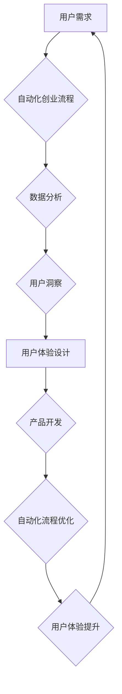

                 

## 自动化创业中的用户体验设计思维

> 关键词：自动化创业、用户体验设计、人工智能、机器学习、流程优化、数据驱动、用户洞察

## 1. 背景介绍

在当今科技飞速发展的时代，自动化创业已成为一种新兴的商业模式。通过人工智能、机器学习等技术的应用，企业可以实现流程自动化、数据驱动决策，从而提高效率、降低成本，并创造新的商业价值。然而，在追求自动化效率的同时，我们不能忽视用户体验的重要性。良好的用户体验是企业获得用户信任、提升用户粘性、最终实现商业成功的关键因素。

传统的创业模式往往将用户体验设计视为一个独立的环节，在产品开发后期才进行。而自动化创业则需要将用户体验设计融入整个创业流程，从产品定义、功能设计、流程优化到数据分析，始终贯穿始终。

## 2. 核心概念与联系

### 2.1 用户体验设计 (UX Design)

用户体验设计是指以用户为中心，通过研究用户需求、行为和心理，设计出易用、高效、愉悦的用户体验的产品和服务。

### 2.2 自动化创业

自动化创业是指利用人工智能、机器学习等技术，自动完成企业运营中的多个环节，例如：

* **流程自动化:** 自动化重复性任务，例如数据录入、订单处理、客服回复等。
* **数据驱动决策:** 利用数据分析工具，洞察用户行为和市场趋势，为决策提供依据。
* **个性化定制:** 根据用户的喜好和需求，提供个性化的产品和服务。

### 2.3 核心概念联系

自动化创业的核心在于利用技术提高效率和降低成本，而用户体验设计则致力于提升用户满意度和忠诚度。两者看似相悖，但实际上是相互补充的。

通过自动化技术，我们可以解放人力，专注于更重要的工作，例如用户体验设计。同时，良好的用户体验设计可以帮助企业更好地理解用户需求，从而更精准地进行自动化流程设计，形成良性循环。

**Mermaid 流程图**



## 3. 核心算法原理 & 具体操作步骤

### 3.1 算法原理概述

在自动化创业中，常用的算法包括：

* **机器学习算法:** 用于分析用户数据，预测用户行为，实现个性化推荐等功能。
* **自然语言处理算法:** 用于理解用户自然语言输入，例如聊天机器人、语音识别等。
* **流程自动化算法:** 用于识别和自动化重复性任务，例如 RPA（机器人流程自动化）。

### 3.2 算法步骤详解

以机器学习算法为例，其基本步骤包括：

1. **数据收集:** 收集用户行为数据，例如浏览记录、购买历史、评价信息等。
2. **数据预处理:** 对收集到的数据进行清洗、转换、特征提取等处理，使其适合机器学习算法的训练。
3. **模型选择:** 根据具体任务选择合适的机器学习算法，例如分类算法、回归算法、聚类算法等。
4. **模型训练:** 利用训练数据训练机器学习模型，使其能够学习用户行为模式。
5. **模型评估:** 使用测试数据评估模型的性能，例如准确率、召回率、F1-score等。
6. **模型部署:** 将训练好的模型部署到生产环境中，用于预测用户行为。

### 3.3 算法优缺点

**优点:**

* 自动化程度高，提高效率。
* 数据驱动决策，更精准。
* 个性化定制，提升用户体验。

**缺点:**

* 需要大量数据进行训练。
* 模型训练需要专业技术。
* 算法本身存在局限性，无法解决所有问题。

### 3.4 算法应用领域

* **个性化推荐:** 根据用户的兴趣和行为，推荐相关产品或服务。
* **客户服务自动化:** 利用聊天机器人自动回复用户常见问题。
* **营销自动化:** 自动化营销活动，例如发送邮件、推送广告等。
* **流程优化:** 自动化重复性任务，例如数据录入、订单处理等。

## 4. 数学模型和公式 & 详细讲解 & 举例说明

### 4.1 数学模型构建

在自动化创业中，我们可以利用数学模型来描述用户行为、预测用户需求、优化自动化流程等。例如，我们可以使用贝叶斯网络来建模用户购买决策，或者使用马尔科夫链来预测用户流向。

### 4.2 公式推导过程

以用户购买决策为例，我们可以使用贝叶斯网络来建模。贝叶斯网络是一种概率图模型，它可以表示变量之间的依赖关系。

假设我们想要预测用户是否会购买某个产品，我们可以将用户购买决策建模为一个随机变量 Y，以及影响用户购买决策的因素，例如用户年龄、收入、产品价格等，这些因素可以建模为随机变量 X1, X2, ..., Xn。

根据贝叶斯定理，我们可以计算出用户购买决策的概率：

$$P(Y|X1, X2, ..., Xn) = \frac{P(X1, X2, ..., Xn|Y)P(Y)}{P(X1, X2, ..., Xn)}$$

其中：

* $P(Y|X1, X2, ..., Xn)$ 是用户购买决策的条件概率。
* $P(X1, X2, ..., Xn|Y)$ 是给定用户购买决策的情况下，影响因素的联合概率。
* $P(Y)$ 是用户购买决策的先验概率。
* $P(X1, X2, ..., Xn)$ 是影响因素的联合概率。

### 4.3 案例分析与讲解

我们可以根据用户的历史购买记录、年龄、收入等信息，训练贝叶斯网络模型，预测用户是否会购买某个产品。

例如，如果用户年龄较大、收入较高，并且之前购买过类似产品，那么模型会预测用户购买该产品的概率较高。

## 5. 项目实践：代码实例和详细解释说明

### 5.1 开发环境搭建

为了实现自动化创业中的用户体验设计，我们可以使用以下开发环境：

* **编程语言:** Python
* **机器学习库:** scikit-learn, TensorFlow, PyTorch
* **数据分析工具:** Pandas, NumPy
* **用户界面框架:** React, Vue.js, Angular

### 5.2 源代码详细实现

以下是一个简单的代码实例，演示如何使用 Python 和 scikit-learn 库实现用户购买决策的预测：

```python
import pandas as pd
from sklearn.model_selection import train_test_split
from sklearn.linear_model import LogisticRegression

# 加载用户数据
data = pd.read_csv("user_data.csv")

# 选择特征和目标变量
features = ["age", "income", "previous_purchase"]
target = "purchase"

# 将数据分割为训练集和测试集
X_train, X_test, y_train, y_test = train_test_split(data[features], data[target], test_size=0.2)

# 创建逻辑回归模型
model = LogisticRegression()

# 训练模型
model.fit(X_train, y_train)

# 预测测试集数据
y_pred = model.predict(X_test)

# 计算模型准确率
accuracy = model.score(X_test, y_test)

print(f"模型准确率: {accuracy}")
```

### 5.3 代码解读与分析

这段代码首先加载用户数据，然后选择特征和目标变量。接着，将数据分割为训练集和测试集，并创建逻辑回归模型。最后，训练模型并预测测试集数据，计算模型准确率。

### 5.4 运行结果展示

运行这段代码后，会输出模型的准确率。

## 6. 实际应用场景

### 6.1 个性化推荐

在电商平台、流媒体平台等场景中，我们可以利用机器学习算法分析用户的浏览记录、购买历史等数据，推荐个性化的产品或内容。

### 6.2 客户服务自动化

在客服系统中，我们可以利用自然语言处理算法训练聊天机器人，自动回复用户常见问题，提高客服效率。

### 6.3 营销自动化

在营销活动中，我们可以利用自动化工具发送个性化的邮件、推送广告等，提高营销效果。

### 6.4 未来应用展望

随着人工智能技术的不断发展，自动化创业将应用到更多领域，例如：

* **医疗保健:** 自动化诊断、个性化治疗方案。
* **教育:** 个性化学习路径、智能辅导系统。
* **金融:** 风险评估、欺诈检测。

## 7. 工具和资源推荐

### 7.1 学习资源推荐

* **书籍:**
    * 《深度学习》
    * 《机器学习实战》
    * 《Python机器学习》
* **在线课程:**
    * Coursera
    * edX
    * Udacity

### 7.2 开发工具推荐

* **编程语言:** Python
* **机器学习库:** scikit-learn, TensorFlow, PyTorch
* **数据分析工具:** Pandas, NumPy
* **用户界面框架:** React, Vue.js, Angular

### 7.3 相关论文推荐

* **《Attention Is All You Need》**
* **《BERT: Pre-training of Deep Bidirectional Transformers for Language Understanding》**
* **《Generative Adversarial Networks》**

## 8. 总结：未来发展趋势与挑战

### 8.1 研究成果总结

自动化创业将人工智能、机器学习等技术与商业模式相结合，为企业提供了提高效率、降低成本、提升用户体验的新途径。

### 8.2 未来发展趋势

* **更智能的自动化:** 利用更先进的机器学习算法，实现更智能的自动化决策。
* **更个性化的体验:** 利用大数据分析和用户画像技术，提供更个性化的产品和服务。
* **更广泛的应用:** 自动化创业将应用到更多领域，例如医疗保健、教育、金融等。

### 8.3 面临的挑战

* **数据安全和隐私保护:** 自动化创业需要大量用户数据，如何保证数据安全和隐私保护是一个重要挑战。
* **算法偏见:** 机器学习算法可能存在偏见，导致不公平的结果。
* **伦理问题:** 自动化创业可能会带来一些伦理问题，例如工作岗位替代等。

### 8.4 研究展望

未来，自动化创业的研究将更加注重以下方面：

* **开发更安全、更可靠的自动化算法。**
* **解决算法偏见问题，确保公平的结果。**
* **探讨自动化创业带来的伦理问题，制定相应的规范和政策。**

## 9. 附录：常见问题与解答

### 9.1 如何选择合适的自动化算法？

选择合适的自动化算法需要根据具体任务和数据特点进行考虑。例如，如果需要预测用户购买决策，可以使用逻辑回归算法；如果需要分析用户文本评论，可以使用自然语言处理算法。

### 9.2 如何保证自动化算法的准确性？

保证自动化算法的准确性需要进行充分的数据收集、预处理和模型训练。同时，还需要不断评估模型性能，并进行模型调优。

### 9.3 自动化创业会取代人类工作吗？

自动化创业可以提高效率，解放人力，但不会完全取代人类工作。人类仍然需要负责制定策略、解决复杂问题、进行创意设计等工作。


作者：禅与计算机程序设计艺术 / Zen and the Art of Computer Programming 
<end_of_turn>

