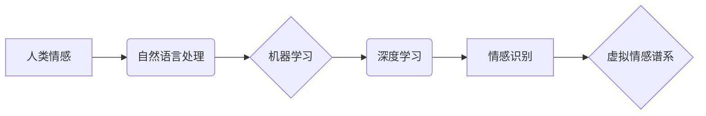

                 

## 虚拟情感谱系：AI绘制的人类情感地图

> 关键词：人工智能、情感识别、自然语言处理、机器学习、深度学习、情感分析、虚拟情感谱系

## 1. 背景介绍

人类情感是复杂而多样的，它影响着我们的思维、行为和决策。理解和模拟人类情感一直是人工智能领域的重要研究方向。随着深度学习技术的快速发展，人工智能在情感识别和分析方面取得了显著进展。

传统的文本情感分析方法主要依赖于规则匹配和词典统计，但这些方法难以捕捉到情感的细微变化和语境依赖性。深度学习方法则能够学习到更复杂的特征表示，从而提高情感识别的准确率。

近年来，一些研究者开始探索构建虚拟情感谱系，即利用人工智能技术绘制人类情感的映射图谱。虚拟情感谱系可以帮助我们更好地理解情感的结构、演变和相互关系，并为情感计算、情感机器人、虚拟现实等领域提供新的应用场景。

## 2. 核心概念与联系

**2.1  情感识别**

情感识别是指通过分析文本、语音、图像等数据，识别出表达的情感类型，例如快乐、悲伤、愤怒、恐惧等。

**2.2  自然语言处理 (NLP)**

自然语言处理是人工智能的一个分支，旨在使计算机能够理解和处理人类语言。NLP技术在情感识别中扮演着重要的角色，例如文本预处理、词嵌入、情感词典构建等。

**2.3  机器学习 (ML)**

机器学习是人工智能的一种实现方式，它通过训练模型来学习数据中的模式和规律。在情感识别中，机器学习算法可以从大量的标注数据中学习到情感分类的规则。

**2.4  深度学习 (DL)**

深度学习是机器学习的一个子领域，它使用多层神经网络来学习更复杂的特征表示。深度学习算法在情感识别中取得了显著的成果，例如卷积神经网络 (CNN) 和循环神经网络 (RNN)。

**2.5  虚拟情感谱系**

虚拟情感谱系是指利用人工智能技术构建的人类情感的映射图谱。它可以将情感类型、情感强度、情感语境等信息进行可视化表示，并通过算法分析情感之间的关系和演变趋势。

**核心概念与联系流程图**



## 3. 核心算法原理 & 具体操作步骤

### 3.1  算法原理概述

构建虚拟情感谱系的核心算法通常基于深度学习技术，例如循环神经网络 (RNN) 或图神经网络 (GNN)。

RNN能够处理序列数据，例如文本，并学习到情感的上下文依赖性。GNN能够学习到情感之间的关系和结构，从而构建出更完整的虚拟情感谱系。

### 3.2  算法步骤详解

1. **数据收集与预处理:** 收集大量文本数据，并进行预处理，例如去除停用词、标点符号、HTML标签等。
2. **词嵌入:** 将文本中的词语映射到低维向量空间，例如使用Word2Vec或GloVe等词嵌入模型。
3. **情感分类模型训练:** 使用RNN或GNN等深度学习模型，训练情感分类模型，能够将文本分类到不同的情感类别。
4. **情感强度分析:** 利用模型输出的特征向量，分析文本中情感的强度，例如使用softmax回归或线性回归等模型。
5. **情感语境分析:** 利用RNN或Transformer等模型，分析文本中情感的语境信息，例如使用注意力机制或BERT等模型。
6. **虚拟情感谱系构建:** 将情感类别、情感强度、情感语境等信息进行可视化表示，构建出虚拟情感谱系。

### 3.3  算法优缺点

**优点:**

* 能够学习到更复杂的特征表示，提高情感识别的准确率。
* 可以分析情感的强度和语境信息，提供更深入的情感理解。
* 可以构建出可视化的虚拟情感谱系，方便情感分析和研究。

**缺点:**

* 需要大量的标注数据进行训练，数据标注成本较高。
* 模型训练需要较高的计算资源和时间成本。
* 难以捕捉到一些细微的情感变化和文化差异。

### 3.4  算法应用领域

* **情感计算:** 分析文本、语音、图像等数据中的情感信息，用于市场调研、用户体验评估、社交媒体监控等。
* **情感机器人:** 开发能够识别和理解人类情感的机器人，用于陪伴、教育、医疗等领域。
* **虚拟现实:** 在虚拟环境中创建更逼真的情感体验，例如游戏、电影、教育等。
* **心理健康:** 辅助心理医生诊断和治疗情绪障碍，例如抑郁症、焦虑症等。

## 4. 数学模型和公式 & 详细讲解 & 举例说明

### 4.1  数学模型构建

虚拟情感谱系构建通常基于图神经网络 (GNN) 模型。GNN 可以将情感类型、情感强度、情感语境等信息表示为节点和边，并学习到节点之间的关系和结构。

**节点:**

* 情感类型节点：表示不同的情感类别，例如快乐、悲伤、愤怒等。
* 情感强度节点：表示情感的强度，例如轻微、中等、强烈等。
* 情感语境节点：表示情感的语境信息，例如事件、人物、场景等。

**边:**

* 情感类型关系边：表示不同情感类型之间的关系，例如快乐与悲伤是相反的情感。
* 情感强度关系边：表示情感强度之间的关系，例如强烈的情绪比轻微的情绪更具影响力。
* 情感语境关系边：表示情感与语境之间的关系，例如在特定场景下，相同的文本可能表达不同的情感。

### 4.2  公式推导过程

GNN 模型使用消息传递机制来学习节点之间的关系。每个节点会接收来自相邻节点的消息，并根据这些消息更新自己的状态。

**消息传递公式:**

$$
m_{ij} = f(h_i, h_j, e_{ij})
$$

其中:

* $m_{ij}$ 是节点 $i$ 发送给节点 $j$ 的消息。
* $h_i$ 和 $h_j$ 分别是节点 $i$ 和 $j$ 的状态向量。
* $e_{ij}$ 是节点 $i$ 和 $j$ 之间的边特征向量。
* $f$ 是一个非线性函数，用于计算消息。

**节点状态更新公式:**

$$
h_i^{t+1} = g(h_i^t, \sum_{j \in N(i)} m_{ij})
$$

其中:

* $h_i^{t+1}$ 是节点 $i$ 在时间步 $t+1$ 的状态向量。
* $h_i^t$ 是节点 $i$ 在时间步 $t$ 的状态向量。
* $N(i)$ 是节点 $i$ 的邻居节点集合。
* $g$ 是一个非线性函数，用于更新节点状态。

### 4.3  案例分析与讲解

假设我们构建一个虚拟情感谱系，用于分析电影评论中的情感。

我们可以将电影评论中的情感类型、情感强度、情感语境等信息表示为节点和边。例如，一个评论“这部电影太棒了！”可以表示为一个情感类型节点“快乐”，一个情感强度节点“强烈”，以及一个情感语境节点“电影”。

通过 GNN 模型的训练，我们可以学习到节点之间的关系和结构。例如，我们可以发现“快乐”和“悲伤”是相反的情感，“强烈”的情感比“轻微”的情感更具影响力，“电影”的情感语境与“快乐”的情感类型相关。

## 5. 项目实践：代码实例和详细解释说明

### 5.1  开发环境搭建

* Python 3.6+
* TensorFlow 或 PyTorch 深度学习框架
* NumPy、Pandas、Scikit-learn 等数据处理和机器学习库

### 5.2  源代码详细实现

```python
# 使用 TensorFlow 构建 GNN 模型

import tensorflow as tf

# 定义 GNN 模型
class GNNModel(tf.keras.Model):
    def __init__(self, num_nodes, embedding_dim, hidden_dim):
        super(GNNModel, self).__init__()
        self.embedding = tf.keras.layers.Embedding(num_nodes, embedding_dim)
        self.gcn_layer = tf.keras.layers.GraphConv(hidden_dim)
        self.output_layer = tf.keras.layers.Dense(num_classes)

    def call(self, inputs):
        # 嵌入节点特征
        embeddings = self.embedding(inputs)
        # GCN 层计算节点关系
        hidden_states = self.gcn_layer(embeddings)
        # 全连接层输出情感类别
        outputs = self.output_layer(hidden_states)
        return outputs

# 训练 GNN 模型
model = GNNModel(num_nodes=..., embedding_dim=..., hidden_dim=...)
model.compile(optimizer='adam', loss='categorical_crossentropy', metrics=['accuracy'])
model.fit(train_data, train_labels, epochs=10)

```

### 5.3  代码解读与分析

* **GNN 模型结构:** 该代码实现了一个简单的 GNN 模型，包含嵌入层、GCN 层和输出层。
* **嵌入层:** 将节点特征映射到低维向量空间。
* **GCN 层:** 计算节点之间的关系，学习节点特征的更新规则。
* **输出层:** 将节点特征映射到情感类别。
* **训练过程:** 使用训练数据和标签训练 GNN 模型，并使用交叉熵损失函数和 Adam 优化器进行优化。

### 5.4  运行结果展示

训练完成后，可以使用测试数据评估模型的性能，例如计算准确率、召回率、F1-score 等指标。

## 6. 实际应用场景

### 6.1  情感计算

虚拟情感谱系可以用于分析文本、语音、图像等数据中的情感信息，例如：

* **市场调研:** 分析客户对产品或服务的评价，了解他们的情感倾向。
* **用户体验评估:** 分析用户对网站、应用程序等产品的体验，识别出潜在的问题和改进点。
* **社交媒体监控:** 分析社交媒体平台上的舆情，了解公众对特定事件或人物的情感态度。

### 6.2  情感机器人

虚拟情感谱系可以帮助情感机器人更好地理解和响应人类的情感，例如：

* **陪伴机器人:** 提供情感支持，陪伴孤独的人。
* **教育机器人:** 根据学生的学习情绪调整教学方式，提高学习效果。
* **医疗机器人:** 辅助心理医生诊断和治疗情绪障碍。

### 6.3  虚拟现实

虚拟情感谱系可以为虚拟现实场景增添更逼真的情感体验，例如：

* **游戏:** 根据玩家的情感状态调整游戏难度和剧情，提供更沉浸式的游戏体验。
* **电影:** 通过虚拟情感谱系，让观众更深入地体验电影的情感氛围。
* **教育:** 利用虚拟情感谱系，模拟真实的情境，帮助学生学习和理解情感。

### 6.4  未来应用展望

随着人工智能技术的不断发展，虚拟情感谱系将在更多领域得到应用，例如：

* **个性化推荐:** 根据用户的虚拟情感谱系，提供更个性化的产品和服务推荐。
* **情感健康管理:** 利用虚拟情感谱系，帮助用户监测和管理自己的情绪状态，预防和治疗情绪障碍。
* **跨文化交流:** 帮助人们理解不同文化背景下的人类情感，促进跨文化交流和理解。

## 7. 工具和资源推荐

### 7.1  学习资源推荐

* **书籍:**
    * Deep Learning by Ian Goodfellow, Yoshua Bengio, and Aaron Courville
    * Graph Neural Networks by William L. Hamilton
* **在线课程:**
    * Stanford CS224N: Natural Language Processing with Deep Learning
    * DeepLearning.AI: TensorFlow for Deep Learning Specialization

### 7.2  开发工具推荐

* **深度学习框架:** TensorFlow, PyTorch
* **数据处理库:** NumPy, Pandas
* **图计算库:** NetworkX, DGL

### 7.3  相关论文推荐

* **Graph Convolutional Networks** by Thomas N. Kipf and Max Welling
* **Attention Is All You Need** by Ashish Vaswani et al.
* **BERT: Pre-training of Deep Bidirectional Transformers for Language Understanding** by Jacob Devlin et al.

## 8. 总结：未来发展趋势与挑战

### 8.1  研究成果总结

虚拟情感谱系是人工智能领域的一个新兴研究方向，取得了一些重要的进展。例如，GNN 模型能够有效地学习节点之间的关系，构建出更完整的虚拟情感谱系。

### 8.2  未来发展趋势

* **更复杂的模型:** 开发更复杂的 GNN 模型，能够学习到更深层次的情感关系和结构。
* **多模态情感分析:** 将文本、语音、图像等多模态数据融合在一起，构建更全面的虚拟情感谱系。
* **跨文化情感理解:** 研究不同文化背景下的人类情感差异，构建跨文化的情感理解模型。

### 8.3  面临的挑战

* **数据标注:** 构建虚拟情感谱系需要大量的标注数据，数据标注成本较高。
* **模型解释性:** GNN 模型的决策过程比较复杂，难以解释模型的决策结果。
* **伦理问题:** 虚拟情感谱系可能被用于操纵和欺骗用户，需要考虑伦理问题。

### 8.4  研究展望

虚拟情感谱系的研究前景广阔，未来将会有更多新的应用场景和技术突破。


## 9. 附录：常见问题与解答

**Q1: 虚拟情感谱系与传统情感分析有什么区别？**

**A1:** 虚拟情感谱系与传统情感分析的主要区别在于，虚拟情感谱系能够构建出情感的结构化表示，并分析情感之间的关系和演变趋势，而传统情感分析通常只关注情感的分类和强度。

**Q2: 如何构建虚拟情感谱系？**

**A2:** 构建虚拟情感谱系需要以下步骤：

1. 收集和预处理情感数据。
2. 将情感类型、情感强度、情感语境等信息表示为节点和边。
3. 使用 GNN 模型训练情感关系模型。
4. 可视化情感谱系，并进行分析和解读。

**Q3: 虚拟情感谱系有哪些应用场景？**

**A3:** 虚拟情感谱系可以应用于情感计算、情感机器人、虚拟现实等领域，例如：

* 分析客户对产品或服务的评价。
* 辅助心理医生诊断和治疗情绪障碍。
* 为虚拟现实场景增添更逼真的情感体验。


作者：禅与计算机程序设计艺术 / Zen and the Art of Computer Programming<end_of_turn>

