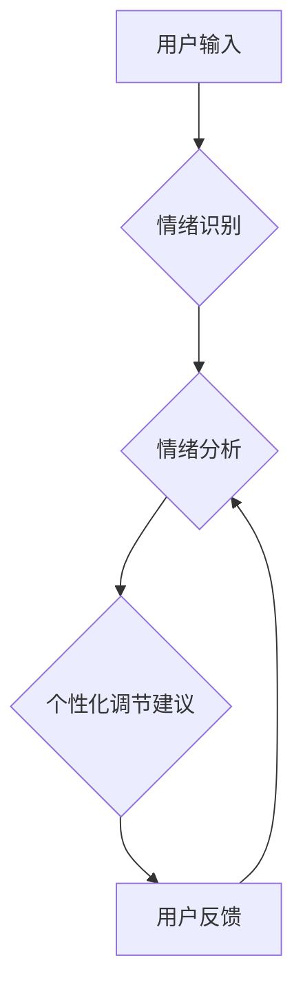

                 

## 虚拟情绪调节器工程师：AI驱动的心理健康技术专家

> 关键词：人工智能、情绪调节、心理健康、虚拟助手、自然语言处理、深度学习、情感计算

### 1. 背景介绍

在当今快速发展的社会，人们面临着越来越大的压力和焦虑。心理健康问题日益突出，成为全球关注的焦点。传统的心理治疗方法往往存在时间成本高、地域限制大、费用昂贵等问题，难以满足大众的需求。而人工智能技术的快速发展为解决这些问题提供了新的可能性。

虚拟情绪调节器（Virtual Emotional Regulator，简称VER）作为一种新型的心理健康技术，利用人工智能技术，通过与用户进行自然语言交互，识别用户的情绪状态，并提供个性化的情绪调节建议和支持。VER 具有以下优势：

* **便捷易用:** 用户随时随地可以通过智能手机、智能音箱等设备与VER进行交互，无需预约或前往线下机构。
* **个性化定制:** VER 可以根据用户的个人情况、情绪特征等信息，提供个性化的情绪调节方案。
* **成本效益高:** 相比传统心理治疗，VER 的成本更低，更易于普及。
* **数据驱动:** VER 可以收集用户的交互数据，并通过数据分析不断优化情绪调节策略。

### 2. 核心概念与联系

VER 的核心概念包括：

* **情绪识别:** 利用自然语言处理（NLP）和深度学习技术，从用户的语言表达中识别其情绪状态。
* **情绪调节:** 根据用户的情绪状态，提供相应的调节建议，例如放松技巧、积极思考方式、情绪管理策略等。
* **个性化定制:** 建立用户的个人情绪模型，并根据用户的需求和喜好，提供个性化的调节方案。
* **持续支持:** 通过定期与用户进行交互，跟踪用户的情绪变化，并提供持续的情绪支持和指导。

VER 的架构可以概括为以下流程：



### 3. 核心算法原理 & 具体操作步骤

#### 3.1  算法原理概述

VER 的核心算法主要包括情绪识别算法和情绪调节算法。

* **情绪识别算法:** 主要利用自然语言处理（NLP）和深度学习技术，从用户的文本或语音输入中识别其情绪状态。常用的情绪识别算法包括：
    * **词袋模型 (Bag-of-Words):** 将文本转换为词频向量，并利用机器学习算法进行情绪分类。
    * **主题模型 (Topic Modeling):** 从文本中提取主题，并根据主题的特征进行情绪分类。
    * **深度神经网络 (Deep Neural Network):** 利用多层神经网络结构，学习文本的语义特征，并进行情绪分类。

* **情绪调节算法:** 主要利用心理学理论和行为学原理，根据用户的情绪状态，提供相应的调节建议。常用的情绪调节算法包括：
    * **认知行为疗法 (CBT):** 帮助用户识别和改变负面思维模式，并学习应对压力和焦虑的有效策略。
    * **正念训练 (Mindfulness):** 帮助用户关注当下，接受情绪变化，并培养平静和专注。
    * **情绪调节技巧:** 提供放松技巧、积极思考方式、情绪管理策略等，帮助用户调节情绪状态。

#### 3.2  算法步骤详解

**情绪识别算法步骤:**

1. **文本预处理:** 对用户输入的文本进行清洗、分词、词干提取等预处理操作，去除停用词、标点符号等无用信息。
2. **特征提取:** 利用词袋模型、主题模型或深度神经网络等方法，从预处理后的文本中提取特征向量。
3. **情绪分类:** 利用机器学习算法或深度学习模型，对特征向量进行分类，识别用户的的情绪状态。

**情绪调节算法步骤:**

1. **情绪分析:** 对识别出的情绪状态进行分析，了解用户的具体情绪需求。
2. **调节策略选择:** 根据用户的情绪状态和个人情况，选择合适的调节策略。
3. **建议生成:** 生成个性化的情绪调节建议，例如放松技巧、积极思考方式、情绪管理策略等。
4. **交互反馈:** 与用户进行交互，了解用户的反馈，并根据反馈调整调节策略。

#### 3.3  算法优缺点

**情绪识别算法:**

* **优点:** 能够识别多种情绪状态，并提供准确的分类结果。
* **缺点:** 识别结果受用户表达方式和语言风格影响，存在一定的误差率。

**情绪调节算法:**

* **优点:** 提供个性化的调节建议，并能够根据用户的反馈进行调整。
* **缺点:** 调节效果因人而异，并非所有用户都能从中获得帮助。

#### 3.4  算法应用领域

VER 的核心算法在以下领域具有广泛的应用前景：

* **心理健康服务:** 为用户提供情绪调节支持，帮助他们应对压力、焦虑、抑郁等心理健康问题。
* **教育领域:** 帮助学生管理情绪，提高学习效率和心理健康水平。
* **企业管理:** 帮助员工缓解工作压力，提高工作满意度和生产力。
* **智能客服:** 为用户提供情感支持，提升用户体验。

### 4. 数学模型和公式 & 详细讲解 & 举例说明

#### 4.1  数学模型构建

情绪识别算法通常采用分类模型，将用户的文本或语音输入映射到不同的情绪类别。常用的分类模型包括支持向量机（SVM）、逻辑回归（Logistic Regression）和深度神经网络（DNN）。

* **支持向量机 (SVM):** SVM 是一种监督学习算法，它试图找到一个最佳的分隔超平面，将不同情绪类别的样本分开。

* **逻辑回归 (Logistic Regression):** 逻辑回归是一种线性分类模型，它使用 sigmoid 函数将线性模型的输出映射到 [0, 1] 的概率区间，表示样本属于不同情绪类别的概率。

* **深度神经网络 (DNN):** DNN 是一种多层神经网络结构，它能够学习文本的复杂语义特征，并进行情绪分类。

#### 4.2  公式推导过程

**逻辑回归模型的损失函数:**

$$
L(w,b) = -\frac{1}{N} \sum_{i=1}^{N} y_i \log(p_i) + (1-y_i) \log(1-p_i)
$$

其中：

* $w$ 和 $b$ 是模型的参数。
* $N$ 是样本数量。
* $y_i$ 是第 $i$ 个样本的真实标签（0 或 1）。
* $p_i$ 是模型预测第 $i$ 个样本属于正类（例如，积极情绪）的概率。

**损失函数的最小化:**

通过梯度下降算法等优化方法，最小化损失函数，得到模型参数 $w$ 和 $b$ 的最佳值。

#### 4.3  案例分析与讲解

假设我们有一个情绪识别模型，需要识别用户文本中的情绪类别，包括“积极”、“消极”和“中性”。我们可以使用逻辑回归模型，并训练模型在训练数据上进行分类。

训练完成后，我们可以将新的用户文本输入到模型中，模型会输出每个情绪类别的概率。例如，如果模型输出“积极”的概率为 0.7，则表明用户文本表达的情绪倾向为积极。

### 5. 项目实践：代码实例和详细解释说明

#### 5.1  开发环境搭建

VER 的开发环境可以根据具体需求进行搭建。常用的开发工具包括：

* **编程语言:** Python 是 VER 开发中常用的编程语言，因为它拥有丰富的 NLP 和深度学习库。
* **深度学习框架:** TensorFlow、PyTorch 和 Keras 等深度学习框架可以用于构建情绪识别模型。
* **自然语言处理库:** NLTK、spaCy 和 Gensim 等 NLP 库可以用于文本预处理、词向量化等操作。

#### 5.2  源代码详细实现

以下是一个简单的 Python 代码示例，演示了如何使用 NLTK 库对用户文本进行情绪分类：

```python
import nltk
from nltk.sentiment import SentimentIntensityAnalyzer

nltk.download('vader_lexicon')

analyzer = SentimentIntensityAnalyzer()

text = input("请输入文本：")

scores = analyzer.polarity_scores(text)

print(scores)
```

#### 5.3  代码解读与分析

这段代码首先下载了 VADER 词典，然后创建了一个 SentimentIntensityAnalyzer 对象。

用户输入文本后，代码使用 analyzer.polarity_scores() 函数对文本进行情绪分析，并返回一个字典，包含文本的正面、负面、中性以及总分等情绪得分。

#### 5.4  运行结果展示

当用户输入“今天天气真好”时，代码会输出以下结果：

```
{'neg': 0.0, 'neu': 0.293, 'pos': 0.707, 'compound': 0.8998}
```

结果表明，该文本的情绪倾向为积极。

### 6. 实际应用场景

VER 的实际应用场景非常广泛，例如：

* **心理健康咨询:** VER 可以作为心理咨询师的助手，帮助用户识别和管理情绪，并提供个性化的情绪调节建议。
* **情绪监测:** VER 可以用于监测用户的实时情绪状态，并根据情绪变化提供相应的支持和干预。
* **教育辅助:** VER 可以帮助学生学习情绪管理技巧，并提高学习效率和心理健康水平。
* **游戏体验增强:** VER 可以根据玩家的情绪状态，调整游戏难度和内容，提升游戏体验。

#### 6.4  未来应用展望

随着人工智能技术的不断发展，VER 的应用场景将更加广泛，例如：

* **虚拟陪伴:** VER 可以作为虚拟陪伴者，为用户提供情感支持和陪伴。
* **个性化医疗:** VER 可以根据用户的个人情绪特征，提供个性化的医疗建议和干预。
* **智能家居:** VER 可以与智能家居设备集成，根据用户的情绪状态，自动调节灯光、温度等环境因素。

### 7. 工具和资源推荐

#### 7.1  学习资源推荐

* **在线课程:** Coursera、edX 等平台提供人工智能、自然语言处理等相关课程。
* **书籍:** 《深度学习》、《自然语言处理实战》等书籍可以帮助读者深入了解相关知识。
* **开源项目:** TensorFlow、PyTorch 等开源项目可以帮助读者实践人工智能技术。

#### 7.2  开发工具推荐

* **编程语言:** Python
* **深度学习框架:** TensorFlow、PyTorch、Keras
* **自然语言处理库:** NLTK、spaCy、Gensim

#### 7.3  相关论文推荐

* **情感计算:**
    * Liu, B. (2012). Sentiment analysis and opinion mining. Synthesis lectures on human language technologies, 5(1), 1-167.
* **虚拟助手:**
    * Jurafsky, D., & Martin, J. H. (2019). Speech and language processing (3rd ed.). Pearson Education.

### 8. 总结：未来发展趋势与挑战

#### 8.1  研究成果总结

VER 技术在心理健康领域取得了显著的进展，为人们提供了一种便捷、个性化的情绪调节方式。

#### 8.2  未来发展趋势

* **模型精度提升:** 通过更先进的深度学习算法和更大的训练数据集，提高情绪识别和调节的准确性。
* **多模态交互:** 将文本、语音、表情等多模态信息融合，构建更全面的情绪感知模型。
* **个性化定制:** 基于用户的个人数据和情绪特征，提供更精准的个性化情绪调节方案。
* **伦理与安全:** 关注 VER 技术的伦理问题和安全风险，确保其安全、可靠和负责任地应用。

#### 8.3  面临的挑战

* **数据获取与标注:** 构建高质量的情绪数据标注数据集仍然是一个挑战。
* **模型解释性:** 深度学习模型的决策过程往往难以解释，这可能会影响用户的信任度。
* **隐私保护:** VER 技术需要处理用户的敏感情绪数据，因此需要采取有效的隐私保护措施。

#### 8.4  研究展望

未来，VER 技术将继续朝着更智能、更个性化、更安全的方向发展，为人们提供更全面的心理健康支持。


### 9. 附录：常见问题与解答

**Q1: VER 是否可以替代传统的心理治疗？**

A1: VER 是一种辅助工具，可以帮助用户管理情绪，但不能完全替代传统的心理治疗。对于严重的心理健康问题，仍然需要寻求专业的心理医生的帮助。

**Q2: VER 的数据安全如何保障？**

A2: 开发 VER 的团队需要采取有效的隐私保护措施，例如数据加密、匿名化处理等，确保用户的隐私安全。

**Q3: VER 的情绪识别准确率如何？**

A3: VER 的情绪识别准确率取决于模型的训练数据和算法的复杂度。随着人工智能技术的不断发展，VER 的情绪识别准确率将会不断提高。


作者：禅与计算机程序设计艺术 / Zen and the Art of Computer Programming 
<end_of_turn>

