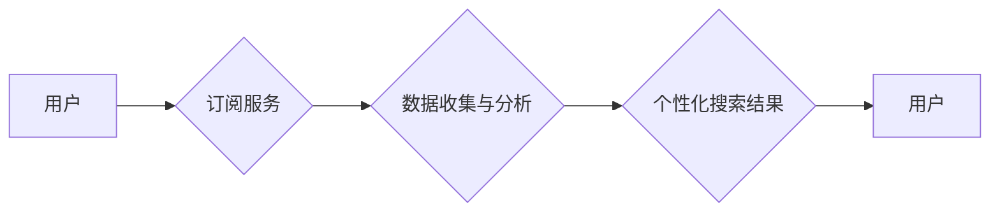

                 

## 订阅制搜索引擎：新商业模式的崛起

> 关键词：订阅制搜索引擎、个性化搜索、数据隐私、商业模式创新、人工智能

### 1. 背景介绍

互联网的蓬勃发展催生了搜索引擎作为信息获取的入口，传统的免费搜索引擎模式已经面临着新的挑战。广告收入增长放缓、用户隐私日益受到重视、搜索结果质量下降等问题，迫使搜索引擎行业探索新的商业模式。订阅制搜索引擎应运而生，以其个性化、隐私保护和高质量搜索体验，成为未来搜索引擎发展的新趋势。

### 2. 核心概念与联系

订阅制搜索引擎是一种基于订阅付费的搜索引擎服务模式。用户通过支付订阅费用，获得更优质、更个性化的搜索体验。

#### 2.1 订阅制搜索引擎的运作机制

订阅制搜索引擎的核心在于建立用户-引擎的长期关系，通过持续的订阅服务，为用户提供更精准、更可靠的搜索结果。

* **用户付费订阅:** 用户选择不同的订阅套餐，获得相应的服务权益，例如：广告屏蔽、个性化结果、优先服务等。
* **数据收集与分析:** 搜索引擎通过用户搜索行为、浏览记录、偏好设置等数据，构建用户画像，并进行深度分析。
* **个性化搜索结果:** 基于用户画像，搜索引擎提供个性化搜索结果，推荐更符合用户需求的信息。
* **持续服务与更新:** 搜索引擎不断更新算法模型，提升搜索质量，并根据用户反馈进行改进，提供更优质的服务体验。

#### 2.2 订阅制搜索引擎的架构



### 3. 核心算法原理 & 具体操作步骤

#### 3.1 算法原理概述

订阅制搜索引擎的核心算法在于个性化推荐和结果排序。传统的搜索引擎主要依靠关键词匹配和网页权重来排序结果，而订阅制搜索引擎则更加注重用户的兴趣偏好和搜索历史。

#### 3.2 算法步骤详解

1. **用户数据收集:** 收集用户的搜索历史、浏览记录、点击行为、评分反馈等数据。
2. **用户画像构建:** 利用机器学习算法，对用户数据进行分析，构建用户的兴趣偏好、搜索习惯、知识结构等画像。
3. **关键词扩展与语义理解:** 基于用户的搜索关键词，利用自然语言处理技术进行扩展和语义理解，挖掘用户的潜在需求。
4. **结果排序与推荐:** 根据用户的画像和搜索关键词，对搜索结果进行排序和推荐，优先展示与用户兴趣相符、相关性高的结果。
5. **反馈机制与模型更新:** 收集用户的反馈信息，例如点击、评分、评论等，并将其反馈到算法模型中，不断优化和更新模型，提升搜索质量。

#### 3.3 算法优缺点

**优点:**

* **个性化体验:** 提供更精准、更符合用户需求的搜索结果。
* **提升用户粘性:** 通过个性化服务，增强用户对搜索引擎的依赖和忠诚度。
* **数据价值提升:** 收集的用户数据可以用于精准营销、个性化推荐等业务，提升商业价值。

**缺点:**

* **算法复杂度高:** 需要复杂的机器学习算法和数据处理技术。
* **数据隐私问题:** 需要妥善处理用户数据，保障用户隐私安全。
* **用户接受度:** 部分用户可能对付费订阅模式产生抵触情绪。

#### 3.4 算法应用领域

* **垂直搜索引擎:** 为特定领域的用户提供个性化搜索服务，例如法律、医疗、教育等。
* **学术搜索引擎:** 为科研人员提供更精准、更全面的学术文献搜索服务。
* **新闻搜索引擎:** 为用户提供个性化新闻推荐，过滤掉不感兴趣的内容。
* **电商搜索引擎:** 为用户提供个性化商品推荐，提升购物体验。

### 4. 数学模型和公式 & 详细讲解 & 举例说明

#### 4.1 数学模型构建

订阅制搜索引擎的核心算法可以抽象为一个基于用户画像和搜索关键词的推荐模型。

假设：

* $U$ 为用户集合，$u \in U$ 表示单个用户。
* $D$ 为文档集合，$d \in D$ 表示单个文档。
* $P(u, d)$ 为用户 $u$ 对文档 $d$ 的评分，表示用户对文档的兴趣程度。
* $S(u)$ 为用户 $u$ 的搜索关键词。

#### 4.2 公式推导过程

目标：

* 找到与用户 $u$ 搜索关键词 $S(u)$ 最相关的文档 $d$。

推荐模型：

$$
R(u, d) = \alpha \cdot P(u, d) + \beta \cdot Sim(S(u), d)
$$

其中：

* $R(u, d)$ 为用户 $u$ 对文档 $d$ 的推荐分数。
* $\alpha$ 和 $\beta$ 为权重参数，控制用户评分和关键词相似度的影响程度。
* $Sim(S(u), d)$ 为用户 $u$ 的搜索关键词 $S(u)$ 与文档 $d$ 之间的相似度。

#### 4.3 案例分析与讲解

假设用户 $u$ 搜索关键词为 "人工智能发展趋势"，搜索引擎根据用户的历史搜索记录和浏览行为，构建了用户的兴趣画像，并计算出用户对相关文档的评分。同时，搜索引擎利用自然语言处理技术，计算出用户搜索关键词与文档之间的相似度。

最终，搜索引擎根据公式计算出每个文档的推荐分数，并按照分数排序，将最相关的文档推荐给用户。

### 5. 项目实践：代码实例和详细解释说明

#### 5.1 开发环境搭建

* 操作系统：Linux/macOS/Windows
* 编程语言：Python
* 框架：Flask/Django
* 数据库：MongoDB/PostgreSQL
* 工具：NLTK/SpaCy (自然语言处理)

#### 5.2 源代码详细实现

```python
# 用户画像构建
def build_user_profile(user_id):
    # 从数据库中获取用户数据
    user_data = db.get_user_data(user_id)
    # 利用机器学习算法构建用户画像
    profile = user_learning_model.train(user_data)
    return profile

# 搜索结果排序
def rank_search_results(user_profile, query):
    # 计算文档与用户画像的相似度
    similarities = document_similarity_model.calculate_similarity(user_profile, query)
    # 根据相似度排序结果
    ranked_results = sorted(results, key=lambda result: similarities[result.id], reverse=True)
    return ranked_results

# 推荐结果展示
def display_results(ranked_results):
    # 将排序后的结果展示给用户
    for result in ranked_results:
        print(result.title, result.url)
```

#### 5.3 代码解读与分析

* `build_user_profile()` 函数用于根据用户的历史数据构建用户画像。
* `rank_search_results()` 函数根据用户的画像和搜索关键词，计算文档与用户的相似度，并对搜索结果进行排序。
* `display_results()` 函数将排序后的结果展示给用户。

#### 5.4 运行结果展示

当用户输入搜索关键词时，系统会调用上述函数，根据用户的画像和关键词，计算出相关文档的推荐分数，并按照分数排序，将最相关的文档展示给用户。

### 6. 实际应用场景

#### 6.1 个性化新闻推荐

订阅制新闻搜索引擎可以根据用户的阅读偏好，过滤掉不感兴趣的新闻，并推荐更符合用户需求的新闻内容。

#### 6.2 精准学术搜索

订阅制学术搜索引擎可以根据用户的研究领域和兴趣，推荐更相关的学术文献，帮助用户更高效地进行科研工作。

#### 6.3 个性化电商推荐

订阅制电商搜索引擎可以根据用户的购物历史和偏好，推荐更符合用户需求的商品，提升用户的购物体验。

#### 6.4 未来应用展望

订阅制搜索引擎的应用场景还在不断拓展，未来可能会应用于更多领域，例如：

* 个性化教育资源推荐
* 个性化医疗信息查询
* 个性化法律咨询服务

### 7. 工具和资源推荐

#### 7.1 学习资源推荐

* **书籍:**
    * "Information Retrieval: Implementing and Evaluating Search Engines" by Manning, Raghavan, and Schütze
    * "Search Engine Optimization: An Hour a Day" by  Adam Clarke
* **在线课程:**
    * Coursera: "Information Retrieval" by University of Washington
    * edX: "Search Engines and Information Retrieval" by University of California, San Diego

#### 7.2 开发工具推荐

* **Python:** 
    * NLTK: 自然语言处理工具包
    * SpaCy: 自然语言处理工具包
    * Flask/Django: Web 框架
* **数据库:**
    * MongoDB: NoSQL 数据库
    * PostgreSQL: SQL 数据库

#### 7.3 相关论文推荐

* "Personalized Search: A Survey" by  J. Zhang et al.
* "Learning to Rank for Information Retrieval" by C. Liu et al.

### 8. 总结：未来发展趋势与挑战

#### 8.1 研究成果总结

订阅制搜索引擎是一种新兴的搜索引擎模式，它通过个性化推荐和数据分析，为用户提供更优质的搜索体验。

#### 8.2 未来发展趋势

* **人工智能技术的应用:** 利用深度学习等人工智能技术，提升个性化推荐的准确性和效率。
* **多模态搜索:** 将文本、图像、音频等多模态数据融合到搜索引擎中，提供更丰富的搜索体验。
* **隐私保护技术:** 加强用户数据隐私保护，构建更加安全可靠的搜索环境。

#### 8.3 面临的挑战

* **算法复杂度:** 个性化推荐算法的复杂度较高，需要不断优化和改进。
* **数据隐私问题:** 如何妥善处理用户数据，保障用户隐私安全是一个重要的挑战。
* **用户接受度:** 部分用户可能对付费订阅模式产生抵触情绪，需要进行有效的推广和教育。

#### 8.4 研究展望

未来，订阅制搜索引擎将继续朝着更个性化、更智能、更安全的方向发展。研究者将继续探索新的算法模型、数据分析技术和隐私保护机制，为用户提供更优质的搜索体验。

### 9. 附录：常见问题与解答

* **Q1: 订阅制搜索引擎的收费标准如何？**

A1: 订阅制搜索引擎的收费标准因平台而异，通常根据订阅套餐、服务内容和使用时长等因素进行制定。

* **Q2: 订阅制搜索引擎会收集我的个人数据吗？**

A2: 订阅制搜索引擎为了提供个性化服务，需要收集用户的搜索历史、浏览记录等数据。但是，平台会采取相应的措施保障用户数据隐私安全。

* **Q3: 我可以使用免费的搜索引擎吗？**

A3: 当然可以，传统的免费搜索引擎仍然存在，但它们可能会受到广告收入和数据隐私等方面的限制。


作者：禅与计算机程序设计艺术 / Zen and the Art of Computer Programming 
<end_of_turn>

