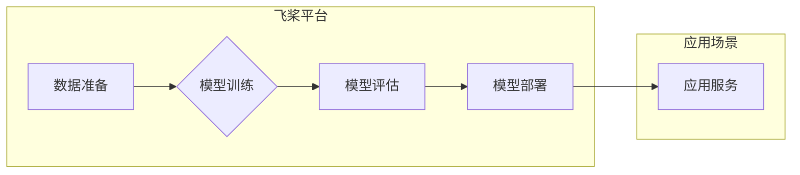

                 

## 讲好AI infra故事：贾扬清的策略，通过产品展示实力与品牌建设

> 关键词：AI infrastructure,  AI platform,  产品战略,  品牌建设,  技术赋能,  开源社区,  技术传播

### 1. 背景介绍

近年来，人工智能（AI）技术蓬勃发展，其应用场景不断拓展，对算力、存储、网络等基础设施的需求也日益增长。AI基础设施（AI infrastructure）作为AI应用的基石，其发展对推动AI产业生态繁荣至关重要。

贾扬清，作为一位杰出的AI技术专家和企业家，带领开源社区和企业共同构建了领先的AI基础设施平台——飞桨（PaddlePaddle）。飞桨平台以其强大的功能、灵活的架构和活跃的社区生态，在AI领域获得了广泛认可和应用。

本文将从产品战略、品牌建设、技术赋能等多个维度，分析贾扬清构建飞桨平台的成功经验，探讨其对AI基础设施发展的影响。

### 2. 核心概念与联系

**2.1 AI基础设施的定义**

AI基础设施是指为人工智能应用提供计算资源、存储资源、网络资源、数据管理、模型训练和部署等一系列服务的基础设施。它为AI应用提供了一个完整的技术平台，降低了AI应用的门槛，加速了AI技术的普及。

**2.2 飞桨平台的核心概念**

飞桨平台是一个开源的、端到端的AI平台，旨在为开发者提供从数据准备到模型部署的全流程AI解决方案。其核心概念包括：

* **开源与社区驱动:** 飞桨平台采用开源模式，鼓励开发者参与到平台的开发和维护中，构建一个活跃的社区生态。
* **易用性与灵活性:** 飞桨平台提供简洁易用的API和丰富的工具，方便开发者快速上手和灵活定制。
* **模型多样性:** 飞桨平台支持多种主流的AI模型，包括深度学习、强化学习、自然语言处理等，满足不同应用场景的需求。
* **跨平台部署:** 飞桨平台支持在多种硬件平台上部署，包括CPU、GPU、TPU等，方便开发者选择合适的部署环境。

**2.3 飞桨平台架构**

### 3. 核心算法原理 & 具体操作步骤

**3.1 算法原理概述**

飞桨平台基于深度学习算法，并结合了多种先进的AI算法，例如Transformer、BERT、GPT等。这些算法能够有效地处理海量数据，学习复杂的模式，并实现高精度的人工智能应用。

**3.2 算法步骤详解**

1. **数据收集和预处理:** 收集相关数据，并进行清洗、格式化、编码等预处理操作，以确保数据质量和算法训练的有效性。
2. **模型选择和训练:** 根据应用场景选择合适的深度学习模型，并利用飞桨平台提供的训练工具进行模型训练。训练过程包括输入数据、计算损失函数、更新模型参数等步骤。
3. **模型评估和调优:** 对训练好的模型进行评估，并根据评估结果进行模型调优，例如调整模型参数、增加训练数据等，以提高模型性能。
4. **模型部署和应用:** 将训练好的模型部署到目标平台，并将其应用于实际场景，例如图像识别、自然语言处理、语音识别等。

**3.3 算法优缺点**

**优点:**

* 高精度: 深度学习算法能够学习复杂的模式，实现高精度的人工智能应用。
* 可扩展性: 深度学习模型可以利用分布式训练技术，在更大规模的数据集上进行训练。
* 通用性: 深度学习算法可以应用于多种不同的领域，例如图像识别、自然语言处理、语音识别等。

**缺点:**

* 数据依赖: 深度学习算法需要大量的训练数据，否则模型性能会下降。
* 计算资源消耗: 深度学习模型的训练需要大量的计算资源，例如GPU。
* 黑盒效应: 深度学习模型的决策过程难以解释，难以理解模型的内部机制。

**3.4 算法应用领域**

深度学习算法在各个领域都有广泛的应用，例如：

* **计算机视觉:** 图像识别、物体检测、图像分割、人脸识别等。
* **自然语言处理:** 文本分类、情感分析、机器翻译、对话系统等。
* **语音识别:** 语音转文本、语音合成等。
* **推荐系统:** 商品推荐、内容推荐等。
* **医疗诊断:** 病情诊断、疾病预测等。

### 4. 数学模型和公式 & 详细讲解 & 举例说明

**4.1 数学模型构建**

深度学习模型通常基于神经网络结构，其数学模型可以表示为一系列的矩阵运算和激活函数。

**4.2 公式推导过程**

深度学习模型的训练过程基于梯度下降算法，其核心公式包括：

* **损失函数:** 用于衡量模型预测结果与真实值的差距。常见的损失函数包括均方误差（MSE）、交叉熵损失（Cross-Entropy Loss）等。
* **梯度:** 用于计算损失函数对模型参数的导数，指示模型参数需要调整的方向和幅度。
* **更新规则:** 用于根据梯度更新模型参数，例如随机梯度下降（SGD）、动量法（Momentum）等。

**4.3 案例分析与讲解**

以图像分类为例，假设模型输入一张图像，经过一系列的卷积层、池化层和全连接层后，输出一个概率分布，表示图像属于不同类别 的概率。

损失函数可以选用交叉熵损失，其公式如下：

$$
L = -\sum_{i=1}^{C} y_i \log(p_i)
$$

其中：

* $C$ 为类别数
* $y_i$ 为真实标签的 one-hot 编码
* $p_i$ 为模型预测的类别 $i$ 的概率

梯度下降算法会根据损失函数的梯度，更新模型参数，使得模型预测结果与真实标签的差距最小化。

### 5. 项目实践：代码实例和详细解释说明

**5.1 开发环境搭建**

飞桨平台支持多种开发环境，例如Python、C++等。

**5.2 源代码详细实现**

飞桨平台提供了丰富的API和工具，可以方便地实现各种AI应用。

**5.3 代码解读与分析**

飞桨平台的源代码开源，开发者可以自由阅读和修改，深入了解平台的内部机制。

**5.4 运行结果展示**

飞桨平台提供了多种评估指标，可以方便地评估模型的性能。

### 6. 实际应用场景

飞桨平台已在多个领域得到了广泛应用，例如：

* **医疗健康:** 疾病诊断、药物研发等。
* **金融科技:** 风险评估、欺诈检测等。
* **智能制造:** 质量检测、设备故障预测等。
* **教育科技:** 智能辅导、个性化学习等。

**6.4 未来应用展望**

随着AI技术的不断发展，飞桨平台将在更多领域得到应用，例如：

* **自动驾驶:** 车辆感知、路径规划等。
* **机器人技术:** 机器人控制、自然语言交互等。
* **元宇宙:** 数字孪生、虚拟场景构建等。

### 7. 工具和资源推荐

**7.1 学习资源推荐**

* 飞桨官方文档：https://www.paddlepaddle.org.cn/documentation/docs/zh/
* 飞桨社区论坛：https://bbs.paddlepaddle.org.cn/

**7.2 开发工具推荐**

* 飞桨深度学习框架：https://www.paddlepaddle.org.cn/
* 飞桨模型库：https://paddlemodels.com/

**7.3 相关论文推荐**

* [飞桨论文集](https://github.com/PaddlePaddle/PaddlePaddle/tree/develop/docs/papers)

### 8. 总结：未来发展趋势与挑战

**8.1 研究成果总结**

贾扬清和他的团队通过构建飞桨平台，为AI基础设施的发展做出了重要贡献。飞桨平台的开源、易用、灵活等特点，促进了AI技术的普及和应用。

**8.2 未来发展趋势**

未来，AI基础设施将朝着以下方向发展：

* **更强大的算力:** 随着AI模型规模的不断增长，对算力的需求将进一步增加。
* **更智能的自动化:** AI基础设施将更加智能化，能够自动进行模型训练、部署和优化。
* **更广泛的应用场景:** AI基础设施将应用于更多领域，例如自动驾驶、机器人技术、元宇宙等。

**8.3 面临的挑战**

AI基础设施的发展也面临着一些挑战：

* **数据安全和隐私保护:** AI模型的训练需要大量数据，如何保证数据安全和隐私保护是一个重要问题。
* **算法可解释性和公平性:** 深度学习模型的决策过程难以解释，如何保证算法的公平性和可解释性是一个重要的研究方向。
* **人才短缺:** AI基础设施的开发和维护需要大量的人才，人才短缺是一个制约AI发展的重要因素。

**8.4 研究展望**

未来，我们需要继续加强对AI基础设施的研究，解决上述挑战，推动AI技术的健康发展。

### 9. 附录：常见问题与解答

**常见问题:**

* 如何安装飞桨平台？
* 如何使用飞桨平台训练模型？
* 如何部署飞桨平台的模型？

**解答:**

* 飞桨平台的安装方法可以参考官方文档：https://www.paddlepaddle.org.cn/documentation/docs/zh/
* 飞桨平台提供了丰富的API和工具，可以方便地训练模型。
* 飞桨平台支持在多种硬件平台上部署模型。

作者：禅与计算机程序设计艺术 / Zen and the Art of Computer Programming 
<end_of_turn>

