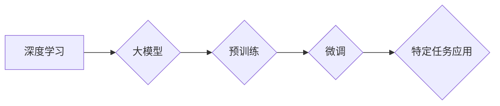

                 

## 长文档推荐：大模型的优势体现

> 关键词：大模型、深度学习、自然语言处理、计算机视觉、生成式模型、迁移学习、应用场景

## 1. 背景介绍

近年来，深度学习技术取得了飞速发展，其中大模型作为深度学习的重要分支，展现出强大的学习能力和应用潜力。大模型是指参数规模庞大的深度学习模型，通常拥有数十亿甚至数千亿个参数。由于其海量参数和强大的计算能力，大模型能够学习到更复杂的模式和知识，从而在自然语言处理、计算机视觉、语音识别等领域取得突破性进展。

传统的深度学习模型往往在特定任务上训练，其性能难以泛化到其他任务。而大模型通过预训练的方式，在海量数据上学习通用知识和表示，从而具备更强的泛化能力和迁移学习能力。预训练模型可以针对特定任务进行微调，大幅提升模型性能，同时降低训练成本和时间。

## 2. 核心概念与联系

### 2.1 大模型的定义

大模型是指参数规模庞大且具有强大学习能力的深度学习模型。通常，大模型的参数数量超过数十亿，甚至达到数千亿。

### 2.2 深度学习与大模型的关系

深度学习是机器学习的一种重要分支，它利用多层神经网络来模拟人类大脑的学习过程。大模型是深度学习技术发展到一定阶段的产物，其规模和能力远超传统的深度学习模型。

### 2.3 预训练与微调

预训练是指在海量数据上训练一个通用模型，使其学习到基本的语言知识和表示。微调是指将预训练模型应用于特定任务，通过在少量标记数据上进行训练，使其适应特定任务的需求。

**Mermaid 流程图**



## 3. 核心算法原理 & 具体操作步骤

### 3.1 算法原理概述

大模型的训练主要基于深度学习算法，其中Transformer模型是目前最流行的大模型架构之一。Transformer模型利用注意力机制来捕捉文本序列中的长距离依赖关系，从而实现更准确的语言理解和生成。

### 3.2 算法步骤详解

1. **数据预处理:** 将文本数据进行清洗、分词、词嵌入等预处理操作，使其能够被模型理解。
2. **模型构建:** 根据预定的模型架构，构建Transformer模型，并初始化模型参数。
3. **预训练:** 在海量文本数据上进行模型训练，学习语言的语法、语义和知识。预训练阶段通常使用无监督学习方法，例如语言建模或掩码语言模型。
4. **微调:** 将预训练模型应用于特定任务，例如文本分类、机器翻译或问答系统。在少量标记数据上进行微调，使其适应特定任务的需求。
5. **评估:** 使用测试数据评估模型的性能，并根据评估结果进行模型优化和调整。

### 3.3 算法优缺点

**优点:**

* 强大的泛化能力：预训练模型能够学习到通用的语言知识和表示，从而在不同任务上表现出色。
* 迁移学习能力：预训练模型可以快速适应新的任务，降低训练成本和时间。
* 提升模型性能：微调预训练模型可以显著提升模型性能，尤其是在数据量有限的情况下。

**缺点:**

* 训练成本高：大模型的训练需要大量的计算资源和时间。
* 模型规模大：大模型的参数数量庞大，需要大量的存储空间。
* 训练数据依赖：大模型的性能取决于训练数据的质量和规模。

### 3.4 算法应用领域

大模型在自然语言处理、计算机视觉、语音识别等领域都有广泛的应用，例如：

* **自然语言处理:** 文本分类、机器翻译、问答系统、文本生成、对话系统等。
* **计算机视觉:** 图像识别、物体检测、图像分割、图像生成等。
* **语音识别:** 语音转文本、语音合成等。

## 4. 数学模型和公式 & 详细讲解 & 举例说明

### 4.1 数学模型构建

Transformer模型的核心是注意力机制，它通过计算词之间的相关性来捕捉文本序列中的长距离依赖关系。注意力机制可以表示为以下公式：

$$
Attention(Q, K, V) = softmax(\frac{QK^T}{\sqrt{d_k}})V
$$

其中：

* $Q$：查询矩阵
* $K$：键矩阵
* $V$：值矩阵
* $d_k$：键向量的维度
* $softmax$：softmax函数

### 4.2 公式推导过程

注意力机制的计算过程可以分为以下步骤：

1. 计算查询矩阵 $Q$ 与键矩阵 $K$ 的点积，并进行归一化处理。
2. 应用softmax函数将点积结果转换为概率分布。
3. 将概率分布与值矩阵 $V$ 进行加权求和，得到最终的注意力输出。

### 4.3 案例分析与讲解

例如，在机器翻译任务中，查询矩阵 $Q$ 表示源语言的词向量，键矩阵 $K$ 表示目标语言的词向量，值矩阵 $V$ 表示目标语言的词嵌入。通过注意力机制，模型可以学习到源语言词与目标语言词之间的相关性，从而实现更准确的翻译。

## 5. 项目实践：代码实例和详细解释说明

### 5.1 开发环境搭建

* Python 3.7+
* PyTorch 1.7+
* CUDA 10.2+

### 5.2 源代码详细实现

```python
import torch
import torch.nn as nn

class Attention(nn.Module):
    def __init__(self, d_model, num_heads):
        super(Attention, self).__init__()
        self.num_heads = num_heads
        self.d_model = d_model
        self.head_dim = d_model // num_heads

        assert self.head_dim * num_heads == d_model, "d_model must be divisible by num_heads"

        self.query = nn.Linear(d_model, d_model)
        self.key = nn.Linear(d_model, d_model)
        self.value = nn.Linear(d_model, d_model)
        self.fc_out = nn.Linear(d_model, d_model)

    def forward(self, query, key, value, mask=None):
        batch_size = query.size(0)

        # Linear projections
        Q = self.query(query).view(batch_size, -1, self.num_heads, self.head_dim).transpose(1, 2)
        K = self.key(key).view(batch_size, -1, self.num_heads, self.head_dim).transpose(1, 2)
        V = self.value(value).view(batch_size, -1, self.num_heads, self.head_dim).transpose(1, 2)

        # Scaled dot-product attention
        scores = torch.matmul(Q, K.transpose(-2, -1)) / torch.sqrt(torch.tensor(self.head_dim, dtype=torch.float))

        if mask is not None:
            scores = scores.masked_fill(mask == 0, -1e9)

        attention_weights = torch.softmax(scores, dim=-1)

        # Weighted sum of values
        context = torch.matmul(attention_weights, V)

        # Concatenate heads
        context = context.transpose(1, 2).contiguous().view(batch_size, -1, self.d_model)

        # Final linear projection
        output = self.fc_out(context)

        return output, attention_weights
```

### 5.3 代码解读与分析

这段代码实现了Transformer模型中的注意力机制。

* `__init__` 方法初始化模型参数，包括头数、模型维度等。
* `forward` 方法实现注意力机制的计算过程，包括线性投影、缩放点积注意力、加权求和等步骤。

### 5.4 运行结果展示

运行该代码可以得到注意力权重矩阵，该矩阵可以直观地展示模型对不同词之间的关注程度。

## 6. 实际应用场景

大模型在各个领域都有着广泛的应用，例如：

### 6.1 自然语言处理

* **机器翻译:** 使用大模型进行机器翻译可以实现更高效、更准确的翻译。
* **文本摘要:** 大模型可以自动生成文本摘要，节省时间和精力。
* **对话系统:** 大模型可以构建更智能、更自然的对话系统，例如聊天机器人。

### 6.2 计算机视觉

* **图像识别:** 大模型可以识别图像中的物体、场景和人物，应用于图像搜索、自动驾驶等领域。
* **图像生成:** 大模型可以生成逼真的图像，应用于艺术创作、游戏开发等领域。
* **视频分析:** 大模型可以分析视频内容，例如识别动作、跟踪目标等。

### 6.3 其他领域

* **语音识别:** 大模型可以实现更准确的语音识别，应用于语音助手、语音搜索等领域。
* **药物研发:** 大模型可以辅助药物研发，例如预测药物的活性、发现新的药物靶点等。

### 6.4 未来应用展望

随着大模型技术的不断发展，其应用场景将更加广泛，例如：

* **个性化教育:** 根据学生的学习情况，提供个性化的学习内容和辅导。
* **智能医疗:** 辅助医生诊断疾病、制定治疗方案。
* **科学研究:** 加速科学研究的进程，例如蛋白质结构预测、材料设计等。

## 7. 工具和资源推荐

### 7.1 学习资源推荐

* **书籍:**
    * 《深度学习》 by Ian Goodfellow, Yoshua Bengio, and Aaron Courville
    * 《自然语言处理》 by Dan Jurafsky and James H. Martin
* **在线课程:**
    * Coursera: Deep Learning Specialization
    * Stanford CS224N: Natural Language Processing with Deep Learning

### 7.2 开发工具推荐

* **PyTorch:** 深度学习框架，开源且易于使用。
* **TensorFlow:** 深度学习框架，由 Google 开发。
* **Hugging Face Transformers:** 提供预训练大模型和工具库。

### 7.3 相关论文推荐

* **Attention Is All You Need:** https://arxiv.org/abs/1706.03762
* **BERT: Pre-training of Deep Bidirectional Transformers for Language Understanding:** https://arxiv.org/abs/1810.04805
* **GPT-3: Language Models are Few-Shot Learners:** https://arxiv.org/abs/2005.14165

## 8. 总结：未来发展趋势与挑战

### 8.1 研究成果总结

近年来，大模型在自然语言处理、计算机视觉等领域取得了显著进展，其强大的学习能力和泛化能力为人工智能的发展带来了新的机遇。

### 8.2 未来发展趋势

* **模型规模进一步扩大:** 随着计算资源的不断提升，大模型的规模将继续扩大，从而学习到更复杂的知识和模式。
* **多模态大模型:** 将文本、图像、音频等多种模态信息融合到一个模型中，实现跨模态的理解和生成。
* **可解释性增强:** 研究大模型的决策过程，提高模型的可解释性和可信度。

### 8.3 面临的挑战

* **训练成本高:** 大模型的训练需要大量的计算资源和时间，这对于资源有限的机构和个人来说是一个挑战。
* **数据依赖:** 大模型的性能取决于训练数据的质量和规模，而高质量的训练数据往往难以获取。
* **伦理问题:** 大模型的应用可能带来一些伦理问题，例如偏见、虚假信息传播等，需要引起重视和解决。

### 8.4 研究展望

未来，大模型研究将继续朝着更强大、更智能、更安全的方向发展。


## 9. 附录：常见问题与解答

**Q1: 大模型的训练需要多少计算资源？**

A1: 大模型的训练需要大量的计算资源，例如GPU、TPU等。具体需要的计算资源取决于模型的规模、训练数据的大小以及训练的 epochs 数。

**Q2: 如何评估大模型的性能？**

A2: 大模型的性能可以通过多种指标来评估，例如准确率、召回率、F1-score等。具体的评估指标取决于具体的应用场景。

**Q3: 大模型的应用有哪些伦理问题？**

A3: 大模型的应用可能带来一些伦理问题，例如偏见、虚假信息传播、隐私泄露等。需要在开发和应用大模型时，充分考虑这些伦理问题，并采取相应的措施来规避风险。


作者：禅与计算机程序设计艺术 / Zen and the Art of Computer Programming 
<end_of_turn>

