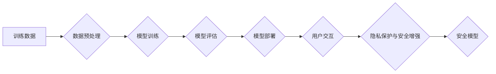

                 

## 隐私和安全：修补 LLM 的隐私漏洞

> 关键词：大型语言模型 (LLM)、隐私泄露、数据安全、对抗训练、联邦学习、差分隐私、模型压缩、可解释性

### 1. 背景介绍

大型语言模型 (LLM) 凭借其强大的文本生成、理解和翻译能力，在自然语言处理领域取得了突破性进展。然而，LLM 的训练和应用也带来了新的隐私和安全挑战。由于 LLMs 需要大量文本数据进行训练，这些数据可能包含敏感个人信息，如姓名、地址、电话号码等。如果这些信息未得到妥善保护，就有可能导致隐私泄露和数据滥用。

此外，LLMs 的黑盒性质也加剧了安全风险。由于 LLMs 的内部工作机制复杂，难以理解其决策过程，这使得攻击者难以识别和防御潜在的攻击。例如，攻击者可以利用 LLMs 生成恶意文本，进行网络钓鱼攻击或传播虚假信息。

为了应对这些挑战，研究人员提出了多种隐私保护和安全增强技术，旨在修补 LLMs 的隐私漏洞，确保其安全可靠地应用于各种场景。

### 2. 核心概念与联系

**2.1 隐私泄露的类型**

LLMs 可能会导致以下类型的隐私泄露：

* **直接泄露:** 模型输出直接包含训练数据中的敏感信息。
* **间接泄露:** 通过分析模型的输出，攻击者可以推断出训练数据中的敏感信息。
* **模型攻击:** 攻击者利用模型的结构或参数，进行数据恢复或身份识别攻击。

**2.2 安全威胁**

LLMs 面临的常见安全威胁包括：

* **恶意文本生成:** 攻击者利用 LLMs 生成恶意文本，进行网络钓鱼攻击、传播虚假信息或进行其他恶意活动。
* **数据 poisoning:** 攻击者将恶意数据注入训练数据，从而影响模型的输出结果。
* **模型劫持:** 攻击者控制模型的输入或输出，使其执行恶意指令。

**2.3 隐私保护与安全增强技术**

为了应对这些挑战，研究人员提出了多种技术，包括：

* **差分隐私:** 通过添加噪声来保护训练数据中的敏感信息。
* **联邦学习:** 将模型训练分散在多个设备上，避免将原始数据集中存储。
* **模型压缩:** 减少模型的大小，降低攻击面。
* **对抗训练:** 通过训练模型抵抗对抗性攻击。
* **可解释性:** 提高模型的透明度，帮助识别和防御潜在的攻击。

**2.4 Mermaid 流程图**



### 3. 核心算法原理 & 具体操作步骤

**3.1 算法原理概述**

差分隐私是保护训练数据隐私的一种重要技术。其核心思想是通过添加噪声来保证训练数据中的敏感信息不被泄露。

**3.2 算法步骤详解**

1. **选择隐私预算:** 隐私预算 (ε) 是衡量隐私保护强度的参数，ε 越小，隐私保护越强。
2. **添加噪声:** 在训练过程中，对模型的梯度添加噪声，噪声的大小取决于隐私预算和数据敏感度。
3. **训练模型:** 使用添加了噪声的梯度训练模型。
4. **评估模型:** 评估模型的性能，并根据需要调整隐私预算。

**3.3 算法优缺点**

**优点:**

* 理论上可以保证隐私保护。
* 可以应用于各种机器学习算法。

**缺点:**

* 会降低模型的准确性。
* 需要选择合适的隐私预算，平衡隐私保护和模型性能。

**3.4 算法应用领域**

差分隐私广泛应用于以下领域:

* **医疗保健:** 保护患者隐私数据。
* **金融:** 保护客户财务信息。
* **市场调研:** 保护参与者个人信息。

### 4. 数学模型和公式 & 详细讲解 & 举例说明

**4.1 数学模型构建**

差分隐私的数学模型基于随机机制。假设我们有一个数据集 D，其中包含敏感信息。我们想要训练一个模型 f(D)，并保证模型的输出满足差分隐私性质。

**4.2 公式推导过程**

差分隐私的正式定义是：对于任意两个相邻数据集 D 和 D'，以及任意输出结果 S，以下不等式成立：

$$
P(f(D) = S) \leq e^{\epsilon} P(f(D') = S)
$$

其中，ε 是隐私预算。

**4.3 案例分析与讲解**

假设我们有一个包含用户年龄的训练数据集。我们想要训练一个模型来预测用户的收入。如果模型输出直接包含用户的年龄信息，则会泄露用户的隐私。

使用差分隐私技术，我们可以对模型的梯度添加噪声，从而保护用户的年龄信息。

### 5. 项目实践：代码实例和详细解释说明

**5.1 开发环境搭建**

* Python 3.7+
* TensorFlow 2.0+
* PyTorch 1.0+

**5.2 源代码详细实现**

```python
import tensorflow as tf

# 定义差分隐私模型
class DPModel(tf.keras.Model):
    def __init__(self, epsilon):
        super(DPModel, self).__init__()
        self.epsilon = epsilon

    def call(self, inputs):
        # 在模型的输出上添加噪声
        output = tf.keras.layers.Dense(10, activation='relu')(inputs)
        output = tf.keras.layers.Dense(1, activation='linear')(output)
        output += tf.random.normal(shape=output.shape, stddev=1 / tf.sqrt(self.epsilon))
        return output

# 创建差分隐私模型
model = DPModel(epsilon=1.0)

# 训练模型
model.compile(optimizer='adam', loss='mse')
model.fit(x_train, y_train, epochs=10)

# 评估模型
loss = model.evaluate(x_test, y_test)
print('Loss:', loss)
```

**5.3 代码解读与分析**

* 在 `DPModel` 类中，我们定义了一个差分隐私模型。
* 在 `call` 方法中，我们对模型的输出添加了噪声。噪声的大小取决于隐私预算 `epsilon`。
* 训练模型时，我们使用 `tf.random.normal` 函数生成噪声，并将其添加到模型的输出上。

**5.4 运行结果展示**

训练完成后，我们可以评估模型的性能。由于添加了噪声，模型的准确性可能会降低。

### 6. 实际应用场景

**6.1 医疗保健**

* 使用差分隐私保护患者的医疗记录，进行疾病预测和风险评估。
* 利用联邦学习训练疾病诊断模型，避免将患者数据集中存储。

**6.2 金融**

* 使用差分隐私保护客户的财务信息，进行信用评分和欺诈检测。
* 利用联邦学习训练反欺诈模型，避免将客户数据集中存储。

**6.3 市场调研**

* 使用差分隐私保护参与者的个人信息，进行市场调研和用户画像分析。
* 利用联邦学习训练用户偏好模型，避免将用户数据集中存储。

**6.4 未来应用展望**

随着 LLM 技术的不断发展，隐私保护和安全增强技术将变得越来越重要。未来，我们可能会看到以下应用场景：

* **个性化推荐:** 使用差分隐私保护用户的浏览历史和购买记录，提供个性化推荐。
* **自动驾驶:** 使用联邦学习训练自动驾驶模型，避免将驾驶数据集中存储。
* **智能家居:** 使用差分隐私保护用户的家庭信息，提供更安全的智能家居体验。

### 7. 工具和资源推荐

**7.1 学习资源推荐**

* **论文:**

    * "Differentially Private Machine Learning" by Cynthia Dwork and Aaron Roth
    * "Federated Learning: Strategies for Improving Communication Efficiency" by Brendan McMahan et al.

* **书籍:**

    * "The Algorithmic Foundations of Differential Privacy" by Cynthia Dwork and Aaron Roth
    * "Federated Learning: Collaborative Machine Learning Without Centralized Training Data" by Andrew Trask

**7.2 开发工具推荐**

* **TensorFlow Privacy:** TensorFlow 的差分隐私库。
* **PySyft:** PyTorch 的联邦学习库。
* **OpenMined:** 开源的隐私计算平台。

**7.3 相关论文推荐**

* "On the Robustness of Deep Learning Models to Adversarial Attacks" by Ian Goodfellow et al.
* "Adversarial Examples for Machine Learning" by Nicolas Papernot et al.

### 8. 总结：未来发展趋势与挑战

**8.1 研究成果总结**

近年来，在隐私保护和安全增强方面取得了显著进展。差分隐私和联邦学习等技术为保护 LLM 训练数据和应用场景提供了有效手段。

**8.2 未来发展趋势**

* **更有效的隐私保护技术:** 研究更有效的隐私保护技术，例如可微隐私计算和同态加密。
* **更强大的安全模型:** 研究更强大的安全模型，例如对抗训练和模型蒸馏。
* **可解释性增强:** 提高 LLM 的可解释性，帮助识别和防御潜在的攻击。

**8.3 面临的挑战**

* **隐私预算与模型性能的平衡:** 如何在保证隐私保护的同时，保持模型的性能？
* **联邦学习的通信效率:** 如何提高联邦学习的通信效率，降低训练成本？
* **模型攻击的复杂性:** 如何应对越来越复杂的模型攻击？

**8.4 研究展望**

未来，研究人员将继续探索新的隐私保护和安全增强技术，以确保 LLM 安全可靠地应用于各种场景。


### 9. 附录：常见问题与解答

**9.1 Q: 差分隐私会降低模型的准确性吗？**

**A:** 是的，差分隐私会降低模型的准确性。这是因为添加噪声会增加模型的方差，从而降低其拟合能力。

**9.2 Q: 联邦学习可以完全避免数据泄露吗？**

**A:** 联邦学习可以有效降低数据泄露风险，但不能完全避免。例如，攻击者可能可以通过分析模型的输出，推断出训练数据中的敏感信息。

**9.3 Q: 如何选择合适的隐私预算？**

**A:** 隐私预算的选择需要根据具体的应用场景和数据敏感度进行权衡。较小的隐私预算可以提供更强的隐私保护，但可能会导致模型性能下降。


作者：禅与计算机程序设计艺术 / Zen and the Art of Computer Programming 
<end_of_turn>

