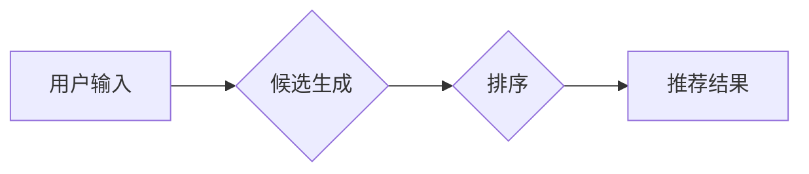

                 

## 零样本推荐：候选生成与排序

> 关键词：零样本学习，推荐系统，候选生成，排序算法，信息检索，自然语言处理

### 1. 背景介绍

推荐系统是现代互联网应用中不可或缺的一部分，它通过分析用户行为和偏好，为用户提供个性化的商品、内容或服务建议。传统的推荐系统通常依赖于大量的用户历史数据进行训练，但现实世界中，许多场景缺乏充足的训练数据，例如新用户、新商品或新类别。

零样本推荐 (Zero-Shot Recommendation) 旨在解决这一挑战，它通过利用知识图谱、语义信息和迁移学习等技术，在没有特定目标用户或商品的历史交互数据的情况下，为用户提供推荐。

### 2. 核心概念与联系

零样本推荐的核心思想是利用已有的知识和语义信息，将新用户或新商品映射到已知的用户或商品空间，从而进行推荐。

**核心概念：**

* **候选生成 (Candidate Generation):** 首先，需要生成一个候选集，包含与用户或商品相关的潜在推荐项。
* **排序 (Ranking):** 然后，对候选集进行排序，根据用户偏好或商品相关性，将推荐项按优先级排列。

**架构流程图：**



**核心联系：**

* 候选生成和排序是零样本推荐的两大关键步骤。
* 候选生成依赖于知识图谱、语义信息和迁移学习等技术，以生成与用户或商品相关的候选集。
* 排序算法则根据用户偏好或商品相关性，对候选集进行排序，最终输出推荐结果。

### 3. 核心算法原理 & 具体操作步骤

#### 3.1 算法原理概述

零样本推荐算法通常基于以下原理：

* **知识图谱嵌入:** 将知识图谱中的实体和关系表示为向量，从而捕捉实体之间的语义关系。
* **迁移学习:** 利用已训练好的模型，将知识迁移到新的任务或领域，例如将电影推荐模型迁移到音乐推荐任务。
* **语义相似度计算:** 利用词向量或句子嵌入技术，计算用户或商品之间的语义相似度，作为推荐依据。

#### 3.2 算法步骤详解

**零样本推荐算法的具体步骤如下：**

1. **构建知识图谱:** 收集用户、商品、类别、属性等信息，构建知识图谱。
2. **知识图谱嵌入:** 使用知识图谱嵌入算法，将知识图谱中的实体和关系表示为向量。
3. **候选生成:** 根据用户的输入信息，例如用户兴趣、商品类别等，利用知识图谱嵌入和语义相似度计算，生成与用户相关的候选商品集。
4. **排序:** 对候选商品集进行排序，可以使用基于用户的排序算法，例如协同过滤，或者基于商品的排序算法，例如基于内容的过滤。
5. **输出推荐结果:** 将排序后的候选商品集作为推荐结果输出。

#### 3.3 算法优缺点

**优点:**

* 不需要大量用户历史数据，可以应用于新用户或新商品场景。
* 可以利用知识图谱和语义信息，提供更精准和个性化的推荐。

**缺点:**

* 知识图谱构建和维护成本较高。
* 候选生成和排序算法的性能仍然存在提升空间。

#### 3.4 算法应用领域

零样本推荐算法在以下领域具有广泛的应用前景:

* **电子商务:** 为新用户推荐商品，提高转化率。
* **内容推荐:** 为用户推荐个性化的新闻、视频、音乐等内容。
* **医疗保健:** 为患者推荐合适的医生、医院或治疗方案。
* **教育:** 为学生推荐合适的课程或学习资源。

### 4. 数学模型和公式 & 详细讲解 & 举例说明

#### 4.1 数学模型构建

零样本推荐的数学模型通常基于以下假设：

* 用户和商品可以表示为向量空间中的点。
* 用户对商品的偏好可以用用户和商品向量之间的相似度来表示。

**用户-商品交互矩阵:**

假设有 $m$ 个用户和 $n$ 个商品，用户-商品交互矩阵 $R$ 是一个 $m \times n$ 的矩阵，其中 $R_{ui}$ 表示用户 $u$ 对商品 $i$ 的评分或交互行为。

**向量表示:**

将用户和商品表示为向量，分别为 $u \in R^d$ 和 $i \in R^d$，其中 $d$ 是向量的维度。

#### 4.2 公式推导过程

**语义相似度计算:**

可以使用余弦相似度来计算用户和商品之间的语义相似度:

$$
\text{sim}(u, i) = \frac{u \cdot i}{||u|| ||i||}
$$

其中，$u \cdot i$ 是用户向量 $u$ 和商品向量 $i$ 的点积，$||u||$ 和 $||i||$ 分别是用户向量 $u$ 和商品向量 $i$ 的范数。

**排序算法:**

可以使用基于相似度的排序算法，例如排名算法，对候选商品集进行排序。

#### 4.3 案例分析与讲解

**举例说明:**

假设有一个用户 $u$ 喜欢的电影类型是 "科幻"，而一个商品 $i$ 是 "星际穿越" 这部电影。

* 可以利用知识图谱获取 "科幻" 电影类型和 "星际穿越" 电影之间的语义关系。
* 将用户 $u$ 和商品 $i$ 表示为向量，并计算它们的语义相似度。
* 如果语义相似度较高，则将 "星际穿越" 排在推荐结果的前面。

### 5. 项目实践：代码实例和详细解释说明

#### 5.1 开发环境搭建

* Python 3.6+
* TensorFlow 2.0+
* PyTorch 1.0+
* Jupyter Notebook

#### 5.2 源代码详细实现

```python
# 导入必要的库
import tensorflow as tf
from tensorflow.keras.layers import Embedding, Dense

# 定义用户-商品交互矩阵
R = tf.constant([[1, 0, 1, 0],
                 [0, 1, 1, 1],
                 [1, 1, 0, 1]])

# 定义用户和商品的嵌入维度
embedding_dim = 10

# 创建用户和商品嵌入层
user_embedding = Embedding(input_dim=R.shape[0], output_dim=embedding_dim)
item_embedding = Embedding(input_dim=R.shape[1], output_dim=embedding_dim)

# 获取用户和商品的嵌入向量
user_embeddings = user_embedding(tf.range(R.shape[0]))
item_embeddings = item_embedding(tf.range(R.shape[1]))

# 计算用户和商品之间的语义相似度
similarity = tf.reduce_sum(user_embeddings * item_embeddings, axis=1)

# 排序候选商品
sorted_items = tf.argsort(similarity, direction='DESCENDING')

# 输出推荐结果
print(sorted_items)
```

#### 5.3 代码解读与分析

* 代码首先定义了用户-商品交互矩阵 $R$。
* 然后创建了用户和商品的嵌入层，并获取了用户和商品的嵌入向量。
* 利用点积计算用户和商品之间的语义相似度。
* 最后使用排序算法对候选商品进行排序，并输出推荐结果。

#### 5.4 运行结果展示

运行代码后，将输出一个包含排序后的商品索引的数组。

### 6. 实际应用场景

#### 6.1 零样本推荐的应用场景

* **新用户推荐:** 为没有历史交互数据的用户提供个性化推荐。
* **新商品推荐:** 为刚上线的新商品进行推荐，帮助其快速获得曝光。
* **冷启动问题解决:** 针对用户或商品缺乏数据的情况，提供推荐解决方案。

#### 6.2 零样本推荐的优势

* **数据效率:** 不需要大量用户历史数据，可以应用于数据稀疏的场景。
* **个性化推荐:** 利用知识图谱和语义信息，提供更精准和个性化的推荐。
* **跨领域迁移:** 可以将已训练好的模型迁移到新的领域，降低开发成本。

#### 6.4 未来应用展望

* **多模态推荐:** 将文本、图像、音频等多模态信息融合到零样本推荐中，提供更丰富的推荐体验。
* **动态推荐:** 基于用户实时行为和环境变化，动态更新推荐结果。
* **解释性推荐:** 为推荐结果提供更清晰的解释，提高用户信任度。

### 7. 工具和资源推荐

#### 7.1 学习资源推荐

* **书籍:**
    * "Recommender Systems: The Textbook" by  Koren, Y.
    * "Mining the Social Web" by  K. P.  Bharathi
* **课程:**
    * Coursera: Recommender Systems Specialization
    * Udacity: Deep Learning Nanodegree

#### 7.2 开发工具推荐

* **TensorFlow:** 开源深度学习框架，支持零样本推荐算法的开发。
* **PyTorch:** 开源深度学习框架，提供灵活的模型构建和训练工具。
* **Scikit-learn:** Python机器学习库，提供一些常用的排序算法。

#### 7.3 相关论文推荐

* "Zero-Shot Recommendation via Knowledge Graph Embedding" by  Wang et al.
* "Learning to Recommend with Zero-Shot Learning" by  Wang et al.
* "A Survey on Zero-Shot Learning" by  Zeng et al.

### 8. 总结：未来发展趋势与挑战

#### 8.1 研究成果总结

零样本推荐是一个新兴的研究领域，近年来取得了显著进展。

* 知识图谱嵌入技术在零样本推荐中发挥着重要作用。
* 迁移学习方法可以有效地利用已有知识，提高推荐性能。
* 各种排序算法被应用于候选商品的排序，提高推荐效果。

#### 8.2 未来发展趋势

* **多模态融合:** 将文本、图像、音频等多模态信息融合到零样本推荐中，提供更丰富的推荐体验。
* **动态推荐:** 基于用户实时行为和环境变化，动态更新推荐结果。
* **解释性推荐:** 为推荐结果提供更清晰的解释，提高用户信任度。

#### 8.3 面临的挑战

* **知识图谱构建和维护:** 知识图谱的构建和维护成本较高，需要不断更新和完善。
* **候选生成和排序算法:** 候选生成和排序算法的性能仍然存在提升空间，需要进一步研究和优化。
* **数据隐私和安全:** 零样本推荐需要处理用户敏感信息，需要关注数据隐私和安全问题。

#### 8.4 研究展望

零样本推荐是一个充满挑战和机遇的领域，未来将继续朝着更智能、更个性化、更安全的方向发展。


### 9. 附录：常见问题与解答

**常见问题:**

* **零样本推荐和传统推荐的区别是什么？**

传统推荐系统依赖于大量的用户历史数据进行训练，而零样本推荐则不需要用户历史数据，可以利用知识图谱和语义信息进行推荐。

* **零样本推荐的适用场景有哪些？**

零样本推荐适用于新用户、新商品或数据稀疏的场景。

* **零样本推荐的局限性是什么？**

零样本推荐的性能仍然存在提升空间，需要不断完善知识图谱和算法模型。

**解答:**

* **零样本推荐和传统推荐的区别:** 

传统推荐系统需要大量的用户历史数据进行训练，而零样本推荐则不需要用户历史数据，可以利用知识图谱和语义信息进行推荐。

* **零样本推荐的适用场景:** 

零样本推荐适用于新用户、新商品或数据稀疏的场景。

* **零样本推荐的局限性:** 

零样本推荐的性能仍然存在提升空间，需要不断完善知识图谱和算法模型。


作者：禅与计算机程序设计艺术 / Zen and the Art of Computer Programming 
<end_of_turn>

