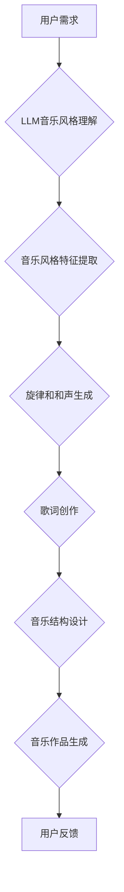

                 

## 音乐创作助手：LLM 推荐和灵感

> 关键词：LLM, 音乐创作, AI, 音乐推荐, 音乐灵感, 生成式模型, 自然语言处理

## 1. 背景介绍

音乐，作为人类文明的重要组成部分，一直以来都伴随着我们的生活。从古老的民歌到现代的流行音乐，音乐承载着情感、文化和历史的积淀。随着人工智能技术的飞速发展，音乐创作领域也迎来了新的变革。

传统的音乐创作往往依赖于作曲家的灵感和经验，这是一个充满创造力和挑战的过程。而人工智能，特别是基于深度学习的生成式模型，为音乐创作提供了全新的可能性。这些模型能够学习大量的音乐数据，并生成具有类似风格和结构的新音乐作品。

## 2. 核心概念与联系

### 2.1 音乐创作与LLM

大型语言模型（LLM）是近年来人工智能领域取得突破性进展的代表之一。它们通过训练海量文本数据，学习语言的语法、语义和结构，从而能够理解和生成人类语言。

将LLM应用于音乐创作，可以从以下几个方面进行理解：

* **音乐风格理解和生成:** LLM可以学习不同音乐风格的特征，并根据用户的需求生成具有特定风格的音乐。
* **旋律和和声生成:** LLM可以学习音乐的旋律和和声规律，并生成新的旋律和和声线。
* **歌词创作:** LLM可以根据音乐风格和主题，生成符合主题的歌词。
* **音乐结构设计:** LLM可以学习音乐作品的结构特点，并帮助用户设计新的音乐结构。

### 2.2 架构图



## 3. 核心算法原理 & 具体操作步骤

### 3.1 算法原理概述

LLM在音乐创作中的应用主要基于以下核心算法：

* **Transformer网络:** Transformer网络是一种深度学习模型，能够有效地处理序列数据，例如文本和音乐。它通过自注意力机制学习序列之间的关系，从而能够捕捉音乐作品的复杂结构和特征。
* **变分自编码器(VAE):** VAE是一种生成模型，能够学习数据的潜在表示。在音乐创作中，VAE可以学习音乐数据的潜在特征，并生成新的音乐作品。
* **生成对抗网络(GAN):** GAN由两个网络组成：生成器和鉴别器。生成器试图生成逼真的音乐数据，而鉴别器试图区分真实数据和生成数据。通过对抗训练，生成器能够生成越来越逼真的音乐作品。

### 3.2 算法步骤详解

以Transformer网络为例，其在音乐创作中的具体操作步骤如下：

1. **数据预处理:** 将音乐数据转换为数字格式，例如使用MIDI文件或音频特征向量。
2. **模型训练:** 使用Transformer网络训练音乐数据，学习音乐的结构和特征。
3. **音乐风格理解:** 根据用户的需求，提取目标音乐风格的特征。
4. **音乐生成:** 利用训练好的Transformer网络，根据提取的风格特征生成新的音乐作品。

### 3.3 算法优缺点

**优点:**

* **生成高质量音乐:** LLM能够生成具有丰富细节和情感的音乐作品。
* **个性化创作:** LLM可以根据用户的需求和喜好生成个性化的音乐作品。
* **提高创作效率:** LLM可以帮助音乐人快速生成音乐素材，提高创作效率。

**缺点:**

* **数据依赖:** LLM的性能取决于训练数据的质量和数量。
* **缺乏原创性:** LLM生成的音乐作品可能缺乏真正的原创性，容易出现重复或模仿的现象。
* **伦理问题:** LLM生成的音乐作品的版权问题和伦理问题尚待解决。

### 3.4 算法应用领域

LLM在音乐创作领域的应用前景广阔，包括：

* **音乐制作:** 为音乐人提供音乐素材、旋律和和声生成、歌词创作等辅助工具。
* **音乐教育:** 为音乐学生提供个性化的音乐学习体验，帮助他们理解音乐理论和创作技巧。
* **游戏音乐:** 为游戏开发商生成游戏背景音乐和音效。
* **影视音乐:** 为电影和电视剧创作配乐。

## 4. 数学模型和公式 & 详细讲解 & 举例说明

### 4.1 数学模型构建

在LLM音乐创作中，常用的数学模型包括：

* **Transformer网络:** Transformer网络的核心是自注意力机制，其数学公式如下：

$$
Attention(Q, K, V) = softmax(\frac{QK^T}{\sqrt{d_k}})V
$$

其中，Q、K、V分别代表查询矩阵、键矩阵和值矩阵，$d_k$代表键向量的维度。

* **变分自编码器(VAE):** VAE由编码器和解码器组成，其目标是学习数据的潜在表示。

### 4.2 公式推导过程

VAE的训练过程基于变分推断，其目标函数为：

$$
ELBO = \mathbb{E}_{z \sim q(z|x)}[log p(x|z)] - KL(q(z|x) || p(z))
$$

其中，$x$代表输入数据，$z$代表潜在表示，$q(z|x)$代表编码器输出的潜在表示分布，$p(z)$代表先验分布，$p(x|z)$代表解码器输出的重建数据分布。

### 4.3 案例分析与讲解

以音乐风格迁移为例，我们可以使用VAE将一首音乐作品迁移到另一个风格。

1. 训练一个VAE模型，学习音乐数据的潜在表示。
2. 将源音乐作品编码到潜在空间。
3. 将潜在表示与目标风格的特征进行融合。
4. 使用解码器将融合后的潜在表示解码成目标风格的音乐作品。

## 5. 项目实践：代码实例和详细解释说明

### 5.1 开发环境搭建

* Python 3.7+
* TensorFlow/PyTorch
* Music21库

### 5.2 源代码详细实现

```python
# 使用Transformer网络生成音乐旋律
import tensorflow as tf

# 定义Transformer网络模型
class MusicTransformer(tf.keras.Model):
    def __init__(self, vocab_size, embedding_dim, num_heads, num_layers):
        super(MusicTransformer, self).__init__()
        self.embedding = tf.keras.layers.Embedding(vocab_size, embedding_dim)
        self.transformer_layers = tf.keras.layers.StackedRNNCells([MusicTransformerLayer(embedding_dim, num_heads) for _ in range(num_layers)])

    def call(self, inputs):
        embedded = self.embedding(inputs)
        output = self.transformer_layers(embedded)
        return output

# 定义Transformer网络中的一个层
class MusicTransformerLayer(tf.keras.layers.Layer):
    def __init__(self, embedding_dim, num_heads):
        super(MusicTransformerLayer, self).__init__()
        self.multi_head_attention = tf.keras.layers.MultiHeadAttention(num_heads=num_heads, key_dim=embedding_dim)
        self.feed_forward_network = tf.keras.layers.Dense(embedding_dim * 4, activation='relu')

    def call(self, inputs):
        attention_output = self.multi_head_attention(inputs, inputs, inputs)
        feed_forward_output = self.feed_forward_network(attention_output)
        return feed_forward_output

# ... 其他代码 ...
```

### 5.3 代码解读与分析

* 代码中定义了MusicTransformer模型，该模型基于Transformer网络结构，用于生成音乐旋律。
* MusicTransformer模型包含嵌入层、Transformer层和输出层。
* 嵌入层将音乐符号转换为向量表示。
* Transformer层利用自注意力机制学习音乐序列之间的关系。
* 输出层将潜在表示解码成音乐符号。

### 5.4 运行结果展示

运行上述代码，可以生成具有特定风格的音乐旋律。

## 6. 实际应用场景

### 6.1 音乐创作辅助工具

LLM可以作为音乐创作辅助工具，帮助音乐人快速生成音乐素材、旋律和和声，提高创作效率。

### 6.2 个性化音乐推荐

LLM可以根据用户的音乐偏好，推荐个性化的音乐作品，提升用户体验。

### 6.3 音乐风格迁移

LLM可以将一首音乐作品迁移到另一个风格，例如将古典音乐迁移到流行音乐风格。

### 6.4 未来应用展望

未来，LLM在音乐创作领域的应用将更加广泛，例如：

* 自动生成完整的音乐作品
* 创作具有特定情感和主题的音乐
* 为音乐人提供更智能化的创作建议

## 7. 工具和资源推荐

### 7.1 学习资源推荐

* **书籍:**
    * Deep Learning by Ian Goodfellow, Yoshua Bengio, and Aaron Courville
    * Speech and Language Processing by Dan Jurafsky and James H. Martin
* **在线课程:**
    * Stanford CS224N: Natural Language Processing with Deep Learning
    * DeepLearning.AI: Sequence Models

### 7.2 开发工具推荐

* **TensorFlow:** https://www.tensorflow.org/
* **PyTorch:** https://pytorch.org/
* **Music21:** https://web.mit.edu/music21/

### 7.3 相关论文推荐

* **Attention Is All You Need:** https://arxiv.org/abs/1706.03762
* **Generative Adversarial Networks:** https://arxiv.org/abs/1406.2661
* **Variational Autoencoders for Music Generation:** https://arxiv.org/abs/1609.06837

## 8. 总结：未来发展趋势与挑战

### 8.1 研究成果总结

LLM在音乐创作领域取得了显著的进展，能够生成高质量的音乐作品，并为音乐人提供新的创作工具和灵感。

### 8.2 未来发展趋势

未来，LLM在音乐创作领域的应用将更加深入，例如：

* **更复杂的音乐生成:** 生成更复杂的音乐作品，例如多声部音乐和交响乐。
* **更个性化的音乐创作:** 根据用户的个性化需求生成更符合其口味的音乐作品。
* **音乐创作与其他艺术形式的融合:** 将音乐创作与其他艺术形式，例如绘画和舞蹈，进行融合。

### 8.3 面临的挑战

LLM在音乐创作领域也面临一些挑战，例如：

* **数据质量和多样性:** LLM的性能取决于训练数据的质量和多样性。
* **原创性和伦理问题:** LLM生成的音乐作品的原创性和伦理问题尚待解决。
* **音乐情感表达:** 如何让LLM能够更好地理解和表达音乐的情感。

### 8.4 研究展望

未来，我们需要继续探索LLM在音乐创作领域的应用，并解决其面临的挑战。

## 9. 附录：常见问题与解答

**Q1: LLM生成的音乐作品是否具有原创性？**

A1: LLM生成的音乐作品是基于训练数据的学习和组合，因此其原创性有限。

**Q2: LLM生成的音乐作品的版权归属如何？**

A2: LLM生成的音乐作品的版权归属问题尚待法律界和社会共同探讨。

**Q3: 如何提高LLM在音乐创作中的表现？**

A3: 可以通过以下方式提高LLM在音乐创作中的表现：

* 使用更高质量和更丰富的音乐数据进行训练。
* 设计更有效的音乐生成模型。
* 结合其他人工智能技术，例如音乐理论知识和情感分析。


作者：禅与计算机程序设计艺术 / Zen and the Art of Computer Programming 
<end_of_turn>

