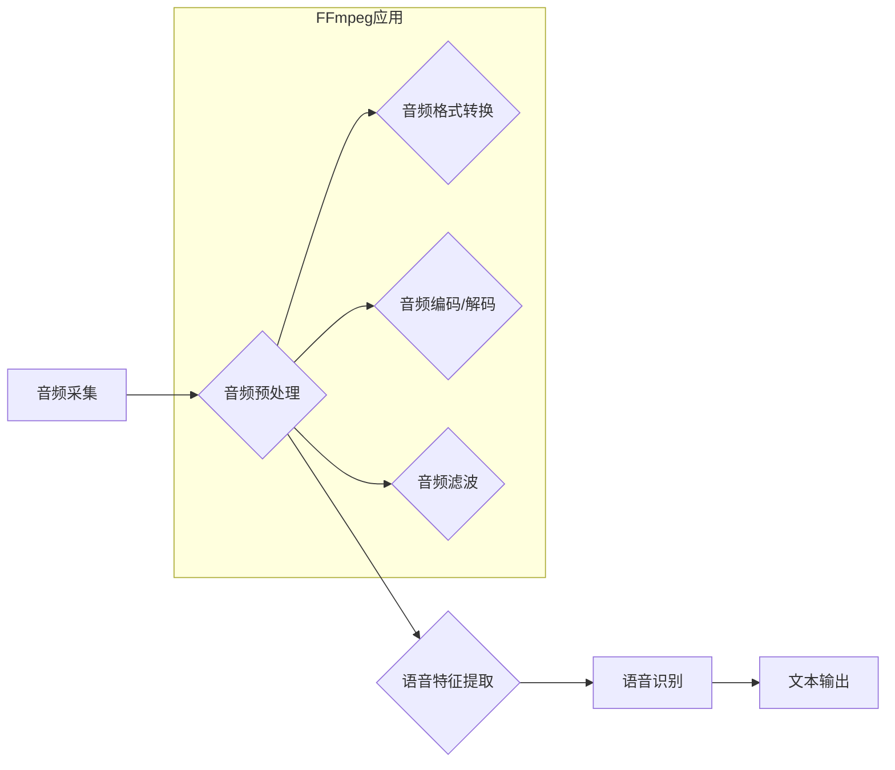

                 

## 音频处理技术：FFmpeg在语音识别中的应用

> 关键词：FFmpeg, 音频处理, 语音识别, 音频编码, 音频解码, 语音特征提取, 

## 1. 背景介绍

语音识别技术作为人工智能领域的重要分支，近年来取得了显著进展，并广泛应用于智能家居、虚拟助手、车联网等领域。语音识别系统的核心是准确地将语音信号转换为文本信息。而音频处理技术作为语音识别的基础，在语音信号的采集、预处理、特征提取等环节发挥着至关重要的作用。

FFmpeg是一个开源的跨平台多媒体框架，它提供了丰富的音频处理功能，包括音频编码、解码、格式转换、滤波等。由于其功能强大、性能优异、易于使用等特点，FFmpeg在语音识别领域得到了广泛应用。

## 2. 核心概念与联系

语音识别系统通常由以下几个模块组成：

* **音频采集模块:** 收集语音信号，常见的采集设备包括麦克风、录音设备等。
* **音频预处理模块:** 对采集到的语音信号进行预处理，例如降噪、增益调整、音频均衡等，以提高语音信号的质量。
* **语音特征提取模块:** 从预处理后的语音信号中提取特征，例如梅尔频率倒谱系数（MFCC）、线性预测系数（LPC）等，这些特征能够反映语音信号的声学特性。
* **语音识别模块:** 利用提取的语音特征进行识别，将语音信号转换为文本信息。常见的语音识别算法包括隐马尔可夫模型（HMM）、深度神经网络（DNN）等。

FFmpeg在语音识别系统中主要用于音频处理模块，它可以帮助我们完成以下任务：

* **音频格式转换:** 将语音信号从一种格式转换为另一种格式，例如将WAV格式转换为MP3格式。
* **音频编码和解码:** 将语音信号编码成比特流，以便存储或传输，反之亦然。
* **音频滤波:** 对语音信号进行滤波，例如去除背景噪声、增强语音信号等。

**Mermaid 流程图**



## 3. 核心算法原理 & 具体操作步骤

### 3.1  算法原理概述

FFmpeg使用一系列的音频处理算法来实现其功能，这些算法包括：

* **音频采样率转换:** 将音频信号的采样率从一种值转换为另一种值。
* **音频量化:** 将音频信号的幅度值转换为离散的数字值。
* **音频编码:** 将音频信号编码成比特流，常用的编码格式包括MP3、AAC、Opus等。
* **音频解码:** 将比特流解码成音频信号。
* **音频滤波:** 使用滤波器来改变音频信号的频率特性，例如去除噪声、增强特定频率等。

### 3.2  算法步骤详解

以下以音频编码为例，详细说明FFmpeg的具体操作步骤：

1. **音频数据准备:** 将音频信号转换为数字格式，并将其存储为文件或内存缓冲区。
2. **选择编码器:** 根据需要选择合适的音频编码器，例如libmp3lame、libfaac、libopus等。
3. **设置编码参数:** 设置编码器的参数，例如比特率、采样率、声道数等。
4. **编码音频数据:** 使用编码器将音频数据编码成比特流。
5. **保存编码数据:** 将编码后的比特流保存为文件或传输到目标设备。

### 3.3  算法优缺点

FFmpeg的音频处理算法具有以下优点：

* **功能强大:** 支持多种音频格式的转换、编码和解码。
* **性能优异:** 算法经过优化，能够实现高效的音频处理。
* **开源免费:** FFmpeg是一个开源项目，可以免费使用和修改。

但也存在一些缺点：

* **复杂度高:** FFmpeg的代码库庞大，学习和使用起来有一定的难度。
* **配置复杂:** 需要根据不同的需求进行参数配置，这对于初学者来说可能比较困难。

### 3.4  算法应用领域

FFmpeg的音频处理算法广泛应用于以下领域：

* **语音识别:** 用于音频格式转换、编码和解码，以及语音信号预处理。
* **音频编辑:** 用于音频剪辑、合并、混音等操作。
* **视频处理:** 用于视频音频的编码和解码。
* **流媒体传输:** 用于音频数据的编码和传输。

## 4. 数学模型和公式 & 详细讲解 & 举例说明

### 4.1  数学模型构建

在音频处理中，常用的数学模型包括：

* **采样定理:** 用于确定采样频率与信号带宽的关系，保证信号的完整性。
* **傅里叶变换:** 用于将时域信号转换为频域信号，方便分析信号的频率成分。
* **滤波器设计:** 用于设计滤波器，以改变信号的频率特性。

### 4.2  公式推导过程

**采样定理:**

$$f_s \ge 2f_m$$

其中：

* $f_s$ 是采样频率
* $f_m$ 是信号带宽

**傅里叶变换:**

$$X(f) = \int_{-\infty}^{\infty} x(t) e^{-j2\pi ft} dt$$

其中：

* $X(f)$ 是信号在频率 $f$ 处的幅度谱
* $x(t)$ 是时域信号
* $j$ 是虚数单位

### 4.3  案例分析与讲解

**音频采样率转换:**

假设我们有一个音频信号，采样率为44.1kHz，需要将其转换为22.05kHz。可以使用线性插值法进行采样率转换。

**线性插值法:**

$$y(n) = x(k) + \frac{n-k}{k+1-k} (x(k+1)-x(k))$$

其中：

* $y(n)$ 是转换后的采样值
* $x(k)$ 是原始采样值
* $n$ 是转换后的采样序号
* $k$ 是原始采样序号

## 5. 项目实践：代码实例和详细解释说明

### 5.1  开发环境搭建

* **操作系统:** Linux、macOS、Windows
* **编译器:** GCC、Clang
* **FFmpeg库:** 下载并安装FFmpeg库

### 5.2  源代码详细实现

```c
#include <stdio.h>
#include <stdlib.h>
#include <string.h>
#include <libavcodec/avcodec.h>
#include <libavformat/avformat.h>

int main(int argc, char **argv) {
    if (argc != 3) {
        fprintf(stderr, "Usage: %s <input_file> <output_file>\n", argv[0]);
        exit(1);
    }

    const char *input_filename = argv[1];
    const char *output_filename = argv[2];

    // 注册所有编解码器
    av_register_all();

    // 打开输入文件
    AVFormatContext *input_format_ctx = NULL;
    if (avformat_open_input(&input_format_ctx, input_filename, NULL, NULL) != 0) {
        fprintf(stderr, "Could not open input file '%s'\n", input_filename);
        exit(1);
    }

    // 查找音频流
    int audio_stream_index = -1;
    for (unsigned int i = 0; i < input_format_ctx->nb_streams; i++) {
        if (input_format_ctx->streams[i]->codecpar->codec_type == AVMEDIA_TYPE_AUDIO) {
            audio_stream_index = i;
            break;
        }
    }

    if (audio_stream_index == -1) {
        fprintf(stderr, "Could not find audio stream in input file '%s'\n", input_filename);
        exit(1);
    }

    // 打开输出文件
    AVFormatContext *output_format_ctx = NULL;
    if (avformat_alloc_output_context2(&output_format_ctx, NULL, NULL, output_filename) < 0) {
        fprintf(stderr, "Could not create output context\n");
        exit(1);
    }

    // 添加音频流到输出文件
    AVStream *output_audio_stream = avformat_new_stream(output_format_ctx, NULL);
    if (!output_audio_stream) {
        fprintf(stderr, "Could not allocate stream\n");
        exit(1);
    }

    // 复制音频流参数
    avcodec_parameters_copy(output_audio_stream->codecpar, input_format_ctx->streams[audio_stream_index]->codecpar);

    // 打开编码器
    AVCodec *codec = avcodec_find_encoder(output_audio_stream->codecpar->codec_id);
    if (!codec) {
        fprintf(stderr, "Could not find encoder for codec '%s'\n", avcodec_get_name(output_audio_stream->codecpar->codec_id));
        exit(1);
    }

    AVCodecContext *codec_ctx = avcodec_alloc_context3(codec);
    if (!codec_ctx) {
        fprintf(stderr, "Could not allocate codec context\n");
        exit(1);
    }

    if (avcodec_parameters_to_context(codec_ctx, output_audio_stream->codecpar) < 0) {
        fprintf(stderr, "Could not copy codec parameters to context\n");
        exit(1);
    }

    if (avcodec_open2(codec_ctx, codec, NULL) < 0) {
        fprintf(stderr, "Could not open codec\n");
        exit(1);
    }

    // 写入输出文件
    if (avformat_write_header(output_format_ctx, NULL) < 0) {
        fprintf(stderr, "Could not write header\n");
        exit(1);
    }

    // 循环读取输入文件，编码并写入输出文件
    AVPacket packet;
    while (av_read_frame(input_format_ctx, &packet) >= 0) {
        if (packet.stream_index == audio_stream_index) {
            AVFrame *frame = av_frame_alloc();
            if (avcodec_send_packet(codec_ctx, &packet) < 0) {
                fprintf(stderr, "Error sending packet\n");
                exit(1);
            }
            while (avcodec_receive_frame(codec_ctx, frame) == 0) {
                // 编码后的帧数据
                // ...
                av_frame_free(&frame);
            }
        }
        av_packet_unref(&packet);
    }

    // 写入尾部
    av_write_trailer(output_format_ctx);

    // 释放资源
    avcodec_free_context(&codec_ctx);
    avformat_free_context(input_format_ctx);
    avformat_free_context(output_format_ctx);

    return 0;
}
```

### 5.3  代码解读与分析

这段代码实现了音频格式转换的功能，将输入的音频文件转换为输出的指定格式。

* **注册编解码器:** 使用 `av_register_all()` 注册所有编解码器，以便FFmpeg能够识别和处理各种音频格式。
* **打开输入输出文件:** 使用 `avformat_open_input()` 打开输入文件，使用 `avformat_alloc_output_context2()` 创建输出文件上下文。
* **查找音频流:** 遍历输入文件中的所有流，找到音频流的索引。
* **添加音频流到输出文件:** 使用 `avformat_new_stream()` 创建新的音频流，并复制音频流参数。
* **打开编码器:** 使用 `avcodec_find_encoder()` 查找指定的编码器，使用 `avcodec_alloc_context3()` 分配编码器上下文，并使用 `avcodec_parameters_to_context()` 将编码器参数复制到上下文。
* **编码并写入输出文件:** 循环读取输入文件中的音频数据，使用 `avcodec_send_packet()` 发送数据到编码器，使用 `avcodec_receive_frame()` 获取编码后的帧数据，并将其写入输出文件。
* **释放资源:** 释放所有分配的资源，例如编码器上下文、文件上下文等。

### 5.4  运行结果展示

运行这段代码后，将生成一个新的音频文件，其格式与输出参数指定的一致。

## 6. 实际应用场景

FFmpeg在语音识别领域有着广泛的应用场景，例如：

* **语音助手:** 语音助手需要将用户语音转换为文本信息，以便理解用户的指令。FFmpeg可以用于音频格式转换、编码和解码，以及语音信号预处理。
* **自动语音识别 (ASR):** ASR系统用于将语音信号转换为文本信息，广泛应用于会议记录、语音搜索、语音翻译等领域。FFmpeg可以用于音频格式转换、编码和解码，以及语音信号预处理。
* **语音合成 (TTS):** TTS系统用于将文本信息转换为语音信号，广泛应用于语音导航、电子书阅读、智能家居等领域。FFmpeg可以用于音频格式转换、编码和解码，以及语音信号合成。

### 6.4  未来应用展望

随着人工智能技术的不断发展，FFmpeg在语音识别领域的应用前景更加广阔。未来，FFmpeg可能在以下方面得到进一步应用：

* **低资源语音识别:** FFmpeg可以用于开发低资源语音识别系统，例如使用少量训练数据进行语音识别。
* **多语言语音识别:** FFmpeg可以用于开发支持多种语言的语音识别系统。
* **实时语音识别:** FFmpeg可以用于开发实时语音识别系统，例如用于实时语音翻译。

## 7. 工具和资源推荐

### 7.1  学习资源推荐

* **FFmpeg官方文档:** https://ffmpeg.org/documentation.html
* **FFmpeg教程:** https://ffmpeg.org/tutorials.html
* **FFmpeg GitHub仓库:** https://github.com/FFmpeg/FFmpeg

### 7.2  开发工具推荐

* **CMake:** 用于构建FFmpeg项目。
* **Git:** 用于版本控制。
* **IDE:** 例如Visual Studio Code、Eclipse等。

### 7.3  相关论文推荐

* **FFmpeg: A Multi-Media Framework:** https://www.ffmpeg.org/documentation/papers/ffmpeg-paper.html
* **Speech Recognition with Deep Learning:** https://arxiv.org/abs/1409.0197

## 8. 总结：未来发展趋势与挑战

### 8.1  研究成果总结

FFmpeg在音频处理领域取得了显著的成果，其功能强大、性能优异、开源免费的特点使其成为语音识别领域的重要工具。

### 8.2  未来发展趋势

未来，FFmpeg将继续朝着以下方向发展：

* **更强大的功能:** FFmpeg将继续添加新的音频处理功能，例如支持更多音频格式、更先进的音频编码算法等。
* **更好的性能:** FFmpeg将继续优化其算法和代码，以提高其处理效率。
* **更易于使用:** FFmpeg将继续改进其用户界面和文档，使其更易于使用。

### 8.3  面临的挑战

FFmpeg也面临着一些挑战：

* **代码复杂度:** FFmpeg的代码库庞大复杂，对于初学者来说学习和使用起来有一定的难度。
* **配置复杂:** FFmpeg需要根据不同的需求进行参数配置，这对于初学者来说可能比较困难。
* **跨平台兼容性:** FFmpeg需要支持多种操作系统和硬件平台，这需要进行大量的测试和维护工作。

### 8.4  研究展望

未来，研究者将继续探索FFmpeg在语音识别领域的应用，例如开发更先进的语音识别算法、开发基于FFmpeg的语音识别平台等。


## 9. 附录：常见问题与解答

**常见问题:**

* **如何安装FFmpeg？**

**解答:**

FFmpeg的安装方法因操作系统而异，可以参考FFmpeg官方文档进行安装。

* **如何使用FFmpeg进行音频格式转换？**

**解答:**

可以使用FFmpeg命令行工具进行音频格式转换。例如，将WAV格式的音频文件转换为MP3格式，可以使用以下命令：

```
ffmpeg -i input.wav output.mp3
```

* **如何使用FFmpeg进行语音信号预处理？**

**解答:**

FFmpeg提供了一些音频滤波器，可以用于语音信号预处理，例如降噪、增益调整等。

**作者：禅与计算机程序设计艺术 / Zen and the Art of Computer Programming**<end_of_turn>


