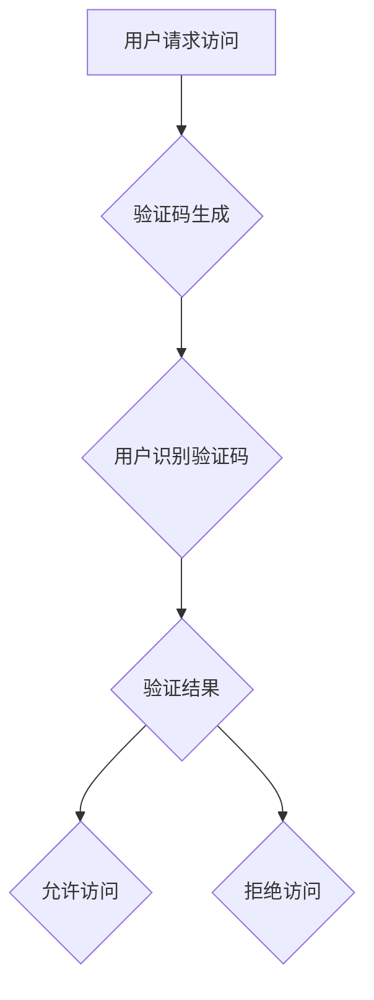

                 

## 验证码：人机交互中的智慧博弈

> 关键词：验证码、人机交互、图像识别、深度学习、对抗性生成、安全、可访问性

### 1. 背景介绍

在数字时代，网络安全日益受到重视。为了防止恶意用户通过自动化手段进行登录、注册等操作，验证码应运而生。验证码是一种用于区分人类用户和机器用户的技术，它通常以图像形式呈现，包含一些扭曲的字符、图形或图案，要求用户输入以证明其为人类。

验证码的出现，标志着人机交互领域开始引入新的安全机制。然而，随着人工智能技术的快速发展，传统的验证码也面临着新的挑战。深度学习算法的不断进步使得机器能够识别甚至破解传统的验证码，这使得验证码的安全性受到质疑。

### 2. 核心概念与联系

#### 2.1 验证码的本质

验证码的核心概念是利用人类视觉和认知能力的优势，构建一个机器难以破解的识别难题。它通过将文字或图形进行扭曲、变形、添加噪声等方式，使得机器难以准确识别，从而区分人类用户和机器用户。

#### 2.2 人机交互与验证码

验证码是人机交互领域的重要组成部分，它在以下场景中发挥着关键作用：

* **身份验证:** 验证码用于验证用户身份，防止恶意用户利用自动化手段进行登录或注册。
* **反欺诈:** 验证码可以帮助识别和阻止欺诈行为，例如虚假账户创建、恶意评论等。
* **数据安全:** 验证码可以保护敏感信息，防止未经授权的访问。

#### 2.3 验证码的挑战

随着人工智能技术的进步，传统的验证码面临着以下挑战：

* **可破解性:** 深度学习算法能够识别甚至破解传统的验证码，导致验证码的安全性受到质疑。
* **用户体验:** 传统的验证码往往难以识别，给用户带来不便。
* **可访问性:** 传统的验证码对视力障碍用户等特殊群体存在障碍。

#### 2.4 Mermaid 流程图



### 3. 核心算法原理 & 具体操作步骤

#### 3.1 算法原理概述

验证码的生成和识别通常基于以下核心算法：

* **图像生成算法:** 用于生成验证码图像，常见的算法包括随机字符生成、图形绘制、噪声添加等。
* **图像识别算法:** 用于识别验证码图像中的字符或图案，常见的算法包括卷积神经网络（CNN）、循环神经网络（RNN）等。

#### 3.2 算法步骤详解

**验证码生成步骤:**

1. **随机字符生成:** 随机选择一些字符，例如字母、数字、符号等。
2. **字体选择:** 选择不同的字体样式，增加验证码的复杂度。
3. **图像绘制:** 将随机字符绘制到图像上，并添加一些噪声、干扰等元素。
4. **图像格式化:** 将生成的图像转换为合适的格式，例如JPEG、PNG等。

**验证码识别步骤:**

1. **图像预处理:** 对验证码图像进行预处理，例如灰度化、去噪等。
2. **特征提取:** 从预处理后的图像中提取特征，例如边缘、纹理等。
3. **分类识别:** 使用训练好的分类模型识别图像中的字符或图案。
4. **结果输出:** 将识别结果输出，例如识别出的字符序列。

#### 3.3 算法优缺点

**图像生成算法:**

* **优点:** 可以生成具有随机性和复杂性的验证码图像。
* **缺点:** 容易被机器学习算法破解。

**图像识别算法:**

* **优点:** 可以准确识别验证码图像中的字符或图案。
* **缺点:** 需要大量的训练数据，训练成本较高。

#### 3.4 算法应用领域

验证码算法广泛应用于以下领域:

* **网络安全:** 防止恶意用户进行登录、注册等操作。
* **金融行业:** 验证用户身份，防止欺诈行为。
* **电子商务:** 保护用户隐私，防止恶意评论等。

### 4. 数学模型和公式 & 详细讲解 & 举例说明

#### 4.1 数学模型构建

验证码生成和识别通常基于概率模型和统计模型。

* **概率模型:** 用于描述验证码图像中字符出现的概率分布，例如贝叶斯网络、隐马尔可夫模型等。
* **统计模型:** 用于描述验证码图像中特征的统计特性，例如均值、方差、协方差等。

#### 4.2 公式推导过程

例如，在使用贝叶斯网络进行验证码识别时，可以利用以下公式计算识别结果的概率:

$$P(C|I) = \frac{P(I|C)P(C)}{P(I)}$$

其中:

* $P(C|I)$: 给定图像 $I$，字符 $C$ 出现的概率。
* $P(I|C)$: 给定字符 $C$，图像 $I$ 出现的概率。
* $P(C)$: 字符 $C$ 出现的概率。
* $P(I)$: 图像 $I$ 出现的概率。

#### 4.3 案例分析与讲解

例如，在识别一个包含字母 "A" 的验证码图像时，可以使用贝叶斯网络计算识别结果的概率。如果训练数据中 "A" 出现的概率较高，并且图像特征与 "A" 匹配度高，则识别结果的概率会更高。

### 5. 项目实践：代码实例和详细解释说明

#### 5.1 开发环境搭建

* **操作系统:** Ubuntu 20.04
* **编程语言:** Python 3.8
* **深度学习框架:** TensorFlow 2.0
* **其他依赖:** OpenCV, NumPy, Matplotlib

#### 5.2 源代码详细实现

```python
# 验证码生成代码示例
import random
import numpy as np
from PIL import Image, ImageDraw, ImageFont

def generate_captcha(width=120, height=40, chars=4):
    # 生成随机字符
    chars = ''.join(random.choice('ABCDEFGHJKLMNOPQRSTUVWXYZ0123456789') for _ in range(chars))

    # 创建图像
    image = Image.new('RGB', (width, height), (255, 255, 255))
    draw = ImageDraw.Draw(image)

    # 设置字体
    font = ImageFont.truetype('arial.ttf', 30)

    # 绘制字符
    for i, char in enumerate(chars):
        text_width, text_height = draw.textsize(char, font=font)
        x = i * (text_width + 5)
        y = (height - text_height) // 2
        draw.text((x, y), char, fill=(0, 0, 0), font=font)

    # 添加噪声
    noise = np.random.randint(0, 255, size=(height, width, 3)).astype(np.uint8)
    image = Image.fromarray(noise)
    image.paste(image, (0, 0), mask=image)

    # 保存图像
    image.save('captcha.png')

# 验证码识别代码示例
import tensorflow as tf
from tensorflow.keras.models import Sequential
from tensorflow.keras.layers import Conv2D, MaxPooling2D, Flatten, Dense

# ... (模型训练代码)

def recognize_captcha(image_path):
    # 加载图像
    image = tf.keras.preprocessing.image.load_img(image_path, target_size=(32, 32))
    image = tf.keras.preprocessing.image.img_to_array(image)
    image = tf.expand_dims(image, axis=0)

    # 预测结果
    prediction = model.predict(image)
    predicted_chars = tf.math.argmax(prediction, axis=1).numpy()[0]

    # 返回识别结果
    return ''.join(map(chr, predicted_chars))

# ... (识别代码示例)
```

#### 5.3 代码解读与分析

* **验证码生成代码:** 使用 Python 的 PIL 库生成验证码图像，包括随机字符生成、字体选择、图像绘制、噪声添加等步骤。
* **验证码识别代码:** 使用 TensorFlow 深度学习框架构建一个卷积神经网络模型，用于识别验证码图像中的字符。

#### 5.4 运行结果展示

运行上述代码，可以生成一个验证码图像，并使用训练好的模型识别该图像中的字符。

### 6. 实际应用场景

#### 6.1 网站登录

在网站登录时，验证码可以防止机器人自动登录，保护用户账号安全。

#### 6.2 注册验证

在用户注册时，验证码可以验证用户身份，防止虚假账户创建。

#### 6.3 支付安全

在进行在线支付时，验证码可以增加支付安全，防止恶意用户进行盗刷。

#### 6.4 其他应用场景

验证码还可以应用于以下场景:

* **评论审核:** 防止恶意评论和垃圾评论。
* **表单提交:** 验证用户输入信息。
* **邮件验证:** 验证用户邮箱地址。

#### 6.5 未来应用展望

随着人工智能技术的不断发展，验证码的应用场景将会更加广泛。例如，可以利用语音识别、生物识别等技术，开发更加安全、便捷的验证码方案。

### 7. 工具和资源推荐

#### 7.1 学习资源推荐

* **书籍:**
    * 《深度学习》
    * 《计算机视觉》
* **在线课程:**
    * Coursera: 深度学习
    * Udacity: 计算机视觉
* **博客:**
    * TensorFlow Blog
    * PyImageSearch

#### 7.2 开发工具推荐

* **深度学习框架:** TensorFlow, PyTorch
* **图像处理库:** OpenCV, Pillow
* **编程语言:** Python

#### 7.3 相关论文推荐

* **验证码生成:**
    * "Generating Robust CAPTCHAs with Adversarial Training"
* **验证码识别:**
    * "Deep Learning for CAPTCHA Breaking"
    * "End-to-End Text Recognition with Convolutional Neural Networks"

### 8. 总结：未来发展趋势与挑战

#### 8.1 研究成果总结

验证码技术的发展经历了从简单的字符识别到基于深度学习的对抗性生成和识别阶段。随着人工智能技术的进步，验证码的安全性、便捷性和可访问性不断提升。

#### 8.2 未来发展趋势

* **对抗性生成:** 利用生成对抗网络 (GAN) 等技术，生成更加复杂的、难以破解的验证码。
* **多模态验证码:** 结合图像、音频、视频等多种模态信息，提高验证码的安全性。
* **个性化验证码:** 根据用户的设备、行为等信息，生成个性化的验证码，提高用户体验。

#### 8.3 面临的挑战

* **可破解性:** 随着人工智能技术的不断进步，传统的验证码仍然面临着被破解的风险。
* **用户体验:** 一些验证码过于复杂，给用户带来不便。
* **可访问性:** 一些验证码对视力障碍用户等特殊群体存在障碍。

#### 8.4 研究展望

未来，验证码技术需要不断创新，以应对人工智能技术的挑战，同时也要关注用户体验和可访问性，构建更加安全、便捷、友好的人机交互体验。

### 9. 附录：常见问题与解答

* **Q: 如何生成更加安全的验证码？**

A: 可以利用对抗性生成网络 (GAN) 等技术，生成更加复杂的、难以破解的验证码。

* **Q: 如何提高验证码的用户体验？**

A: 可以根据用户的设备、行为等信息，生成个性化的验证码，并提供多种验证码类型供用户选择。

* **Q: 如何保证验证码的可访问性？**

A: 可以提供语音识别、生物识别等多种验证码方式，以满足不同用户的需求。


作者：禅与计算机程序设计艺术 / Zen and the Art of Computer Programming<end_of_turn>

