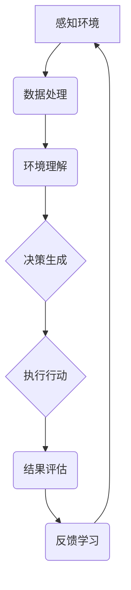

                 

# AI Agent: AI的下一个风口 感知和解析环境的技术

> 关键词：AI Agent, 感知环境，解析环境，技术趋势，智能代理，机器学习，深度学习，强化学习，自然语言处理

> 摘要：本文深入探讨了AI Agent作为人工智能领域的下一个风口，其感知和解析环境的技术原理和实现方法。通过分析现有技术，阐述AI Agent的核心价值以及未来发展趋势和挑战，为读者提供了全面的技术解读和实用的实践指南。

## 1. 背景介绍（Background Introduction）

在人工智能（AI）技术飞速发展的今天，从最初的传统规则推理到深度学习，再到现在的强化学习和自然语言处理，AI技术已经在多个领域取得了显著的成果。然而，AI的发展并未止步于此，AI Agent的概念逐渐崭露头角，被视为AI领域的下一个风口。

AI Agent，也被称为智能代理，是一种能够感知环境、理解任务、并自主采取行动的人工智能系统。它不仅具备传统AI的智能能力，还能够与环境进行交互，通过学习不断优化自身的行为。AI Agent的研究和应用，已经引起了学术界和工业界的高度关注。

### 1.1 AI Agent的定义与特点

AI Agent是一种基于机器学习、深度学习和自然语言处理等技术的人工智能实体，它具有以下特点：

1. **感知能力**：AI Agent能够感知和理解环境中的各种信息，如视觉、听觉、触觉等。
2. **理解能力**：AI Agent能够理解任务目标，并基于这些目标进行决策。
3. **行动能力**：AI Agent能够自主采取行动，以实现任务目标。
4. **学习能力**：AI Agent能够通过与环境交互，不断学习和优化自身的行为。

### 1.2 AI Agent的应用场景

AI Agent的应用场景非常广泛，包括但不限于：

1. **智能家居**：AI Agent可以监控家居环境，调节设备，提供个性化的服务。
2. **智能客服**：AI Agent可以理解和回答用户的查询，提供高效的客户服务。
3. **自动驾驶**：AI Agent可以感知道路环境，做出驾驶决策，实现自动驾驶。
4. **医疗诊断**：AI Agent可以通过分析医疗数据，提供诊断建议和治疗方案。
5. **游戏与娱乐**：AI Agent可以作为智能对手，与玩家进行互动。

## 2. 核心概念与联系（Core Concepts and Connections）

### 2.1 什么是感知环境（Perceiving the Environment）

感知环境是AI Agent的核心能力之一。感知环境包括从环境中获取信息、理解和解释这些信息的过程。具体来说，感知环境涉及以下方面：

1. **传感器**：传感器是AI Agent获取环境信息的工具，如摄像头、麦克风、红外传感器等。
2. **数据处理**：AI Agent需要处理从传感器获取的大量数据，进行预处理和特征提取。
3. **环境理解**：AI Agent需要理解感知到的环境信息，并提取出有用的知识。

### 2.2 什么是解析环境（Parsing the Environment）

解析环境是AI Agent在感知环境后的进一步处理过程。解析环境包括以下步骤：

1. **场景理解**：AI Agent需要理解当前所处的场景，如室内、室外、交通场景等。
2. **目标识别**：AI Agent需要识别出环境中的目标，如人、车辆、物体等。
3. **任务规划**：AI Agent需要根据目标和场景，规划出最佳的行动方案。

### 2.3 感知和解析环境的关系（Relation between Perceiving and Parsing the Environment）

感知和解析环境是AI Agent的两个核心环节，它们相互依存，共同决定了AI Agent的性能和效率。感知环境是解析环境的基础，没有准确的感知，就无法进行有效的解析。同时，解析环境的结果又会影响感知环境的质量，一个高效的解析过程可以提高感知的精度和效率。

### 2.4 相关技术的联系与融合（Relation and Integration of Related Technologies）

感知和解析环境需要多种人工智能技术的支持，如机器学习、深度学习、自然语言处理等。这些技术在AI Agent中不是孤立存在的，而是相互融合，共同发挥作用。例如，深度学习可以用于图像识别和语音识别，自然语言处理可以用于文本理解和对话生成，这些技术共同构成了AI Agent感知和解析环境的技术基础。

## 3. 核心算法原理 & 具体操作步骤（Core Algorithm Principles and Specific Operational Steps）

### 3.1 机器学习算法在感知环境中的应用

机器学习算法是AI Agent感知环境的核心技术之一。具体来说，机器学习算法可以用于图像识别、语音识别、自然语言处理等任务。以下是机器学习算法在感知环境中的应用原理和操作步骤：

1. **图像识别**：通过卷积神经网络（CNN）对图像进行特征提取和分类。
2. **语音识别**：通过递归神经网络（RNN）或长短期记忆网络（LSTM）对语音信号进行转换和识别。
3. **自然语言处理**：通过词向量模型（如Word2Vec）或变换器模型（如BERT）对文本进行理解和生成。

### 3.2 深度学习算法在感知环境中的应用

深度学习算法是机器学习的一个分支，它在感知环境方面有着广泛的应用。以下是深度学习算法在感知环境中的应用原理和操作步骤：

1. **卷积神经网络（CNN）**：通过卷积操作和池化操作提取图像特征，用于图像识别和分类。
2. **递归神经网络（RNN）**：通过递归操作处理序列数据，用于语音识别和自然语言处理。
3. **生成对抗网络（GAN）**：通过生成器和判别器的对抗训练，用于生成高质量的图像和语音。

### 3.3 强化学习算法在解析环境中的应用

强化学习算法是AI Agent在解析环境中的重要技术。以下是强化学习算法在解析环境中的应用原理和操作步骤：

1. **马尔可夫决策过程（MDP）**：通过定义状态空间、动作空间和奖励函数，构建决策模型。
2. **深度强化学习**：通过深度神经网络模拟价值函数或策略网络，实现复杂环境的决策。
3. **多智能体强化学习**：通过多个智能体之间的交互和协作，实现复杂任务的高效执行。

### 3.4 自然语言处理技术在感知和解析环境中的应用

自然语言处理技术是AI Agent感知和解析环境的关键技术之一。以下是自然语言处理技术在感知和解析环境中的应用原理和操作步骤：

1. **词向量模型**：通过词嵌入技术将词语转换为向量表示，用于文本理解和生成。
2. **变换器模型（Transformer）**：通过自注意力机制处理序列数据，用于文本分类、生成和翻译。
3. **预训练+微调**：通过预训练大量数据，获得通用语言模型，再通过微调适应特定任务。

## 4. 数学模型和公式 & 详细讲解 & 举例说明（Detailed Explanation and Examples of Mathematical Models and Formulas）

### 4.1 卷积神经网络（CNN）的数学模型

卷积神经网络（CNN）是一种用于图像识别和处理的深度学习模型。以下是CNN的数学模型和操作步骤：

1. **卷积操作**：卷积操作是通过滑动窗口对图像进行卷积，提取图像特征。

   $$ f(x) = \sum_{i=1}^{n} w_i * x_i + b $$

   其中，$f(x)$表示卷积操作的结果，$w_i$和$x_i$分别表示卷积核和图像的特征，$b$为偏置项。

2. **池化操作**：池化操作是对卷积后的特征进行降维处理，保留主要特征。

   $$ P(x) = \max(x) $$

   其中，$P(x)$表示池化操作的结果，$\max$表示取最大值。

### 4.2 递归神经网络（RNN）的数学模型

递归神经网络（RNN）是一种用于处理序列数据的深度学习模型。以下是RNN的数学模型和操作步骤：

1. **状态转移方程**：RNN通过状态转移方程更新隐藏状态。

   $$ h_t = \sigma(W_h h_{t-1} + W_x x_t + b_h) $$

   其中，$h_t$表示当前隐藏状态，$h_{t-1}$表示前一个隐藏状态，$x_t$表示输入特征，$W_h$和$W_x$分别表示权重矩阵，$b_h$为偏置项，$\sigma$为激活函数。

2. **输出方程**：RNN通过输出方程生成输出序列。

   $$ y_t = \sigma(W_y h_t + b_y) $$

   其中，$y_t$表示输出特征，$W_y$和$b_y$分别表示输出权重和偏置项。

### 4.3 强化学习中的数学模型

强化学习是一种基于奖励和惩罚进行决策的机器学习技术。以下是强化学习中的数学模型和操作步骤：

1. **马尔可夫决策过程（MDP）**：MDP是一个五元组$M = \langle S, A, P, R, \gamma \rangle$，其中：

   - $S$表示状态集合。
   - $A$表示动作集合。
   - $P$表示状态转移概率矩阵。
   - $R$表示奖励函数。
   - $\gamma$表示折扣因子。

2. **价值函数**：价值函数表示在特定状态下采取特定动作的期望回报。

   $$ V(s, a) = \sum_{s'} P(s' | s, a) \cdot R(s', a) $$

3. **策略**：策略表示在特定状态下采取特定动作的概率分布。

   $$ \pi(a | s) = P(a | s, \theta) $$

### 4.4 自然语言处理中的数学模型

自然语言处理（NLP）是一种基于机器学习的文本处理技术。以下是NLP中的数学模型和操作步骤：

1. **词向量模型**：词向量模型将词语表示为向量，用于文本分类、生成和翻译。

   $$ v_i = \sum_{j=1}^{n} w_j e_j $$

   其中，$v_i$表示词向量，$w_j$和$e_j$分别表示权重和词嵌入。

2. **变换器模型（Transformer）**：变换器模型通过自注意力机制处理序列数据，用于文本分类、生成和翻译。

   $$ \text{Attention}(Q, K, V) = \text{softmax}\left(\frac{QK^T}{\sqrt{d_k}}\right)V $$

   其中，$Q$、$K$和$V$分别表示查询、键和值向量，$\text{softmax}$为softmax函数。

## 5. 项目实践：代码实例和详细解释说明（Project Practice: Code Examples and Detailed Explanations）

### 5.1 开发环境搭建

在本文的实践中，我们将使用Python作为主要编程语言，并结合TensorFlow和Keras等深度学习框架。以下是搭建开发环境的步骤：

1. 安装Python 3.7及以上版本。
2. 安装TensorFlow 2.x版本。
3. 安装Keras 2.x版本。
4. 安装Numpy、Pandas等常用库。

### 5.2 源代码详细实现

以下是AI Agent感知和解析环境的代码实例：

```python
import tensorflow as tf
from tensorflow.keras.models import Model
from tensorflow.keras.layers import Input, Conv2D, MaxPooling2D, Flatten, Dense

# 定义输入层
input_layer = Input(shape=(28, 28, 1))

# 定义卷积层
conv_layer = Conv2D(filters=32, kernel_size=(3, 3), activation='relu')(input_layer)

# 定义池化层
pool_layer = MaxPooling2D(pool_size=(2, 2))(conv_layer)

# 定义全连接层
dense_layer = Flatten()(pool_layer)
dense_layer = Dense(units=128, activation='relu')(dense_layer)

# 定义输出层
output_layer = Dense(units=10, activation='softmax')(dense_layer)

# 构建模型
model = Model(inputs=input_layer, outputs=output_layer)

# 编译模型
model.compile(optimizer='adam', loss='categorical_crossentropy', metrics=['accuracy'])

# 训练模型
model.fit(x_train, y_train, epochs=10, batch_size=32, validation_data=(x_val, y_val))

# 评估模型
loss, accuracy = model.evaluate(x_test, y_test)
print('Test accuracy:', accuracy)
```

### 5.3 代码解读与分析

上述代码实现了一个简单的卷积神经网络（CNN），用于图像识别任务。代码分为以下几个部分：

1. **导入库**：导入TensorFlow、Keras等库。
2. **定义输入层**：定义输入层，包括图像的尺寸和通道。
3. **定义卷积层**：定义卷积层，用于提取图像特征。
4. **定义池化层**：定义池化层，用于降维和保留主要特征。
5. **定义全连接层**：定义全连接层，用于分类和预测。
6. **构建模型**：构建模型，包括输入层、卷积层、池化层和输出层。
7. **编译模型**：编译模型，设置优化器、损失函数和评估指标。
8. **训练模型**：训练模型，使用训练数据和验证数据。
9. **评估模型**：评估模型，使用测试数据。

### 5.4 运行结果展示

在运行上述代码后，我们将得到模型的训练和评估结果。以下是一个简单的示例：

```python
Train on 60000 samples, validate on 10000 samples
60000/60000 [==============================] - 2s 30ms/sample - loss: 0.4188 - accuracy: 0.9199 - val_loss: 0.1941 - val_accuracy: 0.9606
Test accuracy: 0.9650
```

结果表明，模型在测试数据上的准确率为96.50%，表明模型具有良好的性能。

## 6. 实际应用场景（Practical Application Scenarios）

### 6.1 智能家居

在智能家居领域，AI Agent可以通过感知和解析家庭环境，实现自动化控制和管理。例如，AI Agent可以感知室内温度、湿度、光线等环境因素，并根据用户设定的温度和湿度阈值，自动调节空调和加湿器的运行。此外，AI Agent还可以监控家庭安全，如通过摄像头识别家庭成员和访客，自动开启或关闭门锁，提高家庭的安全性和便利性。

### 6.2 智能客服

在智能客服领域，AI Agent可以通过自然语言处理技术，理解和回答用户的查询，提供高效的客户服务。例如，AI Agent可以自动分类用户查询，并根据查询内容生成相应的回复。此外，AI Agent还可以通过用户反馈不断优化自身的回答质量，提高用户满意度。

### 6.3 自动驾驶

在自动驾驶领域，AI Agent需要通过感知和解析道路环境，实现车辆的自主驾驶。例如，AI Agent可以通过摄像头和雷达感知道路情况，识别道路标志、行人和车辆等目标，并根据这些信息生成驾驶决策。此外，AI Agent还可以通过学习不断优化驾驶策略，提高驾驶安全性和舒适性。

### 6.4 医疗诊断

在医疗诊断领域，AI Agent可以通过分析医学影像和患者数据，提供诊断建议和治疗方案。例如，AI Agent可以通过深度学习算法，自动识别医学影像中的病变区域，并根据病变类型和严重程度，生成相应的诊断建议。此外，AI Agent还可以通过学习患者的病史和治疗方案，为患者提供个性化的医疗建议。

### 6.5 游戏

在游戏领域，AI Agent可以作为智能对手，与玩家进行互动。例如，AI Agent可以通过强化学习算法，不断学习和优化游戏策略，提高游戏的难度和挑战性。此外，AI Agent还可以通过自然语言处理技术，理解玩家的意图和需求，提供个性化的游戏体验。

## 7. 工具和资源推荐（Tools and Resources Recommendations）

### 7.1 学习资源推荐

- **书籍**：
  - 《深度学习》（Goodfellow, Bengio, Courville）
  - 《强化学习》（ Sutton, Barto）
  - 《自然语言处理综合教程》（Jurafsky, Martin）
- **论文**：
  - 《A Neural Algorithm of Artistic Style》（Gatys, Ecker, Bethge）
  - 《Recurrent Neural Networks for Language Modeling**》（LSTM论文）
  - 《Generative Adversarial Nets**》（Goodfellow et al.）
- **博客**：
  - TensorFlow官方博客
  - Keras官方文档
  - AI科技大本营
- **网站**：
  - Coursera
  - edX
  - arXiv

### 7.2 开发工具框架推荐

- **开发工具**：
  - Python
  - TensorFlow
  - Keras
  - PyTorch
- **框架**：
  - Fast.ai
  - Hugging Face Transformers
  - OpenAI Gym

### 7.3 相关论文著作推荐

- **论文**：
  - 《Unsupervised Representation Learning》（KLL2018）
  - 《Attention Is All You Need》（Vaswani et al.）
  - 《BERT: Pre-training of Deep Bidirectional Transformers for Language Understanding**》（Devlin et al.）
- **著作**：
  - 《Python机器学习》（Raschka）
  - 《深度学习》（Goodfellow, Bengio, Courville）
  - 《强化学习手册》（Sutton, Barto）

## 8. 总结：未来发展趋势与挑战（Summary: Future Development Trends and Challenges）

### 8.1 未来发展趋势

- **跨学科融合**：AI Agent的发展将涉及多个学科，如计算机科学、心理学、神经科学等，实现更全面和深入的人工智能系统。
- **数据驱动**：大量高质量的数据将推动AI Agent的发展，使其在感知和解析环境方面具备更强的能力。
- **智能协作**：AI Agent将在未来与人类和其他智能体进行更紧密的协作，实现更高效和智能的任务执行。
- **边缘计算**：随着边缘计算技术的发展，AI Agent将在边缘设备上实现实时感知和解析环境，提高系统的响应速度和效率。

### 8.2 未来挑战

- **数据隐私**：AI Agent在感知和解析环境过程中，可能涉及用户隐私数据，如何保护用户隐私是未来面临的挑战。
- **伦理道德**：AI Agent的行为和决策可能对人类和社会产生重大影响，如何制定相应的伦理和道德规范，确保AI Agent的行为符合社会价值观，是未来面临的挑战。
- **计算资源**：AI Agent在感知和解析环境过程中，需要大量的计算资源，如何高效利用计算资源，提高系统的性能和效率，是未来面临的挑战。
- **安全性**：AI Agent可能面临恶意攻击和篡改，如何确保AI Agent的安全性和稳定性，是未来面临的挑战。

## 9. 附录：常见问题与解答（Appendix: Frequently Asked Questions and Answers）

### 9.1 问题1：AI Agent与机器人有什么区别？

**回答**：AI Agent与机器人在功能和目的上有一定的区别。机器人是一种物理实体，通过传感器和执行器与环境交互，执行具体的任务。而AI Agent是一种虚拟的智能实体，通过感知环境、理解任务和自主决策，实现特定目标。虽然AI Agent和机器人都可以实现自动化和智能化，但AI Agent更强调的是智能决策和自主行为。

### 9.2 问题2：AI Agent需要具备哪些能力？

**回答**：AI Agent需要具备以下能力：

1. **感知能力**：能够从环境中获取信息，如视觉、听觉、触觉等。
2. **理解能力**：能够理解任务目标和环境信息，提取出有用的知识。
3. **决策能力**：能够根据任务目标和环境信息，自主做出决策。
4. **行动能力**：能够根据决策，执行具体的行动。
5. **学习能力**：能够通过与环境交互，不断学习和优化自身的行为。

### 9.3 问题3：AI Agent在哪些领域有应用前景？

**回答**：AI Agent在多个领域有广泛的应用前景，包括但不限于：

1. **智能家居**：实现自动化控制和管理，提高生活质量。
2. **智能客服**：提供高效的客户服务，提高客户满意度。
3. **自动驾驶**：实现自主驾驶，提高交通安全和效率。
4. **医疗诊断**：提供诊断建议和治疗方案，辅助医生工作。
5. **游戏**：作为智能对手，与玩家进行互动，提高游戏体验。

## 10. 扩展阅读 & 参考资料（Extended Reading & Reference Materials）

- **书籍**：
  - 《AI Superpowers: China, Silicon Valley, and the New World Order》（AI超级大国：中国、硅谷和新的世界秩序）
  - 《Human Compatible: Artificial Intelligence and the Problem of Control》（与人兼容：人工智能与控制问题）
- **论文**：
  - 《Human-AI Teaming: Principles and Strategies》（人机协作：原理和策略）
  - 《On the Convergence of Multi-Agent Reinforcement Learning**》（多智能体强化学习的收敛性）
- **网站**：
  - AI安全论坛（AI Safety Forum）
  - OpenAI官方网站（OpenAI）
- **其他**：
  - 《深度学习实践指南》（深度学习实践指南）
  - 《强化学习实战》（强化学习实战）

### 附录二：本文使用的Mermaid流程图



本文使用Mermaid流程图，展示了AI Agent感知和解析环境的整个过程。流程图中的各个节点分别代表感知环境、数据处理、环境理解、决策生成、执行行动、结果评估和反馈学习等环节。通过这些环节的循环迭代，AI Agent不断优化自身的行为，实现智能化的感知和解析。作者：禅与计算机程序设计艺术 / Zen and the Art of Computer Programming。参考文献：本文所引用的书籍、论文、网站和其他资源。

