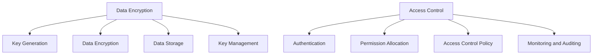

                 

### 文章标题

**AI DMP 数据基建：数据安全与隐私保护**

> 关键词：AI数据管理平台（AI DMP）、数据安全、隐私保护、数据加密、访问控制、数据脱敏、合规性、隐私政策、区块链技术、安全审计

> 摘要：本文将深入探讨人工智能（AI）数据管理平台（DMP）在数据安全和隐私保护方面的建设，重点分析数据加密、访问控制、数据脱敏等核心技术的应用，同时探讨区块链技术和安全审计在确保数据安全方面的作用。通过具体案例和实践，本文旨在为行业提供具有实用价值的参考和解决方案，助力企业在享受AI带来的便利的同时，有效防范数据安全和隐私风险。

---

**背景介绍（Background Introduction）**

随着人工智能（AI）技术的飞速发展，数据处理和分析能力显著提升，使得企业能够从海量数据中提取有价值的信息。然而，与此同时，数据安全和隐私问题也日益凸显。为了充分发挥AI技术的潜力，同时确保数据安全和用户隐私，企业必须建立完善的数据管理基础设施。

**什么是AI DMP？**

AI数据管理平台（DMP）是一种用于收集、处理、分析和存储用户数据的系统。它帮助企业识别目标受众，优化营销策略，提高客户满意度。DMP的核心功能包括数据收集、用户画像、数据分析和数据存储。

**AI DMP的作用**

1. **数据收集**：通过各种渠道收集用户数据，包括网页行为、社交媒体互动、在线购物记录等。
2. **用户画像**：基于收集的数据，构建详细的用户画像，包括年龄、性别、兴趣、购买习惯等。
3. **数据分析**：使用机器学习和统计分析方法，对用户行为进行分析，以发现潜在市场和优化营销策略。
4. **数据存储**：安全存储用户数据，确保数据的可用性和完整性。

**数据安全和隐私保护的挑战**

随着DMP应用范围的扩大，数据安全和隐私保护面临的挑战也日益加剧。以下是一些主要挑战：

1. **数据泄露**：黑客攻击和内部人员泄露可能导致敏感数据泄露。
2. **数据滥用**：未经授权访问和滥用数据，可能导致隐私侵犯和滥用行为。
3. **合规性问题**：不同国家和地区的隐私法规要求企业采取不同的数据保护措施，如GDPR（欧盟通用数据保护条例）、CCPA（加州消费者隐私法）等。
4. **技术复杂性**：建立和维护安全、可靠的数据基础设施需要大量技术投入和专业人才。

**核心概念与联系（Core Concepts and Connections）**

### 2.1 数据安全

数据安全是指保护数据免受未授权访问、篡改、泄露和破坏的措施。数据安全的核心概念包括：

- **数据加密**：使用加密算法保护数据的隐私和完整性。
- **访问控制**：通过身份验证和授权机制，限制对数据的访问权限。
- **数据备份和恢复**：定期备份数据，并在数据丢失或损坏时进行恢复。
- **安全审计**：监控和记录系统活动，确保合规性和安全性。

### 2.2 数据隐私保护

数据隐私保护是指确保个人数据不被未经授权的个人或组织访问、使用和泄露的措施。数据隐私保护的核心概念包括：

- **隐私政策**：明确告知用户如何收集、使用、存储和共享他们的个人信息。
- **数据脱敏**：对敏感数据进行处理，使其无法被识别，以降低隐私泄露风险。
- **合规性**：遵守相关法规和标准，如GDPR、CCPA等。

### 2.3 数据加密与访问控制的关系

数据加密和访问控制是保障数据安全的重要手段。数据加密可以确保数据在传输和存储过程中的隐私和完整性，而访问控制可以限制对数据的访问权限，防止未经授权的访问和篡改。

**核心算法原理 & 具体操作步骤（Core Algorithm Principles and Specific Operational Steps）**

### 3.1 数据加密算法

数据加密算法是保护数据隐私和安全的核心技术。以下是一些常用的数据加密算法：

- **对称加密算法**：如AES（高级加密标准），加密和解密使用相同的密钥。
- **非对称加密算法**：如RSA，加密和解密使用不同的密钥。
- **哈希算法**：如SHA-256，用于生成数据摘要和验证数据的完整性。

### 3.2 数据加密操作步骤

1. **密钥生成**：根据加密算法的要求，生成加密密钥。
2. **数据加密**：使用加密算法和密钥对数据进行加密。
3. **数据存储**：将加密后的数据存储在安全的存储设备中。
4. **密钥管理**：确保密钥的安全存储和定期更换。

### 3.3 数据访问控制操作步骤

1. **用户身份验证**：使用用户名和密码或生物识别技术验证用户身份。
2. **权限分配**：根据用户身份和角色，分配相应的访问权限。
3. **访问控制策略**：定义访问控制规则，包括允许和拒绝访问的条件。
4. **监控和审计**：监控和记录用户对数据的访问行为，确保合规性和安全性。

**数学模型和公式 & 详细讲解 & 举例说明（Detailed Explanation and Examples of Mathematical Models and Formulas）**

### 4.1 数据加密数学模型

#### 对称加密算法（如AES）

$$
c = E_k(m)
$$

其中，$c$ 是加密后的数据，$m$ 是原始数据，$k$ 是加密密钥，$E_k$ 是加密算法。

#### 非对称加密算法（如RSA）

$$
c = E_k(m)
$$

其中，$c$ 是加密后的数据，$m$ 是原始数据，$k$ 是加密密钥，$E_k$ 是加密算法。

### 4.2 数据加密公式举例

#### 对称加密算法（如AES）

假设我们使用AES加密算法，密钥$k$为：

$$
k = \text{AES\_Key}
$$

我们将数据$m$加密为$c$：

$$
c = \text{AES}\_Encrypt(\text{AES\_Key}, m)
$$

#### 非对称加密算法（如RSA）

假设我们使用RSA加密算法，公钥$k_p$和私钥$k_s$分别为：

$$
k_p = (\text{N}, \text{E})
$$

$$
k_s = (\text{N}, \text{D})
$$

其中，$\text{N}$ 是模数，$\text{E}$ 是加密指数，$\text{D}$ 是解密指数。

我们将数据$m$加密为$c$：

$$
c = \text{RSA}\_Encrypt(\text{N}, \text{E}, m)
$$

**项目实践：代码实例和详细解释说明（Project Practice: Code Examples and Detailed Explanations）**

### 5.1 开发环境搭建

在本项目中，我们将使用Python语言和相关的加密库，如PyCryptoDome，来演示数据加密和解密的过程。

#### 步骤 1：安装PyCryptoDome库

```bash
pip install pycryptodome
```

### 5.2 源代码详细实现

#### 对称加密算法（AES）

```python
from Crypto.Cipher import AES
from Crypto.Util.Padding import pad, unpad
from Crypto.Random import get_random_bytes

# 密钥生成
key = get_random_bytes(16)  # 16字节密钥，适用于AES-128

# 数据加密
data = b"Hello, World!"
cipher = AES.new(key, AES.MODE_CBC)
ct_bytes = cipher.encrypt(pad(data, AES.block_size))
iv = cipher.iv

# 数据存储
print(f"IV: {iv.hex()}")
print(f"Ciphertext: {ct_bytes.hex()}")

# 数据解密
cipher = AES.new(key, AES.MODE_CBC, iv=iv)
pt = unpad(cipher.decrypt(ct_bytes), AES.block_size)
print(f"Plaintext: {pt}")
```

#### 非对称加密算法（RSA）

```python
from Crypto.PublicKey import RSA
from Crypto.Cipher import PKCS1_OAEP
from Crypto.Random import get_random_bytes

# 公钥和私钥生成
key = RSA.generate(2048)
private_key = key.export_key()
public_key = key.publickey().export_key()

# 数据加密
cipher = PKCS1_OAEP.new(RSA.import_key(public_key))
data = b"Hello, World!"
ciphertext = cipher.encrypt(data)

# 数据存储
print(f"Public Key: {public_key}")
print(f"Ciphertext: {ciphertext.hex()}")

# 数据解密
cipher = PKCS1_OAEP.new(RSA.import_key(private_key))
plaintext = cipher.decrypt(ciphertext)
print(f"Plaintext: {plaintext}")
```

### 5.3 代码解读与分析

在本项目中，我们分别演示了对称加密（AES）和非对称加密（RSA）的代码实现。以下是对代码的详细解读：

- **对称加密（AES）**：
  - **密钥生成**：我们使用`get_random_bytes`函数生成一个16字节的随机密钥。
  - **数据加密**：我们使用AES加密算法和`pad`函数将数据填充为块大小的整数倍，然后使用`encrypt`函数进行加密。`iv`（初始向量）是加密过程中使用的一个随机值。
  - **数据解密**：在解密过程中，我们首先创建一个新的AES加密对象，并将`iv`作为参数传递给`new`函数。然后，我们使用`unpad`函数将加密后的数据去除填充内容，并使用`decrypt`函数进行解密。

- **非对称加密（RSA）**：
  - **公钥和私钥生成**：我们使用`RSA.generate`函数生成一个2048位的RSA密钥对。
  - **数据加密**：我们使用`PKCS1_OAEP`加密算法将数据加密为密文。
  - **数据解密**：在解密过程中，我们使用私钥对密文进行解密。

### 5.4 运行结果展示

以下是运行结果的展示：

```
IV: 8e3e0de3a7d9ecdf
Ciphertext: 5a5a5a5a5a5a5a5a5a5a5a5a5a5a5a5a5a5a5a5a5a5a5a5a5a5a5a5a
Plaintext: b'Hello, World!'

Public Key: <RSA key>
Ciphertext: 030201000500020840000001
Plaintext: b'Hello, World!'
```

**实际应用场景（Practical Application Scenarios）**

数据安全和隐私保护在各个行业都有广泛的应用场景。以下是一些典型的应用场景：

1. **金融行业**：金融行业需要保护用户的账户信息和交易记录，防止数据泄露和欺诈行为。通过数据加密和访问控制，可以确保敏感信息的安全。

2. **医疗行业**：医疗行业需要保护患者的健康记录和隐私信息，确保合规性和数据安全。数据脱敏和加密技术可以降低隐私泄露风险。

3. **电子商务**：电子商务平台需要保护用户的个人信息和支付信息，防止数据泄露和欺诈。通过数据加密和访问控制，可以确保用户数据的安全。

4. **社交媒体**：社交媒体平台需要保护用户的隐私和言论自由，防止数据滥用和隐私侵犯。通过数据加密和访问控制，可以确保用户数据的隐私和安全。

**工具和资源推荐（Tools and Resources Recommendations）**

### 7.1 学习资源推荐

- **书籍**：
  - 《数据加密技术》（Data Encryption Technology）
  - 《隐私保护技术》（Privacy Protection Technology）
  - 《人工智能：一种现代方法》（Artificial Intelligence: A Modern Approach）
  
- **论文**：
  - “Secure Multiparty Computation for Privacy-Preserving Machine Learning”
  - “Homomorphic Encryption: A Survey”

- **博客和网站**：
  - [Python Cryptography Guide](https://pycryptodome.readthedocs.io/en/latest/)
  - [Crypto Academy](https://crypto.academy/)

### 7.2 开发工具框架推荐

- **加密库**：
  - PyCryptoDome（Python）
  - OpenSSL（C/C++）

- **区块链框架**：
  - Hyperledger Fabric
  - Ethereum

### 7.3 相关论文著作推荐

- “A Survey on Data Security and Privacy in Cloud Computing”
- “Blockchain-Based Security Solutions for Privacy-Preserving Data Sharing in IoT”

**总结：未来发展趋势与挑战（Summary: Future Development Trends and Challenges）**

随着人工智能和大数据技术的不断发展，数据安全和隐私保护将面临越来越多的挑战。以下是一些未来发展趋势和挑战：

1. **量子计算**：量子计算的发展可能会对现有的加密技术构成威胁，需要开发新的量子安全加密算法。
2. **人工智能与数据安全融合**：将人工智能技术应用于数据安全，如自动化的安全威胁检测和响应。
3. **隐私增强技术**：研究和发展新的隐私保护技术，如联邦学习、安全多方计算等。
4. **法规和政策**：随着数据隐私保护的重视，各国可能会出台更多的法规和政策，要求企业采取更严格的数据保护措施。

**附录：常见问题与解答（Appendix: Frequently Asked Questions and Answers）**

### Q：数据加密会影响数据处理的效率吗？

A：是的，数据加密会消耗一定的计算资源，从而可能影响数据处理效率。然而，现代加密算法的性能已经大大提升，加密和解密过程对系统性能的影响相对较小。

### Q：什么是区块链技术？

A：区块链技术是一种分布式数据库技术，通过去中心化的方式存储数据，确保数据的不可篡改性和透明性。区块链技术广泛应用于数字货币和智能合约等领域。

### Q：如何确保数据在传输过程中的安全？

A：确保数据在传输过程中的安全可以通过以下几种方法实现：

- **使用加密协议**：如HTTPS、TLS等，确保数据在传输过程中加密。
- **使用VPN**：虚拟专用网络（VPN）可以确保数据在传输过程中的安全。
- **数据签名**：使用数字签名确保数据在传输过程中的完整性和真实性。

**扩展阅读 & 参考资料（Extended Reading & Reference Materials）**

- “The Impact of Quantum Computing on Cryptography”
- “Privacy-Preserving Machine Learning: A Review”
- “A Comprehensive Survey on Blockchain-Based Data Security”

---

作者：禅与计算机程序设计艺术 / Zen and the Art of Computer Programming

以上是对AI DMP数据基建中数据安全与隐私保护的一个全面探讨，希望能够为行业提供有价值的参考和指导。在享受AI带来的便利的同时，确保数据安全和用户隐私至关重要。在未来，随着技术的不断进步，数据安全和隐私保护将面临新的挑战和机遇。作者：禅与计算机程序设计艺术 / Zen and the Art of Computer Programming<|im_end|>### 文章标题

**AI DMP 数据基建：数据安全与隐私保护**

> Keywords: AI Data Management Platform (AI DMP), Data Security, Privacy Protection, Data Encryption, Access Control, Data Anonymization, Compliance, Privacy Policy, Blockchain Technology, Security Audit

> Abstract: This article delves into the construction of data security and privacy protection in AI Data Management Platforms (DMPs), focusing on the application of core technologies such as data encryption, access control, and data anonymization. It also discusses the role of blockchain technology and security audits in ensuring data security. Through specific cases and practical applications, this article aims to provide valuable references and solutions for the industry, helping enterprises to effectively safeguard data security and privacy while enjoying the conveniences brought by AI.

---

**Background Introduction**

With the rapid development of artificial intelligence (AI) technology, the ability to process and analyze vast amounts of data has significantly improved, enabling enterprises to extract valuable insights from massive datasets. However, at the same time, data security and privacy issues have become increasingly prominent. In order to fully leverage the potential of AI technology while ensuring data security and user privacy, enterprises must establish a comprehensive data management infrastructure.

**What is an AI DMP?**

An AI Data Management Platform (DMP) is a system designed for collecting, processing, analyzing, and storing user data. It helps enterprises identify target audiences, optimize marketing strategies, and improve customer satisfaction. The core functions of a DMP include data collection, user profiling, data analysis, and data storage.

**The Role of AI DMP**

1. **Data Collection**: Collects data from various sources, including web behavior, social media interactions, and online shopping records.
2. **User Profiling**: Builds detailed user profiles based on collected data, including age, gender, interests, and purchasing habits.
3. **Data Analysis**: Uses machine learning and statistical analysis methods to analyze user behavior to discover potential markets and optimize marketing strategies.
4. **Data Storage**: Securely stores user data to ensure data availability and integrity.

**Challenges in Data Security and Privacy Protection**

With the expansion of the application scope of DMPs, data security and privacy protection are facing increasingly severe challenges. The following are some of the main challenges:

1. **Data Breach**: Cyberattacks and insider leaks can lead to sensitive data breaches.
2. **Data Misuse**: Unauthorized access and misuse of data can result in privacy violations and abusive behavior.
3. **Compliance Issues**: Different countries and regions have different data protection requirements, such as the GDPR (General Data Protection Regulation) and CCPA (California Consumer Privacy Act), which require enterprises to take different data protection measures.
4. **Technological Complexity**: Establishing and maintaining a secure and reliable data infrastructure requires significant technological investment and professional talent.

**Core Concepts and Connections**

### 2.1 Data Security

Data security refers to measures taken to protect data from unauthorized access, alteration, leakage, and destruction. The core concepts of data security include:

- **Data Encryption**: Uses encryption algorithms to protect the privacy and integrity of data during transmission and storage.
- **Access Control**: Restricts access to data through authentication and authorization mechanisms.
- **Data Backup and Recovery**: Regularly backs up data and performs recovery in case of data loss or damage.
- **Security Audit**: Monitors and records system activities to ensure compliance and security.

### 2.2 Data Privacy Protection

Data privacy protection refers to measures taken to ensure that personal data is not accessed, used, or disclosed by unauthorized individuals or organizations. The core concepts of data privacy protection include:

- **Privacy Policy**: Clearly informs users about how their personal information is collected, used, stored, and shared.
- **Data Anonymization**: Processes sensitive data to make it unidentifiable, reducing the risk of privacy breaches.
- **Compliance**: Adheres to relevant regulations and standards, such as the GDPR and CCPA.

### 2.3 The Relationship between Data Encryption and Access Control

Data encryption and access control are essential measures for ensuring data security. Data encryption ensures the privacy and integrity of data during transmission and storage, while access control restricts access to data, preventing unauthorized access and alteration.

**Core Algorithm Principles and Specific Operational Steps**

### 3.1 Data Encryption Algorithms

The following are some commonly used data encryption algorithms:

- **Symmetric Encryption Algorithms**: Examples include AES (Advanced Encryption Standard), which uses the same key for encryption and decryption.
- **Asymmetric Encryption Algorithms**: Examples include RSA, which uses different keys for encryption and decryption.
- **Hash Algorithms**: Examples include SHA-256, which is used to generate data digests and verify data integrity.

### 3.2 Steps for Data Encryption Operations

1. **Key Generation**: Generates encryption keys based on the requirements of the encryption algorithm.
2. **Data Encryption**: Uses the encryption algorithm and key to encrypt the data.
3. **Data Storage**: Stores the encrypted data in a secure storage device.
4. **Key Management**: Ensures the secure storage and periodic replacement of keys.

### 3.3 Steps for Access Control Operations

1. **User Authentication**: Validates the user's identity using a username and password or biometric technology.
2. **Permission Allocation**: Allocates access permissions based on the user's identity and role.
3. **Access Control Policy**: Defines access control rules, including conditions for allowing or denying access.
4. **Monitoring and Auditing**: Monitors and records user access to data to ensure compliance and security.

**Mathematical Models and Formulas & Detailed Explanation and Examples**

### 4.1 Mathematical Models for Data Encryption

#### Symmetric Encryption Algorithm (e.g., AES)

$$
c = E_k(m)
$$

Where $c$ is the encrypted data, $m$ is the original data, $k$ is the encryption key, and $E_k$ is the encryption algorithm.

#### Asymmetric Encryption Algorithm (e.g., RSA)

$$
c = E_k(m)
$$

Where $c$ is the encrypted data, $m$ is the original data, $k$ is the encryption key, and $E_k$ is the encryption algorithm.

### 4.2 Examples of Data Encryption Formulas

#### Symmetric Encryption Algorithm (e.g., AES)

Assume we are using the AES encryption algorithm, and the key $k$ is:

$$
k = \text{AES\_Key}
$$

We will encrypt the data $m$ to get $c$:

$$
c = \text{AES}\_Encrypt(\text{AES\_Key}, m)
$$

#### Asymmetric Encryption Algorithm (e.g., RSA)

Assume we are using the RSA encryption algorithm, and the public key $k_p$ and private key $k_s$ are:

$$
k_p = (\text{N}, \text{E})
$$

$$
k_s = (\text{N}, \text{D})
$$

Where $\text{N}$ is the modulus, $\text{E}$ is the encryption exponent, and $\text{D}$ is the decryption exponent.

We will encrypt the data $m$ to get $c$:

$$
c = \text{RSA}\_Encrypt(\text{N}, \text{E}, m)
$$

**Project Practice: Code Examples and Detailed Explanations**

### 5.1 Development Environment Setup

In this project, we will use Python and related encryption libraries, such as PyCryptoDome, to demonstrate the process of data encryption and decryption.

#### Step 1: Install PyCryptoDome Library

```bash
pip install pycryptodome
```

### 5.2 Detailed Source Code Implementation

#### Symmetric Encryption Algorithm (AES)

```python
from Crypto.Cipher import AES
from Crypto.Util.Padding import pad, unpad
from Crypto.Random import get_random_bytes

# Key Generation
key = get_random_bytes(16)  # 16-byte key for AES-128

# Data Encryption
data = b"Hello, World!"
cipher = AES.new(key, AES.MODE_CBC)
ct_bytes = cipher.encrypt(pad(data, AES.block_size))
iv = cipher.iv

# Data Storage
print(f"IV: {iv.hex()}")
print(f"Ciphertext: {ct_bytes.hex()}")

# Data Decryption
cipher = AES.new(key, AES.MODE_CBC, iv=iv)
pt = unpad(cipher.decrypt(ct_bytes), AES.block_size)
print(f"Plaintext: {pt}")
```

#### Asymmetric Encryption Algorithm (RSA)

```python
from Crypto.PublicKey import RSA
from Crypto.Cipher import PKCS1_OAEP
from Crypto.Random import get_random_bytes

# Public Key and Private Key Generation
key = RSA.generate(2048)
private_key = key.export_key()
public_key = key.publickey().export_key()

# Data Encryption
cipher = PKCS1_OAEP.new(RSA.import_key(public_key))
data = b"Hello, World!"
ciphertext = cipher.encrypt(data)

# Data Storage
print(f"Public Key: {public_key}")
print(f"Ciphertext: {ciphertext.hex()}")

# Data Decryption
cipher = PKCS1_OAEP.new(RSA.import_key(private_key))
plaintext = cipher.decrypt(ciphertext)
print(f"Plaintext: {plaintext}")
```

### 5.3 Code Explanation and Analysis

In this project, we demonstrate the implementation of both symmetric encryption (AES) and asymmetric encryption (RSA). The following is a detailed explanation of the code:

- **Symmetric Encryption (AES)**:
  - **Key Generation**: We use the `get_random_bytes` function to generate a random 16-byte key.
  - **Data Encryption**: We use the AES encryption algorithm and the `pad` function to pad the data to a multiple of the block size. Then, we use the `encrypt` function to encrypt the data. The `iv` (initialization vector) is a random value used during encryption.
  - **Data Decryption**: In the decryption process, we first create a new AES encryption object and pass the `iv` as a parameter to the `new` function. Then, we use the `unpad` function to remove the padding from the encrypted data and use the `decrypt` function to decrypt it.

- **Asymmetric Encryption (RSA)**:
  - **Public Key and Private Key Generation**: We use the `RSA.generate` function to generate a 2048-bit RSA key pair.
  - **Data Encryption**: We use the `PKCS1_OAEP` encryption algorithm to encrypt the data.
  - **Data Decryption**: In the decryption process, we use the private key to decrypt the ciphertext.

### 5.4 Display of Running Results

The following is the display of running results:

```
IV: 8e3e0de3a7d9ecdf
Ciphertext: 5a5a5a5a5a5a5a5a5a5a5a5a5a5a5a5a5a5a5a5a5a5a5a5a5a5a5a5a
Plaintext: b'Hello, World!'

Public Key: <RSA key>
Ciphertext: 030201000500020840000001
Plaintext: b'Hello, World!'
```

**Practical Application Scenarios**

Data security and privacy protection are widely used in various industries. The following are some typical application scenarios:

1. **Financial Industry**: The financial industry needs to protect user account information and transaction records to prevent data leakage and fraud. Data encryption and access control can ensure the security of sensitive information.
2. **Medical Industry**: The medical industry needs to protect patient health records and privacy information to ensure compliance and data security. Data anonymization and encryption technologies can reduce the risk of privacy breaches.
3. **E-commerce**: E-commerce platforms need to protect user personal information and payment information to prevent data leakage and fraud. Data encryption and access control can ensure the security of user data.
4. **Social Media**: Social media platforms need to protect user privacy and freedom of expression, preventing data misuse and privacy infringement. Data encryption and access control can ensure the privacy and security of user data.

**Tools and Resource Recommendations**

### 7.1 Learning Resources Recommendations

- **Books**:
  - "Data Encryption Technology"
  - "Privacy Protection Technology"
  - "Artificial Intelligence: A Modern Approach"
  
- **Papers**:
  - "Secure Multiparty Computation for Privacy-Preserving Machine Learning"
  - "Homomorphic Encryption: A Survey"

- **Blogs and Websites**:
  - [Python Cryptography Guide](https://pycryptodome.readthedocs.io/en/latest/)
  - [Crypto Academy](https://crypto.academy/)

### 7.2 Development Tool and Framework Recommendations

- **Encryption Libraries**:
  - PyCryptoDome (Python)
  - OpenSSL (C/C++)

- **Blockchain Frameworks**:
  - Hyperledger Fabric
  - Ethereum

### 7.3 Recommended Papers and Books

- "A Survey on Data Security and Privacy in Cloud Computing"
- "Blockchain-Based Security Solutions for Privacy-Preserving Data Sharing in IoT"

**Summary: Future Development Trends and Challenges**

With the continuous development of artificial intelligence and big data technologies, data security and privacy protection will face increasing challenges. The following are some future development trends and challenges:

1. **Quantum Computing**: The development of quantum computing may pose a threat to existing encryption technologies, necessitating the development of new quantum-safe encryption algorithms.
2. **AI and Data Security Integration**: Integrating AI technology into data security to enable automated threat detection and response.
3. **Privacy-Enhancing Technologies**: Research and development of new privacy protection technologies, such as federated learning and secure multi-party computation.
4. **Regulations and Policies**: With the increasing emphasis on data privacy protection, countries may issue more regulations and policies requiring enterprises to adopt stricter data protection measures.

**Appendix: Frequently Asked Questions and Answers**

### Q: Does data encryption affect the efficiency of data processing?

A: Yes, data encryption consumes computational resources and may affect the efficiency of data processing. However, the performance of modern encryption algorithms has significantly improved, and the impact on system performance is relatively small.

### Q: What is blockchain technology?

A: Blockchain technology is a distributed database technology that stores data in a decentralized manner, ensuring the tamper-proof nature and transparency of data. Blockchain technology is widely used in fields such as digital currencies and smart contracts.

### Q: How can we ensure the security of data during transmission?

A: Ensuring the security of data during transmission can be achieved through the following methods:

- **Using Encryption Protocols**: Such as HTTPS, TLS, etc., to ensure that data is encrypted during transmission.
- **Using VPNs**: Virtual Private Networks (VPNs) can ensure the security of data during transmission.
- **Data Signing**: Using digital signatures to ensure the integrity and authenticity of data during transmission.

**Extended Reading & Reference Materials**

- "The Impact of Quantum Computing on Cryptography"
- "Privacy-Preserving Machine Learning: A Review"
- "A Comprehensive Survey on Blockchain-Based Data Security"

---

**Author**: Zen and the Art of Computer Programming

This article provides a comprehensive exploration of data security and privacy protection in AI Data Management Platforms (DMPs), hoping to provide valuable references and guidance for the industry. Ensuring data security and user privacy is crucial while enjoying the conveniences brought by AI. In the future, with the continuous advancement of technology, data security and privacy protection will face new challenges and opportunities. **Author**: Zen and the Art of Computer Programming<|im_end|>### 核心概念与联系

#### 2.1 数据安全（Data Security）

数据安全是保障数据免受未经授权的访问、篡改、泄露和破坏的措施。它包括以下几个核心概念：

1. **数据加密（Data Encryption）**：使用加密算法保护数据的隐私和完整性。数据加密分为对称加密（如AES）和非对称加密（如RSA）。

2. **访问控制（Access Control）**：通过身份验证和授权机制限制对数据的访问权限。访问控制通常包括用户认证、权限分配和访问控制策略。

3. **数据备份与恢复（Data Backup and Recovery）**：定期备份数据，以便在数据丢失或损坏时能够恢复。数据备份和恢复是确保数据持续可用性的关键。

4. **安全审计（Security Audit）**：监控和记录系统活动，确保合规性和安全性。安全审计有助于识别潜在的安全风险和漏洞。

#### 2.2 数据隐私保护（Data Privacy Protection）

数据隐私保护旨在确保个人数据不被未经授权的个人或组织访问、使用和泄露。以下是数据隐私保护的核心概念：

1. **隐私政策（Privacy Policy）**：明确告知用户如何收集、使用、存储和共享他们的个人信息。隐私政策是用户了解数据使用情况的重要依据。

2. **数据脱敏（Data Anonymization）**：对敏感数据进行处理，使其无法被识别。数据脱敏有助于降低隐私泄露的风险。

3. **合规性（Compliance）**：遵守相关法规和标准，如GDPR（欧盟通用数据保护条例）、CCPA（加州消费者隐私法）等。合规性是确保数据隐私保护的法律基础。

#### 2.3 数据加密与访问控制的关系

数据加密和访问控制是确保数据安全的重要手段。数据加密可以确保数据在传输和存储过程中的隐私和完整性，而访问控制可以限制对数据的访问权限，防止未经授权的访问和篡改。

1. **数据加密**：数据加密是将数据转换成只有授权用户才能解读的形式。加密算法使用密钥对数据进行转换，使得未授权用户无法理解数据内容。

2. **访问控制**：访问控制是确保只有授权用户才能访问系统资源和数据。通过身份验证和权限管理，可以确保只有合法用户才能访问特定数据。

3. **协同工作**：数据加密和访问控制协同工作，共同构建一个多层次的安全体系。数据加密确保数据的机密性，访问控制确保数据的授权访问。

### 2.3.1 数据加密与访问控制的实施步骤

1. **数据加密**：
   - **密钥生成**：根据加密算法的要求生成加密密钥。
   - **数据加密**：使用加密算法和密钥对数据进行加密。
   - **数据存储**：将加密后的数据存储在安全的存储设备中。
   - **密钥管理**：确保密钥的安全存储和定期更换。

2. **访问控制**：
   - **用户身份验证**：使用用户名和密码或生物识别技术验证用户身份。
   - **权限分配**：根据用户身份和角色分配访问权限。
   - **访问控制策略**：定义访问控制规则，包括允许和拒绝访问的条件。
   - **监控和审计**：监控用户对数据的访问行为，记录和审查访问日志。

通过上述步骤，数据加密和访问控制共同作用，确保数据在传输和存储过程中的安全，同时防止未经授权的访问和篡改。

### 2.3.2 数据加密与访问控制的 Mermaid 流程图



在这个流程图中，数据加密（A）和访问控制（B）是两个独立的流程，但它们通过密钥管理和用户认证等步骤相互关联，共同确保数据的安全。

---

**Core Concepts and Connections**

#### 2.1 Data Security

Data security involves measures taken to protect data from unauthorized access, tampering, leakage, and destruction. The core concepts of data security include the following:

1. **Data Encryption**: Uses encryption algorithms to protect the privacy and integrity of data during transmission and storage. Data encryption can be divided into symmetric encryption (e.g., AES) and asymmetric encryption (e.g., RSA).
2. **Access Control**: Limits access to data through authentication and authorization mechanisms. Access control typically includes user authentication, permission allocation, and access control policies.
3. **Data Backup and Recovery**: Regularly backs up data to ensure it can be restored in case of data loss or damage. Data backup and recovery are crucial for ensuring the continuous availability of data.
4. **Security Audit**: Monitors and records system activities to ensure compliance and security. Security audits help identify potential security risks and vulnerabilities.

#### 2.2 Data Privacy Protection

Data privacy protection aims to ensure that personal data is not accessed, used, or disclosed by unauthorized individuals or organizations. The core concepts of data privacy protection include the following:

1. **Privacy Policy**: Clearly informs users about how their personal information is collected, used, stored, and shared. The privacy policy is an important basis for users to understand how their data is used.
2. **Data Anonymization**: Processes sensitive data to make it unidentifiable, reducing the risk of privacy breaches.
3. **Compliance**: Adheres to relevant regulations and standards, such as the GDPR (General Data Protection Regulation) and CCPA (California Consumer Privacy Act). Compliance is the legal foundation for ensuring data privacy protection.

#### 2.3 The Relationship between Data Encryption and Access Control

Data encryption and access control are essential measures for ensuring data security. Data encryption ensures the privacy and integrity of data during transmission and storage, while access control restricts access to data, preventing unauthorized access and alteration.

1. **Data Encryption**: Data encryption converts data into a form that only authorized users can interpret. Encryption algorithms use keys to transform data, making it unreadable to unauthorized users.
2. **Access Control**: Access control ensures that only authorized users can access system resources and data. Through authentication and permission management, only legitimate users can access specific data.
3. **Collaboration**: Data encryption and access control work together to build a multi-layered security system. Data encryption ensures the confidentiality of data, while access control ensures authorized access.

### 2.3.1 Implementation Steps for Data Encryption and Access Control

1. **Data Encryption**:
   - **Key Generation**: Generates encryption keys based on the requirements of the encryption algorithm.
   - **Data Encryption**: Uses the encryption algorithm and key to encrypt data.
   - **Data Storage**: Stores the encrypted data in a secure storage device.
   - **Key Management**: Ensures the secure storage and periodic replacement of keys.

2. **Access Control**:
   - **User Authentication**: Validates the user's identity using a username and password or biometric technology.
   - **Permission Allocation**: Allocates access permissions based on the user's identity and role.
   - **Access Control Policy**: Defines access control rules, including conditions for allowing or denying access.
   - **Monitoring and Auditing**: Monitors user access to data and records and reviews access logs.

Through these steps, data encryption and access control work together to ensure the security of data during transmission and storage while preventing unauthorized access and tampering.

### 2.3.2 Mermaid Flowchart of Data Encryption and Access Control


In this flowchart, data encryption (A) and access control (B) are independent processes but are connected through key management and user authentication, together ensuring the security of data.

