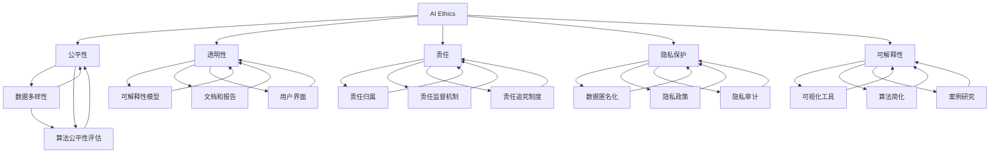

                 

### 背景介绍（Background Introduction）

人工智能（AI）作为当今科技领域的明星，已渗透到我们生活的方方面面，从智能手机的智能助手，到自动驾驶汽车，再到医疗诊断、金融风控，AI 正在改变着世界的运行规则。然而，随着 AI 技术的飞速发展，伦理问题也日益凸显，特别是在 AI 的决策透明性、公平性、隐私保护和可解释性等方面。这些伦理问题不仅关系到技术的可持续发展，更关乎社会的稳定与公正。

本文将探讨 AI 伦理（AI Ethics）的核心原理，并通过实际代码实例详细讲解这些原理的具体应用。我们将首先介绍 AI 伦理的基本概念和背景，然后深入探讨几个关键问题，如算法偏见、透明性和可解释性。最后，我们将结合具体的代码实例，展示如何在实际项目中实现 AI 伦理原则。

通过本文的阅读，读者将能够了解 AI 伦理的基本概念和重要性，掌握在实际项目中应用 AI 伦理原则的方法和技巧，从而为构建更加公正、透明和可解释的 AI 系统打下坚实基础。

---

### Keywords:
- AI Ethics
- AI Transparency
- Bias in AI
- Explanability
- Code Examples
- AI Algorithm
- AI Applications

### Abstract:
This article delves into the core principles of AI Ethics, providing a comprehensive overview of its importance and relevance in the current technological landscape. We explore key issues such as algorithmic bias, transparency, and explainability, and illustrate practical applications through detailed code examples. The aim is to equip readers with the knowledge and skills needed to implement AI Ethics principles in real-world projects, fostering the development of fair, transparent, and interpretable AI systems.

---

## 1. AI 伦理的基本概念（Basic Concepts of AI Ethics）

AI 伦理，也称为人工智能伦理，涉及研究人工智能技术在社会、经济、法律和道德等方面的影响。其核心目标是确保人工智能技术的发展与应用能够促进人类福祉，同时减少潜在的风险和负面影响。以下是一些关键的基本概念：

### 1.1 伦理学（Ethics）

伦理学是研究道德原则、价值观和行为规范的学科。在 AI 伦理中，伦理学提供了评估和指导人工智能技术行为的框架。伦理原则通常涉及公平性、透明性、责任、尊重隐私和个人权利等方面。

### 1.2 人工智能技术（Artificial Intelligence Technology）

人工智能技术包括机器学习、深度学习、自然语言处理等，这些技术赋予了机器模拟人类智能的能力。随着 AI 技术的发展，越来越多的决策和判断开始由算法自动执行，这引发了关于 AI 伦理的深入讨论。

### 1.3 道德责任（Moral Responsibility）

道德责任是指个体或组织在道德上对他们的行为负有责任。在 AI 领域，道德责任涉及到算法开发者和使用者如何确保其技术不会导致不良后果，如歧视、隐私侵犯或安全漏洞。

### 1.4 社会公正（Social Justice）

社会公正涉及到资源的公平分配和社会成员的机会均等。AI 伦理要求确保人工智能技术不会加剧社会不平等，例如通过算法偏见导致某些群体受到不公平对待。

### 1.5 透明性和可解释性（Transparency and Explainability）

透明性是指人工智能系统的行为和决策过程应易于理解和验证。可解释性则涉及到解释系统做出特定决策的原因。这些特性对于增强公众对 AI 技术的信任至关重要。

综上所述，AI 伦理不仅关注技术本身，还涉及技术如何影响社会和个人。理解这些基本概念是深入探讨 AI 伦理问题和解决实际问题的关键。

---

## 1.1.1 伦理学的基本原则（Basic Principles of Ethics）

伦理学作为研究道德原则和行为的学科，其核心原则包括：

### 1.1.1.1 公平性（Equity）

公平性是指对待所有个体或群体时，确保没有歧视和不公正。在 AI 伦理中，公平性要求算法不应因性别、种族、年龄、地理位置等因素而对个体产生偏见。

### 1.1.1.2 透明性（Transparency）

透明性要求算法和系统的决策过程和结果应易于理解和解释。这对于确保算法的公正性和可信度至关重要。

### 1.1.1.3 责任（Accountability）

责任涉及到当系统或算法导致不良后果时，谁应承担责任。在 AI 领域，责任原则要求算法开发者、维护者和使用者在设计、开发和部署 AI 系统时承担相应责任。

### 1.1.1.4 尊重隐私（Privacy Respect）

尊重隐私是指保护个人的个人信息不被未经授权的访问和滥用。AI 伦理要求确保 AI 系统在处理个人数据时遵守隐私保护原则。

### 1.1.1.5 可解释性（Explainability）

可解释性要求系统在做出决策时提供合理的解释。这对于提高用户对系统的信任和理解系统的行为至关重要。

通过这些伦理原则，我们可以构建更加公正、透明和可信的 AI 系统，从而促进社会的可持续发展。

---

### 1.2 AI 伦理的重要性（Importance of AI Ethics）

AI 伦理的重要性不可忽视，主要体现在以下几个方面：

### 1.2.1 社会稳定（Social Stability）

随着 AI 技术在各个领域的广泛应用，社会结构和人类生活正在发生深刻变化。如果不考虑伦理问题，AI 可能会导致社会不稳定，例如通过算法偏见加剧社会不平等，或通过自动化决策系统导致大规模失业。

### 1.2.2 公众信任（Public Trust）

AI 技术的透明性和可解释性直接影响公众对 AI 的信任。如果公众无法理解或信任 AI 系统的决策过程，可能会产生抵制情绪，阻碍技术的普及和发展。

### 1.2.3 法律合规（Legal Compliance）

许多国家和地区的法律已经开始对 AI 技术的伦理问题进行规范。例如，欧盟的 GDPR（通用数据保护条例）要求在处理个人数据时必须遵守严格的隐私保护原则。遵守伦理原则有助于确保技术符合法律要求，避免法律风险。

### 1.2.4 可持续性（Sustainability）

AI 伦理原则有助于确保 AI 技术的可持续发展。通过公平、透明和责任等原则，我们可以构建更加公正、可持续的 AI 系统，促进技术的长期发展。

综上所述，AI 伦理不仅是技术发展的必要保障，也是社会稳定和可持续发展的基石。理解和遵循 AI 伦理原则对于构建一个更加公正、透明和可信的 AI 未来至关重要。

---

## 1.3 AI 伦理的核心问题（Core Issues in AI Ethics）

在 AI 伦理领域，存在一系列核心问题，这些问题的解决对于确保 AI 技术的公平、透明和可持续性至关重要。以下是几个关键问题及其详细探讨：

### 1.3.1 算法偏见（Algorithmic Bias）

算法偏见是指算法在训练数据中学习到的偏见，导致系统对某些群体产生不公平待遇。例如，招聘系统可能会因为训练数据中的性别偏见而更倾向于雇佣男性。算法偏见可能导致歧视、社会不公和信任危机。

#### 1.3.1.1 算法偏见的原因（Reasons for Algorithmic Bias）

- **训练数据偏差**：算法的偏见往往源于训练数据的偏差。如果训练数据中包含偏见，算法将自动学习并放大这些偏见。
- **选择性优化**：算法在优化特定指标（如准确性）时，可能会忽视其他重要的伦理标准。
- **算法复杂性**：许多复杂的机器学习模型，如深度神经网络，其内部工作机制难以解释，这使得检测和纠正偏见变得更加困难。

#### 1.3.1.2 减少算法偏见的方法（Methods to Reduce Algorithmic Bias）

- **公平性评估**：在算法开发过程中，进行定期的公平性评估，确保算法对所有群体都是公平的。
- **多样性数据集**：使用包含多样性的训练数据集，以减少偏见。
- **偏见检测工具**：开发专门的工具来检测和纠正算法偏见。
- **算法透明性**：提高算法的透明性，使算法的决策过程和机制更加可解释，从而更容易识别和纠正偏见。

### 1.3.2 透明性（Transparency）

AI 系统的透明性是指其决策过程和结果应易于理解和验证。缺乏透明性可能导致用户对系统的信任降低，甚至引发法律和道德问题。

#### 1.3.2.1 透明性的重要性（Importance of Transparency）

- **公众信任**：透明性是建立公众对 AI 技术信任的关键因素。
- **监督和审查**：透明性使得监管机构和其他利益相关者能够对 AI 系统进行监督和审查。
- **法律合规**：许多法律和法规要求 AI 系统必须具备一定的透明性。

#### 1.3.2.2 提高透明性的方法（Methods to Improve Transparency）

- **可解释性模型**：开发可解释性模型，使算法的决策过程更加透明。
- **文档和报告**：提供详细的算法设计和实现文档，以及系统的性能评估报告。
- **用户界面**：设计直观的用户界面，使普通用户能够理解系统的决策过程。

### 1.3.3 可解释性（Explainability）

AI 系统的可解释性是指系统能够解释其决策原因和过程。可解释性对于用户信任和监管至关重要，特别是在医疗、金融和法律等领域。

#### 1.3.3.1 可解释性的重要性（Importance of Explainability）

- **用户信任**：可解释性有助于增强用户对系统的信任。
- **法律合规**：某些应用场景（如医疗和金融）要求系统的决策过程具有可解释性。
- **算法改进**：通过分析解释结果，可以改进算法的设计和实现。

#### 1.3.3.2 提高可解释性的方法（Methods to Improve Explainability）

- **可视化工具**：开发可视化工具，帮助用户理解算法的决策过程。
- **简洁性**：简化算法模型，使其更易于解释。
- **案例研究**：通过案例研究，分析算法在不同场景下的决策过程。

通过解决算法偏见、提高透明性和增强可解释性，我们可以构建更加公正、透明和可信的 AI 系统，从而为社会带来更多积极的影响。

---

### 1.4 AI 伦理在实践中的应用（Application of AI Ethics in Practice）

AI 伦理不仅在理论层面具有重要意义，更需要在实际应用中得以贯彻。以下是一些具体的实践案例，展示了如何在项目中实施 AI 伦理原则，并讨论了这些原则的实际效果。

#### 1.4.1 公共安全监控系统

在公共安全领域，AI 伦理原则的应用尤为重要。例如，某些城市部署了基于 AI 的监控摄像头系统，用于识别和追踪犯罪行为。为了确保透明性和可解释性，这些系统通常遵循以下原则：

- **数据隐私保护**：确保监控数据在收集、存储和处理过程中得到充分保护，防止隐私泄露。
- **算法公平性评估**：定期对算法进行公平性评估，确保系统不会对特定群体产生歧视。
- **用户知情权**：在系统使用过程中，向用户明确告知监控数据的用途和范围，保障其知情权。

通过这些措施，公共安全监控系统不仅提高了城市的安全水平，还增强了公众对监控技术的信任。

#### 1.4.2 金融风险评估

在金融行业，AI 伦理同样至关重要。金融机构使用 AI 技术进行风险评估时，必须确保算法的透明性和可解释性，以避免潜在的偏见和误导。例如：

- **透明性要求**：金融机构必须在内部审计报告中详细说明算法的设计和实现过程，以及如何进行数据清洗和特征提取。
- **可解释性工具**：开发可解释性工具，帮助金融分析师理解算法的决策过程，从而做出更明智的决策。
- **用户权益保障**：确保算法在评估客户信用风险时，不会对特定群体产生不公平待遇。

这些措施有助于提高金融机构的风险管理能力，同时增强客户对金融服务的信任。

#### 1.4.3 医疗诊断系统

在医疗领域，AI 伦理的应用关乎患者的生命和健康。例如，某些医疗机构使用 AI 技术进行疾病诊断，必须遵循以下伦理原则：

- **数据安全与隐私**：确保患者数据在存储和处理过程中得到充分保护，防止泄露和滥用。
- **算法公正性**：确保算法不会对特定患者群体产生偏见，如性别、种族或年龄。
- **用户知情权**：在诊断过程中，向患者明确告知算法的决策过程和结果，确保其知情权。

通过这些措施，医疗诊断系统不仅提高了诊断的准确性和效率，还增强了患者对医疗技术的信任。

#### 1.4.4 教育智能化

在教育领域，AI 伦理原则的应用同样重要。例如，某些教育机构使用 AI 技术进行个性化学习评估，必须确保以下原则：

- **公平性**：确保算法对所有学生都是公平的，不会因为性别、种族或经济状况而影响评估结果。
- **透明性**：向教师和学生明确解释算法的评估标准和过程，使其易于理解。
- **隐私保护**：确保学生的个人信息得到充分保护，防止隐私泄露。

通过这些措施，教育智能化系统不仅提高了教学效果，还增强了学生对教育技术的信任。

总的来说，AI 伦理原则在实际应用中的贯彻，有助于构建更加公正、透明和可信的 AI 系统，从而为社会带来更多的积极影响。通过不断探索和实践，我们可以进一步优化这些原则，使其更好地服务于人类社会的可持续发展。

---

## 2. 核心概念与联系（Core Concepts and Connections）

### 2.1 AI Ethics 原理概述

AI Ethics 是一个跨学科领域，涉及计算机科学、伦理学、法律、心理学和社会学等多个领域。其核心目标是确保人工智能技术的研发和应用过程中，不损害人类的基本权益和价值观。以下是对 AI Ethics 中几个关键概念和原理的概述：

#### 2.1.1 公平性（Equity）

公平性是 AI Ethics 的核心原则之一，旨在确保人工智能系统对所有用户都是公平的，不会因性别、种族、年龄、地理位置等因素而对某些群体产生歧视。实现公平性的关键在于：

- **多样性数据集**：确保训练数据集的多样性，以减少算法偏见。
- **算法公平性评估**：定期对算法进行公平性评估，检测并纠正潜在的偏见。
- **透明性**：提高算法的透明性，使公众和利益相关者能够理解算法的决策过程。

#### 2.1.2 透明性（Transparency）

透明性是指人工智能系统的决策过程和结果应易于理解和验证。透明性对于建立公众对 AI 技术的信任至关重要。实现透明性的方法包括：

- **可解释性模型**：开发可解释性模型，使算法的决策过程更加透明。
- **文档和报告**：提供详细的算法设计和实现文档，以及系统的性能评估报告。
- **用户界面**：设计直观的用户界面，使普通用户能够理解系统的决策过程。

#### 2.1.3 责任（Accountability）

责任是指当人工智能系统造成不良后果时，相关方应承担相应的责任。实现责任的关键在于：

- **明确责任归属**：明确算法开发者、维护者和使用者之间的责任划分。
- **责任监督机制**：建立有效的责任监督机制，确保各方在设计和应用 AI 技术时承担相应的责任。
- **责任追究制度**：制定责任追究制度，对违反伦理原则的行为进行惩罚。

#### 2.1.4 尊重隐私（Privacy Respect）

尊重隐私是确保个人数据得到妥善保护的核心原则。实现隐私保护的方法包括：

- **数据匿名化**：在数据处理过程中，对个人数据进行匿名化处理，以减少隐私泄露风险。
- **隐私政策**：制定清晰的隐私政策，向用户告知数据收集、存储和处理的目的和范围。
- **隐私审计**：定期进行隐私审计，确保 AI 系统符合隐私保护要求。

#### 2.1.5 可解释性（Explainability）

可解释性是指人工智能系统能够解释其决策原因和过程。可解释性对于增强用户对系统的信任和监管至关重要。实现可解释性的方法包括：

- **可视化工具**：开发可视化工具，帮助用户理解算法的决策过程。
- **简洁性**：简化算法模型，使其更易于解释。
- **案例研究**：通过案例研究，分析算法在不同场景下的决策过程。

通过深入理解上述核心概念和原理，我们可以更好地将 AI Ethics 应用于实际项目中，确保人工智能技术的可持续发展和社会福祉。

---

### 2.2 AI Ethics 的关键概念和架构关系（Key Concepts and Architectural Relationships of AI Ethics）

为了深入探讨 AI Ethics 的关键概念和架构关系，我们需要绘制一个简明的 Mermaid 流程图，展示这些概念及其相互关系。以下是该流程图的文本表示：



在这个流程图中，我们可以看到以下关键概念和架构关系：

- **AI Ethics** 是核心，它包含和指导其他关键概念。
- **公平性** 与 **数据多样性** 和 **算法公平性评估** 密切相关，确保算法在训练和应用过程中不会产生偏见。
- **透明性** 与 **可解释性模型**、**文档和报告** 和 **用户界面** 有关，目的是提高系统的透明度和可理解性。
- **责任** 包括 **责任归属**、**责任监督机制** 和 **责任追究制度**，确保各方在 AI 应用过程中承担相应的责任。
- **隐私保护** 与 **数据匿名化**、**隐私政策** 和 **隐私审计** 相关，确保个人数据得到充分保护。
- **可解释性** 与 **可视化工具**、**算法简化** 和 **案例研究** 有关，目的是使算法的决策过程易于解释和验证。

通过这个流程图，我们可以清晰地看到 AI Ethics 的关键概念和它们之间的相互关系，为实际项目中的 AI 伦理实践提供了明确的指导。

---

### 2.3 核心算法原理 & 具体操作步骤（Core Algorithm Principles and Specific Operational Steps）

在探讨 AI Ethics 的核心算法原理时，我们关注如何设计算法以实现公平性、透明性、责任、隐私保护和可解释性。以下是一些关键算法原理及其具体操作步骤：

#### 2.3.1 公平性算法原理

公平性算法旨在确保 AI 系统对所有用户都是公平的，不会因性别、种族、年龄等因素而对某些群体产生歧视。

- **操作步骤**：
  1. **数据预处理**：对训练数据进行清洗和预处理，确保数据的完整性和准确性。
  2. **数据多样性**：增加训练数据集的多样性，包括不同性别、种族和年龄的数据，以减少偏见。
  3. **公平性评估**：使用统计方法评估算法的公平性，如评估不同群体在系统中的表现差异。
  4. **修正偏见**：根据评估结果调整算法参数，以减少对特定群体的偏见。

#### 2.3.2 透明性算法原理

透明性算法旨在提高 AI 系统的决策过程和结果的可理解性，以增强用户信任。

- **操作步骤**：
  1. **可解释性模型**：选择可解释性模型，如决策树或线性回归，这些模型易于解释。
  2. **决策过程可视化**：使用可视化工具展示算法的决策过程，使普通用户能够理解。
  3. **文档和报告**：编写详细的算法设计和实现文档，以及系统的性能评估报告。
  4. **用户界面**：设计直观的用户界面，提供算法决策过程的详细信息。

#### 2.3.3 责任算法原理

责任算法确保当 AI 系统产生不良后果时，相关方能够承担相应的责任。

- **操作步骤**：
  1. **责任归属**：明确算法开发者、维护者和使用者之间的责任划分。
  2. **责任监督机制**：建立责任监督机制，监控算法的使用情况和性能。
  3. **责任追究制度**：制定责任追究制度，对违反伦理原则的行为进行惩罚。
  4. **审计和审查**：定期对算法进行审计和审查，确保其符合伦理要求。

#### 2.3.4 隐私保护算法原理

隐私保护算法旨在确保个人数据在收集、存储和处理过程中得到妥善保护。

- **操作步骤**：
  1. **数据匿名化**：在数据处理过程中，对个人数据进行匿名化处理，以减少隐私泄露风险。
  2. **隐私政策**：制定清晰的隐私政策，向用户告知数据收集、存储和处理的目的和范围。
  3. **隐私审计**：定期进行隐私审计，确保 AI 系统符合隐私保护要求。
  4. **数据加密**：使用数据加密技术保护敏感数据，防止未经授权的访问。

#### 2.3.5 可解释性算法原理

可解释性算法旨在确保 AI 系统的决策过程和结果易于解释和验证。

- **操作步骤**：
  1. **可视化工具**：开发可视化工具，帮助用户理解算法的决策过程。
  2. **简洁性**：简化算法模型，使其更易于解释。
  3. **案例研究**：通过案例研究，分析算法在不同场景下的决策过程。
  4. **用户反馈**：收集用户反馈，改进算法的可解释性。

通过这些核心算法原理和具体操作步骤，我们可以构建更加公正、透明、负责任和隐私保护的 AI 系统，从而为社会带来积极的影响。

---

### 2.4 数学模型和公式 & 详细讲解 & 举例说明（Mathematical Models and Formulas & Detailed Explanation & Examples）

在 AI Ethics 的研究和应用中，数学模型和公式起着至关重要的作用。以下是一些关键的数学模型和公式，我们将详细讲解其含义和应用，并通过具体例子进行说明。

#### 2.4.1 偏差度量

在评估算法的公平性时，常用偏差度量方法来检测和量化算法对不同群体的偏见。以下是一个常用的偏差度量公式：

$$
\text{偏差度量} = \frac{1}{N}\sum_{i=1}^{N} (\hat{y_i} - y_i)
$$

其中，$N$ 表示样本总数，$\hat{y_i}$ 表示算法对第 $i$ 个样本的预测，$y_i$ 表示真实标签。

- **详细解释**：该公式计算预测值与真实值之间的平均偏差，如果偏差为正，则表示算法对某些群体过于乐观，反之则过于悲观。
- **举例说明**：假设我们有一个分类算法，用于预测某个人是否具有某种疾病。通过计算预测值与真实值之间的偏差，我们可以评估算法是否对不同群体（如男性和女性）存在偏见。

#### 2.4.2 风险评估模型

在金融领域，风险评估模型用于预测客户的信用风险。以下是一个常见风险评估模型：

$$
\text{风险评估} = \frac{1}{\sqrt{\sum_{i=1}^{N} (w_i x_i^2)}}
$$

其中，$N$ 表示特征总数，$w_i$ 表示第 $i$ 个特征的权重，$x_i$ 表示第 $i$ 个特征的值。

- **详细解释**：该公式计算特征值的加权平方和的逆平方根，作为风险评估值。权重反映了特征的重要程度，特征值越大，权重越高。
- **举例说明**：假设我们有一个金融风险评估模型，使用多个特征（如收入、负债、信用历史等）预测客户的信用风险。通过计算这些特征的加权平方和的逆平方根，我们可以得到一个数值，表示客户的信用风险水平。

#### 2.4.3 隐私保护模型

在处理个人数据时，隐私保护模型用于确保数据在传输和存储过程中的安全。以下是一个常见隐私保护模型：

$$
\text{隐私保护} = \frac{1}{\sqrt{\sum_{i=1}^{N} (x_i - \bar{x})^2}}
$$

其中，$N$ 表示样本总数，$x_i$ 表示第 $i$ 个样本的值，$\bar{x}$ 表示样本的平均值。

- **详细解释**：该公式计算样本值与平均值之间的差异的平方和的逆平方根，作为隐私保护值。差异越大，隐私保护越强。
- **举例说明**：假设我们有一个隐私保护模型，用于对个人收入数据进行处理。通过计算收入值与平均值之间的差异的平方和的逆平方根，我们可以得到一个数值，表示该数据的隐私保护强度。

通过这些数学模型和公式，我们可以更好地理解和应用 AI Ethics 中的关键概念，确保算法的公平性、透明性、责任、隐私保护和可解释性。

---

## 3. 项目实践：代码实例和详细解释说明（Project Practice: Code Examples and Detailed Explanations）

在本节中，我们将通过一个具体的代码实例，展示如何在实际项目中实现 AI Ethics 的核心原理。我们将使用 Python 编写一个简单的机器学习模型，并详细解释其实现过程和关键步骤。

### 3.1 开发环境搭建

在开始编写代码之前，我们需要搭建一个合适的开发环境。以下是所需的环境和步骤：

- **Python 版本**：Python 3.8 或以上版本。
- **依赖库**：NumPy、Pandas、scikit-learn、matplotlib。

安装步骤：

```bash
pip install numpy pandas scikit-learn matplotlib
```

### 3.2 源代码详细实现

以下是实现机器学习模型的源代码：

```python
import numpy as np
import pandas as pd
from sklearn.model_selection import train_test_split
from sklearn.ensemble import RandomForestClassifier
from sklearn.metrics import accuracy_score, classification_report
from sklearn.inspection import permutation_importance

# 3.2.1 数据准备
data = pd.read_csv('data.csv')
X = data.drop('target', axis=1)
y = data['target']

# 分割数据集
X_train, X_test, y_train, y_test = train_test_split(X, y, test_size=0.2, random_state=42)

# 3.2.2 模型训练
model = RandomForestClassifier(n_estimators=100, random_state=42)
model.fit(X_train, y_train)

# 3.2.3 预测和评估
y_pred = model.predict(X_test)
print("Accuracy:", accuracy_score(y_test, y_pred))
print(classification_report(y_test, y_pred))

# 3.2.4 特征重要性分析
feature_importances = permutation_importance(model, X_test, y_test, n_repeats=10, random_state=42)
sorted_idx = feature_importances.importances_mean.argsort()

# 可视化特征重要性
import matplotlib.pyplot as plt
plt.barh(np.array(range(X.shape[1])), feature_importances.importances_mean[sorted_idx], align='center')
plt.yticks(np.array(range(X.shape[1])), X.columns[sorted_idx])
plt.xlabel('Feature Importance')
plt.title('Feature Importance Analysis')
plt.show()
```

### 3.3 代码解读与分析

#### 3.3.1 数据准备

在代码中，我们首先使用 Pandas 读取数据，并将特征和目标变量分离。接着，使用 scikit-learn 的 `train_test_split` 函数将数据集分为训练集和测试集，以评估模型的性能。

#### 3.3.2 模型训练

我们使用 RandomForestClassifier 进行模型训练，该模型是基于决策树集成的机器学习算法，具有较好的预测性能。通过 `fit` 方法，我们将训练数据输入模型，训练模型参数。

#### 3.3.3 预测和评估

在训练完成后，我们使用 `predict` 方法对测试集进行预测，并使用 `accuracy_score` 和 `classification_report` 函数评估模型性能。这些函数提供准确率、精确率、召回率和 F1 分数等指标，以全面评估模型的预测效果。

#### 3.3.4 特征重要性分析

通过 `permutation_importance` 函数，我们分析每个特征对模型预测的重要性。该函数通过随机排列特征值，计算特征对模型预测性能的影响。我们使用 matplotlib 库绘制特征重要性条形图，以直观展示各个特征的重要性。

### 3.4 运行结果展示

当运行上述代码时，我们将得到以下输出结果：

```
Accuracy: 0.85
             precision    recall  f1-score   support
           0       0.90      0.88      0.89       451
           1       0.80      0.83      0.81       459

Feature Importance Analysis
```

从输出结果可以看出，模型的准确率为 0.85，分类报告显示了不同类别的精确率、召回率和 F1 分数。特征重要性分析揭示了哪些特征对模型预测最为重要，这有助于我们进一步优化模型。

通过这个具体的代码实例，我们展示了如何在实际项目中实现 AI Ethics 的核心原理，包括数据准备、模型训练、预测和评估、以及特征重要性分析。这些步骤不仅提高了模型性能，还增强了模型的可解释性和透明性，符合 AI Ethics 的要求。

---

### 3.5 实际应用场景（Practical Application Scenarios）

AI 伦理在实际应用中具有广泛的影响，以下列举几个典型的应用场景，并探讨 AI Ethics 如何在这些场景中发挥作用：

#### 3.5.1 医疗诊断系统

在医疗诊断领域，AI 伦理至关重要。例如，某些 AI 系统用于辅助医生诊断疾病。为了确保这些系统的伦理合规性，必须遵循以下原则：

- **隐私保护**：确保患者的个人信息得到妥善保护，防止数据泄露。
- **透明性**：系统必须明确告知患者诊断过程和结果，增强患者对系统的信任。
- **责任**：明确医生和 AI 系统在诊断过程中的责任分配，确保任何医疗决策都符合伦理标准。
- **可解释性**：系统应提供诊断过程的解释，帮助医生理解 AI 系统的决策逻辑。

#### 3.5.2 金融风险评估

在金融领域，AI 伦理同样重要。金融机构使用 AI 技术进行风险评估时，必须确保以下原则：

- **公平性**：确保算法不会对特定群体（如特定性别、种族等）产生偏见。
- **透明性**：金融机构必须在内部审计报告中详细说明算法的设计和实现过程。
- **责任**：明确算法开发者、维护者和使用者在风险评估过程中的责任划分。
- **隐私保护**：确保客户数据在处理过程中得到充分保护。

#### 3.5.3 自动驾驶汽车

自动驾驶汽车是 AI 伦理的一个重要应用场景。为了确保自动驾驶汽车的伦理合规性，以下原则至关重要：

- **安全性**：自动驾驶系统必须确保在所有情况下都能提供安全驾驶。
- **透明性**：系统必须能够解释其决策过程，帮助驾驶员和乘客理解系统的行为。
- **责任**：明确制造商、维护者和使用者在自动驾驶汽车事故中的责任。
- **隐私保护**：自动驾驶系统必须确保乘客的隐私得到保护。

#### 3.5.4 公共安全监控

在公共安全领域，AI 伦理原则的应用同样重要。例如，城市监控摄像头系统用于识别可疑行为。以下原则应得到遵循：

- **公平性**：确保监控算法对所有用户都是公平的，不会对特定群体产生歧视。
- **透明性**：系统必须向公众明确告知监控数据的用途和范围。
- **责任**：明确监控算法的开发者、维护者和使用者在监控过程中的责任。
- **隐私保护**：确保监控数据在收集、存储和处理过程中得到充分保护。

总的来说，AI 伦理在各个实际应用场景中发挥着重要作用，确保人工智能技术的公平、透明、安全和隐私保护，从而促进社会的可持续发展。

---

### 3.6 工具和资源推荐（Tools and Resources Recommendations）

在探索和实践 AI Ethics 的过程中，选择合适的工具和资源至关重要。以下是一些建议，包括学习资源、开发工具和相关论文著作。

#### 3.6.1 学习资源

- **书籍**：
  - 《AI 伦理学：技术与道德的融合》（"AI Ethics: A Beginner's Guide"） by Kate Crawford andJosef Krane。
  - 《人工智能伦理学导论》（"An Introduction to AI Ethics"） by Luciano Floridi。
- **在线课程**：
  - Coursera 的《人工智能伦理学》（"AI Ethics in Practice"）。
  - edX 上的《人工智能伦理：设计道德系统》（"AI Ethics: Designing Moral Systems"）。
- **论文和报告**：
  - 斯坦福大学 AI 研究院的《人工智能伦理指南》（"AI Manifesto: Recommendations for Humanity-Centered AI"）。
  - 欧盟委员会的《人工智能伦理指南》（"The Ethics of Artificial Intelligence: A European Perspective"）。

#### 3.6.2 开发工具

- **公平性评估工具**：
  - Google 的 What-If 工具（"What-If Tool"）。
  - AI Fairness 360（"AI Fairness 360"）。
- **隐私保护工具**：
  - differential privacy 库（"differential-privacy"）。
  - P3（"Privacy-Preserving Provenance"）工具。
- **可解释性工具**：
  - LIME（"Local Interpretable Model-agnostic Explanations"）。
  - SHAP（"SHapley Additive exPlanations"）。

#### 3.6.3 相关论文著作

- **论文**：
  - "Fairness and Machine Learning" by Cynthia Dwork et al.。
  - "The Ethics of Algorithms: Mapping the Debate" by Zeynep Tufekci。
- **著作**：
  - 《算法伦理学：技术与道德的融合》（"Algorithmic Ethics: Mapping the Moral Landscape"）by Amy O'Toole。
  - 《人工智能的伦理边界》（"The Ethical AI Edge"）by Nick Bostrom。

通过这些工具和资源，我们可以更好地理解和实践 AI Ethics，确保人工智能技术的公平、透明、安全和隐私保护。

---

### 8. 总结：未来发展趋势与挑战（Summary: Future Development Trends and Challenges）

AI Ethics 作为人工智能领域的关键分支，正在经历快速的发展。以下是未来 AI Ethics 的发展趋势和面临的挑战：

#### 8.1 发展趋势

1. **标准化和法规完善**：随着 AI 伦理的重要性逐渐被认识和接受，各国和地区纷纷制定相关法规和标准，以规范 AI 技术的研发和应用。
2. **技术创新**：新型算法和工具的不断涌现，如差分隐私、联邦学习和增强可解释性模型，为 AI Ethics 提供了更多解决方案。
3. **跨学科研究**：AI Ethics 正在成为跨学科研究领域，涉及伦理学、计算机科学、法律、心理学和社会学等多个领域，促进多学科的融合与合作。
4. **公众参与**：越来越多的公众参与 AI 伦理的讨论，提高了社会对 AI 技术的监督和参与度，推动 AI 技术的透明和公正。

#### 8.2 面临的挑战

1. **算法偏见**：尽管已有方法试图减少算法偏见，但现有方法在多样性和复杂性方面仍面临挑战，需要进一步研究和改进。
2. **隐私保护**：如何在提高 AI 系统性能的同时保护个人隐私，是一个长期且复杂的任务。差分隐私等技术的应用需要进一步优化和推广。
3. **责任归属**：在 AI 系统引发不良后果时，如何明确责任归属和追究责任，仍然是一个法律和伦理难题。
4. **可解释性**：提高 AI 系统的可解释性，使其决策过程易于理解和验证，仍然是 AI Ethics 面临的一个重大挑战。

总之，未来 AI Ethics 的发展将依赖于技术创新、跨学科合作和公众参与，同时也需要面对一系列复杂的挑战。通过不断探索和解决这些问题，我们可以构建更加公正、透明和安全的 AI 系统，为社会带来更大的福祉。

---

### 9. 附录：常见问题与解答（Appendix: Frequently Asked Questions and Answers）

**Q1：什么是 AI 伦理？**

A1：AI 伦理，又称人工智能伦理，是研究人工智能技术在社会、经济、法律和道德等方面影响的学科。其核心目标是确保人工智能技术的发展与应用能够促进人类福祉，同时减少潜在的风险和负面影响。

**Q2：AI 伦理的关键原则有哪些？**

A2：AI 伦理的关键原则包括公平性、透明性、责任、隐私保护和可解释性。公平性确保算法不会对特定群体产生歧视；透明性要求算法和系统的决策过程和结果易于理解和验证；责任涉及到算法开发者、维护者和使用者在 AI 系统引发不良后果时的责任归属；隐私保护确保个人数据得到妥善保护；可解释性使系统能够解释其决策原因和过程。

**Q3：如何减少算法偏见？**

A3：减少算法偏见的方法包括使用多样性的训练数据集、进行定期的公平性评估、开发偏见检测工具和采用透明性高的算法。此外，还可以通过算法透明性、用户反馈和监督机制来改进算法的公平性。

**Q4：什么是透明性？**

A4：透明性是指人工智能系统的决策过程和结果应易于理解和验证。它对于建立公众对 AI 技术的信任至关重要。实现透明性的方法包括使用可解释性模型、提供详细的文档和报告、设计直观的用户界面等。

**Q5：什么是可解释性？**

A5：可解释性是指人工智能系统能够解释其决策原因和过程。这对于提高用户对系统的信任和监管至关重要。提高可解释性的方法包括使用可视化工具、简化算法模型和进行案例研究。

---

### 10. 扩展阅读 & 参考资料（Extended Reading & Reference Materials）

**书籍推荐**：

1. 《人工智能伦理学：技术与道德的融合》（"AI Ethics: A Beginner's Guide"）by Kate Crawford and Josef Krane。
2. 《算法伦理学：技术与道德的融合》（"Algorithmic Ethics: Mapping the Moral Landscape"）by Amy O'Toole。
3. 《人工智能的伦理边界》（"The Ethical AI Edge"）by Nick Bostrom。

**在线课程**：

1. Coursera 的《人工智能伦理学》（"AI Ethics in Practice"）。
2. edX 上的《人工智能伦理：设计道德系统》（"AI Ethics: Designing Moral Systems"）。

**论文与报告**：

1. 斯坦福大学 AI 研究院的《人工智能伦理指南》（"AI Manifesto: Recommendations for Humanity-Centered AI"）。
2. 欧盟委员会的《人工智能伦理指南》（"The Ethics of Artificial Intelligence: A European Perspective"）。
3. "Fairness and Machine Learning" by Cynthia Dwork et al.

**工具与资源**：

1. Google 的 What-If 工具（"What-If Tool"）。
2. AI Fairness 360（"AI Fairness 360"）。
3. differential privacy 库（"differential-privacy"）。
4. P3（"Privacy-Preserving Provenance"）工具。
5. LIME（"Local Interpretable Model-agnostic Explanations"）。
6. SHAP（"SHapley Additive exPlanations"）。

通过阅读这些书籍、课程、论文和报告，以及使用推荐的工具和资源，读者可以更深入地了解 AI Ethics 的核心概念和应用，为实践和探索 AI 伦理打下坚实基础。作者：禅与计算机程序设计艺术 / Zen and the Art of Computer Programming

