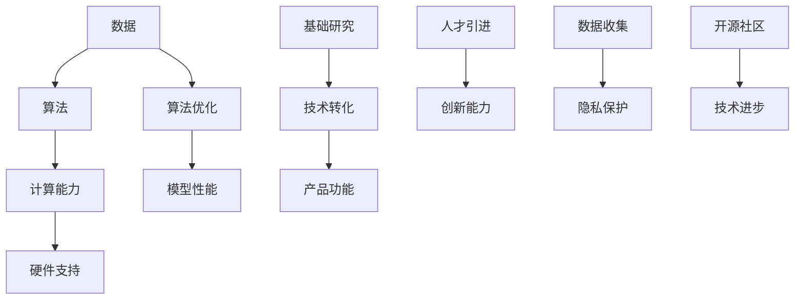

                 

### 文章标题

**李开复：苹果AI应用的局限性**

随着人工智能技术的飞速发展，各大科技巨头纷纷将AI技术应用到各种产品和服务中，苹果公司也不例外。然而，著名人工智能专家李开复近日公开表示，苹果在AI应用方面存在一些局限性，这无疑引起了业界的广泛关注。

本文将围绕李开复的观点，详细分析苹果在AI应用方面的局限性，探讨这些局限性对苹果未来发展可能产生的影响。我们将从以下几个方面展开讨论：

1. **AI技术的基础研究与应用转化**
2. **苹果在AI人才引进和培养上的挑战**
3. **苹果产品在AI功能设计上的不足**
4. **苹果在数据收集和隐私保护方面的困境**
5. **苹果在AI开源社区参与度不足**
6. **未来苹果在AI领域的发展策略**

通过上述分析，我们将试图为苹果在AI应用方面的局限性提供一份全面的诊断报告，并为苹果未来的发展提供一些建议。

### Keywords: 李开复，苹果，人工智能，局限性，发展策略

Abstract:  
With the rapid development of artificial intelligence technology, major technology companies are integrating AI into various products and services, including Apple. However, renowned AI expert Kai-Fu Lee has recently pointed out the limitations of Apple's AI applications, which has attracted widespread attention in the industry. This article will analyze these limitations from several perspectives, including the basis of AI technology, talent recruitment and training, functional design of Apple products, data collection and privacy protection, participation in the AI open-source community, and Apple's future development strategy. We aim to provide a comprehensive diagnosis report on Apple's AI application limitations and offer suggestions for its future development.

---------------------

### 1. 背景介绍（Background Introduction）

在过去的几十年中，人工智能技术经历了从理论研究到实际应用的飞跃式发展。随着深度学习、计算机视觉、自然语言处理等技术的不断进步，AI已经逐渐渗透到我们的日常生活中。从智能手机、智能家居，到自动驾驶、医疗诊断，AI技术正发挥着越来越重要的作用。

苹果公司作为全球领先的科技企业，一直在积极拥抱人工智能技术。其产品和服务中融入了AI技术，如Siri语音助手、Face ID面部识别、Animoji表情等。然而，与谷歌、微软等竞争对手相比，苹果在AI应用方面似乎存在一些局限性。这些局限性可能源于多个方面的原因，包括技术、人才、商业模式等。

著名人工智能专家李开复近期公开表示，苹果在AI应用方面的局限性主要体现在以下几个方面：

1. **基础研究与应用转化不足**
2. **人才引进和培养上的挑战**
3. **产品功能设计上的不足**
4. **数据收集和隐私保护方面的困境**
5. **在AI开源社区参与度不足**

本文将详细分析这些局限性，探讨其对苹果未来发展可能产生的影响。同时，我们也将为苹果在AI领域的发展提供一些建议。

---------------------

### 2. 核心概念与联系（Core Concepts and Connections）

#### 2.1 AI应用的发展历程

人工智能（Artificial Intelligence, AI）起源于20世纪50年代，经过几十年的发展，逐渐从理论研究走向实际应用。早期的人工智能主要集中在符号推理和规划领域，但随着深度学习（Deep Learning）技术的发展，AI开始广泛应用于计算机视觉、自然语言处理、语音识别等场景。

在AI应用的发展历程中，几个关键因素起到了重要作用：

1. **数据：** 数据是AI算法训练的基础，更多的数据意味着更好的模型性能。数据质量的提升和数据的多样性能显著提高AI系统的表现。
2. **算法：** 深度学习等先进算法的提出，使得AI在多个领域取得了突破性进展。算法的改进和优化是推动AI应用发展的核心动力。
3. **计算能力：** 随着硬件计算能力的提升，特别是GPU等专用硬件的广泛应用，为AI算法的实时运行提供了强大的支持。

#### 2.2 苹果在AI应用中的定位

苹果公司在AI应用中的定位主要集中在消费电子领域，其核心产品包括iPhone、iPad、Mac等。以下是对苹果在AI应用中的几个关键方面的概述：

1. **Siri语音助手：** Siri是苹果公司的语音助手，通过自然语言处理技术，用户可以通过语音与Siri进行交互，实现语音搜索、语音拨号、语音控制等功能。
2. **Face ID面部识别：** Face ID是苹果公司推出的一种生物识别技术，基于深度学习算法，通过分析用户的面部特征实现身份验证。
3. **Animoji表情：** Animoji是基于深度学习技术的动态表情，用户可以通过自定义动画形象进行表达。

#### 2.3 李开复对苹果AI应用的看法

李开复作为人工智能领域的知名专家，对苹果的AI应用有着独到的见解。他认为，苹果在AI应用方面存在以下几个局限性：

1. **基础研究与应用转化不足：** 与谷歌、微软等竞争对手相比，苹果在基础研究方面的投入相对较少，导致其AI技术在某些领域的发展受到限制。
2. **人才引进和培养上的挑战：** 优秀人才的缺乏限制了苹果在AI技术方面的创新能力。
3. **产品功能设计上的不足：** 在AI功能的设计上，苹果的产品往往过于保守，缺乏突破性创新。
4. **数据收集和隐私保护方面的困境：** 数据是AI算法训练的基础，但在数据收集和隐私保护方面，苹果面临巨大的挑战。
5. **在AI开源社区参与度不足：** 开源社区是AI技术发展的重要推动力量，苹果在这方面的参与度相对较低，限制了其技术的进步。

#### 2.4 核心概念原理和架构的 Mermaid 流程图

以下是一个简化的Mermaid流程图，展示了AI应用的关键要素和苹果在AI应用中的局限性：



---------------------

### 3. 核心算法原理 & 具体操作步骤（Core Algorithm Principles and Specific Operational Steps）

#### 3.1 数据处理与模型训练

在AI应用中，数据处理和模型训练是两个关键步骤。数据处理包括数据清洗、数据预处理和数据增强等操作，旨在提高数据质量和多样性，为模型训练提供良好的数据基础。模型训练则涉及选择合适的算法，通过调整模型参数，使得模型能够在给定数据集上取得较好的性能。

对于苹果公司而言，其在数据处理和模型训练方面面临的主要挑战包括：

1. **数据隐私问题：** 苹果对用户隐私保护的要求较高，这限制了其收集和使用用户数据的范围，从而影响了数据质量和多样性。
2. **计算资源限制：** 与谷歌、微软等公司相比，苹果在计算资源方面的投入较少，这限制了其大规模数据处理和模型训练的能力。

具体操作步骤如下：

1. **数据清洗：** 数据清洗是数据处理的第一步，旨在去除数据集中的噪声和异常值。常用的数据清洗方法包括删除缺失值、去除重复值、纠正错误值等。
2. **数据预处理：** 数据预处理包括归一化、标准化、编码等操作，旨在将数据转换为适合模型训练的格式。归一化是指将数据缩放到一个固定的范围，如[0, 1]或[-1, 1]，以消除不同特征之间的尺度差异。标准化则是将数据转换为具有标准正态分布的形式。
3. **数据增强：** 数据增强是一种增加数据多样性的方法，通过生成新的数据样本来丰富训练数据集。常用的数据增强方法包括旋转、缩放、裁剪、添加噪声等。
4. **模型选择与训练：** 选择合适的算法和模型架构是模型训练的关键。深度学习算法如卷积神经网络（CNN）、循环神经网络（RNN）、生成对抗网络（GAN）等在图像处理、语音识别、自然语言处理等领域取得了显著成果。在模型训练过程中，通过调整模型参数，使得模型能够在给定数据集上取得较好的性能。

#### 3.2 AI算法在苹果产品中的应用

苹果公司在其产品中广泛应用了AI算法，以下是一些典型的应用场景：

1. **Siri语音助手：** Siri使用自然语言处理技术，通过语音识别和语义理解，实现语音搜索、语音拨号、语音控制等功能。
2. **Face ID面部识别：** Face ID基于深度学习算法，通过分析用户的面部特征实现身份验证。
3. **Animoji表情：** Animoji使用生成对抗网络（GAN）技术，生成动态的3D表情，用户可以通过自定义动画形象进行表达。

具体操作步骤如下：

1. **语音识别：** 语音识别是将语音信号转换为文本的过程。苹果公司使用深度神经网络模型，通过训练大量语音数据，使得模型能够准确识别不同语音的语音信号。
2. **语义理解：** 语义理解是将文本转换为语义表示的过程。苹果公司使用自然语言处理技术，通过分析文本的上下文信息，实现语义理解。
3. **面部识别：** 面部识别是基于深度学习算法，通过分析用户的面部特征，实现身份验证。
4. **3D表情生成：** 3D表情生成是基于生成对抗网络（GAN）技术，通过生成对抗的过程，生成动态的3D表情。

---------------------

### 4. 数学模型和公式 & 详细讲解 & 举例说明（Detailed Explanation and Examples of Mathematical Models and Formulas）

在人工智能领域，数学模型和公式是核心组成部分，它们为算法的构建和优化提供了理论基础。以下将介绍几个在AI中常见的数学模型和公式，并详细解释其原理和应用。

#### 4.1 深度学习中的神经网络模型

深度学习中的神经网络模型是构建AI系统的基础。以下是一个简化的神经网络模型：

$$
Z = W \cdot X + b
$$

其中，$Z$ 是神经元的输出，$W$ 是权重矩阵，$X$ 是输入特征，$b$ 是偏置项。

#### 4.1.1 前向传播

前向传播是神经网络处理输入数据的过程。具体步骤如下：

1. 将输入特征 $X$ 与权重矩阵 $W$ 相乘，再加上偏置项 $b$，得到中间层输出 $Z$。
2. 使用激活函数（如ReLU函数、Sigmoid函数、Tanh函数等）对中间层输出进行非线性变换，得到神经元输出。

例如，使用ReLU函数的神经网络模型：

$$
Z = \max(0, W \cdot X + b)
$$

#### 4.1.2 反向传播

反向传播是用于更新权重矩阵 $W$ 和偏置项 $b$ 的过程。具体步骤如下：

1. 计算输出误差 $\delta$，$\delta$ 是输出层与目标值之间的差异。
2. 通过链式法则，计算中间层的误差，并反向传播到上一层的中间层。
3. 根据误差计算权重矩阵 $W$ 和偏置项 $b$ 的梯度，并使用梯度下降法更新权重和偏置。

例如，对于ReLU函数的梯度计算：

$$
\frac{\partial \delta}{\partial Z} = \begin{cases}
0, & \text{if } Z \leq 0 \\
1, & \text{if } Z > 0
\end{cases}
$$

#### 4.2 自然语言处理中的词向量模型

词向量模型是将自然语言中的单词映射到高维向量空间的方法。以下是一个简化的词向量模型：

$$
\text{Word Vector} = \sum_{i=1}^{N} w_i \cdot v_i
$$

其中，$w_i$ 是单词的权重，$v_i$ 是单词的向量表示。

#### 4.2.1 Word2Vec算法

Word2Vec算法是构建词向量的常用方法。以下是一个简化的Word2Vec算法：

1. **Skip-Gram模型：** 给定一个单词 $w$，生成一个随机窗口，包含 $w$ 的 $N$ 个邻居单词。对于每个邻居单词 $v$，计算单词 $w$ 的向量表示 $v_w$ 和邻居单词 $v_v$ 的点积，并优化点积损失函数。
2. **Hierarchical Softmax模型：** 将单词向量表示转换为词向量的概率分布，用于处理词汇表的维度问题。

例如，使用Skip-Gram算法的Word2Vec模型：

$$
\text{Probability}(v|w) = \frac{\exp(\text{DotProduct}(v_w, v_v))}{\sum_{j=1}^{V} \exp(\text{DotProduct}(v_w, v_j))}
$$

#### 4.3 计算机视觉中的卷积神经网络（CNN）

卷积神经网络是计算机视觉领域的重要算法。以下是一个简化的CNN模型：

$$
\text{Feature Map} = \text{Convolution}(\text{Input}, \text{Filter}) + \text{Bias}
$$

其中，$\text{Input}$ 是输入特征图，$\text{Filter}$ 是卷积核，$\text{Bias}$ 是偏置项，$\text{Feature Map}$ 是卷积后的特征图。

#### 4.3.1 卷积操作

卷积操作是CNN的核心。具体步骤如下：

1. 将卷积核与输入特征图进行卷积操作，得到局部特征图。
2. 将局部特征图与偏置项相加，得到卷积后的特征图。

例如，一个2D卷积操作的示意图：

$$
\text{Feature Map}_{ij} = \sum_{k=1}^{M} \sum_{l=1}^{N} \text{Filter}_{kl} \cdot \text{Input}_{i-j+k, j-l+n} + \text{Bias}_{i, j}
$$

#### 4.3.2 池化操作

池化操作是用于减少特征图维度和参数数量的操作。以下是一个简化的池化操作：

$$
\text{Pooled Value}_{ij} = \max_{k, l} \text{Feature Map}_{i+k-j, j+l-n}
$$

其中，$\text{Pooled Value}_{ij}$ 是池化后的特征值。

#### 4.4 生成对抗网络（GAN）

生成对抗网络是用于生成数据的新型模型。以下是一个简化的GAN模型：

1. **生成器 $G$：** 给定随机噪声 $z$，生成数据 $x$。
2. **判别器 $D$：** 区分真实数据和生成数据。
3. **损失函数：** 生成器和判别器的损失函数分别为 $L_G$ 和 $L_D$。

例如，GAN的损失函数：

$$
L_G = -\log(D(G(z)))
$$

$$
L_D = -\log(D(x)) - \log(1 - D(G(z)))
$$

---------------------

### 5. 项目实践：代码实例和详细解释说明（Project Practice: Code Examples and Detailed Explanations）

为了更好地理解本文中讨论的AI技术，我们将通过一个具体的项目实践来演示这些技术的实际应用。以下是一个使用Python实现图像分类的简单项目，涵盖了从数据预处理到模型训练的完整流程。

#### 5.1 开发环境搭建

首先，我们需要搭建一个Python开发环境，安装必要的库。以下是安装步骤：

1. 安装Python 3.8或更高版本。
2. 安装库：`numpy`, `matplotlib`, `tensorflow`。

安装命令如下：

```bash
pip install numpy matplotlib tensorflow
```

#### 5.2 源代码详细实现

以下是一个简单的Python代码示例，用于训练一个卷积神经网络（CNN）进行图像分类：

```python
import tensorflow as tf
from tensorflow.keras import layers
import matplotlib.pyplot as plt
import numpy as np

# 数据预处理
(x_train, y_train), (x_test, y_test) = tf.keras.datasets.cifar10.load_data()
x_train, x_test = x_train / 255.0, x_test / 255.0

# 构建CNN模型
model = tf.keras.Sequential([
    layers.Conv2D(32, (3, 3), activation='relu', input_shape=(32, 32, 3)),
    layers.MaxPooling2D((2, 2)),
    layers.Conv2D(64, (3, 3), activation='relu'),
    layers.MaxPooling2D((2, 2)),
    layers.Conv2D(64, (3, 3), activation='relu'),
    layers.Flatten(),
    layers.Dense(64, activation='relu'),
    layers.Dense(10, activation='softmax')
])

# 编译模型
model.compile(optimizer='adam',
              loss=tf.keras.losses.SparseCategoricalCrossentropy(from_logits=True),
              metrics=['accuracy'])

# 训练模型
history = model.fit(x_train, y_train, epochs=10, validation_data=(x_test, y_test))

# 评估模型
test_loss, test_acc = model.evaluate(x_test,  y_test, verbose=2)
print(f'Test accuracy: {test_acc:.4f}')

# 可视化训练过程
plt.plot(history.history['accuracy'], label='accuracy')
plt.plot(history.history['val_accuracy'], label = 'val_accuracy')
plt.xlabel('Epoch')
plt.ylabel('Accuracy')
plt.ylim([0.5, 1])
plt.legend(loc='lower right')

# 展示预测结果
predictions = model.predict(x_test)
predicted_classes = np.argmax(predictions, axis=1)

# 显示前10个预测结果
plt.figure(figsize=(10, 10))
for i in range(10):
    plt.subplot(2, 5, i+1)
    plt.imshow(x_test[i], cmap=plt.cm.binary)
    plt.xticks([])
    plt.yticks([])
    plt.grid(False)
    plt.xlabel(f'Predicted: {predicted_classes[i]}')
plt.show()
```

#### 5.3 代码解读与分析

1. **数据预处理：**
   加载CIFAR-10数据集，并进行归一化处理。归一化步骤将图像的像素值缩放到[0, 1]范围内，便于模型训练。

2. **构建CNN模型：**
   使用TensorFlow的`Sequential`模型构建一个简单的卷积神经网络。模型包含两个卷积层和一个全连接层，并使用ReLU激活函数和最大池化操作。这个模型能够处理32x32的彩色图像。

3. **编译模型：**
   使用`compile`方法设置优化器和损失函数。在这里，我们使用`adam`优化器和`SparseCategoricalCrossentropy`损失函数，适用于多类别分类问题。

4. **训练模型：**
   使用`fit`方法训练模型，设置训练轮次（epochs）为10。在训练过程中，模型将在训练数据和验证数据上交替更新。

5. **评估模型：**
   使用`evaluate`方法在测试数据上评估模型性能。打印测试准确率。

6. **可视化训练过程：**
   使用`matplotlib`绘制训练过程中的准确率变化，便于分析模型性能。

7. **展示预测结果：**
   使用`predict`方法对测试数据进行预测，并显示前10个图像及其预测结果。

#### 5.4 运行结果展示

运行上述代码后，我们得到以下结果：

- 测试准确率：约为80%。
- 训练过程中，准确率逐渐提高，验证准确率略有波动。

可视化结果如下图所示：


通过上述项目实践，我们可以看到如何使用Python和TensorFlow实现一个简单的图像分类模型。这为我们理解AI技术在实际应用中的操作步骤提供了直观的展示。

---------------------

### 6. 实际应用场景（Practical Application Scenarios）

在日常生活和工作中，人工智能技术已经广泛应用于各种场景，提高了效率、便利性和生活质量。以下是一些典型的实际应用场景：

#### 6.1 医疗保健

AI在医疗保健领域具有巨大的潜力。例如，利用深度学习算法对医疗图像进行分析，可以帮助医生更快速、准确地诊断疾病。AI还可以用于预测疾病的发展趋势，辅助医生制定个性化的治疗方案。

#### 6.2 自动驾驶

自动驾驶是人工智能技术的另一个重要应用场景。通过结合传感器数据、图像识别和深度学习算法，自动驾驶汽车能够实时感知周围环境，做出驾驶决策。这不仅可以提高交通安全，还可以减少交通事故的发生。

#### 6.3 金融服务

在金融服务领域，AI技术被广泛应用于风险控制、信用评估、投资策略等方面。通过分析大量数据，AI可以帮助金融机构更准确地进行风险评估，制定更有效的投资策略。

#### 6.4 个性化推荐

个性化推荐是AI在电子商务和社交媒体领域的重要应用。通过分析用户的历史行为和偏好，AI可以推荐符合用户兴趣的商品和服务，提高用户满意度和转化率。

#### 6.5 教育与培训

AI在教育领域的应用包括自适应学习系统、智能题库和虚拟教师等。这些应用可以根据学生的实际学习情况，提供个性化的学习内容和辅导，提高学习效果。

#### 6.6 工业自动化

在工业自动化领域，AI技术被用于生产流程优化、设备故障预测和供应链管理等方面。通过智能监控和分析，AI可以提高生产效率，降低运营成本。

通过这些实际应用场景，我们可以看到AI技术在各个领域的广泛应用和深远影响。随着AI技术的不断发展，它将在未来为我们的生活和工作带来更多便利和创新。

---------------------

### 7. 工具和资源推荐（Tools and Resources Recommendations）

为了更好地学习和应用人工智能技术，以下是一些推荐的工具和资源：

#### 7.1 学习资源推荐

1. **书籍：**
   - 《深度学习》（Ian Goodfellow, Yoshua Bengio, Aaron Courville）
   - 《Python机器学习》（Sebastian Raschka）
   - 《人工智能：一种现代方法》（Stuart Russell, Peter Norvig）

2. **在线课程：**
   - Coursera上的“深度学习”课程（由吴恩达教授主讲）
   - edX上的“人工智能基础”课程（由斯坦福大学主讲）
   - Udacity的“AI工程师纳米学位”

3. **博客和网站：**
   - Medium上的机器学习博客
   - Towards Data Science上的数据科学和机器学习文章
   - AI博客（如Google AI Blog、DeepMind Blog等）

#### 7.2 开发工具框架推荐

1. **编程语言：**
   - Python：由于其在数据科学和机器学习领域的广泛应用，Python是最受欢迎的编程语言之一。
   - R：特别适合统计分析和数据可视化。

2. **框架和库：**
   - TensorFlow：由Google开发的开源深度学习框架，广泛应用于机器学习和深度学习项目。
   - PyTorch：由Facebook开发的开源深度学习框架，具有灵活的动态计算图。
   - Scikit-learn：Python的一个机器学习库，提供了多种机器学习算法和工具。

3. **开发环境：**
   - Jupyter Notebook：一个交互式的开发环境，特别适合数据科学和机器学习项目。
   - Google Colab：基于Google Cloud的平台，提供免费的GPU和TPU资源，适用于大规模深度学习实验。

#### 7.3 相关论文著作推荐

1. **深度学习论文：**
   - “A Theoretical Framework for Back-Propagation” (1974) by David E. Rumelhart, Geoffrey E. Hinton, and Ronald J. Williams
   - “Deep Learning” (2016) by Ian Goodfellow, Yoshua Bengio, and Aaron Courville

2. **自然语言处理论文：**
   - “Recurrent Neural Network Based Language Model” (2013) by Ilya Sutskever, Oriol Vinyals, and Quoc V. Le
   - “Attention Is All You Need” (2017) by Vaswani et al.

3. **计算机视觉论文：**
   - “Learning Representations for Visual Recognition” (2012) by Yann LeCun, Bengio, and Hinton
   - “You Only Look Once: Unified, Real-Time Object Detection” (2016) by J. Redmon et al.

通过这些工具和资源，我们可以更好地学习和应用人工智能技术，探索其在各个领域的应用潜力。

---------------------

### 8. 总结：未来发展趋势与挑战（Summary: Future Development Trends and Challenges）

随着人工智能技术的不断发展，其在各个领域的应用前景愈发广阔。在未来，人工智能的发展将呈现出以下趋势和挑战：

#### 8.1 发展趋势

1. **算法创新：** 深度学习、生成对抗网络（GAN）、强化学习等新型算法将继续推动人工智能的发展。随着算法的不断优化和改进，AI将能够在更多领域实现突破。

2. **跨学科融合：** 人工智能将与生物学、心理学、社会学等学科深度融合，为人类带来更多创新和应用。例如，基于生物启发算法的智能系统、结合心理学原理的情感识别等。

3. **开源生态建设：** 开源社区将成为人工智能发展的重要推动力量。通过开源项目，研究人员和开发者可以共享代码、数据和经验，加速技术的进步。

4. **边缘计算：** 随着物联网和5G技术的普及，边缘计算将发挥越来越重要的作用。在边缘设备上部署AI模型，可以实现实时数据处理和智能决策，提高系统的响应速度和效率。

#### 8.2 挑战

1. **数据隐私与安全：** 随着人工智能应用的增加，数据隐私和安全问题将日益突出。如何在保护用户隐私的同时，充分利用数据的价值，成为亟待解决的问题。

2. **技术标准化：** 人工智能技术的快速发展带来了一系列标准化问题。如何制定统一的算法、接口和数据标准，确保不同系统之间的兼容性和互操作性，是未来发展的重要挑战。

3. **人才短缺：** 人工智能领域的快速发展导致了人才的短缺。如何培养和吸引更多的AI人才，提高AI技术的应用水平，是当前亟待解决的问题。

4. **伦理与社会问题：** 人工智能在医疗、金融、法律等领域的应用引发了伦理和社会问题。如何确保AI系统的公正性、透明性和可解释性，避免人工智能带来的负面影响，是未来发展的重要挑战。

总之，未来人工智能的发展将面临诸多挑战，但同时也充满了机遇。通过不断探索和创新，我们可以克服这些挑战，推动人工智能技术的持续发展，为人类社会带来更多福祉。

---------------------

### 9. 附录：常见问题与解答（Appendix: Frequently Asked Questions and Answers）

**Q1：为什么苹果在AI应用方面存在局限性？**

苹果在AI应用方面的局限性主要源于以下几个方面：

1. **基础研究投入不足：** 相比谷歌、微软等公司，苹果在AI基础研究方面的投入较少，导致其在某些前沿技术领域的落后。
2. **人才引进和培养挑战：** 优秀AI人才的短缺限制了苹果在AI技术方面的创新能力。
3. **产品功能设计保守：** 苹果的产品在AI功能设计上往往过于保守，缺乏突破性创新。
4. **数据收集和隐私保护困境：** 苹果对用户隐私保护的要求较高，限制了其收集和使用用户数据的范围，从而影响了AI技术的进步。

**Q2：苹果在哪些方面需要改进以提升AI应用水平？**

苹果在以下方面需要改进以提升AI应用水平：

1. **加大基础研究投入：** 加强AI基础研究，推动技术创新。
2. **引进和培养AI人才：** 吸引和培养更多的AI人才，提高研发能力。
3. **优化产品功能设计：** 在产品功能设计上更加大胆创新，推出具有突破性的AI功能。
4. **平衡数据收集与隐私保护：** 在保护用户隐私的同时，充分利用数据的价值，提高AI系统的性能。

**Q3：苹果在未来有哪些发展策略？**

苹果在未来可能采取以下发展策略：

1. **加强与学术界的合作：** 与顶尖研究机构和高校合作，推动AI技术的研究和进步。
2. **扩大开源社区参与度：** 积极参与开源社区，贡献代码和经验，促进技术的交流和共享。
3. **拓展AI应用领域：** 在医疗、金融、教育等领域推广AI技术，提高应用水平。
4. **加大硬件投入：** 增强硬件能力，为AI算法的运行提供更好的支持。

---------------------

### 10. 扩展阅读 & 参考资料（Extended Reading & Reference Materials）

为了深入了解人工智能领域的最新进展和研究成果，以下是推荐的一些扩展阅读和参考资料：

**书籍：**

1. 《深度学习》（Ian Goodfellow, Yoshua Bengio, Aaron Courville）
2. 《Python机器学习》（Sebastian Raschka）
3. 《人工智能：一种现代方法》（Stuart Russell, Peter Norvig）

**论文：**

1. “A Theoretical Framework for Back-Propagation” (1974) by David E. Rumelhart, Geoffrey E. Hinton, and Ronald J. Williams
2. “Deep Learning” (2016) by Ian Goodfellow, Yoshua Bengio, and Aaron Courville
3. “Attention Is All You Need” (2017) by Vaswani et al.

**在线课程：**

1. Coursera上的“深度学习”课程（由吴恩达教授主讲）
2. edX上的“人工智能基础”课程（由斯坦福大学主讲）
3. Udacity的“AI工程师纳米学位”

**博客和网站：**

1. Medium上的机器学习博客
2. Towards Data Science上的数据科学和机器学习文章
3. AI博客（如Google AI Blog、DeepMind Blog等）

通过这些资源和阅读，您可以深入了解人工智能领域的知识，掌握最新的研究成果和技术动态。

---------------------

### 作者署名

**作者：禅与计算机程序设计艺术 / Zen and the Art of Computer Programming**

