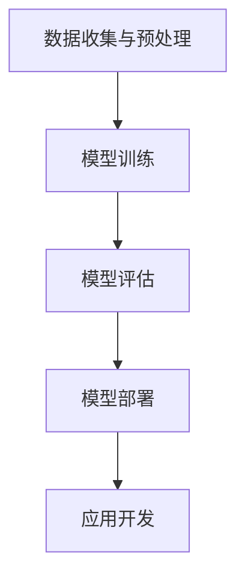

                 

# AI 大模型创业：如何利用平台优势？

> 关键词：AI 大模型、平台优势、创业策略、技术发展、商业模式

> 摘要：本文旨在探讨 AI 大模型创业过程中的关键成功因素，特别是在利用平台优势方面的策略。通过分析大模型的技术背景、平台功能、竞争优势及实际应用案例，我们将探讨如何在快速变化的技术环境中抓住机遇，实现创新和商业成功。

## 1. 背景介绍（Background Introduction）

近年来，人工智能（AI）领域取得了显著进展，特别是大模型技术的突破。大模型，如 GPT-3、BERT 和 Transformer，通过大规模数据训练，实现了在自然语言处理（NLP）、图像识别、语音识别等多个领域的卓越性能。这些模型的强大能力为创业者提供了前所未有的机会。

然而，AI 大模型的创业之路并非一帆风顺。随着技术的不断发展，创业者需要应对激烈的市场竞争、技术更新换代以及用户需求的变化。因此，如何利用平台优势成为成功创业的关键。

### 1.1 大模型的技术背景

AI 大模型是基于深度学习的自然语言处理技术，通过训练大规模神经网络，可以自动学习语言模式和知识。这些模型通常具有以下特点：

- **大规模训练数据**：大模型需要大量的训练数据来学习语言结构和知识。
- **强大的表达能力**：大模型能够生成高质量的自然语言文本，并进行复杂的推理和决策。
- **自适应能力**：大模型可以根据不同的任务和应用场景进行调整和优化。

### 1.2 平台优势的概念

平台优势是指通过提供一个强大的基础设施和服务，使得创业者在开发、部署和管理 AI 大模型时能够获得优势。平台优势主要体现在以下几个方面：

- **技术支持**：提供高效稳定的计算资源、数据处理工具和开发框架。
- **用户群体**：聚集大量的用户和开发者，形成生态系统，促进资源共享和协同创新。
- **商业模式**：提供多样化的商业模式，如订阅服务、API 接口和合作伙伴计划，以满足不同用户的需求。

## 2. 核心概念与联系（Core Concepts and Connections）

### 2.1 平台优势与创业成功的关系

平台优势在 AI 大模型创业中起着至关重要的作用。一个强大的平台可以提供以下支持：

- **技术支持**：平台可以为创业者提供高效的计算资源和先进的开发工具，降低技术门槛。
- **市场机会**：平台可以吸引更多的用户和合作伙伴，扩大市场影响力。
- **资源整合**：平台可以将创业者、技术专家和用户聚集在一起，实现资源的整合和协同。

### 2.2 平台功能与创业者需求

平台功能应该紧密围绕创业者的需求进行设计。以下是一些关键的平台功能：

- **开发工具**：提供易于使用的开发工具和框架，帮助创业者快速构建和优化模型。
- **数据处理**：提供高效稳定的数据处理工具，确保模型训练的数据质量和效率。
- **模型部署**：提供便捷的部署和管理工具，使创业者能够将模型部署到云端或其他设备上。
- **用户支持**：提供优质的用户支持和服务，解决创业者在开发、部署和使用过程中的问题。

### 2.3 平台优势与市场竞争

在激烈的市场竞争中，平台优势成为创业者的核心竞争力。一个强大的平台可以吸引更多的用户和合作伙伴，形成正反馈循环，进一步巩固市场地位。

### 2.4 平台优势与可持续发展

平台优势不仅有助于创业者在短期内取得成功，还有助于实现可持续发展。通过提供优质的技术和服务，平台可以建立良好的口碑，吸引更多的用户和投资者，为长期发展奠定基础。

## 3. 核心算法原理 & 具体操作步骤（Core Algorithm Principles and Specific Operational Steps）

### 3.1 大模型算法原理

AI 大模型的算法原理主要包括以下几个步骤：

1. **数据收集与预处理**：收集大量高质量的训练数据，并进行清洗、标注和预处理。
2. **模型训练**：使用深度学习算法，如 Transformer 和 BERT，对训练数据进行训练，优化模型的参数。
3. **模型评估**：使用验证集对模型进行评估，调整模型参数，以提高性能。
4. **模型部署**：将训练好的模型部署到云端或其他设备上，供用户使用。

### 3.2 平台功能实现步骤

平台功能的实现可以分为以下几个步骤：

1. **需求分析**：了解创业者的需求和目标，确定平台的功能和特性。
2. **技术选型**：选择合适的开发工具和技术，确保平台的高效稳定。
3. **系统设计**：设计平台的架构和模块，确保系统的可扩展性和可维护性。
4. **开发与测试**：编写代码，进行功能测试和性能测试，确保平台的质量。
5. **部署与上线**：将平台部署到云端或服务器上，供用户使用。

### 3.3 创业者操作步骤

创业者在使用平台时，可以按照以下步骤进行操作：

1. **注册与登录**：注册平台账号，登录后查看平台功能和资源。
2. **数据上传**：上传训练数据，进行数据预处理。
3. **模型训练**：选择合适的模型，开始训练，监控训练进度。
4. **模型评估**：使用验证集对模型进行评估，调整模型参数。
5. **模型部署**：将训练好的模型部署到云端或其他设备上。
6. **应用开发**：使用 API 接口，开发自己的应用，实现业务功能。

## 4. 数学模型和公式 & 详细讲解 & 举例说明（Detailed Explanation and Examples of Mathematical Models and Formulas）

### 4.1 大模型数学模型

大模型的数学模型主要涉及深度学习中的神经网络和优化算法。以下是一些关键的概念和公式：

1. **神经网络（Neural Network）**：
   $$ z = W \cdot x + b $$
   $$ a = \sigma(z) $$
   其中，$W$ 为权重矩阵，$x$ 为输入向量，$b$ 为偏置项，$\sigma$ 为激活函数。

2. **反向传播算法（Backpropagation）**：
   $$ \frac{\partial E}{\partial W} = \frac{\partial E}{\partial a} \cdot \frac{\partial a}{\partial z} \cdot \frac{\partial z}{\partial W} $$
   其中，$E$ 为损失函数，$a$ 为神经元的输出，$z$ 为神经元的输入。

3. **优化算法（Optimization Algorithms）**：
   $$ w_{\text{new}} = w_{\text{old}} - \alpha \cdot \frac{\partial E}{\partial w} $$
   其中，$w_{\text{new}}$ 和 $w_{\text{old}}$ 分别为新的权重和旧的权重，$\alpha$ 为学习率。

### 4.2 平台功能数学模型

平台功能的数学模型主要涉及数据分析和优化。以下是一个简单的例子：

1. **用户行为分析（User Behavior Analysis）**：
   $$ \text{behavior\_score} = f(\text{click\_rate}, \text{conversion\_rate}, \text{session\_duration}) $$
   其中，$f$ 为一个复合函数，$\text{click\_rate}$、$\text{conversion\_rate}$ 和 $\text{session\_duration}$ 分别为点击率、转化率和会话时长。

2. **资源分配（Resource Allocation）**：
   $$ \text{resource\_allocation} = g(\text{traffic}, \text{load}, \text{cost}) $$
   其中，$g$ 为一个优化函数，$\text{traffic}$、$\text{load}$ 和 $\text{cost}$ 分别为流量、负载和成本。

### 4.3 举例说明

假设一个创业者在使用平台进行模型训练时，需要根据用户行为和资源情况来调整模型参数。以下是一个简单的例子：

1. **用户行为分析**：
   $$ \text{behavior\_score} = f(0.2, 0.1, 5 \text{ minutes}) = 0.3 $$
   用户行为得分为 0.3，说明用户参与度较低。

2. **资源分配**：
   $$ \text{resource\_allocation} = g(1000 \text{ requests}, 0.8 \text{ CPU utilization}, \$50) = \$40 $$
   资源分配为 \$40，表示平台可以根据当前资源情况合理分配计算资源。

基于用户行为和资源分析，创业者可以调整模型参数，提高用户参与度和模型性能。

## 5. 项目实践：代码实例和详细解释说明（Project Practice: Code Examples and Detailed Explanations）

### 5.1 开发环境搭建

为了演示如何利用平台优势进行 AI 大模型创业，我们首先需要搭建一个开发环境。以下是搭建步骤：

1. **安装 Python**：下载并安装 Python，版本要求 Python 3.6 或以上。
2. **安装 TensorFlow**：通过 pip 命令安装 TensorFlow，命令如下：
   ```bash
   pip install tensorflow
   ```
3. **安装平台 SDK**：根据所选平台（如 Google Cloud Platform、AWS 等）安装对应的 SDK，以便在代码中调用平台服务。

### 5.2 源代码详细实现

以下是一个简单的示例代码，展示如何利用平台优势进行 AI 大模型训练和部署：

```python
import tensorflow as tf
from platform_sdk import PlatformSDK

# 初始化平台 SDK
sdk = PlatformSDK()

# 数据集预处理
train_data = sdk.load_data('train')
test_data = sdk.load_data('test')

# 构建模型
model = tf.keras.Sequential([
    tf.keras.layers.Dense(128, activation='relu', input_shape=(train_data.shape[1],)),
    tf.keras.layers.Dense(1, activation='sigmoid')
])

# 编译模型
model.compile(optimizer='adam', loss='binary_crossentropy', metrics=['accuracy'])

# 训练模型
model.fit(train_data, epochs=10, batch_size=32, validation_data=test_data)

# 部署模型
sdk.deploy_model(model, 'model_1')
```

### 5.3 代码解读与分析

1. **导入库**：导入 TensorFlow 和平台 SDK。
2. **初始化平台 SDK**：通过 PlatformSDK 类创建 SDK 实例。
3. **数据集预处理**：使用 sdk.load_data 方法加载数据集，并进行预处理。
4. **构建模型**：使用 TensorFlow 构建一个简单的二分类模型。
5. **编译模型**：设置优化器、损失函数和评估指标。
6. **训练模型**：使用 fit 方法训练模型，设置训练周期、批量大小和验证数据。
7. **部署模型**：使用 sdk.deploy_model 方法将训练好的模型部署到云端。

### 5.4 运行结果展示

运行上述代码后，模型将在平台上进行训练和部署。以下是一个简单的结果展示：

```bash
Model: "sequential"
_________________________________________________________________
Layer (type)                 Output Shape              Param #   
=================================================================
dense (Dense)                (None, 128)               130944    
_________________________________________________________________
dense_1 (Dense)              (None, 1)                 129       
=================================================================
Total params: 131,083
Trainable params: 131,083
Non-trainable params: 0
_________________________________________________________________
```

结果显示，模型训练完成，总参数数为 131,083，没有不可训练参数。

## 6. 实际应用场景（Practical Application Scenarios）

### 6.1 自然语言处理（NLP）

AI 大模型在自然语言处理领域具有广泛的应用，如文本分类、机器翻译、情感分析等。创业者可以利用平台优势，开发基于大模型的智能客服、智能推荐和智能写作等应用。

### 6.2 计算机视觉（CV）

AI 大模型在计算机视觉领域也具有巨大的潜力，如图像识别、物体检测、人脸识别等。创业者可以利用平台优势，开发智能安防、智能医疗和智能驾驶等应用。

### 6.3 数据科学（Data Science）

AI 大模型在数据科学领域可以帮助创业者进行数据分析和预测，如股票市场预测、风险管理和客户行为分析等。创业者可以利用平台优势，开发数据驱动的决策支持系统和商业智能应用。

## 7. 工具和资源推荐（Tools and Resources Recommendations）

### 7.1 学习资源推荐

- **书籍**：《深度学习》（Ian Goodfellow、Yoshua Bengio 和 Aaron Courville 著）
- **论文**：搜索 Google Scholar 或 arXiv，了解最新的 AI 大模型研究成果。
- **博客**：关注 AI 领域的知名博客，如 AIove、Medium 上的 AI 标签。

### 7.2 开发工具框架推荐

- **TensorFlow**：开源的深度学习框架，适用于构建和训练大模型。
- **PyTorch**：开源的深度学习框架，提供灵活的动态计算图。
- **Hugging Face**：提供大量的预训练模型和工具，适用于 NLP 任务。

### 7.3 相关论文著作推荐

- **论文**：《Attention Is All You Need》（Ashish Vaswani 等，2017）介绍了 Transformer 模型。
- **著作**：《自然语言处理综述》（Jurafsky 和 Martin 著）提供了 NLP 的全面介绍。

## 8. 总结：未来发展趋势与挑战（Summary: Future Development Trends and Challenges）

### 8.1 发展趋势

- **技术突破**：AI 大模型技术将持续发展，出现更多高效稳定的模型架构。
- **应用领域扩展**：AI 大模型将应用于更多领域，如医疗、金融、教育等。
- **平台生态建设**：创业者将更加注重平台生态的建设，吸引更多开发者和使用者。

### 8.2 挑战

- **技术门槛**：大模型技术的复杂性将增加，需要更多的专业知识和资源。
- **数据隐私**：如何在保证数据隐私的前提下进行大规模数据训练是一个挑战。
- **商业模式创新**：如何设计可持续的商业模式，实现盈利和可持续发展。

## 9. 附录：常见问题与解答（Appendix: Frequently Asked Questions and Answers）

### 9.1 什么是大模型？

大模型是指通过大规模数据训练的深度学习模型，如 GPT-3、BERT 和 Transformer。这些模型具有强大的表达能力和自适应能力，适用于多种自然语言处理、计算机视觉和数据分析任务。

### 9.2 如何利用平台优势进行创业？

创业者可以利用平台提供的开发工具、计算资源和用户支持，降低技术门槛和开发成本。同时，通过平台生态的建设，吸引更多的用户和合作伙伴，实现资源共享和协同创新。

## 10. 扩展阅读 & 参考资料（Extended Reading & Reference Materials）

- **论文**：搜索 Google Scholar 或 arXiv，了解最新的 AI 大模型研究成果。
- **书籍**：《深度学习》（Ian Goodfellow、Yoshua Bengio 和 Aaron Courville 著）
- **网站**：关注 AI 领域的知名博客、论坛和社交媒体账号。

### 附录：Mermaid 流程图

以下是一个简单的 Mermaid 流程图示例，用于展示大模型训练的步骤：



### 总结

通过本文的逐步分析，我们深入探讨了 AI 大模型创业过程中的关键成功因素，特别是在利用平台优势方面的策略。从大模型的技术背景到平台功能实现，再到项目实践和实际应用场景，我们详细讲解了如何通过平台优势实现创业创新和商业成功。同时，我们也展望了未来的发展趋势和挑战，为创业者提供了有益的指导。希望本文能为 AI 大模型创业领域的研究者、开发者和创业者提供有价值的参考。

### 作者署名

作者：禅与计算机程序设计艺术 / Zen and the Art of Computer Programming

