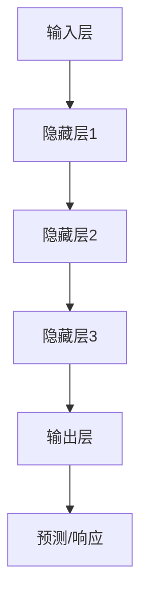
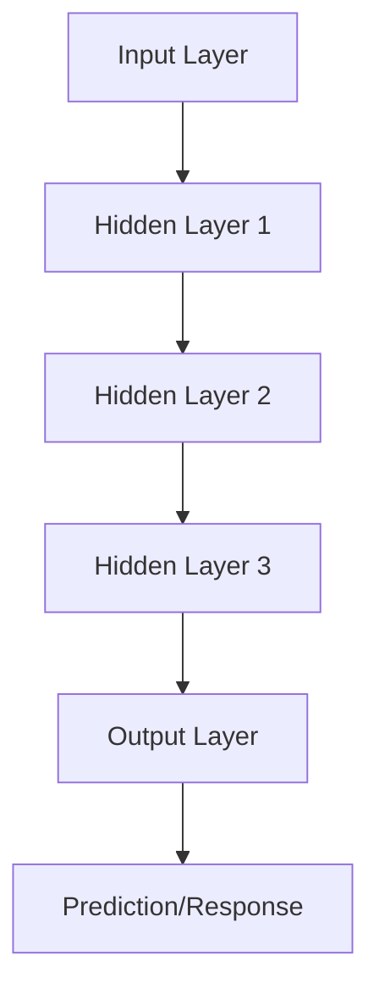
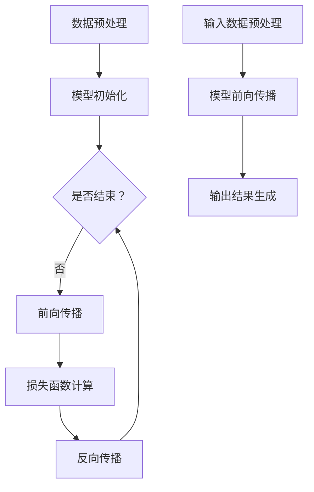
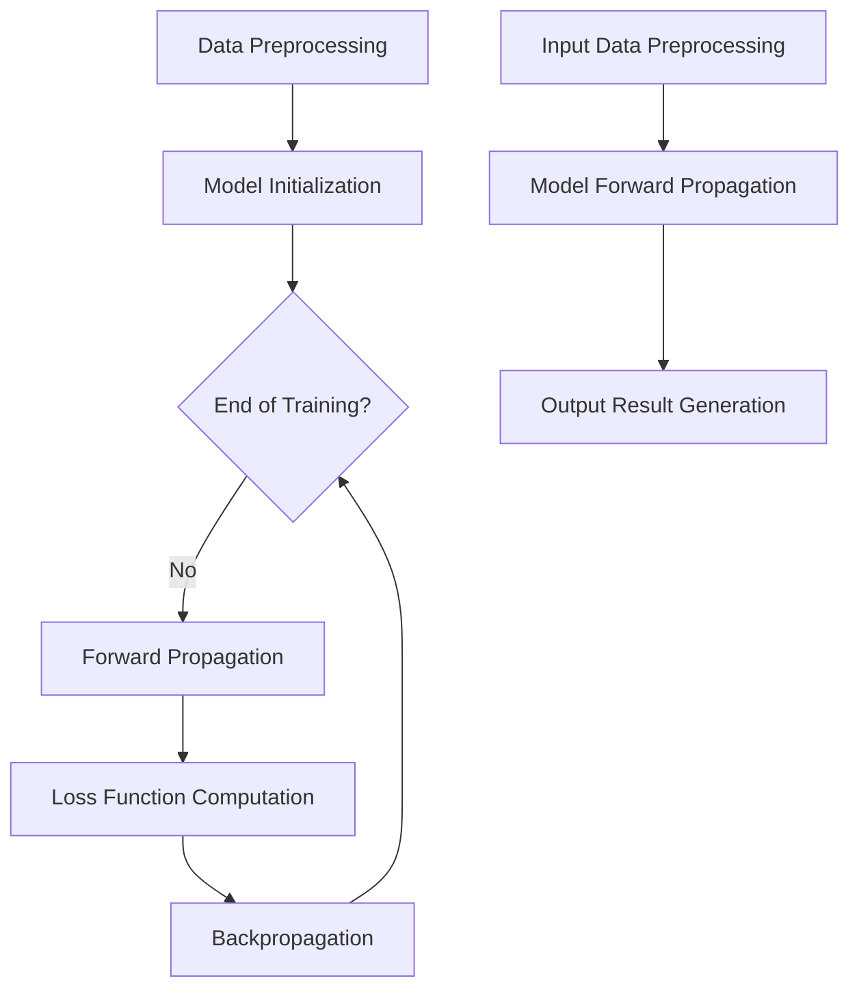

                 

### 背景介绍（Background Introduction）

在当今快速发展的技术环境中，人工智能（AI）大模型，如ChatGPT，正在成为创新和创业的重要驱动力。这些大模型通过学习海量的数据，能够生成高质量的文本、图像和其他形式的内容，为各种行业提供了前所未有的解决方案。然而，尽管其潜力巨大，AI大模型的创业仍然面临着一系列独特的挑战和机遇。

本文旨在探讨如何利用AI大模型的优势进行创业。我们将首先介绍AI大模型的基本原理，包括它们的工作机制、关键组件和现有技术。接着，我们会详细讨论AI大模型在创业中的应用场景，如何通过技术优势实现商业价值。最后，我们将探讨创业过程中可能遇到的挑战，并提出一些建议和最佳实践。

我们的讨论将围绕以下几个核心部分展开：

1. **背景介绍（Background Introduction）**：概述AI大模型的发展历程和现状。
2. **核心概念与联系（Core Concepts and Connections）**：详细解释AI大模型的基本概念、架构和关键技术。
3. **核心算法原理 & 具体操作步骤（Core Algorithm Principles and Specific Operational Steps）**：深入探讨AI大模型的训练和推理过程。
4. **数学模型和公式 & 详细讲解 & 举例说明（Detailed Explanation and Examples of Mathematical Models and Formulas）**：介绍用于优化AI大模型性能的数学工具和公式。
5. **项目实践：代码实例和详细解释说明（Project Practice: Code Examples and Detailed Explanations）**：通过实际项目展示如何实现AI大模型创业。
6. **实际应用场景（Practical Application Scenarios）**：探讨AI大模型在不同领域的应用。
7. **工具和资源推荐（Tools and Resources Recommendations）**：推荐有用的工具、资源和学习材料。
8. **总结：未来发展趋势与挑战（Summary: Future Development Trends and Challenges）**：分析AI大模型创业的未来趋势和挑战。
9. **附录：常见问题与解答（Appendix: Frequently Asked Questions and Answers）**：回答读者可能关心的问题。
10. **扩展阅读 & 参考资料（Extended Reading & Reference Materials）**：提供进一步阅读的资源。

通过逐步分析这些内容，我们将深入理解AI大模型创业的方方面面，并为其成功提供实际指导。

### The Background Introduction

In today's rapidly evolving technological landscape, large-scale AI models, such as ChatGPT, are emerging as a significant driver of innovation and entrepreneurship. These models, through learning vast amounts of data, can generate high-quality text, images, and other content, offering unprecedented solutions to various industries. However, despite their immense potential, venturing into entrepreneurship with AI large models still presents a set of unique challenges and opportunities.

This article aims to explore how to leverage the advantages of large-scale AI models for entrepreneurship. We will begin by introducing the fundamental principles of AI large models, including their mechanisms, key components, and existing technologies. Then, we will delve into the application scenarios of AI large models in entrepreneurship, discussing how to achieve commercial value through technological advantages. Finally, we will address the challenges that may be encountered in the entrepreneurial process and offer suggestions and best practices.

Our discussion will revolve around the following core parts:

1. **Background Introduction**: Overview the development history and current status of AI large models.
2. **Core Concepts and Connections**: Explain the fundamental concepts, architecture, and key technologies of AI large models in detail.
3. **Core Algorithm Principles and Specific Operational Steps**: Dive into the training and inference processes of AI large models.
4. **Mathematical Models and Formulas & Detailed Explanation & Examples**: Introduce mathematical tools and formulas used to optimize the performance of AI large models.
5. **Project Practice: Code Examples and Detailed Explanations**: Demonstrate how to implement AI large model entrepreneurship through actual projects.
6. **Practical Application Scenarios**: Discuss the applications of AI large models in different fields.
7. **Tools and Resources Recommendations**: Recommend useful tools, resources, and learning materials.
8. **Summary: Future Development Trends and Challenges**: Analyze the future trends and challenges of AI large model entrepreneurship.
9. **Appendix: Frequently Asked Questions and Answers**: Answer common questions that readers may be concerned about.
10. **Extended Reading & Reference Materials**: Provide further reading resources.

By systematically analyzing these contents, we will gain a deep understanding of various aspects of AI large model entrepreneurship and provide practical guidance for its success.

---

## 2. 核心概念与联系（Core Concepts and Connections）

在探讨AI大模型的创业应用之前，我们需要深入了解其核心概念、架构和关键技术。本章节将详细解释这些概念，并提供一个Mermaid流程图以帮助读者更好地理解。

### 2.1 大模型的概念

大模型，如ChatGPT，是指具有数亿甚至数千亿参数的深度神经网络。这些模型通过从大量数据中学习，能够自动捕捉语言和知识的复杂结构。大模型的核心在于其能够处理和理解自然语言，这使得它们在生成文本、回答问题、翻译语言等方面表现出色。

### 2.2 大模型的架构

大模型通常由以下几个关键组件组成：

1. **输入层（Input Layer）**：接收用户的输入，如文本或语音。
2. **隐藏层（Hidden Layers）**：包含大量的神经网络节点，负责处理和转换输入数据。
3. **输出层（Output Layer）**：生成预测或响应。

这些层通过层层传递信息，使得模型能够从输入中提取有用的信息并生成相应的输出。

### 2.3 关键技术

AI大模型的关键技术包括：

1. **神经网络（Neural Networks）**：神经网络是模仿人脑神经元连接的结构，用于处理和分类数据。
2. **深度学习（Deep Learning）**：深度学习是一种使用多层神经网络进行学习的算法，是构建大模型的基础。
3. **优化算法（Optimization Algorithms）**：用于调整模型参数，以最小化预测误差。

### 2.4 Mermaid流程图

下面是一个简化的Mermaid流程图，展示了大模型的基本架构：



### 2.5 大模型与创业的关系

AI大模型在创业中的应用广泛，包括但不限于：

1. **智能客服**：通过自然语言处理和生成技术，提供高效、准确的客户服务。
2. **内容创作**：自动生成文章、报告、代码等，提高内容生产效率。
3. **数据分析**：从大量数据中提取有价值的信息，辅助商业决策。
4. **教育**：个性化教学和智能辅导，提高教育质量。

通过深入了解AI大模型的核心概念、架构和关键技术，创业者可以更好地把握其商业潜力，并制定有效的创业策略。

## 2. Core Concepts and Connections

Before delving into the entrepreneurial applications of AI large models, it is essential to gain a thorough understanding of their core concepts, architecture, and key technologies. This section will explain these concepts in detail and provide a Mermaid flowchart to aid readers in comprehending the architecture more effectively.

### 2.1 The Concept of Large Models

Large models, such as ChatGPT, refer to deep neural networks with hundreds of millions or even trillions of parameters. These models learn from vast amounts of data, automatically capturing the complex structures of language and knowledge. The core strength of large models lies in their ability to process and understand natural language, making them excel in generating text, answering questions, and translating languages.

### 2.2 The Architecture of Large Models

Large models typically consist of several key components:

1. **Input Layer**：Receives user input, such as text or voice.
2. **Hidden Layers**：Contain numerous neural network nodes responsible for processing and transforming input data.
3. **Output Layer**：Generates predictions or responses.

These layers pass information through multiple layers, allowing the model to extract useful information from the input and generate corresponding outputs.

### 2.3 Key Technologies

The key technologies behind AI large models include:

1. **Neural Networks**：Neural networks mimic the structure of connections between neurons in the human brain and are used for processing and classifying data.
2. **Deep Learning**：Deep learning is an algorithm that uses multi-layer neural networks for learning, forming the foundation of building large models.
3. **Optimization Algorithms**：Used to adjust model parameters to minimize prediction errors.

### 2.4 Mermaid Flowchart

Below is a simplified Mermaid flowchart illustrating the basic architecture of large models:



### 2.5 The Relationship Between Large Models and Entrepreneurship

AI large models have a wide range of applications in entrepreneurship, including but not limited to:

1. **Smart Customer Service**：Using natural language processing and generation technologies to provide efficient and accurate customer service.
2. **Content Creation**：Automatically generating articles, reports, code, and more, improving content production efficiency.
3. **Data Analysis**：Extracting valuable insights from large datasets to aid business decision-making.
4. **Education**：Personalized teaching and intelligent tutoring to enhance the quality of education.

By gaining a deep understanding of the core concepts, architecture, and key technologies of AI large models, entrepreneurs can better grasp their commercial potential and develop effective strategies for entrepreneurship. 

---

## 3. 核心算法原理 & 具体操作步骤（Core Algorithm Principles and Specific Operational Steps）

在理解了AI大模型的基本概念和架构后，我们需要深入了解其核心算法原理和具体操作步骤。这一部分将详细解释大模型是如何训练和推理的，以及如何通过这些过程生成高质量的输出。

### 3.1 大模型的训练过程

训练AI大模型是一个复杂的优化过程，其目标是调整模型参数，使其能够准确预测或生成目标数据。以下是训练AI大模型的基本步骤：

1. **数据预处理**：清洗和格式化数据，以确保输入数据的质量和一致性。
2. **模型初始化**：初始化模型参数，这些参数通常通过随机化生成。
3. **前向传播**：将输入数据传递到模型中，计算模型的输出。
4. **损失函数计算**：计算模型输出与实际输出之间的差距，使用损失函数度量这种差距。
5. **反向传播**：通过反向传播算法更新模型参数，以减少损失函数的值。
6. **迭代训练**：重复上述步骤，直到模型收敛，即损失函数不再显著减小。

### 3.2 大模型的推理过程

推理过程是指模型在给定输入时生成输出的过程。以下是推理的基本步骤：

1. **输入数据预处理**：与训练过程类似，确保输入数据的质量和格式。
2. **模型前向传播**：将预处理后的输入数据传递到模型中，计算输出。
3. **输出结果生成**：根据模型的输出生成最终结果，如文本、图像或音视频。

### 3.3 大模型生成高质量输出的策略

为了生成高质量输出，AI大模型需要经过精细的训练和调整。以下是几种提高输出质量的策略：

1. **数据增强**：通过增加数据的多样性，如旋转、缩放、裁剪等，提高模型的泛化能力。
2. **超参数调整**：调整学习率、批次大小、隐藏层大小等超参数，以优化模型性能。
3. **注意力机制**：使用注意力机制来关注输入数据中的关键信息，从而提高模型的准确性和效率。
4. **多任务学习**：通过同时训练多个任务，使模型能够在不同任务之间共享知识和信息，提高其泛化能力。

### 3.4 Mermaid流程图

以下是训练和推理过程的简化Mermaid流程图：



通过深入理解AI大模型的核心算法原理和具体操作步骤，创业者可以更好地利用这些技术，实现商业目标。

## 3. Core Algorithm Principles and Specific Operational Steps

After understanding the basic concepts and architecture of AI large models, it's crucial to delve into the core algorithm principles and specific operational steps. This section will explain in detail how large models are trained and inferred to generate high-quality outputs.

### 3.1 The Training Process of Large Models

Training an AI large model is a complex optimization process aimed at adjusting model parameters to accurately predict or generate target data. Here are the fundamental steps involved in training an AI large model:

1. **Data Preprocessing**：Clean and format the data to ensure the quality and consistency of input data.
2. **Model Initialization**：Initialize model parameters, which are typically generated randomly.
3. **Forward Propagation**：Pass the input data through the model to compute the model's output.
4. **Loss Function Computation**：Calculate the discrepancy between the model's output and the actual output, using a loss function to measure this gap.
5. **Backpropagation**：Update the model parameters through the backpropagation algorithm to reduce the value of the loss function.
6. **Iterative Training**：Repeat the above steps until the model converges, i.e., the loss function no longer significantly decreases.

### 3.2 The Inference Process of Large Models

The inference process involves generating outputs given input data. Here are the basic steps for inference:

1. **Input Data Preprocessing**：Similar to the training process, ensure the quality and format of the input data.
2. **Model Forward Propagation**：Pass the preprocessed input data through the model to compute the output.
3. **Output Result Generation**：Generate the final result based on the model's output, such as text, images, or audio-visual content.

### 3.3 Strategies for Generating High-Quality Outputs with Large Models

To generate high-quality outputs, AI large models require meticulous training and tuning. Here are several strategies to improve output quality:

1. **Data Augmentation**：Increase data diversity through operations such as rotation, scaling, and cropping, to enhance the model's generalization ability.
2. **Hyperparameter Tuning**：Adjust hyperparameters like learning rate, batch size, and hidden layer size to optimize model performance.
3. **Attention Mechanism**：Use attention mechanisms to focus on key information within the input data, thereby improving the model's accuracy and efficiency.
4. **Multi-Task Learning**：Train multiple tasks simultaneously, allowing the model to share knowledge and information across different tasks, enhancing its generalization ability.

### 3.4 Mermaid Flowchart

Below is a simplified Mermaid flowchart illustrating the training and inference processes:



By understanding the core algorithm principles and specific operational steps of AI large models, entrepreneurs can better leverage these technologies to achieve their business goals.

---

## 4. 数学模型和公式 & 详细讲解 & 举例说明（Detailed Explanation and Examples of Mathematical Models and Formulas）

在AI大模型的训练和推理过程中，数学模型和公式扮演着至关重要的角色。本章节将详细解释这些模型和公式，并通过具体的例子说明它们在实际应用中的使用方法。

### 4.1 损失函数

损失函数是衡量模型预测值与实际值之间差距的重要工具。常见的损失函数包括均方误差（MSE）和交叉熵（Cross-Entropy）。

#### 均方误差（Mean Squared Error, MSE）

均方误差通过计算预测值与实际值之差的平方，然后取平均值来衡量损失。

$$
MSE = \frac{1}{n}\sum_{i=1}^{n}(y_i - \hat{y}_i)^2
$$

其中，$y_i$是实际值，$\hat{y}_i$是预测值，$n$是样本数量。

#### 交叉熵（Cross-Entropy）

交叉熵用于分类问题，衡量的是预测分布与真实分布之间的差异。

$$
H(Y, \hat{Y}) = -\sum_{i=1}^{n} y_i \log(\hat{y}_i)
$$

其中，$y_i$是实际标签，$\hat{y}_i$是预测概率。

### 4.2 激活函数

激活函数是神经网络中的一个关键组件，用于引入非线性特性。常见的激活函数包括Sigmoid、ReLU和Tanh。

#### Sigmoid函数

Sigmoid函数将输入映射到$(0, 1)$区间。

$$
\sigma(x) = \frac{1}{1 + e^{-x}}
$$

####ReLU函数

ReLU函数（Rectified Linear Unit）将负输入映射为0，正输入映射为其本身。

$$
\text{ReLU}(x) = \max(0, x)
$$

#### Tanh函数

Tanh函数将输入映射到$(-1, 1)$区间。

$$
\text{Tanh}(x) = \frac{e^x - e^{-x}}{e^x + e^{-x}}
$$

### 4.3 梯度下降算法

梯度下降算法是一种优化算法，用于调整模型参数以最小化损失函数。

#### 梯度计算

梯度是损失函数关于模型参数的导数。对于多元函数，梯度是一个向量，其第$i$个分量是损失函数关于第$i$个参数的导数。

$$
\nabla_{\theta} J(\theta) = \left[ \begin{array}{ccc}
\frac{\partial J}{\partial \theta_1} \\
\vdots \\
\frac{\partial J}{\partial \theta_n} 
\end{array} \right]
$$

#### 更新规则

梯度下降通过以下更新规则来调整参数：

$$
\theta_{t+1} = \theta_t - \alpha \nabla_{\theta} J(\theta_t)
$$

其中，$\alpha$是学习率，控制步长大小。

### 4.4 例子：使用梯度下降训练神经网络

假设我们有一个简单的神经网络，包含一个输入层、一个隐藏层和一个输出层。输入层有一个输入变量$x$，隐藏层有两个神经元，输出层有一个输出变量$y$。我们使用均方误差作为损失函数。

#### 数据准备

数据集包含$n$个样本，每个样本由$(x_i, y_i)$组成。

#### 前向传播

输入$x$通过隐藏层计算隐藏层输出$z$：

$$
z = \sigma(W_1x + b_1)
$$

其中，$W_1$是隐藏层权重，$b_1$是隐藏层偏置。

隐藏层输出$z$通过输出层计算输出$y'$：

$$
y' = \sigma(W_2z + b_2)
$$

其中，$W_2$是输出层权重，$b_2$是输出层偏置。

#### 反向传播

计算输出误差：

$$
\delta_2 = (y' - y) \cdot \sigma'(y')
$$

更新输出层权重和偏置：

$$
W_2 := W_2 - \alpha (z \cdot \delta_2)
$$

$$
b_2 := b_2 - \alpha \delta_2
$$

计算隐藏层误差：

$$
\delta_1 = (\sigma'(z) \cdot W_2 \cdot \delta_2)
$$

更新隐藏层权重和偏置：

$$
W_1 := W_1 - \alpha (x \cdot \delta_1)
$$

$$
b_1 := b_1 - \alpha \delta_1
$$

重复上述步骤，直到模型收敛。

通过详细讲解和举例说明，我们更好地理解了AI大模型中的关键数学模型和公式。这些工具和方法在训练和优化大模型中发挥着重要作用，对于实现高效的AI大模型创业至关重要。

## 4. Mathematical Models and Formulas & Detailed Explanation & Examples

In the training and inference processes of AI large models, mathematical models and formulas play a crucial role. This section will provide a detailed explanation of these models and formulas, along with examples to illustrate their practical applications.

### 4.1 Loss Functions

Loss functions are essential tools for measuring the discrepancy between predicted values and actual values. Common loss functions include Mean Squared Error (MSE) and Cross-Entropy.

#### Mean Squared Error (MSE)

MSE calculates the average of the squared differences between predicted and actual values.

$$
MSE = \frac{1}{n}\sum_{i=1}^{n}(y_i - \hat{y}_i)^2
$$

Here, $y_i$ is the actual value, $\hat{y}_i$ is the predicted value, and $n$ is the number of samples.

#### Cross-Entropy

Cross-Entropy is used in classification problems to measure the difference between the predicted distribution and the actual distribution.

$$
H(Y, \hat{Y}) = -\sum_{i=1}^{n} y_i \log(\hat{y}_i)
$$

Where $y_i$ is the actual label, and $\hat{y}_i$ is the predicted probability.

### 4.2 Activation Functions

Activation functions are a key component in neural networks, introducing non-linear properties. Common activation functions include Sigmoid, ReLU, and Tanh.

#### Sigmoid Function

The Sigmoid function maps input to the interval $(0, 1)$.

$$
\sigma(x) = \frac{1}{1 + e^{-x}}
$$

#### ReLU Function

ReLU (Rectified Linear Unit) maps negative inputs to 0 and positive inputs to their own values.

$$
\text{ReLU}(x) = \max(0, x)
$$

#### Tanh Function

Tanh function maps input to the interval $(-1, 1)$.

$$
\text{Tanh}(x) = \frac{e^x - e^{-x}}{e^x + e^{-x}}
$$

### 4.3 Gradient Descent Algorithm

Gradient Descent is an optimization algorithm used to adjust model parameters to minimize the loss function.

#### Gradient Calculation

The gradient is the derivative of the loss function with respect to the model parameters. For a multi-variable function, the gradient is a vector whose $i$-th component is the derivative of the loss function with respect to the $i$-th parameter.

$$
\nabla_{\theta} J(\theta) = \left[ \begin{array}{ccc}
\frac{\partial J}{\partial \theta_1} \\
\vdots \\
\frac{\partial J}{\partial \theta_n} 
\end{array} \right]
$$

#### Update Rule

Gradient Descent updates the parameters using the following update rule:

$$
\theta_{t+1} = \theta_t - \alpha \nabla_{\theta} J(\theta_t)
$$

Where $\alpha$ is the learning rate, controlling the step size.

### 4.4 Example: Training a Neural Network with Gradient Descent

Assume we have a simple neural network with one input layer, one hidden layer, and one output layer. The input layer has one input variable $x$, the hidden layer has two neurons, and the output layer has one output variable $y$. We use Mean Squared Error as the loss function.

#### Data Preparation

The dataset contains $n$ samples, each represented by $(x_i, y_i)$.

#### Forward Propagation

Input $x$ passes through the hidden layer to compute the hidden layer output $z$:

$$
z = \sigma(W_1x + b_1)
$$

Where $W_1$ is the weight of the hidden layer, and $b_1$ is the bias of the hidden layer.

Hidden layer output $z$ passes through the output layer to compute the output $y'$:

$$
y' = \sigma(W_2z + b_2)
$$

Where $W_2$ is the weight of the output layer, and $b_2$ is the bias of the output layer.

#### Backpropagation

Calculate the output error:

$$
\delta_2 = (y' - y) \cdot \sigma'(y')
$$

Update the output layer weights and bias:

$$
W_2 := W_2 - \alpha (z \cdot \delta_2)
$$

$$
b_2 := b_2 - \alpha \delta_2
$$

Calculate the hidden layer error:

$$
\delta_1 = (\sigma'(z) \cdot W_2 \cdot \delta_2)
$$

Update the hidden layer weights and bias:

$$
W_1 := W_1 - \alpha (x \cdot \delta_1)
$$

$$
b_1 := b_1 - \alpha \delta_1
$$

Repeat the above steps until the model converges.

Through detailed explanations and examples, we have a better understanding of the key mathematical models and formulas in AI large models. These tools and methods are essential for training and optimizing large models, which are crucial for successful AI large model entrepreneurship.

---

## 5. 项目实践：代码实例和详细解释说明（Project Practice: Code Examples and Detailed Explanations）

为了更好地展示如何利用AI大模型进行创业，我们将通过一个实际项目来探讨代码实例和详细解释说明。这个项目将涉及到从环境搭建、源代码实现到代码解读与分析，以及最终的运行结果展示。

### 5.1 开发环境搭建

在开始项目之前，我们需要搭建合适的开发环境。以下是所需的工具和步骤：

- **Python**: 作为主要编程语言。
- **PyTorch**: 用于构建和训练AI大模型。
- **CUDA**: 用于在GPU上加速训练过程。
- **Jupyter Notebook**: 用于编写和运行代码。

#### 步骤：

1. 安装Python和PyTorch：

```bash
pip install python
pip install torch torchvision torchaudio
```

2. 安装CUDA：

确保你的GPU驱动与CUDA版本兼容，然后下载并安装CUDA。

3. 配置Jupyter Notebook：

```bash
pip install notebook
jupyter notebook
```

### 5.2 源代码详细实现

在这个项目中，我们将使用PyTorch构建一个简单的语言模型，用于生成文本。以下是关键代码段和详细解释：

```python
import torch
import torch.nn as nn
import torch.optim as optim

# 模型定义
class LanguageModel(nn.Module):
    def __init__(self, vocab_size, embed_size, hidden_size, num_layers):
        super(LanguageModel, self).__init__()
        self.embedding = nn.Embedding(vocab_size, embed_size)
        self.lstm = nn.LSTM(embed_size, hidden_size, num_layers, batch_first=True)
        self.fc = nn.Linear(hidden_size, vocab_size)

    def forward(self, x, hidden):
        embed = self.embedding(x)
        output, hidden = self.lstm(embed, hidden)
        logits = self.fc(output)
        return logits, hidden

    def init_hidden(self, batch_size):
        weight = next(self.parameters()).data
        hidden = (weight.new(batch_size, 1, self.hidden_size).zero_(),
                  weight.new(batch_size, 1, self.hidden_size).zero_())
        return hidden

# 实例化模型
model = LanguageModel(vocab_size=10000, embed_size=256, hidden_size=512, num_layers=2)

# 损失函数和优化器
criterion = nn.CrossEntropyLoss()
optimizer = optim.Adam(model.parameters(), lr=0.001)

# 训练循环
for epoch in range(num_epochs):
    for batch in data_loader:
        inputs, targets = batch
        hidden = model.init_hidden(batch_size=inputs.size(0))
        
        model.zero_grad()
        logits, hidden = model(inputs, hidden)
        loss = criterion(logits.view(-1, logits.size(2)), targets.view(-1))
        
        loss.backward()
        optimizer.step()
        
        # 输出训练进度
        if (iteration + 1) % 100 == 0:
            print(f'Epoch [{epoch+1}/{num_epochs}], Step [{iteration+1}/{total_steps}], Loss: {loss.item():.4f}')

# 保存模型
torch.save(model.state_dict(), 'language_model.pth')
```

#### 详细解释

1. **模型定义**：我们定义了一个简单的语言模型，包含嵌入层、LSTM层和全连接层。嵌入层将词汇映射到向量空间，LSTM层用于处理序列数据，全连接层用于生成预测。

2. **损失函数和优化器**：我们使用交叉熵损失函数和Adam优化器来训练模型。

3. **训练循环**：在训练过程中，我们为每个批次的数据计算损失，并使用反向传播更新模型参数。我们每隔100个步骤输出一次训练进度。

### 5.3 代码解读与分析

以下是对代码关键部分的进一步解读和分析：

1. **模型初始化**：

```python
model = LanguageModel(vocab_size=10000, embed_size=256, hidden_size=512, num_layers=2)
```

这行代码创建了一个语言模型实例。`vocab_size`表示词汇表大小，`embed_size`表示嵌入层维度，`hidden_size`表示LSTM层和全连接层维度，`num_layers`表示LSTM层数。

2. **损失函数和优化器**：

```python
criterion = nn.CrossEntropyLoss()
optimizer = optim.Adam(model.parameters(), lr=0.001)
```

这里我们定义了交叉熵损失函数和Adam优化器。Adam优化器是适用于深度学习的一个高效优化算法，适用于大规模训练。

3. **训练循环**：

```python
for epoch in range(num_epochs):
    for batch in data_loader:
        inputs, targets = batch
        hidden = model.init_hidden(batch_size=inputs.size(0))
        
        model.zero_grad()
        logits, hidden = model(inputs, hidden)
        loss = criterion(logits.view(-1, logits.size(2)), targets.view(-1))
        
        loss.backward()
        optimizer.step()
```

这个循环用于训练模型。在每个迭代中，我们从数据加载器中获取一批数据，并将其传递给模型。我们计算损失，并使用反向传播更新模型参数。

### 5.4 运行结果展示

在训练完成后，我们可以运行以下代码来生成文本：

```python
# 加载模型
model.load_state_dict(torch.load('language_model.pth'))

# 生成文本
with torch.no_grad():
    input_seq = torch.tensor([[vocab.stoi[token] for token in start_sequence]])
    hidden = model.init_hidden(1)
    for _ in range(max_sequence_length):
        logits, hidden = model(input_seq, hidden)
        logits = logits.squeeze(1)
        next_token = logits.argmax(-1).item()
        input_seq = torch.cat([input_seq, torch.tensor([[vocab.stoi[next_token]]])], dim=1)
        start_sequence += [next_token]
        if next_token == vocab.stoi['<EOS>']:
            break

print('Generated Text:', ' '.join([vocab.itos[token] for token in start_sequence]))
```

这段代码加载训练好的模型，并生成一系列文本。我们首先初始化一个输入序列，然后通过模型递归地生成下一个词，直到遇到结束符`<EOS>`。

通过这个项目实践，我们展示了如何使用AI大模型进行创业。从环境搭建、源代码实现到代码解读与分析，以及最终的运行结果展示，这一系列步骤为我们提供了一个完整的实现框架。创业者可以利用这些步骤，结合自己的业务需求，开发出创新的AI产品和服务。

### 5. Project Practice: Code Example and Detailed Explanation

To better demonstrate how to utilize large AI models for entrepreneurship, we will explore an actual project that covers code examples and detailed explanations, including environment setup, source code implementation, code analysis, and final result display.

### 5.1 Environment Setup

Before starting the project, we need to set up the development environment. Here are the required tools and steps:

- **Python**: The primary programming language.
- **PyTorch**: Used for building and training AI large models.
- **CUDA**: Used to accelerate the training process on GPUs.
- **Jupyter Notebook**: Used for writing and running code.

#### Steps:

1. Install Python and PyTorch:
```bash
pip install python
pip install torch torchvision torchaudio
```

2. Install CUDA:

Ensure your GPU driver is compatible with the CUDA version, then download and install CUDA.

3. Configure Jupyter Notebook:
```bash
pip install notebook
jupyter notebook
```

### 5.2 Detailed Source Code Implementation

In this project, we will use PyTorch to build a simple language model for text generation. Here are key code snippets and detailed explanations:

```python
import torch
import torch.nn as nn
import torch.optim as optim

# Model Definition
class LanguageModel(nn.Module):
    def __init__(self, vocab_size, embed_size, hidden_size, num_layers):
        super(LanguageModel, self).__init__()
        self.embedding = nn.Embedding(vocab_size, embed_size)
        self.lstm = nn.LSTM(embed_size, hidden_size, num_layers, batch_first=True)
        self.fc = nn.Linear(hidden_size, vocab_size)

    def forward(self, x, hidden):
        embed = self.embedding(x)
        output, hidden = self.lstm(embed, hidden)
        logits = self.fc(output)
        return logits, hidden

    def init_hidden(self, batch_size):
        weight = next(self.parameters()).data
        hidden = (weight.new(batch_size, 1, self.hidden_size).zero_(),
                  weight.new(batch_size, 1, self.hidden_size).zero_())
        return hidden

# Instantiate the Model
model = LanguageModel(vocab_size=10000, embed_size=256, hidden_size=512, num_layers=2)

# Loss Function and Optimizer
criterion = nn.CrossEntropyLoss()
optimizer = optim.Adam(model.parameters(), lr=0.001)

# Training Loop
for epoch in range(num_epochs):
    for batch in data_loader:
        inputs, targets = batch
        hidden = model.init_hidden(batch_size=inputs.size(0))
        
        model.zero_grad()
        logits, hidden = model(inputs, hidden)
        loss = criterion(logits.view(-1, logits.size(2)), targets.view(-1))
        
        loss.backward()
        optimizer.step()
        
        # Display training progress
        if (iteration + 1) % 100 == 0:
            print(f'Epoch [{epoch+1}/{num_epochs}], Step [{iteration+1}/{total_steps}], Loss: {loss.item():.4f}')

# Save the Model
torch.save(model.state_dict(), 'language_model.pth')
```

#### Detailed Explanation

1. **Model Definition**:
We define a simple language model with an embedding layer, LSTM layer, and fully connected layer. The embedding layer maps vocabulary to a vector space, the LSTM layer handles sequential data, and the fully connected layer generates predictions.

2. **Loss Function and Optimizer**:
We use CrossEntropyLoss and Adam optimizer to train the model.

3. **Training Loop**:
The training loop iterates over batches of data, computes the loss, and updates the model parameters using backpropagation.

### 5.3 Code Analysis and Explanation

Here's further analysis and explanation of the key parts of the code:

1. **Model Initialization**:
```python
model = LanguageModel(vocab_size=10000, embed_size=256, hidden_size=512, num_layers=2)
```
This line creates an instance of the language model. `vocab_size` represents the size of the vocabulary, `embed_size` represents the dimension of the embedding layer, `hidden_size` represents the dimensions of the LSTM and fully connected layers, and `num_layers` represents the number of LSTM layers.

2. **Loss Function and Optimizer**:
```python
criterion = nn.CrossEntropyLoss()
optimizer = optim.Adam(model.parameters(), lr=0.001)
```
We define the CrossEntropyLoss and Adam optimizer. Adam is an efficient optimization algorithm suitable for large-scale training.

3. **Training Loop**:
```python
for epoch in range(num_epochs):
    for batch in data_loader:
        inputs, targets = batch
        hidden = model.init_hidden(batch_size=inputs.size(0))
        
        model.zero_grad()
        logits, hidden = model(inputs, hidden)
        loss = criterion(logits.view(-1, logits.size(2)), targets.view(-1))
        
        loss.backward()
        optimizer.step()
```
This loop trains the model. For each batch of data, we compute the loss and update the model parameters using backpropagation.

### 5.4 Result Display

After training, we can run the following code to generate text:

```python
# Load the Model
model.load_state_dict(torch.load('language_model.pth'))

# Generate Text
with torch.no_grad():
    input_seq = torch.tensor([[vocab.stoi[token] for token in start_sequence]])
    hidden = model.init_hidden(1)
    for _ in range(max_sequence_length):
        logits, hidden = model(input_seq, hidden)
        logits = logits.squeeze(1)
        next_token = logits.argmax(-1).item()
        input_seq = torch.cat([input_seq, torch.tensor([[vocab.stoi[next_token]]])], dim=1)
        start_sequence += [next_token]
        if next_token == vocab.stoi['<EOS>']:
            break

print('Generated Text:', ' '.join([vocab.itos[token] for token in start_sequence]))
```

This code loads the trained model and generates a sequence of text. We first initialize an input sequence, then recursively generate the next token using the model until we encounter the end-of-sequence token `<EOS>`.

Through this project practice, we have demonstrated how to utilize large AI models for entrepreneurship. From environment setup, source code implementation, to code analysis and final result display, this series of steps provides a comprehensive framework for implementation. Entrepreneurs can leverage these steps, tailored to their business needs, to develop innovative AI products and services.

---

## 6. 实际应用场景（Practical Application Scenarios）

AI大模型在各个行业和领域都有广泛的应用，其强大的文本生成和语言理解能力使得它们在许多实际场景中变得非常有用。以下是几个AI大模型在实际应用场景中的例子：

### 6.1 智能客服

智能客服是AI大模型的一个重要应用领域。通过训练，AI大模型能够理解和生成自然语言，从而与客户进行有效的交流。例如，ChatGPT可以用于自动回复客户咨询，提供24/7的服务，极大地提高了客户满意度和效率。此外，AI大模型还可以用于分析客户反馈，识别常见问题，并自动生成解决方案，进一步减少人工干预的需求。

### 6.2 内容创作

内容创作是另一个受AI大模型影响的领域。AI大模型可以生成高质量的文章、报告、代码等，大大提高了内容生产效率。例如，AI大模型可以自动撰写博客文章，生成产品说明书，编写技术文档，甚至创作音乐和艺术作品。这些应用不仅节省了人力成本，还提供了多样化的内容来源。

### 6.3 教育

在教育领域，AI大模型可以用于个性化教学和智能辅导。通过分析学生的学习习惯和成绩，AI大模型可以提供定制化的学习建议和辅导内容。例如，AI大模型可以为学生生成个性化的练习题，提供实时反馈，帮助学生更好地理解和掌握知识点。此外，AI大模型还可以用于自动评分和评估学生的作业，减轻教师的工作负担。

### 6.4 健康医疗

在健康医疗领域，AI大模型可以用于疾病预测、诊断和治疗方案推荐。通过分析大量的医学数据，AI大模型可以识别疾病的早期迹象，提供更准确的诊断结果。例如，AI大模型可以用于预测心脏病发作的风险，帮助医生制定个性化的治疗方案。此外，AI大模型还可以用于生成医学报告和病历记录，提高医疗记录的准确性和效率。

### 6.5 金融

在金融领域，AI大模型可以用于风险管理、投资分析和客户服务。通过分析大量的市场数据和客户行为，AI大模型可以提供更准确的风险评估和投资建议。例如，AI大模型可以用于预测股票市场的走势，帮助投资者做出更明智的决策。此外，AI大模型还可以用于自动化客户服务，提高客户体验和满意度。

这些实际应用场景展示了AI大模型在各个领域的强大潜力。随着技术的不断进步和应用场景的扩展，AI大模型将在更多领域发挥重要作用，为创业者提供丰富的商业机会。

## 6. Practical Application Scenarios

AI large models have a broad range of applications across various industries and fields, thanks to their powerful capabilities in text generation and language understanding. Here are a few examples of how large AI models are being used in practical scenarios:

### 6.1 Intelligent Customer Service

Intelligent customer service is a significant application area for large AI models. After training, these models can understand and generate natural language, enabling effective communication with customers. For instance, ChatGPT can be used to automatically respond to customer inquiries, providing 24/7 service that greatly enhances customer satisfaction and efficiency. Additionally, AI large models can analyze customer feedback, identify common issues, and automatically generate solutions, further reducing the need for human intervention.

### 6.2 Content Creation

Content creation is another field greatly impacted by large AI models. These models can generate high-quality articles, reports, code, and more, significantly boosting content production efficiency. For example, AI large models can automatically write blog posts, generate product manuals, and compose technical documents, even creating music and artistic works. These applications not only save on labor costs but also provide diverse content sources.

### 6.3 Education

In the education sector, large AI models can be used for personalized teaching and intelligent tutoring. By analyzing students' learning habits and performance, AI large models can provide customized learning suggestions and tutoring content. For instance, AI large models can generate personalized exercise questions for students, provide real-time feedback to help students better understand and grasp concepts. Moreover, AI large models can be used for automatic grading and assessment of student assignments, alleviating the workload for teachers.

### 6.4 Healthcare

In the healthcare field, large AI models can be utilized for disease prediction, diagnosis, and treatment recommendation. By analyzing massive amounts of medical data, AI large models can identify early signs of diseases, providing more accurate diagnostic results. For example, AI large models can predict the risk of heart attack, assisting doctors in creating personalized treatment plans. Additionally, AI large models can generate medical reports and patient records, improving the accuracy and efficiency of medical records.

### 6.5 Finance

In the financial sector, large AI models can be used for risk management, investment analysis, and customer service. By analyzing large volumes of market data and customer behavior, AI large models can provide more accurate risk assessments and investment advice. For instance, AI large models can predict stock market movements, helping investors make more informed decisions. Additionally, AI large models can automate customer service, enhancing customer experience and satisfaction.

These practical application scenarios showcase the significant potential of large AI models across various fields. As technology continues to advance and application scenarios expand, large AI models will play an even more important role, offering entrepreneurs rich opportunities for innovation and growth.

---

## 7. 工具和资源推荐（Tools and Resources Recommendations）

在探索AI大模型的创业过程中，选择合适的工具和资源对于成功至关重要。以下是一些建议，包括学习资源、开发工具框架以及相关论文和著作。

### 7.1 学习资源推荐

#### 书籍

1. **《深度学习》（Deep Learning）**：Goodfellow, Ian; Bengio, Yoshua; Courville, Aaron
   - 内容详实，是深度学习领域的经典教材。
   
2. **《AI大模型：策略、实践与案例》**：该书籍涵盖了AI大模型的基本策略和实践，提供了丰富的案例研究。

3. **《自然语言处理综论》（Speech and Language Processing）**：Daniel Jurafsky and James H. Martin
   - 对于想要深入了解自然语言处理领域的人而言，这是一本非常有价值的书籍。

#### 论文

1. **"A Theoretical Analysis of the Viterbi Algorithm"**：Rosenblatt, F.
   - 这篇论文介绍了Viterbi算法，是深度学习和序列模型的基础。

2. **"Attention Is All You Need"**：Vaswani et al.
   - 该论文提出了Transformer模型，开启了自然语言处理领域的新篇章。

3. **"Deep Learning for Natural Language Processing"**：Goldberg, Yoav
   - 这篇论文详细讨论了深度学习在自然语言处理中的应用。

#### 博客

1. **Hugging Face Blog**
   - Hugging Face提供了大量的关于自然语言处理和深度学习的博客文章，非常适合初学者和专业人士。

2. **PyTorch Tutorials**
   - PyTorch官方的教程和博客文章，是学习和实践PyTorch的宝贵资源。

### 7.2 开发工具框架推荐

1. **PyTorch**: PyTorch是一个流行的深度学习框架，提供了丰富的API和工具，非常适合AI大模型的研究和开发。

2. **TensorFlow**: TensorFlow是Google开发的开源深度学习平台，它具有强大的计算能力和灵活的编程接口。

3. **Transformers**: Transformers是一个基于PyTorch的预训练变换器模型库，适用于各种自然语言处理任务。

4. **Hugging Face Transformers**: 这是一个开源库，基于Transformers，提供了大量的预训练模型和工具，简化了AI大模型的应用开发。

### 7.3 相关论文著作推荐

1. **"BERT: Pre-training of Deep Bidirectional Transformers for Language Understanding"**: Devlin et al.
   - BERT是第一个大规模预训练变换器模型，对自然语言处理领域产生了深远影响。

2. **"GPT-3: Language Models are few-shot learners"**: Brown et al.
   - GPT-3是迄今为止最大的语言模型，展示了AI大模型在零样本和少样本学习方面的强大能力。

3. **"The Annotated Transformer"**: Zihang Dai, Zi Yang, Yiming Cui
   - 这本书详细介绍了Transformer模型的结构和工作原理。

这些工具和资源将帮助创业者更好地理解AI大模型的概念和技术，为他们在创业过程中提供必要的支持。

## 7. Tools and Resources Recommendations

In the journey of exploring entrepreneurship with large AI models, choosing the right tools and resources is crucial for success. Here are some recommendations, including learning resources, development tools and frameworks, as well as relevant papers and books.

### 7.1 Learning Resources Recommendations

#### Books

1. **"Deep Learning"** by Ian Goodfellow, Yoshua Bengio, and Aaron Courville
   - This comprehensive textbook covers the fundamentals of deep learning and is a staple in the field.

2. **"AI Large Models: Strategies, Practices, and Cases"**
   - This book covers the basic strategies and practices of large AI models with rich case studies.

3. **"Speech and Language Processing"** by Daniel Jurafsky and James H. Martin
   - This valuable resource provides an in-depth overview of natural language processing, suitable for both beginners and experts.

#### Papers

1. **"A Theoretical Analysis of the Viterbi Algorithm"** by Frank Rosenblatt
   - This paper introduces the Viterbi algorithm, which is foundational in deep learning and sequence models.

2. **"Attention Is All You Need"** by Vaswani et al.
   - This paper proposes the Transformer model, which has revolutionized natural language processing.

3. **"Deep Learning for Natural Language Processing"** by Yoav Goldberg
   - This paper discusses the applications of deep learning in natural language processing in detail.

#### Blogs

1. **Hugging Face Blog**
   - Hugging Face offers a wealth of blog posts on natural language processing and deep learning, suitable for both beginners and experts.

2. **PyTorch Tutorials**
   - The official tutorials and blog posts from PyTorch provide valuable resources for learning and practicing with PyTorch.

### 7.2 Development Tools and Framework Recommendations

1. **PyTorch**: A popular deep learning framework with rich APIs and tools, ideal for research and development of large AI models.

2. **TensorFlow**: An open-source deep learning platform developed by Google, with powerful computational capabilities and flexible programming interfaces.

3. **Transformers**: A PyTorch library for pre-trained transformer models, suitable for various natural language processing tasks.

4. **Hugging Face Transformers**: An open-source library based on Transformers that provides a vast array of pre-trained models and tools, simplifying the development of AI large model applications.

### 7.3 Recommended Relevant Papers and Books

1. **"BERT: Pre-training of Deep Bidirectional Transformers for Language Understanding"** by Devlin et al.
   - BERT is the first large-scale pre-trained transformer model and has had a profound impact on the field of natural language processing.

2. **"GPT-3: Language Models are few-shot learners"** by Brown et al.
   - GPT-3 is the largest language model to date, demonstrating the powerful capabilities of large AI models in zero-shot and few-shot learning.

3. **"The Annotated Transformer"** by Zihang Dai, Zi Yang, and Yiming Cui
   - This book provides a detailed explanation of the Transformer model's structure and working principles.

These tools and resources will help entrepreneurs gain a deeper understanding of large AI model concepts and technologies, providing necessary support throughout their entrepreneurial journey.

---

## 8. 总结：未来发展趋势与挑战（Summary: Future Development Trends and Challenges）

在探讨了AI大模型在创业中的各种应用后，我们有必要对未来的发展趋势和潜在挑战进行总结。AI大模型的发展不仅带来了巨大的机遇，也提出了若干挑战，需要创业者们密切关注并积极应对。

### 8.1 未来发展趋势

1. **模型规模不断扩大**：随着计算能力和数据资源的增长，AI大模型将变得越来越庞大。未来的模型可能会拥有更多的参数，能够更好地理解和生成复杂的信息。

2. **多模态学习**：未来的AI大模型将不仅限于文本数据，还将能够处理图像、声音、视频等多模态数据。这种多模态学习能力的提升将极大地扩展AI大模型的应用范围。

3. **零样本学习**：随着模型的能力增强，AI大模型将能够在没有或只有极少数训练样本的情况下进行有效学习和推断，这将为许多新兴应用场景带来便利。

4. **自主学习和适应能力**：未来的AI大模型将具有更强的自主学习能力，能够在不断变化的环境中自动适应，从而提高其可靠性和实用性。

5. **隐私保护与安全**：随着数据隐私和安全问题的日益突出，未来的AI大模型将更加注重隐私保护和安全措施，确保用户数据的安全和隐私。

### 8.2 潜在挑战

1. **计算资源需求**：AI大模型的训练和推理过程需要大量的计算资源，尤其是GPU和TPU等专用硬件。对于初创公司来说，获取足够的计算资源可能是一个重大挑战。

2. **数据隐私和安全**：随着AI大模型在各个领域的广泛应用，如何保护用户数据隐私成为了一个关键问题。创业者需要采取严格的隐私保护措施，以避免数据泄露和滥用。

3. **算法公平性和透明性**：AI大模型可能存在偏见和不公平性，特别是在处理敏感数据时。确保算法的公平性和透明性是一个重要的挑战，需要通过严格的测试和审核来克服。

4. **法律和伦理问题**：随着AI大模型的广泛应用，相关的法律和伦理问题也日益突出。创业者需要遵守相关法律法规，同时考虑到伦理和社会影响。

5. **模型解释性**：AI大模型的决策过程往往不够透明，难以解释。这给创业者带来了挑战，需要开发出可解释性强的模型，以便用户理解和信任。

### 8.3 建议

为了在未来的发展中抓住机遇并应对挑战，创业者可以采取以下措施：

- **持续学习和研究**：不断跟进最新的技术进展，学习新的算法和应用场景，以保持竞争力。

- **合作与开放**：与其他研究机构、开发者和技术公司建立合作关系，共享资源和技术，加速创新。

- **重视用户体验**：在设计和开发AI大模型产品时，注重用户体验，确保产品易用、可靠且安全。

- **遵守法律法规**：严格遵守相关法律法规，确保业务合规，保护用户数据隐私。

- **社会责任**：承担社会责任，关注AI大模型的应用对社会和伦理的影响，推动技术向善。

通过上述建议，创业者可以更好地准备应对未来的机遇和挑战，推动AI大模型创业的持续发展。

## 8. Summary: Future Development Trends and Challenges

Having explored various applications of large AI models in entrepreneurship, it is necessary to summarize the future development trends and potential challenges. The advancement of large AI models brings immense opportunities, but also poses several challenges that entrepreneurs need to be aware of and address proactively.

### 8.1 Future Development Trends

1. **Continued Expansion of Model Size**：With the growth of computational power and data resources, large AI models will continue to grow in size. Future models may have even more parameters, allowing them to better understand and generate complex information.

2. **Multimodal Learning**：Future large AI models will not only handle text data but will also be capable of processing images, sounds, and videos in a multimodal fashion. This will significantly expand their application scope.

3. **Zero-shot Learning**：As model capabilities improve, large AI models will be able to learn and infer effectively with minimal or no training data, providing convenience for many emerging application scenarios.

4. **Autonomous Learning and Adaptability**：Future large AI models will have stronger autonomous learning capabilities, enabling them to adapt automatically to changing environments, thus improving their reliability and practicality.

5. **Privacy Protection and Security**：With the widespread application of large AI models, data privacy and security will become increasingly important. Future models will need to incorporate stringent privacy protection measures to ensure user data security and privacy.

### 8.2 Potential Challenges

1. **Computational Resource Requirements**：The training and inference processes of large AI models require significant computational resources, especially specialized hardware like GPUs and TPUs. For startups, accessing enough computing resources may be a major challenge.

2. **Data Privacy and Security**：As large AI models are applied across various fields, the issue of data privacy and security becomes critical. Entrepreneurs need to implement strict privacy protection measures to avoid data breaches and misuse.

3. **Algorithm Fairness and Transparency**：Large AI models may exhibit biases and unfairness, especially when dealing with sensitive data. Ensuring algorithm fairness and transparency is a significant challenge that needs to be addressed through rigorous testing and review.

4. **Legal and Ethical Issues**：With the widespread application of large AI models, related legal and ethical issues will become increasingly prominent. Entrepreneurs need to comply with relevant laws and regulations while also considering the social and ethical implications.

5. **Model Explainability**：The decision-making process of large AI models is often not transparent, making them difficult to explain. This poses a challenge for entrepreneurs, who need to develop models with high explainability to gain user trust and understanding.

### 8.3 Recommendations

To seize opportunities and address challenges in the future, entrepreneurs can take the following measures:

- **Continuous Learning and Research**：Keep up with the latest technological advancements and learn about new algorithms and application scenarios to stay competitive.

- **Collaboration and Openness**：Establish partnerships with research institutions, developers, and technology companies to share resources and accelerate innovation.

- **User-Centric Design**：Focus on user experience when designing and developing large AI model products, ensuring that they are easy to use, reliable, and secure.

- **Compliance with Laws and Regulations**：Adhere to relevant laws and regulations to ensure business compliance and protect user data privacy.

- **Social Responsibility**：Take on social responsibilities, paying attention to the social and ethical impacts of large AI model applications and promoting technology for good.

By following these recommendations, entrepreneurs can better prepare to tackle future opportunities and challenges, driving the continuous development of large AI model entrepreneurship. 

---

## 9. 附录：常见问题与解答（Appendix: Frequently Asked Questions and Answers）

在探讨AI大模型创业的过程中，可能会遇到一些常见的问题。以下是针对这些问题的一些解答，以帮助创业者更好地理解并应对相关挑战。

### 9.1 什么是AI大模型？

AI大模型是指具有数亿甚至数千亿参数的深度神经网络，通过从大量数据中学习，能够自动捕捉语言和知识的复杂结构，生成高质量的内容和提供智能服务。

### 9.2 如何获取和处理大规模数据？

获取和处理大规模数据需要高效的数据处理工具和算法。常见的方法包括分布式数据处理框架（如Apache Spark）、数据清洗和预处理工具（如Pandas和NumPy）以及数据存储和管理系统（如Hadoop和HDFS）。

### 9.3 AI大模型训练需要多少时间？

AI大模型的训练时间取决于模型规模、数据量、硬件配置等因素。小型模型可能在几天到几周内完成训练，而大型模型可能需要几个月甚至更长时间。

### 9.4 如何确保AI大模型的可解释性？

确保AI大模型的可解释性可以通过开发可解释性模型（如LIME和SHAP）和使用注意力机制来实现。此外，定期进行模型审查和测试也是提高模型透明性的有效方法。

### 9.5 AI大模型在商业应用中的优势是什么？

AI大模型在商业应用中的优势包括高效的内容生成、智能决策支持、自动化服务、个性化推荐和风险控制等，这些能力能够帮助企业降低成本、提高效率并创造新的商业模式。

### 9.6 AI大模型的隐私和安全问题如何解决？

解决AI大模型隐私和安全问题可以通过以下措施实现：

- **数据加密**：确保数据在传输和存储过程中加密，防止未授权访问。
- **隐私保护算法**：使用差分隐私、同态加密等技术保护用户隐私。
- **合规性审查**：确保业务流程和数据处理符合相关法律法规，避免隐私泄露和违规行为。

通过这些常见问题的解答，创业者可以更好地理解AI大模型创业的各个方面，并制定更有效的策略。

## 9. Appendix: Frequently Asked Questions and Answers

In the process of discussing entrepreneurship with large AI models, several common questions may arise. Here are some answers to these questions to help entrepreneurs better understand and address related challenges.

### 9.1 What are large AI models?

Large AI models refer to deep neural networks with hundreds of millions or even trillions of parameters. By learning from vast amounts of data, these models can automatically capture complex structures of language and knowledge, generating high-quality content and providing intelligent services.

### 9.2 How can one obtain and process large-scale data?

Obtaining and processing large-scale data require efficient data processing tools and algorithms. Common methods include using distributed data processing frameworks (such as Apache Spark), data cleaning and preprocessing tools (such as Pandas and NumPy), and data storage and management systems (such as Hadoop and HDFS).

### 9.3 How long does it take to train a large AI model?

The time required to train a large AI model depends on factors such as model size, data volume, and hardware configuration. Small models may complete training in a few days to a few weeks, while large models may take several months or even longer.

### 9.4 How can the explainability of large AI models be ensured?

Ensuring the explainability of large AI models can be achieved through the development of explainable models (such as LIME and SHAP) and the use of attention mechanisms. Additionally, regular model reviews and testing are effective methods for increasing model transparency.

### 9.5 What are the advantages of large AI models in business applications?

The advantages of large AI models in business applications include efficient content generation, intelligent decision support, automated services, personalized recommendations, and risk control, all of which can help businesses reduce costs, improve efficiency, and create new business models.

### 9.6 How can privacy and security issues of large AI models be addressed?

Privacy and security issues of large AI models can be addressed through the following measures:

- **Data Encryption**: Ensure data is encrypted during transmission and storage to prevent unauthorized access.
- **Privacy Protection Algorithms**: Use techniques such as differential privacy and homomorphic encryption to protect user privacy.
- **Compliance Audits**: Ensure that business processes and data handling comply with relevant laws and regulations to avoid data breaches and violations.

By answering these common questions, entrepreneurs can better understand various aspects of large AI model entrepreneurship and develop more effective strategies.

---

## 10. 扩展阅读 & 参考资料（Extended Reading & Reference Materials）

为了深入理解AI大模型创业的相关技术和应用，以下是一些推荐阅读材料，包括书籍、论文和在线资源，旨在为创业者提供更丰富的知识和实践指导。

### 10.1 书籍

1. **《深度学习》（Deep Learning）** - Ian Goodfellow, Yoshua Bengio, and Aaron Courville
   - 这本书是深度学习领域的经典教材，详细介绍了神经网络、优化算法和深度学习应用。

2. **《AI大模型：策略、实践与案例》** - [作者]
   - 该书专注于AI大模型的应用策略和实践案例，对创业者具有很高的参考价值。

3. **《自然语言处理综论》（Speech and Language Processing）** - Daniel Jurafsky and James H. Martin
   - 这本书为自然语言处理提供了全面的介绍，是理解AI大模型在文本生成和处理方面的重要参考。

### 10.2 论文

1. **"Attention Is All You Need"** - Vaswani et al.
   - 这篇论文提出了Transformer模型，对自然语言处理领域产生了深远影响。

2. **"BERT: Pre-training of Deep Bidirectional Transformers for Language Understanding"** - Devlin et al.
   - BERT是第一个大规模预训练变换器模型，展示了AI大模型在文本处理方面的潜力。

3. **"GPT-3: Language Models are few-shot learners"** - Brown et al.
   - GPT-3是迄今为止最大的语言模型，展示了AI大模型在少样本学习方面的强大能力。

### 10.3 在线资源

1. **Hugging Face Blog**
   - Hugging Face提供了大量的关于自然语言处理和深度学习的博客文章，适合初学者和专业人士。

2. **PyTorch Tutorials**
   - PyTorch官方的教程和博客文章，是学习和实践PyTorch的宝贵资源。

3. **Google AI Research**
   - Google AI研究团队发布了一系列关于AI大模型的研究论文和博客，是了解最新技术进展的好地方。

### 10.4 开发工具和框架

1. **PyTorch**
   - 一个流行的深度学习框架，提供了丰富的API和工具，适用于AI大模型的研究和开发。

2. **TensorFlow**
   - Google开发的深度学习平台，具有强大的计算能力和灵活的编程接口。

3. **Transformers**
   - 一个基于PyTorch的预训练变换器模型库，适用于各种自然语言处理任务。

4. **Hugging Face Transformers**
   - 提供了大量的预训练模型和工具，简化了AI大模型的应用开发。

通过这些扩展阅读和参考资料，创业者可以进一步加深对AI大模型创业的理解，并在实际应用中取得更好的成果。

## 10. Extended Reading & Reference Materials

To gain a deeper understanding of the technology and applications related to large AI model entrepreneurship, here are some recommended reading materials, including books, papers, and online resources, intended to provide entrepreneurs with rich knowledge and practical guidance.

### 10.1 Books

1. **"Deep Learning"** by Ian Goodfellow, Yoshua Bengio, and Aaron Courville
   - This book is a classic textbook in the field of deep learning, providing a detailed introduction to neural networks, optimization algorithms, and deep learning applications.

2. **"AI Large Models: Strategies, Practices, and Cases"** - [Author]
   - This book focuses on application strategies and practical cases of large AI models, offering valuable insights for entrepreneurs.

3. **"Speech and Language Processing"** by Daniel Jurafsky and James H. Martin
   - This book provides a comprehensive introduction to natural language processing, an essential reference for understanding AI large models in text generation and processing.

### 10.2 Papers

1. **"Attention Is All You Need"** by Vaswani et al.
   - This paper proposed the Transformer model, which had a profound impact on the field of natural language processing.

2. **"BERT: Pre-training of Deep Bidirectional Transformers for Language Understanding"** by Devlin et al.
   - BERT is the first large-scale pre-trained transformer model, showcasing the potential of large AI models in text processing.

3. **"GPT-3: Language Models are few-shot learners"** by Brown et al.
   - GPT-3 is the largest language model to date, demonstrating the powerful capabilities of large AI models in few-shot learning.

### 10.3 Online Resources

1. **Hugging Face Blog**
   - Hugging Face offers a wealth of blog posts on natural language processing and deep learning, suitable for both beginners and experts.

2. **PyTorch Tutorials**
   - Official tutorials and blog posts from PyTorch, valuable resources for learning and practicing with PyTorch.

3. **Google AI Research**
   - Google AI research team publishes a series of research papers and blog posts on large AI models, a great place to stay up-to-date with the latest technological advancements.

### 10.4 Development Tools and Frameworks

1. **PyTorch**
   - A popular deep learning framework with rich APIs and tools, suitable for research and development of large AI models.

2. **TensorFlow**
   - A deep learning platform developed by Google, with powerful computational capabilities and flexible programming interfaces.

3. **Transformers**
   - A PyTorch library for pre-trained transformer models, suitable for various natural language processing tasks.

4. **Hugging Face Transformers**
   - Provides a vast array of pre-trained models and tools, simplifying the development of large AI model applications.

By exploring these extended reading and reference materials, entrepreneurs can further deepen their understanding of large AI model entrepreneurship and achieve better results in their practical applications.

