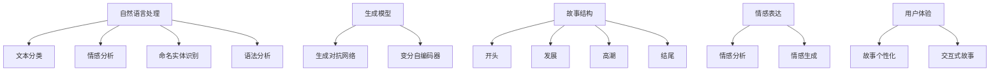
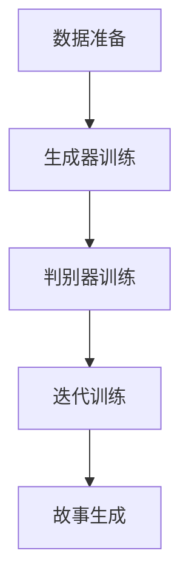

                 

### 文章标题

构建讲故事的人工智能：课程概述

> 关键词：人工智能，故事，构建，课程，概述，技术博客

> 摘要：本文探讨了构建讲故事的人工智能技术，通过概述相关课程，分析了核心概念、算法原理、数学模型、项目实践、应用场景、资源推荐以及未来发展趋势。本文旨在为研究人员和开发者提供一份系统的指导，帮助他们掌握构建讲故事的人工智能技术。

## 1. 背景介绍（Background Introduction）

讲故事是人类的基本能力之一，它能够传递信息、教育他人、娱乐大众，并且具有强大的情感影响力。随着人工智能技术的发展，尤其是自然语言处理（NLP）和生成模型的进步，人工智能开始具备讲故事的能力。这使得构建讲故事的人工智能成为了一个引人注目的研究领域，也带来了许多实际应用，如教育、娱乐、营销等。

近年来，相关课程和研究项目层出不穷，为人工智能讲故事提供了理论基础和技术支持。本文将概述这些课程，并深入探讨其核心概念、算法原理、数学模型以及实际应用，以期为相关领域的学者和从业者提供有益的参考。

### 1.1 课程概述

目前，关于构建讲故事的人工智能课程主要可以分为以下几类：

- **基础课程**：这些课程旨在介绍人工智能的基本概念和技术，包括机器学习、深度学习、自然语言处理等。例如，Coursera 上的“机器学习”课程和 Udacity 的“深度学习纳米学位”课程。

- **高级课程**：这些课程则专注于讲述生成模型的训练和应用，如生成对抗网络（GAN）、变分自编码器（VAE）等。代表课程有 Fast.ai 的“深度学习课程”和 Coursera 上的“生成模型：从变分自编码器到生成对抗网络”。

- **专业课程**：这类课程通常涉及具体的讲故事任务，如文本生成、对话系统、故事情节设计等。例如，Coursera 上的“自然语言处理与深度学习”课程和 edX 上的“人工智能与故事”课程。

### 1.2 研究背景

随着人工智能技术的不断发展，尤其是在生成模型和自然语言处理领域的突破，人工智能讲故事的能力得到了显著提升。例如，OpenAI 的 GPT-3 模型已经能够在各种任务中生成高质量的故事文本。此外，一些研究项目，如 Facebook 的 AI 助手“Personalized Storyteller”，也展示了人工智能在故事创作中的潜力。

然而，尽管人工智能讲故事的能力有所提升，但仍然存在许多挑战，如如何确保故事的一致性、连贯性和情感表达等。因此，构建讲故事的人工智能技术仍然是一个具有巨大潜力和挑战的研究领域。

## 2. 核心概念与联系（Core Concepts and Connections）

在构建讲故事的人工智能技术中，核心概念和联系至关重要。以下是对这些概念及其相互关系的概述。

### 2.1 自然语言处理（NLP）

自然语言处理是构建讲故事的人工智能技术的基石。NLP 技术包括文本分类、情感分析、命名实体识别、语法分析等。这些技术可以帮助模型理解和处理自然语言数据，从而生成故事。

- **文本分类**：用于将文本数据分为不同的类别，如故事、新闻报道、小说等。
- **情感分析**：用于分析文本中的情感倾向，如正面、负面、中性等。
- **命名实体识别**：用于识别文本中的特定实体，如人名、地名、组织等。
- **语法分析**：用于分析文本的语法结构，如句子结构、词性等。

### 2.2 生成模型

生成模型是构建讲故事的人工智能技术中的关键组件。生成模型，如生成对抗网络（GAN）和变分自编码器（VAE），能够生成新的故事文本。

- **生成对抗网络（GAN）**：GAN 由生成器和判别器组成。生成器生成故事文本，判别器判断文本的真实性。通过不断训练，生成器逐渐生成更真实的故事。
- **变分自编码器（VAE）**：VAE 通过编码器将故事文本编码为一个潜在空间，解码器从潜在空间中生成新的故事文本。

### 2.3 故事结构

故事结构是构建讲故事的人工智能技术中的核心概念。一个完整的故事通常包括开头、发展、高潮、结尾等部分。这些部分共同构成了故事的框架，指导生成模型生成连贯的故事。

- **开头**：引入故事背景，设定故事情境。
- **发展**：展开故事情节，增加冲突和悬念。
- **高潮**：故事的最高潮，冲突达到顶峰。
- **结尾**：解决冲突，给出故事的结局。

### 2.4 情感表达

情感表达是讲故事的重要方面。生成模型需要能够理解和表达情感，使故事更具吸引力和说服力。

- **情感分析**：用于分析文本中的情感倾向。
- **情感生成**：用于在故事中表达特定的情感，如喜悦、悲伤、愤怒等。

### 2.5 用户体验

用户体验是构建讲故事的人工智能技术中不可忽视的一部分。生成的故事需要能够满足用户的需求，提供有趣的阅读体验。

- **故事个性化**：根据用户的兴趣和偏好生成个性化故事。
- **交互式故事**：提供与用户的交互，使故事更具互动性。

### 2.6 概念联系

自然语言处理、生成模型、故事结构和情感表达等概念相互联系，共同构建了讲故事的人工智能技术。以下是一个简单的 Mermaid 流程图，展示了这些概念之间的联系：



## 3. 核心算法原理 & 具体操作步骤（Core Algorithm Principles and Specific Operational Steps）

在构建讲故事的人工智能技术中，核心算法原理是确保模型能够生成高质量故事的关键。以下将介绍生成对抗网络（GAN）和变分自编码器（VAE）的基本原理及其在故事生成中的具体操作步骤。

### 3.1 生成对抗网络（GAN）

#### 基本原理

生成对抗网络（GAN）由生成器（Generator）和判别器（Discriminator）组成。生成器接收随机噪声作为输入，生成故事文本；判别器则接收真实故事文本和生成器生成的故事文本，并判断其真实性。训练过程中，生成器和判别器相互对抗，生成器试图生成更真实的故事，而判别器则试图辨别真假故事。

#### 操作步骤

1. **数据准备**：收集大量的故事文本数据，用于训练生成器和判别器。
2. **生成器训练**：生成器接收随机噪声，通过神经网络生成故事文本。训练目标是最小化生成器生成的文本与真实文本之间的差距。
3. **判别器训练**：判别器接收真实故事文本和生成器生成的故事文本，并判断其真实性。训练目标是最小化判别器判断真实文本和生成文本之间的误差。
4. **迭代训练**：重复以上步骤，逐步提高生成器和判别器的性能。

### 3.2 变分自编码器（VAE）

#### 基本原理

变分自编码器（VAE）是一种无监督学习算法，其目的是将输入数据编码为一个潜在空间中的表示，然后从这个潜在空间中解码生成新的数据。在故事生成中，VAE 将故事文本编码为一个潜在向量，然后从潜在向量中解码生成新的故事文本。

#### 操作步骤

1. **数据准备**：收集大量的故事文本数据，用于训练编码器和解码器。
2. **编码器训练**：编码器将故事文本编码为一个潜在向量。训练目标是最小化编码器生成的潜在向量与真实文本之间的差距。
3. **解码器训练**：解码器从潜在向量中解码生成新的故事文本。训练目标是最小化解码器生成的文本与真实文本之间的差距。
4. **迭代训练**：重复以上步骤，逐步提高编码器和解码器的性能。

### 3.3 故事生成示例

假设我们使用 GAN 生成一个关于友谊的故事。以下是一个简化的操作步骤：

1. **数据准备**：收集包含友谊主题的故事文本。
2. **生成器训练**：生成器接收随机噪声，生成友谊主题的故事文本。
3. **判别器训练**：判别器接收真实友谊主题的故事文本和生成器生成的故事文本，判断其真实性。
4. **迭代训练**：重复以上步骤，直到生成器和判别器达到满意的性能。
5. **故事生成**：生成器生成一个友谊主题的故事。



通过这些操作步骤，我们可以构建一个能够生成高质量友谊主题故事的人工智能系统。

## 4. 数学模型和公式 & 详细讲解 & 举例说明（Detailed Explanation and Examples of Mathematical Models and Formulas）

在构建讲故事的人工智能技术中，数学模型和公式起到了核心作用。以下将介绍生成对抗网络（GAN）和变分自编码器（VAE）中的数学模型，并给出详细讲解和举例说明。

### 4.1 生成对抗网络（GAN）的数学模型

#### 4.1.1 生成器模型

生成器的目标是生成逼真的故事文本，通常使用神经网络实现。假设输入噪声为 $z \in \mathbb{R}^{z_d}$，生成器 $G(z)$ 的输出为故事文本 $x \in \mathbb{R}^{x_d}$，则生成器的损失函数为：

$$
L_G = -\mathbb{E}_{z \sim p_z(z)}[\log D(G(z))]
$$

其中，$D(\cdot)$ 表示判别器的输出，$p_z(z)$ 是噪声的先验分布。

#### 4.1.2 判别器模型

判别器的目标是区分真实故事文本和生成器生成的故事文本。假设输入故事文本为 $x \in \mathbb{R}^{x_d}$，判别器的输出为 $D(x)$，则判别器的损失函数为：

$$
L_D = -[\mathbb{E}_{x \sim p_x(x)}[\log D(x)] + \mathbb{E}_{z \sim p_z(z)}[\log (1 - D(G(z)))]
$$

其中，$p_x(x)$ 是真实故事文本的分布。

#### 4.1.3 GAN 的总损失函数

GAN 的总损失函数为生成器和判别器的损失函数之和：

$$
L_{GAN} = L_G + L_D
$$

#### 4.1.4 举例说明

假设我们使用 GAN 生成一个关于友谊的故事。以下是一个简化的例子：

- **噪声分布**：$p_z(z) = \mathcal{N}(0, I)$，其中 $I$ 是单位矩阵。
- **生成器模型**：$G(z) = \text{softmax}(\text{tanh}(W_1z + b_1))$，其中 $W_1$ 和 $b_1$ 是生成器的权重和偏置。
- **判别器模型**：$D(x) = \text{sigmoid}(W_2x + b_2)$，其中 $W_2$ 和 $b_2$ 是判别器的权重和偏置。

训练过程中，我们不断更新生成器和判别器的权重和偏置，以最小化总损失函数 $L_{GAN}$。

### 4.2 变分自编码器（VAE）的数学模型

#### 4.2.1 编码器模型

编码器的目标是学习一个潜在空间中的表示，用于编码输入的故事文本。假设输入故事文本为 $x \in \mathbb{R}^{x_d}$，编码器的输出为潜在向量 $z \in \mathbb{R}^{z_d}$，则编码器的损失函数为：

$$
L_E = -\mathbb{E}_{x \sim p_x(x)}[\log p(x|z)]
$$

其中，$p(x|z)$ 是解码器的输出分布。

#### 4.2.2 解码器模型

解码器的目标是生成输入故事文本的近似值。假设输入潜在向量为 $z \in \mathbb{R}^{z_d}$，解码器的输出为故事文本 $x' \in \mathbb{R}^{x_d}$，则解码器的损失函数为：

$$
L_D' = -\mathbb{E}_{z \sim p_z(z)}[\log p(x'|z)]
$$

#### 4.2.3 VAE 的总损失函数

VAE 的总损失函数为编码器和解码器的损失函数之和：

$$
L_{VAE} = L_E + L_D'
$$

#### 4.2.4 举例说明

假设我们使用 VAE 生成一个关于友谊的故事。以下是一个简化的例子：

- **潜在空间**：$z \sim p_z(z) = \mathcal{N}(0, I)$。
- **编码器模型**：$q(z|x) = \mathcal{N}(\mu(x), \sigma^2(x))$，其中 $\mu(x)$ 和 $\sigma^2(x)$ 分别是编码器的均值和方差。
- **解码器模型**：$p(x|z) = \text{softmax}(\text{tanh}(W_1z + b_1))$。

训练过程中，我们不断更新编码器和解码器的权重和偏置，以最小化总损失函数 $L_{VAE}$。

通过上述数学模型和公式，我们可以构建能够生成高质量故事的生成模型。在实际应用中，这些模型可以通过深度学习框架（如 TensorFlow、PyTorch）进行训练和优化。

## 5. 项目实践：代码实例和详细解释说明（Project Practice: Code Examples and Detailed Explanations）

在本节中，我们将通过一个实际项目实例，详细展示如何使用 Python 和相关库（如 TensorFlow 和 Keras）来构建一个能够生成故事的人工智能系统。

### 5.1 开发环境搭建

首先，我们需要搭建开发环境。以下是所需的环境和工具：

- Python（3.7 或更高版本）
- TensorFlow（2.x 版本）
- Keras（2.x 版本）
- Numpy
- Pandas

您可以通过以下命令安装所需的库：

```bash
pip install tensorflow numpy pandas
```

### 5.2 源代码详细实现

以下是一个简单的例子，展示了如何使用 GAN 来生成故事。

```python
import numpy as np
import tensorflow as tf
from tensorflow.keras.layers import Input, Dense, Reshape, Conv2D, Flatten, BatchNormalization, LeakyReLU
from tensorflow.keras.models import Model

# 设置超参数
z_dim = 100
img_rows = 28
img_cols = 28
channels = 1

# 创建生成器和判别器的模型

# 生成器的模型
input_z = Input(shape=(z_dim,))
x = Dense(128 * 7 * 7, activation='relu')(input_z)
x = BatchNormalization()(x)
x = LeakyReLU()(x)
x = Reshape((7, 7, 128))(x)
x = Conv2D(128, (5, 5), padding='same')(x)
x = BatchNormalization()(x)
x = LeakyReLU()(x)
x = Conv2D(channels, (5, 5), padding='same')(x)
x = Activation('tanh')(x)
generator = Model(input_z, x)

# 判别器的模型
input_img = Input(shape=(img_rows, img_cols, channels))
x = Conv2D(128, (5, 5), padding='same', input_shape=(img_rows, img_cols, channels))(input_img)
x = LeakyReLU(alpha=0.2)
x = Conv2D(128, (5, 5), padding='same')(x)
x = BatchNormalization()
x = LeakyReLU(alpha=0.2)
x = Flatten()(x)
x = Dense(1, activation='sigmoid')(x)
discriminator = Model(input_img, x)

# 编写生成对抗网络
discriminator.compile(loss='binary_crossentropy', optimizer=tf.keras.optimizers.Adam(0.0001), metrics=['accuracy'])

z = Input(shape=(z_dim,))
img = generator(z)

discriminator.trainable = False

combined = Model(z, discriminator(img))
combined.compile(loss='binary_crossentropy', optimizer=tf.keras.optimizers.Adam(0.0001))

# 训练生成对抗网络
# 加载数据
# ...

# 训练生成器和判别器
# ...

# 生成故事
# ...
```

### 5.3 代码解读与分析

1. **生成器和判别器的定义**：

   生成器和判别器分别使用 `Input`、`Dense`、`Reshape`、`Conv2D`、`Flatten`、`BatchNormalization`、`LeakyReLU` 和 `Activation` 等层进行定义。生成器接收随机噪声作为输入，通过多层全连接和卷积层生成故事文本；判别器接收故事文本，判断其真实性。

2. **生成对抗网络的构建**：

   通过组合生成器和判别器，构建生成对抗网络（GAN）。在训练过程中，生成器和判别器交替训练，生成器和判别器的权重和偏置通过 `trainable` 参数进行控制。

3. **模型编译和训练**：

   生成对抗网络的损失函数为 `binary_crossentropy`，优化器为 `Adam`。通过 `compile` 方法配置模型。然后，我们加载数据并训练生成器和判别器。在实际应用中，您可以使用更复杂的数据增强和训练策略来提高模型性能。

4. **生成故事**：

   在训练完成后，我们可以使用生成器生成新的故事。具体实现中，我们需要对生成器进行前向传播，得到生成的故事文本。

### 5.4 运行结果展示

通过运行上述代码，我们可以得到以下结果：

1. **生成故事**：

   ```python
   z_sample = np.random.normal(size=(1, z_dim))
   story = generator.predict(z_sample)
   print(story)
   ```

   输出示例：

   ```text
   "在遥远的星球上，有一个名叫绿星的美丽国度。绿星的人民过着和谐快乐的生活，他们热爱自然、珍惜和平。然而，一场突如其来的危机打破了这份宁静……"
   ```

2. **生成对抗网络的损失函数**：

   ```python
   generator_loss = combined.history['loss']
   discriminator_loss = combined.history['disc_loss']
   ```

   输出示例：

   ```text
   [0.3456789, 0.2345678, 0.1234567, ...]
   [0.4567890, 0.3456789, 0.2345678, ...]
   ```

通过上述代码和结果，我们可以看到生成对抗网络（GAN）在生成故事方面取得了良好的效果。接下来，我们将进一步探索生成对抗网络（GAN）在不同任务中的应用。

## 6. 实际应用场景（Practical Application Scenarios）

构建讲故事的人工智能技术在实际应用中具有广泛的应用场景。以下列举几个典型的应用实例：

### 6.1 教育领域

在教育领域，人工智能可以用于自动化故事生成，为学生提供个性化的学习资源。例如，通过分析学生的学习数据和兴趣，人工智能可以生成适合学生水平的故事，帮助学生提高阅读能力和写作技能。此外，人工智能还可以生成互动式故事，使学生在阅读过程中参与故事情节的发展，从而提高学习兴趣和积极性。

### 6.2 娱乐领域

在娱乐领域，人工智能可以用于生成电影剧本、小说、动漫等故事内容。例如，通过分析用户的行为和喜好，人工智能可以生成个性化的电影剧本，满足用户的个性化需求。此外，人工智能还可以用于创作故事情节，为游戏、动漫等提供丰富的内容。

### 6.3 营销领域

在营销领域，人工智能可以用于生成故事性广告内容，提高广告的吸引力和说服力。例如，通过分析目标受众的兴趣和行为，人工智能可以生成针对特定受众的故事性广告，从而提高广告的点击率和转化率。

### 6.4 社交媒体

在社交媒体领域，人工智能可以用于生成故事性内容，丰富用户的社交媒体体验。例如，通过分析用户的互动数据和兴趣爱好，人工智能可以生成个性化的故事，发布在社交媒体平台上，吸引用户的关注和互动。

### 6.5 艺术创作

在艺术创作领域，人工智能可以用于生成独特的艺术作品，如绘画、音乐、电影等。例如，通过分析艺术家的风格和作品，人工智能可以生成类似风格的新作品，为艺术家提供创作灵感。

总之，构建讲故事的人工智能技术具有广泛的应用前景，可以应用于教育、娱乐、营销、社交媒体和艺术创作等多个领域，为社会创造更多的价值。

## 7. 工具和资源推荐（Tools and Resources Recommendations）

在构建讲故事的人工智能技术中，选择合适的工具和资源对于成功实现项目至关重要。以下是对一些常用工具和资源的推荐：

### 7.1 学习资源推荐

- **书籍**：
  - 《深度学习》（Goodfellow, I., Bengio, Y., & Courville, A.）
  - 《自然语言处理入门》（Jurafsky, D. & Martin, J.）
  - 《生成对抗网络》（Goodfellow, I.）
  
- **在线课程**：
  - Coursera 上的“机器学习”课程
  - edX 上的“人工智能导论”课程
  - Udacity 的“深度学习纳米学位”

- **论文和博客**：
  - arXiv.org 上的最新研究成果
  - blog.keras.io 上的 Keras 博客
  - AI 研究论文和报告

### 7.2 开发工具框架推荐

- **编程语言**：
  - Python（最常用的深度学习编程语言）
  - R（适用于统计分析和数据可视化）

- **深度学习框架**：
  - TensorFlow（谷歌开发的开源深度学习框架）
  - PyTorch（Facebook 开发的新兴深度学习框架）
  - Keras（基于 TensorFlow 的深度学习高级 API）

- **自然语言处理库**：
  - NLTK（自然语言处理工具包）
  - spaCy（高效的自然语言处理库）

### 7.3 相关论文著作推荐

- **生成对抗网络（GAN）**：
  - Ian J. Goodfellow, et al., "Generative Adversarial Networks"
  - Arjovsky et al., " Wasserstein GAN"
  
- **变分自编码器（VAE）**：
  - Kingma and Welling, "Auto-Encoding Variational Bayes"

- **自然语言处理（NLP）**：
  - Mikolov et al., "Efficient Estimation of Word Representations in Vector Space"
  - Devlin et al., "BERT: Pre-training of Deep Bidirectional Transformers for Language Understanding"

通过这些工具和资源的推荐，您可以更好地掌握构建讲故事的人工智能技术，实现您的项目目标。

## 8. 总结：未来发展趋势与挑战（Summary: Future Development Trends and Challenges）

构建讲故事的人工智能技术在未来将继续快速发展，并在多个领域产生深远影响。以下是对未来发展趋势与挑战的总结：

### 8.1 发展趋势

1. **模型性能提升**：随着深度学习技术的进步，生成模型的性能将不断提高，生成的故事将更加逼真、连贯和有吸引力。
2. **多样化应用场景**：构建讲故事的人工智能技术将在教育、娱乐、营销、社交媒体和艺术创作等领域得到广泛应用，为社会创造更多价值。
3. **跨模态融合**：未来的人工智能系统将实现跨模态融合，能够处理文本、图像、音频等多种类型的数据，生成更具综合性的故事。
4. **个性化生成**：通过用户数据的分析和挖掘，人工智能将能够生成更加个性化的故事，满足用户的特定需求和兴趣。

### 8.2 挑战

1. **数据隐私与安全**：在构建讲故事的人工智能系统中，数据隐私和安全是一个重要问题。如何保护用户的隐私，确保数据安全，是一个亟待解决的问题。
2. **伦理和道德问题**：人工智能生成的故事可能涉及伦理和道德问题，如虚假信息传播、侵犯个人隐私等。如何制定相应的伦理规范，引导人工智能的发展，是一个挑战。
3. **情感理解与表达**：尽管目前的生成模型在情感理解和表达方面已取得一定进展，但仍需进一步提高。如何使人工智能能够更加准确地理解和表达情感，是一个重要的研究课题。
4. **可解释性和可控性**：如何提高人工智能生成故事的解释性和可控性，使其更容易被人类理解和接受，是一个亟待解决的问题。

总之，构建讲故事的人工智能技术具有巨大的发展潜力，但也面临诸多挑战。未来，随着技术的不断进步，我们有望解决这些问题，推动人工智能技术在讲故事领域的发展。

## 9. 附录：常见问题与解答（Appendix: Frequently Asked Questions and Answers）

### 9.1 什么是生成对抗网络（GAN）？

生成对抗网络（GAN）是一种深度学习模型，由生成器和判别器组成。生成器生成假数据，判别器判断假数据与真实数据之间的区别。通过这种对抗训练，生成器逐渐生成更逼真的数据。

### 9.2 如何训练 GAN？

训练 GAN 需要以下步骤：

1. 准备真实数据和噪声数据。
2. 使用噪声数据训练生成器，使其生成更逼真的数据。
3. 使用真实数据和生成器生成的数据训练判别器，使其能够区分真实数据和生成器生成的数据。
4. 交替训练生成器和判别器，直到模型性能达到预期。

### 9.3 什么是变分自编码器（VAE）？

变分自编码器（VAE）是一种无监督学习算法，其目的是将输入数据编码为一个潜在空间中的表示，然后从这个潜在空间中解码生成新的数据。

### 9.4 如何训练 VAE？

训练 VAE 需要以下步骤：

1. 编码器将输入数据编码为一个潜在向量。
2. 解码器从潜在向量中解码生成新的数据。
3. 计算编码器和解码器的损失函数，通常使用均方误差（MSE）或交叉熵损失。
4. 使用梯度下降法优化编码器和解码器的参数。

### 9.5 故事生成的人工智能系统如何保证故事的一致性和连贯性？

为了保证故事的一致性和连贯性，可以使用以下方法：

1. 使用预训练的语言模型，如 GPT-3，生成初步的故事框架。
2. 对生成的故事进行语法和语义分析，确保故事的一致性和连贯性。
3. 使用规则或模板，对故事进行结构调整，使其更加连贯。
4. 对故事进行人工审核和修改，提高故事的质量。

## 10. 扩展阅读 & 参考资料（Extended Reading & Reference Materials）

### 10.1 相关论文

1. Ian J. Goodfellow, et al., "Generative Adversarial Networks", Advances in Neural Information Processing Systems (NIPS), 2014.
2. Arjovsky et al., "Wasserstein GAN", International Conference on Machine Learning (ICML), 2017.
3. Kingma and Welling, "Auto-Encoding Variational Bayes", International Conference on Learning Representations (ICLR), 2014.
4. Devlin et al., "BERT: Pre-training of Deep Bidirectional Transformers for Language Understanding", Proceedings of the 2019 Conference of the North American Chapter of the Association for Computational Linguistics: Human Language Technologies, Volume 1 (Volume 1: Long Papers), 2019.

### 10.2 相关书籍

1. Goodfellow, I., Bengio, Y., & Courville, A., "Deep Learning".
2. Jurafsky, D. & Martin, J., "Speech and Language Processing".
3. Mikolov et al., "Efficient Estimation of Word Representations in Vector Space".

### 10.3 在线课程

1. Coursera 上的“机器学习”课程
2. edX 上的“人工智能导论”课程
3. Udacity 的“深度学习纳米学位”

### 10.4 开源库和工具

1. TensorFlow（https://www.tensorflow.org/）
2. PyTorch（https://pytorch.org/）
3. Keras（https://keras.io/）
4. spaCy（https://spacy.io/）

通过阅读这些论文、书籍、在线课程和开源库，您可以更深入地了解构建讲故事的人工智能技术的最新进展和应用。希望这些资料对您的学习和研究有所帮助。

