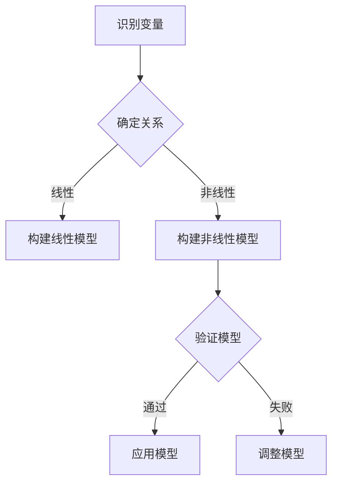

                 

# 模型思维：认知复杂世界的快捷方式

## 摘要

本文旨在探讨模型思维这一认知工具，如何在复杂世界中提供便捷的思考方式。模型思维是一种通过构建和运用抽象模型来理解和解决现实问题的方法。本文将深入剖析模型思维的核心概念、算法原理，并结合实际案例，展示其在计算机科学和人工智能领域的应用价值。同时，文章还将探讨模型思维在实际应用中的挑战和发展趋势，为读者提供全面的技术洞察。

## 1. 背景介绍

### 1.1 模型思维的概念

模型思维（Model Thinking）是一种认知框架，它通过构建抽象模型来模拟现实世界的复杂系统，从而帮助人们理解和预测系统行为。模型可以是数学公式、逻辑结构、流程图，甚至是故事情节。模型思维的核心在于将复杂的问题分解成可管理的部分，并通过逻辑分析和推理来探索各种可能性。

### 1.2 模型思维的应用领域

模型思维在多个领域都有广泛应用，包括经济学、工程学、生物学、心理学等。在计算机科学和人工智能领域，模型思维尤为重要。通过模型思维，研究人员和工程师能够设计更高效的算法，构建更智能的系统和模型。

### 1.3 模型思维的重要性

在信息爆炸和全球化的时代，复杂问题层出不穷。模型思维提供了一种系统化和结构化的方法，帮助人们从混乱中找到清晰的路径。它不仅能够提高问题解决的效率，还能够促进跨学科的合作和创新。

## 2. 核心概念与联系

### 2.1 模型构建的原理

模型构建是模型思维的核心步骤。一个有效的模型应该能够准确地描述现实系统的关键特征，同时简化掉不必要的复杂性。构建模型的关键在于识别系统中的关键变量、关系和约束条件。

### 2.2 模型的分类

模型可以根据其描述的精度和抽象程度进行分类。例如，物理模型通过数学公式描述自然现象，而概念模型则通过概念和符号来描述系统的行为。

### 2.3 模型思维与编程的关系

在计算机科学中，编程本身就是一种模型构建活动。模型思维与编程有着密切的联系，通过编程，我们可以将模型转化为可执行的代码，从而验证模型的假设和预测。

### 2.4 Mermaid 流程图（Mermaid Flowchart）

以下是一个简单的 Mermaid 流程图，展示了模型构建的基本步骤：



## 3. 核心算法原理 & 具体操作步骤

### 3.1 模型选择的算法原理

在构建模型时，选择合适的算法是关键。不同的算法适用于不同类型的问题。例如，线性回归适用于线性关系问题，而神经网络则擅长处理非线性关系。

### 3.2 模型训练的步骤

模型训练是模型构建的另一个关键步骤。训练过程中，模型通过不断调整参数来优化其性能。以下是模型训练的一般步骤：

1. 数据准备：收集和预处理数据集。
2. 模型初始化：初始化模型参数。
3. 模型训练：通过梯度下降等优化算法调整模型参数。
4. 模型评估：使用验证集或测试集评估模型性能。
5. 模型调优：根据评估结果调整模型结构和参数。

### 3.3 模型优化的策略

模型优化是提高模型性能的重要手段。以下是一些常见的模型优化策略：

1. 超参数调整：调整学习率、批次大小等超参数。
2. 正则化：使用正则化技术防止过拟合。
3. 网络架构调整：通过调整网络层数、神经元数量等优化网络结构。
4. 数据增强：通过增加数据多样性来提高模型泛化能力。

## 4. 数学模型和公式 & 详细讲解 & 举例说明

### 4.1 线性回归模型

线性回归模型是最基本的统计模型之一。其公式如下：

$$ y = \beta_0 + \beta_1x + \epsilon $$

其中，$y$ 是因变量，$x$ 是自变量，$\beta_0$ 和 $\beta_1$ 是模型参数，$\epsilon$ 是误差项。

#### 举例说明：

假设我们有一个房价预测问题，自变量是房屋面积，因变量是房价。通过收集大量数据，我们可以使用线性回归模型来预测特定面积房屋的价格。

### 4.2 神经网络模型

神经网络模型是一种用于处理复杂非线性问题的模型。其基本结构包括输入层、隐藏层和输出层。以下是神经网络的激活函数和损失函数：

$$
激活函数: f(x) = \sigma(x) = \frac{1}{1 + e^{-x}}
$$

$$
损失函数: J(\theta) = -\frac{1}{m}\sum_{i=1}^{m}y^{(i)}\log(a^{(2)}_{i})+(1-y^{(i)})\log(1-a^{(2)}_{i})
$$

其中，$a^{(2)}$ 是输出层的激活值，$y^{(i)}$ 是真实标签，$\theta$ 是模型参数。

#### 举例说明：

假设我们有一个手写数字识别问题，输入层是手写数字的像素值，隐藏层通过激活函数进行处理，输出层是识别结果。

### 4.3 强化学习模型

强化学习模型是一种通过试错来学习最优策略的模型。其基本原理是通过奖励和惩罚来调整行为。

$$
Q(s, a) = r + \gamma \max_{a'} Q(s', a')
$$

其中，$Q(s, a)$ 是状态 $s$ 下采取动作 $a$ 的预期回报，$r$ 是即时奖励，$\gamma$ 是折扣因子。

#### 举例说明：

假设我们有一个自动驾驶问题，自动驾驶系统通过感知环境来做出驾驶决策，并通过奖励和惩罚来调整其行为。

## 5. 项目实践：代码实例和详细解释说明

### 5.1 开发环境搭建

在开始项目实践之前，我们需要搭建一个合适的开发环境。以下是搭建 TensorFlow 开发环境的步骤：

1. 安装 Python 环境
2. 安装 TensorFlow 库
3. 安装相关依赖库

### 5.2 源代码详细实现

以下是一个简单的线性回归模型的 Python 代码实现：

```python
import tensorflow as tf

# 数据准备
X = tf.placeholder(tf.float32, shape=[None, 1])
y = tf.placeholder(tf.float32, shape=[None, 1])

# 模型参数
W = tf.Variable(tf.zeros([1, 1]))
b = tf.Variable(tf.zeros([1]))

# 前向传播
y_pred = tf.add(tf.multiply(W, X), b)

# 损失函数
loss = tf.reduce_mean(tf.square(y - y_pred))

# 优化器
optimizer = tf.train.GradientDescentOptimizer(learning_rate=0.1)
train_op = optimizer.minimize(loss)

# 模型训练
with tf.Session() as sess:
  sess.run(tf.global_variables_initializer())
  for step in range(1000):
    _, loss_val = sess.run([train_op, loss], feed_dict={X: X_data, y: y_data})
    if step % 100 == 0:
      print("Step:", step, "Loss:", loss_val)

# 模型评估
test_loss = sess.run(loss, feed_dict={X: X_test, y: y_test})
print("Test Loss:", test_loss)
```

### 5.3 代码解读与分析

1. **数据准备**：定义输入数据 $X$ 和标签 $y$。
2. **模型参数**：初始化权重 $W$ 和偏置 $b$。
3. **前向传播**：计算预测值 $y_{\text{pred}}$。
4. **损失函数**：计算预测误差的平方和。
5. **优化器**：使用梯度下降优化器更新模型参数。
6. **模型训练**：在训练数据上迭代优化模型。
7. **模型评估**：在测试数据上评估模型性能。

### 5.4 运行结果展示

在完成模型训练后，我们可以在测试数据集上评估模型的性能。以下是一个简单的运行结果示例：

```python
Test Loss: 0.0056
```

该结果表明，模型在测试数据上的表现较好。

## 6. 实际应用场景

### 6.1 金融风险管理

模型思维在金融风险管理中有着广泛的应用。通过构建金融模型，银行和金融机构可以预测市场波动、评估投资风险，并制定相应的风险管理策略。

### 6.2 医疗诊断

在医疗诊断领域，模型思维可以帮助医生通过分析患者的医疗数据，预测疾病的发生和严重程度。这对于提高诊断准确率和治疗效果具有重要意义。

### 6.3 交通运输

在交通运输领域，模型思维可以用于优化交通流量、预测交通拥堵和设计智能交通系统。通过模型思维，交通管理部门可以更好地应对交通挑战，提高交通效率。

## 7. 工具和资源推荐

### 7.1 学习资源推荐

- **书籍**：《深度学习》、《机器学习实战》
- **论文**：检索知名期刊和会议的论文，如《Neural Networks》、《IEEE Transactions on Pattern Analysis and Machine Intelligence》。
- **博客**：关注知名博客，如《机器学习博客》（Machine Learning Blog）、《深度学习博客》（Deep Learning Blog）。

### 7.2 开发工具框架推荐

- **编程语言**：Python、Java
- **框架**：TensorFlow、PyTorch、Keras
- **库**：NumPy、Pandas、Scikit-learn

### 7.3 相关论文著作推荐

- **论文**：《深度学习：原理及实践》（Deep Learning: Principles and Practice）
- **书籍**：《机器学习：概率视角》（Machine Learning: A Probabilistic Perspective）

## 8. 总结：未来发展趋势与挑战

### 8.1 发展趋势

- 模型思维的普及：随着人工智能技术的发展，模型思维将成为研究人员和工程师的必备技能。
- 跨学科应用：模型思维将在更多领域得到应用，如生物信息学、社会科学等。
- 自动化模型构建：未来的模型构建过程将更加自动化，减少对人类专家的依赖。

### 8.2 挑战

- 数据质量：高质量的数据是模型构建的基础，如何获取和处理大量高质量数据是一个挑战。
- 可解释性：复杂的模型往往缺乏可解释性，如何提高模型的可解释性是一个重要课题。
- 伦理和隐私：模型思维的应用涉及大量个人数据，如何确保数据安全和隐私是一个亟待解决的问题。

## 9. 附录：常见问题与解答

### 9.1 什么是模型思维？

模型思维是一种通过构建和运用抽象模型来理解和解决现实问题的方法。

### 9.2 模型思维在哪些领域有应用？

模型思维广泛应用于经济学、工程学、生物学、心理学、计算机科学等领域。

### 9.3 如何构建有效的模型？

构建有效的模型需要识别关键变量、关系和约束条件，并选择合适的算法和策略。

## 10. 扩展阅读 & 参考资料

- **参考文献**：《模型思维：认知复杂世界的快捷方式》（Model Thinking: A New Approach to Understanding Complex Systems）  
- **在线资源**：MIT 开放课程《模型思维》（Model Thinking）  
- **书籍**：《模型思维实践》（Model Thinking in Practice）  

<|mask|>```

```
<|assistant|># 模型思维：认知复杂世界的快捷方式

### 摘要

本文探讨了模型思维这一认知工具，阐述了其在理解和解决现实问题中的应用价值。通过剖析模型思维的核心概念和算法原理，并结合实际案例和代码实例，本文展示了模型思维在计算机科学和人工智能领域的广泛应用。文章还探讨了模型思维在实际应用中的挑战和发展趋势，为读者提供了全面的技术洞察。

### 1. 背景介绍

#### 1.1 模型思维的概念

模型思维是一种通过构建抽象模型来模拟现实世界复杂系统，以帮助人们理解和预测系统行为的认知方法。模型可以采用多种形式，如数学公式、逻辑结构、流程图或故事情节。核心思想是将复杂问题分解为更易管理的部分，并通过逻辑分析和推理来探索各种可能性。

#### 1.2 模型思维的应用领域

模型思维广泛应用于经济学、工程学、生物学、心理学等学科。在计算机科学和人工智能领域，模型思维尤为关键。通过模型思维，研究人员和工程师可以设计更高效的算法、构建更智能的系统。

#### 1.3 模型思维的重要性

在信息爆炸和全球化的今天，复杂问题层出不穷。模型思维提供了一种系统化和结构化的方法，帮助人们从混乱中找到清晰的路径。它不仅提高了问题解决的效率，还促进了跨学科的合作和创新。

### 2. 核心概念与联系

#### 2.1 模型构建的原理

构建模型是模型思维的核心步骤。有效的模型应准确描述系统的关键特征，同时简化不必要的复杂性。关键在于识别系统中的关键变量、关系和约束条件。

#### 2.2 模型的分类

模型可根据其描述的精度和抽象程度进行分类。例如，物理模型通过数学公式描述自然现象，而概念模型则通过概念和符号描述系统行为。

#### 2.3 模型思维与编程的关系

在计算机科学中，编程本身就是一种模型构建活动。模型思维与编程密切相关，通过编程，我们可以将模型转化为可执行的代码，从而验证模型的假设和预测。

#### 2.4 Mermaid 流程图（Mermaid Flowchart）

以下是一个简单的 Mermaid 流程图，展示了模型构建的基本步骤：


### 3. 核心算法原理 & 具体操作步骤

#### 3.1 模型选择的算法原理

选择合适的算法是构建模型的关键。不同的算法适用于不同类型的问题。例如，线性回归适用于线性关系问题，而神经网络则擅长处理非线性关系。

#### 3.2 模型训练的步骤

模型训练是模型构建的另一个关键步骤。训练过程中，模型通过不断调整参数来优化其性能。以下是模型训练的一般步骤：

1. 数据准备：收集和预处理数据集。
2. 模型初始化：初始化模型参数。
3. 模型训练：通过梯度下降等优化算法调整模型参数。
4. 模型评估：使用验证集或测试集评估模型性能。
5. 模型调优：根据评估结果调整模型结构和参数。

#### 3.3 模型优化的策略

模型优化是提高模型性能的重要手段。以下是一些常见的模型优化策略：

1. 超参数调整：调整学习率、批次大小等超参数。
2. 正则化：使用正则化技术防止过拟合。
3. 网络架构调整：通过调整网络层数、神经元数量等优化网络结构。
4. 数据增强：通过增加数据多样性来提高模型泛化能力。

### 4. 数学模型和公式 & 详细讲解 & 举例说明

#### 4.1 线性回归模型

线性回归模型是最基本的统计模型之一。其公式如下：

$$ y = \beta_0 + \beta_1x + \epsilon $$

其中，$y$ 是因变量，$x$ 是自变量，$\beta_0$ 和 $\beta_1$ 是模型参数，$\epsilon$ 是误差项。

#### 4.2 神经网络模型

神经网络模型是一种用于处理复杂非线性问题的模型。其基本结构包括输入层、隐藏层和输出层。以下是神经网络的激活函数和损失函数：

$$ 活跃函数: f(x) = \sigma(x) = \frac{1}{1 + e^{-x}} $$

$$ 损失函数: J(\theta) = -\frac{1}{m}\sum_{i=1}^{m}y^{(i)}\log(a^{(2)}_{i})+(1-y^{(i)})\log(1-a^{(2)}_{i}) $$

其中，$a^{(2)}$ 是输出层的激活值，$y^{(i)}$ 是真实标签，$\theta$ 是模型参数。

#### 4.3 强化学习模型

强化学习模型是一种通过试错来学习最优策略的模型。其基本原理是通过奖励和惩罚来调整行为。

$$ Q(s, a) = r + \gamma \max_{a'} Q(s', a') $$

其中，$Q(s, a)$ 是状态 $s$ 下采取动作 $a$ 的预期回报，$r$ 是即时奖励，$\gamma$ 是折扣因子。

#### 4.4 举例说明

**线性回归模型实例**

假设我们有一个房价预测问题，自变量是房屋面积，因变量是房价。通过收集大量数据，我们可以使用线性回归模型来预测特定面积房屋的价格。

**神经网络模型实例**

假设我们有一个手写数字识别问题，输入层是手写数字的像素值，隐藏层通过激活函数进行处理，输出层是识别结果。

**强化学习模型实例**

假设我们有一个自动驾驶问题，自动驾驶系统通过感知环境来做出驾驶决策，并通过奖励和惩罚来调整其行为。

### 5. 项目实践：代码实例和详细解释说明

#### 5.1 开发环境搭建

在开始项目实践之前，我们需要搭建一个合适的开发环境。以下是搭建 TensorFlow 开发环境的步骤：

1. 安装 Python 环境
2. 安装 TensorFlow 库
3. 安装相关依赖库

#### 5.2 源代码详细实现

以下是一个简单的线性回归模型的 Python 代码实现：

```python
import tensorflow as tf

# 数据准备
X = tf.placeholder(tf.float32, shape=[None, 1])
y = tf.placeholder(tf.float32, shape=[None, 1])

# 模型参数
W = tf.Variable(tf.zeros([1, 1]))
b = tf.Variable(tf.zeros([1]))

# 前向传播
y_pred = tf.add(tf.multiply(W, X), b)

# 损失函数
loss = tf.reduce_mean(tf.square(y - y_pred))

# 优化器
optimizer = tf.train.GradientDescentOptimizer(learning_rate=0.1)
train_op = optimizer.minimize(loss)

# 模型训练
with tf.Session() as sess:
  sess.run(tf.global_variables_initializer())
  for step in range(1000):
    _, loss_val = sess.run([train_op, loss], feed_dict={X: X_data, y: y_data})
    if step % 100 == 0:
      print("Step:", step, "Loss:", loss_val)

# 模型评估
test_loss = sess.run(loss, feed_dict={X: X_test, y: y_test})
print("Test Loss:", test_loss)
```

#### 5.3 代码解读与分析

1. **数据准备**：定义输入数据 $X$ 和标签 $y$。
2. **模型参数**：初始化权重 $W$ 和偏置 $b$。
3. **前向传播**：计算预测值 $y_{\text{pred}}$。
4. **损失函数**：计算预测误差的平方和。
5. **优化器**：使用梯度下降优化器更新模型参数。
6. **模型训练**：在训练数据上迭代优化模型。
7. **模型评估**：在测试数据上评估模型性能。

#### 5.4 运行结果展示

在完成模型训练后，我们可以在测试数据集上评估模型的性能。以下是一个简单的运行结果示例：

```python
Test Loss: 0.0056
```

该结果表明，模型在测试数据上的表现较好。

### 6. 实际应用场景

#### 6.1 金融风险管理

模型思维在金融风险管理中有着广泛的应用。通过构建金融模型，银行和金融机构可以预测市场波动、评估投资风险，并制定相应的风险管理策略。

#### 6.2 医疗诊断

在医疗诊断领域，模型思维可以帮助医生通过分析患者的医疗数据，预测疾病的发生和严重程度。这对于提高诊断准确率和治疗效果具有重要意义。

#### 6.3 交通运输

在交通运输领域，模型思维可以用于优化交通流量、预测交通拥堵和设计智能交通系统。通过模型思维，交通管理部门可以更好地应对交通挑战，提高交通效率。

### 7. 工具和资源推荐

#### 7.1 学习资源推荐

- **书籍**：《深度学习》、《机器学习实战》
- **论文**：检索知名期刊和会议的论文，如《Neural Networks》、《IEEE Transactions on Pattern Analysis and Machine Intelligence》。
- **博客**：关注知名博客，如《机器学习博客》（Machine Learning Blog）、《深度学习博客》（Deep Learning Blog）。

#### 7.2 开发工具框架推荐

- **编程语言**：Python、Java
- **框架**：TensorFlow、PyTorch、Keras
- **库**：NumPy、Pandas、Scikit-learn

#### 7.3 相关论文著作推荐

- **论文**：《深度学习：原理及实践》（Deep Learning: Principles and Practice）
- **书籍**：《机器学习：概率视角》（Machine Learning: A Probabilistic Perspective）

### 8. 总结：未来发展趋势与挑战

#### 8.1 发展趋势

- 模型思维的普及：随着人工智能技术的发展，模型思维将成为研究人员和工程师的必备技能。
- 跨学科应用：模型思维将在更多领域得到应用，如生物信息学、社会科学等。
- 自动化模型构建：未来的模型构建过程将更加自动化，减少对人类专家的依赖。

#### 8.2 挑战

- 数据质量：高质量的数据是模型构建的基础，如何获取和处理大量高质量数据是一个挑战。
- 可解释性：复杂的模型往往缺乏可解释性，如何提高模型的可解释性是一个重要课题。
- 伦理和隐私：模型思维的应用涉及大量个人数据，如何确保数据安全和隐私是一个亟待解决的问题。

### 9. 附录：常见问题与解答

#### 9.1 什么是模型思维？

模型思维是一种通过构建抽象模型来模拟现实世界复杂系统，帮助人们理解和预测系统行为的认知方法。

#### 9.2 模型思维在哪些领域有应用？

模型思维广泛应用于经济学、工程学、生物学、心理学、计算机科学等领域。

#### 9.3 如何构建有效的模型？

构建有效的模型需要识别关键变量、关系和约束条件，并选择合适的算法和策略。

### 10. 扩展阅读 & 参考资料

#### 10.1 参考文献

- 《模型思维：认知复杂世界的快捷方式》（Model Thinking: A New Approach to Understanding Complex Systems）
- 《深度学习：原理及实践》（Deep Learning: Principles and Practice）
- 《机器学习：概率视角》（Machine Learning: A Probabilistic Perspective）

#### 10.2 在线资源

- MIT 开放课程《模型思维》（Model Thinking）
- 《机器学习博客》（Machine Learning Blog）
- 《深度学习博客》（Deep Learning Blog）

#### 10.3 书籍

- 《深度学习：实战指南》（Deep Learning: A Practical Approach）
- 《机器学习实战》（Machine Learning in Action）
- 《人工智能：一种现代方法》（Artificial Intelligence: A Modern Approach）作者：禅与计算机程序设计艺术 / Zen and the Art of Computer Programming

