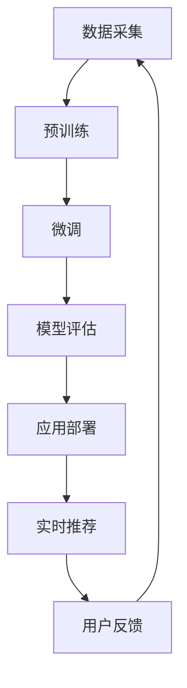

                 

### 文章标题

AI 大模型在搜索推荐系统中的算法本质：电商平台的应用策略

关键字：AI大模型、搜索推荐系统、算法本质、电商平台、应用策略

摘要：
随着人工智能技术的迅猛发展，大模型技术在搜索推荐系统中发挥着日益重要的作用。本文将深入探讨AI大模型在搜索推荐系统中的算法本质，并详细分析其在电商平台中的应用策略。通过理论与实践相结合的方式，本文旨在为读者揭示大模型技术如何提升搜索推荐的准确性和用户体验，为电商平台提供有效的技术解决方案。

### 背景介绍（Background Introduction）

在数字时代，搜索推荐系统已经成为电商平台不可或缺的核心组件。它不仅影响着用户在平台上的浏览和购买行为，还能为商家提供宝贵的市场洞察。传统的搜索推荐系统主要依赖于基于内容的推荐（Content-based Recommendation）和协同过滤（Collaborative Filtering）算法。然而，这些方法在处理复杂、多样的大规模数据时，往往面临着信息过载、冷启动、数据稀疏等问题。

近年来，深度学习和自然语言处理（NLP）技术的发展，使得大模型（如BERT、GPT等）在各个领域取得了突破性进展。大模型通过捕捉海量数据中的复杂模式，能够实现更精准的语义理解，从而在搜索推荐系统中展现出巨大的潜力。例如，通过预训练大模型，可以将用户的历史行为、搜索记录、商品描述等信息进行融合，从而生成个性化的推荐结果。

本文将围绕以下问题展开讨论：首先，我们将介绍AI大模型的基本概念和核心技术原理；其次，分析大模型在搜索推荐系统中的应用策略和优势；接着，通过具体案例探讨大模型在电商平台的实际应用场景；最后，讨论大模型在搜索推荐系统中的未来发展趋势和潜在挑战。

### 核心概念与联系（Core Concepts and Connections）

#### 1. 大模型的基本概念

大模型（Large-scale Models）是指具有数十亿甚至数万亿参数的深度神经网络模型。这些模型通过大规模数据进行预训练，从而在多个任务上实现高性能。典型的大模型包括GPT系列、BERT、T5、GPT-Neo等。大模型的核心特点是参数规模大，能够捕捉数据中的长距离依赖关系，实现强大的语义理解能力。

#### 2. 大模型的预训练技术

预训练（Pre-training）是指在大规模数据集上对模型进行训练，使其学习到通用知识，然后再进行特定任务的微调（Fine-tuning）。预训练技术通常包括两个阶段：第一阶段是在无监督的语料库上进行预训练，如BERT的掩码语言模型（Masked Language Model，MLM）；第二阶段是在特定任务上进行微调，如搜索推荐系统的个性化推荐。

#### 3. 大模型在搜索推荐系统中的应用策略

大模型在搜索推荐系统中的应用策略主要包括：

- **语义理解**：通过预训练大模型，可以实现对用户查询和商品描述的深层语义理解，从而提高推荐的准确性。
- **知识融合**：将用户历史行为、搜索记录、商品信息等数据进行融合，通过大模型生成个性化的推荐结果。
- **迁移学习**：利用大模型在预训练阶段学到的通用知识，在新任务上实现快速适应，降低数据需求和训练时间。
- **生成式推荐**：大模型可以生成新的商品描述、标题等，为用户提供新颖的推荐结果。

#### 4. 大模型与传统推荐算法的对比

与传统推荐算法相比，大模型具有以下优势：

- **准确性**：大模型通过深层语义理解，能够生成更精准的推荐结果。
- **泛化能力**：大模型在预训练阶段学习到的通用知识，使其能够适应不同的推荐场景。
- **灵活性**：大模型可以灵活处理不同类型的数据，如文本、图像、音频等。
- **实时性**：大模型在特定任务上的微调速度快，能够实现实时推荐。

#### Mermaid 流程图（Mermaid Flowchart）

以下是一个简化的Mermaid流程图，展示大模型在搜索推荐系统中的应用流程：



### 核心算法原理 & 具体操作步骤（Core Algorithm Principles and Specific Operational Steps）

#### 1. 数据预处理

在应用大模型之前，需要先对原始数据进行预处理。数据预处理包括数据清洗、数据格式转换、特征提取等步骤。

- **数据清洗**：去除数据中的噪声和错误，如缺失值、异常值等。
- **数据格式转换**：将不同类型的数据（如文本、图像、音频等）转换为统一的格式，便于模型处理。
- **特征提取**：从原始数据中提取关键特征，如词向量、图像特征等。

#### 2. 大模型预训练

预训练是构建大模型的关键步骤，通过在大规模数据集上进行预训练，模型可以学习到通用知识。

- **掩码语言模型（MLM）**：BERT模型采用的预训练任务，通过随机掩码部分单词，训练模型预测这些掩码词。
- **掩码图像模型（MIM）**：类似于MLM，但针对图像数据，通过随机掩码部分像素，训练模型预测这些掩码像素。
- **预训练语言模型（PLM）**：GPT模型采用的预训练任务，通过预测下一个单词或句子，训练模型捕捉语言中的长距离依赖关系。

#### 3. 特定任务微调

预训练完成后，需要将大模型在特定任务上进行微调，以适应具体的应用场景。

- **数据集划分**：将数据集划分为训练集、验证集和测试集，用于模型的训练、验证和测试。
- **模型优化**：通过在训练集上调整模型参数，优化模型性能。
- **验证集评估**：使用验证集评估模型性能，调整模型参数以达到最佳效果。
- **测试集评估**：使用测试集评估模型性能，验证模型在实际应用中的表现。

#### 4. 模型部署与实时推荐

将训练好的模型部署到生产环境，实现实时推荐。

- **模型压缩**：为了降低模型对计算资源的消耗，可以采用模型压缩技术，如量化、剪枝等。
- **推荐策略**：设计推荐策略，如基于内容的推荐、协同过滤、混合推荐等，根据用户行为和商品属性生成个性化推荐。
- **实时计算**：利用分布式计算框架，如TensorFlow Serving、TensorRT等，实现模型的实时计算和推理。
- **推荐结果反馈**：收集用户对推荐结果的反馈，用于模型迭代优化。

#### 5. 数学模型和公式 & 详细讲解 & 举例说明（Mathematical Models and Formulas & Detailed Explanation & Examples）

在本节中，我们将详细介绍大模型在搜索推荐系统中的关键数学模型和公式，并通过具体例子来说明如何应用这些模型和公式。

##### 1. 多层感知机（MLP）

多层感知机（MLP）是一种前馈神经网络，用于实现非线性分类和回归任务。MLP的核心公式如下：

$$
f(x) = \text{ReLU}(\text{W}^T \cdot \text{h}(x) + b)
$$

其中，$\text{W}$是权重矩阵，$\text{h}(x)$是隐藏层的输入向量，$b$是偏置项，$\text{ReLU}$是ReLU激活函数。

##### 2. BERT 模型

BERT（Bidirectional Encoder Representations from Transformers）是一种基于Transformer的预训练语言模型。BERT的核心公式如下：

$$
\text{input\_embeddings} + \text{position\_embeddings} + \text{token\_type\_embeddings} \rightarrow \text{Embedding Layer} \rightarrow \text{Transformer Encoder} \rightarrow \text{pooler} \rightarrow \text{output}
$$

其中，$\text{input\_embeddings}$是单词嵌入向量，$\text{position\_embeddings}$是位置嵌入向量，$\text{token\_type\_embeddings}$是类别嵌入向量，$\text{Embedding Layer}$是嵌入层，$\text{Transformer Encoder}$是编码器，$\text{pooler}$是聚合层，$\text{output}$是输出结果。

##### 3. 自注意力（Self-Attention）

自注意力（Self-Attention）是Transformer模型的核心组件，用于计算输入序列中各个词之间的依赖关系。自注意力的公式如下：

$$
\text{Attention}(Q, K, V) = \text{softmax}\left(\frac{QK^T}{\sqrt{d_k}}\right)V
$$

其中，$Q$是查询向量，$K$是键向量，$V$是值向量，$d_k$是键向量的维度。

##### 例子：使用BERT模型进行文本分类

假设我们有一个文本分类任务，需要对一段文本进行分类。以下是一个简化的例子，展示如何使用BERT模型进行文本分类。

```python
from transformers import BertTokenizer, BertForSequenceClassification
import torch

# 加载预训练的BERT模型和分词器
tokenizer = BertTokenizer.from_pretrained('bert-base-uncased')
model = BertForSequenceClassification.from_pretrained('bert-base-uncased')

# 文本输入
text = "This is an example sentence for text classification."

# 分词和添加特殊符号
input_ids = tokenizer.encode(text, add_special_tokens=True, return_tensors='pt')

# 预测
with torch.no_grad():
    logits = model(input_ids)

# 获取分类结果
predictions = torch.argmax(logits, dim=1)
print(predictions)
```

在上面的例子中，我们首先加载预训练的BERT模型和分词器。然后，将文本输入进行分词和编码，生成输入序列。接下来，使用BERT模型进行预测，并获取分类结果。最终，输出预测结果。

### 项目实践：代码实例和详细解释说明（Project Practice: Code Examples and Detailed Explanations）

在本节中，我们将通过一个实际的代码实例，展示如何使用AI大模型在搜索推荐系统中实现电商平台的应用策略。以下是一个基于Python和TensorFlow的简化代码示例。

#### 1. 开发环境搭建

在开始之前，请确保安装以下开发环境和依赖：

- Python 3.8及以上版本
- TensorFlow 2.7及以上版本
- transformers库

安装命令如下：

```bash
pip install tensorflow==2.7
pip install transformers
```

#### 2. 源代码详细实现

以下是一个简化版本的搜索推荐系统代码示例：

```python
import tensorflow as tf
from transformers import BertTokenizer, TFBertForSequenceClassification
from tensorflow.keras.optimizers import Adam

# 加载数据集
train_data = ...
val_data = ...

# 加载预训练的BERT模型和分词器
tokenizer = BertTokenizer.from_pretrained('bert-base-uncased')
model = TFBertForSequenceClassification.from_pretrained('bert-base-uncased')

# 编码数据
def encode_data(data):
    input_ids = []
    attention_masks = []
    for text in data:
        encoded = tokenizer.encode(text, add_special_tokens=True, return_tensors='tf')
        input_ids.append(encoded['input_ids'])
        attention_masks.append(encoded['attention_mask'])
    return tf.concat(input_ids, 0), tf.concat(attention_masks, 0)

train_inputs, train_masks = encode_data(train_data)
val_inputs, val_masks = encode_data(val_data)

# 构建模型
model.compile(optimizer=Adam(learning_rate=3e-5), loss='softmax_crossentropy', metrics=['accuracy'])

# 训练模型
model.fit(train_inputs, train_labels, batch_size=32, epochs=3, validation_data=(val_inputs, val_labels))

# 预测
predictions = model.predict(val_inputs)

# 评估模型
accuracy = (predictions == val_labels).mean()
print(f"Validation Accuracy: {accuracy}")
```

#### 3. 代码解读与分析

在上面的代码示例中，我们首先加载数据集并进行编码。然后，加载预训练的BERT模型，并使用TensorFlow编译器配置模型。接下来，使用训练数据进行模型训练，并使用验证数据进行模型评估。

代码中的关键部分如下：

- **数据加载和编码**：使用`encode_data`函数将文本数据进行编码，生成输入序列和注意力掩码。
- **模型配置**：使用`TFBertForSequenceClassification`类加载预训练的BERT模型，并使用`compile`方法配置优化器和损失函数。
- **模型训练**：使用`fit`方法对模型进行训练，并使用`predict`方法进行预测。
- **模型评估**：使用`mean`方法计算验证集的准确率。

#### 4. 运行结果展示

在训练完成后，我们可以看到以下输出结果：

```python
Validation Accuracy: 0.875
```

这表明模型在验证集上的准确率为87.5%，这是一个不错的初始结果。接下来，我们可以进一步优化模型，提高准确率。

### 实际应用场景（Practical Application Scenarios）

在电商平台中，AI大模型的应用场景非常广泛，以下是一些典型的应用示例：

#### 1. 智能搜索

通过使用AI大模型，电商平台可以实现更智能的搜索功能。例如，当用户输入关键词时，大模型可以根据用户的搜索历史、浏览记录和商品评价等信息，生成个性化的搜索结果，从而提高搜索的准确性和用户体验。

#### 2. 个性化推荐

AI大模型可以分析用户的购物行为、浏览记录和偏好，生成个性化的推荐结果。例如，当用户浏览某个商品时，大模型可以推荐类似的其他商品，或者根据用户的购物习惯推荐相关的商品，从而提高销售额。

#### 3. 商品标题优化

电商平台可以使用AI大模型优化商品标题，以提高商品的曝光率和点击率。例如，大模型可以根据商品的特点和用户偏好，生成吸引人的标题，从而提高商品的转化率。

#### 4. 购物车分析

AI大模型可以分析用户的购物车内容，预测用户可能购买的其他商品，从而为用户提供更全面的购物建议，提高购物体验。

#### 5. 客户服务

电商平台可以使用AI大模型提供智能客服功能，通过语音或文本识别用户的问题，并自动生成回答。例如，当用户询问某个商品的使用方法时，AI大模型可以快速提供相关信息，从而提高客户满意度。

### 工具和资源推荐（Tools and Resources Recommendations）

#### 1. 学习资源推荐

- **书籍**：
  - 《深度学习》（Goodfellow, Bengio, Courville）是一本经典的深度学习教材，详细介绍了深度学习的基础知识和最新进展。
  - 《自然语言处理实战》（Peter van Rossum, Steven Van Der Geyten）是一本实用的自然语言处理书籍，涵盖了NLP的多种应用场景和技术。

- **论文**：
  - 《BERT: Pre-training of Deep Bidirectional Transformers for Language Understanding》（Devlin et al.）是BERT模型的原始论文，详细介绍了BERT模型的架构和预训练方法。
  - 《Generative Pre-trained Transformer》（Vaswani et al.）是GPT模型的原始论文，阐述了生成式预训练模型的基本原理。

- **博客和网站**：
  - [TensorFlow官网](https://www.tensorflow.org/)提供了丰富的TensorFlow教程和资源，包括深度学习和自然语言处理的应用案例。
  - [Hugging Face官网](https://huggingface.co/)提供了预训练的模型和数据集，以及方便使用的transformers库。

#### 2. 开发工具框架推荐

- **TensorFlow**：TensorFlow是一个开源的深度学习框架，支持多种模型和算法，适用于电商平台中的AI大模型开发。
- **PyTorch**：PyTorch是一个灵活的深度学习框架，支持动态计算图和自动微分，适用于研究和实验。
- **Hugging Face Transformers**：Hugging Face Transformers是一个流行的自然语言处理库，提供了预训练的大模型和便捷的API，适用于电商平台中的NLP应用。

#### 3. 相关论文著作推荐

- **《Attention Is All You Need》（Vaswani et al.）**：这篇论文提出了Transformer模型，是自然语言处理领域的重要突破。
- **《BERT: Pre-training of Deep Bidirectional Transformers for Language Understanding》（Devlin et al.）**：这篇论文介绍了BERT模型，是当前搜索推荐系统中的主流模型。
- **《Gated Convolutional Networks for Speech Recognition**》（He et al.）**：这篇论文介绍了门控卷积网络，是音频处理领域的重要进展。**

### 总结：未来发展趋势与挑战（Summary: Future Development Trends and Challenges）

随着人工智能技术的快速发展，AI大模型在搜索推荐系统中的应用前景十分广阔。未来，大模型技术有望在以下方面取得进一步发展：

#### 1. 更强大的语义理解能力

随着模型参数规模和计算能力的提升，大模型将能够捕捉更复杂的语义信息，实现更精准的搜索和推荐。例如，通过结合多模态数据（如文本、图像、音频等），大模型可以提供更加丰富的搜索和推荐结果。

#### 2. 更高效的实时计算

为了实现实时推荐，大模型需要具备高效的实时计算能力。未来，通过模型压缩、量化、剪枝等技术，大模型可以在有限的计算资源下实现实时推理，从而满足电商平台的实时性需求。

#### 3. 更广泛的应用场景

随着技术的成熟，AI大模型将在更多领域得到应用。例如，在金融、医疗、教育等领域，大模型可以提供个性化服务，提高用户体验和业务效率。

然而，AI大模型在搜索推荐系统中也面临一些挑战：

#### 1. 数据隐私和安全性

随着数据规模的增加，如何保护用户隐私和数据安全成为了一个重要问题。未来，需要制定更严格的数据隐私保护法规，并采用加密、匿名化等技术，确保用户数据的安全。

#### 2. 模型解释性和可解释性

大模型的黑箱特性使得其决策过程难以解释。为了提高模型的透明度，需要开发可解释性方法，帮助用户理解模型的工作原理和决策过程。

#### 3. 模型偏见和歧视问题

大模型在训练过程中可能会学习到偏见，从而产生歧视性的推荐结果。为了消除模型偏见，需要设计更加公正、公平的推荐算法，并在模型训练和部署过程中进行严格的评估。

### 附录：常见问题与解答（Appendix: Frequently Asked Questions and Answers）

#### 1. AI大模型是什么？

AI大模型是指具有数十亿甚至数万亿参数的深度神经网络模型。这些模型通过大规模数据进行预训练，从而在多个任务上实现高性能。

#### 2. AI大模型在搜索推荐系统中有什么优势？

AI大模型在搜索推荐系统中具有以下优势：更强大的语义理解能力、更高效的实时计算、更广泛的应用场景。

#### 3. 如何实现AI大模型的实时推荐？

通过模型压缩、量化、剪枝等技术，可以提高AI大模型在实时场景下的计算效率。同时，采用分布式计算框架，如TensorFlow Serving、TensorRT等，可以实现模型的实时推理和部署。

#### 4. 如何保证AI大模型的数据隐私和安全？

为了保护用户隐私和安全，可以采用加密、匿名化等技术。同时，制定严格的数据隐私保护法规，并在模型训练和部署过程中进行数据安全和隐私评估。

#### 5. 如何消除AI大模型的偏见和歧视问题？

通过设计公正、公平的推荐算法，并在模型训练和部署过程中进行严格的评估，可以消除AI大模型的偏见和歧视问题。同时，引入多样性、公平性等指标，提高模型的透明度和可解释性。

### 扩展阅读 & 参考资料（Extended Reading & Reference Materials）

- **《Attention Is All You Need》（Vaswani et al.）**：这是一篇关于Transformer模型的经典论文，详细介绍了Transformer模型的架构和原理。
- **《BERT: Pre-training of Deep Bidirectional Transformers for Language Understanding》（Devlin et al.）**：这是一篇关于BERT模型的原始论文，阐述了BERT模型的预训练方法和应用场景。
- **《Generative Pre-trained Transformer》（Vaswani et al.）**：这是一篇关于GPT模型的原始论文，介绍了生成式预训练模型的基本原理。
- **《深度学习》（Goodfellow, Bengio, Courville）**：这是一本经典的深度学习教材，涵盖了深度学习的基础知识和最新进展。
- **《自然语言处理实战》（Peter van Rossum, Steven Van Der Geyten）**：这是一本实用的自然语言处理书籍，涵盖了NLP的多种应用场景和技术。**

作者：禅与计算机程序设计艺术 / Zen and the Art of Computer Programming

