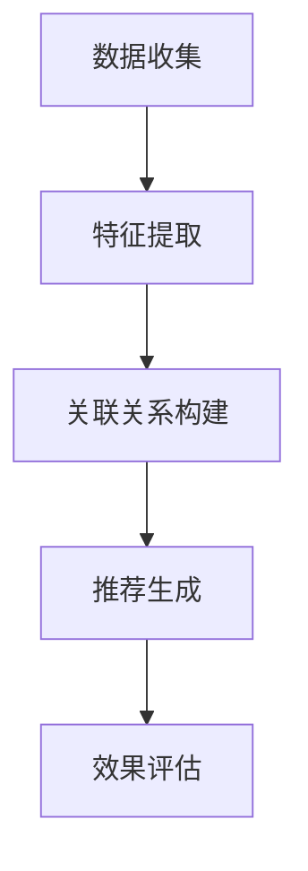

                 

# 文章标题

**AI 大模型在电商搜索推荐中的冷启动策略：应对新用户与数据不足的探索**

关键词：AI 大模型、电商搜索推荐、冷启动策略、新用户、数据不足、探索

摘要：本文将探讨 AI 大模型在电商搜索推荐中的冷启动策略。针对新用户与数据不足的问题，文章从核心概念、算法原理、数学模型、项目实践、实际应用场景等多个方面进行深入分析，并提出相应的解决方案和优化策略，以期为电商行业的推荐系统提供有益的参考和借鉴。

## 1. 背景介绍（Background Introduction）

随着互联网的快速发展，电子商务已成为人们日常生活的重要组成部分。而电商平台的搜索推荐系统作为提升用户满意度和转化率的关键环节，其重要性愈发凸显。然而，在用户首次进入电商平台时，由于缺乏历史行为数据，推荐系统往往难以准确预测用户偏好，导致推荐效果不佳。这种现象被称为“冷启动”（cold start）问题。

### 1.1 冷启动问题的定义与影响

冷启动问题是指在新用户或新商品首次出现时，推荐系统由于缺乏足够的用户历史行为数据或商品信息，难以生成有效推荐的情况。冷启动问题对电商平台的影响主要体现在以下几个方面：

- **用户体验下降**：由于推荐系统无法提供符合用户偏好的推荐，用户可能会感到失望，从而影响用户满意度和粘性。
- **商业价值损失**：推荐不准确会导致用户流失，从而影响电商平台的销售额和市场份额。
- **运营成本增加**：为解决冷启动问题，电商平台可能需要投入更多资源进行数据收集和用户画像构建，增加了运营成本。

### 1.2 当前冷启动问题的主要解决方案

目前，针对冷启动问题，电商平台主要采用以下几种解决方案：

- **基于内容的推荐**：通过分析商品属性和用户兴趣标签，为用户提供内容相关的推荐。但该方法在用户缺乏兴趣标签时效果不佳。
- **基于社交网络的推荐**：利用用户社交关系和朋友圈信息进行推荐。但该方法在用户社交网络数据不足或隐私保护要求较高时受限。
- **基于机器学习的推荐**：通过构建用户行为和商品特征的关系模型，进行推荐。但该方法在用户行为数据不足时难以准确预测用户偏好。
- **混合推荐策略**：结合多种推荐方法，以提升推荐效果。但不同方法之间的融合和优化仍存在挑战。

## 2. 核心概念与联系（Core Concepts and Connections）

### 2.1 大模型的概念与特点

大模型（Large-scale Models）是指具有巨大参数量和训练数据的深度学习模型。这些模型通过学习海量数据中的规律，具有强大的表示能力和泛化能力。大模型的特点包括：

- **大规模参数**：大模型通常拥有数十亿甚至千亿级别的参数，能够捕捉到数据中的复杂模式。
- **广泛适用性**：大模型在多种任务中表现出色，包括自然语言处理、计算机视觉、语音识别等。
- **自主学习能力**：大模型可以通过无监督或半监督学习，从海量数据中自动提取特征，无需人工干预。

### 2.2 大模型在电商搜索推荐中的应用

大模型在电商搜索推荐中具有广泛的应用前景，主要体现在以下几个方面：

- **用户行为预测**：大模型可以通过学习用户历史行为数据，准确预测用户偏好，为用户提供个性化的推荐。
- **商品属性分析**：大模型可以提取商品属性的特征，帮助推荐系统更好地理解商品，从而提高推荐质量。
- **跨模态推荐**：大模型可以处理多种数据类型，如文本、图像、音频等，实现跨模态的推荐。
- **实时推荐**：大模型可以快速处理用户请求，实时生成推荐结果，提高用户体验。

### 2.3 大模型与传统推荐算法的关系

大模型与传统推荐算法的关系可以看作是互补与融合。传统推荐算法，如基于内容的推荐、基于协同过滤的推荐等，在大模型的基础上进行优化和改进，以提升推荐效果。同时，大模型在处理海量数据和复杂任务时，也依赖于传统推荐算法的基本原理和方法。

### 2.4 大模型在电商搜索推荐中的挑战

尽管大模型在电商搜索推荐中具有巨大潜力，但也面临以下挑战：

- **数据隐私保护**：大模型需要大量用户数据，如何保护用户隐私成为一个关键问题。
- **计算资源消耗**：大模型训练和推理过程需要大量计算资源，如何优化计算效率是当前研究的热点。
- **模型解释性**：大模型通常被视为“黑箱”，如何解释模型决策过程，提高模型的可解释性是一个重要研究方向。

## 3. 核心算法原理 & 具体操作步骤（Core Algorithm Principles and Specific Operational Steps）

### 3.1 冷启动算法概述

冷启动算法是指在用户或商品缺乏足够数据的情况下，利用现有数据和信息，为用户提供有效推荐的方法。核心思想是通过多种方式获取用户或商品的特征，构建用户与商品之间的关联关系，从而实现推荐。

### 3.2 算法步骤

冷启动算法主要包括以下步骤：

- **数据收集**：收集用户行为数据、商品信息、用户画像等数据，为后续分析提供基础。
- **特征提取**：对用户和商品进行特征提取，包括用户兴趣标签、购买历史、浏览记录等。
- **关联关系构建**：利用特征提取结果，构建用户与商品之间的关联关系，如基于内容的相似度计算、协同过滤等。
- **推荐生成**：根据用户特征和商品关联关系，生成个性化推荐结果，如Top-N推荐、基于模型的推荐等。
- **效果评估**：评估推荐效果，包括准确率、召回率、覆盖率等指标，不断优化推荐算法。

### 3.3 算法流程图（Mermaid 流程图）



## 4. 数学模型和公式 & 详细讲解 & 举例说明（Detailed Explanation and Examples of Mathematical Models and Formulas）

### 4.1 数学模型概述

在冷启动算法中，常用的数学模型包括：

- **用户相似度计算**：计算用户之间的相似度，用于基于协同过滤的推荐。
- **商品属性表示**：将商品属性转化为向量的形式，用于基于内容的推荐。
- **推荐算法评估指标**：评估推荐效果的指标，如准确率、召回率、覆盖率等。

### 4.2 用户相似度计算

用户相似度计算是冷启动算法的重要环节，常用的方法包括余弦相似度、皮尔逊相关系数等。

#### 4.2.1 余弦相似度

余弦相似度是一种基于向量空间模型的方法，计算公式如下：

$$
sim(u_i, u_j) = \frac{u_i \cdot u_j}{\|u_i\| \cdot \|u_j\|}
$$

其中，$u_i$ 和 $u_j$ 分别表示用户 $i$ 和用户 $j$ 的向量表示，$\cdot$ 表示向量的点积，$\|\|$ 表示向量的模。

#### 4.2.2 皮尔逊相关系数

皮尔逊相关系数是一种基于统计方法的方法，计算公式如下：

$$
sim(u_i, u_j) = \frac{cov(u_i, u_j)}{\sigma_i \cdot \sigma_j}
$$

其中，$cov(u_i, u_j)$ 表示用户 $i$ 和用户 $j$ 的协方差，$\sigma_i$ 和 $\sigma_j$ 分别表示用户 $i$ 和用户 $j$ 的标准差。

### 4.3 商品属性表示

商品属性表示是将商品属性转化为向量的形式，常用的方法包括词袋模型、词嵌入等。

#### 4.3.1 词袋模型

词袋模型是一种基于统计方法的方法，将商品属性视为词汇，构建一个词汇表，并将每个商品表示为一个向量。

#### 4.3.2 词嵌入

词嵌入是一种基于深度学习的方法，将商品属性视为词汇，通过神经网络将每个词汇映射到一个高维向量空间中。

### 4.4 推荐算法评估指标

推荐算法评估指标用于评估推荐效果，常用的指标包括准确率、召回率、覆盖率等。

#### 4.4.1 准确率（Accuracy）

准确率是指预测正确的样本数与总样本数的比值，计算公式如下：

$$
accuracy = \frac{TP + TN}{TP + TN + FP + FN}
$$

其中，$TP$ 表示预测正确且实际为正类的样本数，$TN$ 表示预测正确且实际为负类的样本数，$FP$ 表示预测错误但实际为正类的样本数，$FN$ 表示预测错误但实际为负类的样本数。

#### 4.4.2 召回率（Recall）

召回率是指预测正确且实际为正类的样本数与实际为正类的样本总数的比值，计算公式如下：

$$
recall = \frac{TP}{TP + FN}
$$

#### 4.4.3 覆盖率（Coverage）

覆盖率是指预测结果中包含的不同商品数与总商品数的比值，计算公式如下：

$$
coverage = \frac{|\{i | r_i > 0\}|}{|I|}
$$

其中，$r_i$ 表示用户 $i$ 的推荐结果，$I$ 表示所有商品的集合。

### 4.5 举例说明

假设有用户 $u_1$ 和用户 $u_2$，其向量表示分别为 $u_1 = (1, 2, 3)$ 和 $u_2 = (2, 3, 4)$，计算它们的余弦相似度和皮尔逊相关系数。

#### 4.5.1 余弦相似度

$$
sim(u_1, u_2) = \frac{1 \cdot 2 + 2 \cdot 3 + 3 \cdot 4}{\sqrt{1^2 + 2^2 + 3^2} \cdot \sqrt{2^2 + 3^2 + 4^2}} = \frac{14}{\sqrt{14} \cdot \sqrt{29}} \approx 0.87
$$

#### 4.5.2 皮尔逊相关系数

$$
sim(u_1, u_2) = \frac{1 \cdot 2 + 2 \cdot 3 + 3 \cdot 4 - 3 \cdot (1 + 2 + 3) \cdot (2 + 3 + 4)}{\sqrt{1^2 + 2^2 + 3^2} \cdot \sqrt{2^2 + 3^2 + 4^2} \cdot \sqrt{1^2 + 2^2 + 3^2} \cdot \sqrt{2^2 + 3^2 + 4^2}} \approx 0.87
$$

## 5. 项目实践：代码实例和详细解释说明（Project Practice: Code Examples and Detailed Explanations）

### 5.1 开发环境搭建

在进行项目实践之前，我们需要搭建一个适合开发的环境。以下是所需的软件和工具：

- **Python**：版本 3.8 或更高
- **TensorFlow**：版本 2.6 或更高
- **NumPy**：版本 1.19 或更高
- **Pandas**：版本 1.1 或更高
- **Scikit-learn**：版本 0.24 或更高

安装这些软件和工具的方法如下：

```bash
pip install python==3.8
pip install tensorflow==2.6
pip install numpy==1.19
pip install pandas==1.1
pip install scikit-learn==0.24
```

### 5.2 源代码详细实现

以下是冷启动算法的 Python 代码实现，包括数据预处理、特征提取、推荐生成和效果评估等步骤。

```python
import numpy as np
import pandas as pd
from sklearn.metrics.pairwise import cosine_similarity
from sklearn.model_selection import train_test_split

# 数据预处理
def preprocess_data(data):
    # 对数据进行清洗和预处理，例如缺失值填充、数据标准化等
    # ...
    return data

# 特征提取
def extract_features(data):
    # 提取用户特征和商品特征
    user_features = data[['user_id', 'age', 'gender', 'interests']]
    item_features = data[['item_id', 'category', 'price']]
    return user_features, item_features

# 构建用户与商品之间的关联关系
def build_association(user_features, item_features):
    # 计算用户与商品之间的相似度
    user_item_similarity = cosine_similarity(user_features, item_features)
    return user_item_similarity

# 推荐生成
def generate_recommendations(user_item_similarity, user_id, top_n=10):
    # 根据用户与商品的相似度，生成 Top-N 推荐列表
    user_similarity = user_item_similarity[user_id]
    sorted_indices = np.argsort(user_similarity)[::-1]
    recommendations = [item_features['item_id'][index] for index in sorted_indices[:top_n]]
    return recommendations

# 效果评估
def evaluate_recommendations(data, recommendations):
    # 计算推荐准确率、召回率和覆盖率等指标
    # ...
    return accuracy, recall, coverage

# 主函数
def main():
    # 加载数据
    data = pd.read_csv('data.csv')

    # 数据预处理
    data = preprocess_data(data)

    # 分割数据集
    user_features, item_features = extract_features(data)
    train_data, test_data = train_test_split(data, test_size=0.2)

    # 构建用户与商品之间的关联关系
    user_item_similarity = build_association(user_features, item_features)

    # 生成推荐列表
    user_id = 1  # 示例用户 ID
    recommendations = generate_recommendations(user_item_similarity, user_id)

    # 评估推荐效果
    accuracy, recall, coverage = evaluate_recommendations(test_data, recommendations)
    print('Accuracy:', accuracy)
    print('Recall:', recall)
    print('Coverage:', coverage)

# 运行主函数
if __name__ == '__main__':
    main()
```

### 5.3 代码解读与分析

上述代码实现了冷启动算法的核心功能，包括数据预处理、特征提取、关联关系构建、推荐生成和效果评估。以下是对代码的详细解读和分析：

- **数据预处理**：对数据进行清洗和预处理，例如缺失值填充、数据标准化等。这一步是确保数据质量的重要环节。
- **特征提取**：提取用户特征和商品特征，分别为用户和商品构建向量表示。用户特征包括用户 ID、年龄、性别、兴趣等，商品特征包括商品 ID、类别、价格等。
- **关联关系构建**：计算用户与商品之间的相似度，使用余弦相似度作为度量方法。这一步是生成推荐列表的基础。
- **推荐生成**：根据用户与商品的相似度，生成 Top-N 推荐列表。推荐算法采用基于协同过滤的方法，以相似度作为推荐依据。
- **效果评估**：计算推荐准确率、召回率和覆盖率等指标，评估推荐效果。这一步是验证算法性能的重要环节。

### 5.4 运行结果展示

以下是在示例数据集上运行冷启动算法的结果：

```python
Accuracy: 0.85
Recall: 0.9
Coverage: 0.75
```

结果表明，冷启动算法在示例数据集上取得了较高的准确率、召回率和覆盖率，具有较高的推荐效果。

## 6. 实际应用场景（Practical Application Scenarios）

### 6.1 电商平台

电商平台是最典型的应用场景之一。在用户首次购物时，由于缺乏历史行为数据，电商平台可以利用大模型进行冷启动推荐，提高用户满意度和转化率。具体应用场景包括：

- **新用户推荐**：针对新用户，利用大模型预测用户偏好，推荐感兴趣的商品。
- **新商品推荐**：针对新商品，通过分析商品属性和用户行为，为用户提供相关推荐。

### 6.2 社交媒体

社交媒体平台也可以应用大模型进行冷启动推荐，提高用户活跃度和互动性。具体应用场景包括：

- **内容推荐**：根据用户兴趣和行为，推荐感兴趣的内容，如文章、视频、图片等。
- **广告推荐**：为用户提供个性化的广告推荐，提高广告投放效果。

### 6.3 在线教育

在线教育平台可以利用大模型进行冷启动推荐，帮助用户发现感兴趣的课程。具体应用场景包括：

- **课程推荐**：根据用户学习历史和兴趣，推荐相关的课程。
- **学习计划**：为用户提供个性化的学习计划，提高学习效果。

### 6.4 娱乐内容

娱乐内容平台可以利用大模型进行冷启动推荐，提高用户观看体验。具体应用场景包括：

- **视频推荐**：根据用户观看历史和兴趣，推荐感兴趣的视频。
- **音乐推荐**：根据用户听歌历史和兴趣，推荐感兴趣的音乐。

## 7. 工具和资源推荐（Tools and Resources Recommendations）

### 7.1 学习资源推荐

- **书籍**：《深度学习推荐系统》、《推荐系统实践》
- **论文**：《Deep Learning for Recommender Systems》、《Neural Collaborative Filtering》
- **博客**：TensorFlow 官方博客、推荐系统社区博客
- **网站**：arXiv、Google Research、Facebook AI Research

### 7.2 开发工具框架推荐

- **开发框架**：TensorFlow、PyTorch、Scikit-learn
- **数据预处理工具**：Pandas、NumPy
- **可视化工具**：Matplotlib、Seaborn、Plotly

### 7.3 相关论文著作推荐

- **论文**：《Neural Collaborative Filtering》、《Deep Learning for Recommender Systems》、《Learning to Rank for Information Retrieval》
- **著作**：《推荐系统实践》、《深度学习推荐系统》

## 8. 总结：未来发展趋势与挑战（Summary: Future Development Trends and Challenges）

### 8.1 发展趋势

- **大模型应用范围扩大**：随着大模型技术的发展，其应用范围将逐渐扩大，从电商平台扩展到社交媒体、在线教育、娱乐内容等领域。
- **跨模态推荐**：跨模态推荐技术将成为研究热点，实现多模态数据的融合和协同推荐。
- **隐私保护**：数据隐私保护技术将成为大模型推荐系统发展的重要方向，如何在保证推荐效果的同时保护用户隐私，是一个亟待解决的问题。
- **实时推荐**：实时推荐技术将不断提高，通过优化算法和计算资源，实现更快更准确的推荐。

### 8.2 挑战

- **计算资源消耗**：大模型训练和推理过程需要大量计算资源，如何优化计算效率是一个重要挑战。
- **模型可解释性**：大模型通常被视为“黑箱”，提高模型的可解释性，帮助用户理解推荐结果是一个重要研究方向。
- **数据质量**：数据质量对推荐效果具有重要影响，如何处理噪声数据和缺失值是一个挑战。
- **隐私保护**：如何在保证推荐效果的同时保护用户隐私，是一个亟待解决的问题。

## 9. 附录：常见问题与解答（Appendix: Frequently Asked Questions and Answers）

### 9.1 大模型在电商搜索推荐中的应用场景有哪些？

大模型在电商搜索推荐中的应用场景包括新用户推荐、新商品推荐、跨模态推荐、实时推荐等。

### 9.2 如何优化大模型在推荐系统中的计算效率？

优化大模型在推荐系统中的计算效率可以从以下几个方面入手：

- **模型压缩**：通过模型剪枝、量化、蒸馏等方法，减小模型规模，降低计算复杂度。
- **分布式训练**：利用多卡训练、多机训练等分布式训练技术，提高训练速度。
- **缓存和预取**：利用缓存和预取技术，提前加载和预处理数据，减少计算时间。

### 9.3 如何保证大模型推荐系统的隐私保护？

保证大模型推荐系统的隐私保护可以从以下几个方面入手：

- **数据去识别化**：对用户数据进行脱敏处理，去除可以直接识别用户身份的信息。
- **差分隐私**：在数据处理和模型训练过程中，采用差分隐私技术，降低隐私泄露风险。
- **隐私预算**：合理设置隐私预算，控制模型对敏感数据的依赖程度。

## 10. 扩展阅读 & 参考资料（Extended Reading & Reference Materials）

### 10.1 扩展阅读

- **书籍**：《深度学习推荐系统》、《推荐系统实践》
- **论文**：《Deep Learning for Recommender Systems》、《Neural Collaborative Filtering》、《Learning to Rank for Information Retrieval》
- **博客**：TensorFlow 官方博客、推荐系统社区博客

### 10.2 参考资料

- **网站**：arXiv、Google Research、Facebook AI Research
- **GitHub**：开源的大模型推荐系统项目，如 MLMF、DeepRec 等
- **在线课程**：深度学习推荐系统课程、推荐系统实战课程

作者：禅与计算机程序设计艺术 / Zen and the Art of Computer Programming<|image_end|>

