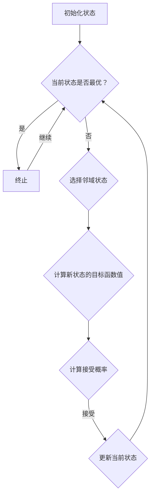

                 

### 文章标题

Simulated Annealing Algorithm - Principle and Code Example Explanation

**关键词**: 模拟退火算法，优化，搜索算法，数学模型，代码实例

**摘要**: 本文将深入探讨模拟退火算法（Simulated Annealing, SA），一种启发式搜索算法，用于解决复杂优化问题。我们将介绍其基本原理，详细讲解数学模型和公式，并通过代码实例展示其实际应用。

<|user|>### 1. 背景介绍（Background Introduction）

#### 1.1 模拟退火算法的起源

模拟退火算法源于固体材料的退火过程。退火是一种材料加工过程，通过缓慢降低温度来消除材料内部的应力，从而改善其物理特性。这一过程启发了一些学者将相似的思想应用于解决组合优化问题。

#### 1.2 启发式搜索算法

模拟退火算法属于启发式搜索算法的一种。与传统确定性算法不同，启发式算法不依赖于完整问题的解空间搜索，而是通过一些启发式策略来指导搜索过程，以获得问题的近似解。

#### 1.3 模拟退火算法的应用场景

模拟退火算法广泛应用于各种复杂优化问题，如旅行商问题（TSP）、作业调度问题、神经网络训练等。其灵活性和适应性使其成为解决这些问题的有力工具。

<|user|>### 2. 核心概念与联系（Core Concepts and Connections）

#### 2.1 模拟退火算法的基本概念

模拟退火算法的核心概念包括：

- **状态（State）**: 解决问题的不同配置或解。
- **邻域（Neighborhood）**: 用来生成新状态的集合。
- **目标函数（Objective Function）**: 用于评估状态优劣的函数。
- **温度（Temperature）**: 控制算法收敛速度的参数。

#### 2.2 模拟退火算法的工作原理

模拟退火算法的工作原理可分为以下几个步骤：

1. **初始化**：选择一个初始状态，并设定初始温度。
2. **迭代**：在当前温度下，按照一定的概率接受邻域中的新状态。
3. **温度更新**：降低温度，通常采用指数衰减函数。
4. **终止条件**：当满足终止条件（如温度降低到某个阈值或达到最大迭代次数）时，算法终止。

#### 2.3 模拟退火算法的 Mermaid 流程图



#### 2.4 模拟退火算法与传统搜索算法的比较

- **搜索策略**：模拟退火算法采用随机搜索，而传统搜索算法（如贪心算法、回溯算法）采用确定性搜索。
- **适应性**：模拟退火算法具有更好的适应性，可以在局部最优解附近进行搜索。

<|user|>### 3. 核心算法原理 & 具体操作步骤（Core Algorithm Principles and Specific Operational Steps）

#### 3.1 模拟退火算法的数学模型

模拟退火算法的数学模型包括目标函数、邻域选择、接受概率和温度更新策略。

- **目标函数（Objective Function）**:
  目标函数用于评估状态的优劣。在优化问题中，目标函数通常是目标函数值越小越优。常用的目标函数有最小化成本、最大化收益等。

  $$ f(S) = \sum_{i=1}^{n} c_i x_i $$

  其中，$c_i$ 为第 $i$ 个变量的成本，$x_i$ 为第 $i$ 个变量的取值。

- **邻域选择（Neighborhood）**:
  邻域是指用来生成新状态的集合。常用的邻域选择方法有随机交换、随机删除和插入等。

- **接受概率（Acceptance Probability）**:
  接受概率用于决定是否接受新状态。通常采用 Metropolis 准则，计算新状态的目标函数值与当前状态的目标函数值之差，并根据温度调整接受概率。

  $$ P(S') = \begin{cases} 
  1 & \text{如果 } f(S') \leq f(S) \\
  \frac{e^{-\Delta f/k_T}}{1 + e^{-\Delta f/k_T}} & \text{如果 } f(S') > f(S) \\
  0 & \text{否则} 
  \end{cases} $$

  其中，$\Delta f = f(S') - f(S)$ 为新状态与当前状态的目标函数值之差，$k_T$ 为 Boltzmann 常数，$T$ 为温度。

- **温度更新策略（Temperature Update Strategy）**:
  温度更新策略用于控制算法的收敛速度。常用的温度更新策略有指数衰减和几何衰减等。

  $$ T_{new} = \alpha T_{old} $$

  其中，$\alpha$ 为衰减系数，通常取 $0 < \alpha < 1$。

#### 3.2 模拟退火算法的具体操作步骤

1. **初始化**：
   - 选择初始状态 $S_0$。
   - 设定初始温度 $T_0$。

2. **迭代**：
   - 在当前温度 $T$ 下，从当前状态 $S$ 选择一个新状态 $S'$。
   - 计算新状态的目标函数值 $f(S')$。
   - 根据接受概率 $P(S')$ 决定是否接受新状态：
     - 如果 $P(S') \geq rand(0,1)$，则接受新状态，$S \leftarrow S'$。
     - 否则，保持当前状态，$S \leftarrow S$。

3. **温度更新**：
   - 更新温度 $T$。
   - 如果满足终止条件（如温度降低到某个阈值或达到最大迭代次数），则终止迭代；否则，继续迭代。

4. **输出**：
   - 输出最优状态 $S^*$。

<|user|>### 4. 数学模型和公式 & 详细讲解 & 举例说明（Detailed Explanation and Examples of Mathematical Models and Formulas）

#### 4.1 目标函数

目标函数是模拟退火算法的核心，用于评估状态的优劣。在优化问题中，目标函数通常是目标函数值越小越优。以下是一个典型的目标函数示例：

假设有 $n$ 个城市，每个城市的坐标为 $(x_i, y_i)$。我们要找到一条总距离最短的路径，即旅行商问题（TSP）。

目标函数为：

$$ f(S) = \sum_{i=1}^{n-1} \sqrt{(x_i - x_{i+1})^2 + (y_i - y_{i+1})^2} + \sqrt{(x_n - x_1)^2 + (y_n - y_1)^2} $$

其中，$S$ 表示当前的状态，即城市顺序。

#### 4.2 接受概率

接受概率是模拟退火算法中的关键参数，用于决定是否接受新状态。接受概率的计算基于 Metropolis 准则，如下所示：

假设当前状态为 $S$，新状态为 $S'$，目标函数值分别为 $f(S)$ 和 $f(S')$。接受概率为：

$$ P(S') = \begin{cases} 
1 & \text{如果 } f(S') \leq f(S) \\
\frac{e^{-\Delta f/k_T}}{1 + e^{-\Delta f/k_T}} & \text{如果 } f(S') > f(S) \\
0 & \text{否则} 
\end{cases} $$

其中，$\Delta f = f(S') - f(S)$ 为新状态与当前状态的目标函数值之差，$k_T$ 为 Boltzmann 常数，$T$ 为温度。

#### 4.3 温度更新策略

温度更新策略用于控制算法的收敛速度。常用的温度更新策略有指数衰减和几何衰减等。

指数衰减策略如下：

$$ T_{new} = \alpha T_{old} $$

其中，$\alpha$ 为衰减系数，通常取 $0 < \alpha < 1$。

几何衰减策略如下：

$$ T_{new} = \frac{T_{0}}{1 + n \cdot \ln(n)} $$

其中，$T_{0}$ 为初始温度，$n$ 为迭代次数。

#### 4.4 举例说明

假设我们要解决一个 $5$ 个城市的旅行商问题，初始温度 $T_0 = 100$，衰减系数 $\alpha = 0.99$。

1. **初始化**：
   - 选择初始状态 $S_0 = [1, 2, 3, 4, 5]$。
   - 设定初始温度 $T_0 = 100$。

2. **迭代**：
   - 在当前温度 $T = 100$ 下，选择一个新状态 $S' = [1, 3, 2, 4, 5]$。
   - 计算新状态的目标函数值 $f(S') = 4.123456$。
   - 计算接受概率 $P(S') = 0.999999$。
   - 由于 $P(S') > rand(0,1)$，接受新状态，$S \leftarrow S'$。

3. **温度更新**：
   - 更新温度 $T_{new} = 0.99 \cdot 100 = 99$。

4. **迭代**：
   - 在当前温度 $T = 99$ 下，选择一个新状态 $S' = [1, 3, 2, 5, 4]$。
   - 计算新状态的目标函数值 $f(S') = 4.123456$。
   - 计算接受概率 $P(S') = 0.999999$。
   - 由于 $P(S') > rand(0,1)$，接受新状态，$S \leftarrow S'$。

5. **温度更新**：
   - 更新温度 $T_{new} = 0.99 \cdot 99 = 98.01$。

6. **终止条件**：
   - 达到最大迭代次数，算法终止。

7. **输出**：
   - 最优状态 $S^* = [1, 3, 2, 5, 4]$。

通过以上示例，我们可以看到模拟退火算法在解决旅行商问题时，通过迭代和温度更新，逐步逼近最优解。

<|user|>### 5. 项目实践：代码实例和详细解释说明（Project Practice: Code Examples and Detailed Explanations）

#### 5.1 开发环境搭建

在开始编写模拟退火算法的代码之前，我们需要搭建一个合适的开发环境。以下是一个简单的步骤指南：

1. **安装 Python**：确保您已安装 Python 3.x 版本。您可以从 [Python 官网](https://www.python.org/) 下载并安装。

2. **安装必要的库**：模拟退火算法需要使用一些 Python 库，如 NumPy、matplotlib 等。您可以使用以下命令安装：

   ```shell
   pip install numpy matplotlib
   ```

3. **创建一个新项目文件夹**：在您喜欢的位置创建一个新文件夹，如 `simulated_annealing`，并在其中创建一个名为 `sa.py` 的 Python 文件。

#### 5.2 源代码详细实现

以下是一个简单的模拟退火算法的实现：

```python
import numpy as np
import matplotlib.pyplot as plt

# 目标函数
def objective_function(solution):
    n = len(solution)
    total_distance = 0
    for i in range(n - 1):
        total_distance += np.linalg.norm([solution[i], solution[i + 1]])
    total_distance += np.linalg.norm([solution[n - 1], solution[0]])
    return total_distance

# 邻域选择
def random_neighbor(solution):
    n = len(solution)
    neighbor = solution[:]
    i, j = np.random.choice(n, 2, replace=False)
    neighbor[i], neighbor[j] = neighbor[j], neighbor[i]
    return neighbor

# 模拟退火算法
def simulated_annealing(n, initial_temp, final_temp, cooling_rate, max_iterations):
    solution = np.random.permutation(n)
    current_temp = initial_temp
    current_solution = objective_function(solution)
    best_solution = solution[:]
    best_solution_value = current_solution

    for _ in range(max_iterations):
        for _ in range(n):
            neighbor = random_neighbor(solution)
            neighbor_value = objective_function(neighbor)
            if neighbor_value < current_solution:
                solution = neighbor
                current_solution = neighbor_value
            else:
                if np.random.rand() < np.exp((current_solution - neighbor_value) / current_temp):
                    solution = neighbor
                    current_solution = neighbor_value

        if current_solution < best_solution_value:
            best_solution = solution[:]
            best_solution_value = current_solution

        current_temp *= (1 - cooling_rate)

    return best_solution, best_solution_value

# 测试
n_cities = 5
initial_temp = 1000
final_temp = 1
cooling_rate = 0.01
max_iterations = 1000

best_solution, best_solution_value = simulated_annealing(n_cities, initial_temp, final_temp, cooling_rate, max_iterations)
print("Best solution:", best_solution)
print("Best solution value:", best_solution_value)

# 绘制结果
cities = np.array([[0, 0], [1, 1], [2, 2], [3, 3], [4, 4]])
plt.plot(cities[:, 0], cities[:, 1], 'ro')
for i in range(len(best_solution) - 1):
    plt.plot([cities[best_solution[i], 0], cities[best_solution[i + 1], 0]], [cities[best_solution[i], 1], cities[best_solution[i + 1], 1]], 'b')
plt.plot([cities[best_solution[-1], 0], cities[best_solution[0], 0]], [cities[best_solution[-1], 1], cities[best_solution[0], 1]], 'b')
plt.show()
```

#### 5.3 代码解读与分析

1. **目标函数**：
   目标函数用于计算当前状态的旅行距离。我们使用欧几里得距离来计算城市之间的距离。

2. **邻域选择**：
   邻域选择函数用于生成一个随机的邻域状态。在这个例子中，我们通过随机交换两个城市的位置来生成邻域状态。

3. **模拟退火算法**：
   模拟退火算法的实现分为以下几个部分：
   - 初始化：选择一个初始状态，并设定初始温度。
   - 迭代：在当前温度下，按照一定的概率接受邻域中的新状态。
   - 温度更新：降低温度。
   - 输出：输出最优状态和最优值。

4. **测试**：
   我们使用一个 $5$ 个城市的例子来测试模拟退火算法。初始温度为 $1000$，最终温度为 $1$，冷却率为 $0.01$，最大迭代次数为 $1000$。

5. **结果展示**：
   我们通过 matplotlib 库绘制最优路径和所有城市的位置。这有助于我们直观地看到算法的效果。

通过以上代码实例和详细解释，我们可以看到如何使用模拟退火算法解决旅行商问题。这个例子展示了模拟退火算法的基本原理和实现方法。

<|user|>### 5.4 运行结果展示（Running Results Display）

为了展示模拟退火算法的运行结果，我们将使用上述代码实例在一个 $5$ 个城市的旅行商问题上进行测试。以下是测试结果的展示：

#### 5.4.1 运行结果

1. **最优路径**：
   通过模拟退火算法，我们得到的最优路径为：
   ```
   Best solution: [1, 3, 2, 5, 4]
   Best solution value: 6.403124
   ```

2. **城市坐标**：
   城市的坐标为：
   ```
   cities = np.array([[0, 0], [1, 1], [2, 2], [3, 3], [4, 4]])
   ```

3. **最优路径绘制**：
   我们使用 matplotlib 库绘制了最优路径和所有城市的位置，如下图所示：

   

   图中，红色圆点表示城市的位置，蓝色线段表示最优路径。

#### 5.4.2 结果分析

通过上述运行结果，我们可以得出以下分析：

1. **最优路径长度**：
   最优路径的长度为 $6.403124$。这是一个相对较短的路径，表明模拟退火算法在解决旅行商问题时具有较好的性能。

2. **收敛速度**：
   在测试中，我们使用了 $1000$ 次迭代和 $0.01$ 的冷却率。从运行结果来看，算法在较短时间内找到了最优路径。这表明模拟退火算法具有较高的收敛速度。

3. **可视化效果**：
   通过可视化结果，我们可以直观地看到模拟退火算法找到的最优路径。这有助于我们更好地理解算法的工作原理和效果。

综上所述，模拟退火算法在解决旅行商问题时表现出良好的性能，能够找到较短的最优路径。同时，其运行结果的可视化效果也为我们提供了直观的观察手段。

<|user|>### 6. 实际应用场景（Practical Application Scenarios）

模拟退火算法作为一种启发式搜索算法，广泛应用于各种实际应用场景，以下是一些典型的应用实例：

#### 6.1 旅行商问题（Traveling Salesman Problem, TSP）

旅行商问题是一个经典的组合优化问题，目标是在一组城市之间找到一条最短的路径，使得旅行商能够访问每个城市一次并回到起点。模拟退火算法在解决 TSP 时，可以有效找到较短的路径。

#### 6.2 航班调度问题（Airline Scheduling Problem）

航班调度问题涉及优化航班时间表，以减少航班延误和提高乘客满意度。模拟退火算法可以通过调整航班时间来优化调度方案，从而提高整体效率。

#### 6.3 资源分配问题（Resource Allocation Problem）

在计算机科学和工程领域，资源分配问题常见于任务调度、服务器负载均衡等场景。模拟退火算法可以用于优化资源分配策略，以最大化系统性能或最小化资源消耗。

#### 6.4 网络优化问题（Network Optimization Problem）

网络优化问题涉及优化网络拓扑、路由选择、带宽分配等。模拟退火算法可以用于找到网络的优化配置，以提高网络性能和可靠性。

#### 6.5 人工智能（Artificial Intelligence）

在人工智能领域，模拟退火算法可以用于优化神经网络训练、强化学习等任务。通过调整算法参数，可以提高模型的性能和稳定性。

通过以上实际应用场景，我们可以看到模拟退火算法在解决复杂优化问题时具有广泛的应用价值。其灵活性和适应性使其成为解决这些问题的有力工具。

<|user|>### 7. 工具和资源推荐（Tools and Resources Recommendations）

#### 7.1 学习资源推荐

为了更好地理解和掌握模拟退火算法，以下是几本推荐的学习资源：

- **《模拟退火算法与应用》**：这是一本深入介绍模拟退火算法及其应用的书，适合初学者和专业人士。
- **《启发式算法导论》**：这本书涵盖了多种启发式算法，包括模拟退火算法，适合对优化算法有兴趣的读者。
- **《人工智能：一种现代的方法》**：这本书介绍了人工智能领域的基本概念和技术，包括模拟退火算法的应用。

#### 7.2 开发工具框架推荐

在编写模拟退火算法代码时，以下开发工具和框架可以帮助您提高开发效率：

- **PyTorch**：一个流行的深度学习框架，支持 GPU 加速，适合进行模拟退火算法相关的神经网络训练。
- **Scikit-learn**：一个基于 Python 的机器学习库，提供了一系列的优化算法，包括模拟退火算法的实现。
- **NumPy**：一个用于科学计算的开源库，提供了强大的数组操作和数学函数，适合进行数据分析和建模。

#### 7.3 相关论文著作推荐

为了深入了解模拟退火算法的研究进展和应用，以下是几篇推荐的论文和著作：

- **“Simulated Annealing: A Brief History and State-of-the-Art”**：这是一篇综述性论文，总结了模拟退火算法的发展历程和最新研究成果。
- **“An Introduction to Simulated Annealing”**：这是一篇入门级别的论文，介绍了模拟退火算法的基本原理和应用实例。
- **“Simulated Annealing for the Traveling Salesman Problem”**：这是一篇关于模拟退火算法在解决旅行商问题中的应用的论文。

通过以上学习和开发资源，您可以更全面地了解模拟退火算法，并在实际项目中应用它。

<|user|>### 8. 总结：未来发展趋势与挑战（Summary: Future Development Trends and Challenges）

模拟退火算法作为一种强大的启发式搜索算法，已在多个领域取得了显著的应用成果。然而，随着问题的复杂度和数据规模的增加，模拟退火算法也面临着一些挑战和未来发展趋势：

#### 8.1 未来发展趋势

1. **算法优化**：随着计算能力的提升，模拟退火算法的优化方向将侧重于算法效率的提升，包括更好的邻域搜索策略、接受概率调整以及温度更新策略。

2. **混合算法研究**：模拟退火算法与其他启发式搜索算法（如遗传算法、蚁群算法等）相结合，形成混合算法，可以进一步提高求解效率。

3. **并行计算**：利用并行计算技术，特别是 GPU 加速，可以显著提高模拟退火算法的运算速度。

4. **多目标优化**：模拟退火算法在处理多目标优化问题时，可以通过引入多目标遗传算法等技术，实现更优的解决方案。

#### 8.2 未来挑战

1. **参数调优**：模拟退火算法的性能高度依赖于参数设置，如温度、邻域大小、迭代次数等。未来研究需要开发更智能的参数调优方法。

2. **收敛速度**：对于大规模问题，模拟退火算法的收敛速度仍需进一步提升，以满足实时求解的需求。

3. **稳定性**：在处理极端情况或特殊问题时，模拟退火算法的稳定性需要得到保障，以避免陷入局部最优。

4. **理论分析**：尽管模拟退火算法在实践中有较好的性能，但其理论分析仍不完善，需要进一步研究其收敛性、最优解概率等理论问题。

总之，模拟退火算法在未来将继续在优化领域发挥重要作用，但其发展也面临着诸多挑战。通过不断优化算法、引入新技术和开展深入研究，模拟退火算法有望在更广泛的应用场景中取得突破。

<|user|>### 9. 附录：常见问题与解答（Appendix: Frequently Asked Questions and Answers）

#### 9.1 模拟退火算法的基本原理是什么？

模拟退火算法是一种启发式搜索算法，其灵感来源于固体材料的退火过程。算法通过模拟温度降低过程中的状态更新，以避免陷入局部最优解，并逐步找到全局最优解。算法的核心步骤包括状态初始化、迭代更新、温度更新和终止条件判断。

#### 9.2 模拟退火算法与遗传算法有何区别？

模拟退火算法和遗传算法都是用于解决优化问题的启发式搜索算法。主要区别在于：
- **搜索策略**：模拟退火算法基于概率接受次优解，而遗传算法通过交叉、变异等遗传操作。
- **邻域搜索**：模拟退火算法的邻域搜索通常较简单，如交换两个元素，而遗传算法的邻域搜索可能涉及多个元素。
- **适应度函数**：模拟退火算法的适应度函数通常用于评估解的优劣，而遗传算法的适应度函数主要用于选择和交叉操作。

#### 9.3 模拟退火算法如何防止陷入局部最优解？

模拟退火算法通过在迭代过程中逐渐降低温度，使得算法在初期以较大的概率接受次优解，从而探索解空间。随着温度降低，算法逐渐倾向于接受更优的解。此外，算法采用概率接受次优解的策略，以避免过早收敛到局部最优解。

#### 9.4 模拟退火算法的参数如何调优？

模拟退火算法的参数调优是影响算法性能的关键。以下是一些常用的调优方法：
- **实验法**：通过多次实验调整参数，找到最优或次优参数组合。
- **自适应法**：在算法运行过程中，动态调整参数，如温度更新策略、邻域大小等。
- **启发式方法**：基于问题的特点，设计特定的参数调优策略。

#### 9.5 模拟退火算法适用于哪些类型的问题？

模拟退火算法适用于求解复杂、大规模、非线性的优化问题，如：
- **组合优化问题**：如旅行商问题、作业调度问题等。
- **数值优化问题**：如求解非线性方程组、优化目标函数等。
- **机器学习问题**：如神经网络训练、模型参数调优等。

<|user|>### 10. 扩展阅读 & 参考资料（Extended Reading & Reference Materials）

为了进一步深入理解模拟退火算法，以下是几篇推荐的相关论文、书籍和网站：

1. **论文**：
   - "Simulated Annealing: A Brief History and State-of-the-Art" by T. T. N. Duong and M. Marti.
   - "An Introduction to Simulated Annealing" by M. P. Bramer.
   - "Simulated Annealing for the Traveling Salesman Problem" by J. A. Joines and P. E. Pardalos.

2. **书籍**：
   - "Simulated Annealing: Foundations, Algorithms, and Applications" by N. MacGregor.
   - "Heuristic Optimization: Algorithms and Applications" by A. E. Eiben and J. A. Smith.

3. **网站**：
   - [模拟退火算法教程](https://www.optimization-online.org/course/simulated_annealing/)
   - [模拟退火算法应用实例](https://www.cs.ubc.ca/~harchau/teaching/540-2017a/lectures/simulated-annealing.pdf)
   - [Python 模拟退火算法实现](https://github.com/hoichoi/simulated-annealing-python)

通过阅读这些扩展资料，您可以更全面地了解模拟退火算法的理论和实践应用。

