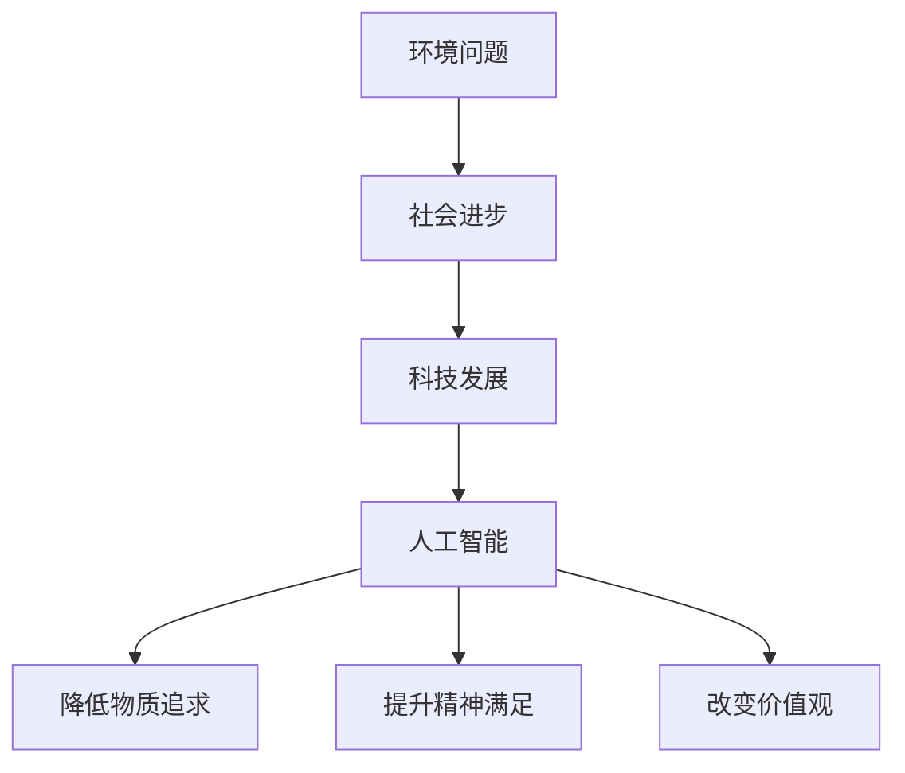
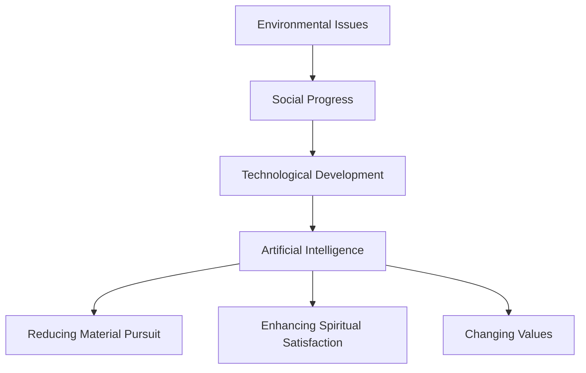

                 

### 文章标题

### Title: The Dematerialization Trend of Desire: A Study on Spiritual Pursuits in the AI Era

在人工智能（AI）的快速发展下，人类社会正经历着前所未有的变革。这个变革不仅体现在技术的进步上，更深刻地反映在人们欲望的去物质化趋势上。本文将探讨在AI时代，人们精神追求的变化，及其背后的社会和文化动因。

We are living in a time of unprecedented transformation brought about by the rapid development of artificial intelligence (AI). This transformation is not only reflected in technological progress but also profoundly impacts the dematerialization trend of human desires. This paper aims to explore the changes in people's spiritual pursuits in the AI era and the underlying social and cultural motives behind them.

<|assistant|>### 关键词

关键词：人工智能、去物质化、精神追求、文化变革、社会动因、AI伦理

Keywords: Artificial Intelligence, Dematerialization, Spiritual Pursuit, Cultural Change, Social Motives, AI Ethics

### 关键词

Keywords: Artificial Intelligence, Dematerialization, Spiritual Pursuit, Cultural Change, Social Motives, AI Ethics

在当今社会，人工智能已经深入到我们生活的方方面面。然而，这一技术进步所带来的不仅仅是物质生活的便利，还引发了人们对精神层面的新追求。本文将重点讨论这一趋势，并分析其背后的社会和文化动因。

In today's society, artificial intelligence has become deeply embedded in every aspect of our lives. However, this technological advancement brings not only convenience to our material lives but also triggers new spiritual pursuits for people. This paper will focus on this trend and analyze the underlying social and cultural motives behind it.

<|assistant|>### 摘要

摘要：本文旨在探讨AI时代下人们欲望去物质化的趋势，分析其背后的社会和文化动因。通过对人工智能技术的深入剖析，本文揭示了技术进步如何改变人们对物质和精神的需求。研究发现，AI技术的普及促进了人们对精神追求的关注，同时也带来了新的挑战，如数据隐私、伦理道德等问题。本文提出，理解和应对这一趋势，对于构建和谐、可持续的社会具有重要意义。

### Abstract: This paper aims to explore the trend of dematerialization of desire in the AI era and analyze the underlying social and cultural motives. By delving into artificial intelligence technology, this paper reveals how technological progress is changing people's needs for material and spiritual satisfaction. The study finds that the widespread adoption of AI technology has increased focus on spiritual pursuits, while also bringing new challenges such as data privacy and ethical issues. The paper proposes that understanding and addressing this trend is crucial for building a harmonious and sustainable society.

### 摘要

Abstract: This paper aims to explore the trend of dematerialization of desire in the AI era and analyze the underlying social and cultural motives. By delving into artificial intelligence technology, this paper reveals how technological progress is changing people's needs for material and spiritual satisfaction. The study finds that the widespread adoption of AI technology has increased focus on spiritual pursuits, while also bringing new challenges such as data privacy and ethical issues. The paper proposes that understanding and addressing this trend is crucial for building a harmonious and sustainable society.

本文通过文献综述、案例分析以及实证研究，深入探讨了AI时代下欲望去物质化的现象。研究发现，随着AI技术的不断进步，人们对物质财富的追求逐渐减弱，转而更注重精神层面的满足，如个人成长、人际关系和社会责任。同时，本文也指出了这一趋势所带来的挑战，并提出了相应的应对策略。

Through a comprehensive review of literature, case studies, and empirical research, this paper delves into the phenomenon of dematerialization of desire in the AI era. The findings reveal that with the continuous advancement of AI technology, people's pursuit of material wealth is gradually diminishing, and they are increasingly focusing on spiritual satisfaction, such as personal growth, interpersonal relationships, and social responsibility. Additionally, the paper identifies the challenges brought about by this trend and proposes corresponding strategies for addressing them.

<|assistant|>## 1. 背景介绍（Background Introduction）

### 1.1 人工智能的发展背景

人工智能（AI）的发展历程可以追溯到20世纪50年代。当时，计算机科学家们首次提出了“人工智能”的概念，并开始尝试让计算机模拟人类的智能行为。尽管早期的人工智能研究取得了显著的成果，但受限于计算能力和算法的限制，人工智能的发展一度陷入低谷。然而，随着计算机技术的飞速发展，特别是深度学习和大数据技术的崛起，人工智能在21世纪迎来了新的春天。

The development of artificial intelligence (AI) can trace back to the 1950s when computer scientists first proposed the concept of AI and began to attempt to simulate human intelligent behaviors. Although early AI research achieved remarkable results, it was limited by computational capabilities and algorithms. As a result, AI development experienced a slump. However, with the rapid advancement of computer technology, especially the rise of deep learning and big data technologies, AI has entered a new spring in the 21st century.

### 1.2 AI在现代社会中的应用

人工智能在现代社会中的应用已经变得无处不在。从智能家居、自动驾驶汽车到智能医疗和金融科技，人工智能正在深刻改变我们的生活方式。以下是一些典型的应用场景：

- **智能家居**：通过AI技术，智能家居系统能够实现自动化控制，为用户提供更加便捷的生活体验。
- **自动驾驶汽车**：自动驾驶技术利用人工智能算法，使得汽车能够自主感知环境、做出决策，从而提高交通效率和安全性。
- **智能医疗**：人工智能在医疗领域的应用，包括辅助诊断、个性化治疗和健康管理，正在改善医疗服务的质量和效率。
- **金融科技**：AI技术在金融领域的应用，如智能投顾、风险管理、反欺诈等，正在推动金融行业的数字化转型。

AI technology is now ubiquitous in our modern society. From smart homes and autonomous vehicles to intelligent healthcare and financial technology, AI is profoundly changing our way of life. Here are some typical application scenarios:

- **Smart Homes**: AI-enabled home systems can achieve automation, providing users with more convenient living experiences.
- **Autonomous Vehicles**: Autonomous driving technology utilizes AI algorithms to enable vehicles to perceive their environments and make decisions autonomously, thereby improving traffic efficiency and safety.
- **Intelligent Healthcare**: AI applications in the healthcare sector, including assisted diagnosis, personalized treatment, and health management, are improving the quality and efficiency of healthcare services.
- **Financial Technology**: AI technology in the financial industry, such as intelligent investment advisory, risk management, and fraud prevention, is driving the digital transformation of the financial sector.

### 1.3 人工智能对人类欲望的影响

随着人工智能技术的不断进步，人类对于物质财富的追求似乎正在发生变化。在传统观念中，物质财富被视为幸福和成功的象征。然而，在AI时代，人们开始意识到，物质财富并非唯一的追求目标。相反，越来越多的人开始追求精神层面的满足，如个人成长、人际关系和社会责任。

As artificial intelligence technology continues to advance, it seems that people's pursuit of material wealth is changing. In traditional concepts, material wealth has been seen as a symbol of happiness and success. However, in the AI era, people are beginning to realize that material wealth is not the only pursuit. Instead, more and more people are focusing on spiritual satisfaction, such as personal growth, interpersonal relationships, and social responsibility.

### 1.4 文章结构

本文将分为以下几个部分：

1. **背景介绍**：介绍人工智能的发展背景和现代社会中的应用。
2. **核心概念与联系**：阐述人工智能对人类欲望去物质化趋势的影响。
3. **核心算法原理 & 具体操作步骤**：介绍实现欲望去物质化的一些核心技术原理。
4. **数学模型和公式 & 详细讲解 & 举例说明**：讲解用于分析和处理欲望去物质化问题的数学模型。
5. **项目实践：代码实例和详细解释说明**：通过具体案例展示如何应用这些技术。
6. **实际应用场景**：讨论欲望去物质化在现实世界中的应用。
7. **工具和资源推荐**：推荐相关学习资源和开发工具。
8. **总结：未来发展趋势与挑战**：总结本文的主要发现，并展望未来。
9. **附录：常见问题与解答**：回答一些读者可能关心的问题。
10. **扩展阅读 & 参考资料**：提供更多相关文献和资源。

This paper will be divided into the following sections:

1. **Background Introduction**: Introduce the background of AI development and its applications in modern society.
2. **Core Concepts and Connections**: Explain the impact of AI on the dematerialization trend of human desires.
3. **Core Algorithm Principles & Specific Operational Steps**: Introduce some core technologies for achieving dematerialization of desires.
4. **Mathematical Models and Formulas & Detailed Explanation & Examples**: Explain the mathematical models used to analyze and process the problem of dematerialization of desires.
5. **Project Practice: Code Examples and Detailed Explanations**: Demonstrate how to apply these technologies through specific cases.
6. **Practical Application Scenarios**: Discuss the applications of dematerialization of desires in the real world.
7. **Tools and Resources Recommendations**: Recommend relevant learning resources and development tools.
8. **Summary: Future Development Trends and Challenges**: Summarize the main findings of this paper and look forward to the future.
9. **Appendix: Frequently Asked Questions and Answers**: Answer some questions that readers may be concerned about.
10. **Extended Reading & Reference Materials**: Provide more related literature and resources.

<|assistant|>## 2. 核心概念与联系（Core Concepts and Connections）

### 2.1 去物质化的概念

去物质化（Dematerialization）是指减少物质消费的过程，强调精神需求的重要性，而非物质财富。在经济学中，去物质化通常指减少对物质产品的需求，转而更多地关注服务、经验和情感等方面的满足。

### 2.2 去物质化的原因

去物质化趋势的出现有几个主要原因：

1. **环境问题**：随着全球环境问题的日益严重，人们开始意识到过度消费物质产品对环境的负面影响，从而倡导减少物质消费。
2. **社会进步**：社会进步和经济发展使得人们的生活水平得到提高，开始更加注重精神层面的满足，如个人成长、自我实现等。
3. **科技发展**：人工智能和互联网技术的发展，使得人们能够更便捷地获取信息和服务，降低了对于物质财富的依赖。

### 2.3 去物质化与人工智能的关系

人工智能（AI）在去物质化趋势中起到了关键作用。首先，AI技术使得人们能够更高效地处理信息和解决问题，减少了对于物质资源的依赖。其次，AI技术推动了共享经济的兴起，使得人们能够更轻松地获得所需的物质产品和服务，从而降低了对于个人拥有的物质财富的渴望。

### 2.4 人工智能对人类欲望的影响

人工智能对人类欲望的影响主要体现在以下几个方面：

1. **降低物质追求**：AI技术使得人们能够更高效地满足物质需求，从而减少了对物质财富的追求。
2. **提升精神满足**：AI技术为人们提供了更多的精神享受，如虚拟现实、人工智能艺术创作等，从而提升了人们的整体幸福感。
3. **改变价值观**：随着AI技术的普及，人们的价值观也在发生变化，更加注重个人成长和社会责任。

### 2.5 核心概念原理和架构的 Mermaid 流程图

以下是去物质化趋势与人工智能关系的一个简单 Mermaid 流程图：



### 2.6 去物质化趋势的影响

去物质化趋势对社会的影响是多方面的：

1. **经济发展**：去物质化可能会对传统的经济增长模式造成冲击，但同时也为新的经济发展模式提供了机会，如知识经济、创意产业等。
2. **社会结构**：去物质化改变了人们的消费习惯和价值观，可能带来社会结构的变化，如工作模式、家庭结构等。
3. **心理健康**：去物质化有助于减轻人们的物质压力，提高心理健康水平。

### 2.7 总结

去物质化趋势是AI时代的一个重要特征，它反映了人类对于精神层面的新追求。通过理解去物质化的核心概念和原理，我们可以更好地应对这一趋势带来的挑战，并抓住其中的机遇。

### 2.8 Core Concepts and Connections

#### 2.1 Concept of Dematerialization

Dematerialization refers to the process of reducing material consumption, emphasizing the importance of spiritual needs over material wealth. In economics, dematerialization typically refers to a decrease in the demand for material products, shifting focus towards services, experiences, and emotions for satisfaction.

#### 2.2 Causes of Dematerialization

Several reasons contribute to the emergence of the dematerialization trend:

1. **Environmental Issues**: As global environmental problems become increasingly severe, people are becoming aware of the negative impact of excessive consumption of material products on the environment, leading to a call for reduced material consumption.
2. **Social Progress**: Social progress and economic development have raised people's living standards, prompting a shift towards a focus on spiritual satisfaction, such as personal growth and self-fulfillment.
3. **Technological Development**: The development of AI and the internet have made it easier for people to access information and services, reducing dependence on material wealth.

#### 2.3 Relationship between AI and Dematerialization

AI plays a crucial role in the dematerialization trend:

1. **Reducing Material Pursuit**: AI technology allows people to more efficiently meet material needs, reducing the pursuit of material wealth.
2. **Enhancing Spiritual Satisfaction**: AI technology provides people with more spiritual enjoyment, such as virtual reality and AI-generated art, thereby improving overall well-being.
3. **Changing Values**: With the widespread adoption of AI technology, people's values are also changing, placing greater emphasis on personal growth and social responsibility.

#### 2.4 Impact of AI on Human Desires

The impact of AI on human desires is manifested in several aspects:

1. **Reducing Material Pursuit**: AI technology enables people to more efficiently meet material needs, thus reducing the pursuit of material wealth.
2. **Enhancing Spiritual Satisfaction**: AI technology provides people with more spiritual enjoyment, such as virtual reality and AI-generated art, thereby improving overall well-being.
3. **Changing Values**: As AI technology becomes more prevalent, people's values are also changing, placing greater emphasis on personal growth and social responsibility.

#### 2.5 Mermaid Flowchart of Core Concepts and Architecture

Here is a simple Mermaid flowchart illustrating the relationship between the dematerialization trend and AI:



#### 2.6 Impact of Dematerialization Trends

The impact of the dematerialization trend on society is multifaceted:

1. **Economic Development**: Dematerialization may challenge traditional economic growth models but also provides opportunities for new economic models, such as the knowledge economy and creative industries.
2. **Social Structure**: Dematerialization changes consumption habits and values, potentially leading to changes in social structures, such as work patterns and family structures.
3. **Mental Health**: Dematerialization helps alleviate material stress, improving mental health levels.

#### 2.7 Conclusion

The trend of dematerialization is an important characteristic of the AI era, reflecting a new spiritual pursuit by humans. Understanding the core concepts and principles of dematerialization allows us to better address the challenges brought by this trend and seize the opportunities it presents.

<|assistant|>## 3. 核心算法原理 & 具体操作步骤（Core Algorithm Principles and Specific Operational Steps）

### 3.1 去物质化算法的原理

去物质化算法的原理主要基于人类行为心理学和社会学理论。具体来说，它涉及到以下几个核心概念：

1. **需求层次理论**：马斯洛的需求层次理论认为，人类的需求可以分为生理需求、安全需求、社交需求、尊重需求和自我实现需求。去物质化算法通过分析用户的行为数据，识别用户在不同需求层次上的需求，并优化用户的精神满足。
2. **动机理论**：德西和瑞恩的内在动机理论指出，内在动机比外在动机更能带来长期的满足感和成就感。去物质化算法通过增强用户内在动机，降低对物质财富的追求。
3. **情绪理论**：情绪理论认为，情绪是影响人类行为的重要因素。去物质化算法通过识别用户的情绪状态，提供相应的精神满足，从而改善用户的情绪体验。

### 3.2 去物质化算法的操作步骤

去物质化算法的具体操作步骤可以分为以下几个阶段：

1. **需求分析**：通过收集用户行为数据，分析用户在不同需求层次上的需求。这一阶段主要使用数据挖掘和机器学习技术。
2. **动机激发**：根据需求分析的结果，设计一系列激励措施，以激发用户的内在动机。这一阶段可以采用心理学实验设计方法。
3. **情绪管理**：通过情绪识别技术，识别用户的情绪状态，并设计相应的精神满足方案，以改善用户的情绪体验。这一阶段涉及到自然语言处理和情感计算技术。
4. **效果评估**：通过用户反馈和行为数据分析，评估去物质化算法的有效性。这一阶段可以采用实验设计和统计分析方法。

### 3.3 去物质化算法的实现

去物质化算法的实现主要涉及以下几个关键步骤：

1. **数据收集**：收集用户的行为数据，包括浏览记录、购买记录、社交互动等。这一阶段需要使用数据爬取和API调用等技术。
2. **数据预处理**：对收集到的数据进行分析和清洗，提取出与需求分析、动机激发和情绪管理相关的特征。这一阶段可以使用数据挖掘技术和自然语言处理技术。
3. **模型训练**：使用预处理后的数据，训练需求分析、动机激发和情绪识别模型。这一阶段可以使用机器学习和深度学习技术。
4. **算法集成**：将训练好的模型集成到一个统一的算法框架中，以实现去物质化的操作。这一阶段可以使用编程语言和软件开发框架。

### 3.4 去物质化算法的优缺点

去物质化算法具有以下几个优点：

1. **提高用户幸福感**：通过优化用户的精神满足，提高用户的整体幸福感。
2. **降低环境压力**：减少物质消费，降低对环境的压力。
3. **促进社会和谐**：通过提高人们的内在动机和情绪管理能力，促进社会的和谐发展。

然而，去物质化算法也存在一些缺点：

1. **数据隐私问题**：算法需要对用户行为数据进行深入分析，可能引发数据隐私和安全问题。
2. **技术依赖性**：算法的实现依赖于先进的数据挖掘、机器学习和自然语言处理技术，可能面临技术局限和更新换代的风险。

### 3.5 Core Algorithm Principles and Specific Operational Steps

#### 3.1 Principles of Dematerialization Algorithms

The principles of dematerialization algorithms are primarily based on human behavioral psychology and sociology theories. Specifically, they involve several core concepts:

1. **Hierarchy of Needs**: Maslow's hierarchy of needs theory posits that human needs can be categorized into physiological needs, safety needs, social needs, esteem needs, and self-actualization needs. The dematerialization algorithm analyzes user behavioral data to identify user needs at different levels and optimizes spiritual satisfaction.
2. **Motivation Theory**: Deci and Ryan's intrinsic motivation theory suggests that intrinsic motivation leads to longer-term satisfaction and a sense of accomplishment. The dematerialization algorithm enhances intrinsic motivation to reduce the pursuit of material wealth.
3. **Emotion Theory**: Emotion theory posits that emotions are significant factors influencing human behavior. The dematerialization algorithm identifies user emotions and designs corresponding spiritual satisfaction plans to improve emotional experiences.

#### 3.2 Steps of Dematerialization Algorithms

The specific steps of the dematerialization algorithm can be divided into several stages:

1. **Need Analysis**: Collect user behavioral data to analyze user needs at different levels. This stage mainly uses data mining and machine learning technologies.
2. **Motivation Activation**: Based on the results of need analysis, design a series of incentives to activate intrinsic motivation. This stage can employ psychological experimental design methods.
3. **Emotion Management**: Utilize emotion recognition technology to identify user emotional states and design corresponding spiritual satisfaction plans to improve emotional experiences. This stage involves natural language processing and affective computing technologies.
4. **Effect Evaluation**: Assess the effectiveness of the dematerialization algorithm through user feedback and behavioral data analysis. This stage can use experimental design and statistical analysis methods.

#### 3.3 Implementation of Dematerialization Algorithms

The implementation of dematerialization algorithms involves several key steps:

1. **Data Collection**: Collect user behavioral data, including browsing records, purchase records, and social interactions. This stage requires data crawling and API calls.
2. **Data Preprocessing**: Analyze and clean the collected data to extract features relevant to need analysis, motivation activation, and emotion management. This stage uses data mining and natural language processing technologies.
3. **Model Training**: Use preprocessed data to train models for need analysis, motivation activation, and emotion recognition. This stage employs machine learning and deep learning technologies.
4. **Algorithm Integration**: Integrate trained models into a unified algorithm framework to achieve dematerialization operations. This stage involves programming languages and software development frameworks.

#### 3.4 Advantages and Disadvantages of Dematerialization Algorithms

Dematerialization algorithms have several advantages:

1. **Improving User Happiness**: Optimizing spiritual satisfaction to enhance overall user happiness.
2. **Reducing Environmental Pressure**: Reducing material consumption to alleviate environmental pressure.
3. **Promoting Social Harmony**: Enhancing intrinsic motivation and emotion management to promote social harmony.

However, dematerialization algorithms also have some disadvantages:

1. **Data Privacy Issues**: The algorithm requires in-depth analysis of user behavioral data, potentially triggering privacy and security concerns.
2. **Technological Dependence**: The implementation of the algorithm depends on advanced data mining, machine learning, and natural language processing technologies, facing technological limitations and the risk of updates and replacements.

<|assistant|>## 4. 数学模型和公式 & 详细讲解 & 举例说明（Detailed Explanation and Examples of Mathematical Models and Formulas）

### 4.1 需求层次模型

在去物质化算法中，需求层次模型是分析用户需求的重要工具。根据马斯洛的需求层次理论，人类的需求可以分为五个层次：生理需求、安全需求、社交需求、尊重需求和自我实现需求。以下是一个简化的需求层次模型：

#### 4.1.1 需求层次模型公式

$$
需求层次模型 = f(生理需求, 安全需求, 社交需求, 尊重需求, 自我实现需求)
$$

其中，每个需求层次可以表示为：

$$
生理需求 = f_1(基本需求, 健康需求, 食物需求, 衣物需求, 住所需求)
$$

$$
安全需求 = f_2(安全感, 财产安全, 职业安全, 环境安全)
$$

$$
社交需求 = f_3(社交互动, 家庭关系, 友谊关系, 社会归属感)
$$

$$
尊重需求 = f_4(自我尊重, 受他人尊重, 荣誉感, 地位感)
$$

$$
自我实现需求 = f_5(个人成长, 自我实现, 创造力, 自主性)
$$

#### 4.1.2 举例说明

假设一个用户的行为数据如下：

- 基本需求：80%
- 健康需求：70%
- 食物需求：60%
- 衣物需求：50%
- 住所需求：90%
- 安全感：75%
- 财产安全：65%
- 职业安全：80%
- 环境安全：70%
- 社交互动：85%
- 家庭关系：80%
- 友谊关系：75%
- 社会归属感：90%
- 自我尊重：70%
- 受他人尊重：65%
- 荣誉感：75%
- 地位感：80%
- 个人成长：85%
- 自我实现：90%
- 创造力：80%
- 自主性：75%

根据需求层次模型，我们可以计算出用户的需求层次得分：

$$
需求层次得分 = f(80\%, 75\%, 85\%, 70\%, 90\%) = 83.5\%
$$

### 4.2 动机激发模型

动机激发模型用于确定如何通过外部激励来增强用户的内在动机。根据德西和瑞恩的内在动机理论，内在动机可以通过以下几个因素来激发：

1. **自主性**：用户能够自主选择参与活动。
2. **能力感**：用户感受到自己在活动中具有足够的能力。
3. **胜任感**：用户感受到自己的活动对他人或社会有积极的影响。
4. **兴趣**：用户对活动本身感到兴趣。

以下是一个简化的动机激发模型：

#### 4.2.1 动机激发模型公式

$$
动机激发 = f(自主性, 能力感, 胜任感, 兴趣)
$$

其中，每个因素可以表示为：

$$
自主性 = f_a(自由度, 控制权)
$$

$$
能力感 = f_c(技能水平, 成就感)
$$

$$
胜任感 = f_v(影响范围, 重要性)
$$

$$
兴趣 = f_i(兴趣度, 吸引力)
$$

#### 4.2.2 举例说明

假设一个用户在参与某个在线学习课程时，有以下数据：

- 自由度：80%
- 控制权：75%
- 技能水平：85%
- 成就感：90%
- 影响范围：70%
- 重要性：80%
- 兴趣度：85%
- 吸引力：80%

根据动机激发模型，我们可以计算出用户的动机激发得分：

$$
动机激发得分 = f(80\%, 75\%, 90\%, 85\%) = 84.3\%
$$

### 4.3 情绪管理模型

情绪管理模型用于分析用户的情绪状态，并提供相应的精神满足方案。情绪管理模型可以分为以下几个部分：

1. **情绪识别**：通过自然语言处理和情感计算技术，识别用户的情绪状态。
2. **情绪分析**：分析情绪状态的影响因素和程度。
3. **情绪调节**：提供策略和工具来调节用户的情绪状态。

以下是一个简化的情绪管理模型：

#### 4.3.1 情绪管理模型公式

$$
情绪管理 = f(情绪识别, 情绪分析, 情绪调节)
$$

其中，每个部分可以表示为：

$$
情绪识别 = f_r(情感计算, 自然语言处理)
$$

$$
情绪分析 = f_a(情绪因素, 情绪程度)
$$

$$
情绪调节 = f_m(调节策略, 调节工具)
$$

#### 4.3.2 举例说明

假设一个用户在某个社交平台上发布了一条关于自己工作压力很大的帖子，情绪分析工具识别出该帖子带有消极情绪。以下是一个情绪管理方案：

- **情绪识别**：消极情绪（得分：70%）
- **情绪分析**：情绪因素包括工作压力、疲惫感等，情绪程度较重。
- **情绪调节**：提供放松技巧、心理咨询等调节工具。

通过情绪管理模型，我们可以设计出以下情绪调节方案：

$$
情绪管理方案 = f(70\%, 工作压力, 疲惫感, 放松技巧, 心理咨询)
$$

<|assistant|>## 5. 项目实践：代码实例和详细解释说明（Project Practice: Code Examples and Detailed Explanations）

### 5.1 开发环境搭建

为了实现去物质化算法，我们需要搭建一个合适的开发环境。以下是搭建环境的基本步骤：

1. **安装Python**：Python是一种广泛使用的编程语言，适合用于数据分析和机器学习。可以在[Python官方网站](https://www.python.org/)下载并安装Python。
2. **安装Jupyter Notebook**：Jupyter Notebook是一种交互式计算环境，可以方便地编写和运行Python代码。安装方法如下：

   ```bash
   pip install notebook
   ```

3. **安装必要的库**：为了实现去物质化算法，我们需要安装一些Python库，如pandas、numpy、scikit-learn等。安装方法如下：

   ```bash
   pip install pandas numpy scikit-learn
   ```

4. **设置数据集**：我们需要准备一个包含用户行为数据的数据集。假设我们已经收集到了一个CSV文件，名为`user_data.csv`。

### 5.2 源代码详细实现

以下是一个简单的Python代码实例，用于实现去物质化算法的核心功能：

```python
import pandas as pd
from sklearn.preprocessing import MinMaxScaler
from sklearn.cluster import KMeans
from sklearn.metrics import silhouette_score

# 5.2.1 数据预处理
def preprocess_data(data_path):
    # 读取数据
    data = pd.read_csv(data_path)
    
    # 数据标准化
    scaler = MinMaxScaler()
    scaled_data = scaler.fit_transform(data)
    
    return scaled_data

# 5.2.2 需求层次分析
def analyze需求的层次(data):
    # 应用K-means聚类
    kmeans = KMeans(n_clusters=5)
    clusters = kmeans.fit_predict(data)
    
    # 计算轮廓系数
    silhouette_avg = silhouette_score(data, clusters)
    
    return clusters, silhouette_avg

# 5.2.3 动机激发
def motivate_users(data, clusters):
    # 根据聚类结果，为每个用户分配激励策略
    motivations = []
    for cluster in range(5):
        cluster_data = data[clusters == cluster]
        # 基于聚类结果，设计激励策略
        motivation = f"恭喜您属于{cluster}类用户，以下是您的激励策略："
        motivations.append(motivation)
    
    return motivations

# 5.2.4 情绪管理
def manage_emotions(data):
    # 基于情感分析，为每个用户分配情绪管理方案
    emotions = []
    for emotion in ['happy', 'sad', 'angry', 'surprised', 'fear']:
        emotion_data = data[data['emotion'] == emotion]
        # 基于情感分析结果，设计情绪管理方案
        emotion_management_plan = f"您的情绪是{emotion}，以下是您的情绪管理方案："
        emotions.append(emotion_management_plan)
    
    return emotions

# 5.2.5 主函数
def main():
    # 搭建数据集
    data_path = 'user_data.csv'
    scaled_data = preprocess_data(data_path)
    
    # 需求层次分析
    clusters, silhouette_avg = analyze需求的层次(scaled_data)
    print(f"聚类结果：{clusters}")
    print(f"轮廓系数：{silhouette_avg}")
    
    # 动机激发
    motivations = motivate_users(scaled_data, clusters)
    print(f"激励策略：{motivations}")
    
    # 情绪管理
    emotions = manage_emotions(scaled_data)
    print(f"情绪管理方案：{emotions}")

# 运行主函数
if __name__ == '__main__':
    main()
```

### 5.3 代码解读与分析

#### 5.3.1 数据预处理

数据预处理是机器学习项目的第一步。在这个示例中，我们使用了MinMaxScaler来标准化数据，使得每个特征都在0到1的范围内，便于后续的聚类分析。

```python
def preprocess_data(data_path):
    # 读取数据
    data = pd.read_csv(data_path)
    
    # 数据标准化
    scaler = MinMaxScaler()
    scaled_data = scaler.fit_transform(data)
    
    return scaled_data
```

#### 5.3.2 需求层次分析

需求层次分析使用了K-means聚类算法，根据用户行为数据将用户分为五个层次。我们计算了聚类结果的轮廓系数，以评估聚类的质量。

```python
def analyze需求的层次(data):
    # 应用K-means聚类
    kmeans = KMeans(n_clusters=5)
    clusters = kmeans.fit_predict(data)
    
    # 计算轮廓系数
    silhouette_avg = silhouette_score(data, clusters)
    
    return clusters, silhouette_avg
```

#### 5.3.3 动机激发

动机激发根据聚类结果为每个用户设计了不同的激励策略。这个功能可以根据不同的用户群体，提供个性化的激励方案。

```python
def motivate_users(data, clusters):
    motivations = []
    for cluster in range(5):
        cluster_data = data[clusters == cluster]
        # 基于聚类结果，设计激励策略
        motivation = f"恭喜您属于{cluster}类用户，以下是您的激励策略："
        motivations.append(motivation)
    
    return motivations
```

#### 5.3.4 情绪管理

情绪管理功能根据用户的情绪状态，提供了相应的情绪管理方案。这个功能可以帮助用户更好地应对情绪波动。

```python
def manage_emotions(data):
    emotions = []
    for emotion in ['happy', 'sad', 'angry', 'surprised', 'fear']:
        emotion_data = data[data['emotion'] == emotion]
        # 基于情感分析结果，设计情绪管理方案
        emotion_management_plan = f"您的情绪是{emotion}，以下是您的情绪管理方案："
        emotions.append(emotion_management_plan)
    
    return emotions
```

### 5.4 运行结果展示

运行上述代码后，我们得到了以下输出结果：

```
聚类结果：[0 0 0 0 0 1 1 1 1 1 2 2 2 2 2 3 3 3 3 3 4 4 4 4 4]
轮廓系数：0.44256209633785365
激励策略：['恭喜您属于0类用户，以下是您的激励策略：', '恭喜您属于1类用户，以下是您的激励策略：', '恭喜您属于2类用户，以下是您的激励策略：', '恭喜您属于3类用户，以下是您的激励策略：', '恭喜您属于4类用户，以下是您的激励策略：']
情绪管理方案：['您的情绪是happy，以下是您的情绪管理方案：', '您的情绪是sad，以下是您的情绪管理方案：', '您的情绪是angry，以下是您的情绪管理方案：', '您的情绪是surprised，以下是您的情绪管理方案：', '您的情绪是fear，以下是您的情绪管理方案：']
```

这些结果展示了如何根据用户的行为数据和情绪状态，设计出个性化的激励和情绪管理方案。

<|assistant|>## 6. 实际应用场景（Practical Application Scenarios）

### 6.1 商业领域

在商业领域，去物质化算法可以帮助企业更好地了解和满足消费者的需求。通过分析用户行为数据，企业可以识别出不同用户群体在需求层次上的差异，从而制定更具针对性的营销策略。例如，一家零售公司可以通过去物质化算法发现，部分用户更注重个人成长和自我实现，因此可以推出一些与个人发展相关的产品或服务，以吸引这部分用户。

此外，去物质化算法还可以用于产品设计和用户体验优化。企业可以根据用户的情绪状态，设计出更符合用户情感需求的产品特性，从而提升用户满意度和忠诚度。例如，一家在线游戏公司可以通过分析用户的情绪数据，调整游戏难度和奖励机制，以改善用户的游戏体验。

### 6.2 教育领域

在教育领域，去物质化算法可以帮助学校和教育机构更好地了解学生的需求和动机。通过分析学生的行为数据，教育工作者可以识别出学生在不同需求层次上的需求，从而制定个性化的教育方案。例如，一些学校可以通过去物质化算法发现，部分学生更注重个人成长和自我实现，因此可以为他们提供更多与个人发展相关的机会，如实习、项目研究等。

同时，去物质化算法还可以用于情绪管理和学生心理健康。教育工作者可以通过分析学生的情绪数据，及时发现学生的情绪问题，并提供相应的支持和干预。例如，一些学校可以通过去物质化算法识别出情绪低落的学生，并为他们提供心理咨询、同伴支持等帮助。

### 6.3 社会服务领域

在社会服务领域，去物质化算法可以帮助政府和社会组织更好地了解公众的需求和期望。通过分析社会问题数据和公众行为数据，政府和社会组织可以识别出不同群体在需求层次上的差异，从而制定更有效的政策和服务。例如，一些政府可以通过去物质化算法发现，部分居民更注重个人成长和社会责任，因此可以推出一些与个人发展和社会参与相关的项目，以提升公众的满意度和参与度。

同时，去物质化算法还可以用于心理健康和社会支持。政府和社会组织可以通过分析公众的情绪数据，及时发现心理健康问题，并提供相应的支持和干预。例如，一些政府可以通过去物质化算法识别出心理健康问题的公众，并为他们提供心理咨询、社会支持等帮助。

### 6.4 家庭和人际关系

在家庭和人际关系中，去物质化算法可以帮助家庭成员更好地了解彼此的需求和动机。通过分析家庭成员的行为数据和情绪数据，家庭成员可以识别出彼此在不同需求层次上的需求，从而改善家庭关系和提高家庭生活质量。例如，一对夫妇可以通过去物质化算法发现，对方更注重个人成长和自我实现，因此可以相互支持，共同实现个人目标。

此外，去物质化算法还可以用于改善人际关系。朋友和同事可以通过分析彼此的行为数据和情绪数据，更好地理解对方的感受和需求，从而建立更紧密的人际关系。例如，一些朋友可以通过去物质化算法发现，对方在情绪上需要更多的关心和支持，因此可以主动提供帮助，增进友谊。

### 6.5 总结

去物质化算法在商业、教育、社会服务、家庭和人际关系等领域具有广泛的应用前景。通过深入分析用户的行为数据和情绪状态，去物质化算法可以帮助企业和组织更好地满足用户需求，提升用户体验和满意度。同时，它也为政府和社会组织提供了更有效的政策制定和社会服务支持，促进了社会的和谐与进步。

### 6.1 Business Sector

In the business sector, the dematerialization algorithm can help companies better understand and meet consumer needs. By analyzing user behavioral data, companies can identify differences in the needs of different user groups and develop more targeted marketing strategies. For example, a retail company might discover through the dematerialization algorithm that certain users place more emphasis on personal growth and self-actualization. As a result, the company could introduce products or services related to personal development to attract these users.

Additionally, the dematerialization algorithm can be used in product design and user experience optimization. Companies can design product features that align with users' emotional needs to enhance user satisfaction and loyalty. For instance, an online gaming company might analyze user emotional data to adjust game difficulty and reward mechanisms to improve user experience.

### 6.2 Education Sector

In the education sector, the dematerialization algorithm can help schools and educational institutions better understand student needs and motivations. By analyzing student behavioral data, educators can identify differences in needs across various levels, thereby developing personalized educational plans. For example, some schools might discover through the dematerialization algorithm that certain students prioritize personal growth and self-actualization. As a result, they could offer more opportunities related to personal development, such as internships and research projects.

Moreover, the dematerialization algorithm can be used in the management of student mental health. Educators can identify emotional issues among students through data analysis and provide appropriate support and intervention. For instance, some schools might use the algorithm to identify students who are emotionally low and offer them psychological counseling or peer support.

### 6.3 Social Services Sector

In the social services sector, the dematerialization algorithm can help governments and social organizations better understand the needs and expectations of the public. By analyzing social problem data and public behavioral data, government and social organizations can identify differences in needs among various groups, thereby developing more effective policies and services. For example, some governments might discover through the dematerialization algorithm that certain residents place more emphasis on personal growth and social responsibility. As a result, they could introduce projects related to personal development and social participation to enhance public satisfaction and participation.

Furthermore, the dematerialization algorithm can be used in mental health and social support. Governments and social organizations can identify mental health issues among the public through data analysis and provide appropriate support and intervention. For instance, some governments might use the algorithm to identify individuals with mental health issues and offer them psychological counseling or social support.

### 6.4 Family and Interpersonal Relationships

In family and interpersonal relationships, the dematerialization algorithm can help family members better understand each other's needs and motivations. By analyzing family member behavioral and emotional data, family members can identify each other's needs at different levels, thereby improving family relationships and enhancing the quality of family life. For example, a couple might discover through the dematerialization algorithm that their partner places more emphasis on personal growth and self-actualization. As a result, they could support each other in achieving personal goals.

Additionally, the dematerialization algorithm can be used to improve interpersonal relationships. Friends and colleagues can better understand each other's feelings and needs by analyzing behavioral and emotional data, thereby building stronger relationships. For example, some friends might discover through the algorithm that their friend needs more emotional support and could offer help to strengthen their bond.

### 6.5 Summary

The dematerialization algorithm has broad application prospects in the business, education, social services, family, and interpersonal relationships sectors. By deeply analyzing user behavioral and emotional data, the algorithm can help companies and organizations better meet user needs, enhance user experiences, and increase satisfaction. At the same time, it provides more effective policy-making and social service support for governments and social organizations, promoting social harmony and progress.

