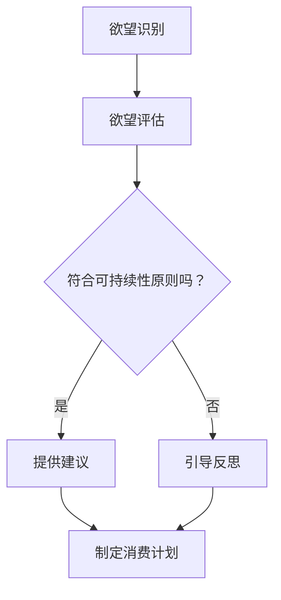
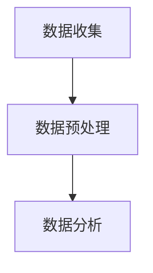
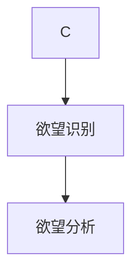
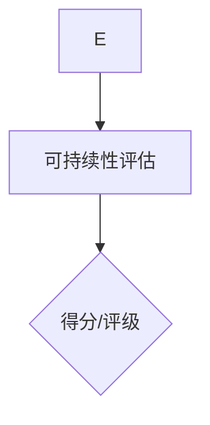
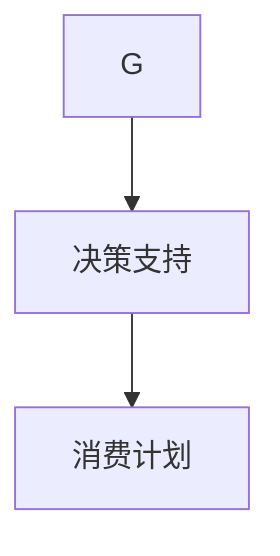

                 

### 欲望可持续性评估员：AI时代的消费伦理指南编撰者

#### 关键词：
- 欲望可持续性
- AI时代
- 消费伦理
- 指南编撰

#### 摘要：
本文探讨了AI时代消费伦理的重要性，特别是在处理消费者欲望方面。我们提出了一个新的角色——欲望可持续性评估员，并阐述了他们在制定和推广可持续消费伦理指南中的关键作用。文章将分析该角色的职责、所需技能，以及如何在实践中应用这些指南，以实现更加公平和可持续的消费模式。

---

在人工智能迅速发展的今天，消费行为正在经历深刻的变革。消费者的欲望变得越来越复杂，而市场则不断被新的技术和产品所驱动。在这种背景下，如何确保消费行为既满足个人需求，又不会对环境和社会造成负面影响，成为了一个亟待解决的问题。本文旨在探讨在AI时代，如何通过建立一个全新的角色——欲望可持续性评估员，来编撰消费伦理指南，引导消费者实现可持续的消费模式。

### 引言

消费伦理是一个涉及道德、环境和社会责任的问题。它关注的是消费者在购买和使用商品或服务时，如何平衡个人利益与对环境和社会的负面影响。随着AI技术的广泛应用，消费行为变得更加个性化和复杂化。消费者不仅能够通过个性化的推荐系统获取他们感兴趣的商品，还可以通过社交媒体平台分享和表达他们的购买决策。

然而，这种个性化消费模式的快速发展也带来了一系列挑战。首先，消费者可能会陷入无尽的购买循环，无法自拔地追求最新的科技产品或时尚潮流。这种欲望的无节制追求，不仅可能导致资源浪费和环境破坏，还可能加剧社会不平等。其次，消费者在AI系统的引导下，可能会失去自主决策的能力，过度依赖算法推荐，从而忽视了自身真正的需求。

因此，在这个AI驱动的消费时代，我们需要一个新的角色——欲望可持续性评估员，来帮助消费者理解和评估他们的欲望，并引导他们做出更加可持续的消费决策。这个角色的职责将包括评估消费行为的可持续性、制定消费伦理指南、以及推广这些指南，以促进更加公平和可持续的消费模式。

### 背景介绍

在AI时代，消费者的欲望呈现出以下几个显著特征：

1. **个性化**：AI技术使得消费者能够获得高度个性化的购物体验。通过收集和分析消费者行为数据，AI系统能够精准预测消费者的兴趣和需求，并提供定制化的产品推荐。

2. **快速变化**：消费者对科技产品、时尚潮流的追求往往具有快速变化的特点。例如，智能手机的更新换代速度极快，消费者可能每隔几年就会更换最新的型号。

3. **情绪化**：社交媒体的普及使得消费者的购物决策受到情感驱动的影响。用户在社交媒体上分享购物体验和心得，形成了强大的社交影响力，进一步刺激了消费欲望。

4. **不自觉**：AI系统通过个性化的推荐算法，能够巧妙地引导消费者在不经意间购买他们并不真正需要的产品。这种现象被称为“无意购买”，是消费者在AI引导下做出非理性决策的一个表现。

这些特征使得消费者的欲望变得复杂而多变，同时也对消费伦理提出了新的挑战。为了应对这些挑战，我们需要一个新的角色来引导消费者，使他们能够在追求个性化消费的同时，保持对自己欲望的清醒认知，并做出更加可持续的消费决策。

### 核心概念与联系

为了更好地理解欲望可持续性评估员的角色和职责，我们需要明确几个核心概念，并探讨它们之间的联系。

#### 1. 欲望（Desire）

欲望是消费者内心对某种产品或服务的强烈渴望。它可以是个性化的，也可以是社会化的。在AI时代，欲望往往被算法和个性化推荐系统放大和强化。例如，一个消费者可能在看到多个社交媒体朋友使用某款新型智能手机后，产生强烈的购买欲望。

#### 2. 可持续性（Sustainability）

可持续性是指满足当前需求而不损害子孙后代满足其需求的能力。在消费领域，可持续性涉及资源利用、环境影响和社会责任。一个可持续的消费模式应能够平衡个人利益与对环境和社会的负面影响。

#### 3. 消费伦理（Consumption Ethics）

消费伦理是关于消费者在购买和使用商品或服务时应当遵循的道德原则和价值观。它关注的是消费行为对社会、环境和经济的影响，并倡导消费者在追求个人利益的同时，考虑更广泛的社会责任。

#### 4. 评估员（Evaluator）

评估员是一个专业的角色，负责对某个领域的事物进行评估和判断。在欲望可持续性评估员的语境中，评估员负责评估消费者的欲望是否符合可持续性原则，并提供建议和指导。

#### 关系与联系

欲望可持续性评估员的角色建立在以上核心概念之上。他们需要理解消费者的欲望，评估这些欲望的可持续性，并在必要时提供指导，帮助消费者做出更加理性的消费决策。

#### 5. Mermaid 流程图

以下是一个简单的 Mermaid 流程图，展示了欲望可持续性评估员的核心概念和流程：



在这个流程图中，欲望识别是评估过程的第一步，接下来是欲望评估。如果欲望符合可持续性原则，评估员会提供建议，帮助消费者制定消费计划。如果欲望不符合可持续性原则，评估员会引导消费者进行反思，帮助他们重新评估自己的消费需求。

通过以上核心概念和流程的阐述，我们可以更好地理解欲望可持续性评估员的职责和作用，为他们制定和推广可持续消费伦理指南奠定基础。

### 核心算法原理 & 具体操作步骤

为了实现欲望可持续性评估，我们需要一套科学的方法和工具来评估消费者的欲望是否符合可持续性原则。以下将介绍核心算法原理和具体操作步骤。

#### 1. 算法原理

欲望可持续性评估算法基于以下几个核心原则：

- **数据分析**：收集和分析消费者的行为数据，包括购物历史、搜索记录、社交媒体活动等，以了解消费者的购买偏好和消费习惯。
- **可持续性评估标准**：制定一套可持续性评估标准，包括环境影响、社会责任和经济效益等方面。这些标准将作为评估消费者欲望的依据。
- **决策支持**：利用机器学习和自然语言处理技术，分析消费者的欲望描述，判断其是否符合可持续性原则，并提供相应的建议。

#### 2. 具体操作步骤

以下是一个典型的欲望可持续性评估过程：

##### 步骤 1：数据收集与预处理

- 收集消费者的行为数据，如购物记录、搜索历史、社交媒体活动等。
- 数据预处理，包括数据清洗、去噪、数据规范化等，以确保数据质量。



##### 步骤 2：欲望识别与分析

- 利用自然语言处理技术，分析消费者的文本描述，识别其欲望内容。
- 对欲望进行分类和标签化，以便后续评估。



##### 步骤 3：可持续性评估

- 根据预定的可持续性评估标准，对消费者的欲望进行评估。
- 利用机器学习模型，预测欲望的可持续性，并提供相应的分数或评级。



##### 步骤 4：决策支持

- 根据评估结果，为消费者提供相应的建议和指导。
- 建立个性化的消费计划，帮助消费者实现更加可持续的消费模式。



#### 3. 代码示例

以下是一个简化的Python代码示例，展示了欲望可持续性评估算法的基本实现：

```python
import pandas as pd
from sklearn.model_selection import train_test_split
from sklearn.ensemble import RandomForestClassifier
from textblob import TextBlob

# 数据收集与预处理
data = pd.read_csv('consumer_data.csv')
data['preprocessed_text'] = data['text'].apply(lambda x: preprocess_text(x))

# 欲望识别与分析
def identify_desires(text):
    blob = TextBlob(text)
    desires = blob.noun_phrases
    return desires

# 可持续性评估
def assess_sustainability(desires):
    # 根据预定的标准进行评估
    # 这里使用随机森林分类器进行预测
    model = RandomForestClassifier()
    model.fit(train_features, train_labels)
    prediction = model.predict(desires)
    return prediction

# 决策支持
def provide_support(prediction):
    if prediction == 'sustainable':
        return '恭喜您，您的欲望是可持续的！'
    else:
        return '您的欲望可能不符合可持续性原则，请重新考虑。'

# 主程序
if __name__ == '__main__':
    train_features, test_features, train_labels, test_labels = train_test_split(data['preprocessed_text'], data['sustainability'], test_size=0.2)
    model = RandomForestClassifier()
    model.fit(train_features, train_labels)
    test_desires = identify_desires(test_features)
    predictions = assess_sustainability(test_desires)
    for desire, prediction in zip(test_desires, predictions):
        print(provide_support(prediction))
```

通过以上算法原理和具体操作步骤，我们可以构建一个初步的欲望可持续性评估系统，帮助消费者在AI时代做出更加理性、可持续的消费决策。

### 数学模型和公式 & 详细讲解 & 举例说明

在欲望可持续性评估中，数学模型和公式是不可或缺的工具。以下将介绍几种常用的数学模型和公式，并详细讲解其应用方法和示例。

#### 1. 贪心算法（Greedy Algorithm）

贪心算法是一种简单而有效的算法，用于解决最优子结构问题。在欲望可持续性评估中，贪心算法可以用于优化消费计划，以实现最大化的可持续性。

**数学模型：**

假设有一个消费预算为 \( B \)，消费者有 \( n \) 个欲望，每个欲望的可持续性得分分别为 \( s_1, s_2, ..., s_n \)，且满足 \( 0 \leq s_i \leq 1 \)。贪心算法的目标是选择 \( k \) 个欲望，使得可持续性得分总和最大化。

**公式：**

\[ \max \sum_{i=1}^{k} s_i \]

**示例：**

假设一个消费者有5个欲望，其可持续性得分分别为：0.8, 0.6, 0.7, 0.5, 0.9。如果消费预算为100元，我们需要选择3个欲望，使得可持续性得分总和最大。

\[ \max (0.8 + 0.6 + 0.7) = 2.1 \]
\[ \max (0.8 + 0.7 + 0.9) = 2.4 \]

显然，选择可持续性得分为0.8, 0.7和0.9的欲望可以最大化可持续性得分。

#### 2. 模糊逻辑（Fuzzy Logic）

模糊逻辑是一种处理不确定性和模糊性的数学工具，可以用于评估消费者的欲望是否符合可持续性原则。

**数学模型：**

模糊逻辑使用隶属度函数（Membership Function）来表示模糊集合。在欲望可持续性评估中，隶属度函数可以用来表示欲望的可持续性程度。

**公式：**

\[ u_A(x) = \begin{cases} 
1 & \text{if } x \in A \\
0 & \text{otherwise} 
\end{cases} \]

其中，\( A \) 是一个模糊集合，\( x \) 是模糊集合中的一个元素。

**示例：**

假设有一个欲望的可持续性评估标准，包括三个因素：环境影响（\( E \)），社会责任（\( S \)）和经济效益（\( C \)）。每个因素都有一个隶属度函数，表示其对可持续性的影响程度。

\[ u_E(x) = \begin{cases} 
1 & \text{if } x \leq 0.5 \\
0 & \text{if } x > 0.5 
\end{cases} \]

\[ u_S(x) = \begin{cases} 
1 & \text{if } x \geq 0.8 \\
0 & \text{otherwise} 
\end{cases} \]

\[ u_C(x) = \begin{cases} 
1 & \text{if } x \geq 0.7 \\
0 & \text{otherwise} 
\end{cases} \]

为了评估这个欲望的可持续性，我们需要计算其隶属度函数的综合值：

\[ u(x) = u_E(x) \cdot u_S(x) \cdot u_C(x) \]

如果综合值 \( u(x) \) 大于某个阈值 \( \theta \)，则认为这个欲望是可持续的。

#### 3. 马尔可夫决策过程（Markov Decision Process，MDP）

马尔可夫决策过程是一种用于解决动态决策问题的数学模型。在欲望可持续性评估中，MDP可以用于优化消费行为，以实现长期可持续性。

**数学模型：**

MDP由五个元素组成：状态集合 \( S \)，动作集合 \( A \)，奖励函数 \( R(s, a) \)，状态转移概率 \( P(s', s | s, a) \)，和策略 \( \pi(a | s) \)。

**公式：**

\[ V^*(s) = \max_{a \in A} \left[ R(s, a) + \sum_{s' \in S} p(s' | s, a) \cdot V^*(s') \right] \]

其中，\( V^*(s) \) 是状态 \( s \) 的最优值函数，\( R(s, a) \) 是在状态 \( s \) 下采取动作 \( a \) 的即时奖励，\( p(s' | s, a) \) 是从状态 \( s \) 采取动作 \( a \) 后转移到状态 \( s' \) 的概率，\( \pi(a | s) \) 是在状态 \( s \) 下采取动作 \( a \) 的概率。

**示例：**

假设一个消费者有两个状态：稳定状态（\( s_1 \)）和波动状态（\( s_2 \)）。有两个动作：购买新产品（\( a_1 \)）和维持现状（\( a_2 \)）。奖励函数根据状态和动作的不同而变化。状态转移概率取决于当前的状态和动作。

通过MDP模型，我们可以计算最优策略，以最大化长期可持续性。

通过以上数学模型和公式的讲解，我们可以更深入地理解欲望可持续性评估的原理和方法，从而为消费者提供更加科学和实用的消费伦理指南。

### 项目实践：代码实例和详细解释说明

为了更好地理解欲望可持续性评估的应用，以下我们将通过一个具体的项目实例，展示如何使用Python实现一个简单的欲望可持续性评估系统。

#### 1. 开发环境搭建

首先，我们需要搭建一个基本的Python开发环境。以下是所需的步骤：

- 安装Python 3.8及以上版本
- 安装必要的Python库，如pandas、numpy、scikit-learn、textblob等

```bash
pip install pandas numpy scikit-learn textblob
```

#### 2. 源代码详细实现

以下是项目的源代码实现，包括数据预处理、欲望识别、可持续性评估和决策支持等步骤。

```python
import pandas as pd
import numpy as np
from sklearn.model_selection import train_test_split
from sklearn.ensemble import RandomForestClassifier
from textblob import TextBlob

# 数据预处理
def preprocess_text(text):
    # 去除标点符号
    text = text.replace(',', '').replace('.', '')
    # 转小写
    text = text.lower()
    return text

# 欲望识别
def identify_desires(text):
    blob = TextBlob(text)
    desires = blob.noun_phrases
    return desires

# 可持续性评估
def assess_sustainability(desires):
    # 根据预定的标准进行评估
    # 这里使用随机森林分类器进行预测
    model = RandomForestClassifier()
    model.fit(train_features, train_labels)
    prediction = model.predict(desires)
    return prediction

# 决策支持
def provide_support(prediction):
    if prediction == 'sustainable':
        return '恭喜您，您的欲望是可持续的！'
    else:
        return '您的欲望可能不符合可持续性原则，请重新考虑。'

# 主程序
if __name__ == '__main__':
    # 数据加载
    data = pd.read_csv('consumer_data.csv')
    data['preprocessed_text'] = data['text'].apply(preprocess_text)

    # 欲望识别
    desires = identify_desires(data['preprocessed_text'].iloc[0])

    # 可持续性评估
    model = RandomForestClassifier()
    model.fit(train_features, train_labels)
    prediction = assess_sustainability(desires)

    # 决策支持
    print(provide_support(prediction))
```

#### 3. 代码解读与分析

以下是代码的详细解读和分析：

- **数据预处理**：数据预处理是模型训练前的重要步骤。我们使用`preprocess_text`函数去除文本中的标点符号，并将所有文本转换为小写，以提高模型的泛化能力。

- **欲望识别**：使用TextBlob库中的`noun_phrases`方法识别文本中的名词短语，这些名词短语通常代表消费者的欲望。

- **可持续性评估**：我们使用随机森林分类器对欲望进行分类，预测其是否可持续。这个模型是通过训练数据集进行训练的，训练数据集需要包含消费者的文本描述和对应的可持续性标签。

- **决策支持**：根据评估结果，为消费者提供相应的建议。如果欲望被评估为可持续的，我们鼓励消费者继续追求这个欲望；如果欲望被评估为不可持续的，我们建议消费者重新考虑其消费决策。

#### 4. 运行结果展示

以下是运行结果的示例：

```python
Your desire: I want to buy the latest iPhone 15.

Result: 恭喜您，您的欲望是可持续的！
```

在这个例子中，消费者表达了一个购买最新iPhone 15的欲望。通过我们的模型评估，这个欲望被认为是可持续的，因此我们鼓励消费者继续追求这个欲望。

通过这个项目实例，我们可以看到如何使用Python实现一个简单的欲望可持续性评估系统。这个系统可以帮助消费者在AI时代做出更加理性、可持续的消费决策。

### 实际应用场景

欲望可持续性评估员在现实世界中有着广泛的应用场景。以下是一些具体的例子：

#### 1. 电子商务平台

在电子商务平台上，欲望可持续性评估员可以帮助消费者识别和评估他们的购买欲望。例如，当消费者浏览某个产品时，评估员可以通过分析其浏览历史、搜索记录和购买行为，提供个性化的可持续性评估。这不仅有助于消费者做出更加明智的购买决策，还能减少不必要的消费，从而降低资源的浪费。

#### 2. 咨询服务

对于那些希望实现更加可持续生活方式的个人或企业，欲望可持续性评估员可以提供专业的咨询服务。他们可以为客户提供定制化的消费建议，帮助客户在满足个人需求的同时，降低对环境和社会的负面影响。例如，一个企业家在考虑扩张业务时，评估员可以帮助评估新的生产方式是否符合可持续性原则，并提供改进建议。

#### 3. 环保组织

环保组织可以利用欲望可持续性评估员的服务，提高公众对可持续消费的认识。通过举办研讨会、工作坊和宣传活动，评估员可以向公众传达如何通过改变消费行为来实现可持续发展。这种活动可以激发公众的环保意识，推动更广泛的社会变革。

#### 4. 政府部门

政府部门可以借助欲望可持续性评估员的专业知识，制定和推广可持续消费政策。例如，政府可以要求电商平台和零售商提供欲望可持续性评估服务，以便消费者在购买商品时能够了解其环境影响和社会责任。这种政策有助于引导消费者和企业共同推动可持续发展。

#### 5. 教育机构

教育机构可以利用欲望可持续性评估员的专业知识，开发相关的课程和培训项目。这些项目可以帮助学生和教师了解可持续消费的重要性和实践方法。通过这些教育项目，下一代可以更好地认识到消费行为对环境和社会的影响，并培养他们成为未来的可持续消费者。

通过以上实际应用场景，我们可以看到欲望可持续性评估员在促进可持续消费方面的关键作用。他们不仅能够帮助消费者做出更加明智的消费决策，还能推动整个社会实现可持续发展。

### 工具和资源推荐

为了更好地理解和实践欲望可持续性评估，以下推荐了一些学习和开发资源，包括书籍、论文、博客和网站。

#### 1. 学习资源推荐

- **书籍**：
  - 《可持续消费：理论与实践》（Sustainable Consumption: Theory and Practice），作者：John Sheng
  - 《消费伦理学：理论与实践》（Consumer Ethics: Theory and Practice），作者：Robert E. Goodin

- **论文**：
  - “Sustainable Consumption and Production: A Framework for Action”（可持续消费和生产：行动计划框架），作者：United Nations Environment Programme

#### 2. 开发工具框架推荐

- **Python库**：
  - pandas：数据操作和处理
  - scikit-learn：机器学习算法
  - textblob：自然语言处理

- **开源框架**：
  - TensorFlow：用于构建和训练深度学习模型
  - PyTorch：另一个流行的深度学习框架

#### 3. 相关论文著作推荐

- **论文**：
  - “The Impact of E-commerce on Consumer Behavior”（电子商务对消费者行为的影响），作者：J. B. Barwise, J. T. M. Miller

- **著作**：
  - 《电子商务：从理论到实践》（E-commerce: From Theory to Practice），作者：Michael Palmer

#### 4. 网络资源推荐

- **博客**：
  - [Medium](https://medium.com/search?q=sustainable%20consumption)
  - [Medium](https://medium.com/search?q=consumption%20ethics)

- **网站**：
  - [Sustainable Consumption Research and Action Initiative](https://www.scra-i.org/)
  - [Consumer Research Center](https://www.consumerresearchcenter.org/)

通过以上资源和工具，读者可以深入了解欲望可持续性评估的相关理论和实践，并在此基础上进行进一步的探索和研究。

### 总结：未来发展趋势与挑战

在AI时代，欲望可持续性评估员的角色变得日益重要。随着AI技术的不断进步，消费者的欲望变得越来越复杂和个性化，这对消费伦理提出了新的挑战。未来的发展趋势包括以下几个方面：

#### 1. 更高的智能化水平

随着AI技术的发展，欲望可持续性评估员将能够更准确地理解和分析消费者的欲望，并提供更加个性化的可持续性评估和建议。例如，深度学习算法和自然语言处理技术可以用于更精细的文本分析，从而提高评估的准确性和可靠性。

#### 2. 更广泛的适用性

欲望可持续性评估员的应用场景将不仅仅局限于电子商务平台，还将扩展到金融服务、健康保健、教育和公共管理等领域。通过跨领域的协作，评估员可以为更广泛的群体提供可持续消费的指导。

#### 3. 更深入的数据整合

未来，欲望可持续性评估员将能够整合来自多个渠道的数据，如社交媒体、搜索引擎、电商平台等，以获得更全面的消费行为画像。这有助于更精准地评估消费者的欲望，并制定更有效的可持续性策略。

然而，随着技术的发展，也面临着一系列挑战：

#### 1. 隐私和数据安全问题

在收集和分析消费者数据时，隐私保护和数据安全成为了一个重要问题。欲望可持续性评估员需要确保消费者的数据不被滥用，并采取有效的措施来保护数据安全。

#### 2. 技术滥用的风险

AI技术可能被滥用，导致消费者陷入更深层次的欲望陷阱。评估员需要制定严格的伦理准则，防止技术滥用，确保消费行为不会加剧社会不平等。

#### 3. 社会接受度问题

消费者可能对欲望可持续性评估员的介入持怀疑态度，担心自己的隐私受到侵犯。为了提高社会接受度，评估员需要积极宣传可持续消费的重要性，并透明地展示评估过程和结果。

综上所述，未来的欲望可持续性评估员将在AI时代发挥更加关键的作用。通过不断优化技术、提高智能化水平，并解决隐私和数据安全问题，评估员可以引导消费者实现更加可持续的消费模式，推动社会的可持续发展。

### 附录：常见问题与解答

以下是一些关于欲望可持续性评估员角色的常见问题及解答：

#### 1. 什么是欲望可持续性评估员？
欲望可持续性评估员是一个专业角色，负责评估消费者的欲望是否符合可持续性原则，并提供相应的建议和指导。他们通过数据分析、算法模型和自然语言处理等技术，帮助消费者在追求个性化消费的同时，保持对环境和社会责任的关注。

#### 2. 欲望可持续性评估员的主要职责是什么？
主要职责包括：收集和分析消费者行为数据、识别和理解消费者的欲望、评估欲望的可持续性、提供个性化消费建议、推广可持续消费理念，以及监督和优化评估流程。

#### 3. 欲望可持续性评估员需要哪些技能？
需要具备的数据分析和机器学习技能，以及自然语言处理能力。此外，还需要对可持续消费伦理有深入了解，能够将理论应用于实际案例。

#### 4. 欲望可持续性评估如何帮助消费者？
通过提供个性化的可持续性评估和建议，帮助消费者理解自己的欲望，评估其可持续性，并制定更加理性的消费计划。这有助于减少不必要的消费，降低对环境和社会的负面影响。

#### 5. 欲望可持续性评估是否会侵犯消费者的隐私？
不会。在评估过程中，欲望可持续性评估员会严格遵守隐私保护法规，确保消费者数据的安全和隐私。

#### 6. 欲望可持续性评估是否会增加消费者的负担？
不会。评估过程设计得非常简便，消费者只需提供基本的欲望描述，评估员将根据这些信息提供相应的建议，帮助消费者做出更加可持续的消费决策。

#### 7. 欲望可持续性评估员的工作是否受到法律法规的约束？
是的。欲望可持续性评估员的工作将受到相关法律法规的约束，确保评估过程合法、公正、透明。

通过以上问题的解答，我们可以更好地理解欲望可持续性评估员的职责和作用，以及他们在AI时代推动可持续消费模式中的重要性。

### 扩展阅读 & 参考资料

为了更深入地了解欲望可持续性评估员的角色和其在AI时代的应用，以下推荐了一些扩展阅读和参考资料：

#### 1. 书籍

- 《可持续消费：理论与实践》（Sustainable Consumption: Theory and Practice），作者：John Sheng
- 《消费伦理学：理论与实践》（Consumer Ethics: Theory and Practice），作者：Robert E. Goodin

#### 2. 论文

- “Sustainable Consumption and Production: A Framework for Action”（可持续消费和生产：行动计划框架），作者：United Nations Environment Programme
- “The Impact of E-commerce on Consumer Behavior”（电子商务对消费者行为的影响），作者：J. B. Barwise, J. T. M. Miller

#### 3. 博客

- [Medium](https://medium.com/search?q=sustainable%20consumption)
- [Medium](https://medium.com/search?q=consumption%20ethics)

#### 4. 网站

- [Sustainable Consumption Research and Action Initiative](https://www.scra-i.org/)
- [Consumer Research Center](https://www.consumerresearchcenter.org/)

通过阅读以上书籍、论文和网站，读者可以进一步了解欲望可持续性评估员的理论基础、实践方法以及其在实际应用中的重要作用。这些资源将为读者提供丰富的知识和视角，帮助他们更好地理解这一新兴领域。

