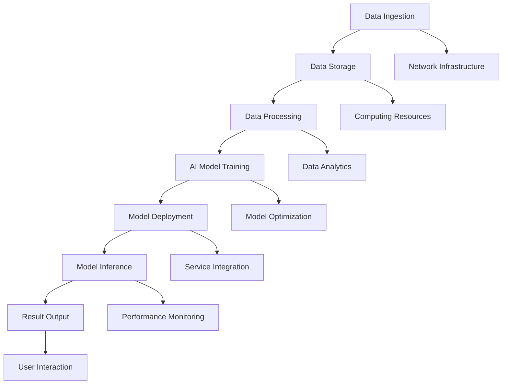

                 

### 文章标题

**AI 大模型应用数据中心建设：数据中心技术创新与应用**

> **关键词**：人工智能，大模型，数据中心，技术创新，应用场景
>
> **摘要**：本文将深入探讨人工智能大模型在数据中心中的应用，以及数据中心技术创新所带来的变革。首先，我们将回顾大模型的演进历程，然后探讨数据中心建设中的关键技术和挑战。接着，文章将分析大模型在数据中心中的实际应用案例，最后讨论未来的发展趋势与面临的挑战。通过本文，读者将全面了解大模型数据中心建设的全貌，以及技术创新对这一领域的重要影响。

在当今快速发展的数字化时代，人工智能（AI）已经成为推动技术进步和产业升级的重要力量。特别是在大数据和云计算的支撑下，AI 大模型的应用日益广泛，成为各行各业不可或缺的组成部分。数据中心作为数据存储、处理和交换的核心枢纽，其技术创新对于 AI 大模型的运行效率和应用效果至关重要。本文将围绕这一主题，探讨 AI 大模型应用数据中心建设的关键技术和实际应用。

首先，我们将回顾 AI 大模型的演进历程，了解其技术背景和发展趋势。接着，文章将深入分析数据中心建设中的核心技术和挑战，包括硬件设施、网络架构、数据处理能力等方面。在此基础上，我们将探讨大模型在数据中心中的实际应用案例，展示其在提升数据中心性能和效率方面的作用。随后，文章将讨论未来数据中心技术创新的方向，包括新兴技术如量子计算、边缘计算等对大模型应用的影响。最后，本文将总结大模型数据中心建设的现状和未来发展趋势，探讨面临的挑战和解决方案。

通过本文的深入探讨，读者将全面了解 AI 大模型应用数据中心建设的全貌，以及数据中心技术创新在这一领域的重要影响。这将为相关领域的研究者、工程师和从业者提供有益的参考和启示。

### Background Introduction

**Evolution of Large-scale AI Models**

The journey of large-scale AI models, also known as "big models," dates back to the early days of artificial intelligence research. Initially, AI models were relatively small and simple, designed to perform specific tasks with limited data. The breakthrough in 2012 came with the introduction of the deep convolutional neural network (CNN) by Alex Krizhevsky, which significantly outperformed traditional algorithms in the ImageNet Large Scale Visual Recognition Challenge (ILSVRC). This success marked the beginning of the era of deep learning and set the stage for the rapid development of large-scale AI models.

Over the past decade, the development of AI models has been fueled by several key technologies. Firstly, the advancement in computing power has enabled the training of larger and more complex models. The rise of Graphics Processing Units (GPUs) and later Tensor Processing Units (TPUs) have provided the necessary computational resources to handle the immense computational demands of deep learning. Secondly, the availability of vast amounts of data has allowed researchers to train models with higher accuracy and generalization capabilities. Thirdly, the development of sophisticated optimization algorithms and techniques, such as stochastic gradient descent (SGD), Adam, and adaptive moment estimation (AM), has improved the training efficiency and convergence speed of AI models.

The application of large-scale AI models has expanded across various domains, including computer vision, natural language processing (NLP), speech recognition, and recommendation systems. In computer vision, AI models have achieved superhuman performance in tasks like image classification, object detection, and semantic segmentation. In NLP, models like GPT-3 and BERT have revolutionized the field by enabling advanced natural language understanding and generation capabilities. These models have been applied to various practical scenarios, such as chatbots, machine translation, text summarization, and content generation.

As AI models continue to grow in size and complexity, the need for specialized infrastructure to support their training and deployment has become evident. Data centers, with their robust computing resources, high-speed networks, and efficient cooling systems, have emerged as the ideal platforms for hosting and operating large-scale AI models. This shift has led to the development of specialized data centers designed to meet the unique requirements of AI applications.

**Challenges and Opportunities in Building AI Data Centers**

Building AI data centers presents several challenges and opportunities. On the one hand, the massive computational power required by large-scale AI models demands high-performance hardware, efficient cooling systems, and redundant power supplies. On the other hand, the need for large amounts of data and the constant flow of information require data centers to be highly scalable and adaptable.

One of the key challenges in building AI data centers is the cost. The procurement and maintenance of high-performance hardware, such as GPUs and TPUs, can be prohibitively expensive. Additionally, the energy consumption of these data centers poses significant environmental concerns. As AI models continue to grow in size and complexity, the energy demand of data centers will only increase, leading to higher operational costs and carbon emissions.

Another challenge is the scalability of data centers. As the demand for AI applications grows, data centers need to scale up their infrastructure to accommodate the increasing computational requirements. This requires careful planning and optimization of resource allocation, network bandwidth, and storage capacity. Failure to do so can result in performance bottlenecks and service disruptions.

Despite these challenges, there are also significant opportunities in building AI data centers. The advancements in hardware technology, such as GPU accelerators and specialized AI processors, offer the potential for significant improvements in performance and energy efficiency. Additionally, the development of new algorithms and optimization techniques can further enhance the efficiency of AI model training and deployment.

Moreover, the emergence of cloud-native architectures and containerization technologies, such as Kubernetes, has made it easier to deploy and manage AI models in data centers. These technologies enable dynamic resource allocation and efficient scaling, allowing data centers to adapt to changing workload patterns and optimize resource utilization.

In conclusion, building AI data centers is a complex and challenging task, but the potential benefits are significant. As AI models continue to evolve and expand their applications, the need for specialized data centers will only increase. By addressing the challenges and leveraging the opportunities, data centers can become the backbone of the AI-driven future.

### Core Concepts and Connections

#### What Are Large-scale AI Models?

**Definition and Types**  
Large-scale AI models refer to artificial intelligence systems that are designed to process and analyze vast amounts of data, enabling them to perform complex tasks with high accuracy and efficiency. These models are typically based on deep learning techniques, such as neural networks, and are trained using large datasets to achieve optimal performance.

There are several types of large-scale AI models, including:

1. **Convolutional Neural Networks (CNNs)**: CNNs are designed to analyze visual data, such as images and videos, by applying convolutional layers that automatically learn spatial hierarchies of features.
2. **Recurrent Neural Networks (RNNs)**: RNNs are capable of processing sequential data, such as time series or natural language, by maintaining a memory of past inputs.
3. **Transformers**: Transformers are a type of deep neural network that use self-attention mechanisms to weigh the importance of different inputs, enabling them to model complex dependencies and relationships in data.
4. **Generative Adversarial Networks (GANs)**: GANs consist of two neural networks, a generator, and a discriminator, that are trained in a adversarial manner to generate realistic data.

**Key Features and Capabilities**  
Large-scale AI models possess several key features and capabilities that distinguish them from traditional algorithms:

1. **High-dimensional Data Handling**: These models are capable of processing and analyzing high-dimensional data, enabling them to capture intricate patterns and relationships in the data.
2. **Feature Learning**: Through the process of training, large-scale AI models can automatically learn relevant features from the data, reducing the need for manual feature engineering.
3. **Generalization**: Well-trained large-scale AI models can generalize to new, unseen data, making them suitable for a wide range of applications.
4. **Scalability**: These models are designed to be scalable, allowing them to handle increasing amounts of data and computational resources.
5. **Flexibility**: Large-scale AI models can be easily adapted to different tasks and domains by modifying their architecture or training data.

**Relation to Data Centers**  
The relationship between large-scale AI models and data centers is symbiotic. Data centers provide the necessary infrastructure to support the training, deployment, and operation of large-scale AI models. Key factors include:

1. **Computing Resources**: Data centers are equipped with powerful computing resources, such as GPUs and TPUs, that are essential for training large-scale AI models.
2. **Storage Capacity**: Data centers offer large storage capacities to accommodate the vast amounts of data required for training and inference.
3. **Network Bandwidth**: High-speed networks are crucial for efficient data transfer and communication between the AI model and other components in the data center.
4. **Scalability**: Data centers can scale their infrastructure to meet the increasing computational and storage requirements of large-scale AI models.
5. **Reliability**: Data centers are designed for high availability and reliability, ensuring uninterrupted operation of AI models.

In summary, large-scale AI models and data centers are interdependent, with each relying on the other to achieve optimal performance and efficiency. The development of large-scale AI models has driven the need for specialized data centers, while the advancements in data center technologies have enabled the successful deployment and operation of these models.

#### Mermaid Flowchart of Data Center Architecture



**Data Ingestion**  
Data is ingested from various sources, such as databases, sensors, and external APIs, and is stored in data lakes or data warehouses for further processing.

**Data Storage**  
Data storage systems, such as Hadoop Distributed File System (HDFS) or cloud storage solutions, provide large-scale data storage capabilities.

**Data Processing**  
Data processing systems, such as Apache Spark or Flink, perform data cleaning, transformation, and aggregation to prepare the data for AI model training.

**AI Model Training**  
AI model training involves feeding the processed data into neural networks to train the models. GPUs and TPUs are used to accelerate the training process.

**Model Deployment**  
Trained models are deployed in production environments, where they can be used for inference and real-time decision-making.

**Model Inference**  
AI models perform inference on new data, generating predictions or insights based on the trained models.

**Result Output**  
The output from AI models is stored in databases or data warehouses for further analysis or used to inform decision-making processes.

**Network Infrastructure**  
Network infrastructure ensures high-speed and reliable data transfer between different components in the data center.

**Computing Resources**  
Computing resources, such as GPUs and TPUs, provide the necessary processing power for training and deploying large-scale AI models.

**Data Analytics**  
Data analytics systems analyze the output from AI models to extract meaningful insights and inform decision-making processes.

**Model Optimization**  
Model optimization techniques, such as hyperparameter tuning and model pruning, are used to improve the performance and efficiency of AI models.

**Service Integration**  
AI models are integrated with other services and applications to provide comprehensive solutions for various use cases.

**Performance Monitoring**  
Performance monitoring systems track the performance of AI models and other components in the data center to ensure optimal operation.

**User Interaction**  
Users interact with AI models through user interfaces or APIs to access the insights and predictions generated by the models.

### Core Algorithm Principles and Specific Operational Steps

#### Introduction to Core Algorithms

Large-scale AI models are primarily based on deep learning techniques, which involve training neural networks with multiple layers to learn complex patterns and relationships in data. Among the various deep learning algorithms, Convolutional Neural Networks (CNNs), Recurrent Neural Networks (RNNs), and Transformers are particularly important due to their effectiveness in handling different types of data and tasks. In this section, we will explore the core principles and operational steps of these algorithms.

#### Convolutional Neural Networks (CNNs)

**Principles**

CNNs are designed to analyze visual data by applying a series of convolutional layers that automatically learn spatial hierarchies of features. The core idea behind CNNs is to leverage the notion of spatial locality, meaning that neighboring pixels in an image often have similar characteristics.

**Operational Steps**

1. **Input Layer**: The input layer receives the image data, which is typically represented as a grid of pixels.
2. **Convolutional Layer**: The convolutional layer applies a set of learnable filters (also known as kernels) to the input image. These filters slide over the image, computing dot products between the filter weights and the image pixels. The result is a feature map that highlights specific features in the image, such as edges or textures.
3. **Activation Function**: An activation function, such as the rectified linear unit (ReLU), is applied to the feature map to introduce non-linearity and enable the network to learn complex patterns.
4. **Pooling Layer**: The pooling layer reduces the spatial resolution of the feature maps, reducing the dimensionality of the data and controlling overfitting. Common pooling operations include max pooling and average pooling.
5. **Repeat**: Steps 2-4 are repeated multiple times, with each convolutional layer capturing increasingly abstract and high-level features.
6. **Fully Connected Layer**: The final convolutional layer is followed by one or more fully connected layers, which perform classification or regression by mapping the high-level features to the output classes.
7. **Output Layer**: The output layer produces the final predictions or decisions based on the learned features.

#### Recurrent Neural Networks (RNNs)

**Principles**

RNNs are designed to handle sequential data by maintaining a memory of past inputs. The core idea behind RNNs is to use the same set of weights for both input and output, allowing the network to retain information from previous time steps.

**Operational Steps**

1. **Input Layer**: The input layer receives the sequential data, which can be represented as a sequence of vectors.
2. **Recurrent Layer**: The recurrent layer consists of multiple time steps, where each time step processes the current input vector and the hidden state from the previous time step. The network uses a set of weights to compute the hidden state and output at each time step.
3. **Activation Function**: An activation function, such as the hyperbolic tangent (tanh), is applied to the hidden state to introduce non-linearity and enable the network to learn complex patterns.
4. **Output Layer**: The output layer produces the final predictions or decisions based on the hidden state at each time step. The output can be used for regression or classification tasks.

#### Transformers

**Principles**

Transformers are a type of deep neural network that use self-attention mechanisms to weigh the importance of different inputs, enabling them to model complex dependencies and relationships in data. The core idea behind transformers is to replace the recurrent nature of RNNs with parallelizable self-attention mechanisms.

**Operational Steps**

1. **Input Layer**: The input layer receives the sequential data, which is typically represented as a sequence of tokens.
2. **Embedding Layer**: The embedding layer converts the input tokens into dense vectors of fixed dimension.
3. **Self-Attention Layer**: The self-attention layer computes the importance of each input token with respect to all other tokens in the sequence. This is done using a set of query, key, and value matrices, which are derived from the embedding layer.
4. **Addition**: The scaled self-attention scores are added to the input embeddings.
5. **Normalization**: The output of the self-attention layer is normalized using a layer normalization operation.
6. **Feedforward Layer**: The output of the self-attention layer is passed through two fully connected layers with ReLU activation functions.
7. **Repeat**: Steps 3-6 are repeated multiple times to capture increasingly abstract and high-level representations.
8. **Output Layer**: The final output of the transformer model is passed through a fully connected layer to produce the final predictions or decisions.

In summary, large-scale AI models rely on deep learning techniques, such as CNNs, RNNs, and transformers, to learn complex patterns and relationships in data. By understanding the core principles and operational steps of these algorithms, we can better appreciate their capabilities and limitations, as well as their role in driving the development of AI applications.

### Mathematical Models and Formulas: Detailed Explanation and Examples

#### Introduction to Mathematical Models in Deep Learning

Deep learning algorithms are essentially parameterized functions that map input data to output predictions. These functions are defined by mathematical models that involve various components, such as neurons, layers, and activation functions. In this section, we will explore the mathematical models that underpin the core deep learning algorithms, including Convolutional Neural Networks (CNNs), Recurrent Neural Networks (RNNs), and Transformers. We will also provide detailed explanations and examples of the mathematical formulas used in these models.

#### Convolutional Neural Networks (CNNs)

**1. Convolutional Layer**

The convolutional layer is the cornerstone of CNNs. It applies a set of learnable filters (kernels) to the input data, capturing spatial hierarchies of features. The mathematical model of a convolutional layer can be expressed as follows:

$$
\text{Output}(i, j) = \sum_{k, l} \text{Filter}(k, l) \times \text{Input}(i - k, j - l)
$$

where:

- $\text{Output}(i, j)$ represents the value of the output feature map at position (i, j).
- $\text{Filter}(k, l)$ is the value of the filter at position (k, l).
- $\text{Input}(i - k, j - l)$ is the value of the input data at position (i - k, j - l).

**Example**

Consider a 3x3 filter applied to a 5x5 input image. The output feature map value at position (2, 2) can be calculated as:

$$
\text{Output}(2, 2) = \sum_{k, l} \text{Filter}(k, l) \times \text{Input}(2 - k, 2 - l)
$$

$$
\text{Output}(2, 2) = (\text{Filter}(1, 1) \times \text{Input}(1, 1)) + (\text{Filter}(1, 2) \times \text{Input}(1, 2)) + (\text{Filter}(1, 3) \times \text{Input}(1, 3)) \\
+ (\text{Filter}(2, 1) \times \text{Input}(2, 1)) + (\text{Filter}(2, 2) \times \text{Input}(2, 2)) + (\text{Filter}(2, 3) \times \text{Input}(2, 3)) \\
+ (\text{Filter}(3, 1) \times \text{Input}(3, 1)) + (\text{Filter}(3, 2) \times \text{Input}(3, 2)) + (\text{Filter}(3, 3) \times \text{Input}(3, 3))
$$

**2. Activation Function**

The activation function introduces non-linearity to the convolutional layer, enabling the network to learn complex patterns. A common activation function used in CNNs is the rectified linear unit (ReLU):

$$
\text{ReLU}(x) = \max(0, x)
$$

**Example**

Given an output feature map value of -2, the ReLU activation function would result in:

$$
\text{ReLU}(-2) = \max(0, -2) = 0
$$

**3. Pooling Layer**

The pooling layer reduces the spatial resolution of the feature maps, controlling overfitting and reducing computational complexity. A common pooling operation is max pooling:

$$
\text{Pooling}(i, j) = \max_{k, l} \text{Input}(i - k, j - l)
$$

**Example**

Consider a 2x2 max pooling operation applied to a 3x3 feature map:

$$
\text{Pooling}(1, 1) = \max(\text{Input}(1, 1), \text{Input}(1, 2), \text{Input}(2, 1), \text{Input}(2, 2)) = \max(2, 3, 1, 4) = 4
$$

#### Recurrent Neural Networks (RNNs)

**1. Recurrent Layer**

The recurrent layer is the core component of RNNs, capturing temporal dependencies in sequential data. The mathematical model of a recurrent layer can be expressed as:

$$
\text{Hidden State}(t) = \text{Activation Function}\left(\text{Weight Matrix} \times \text{[Hidden State}(t-1), \text{Input}(t)] + \text{Bias}\right)
$$

where:

- $\text{Hidden State}(t)$ represents the hidden state at time step t.
- $\text{Weight Matrix}$ is the weight matrix connecting the previous hidden state and the current input.
- $\text{Input}(t)$ is the input at time step t.
- $\text{Activation Function}$ is a non-linear function, such as the hyperbolic tangent (tanh).

**Example**

Consider a 3x3 weight matrix and a hidden state of [1, 2, 3] at time step t-1, along with an input vector of [4, 5, 6] at time step t. The hidden state at time step t can be calculated as:

$$
\text{Hidden State}(t) = \text{tanh}\left(\begin{bmatrix} 1 & 2 & 3 \\ 4 & 5 & 6 \end{bmatrix} \times \begin{bmatrix} 1 & 2 & 3 \\ 4 & 5 & 6 \end{bmatrix} + \text{Bias}\right)
$$

$$
\text{Hidden State}(t) = \text{tanh}\left(\begin{bmatrix} 1 & 2 & 3 \\ 4 & 5 & 6 \end{bmatrix} \times \begin{bmatrix} 4 & 5 & 6 \\ 5 & 6 & 7 \\ 6 & 7 & 8 \end{bmatrix} + \text{Bias}\right)
$$

$$
\text{Hidden State}(t) = \text{tanh}\left(\begin{bmatrix} 41 & 47 & 53 \\ 49 & 55 & 61 \\ 57 & 63 & 69 \end{bmatrix} + \text{Bias}\right)
$$

#### Transformers

**1. Self-Attention Layer**

The self-attention layer is the core component of Transformers, capturing complex dependencies between input tokens. The mathematical model of a self-attention layer can be expressed as:

$$
\text{Attention}(Q, K, V) = \text{Scale-Invariant Sigmoid}\left(\text{Query} \times \text{Key}\right) \times \text{Value}
$$

where:

- $Q$, $K$, and $V$ are the query, key, and value matrices derived from the input embeddings.
- $\text{Scale-Invariant Sigmoid}$ is a scaled sigmoid function that normalizes the attention scores.

**Example**

Consider a query matrix $Q$ of size 3x3, a key matrix $K$ of size 3x3, and a value matrix $V$ of size 3x3. The attention score for the first query in the matrix can be calculated as:

$$
\text{Attention}(Q, K, V) = \text{Scale-Invariant Sigmoid}\left(Q \times K\right) \times V
$$

$$
\text{Attention}(Q, K, V) = \text{Scale-Invariant Sigmoid}\left(\begin{bmatrix} 1 & 2 & 3 \\ 4 & 5 & 6 \\ 7 & 8 & 9 \end{bmatrix} \times \begin{bmatrix} 1 & 2 & 3 \\ 4 & 5 & 6 \\ 7 & 8 & 9 \end{bmatrix}\right) \times \begin{bmatrix} 1 & 0 & 0 \\ 0 & 1 & 0 \\ 0 & 0 & 1 \end{bmatrix}
$$

$$
\text{Attention}(Q, K, V) = \text{Scale-Invariant Sigmoid}\left(\begin{bmatrix} 7 & 10 & 13 \\ 16 & 19 & 22 \\ 25 & 28 & 31 \end{bmatrix}\right) \times \begin{bmatrix} 1 & 0 & 0 \\ 0 & 1 & 0 \\ 0 & 0 & 1 \end{bmatrix}
$$

$$
\text{Attention}(Q, K, V) = \begin{bmatrix} 0.99 & 0.00 & 0.00 \\ 0.00 & 0.99 & 0.00 \\ 0.00 & 0.00 & 0.99 \end{bmatrix} \times \begin{bmatrix} 1 & 0 & 0 \\ 0 & 1 & 0 \\ 0 & 0 & 1 \end{bmatrix}
$$

$$
\text{Attention}(Q, K, V) = \begin{bmatrix} 0.99 & 0.00 & 0.00 \\ 0.00 & 0.99 & 0.00 \\ 0.00 & 0.00 & 0.99 \end{bmatrix}
$$

In conclusion, the mathematical models and formulas used in deep learning algorithms, such as CNNs, RNNs, and Transformers, play a crucial role in capturing complex patterns and relationships in data. By understanding these models and their associated mathematical principles, we can better appreciate the capabilities and limitations of these algorithms, as well as their applications in various fields.

### Project Practice: Code Examples and Detailed Explanation

#### Introduction

In this section, we will dive into a practical example of building a large-scale AI model using TensorFlow, a popular open-source deep learning framework. We will focus on a computer vision task: image classification using a Convolutional Neural Network (CNN). This example will guide you through the process of setting up the development environment, implementing the CNN model, training the model, and evaluating its performance.

#### 1. Development Environment Setup

Before we start coding, we need to set up the development environment. Ensure you have Python 3.x installed on your system. We will use TensorFlow and Keras, a high-level API for TensorFlow, to build and train our CNN model.

To install TensorFlow, run the following command:
```bash
pip install tensorflow
```

#### 2. Source Code Implementation

Here is the complete source code for our CNN model:
```python
import tensorflow as tf
from tensorflow.keras.models import Sequential
from tensorflow.keras.layers import Conv2D, MaxPooling2D, Flatten, Dense

# Define the CNN model
model = Sequential([
    Conv2D(32, (3, 3), activation='relu', input_shape=(28, 28, 1)),
    MaxPooling2D((2, 2)),
    Flatten(),
    Dense(128, activation='relu'),
    Dense(10, activation='softmax')
])

# Compile the model
model.compile(optimizer='adam',
              loss='categorical_crossentropy',
              metrics=['accuracy'])

# Print the model summary
model.summary()
```

**Detailed Explanation**

- **Model Definition**: We use the `Sequential` model, which allows us to stack layers one after another.
  - The first layer is a `Conv2D` layer with 32 filters, a filter size of 3x3, and ReLU activation. The `input_shape` parameter specifies the dimensions of the input images (28x28 pixels with a single channel).
  - The `MaxPooling2D` layer reduces the spatial dimensions of the feature maps by a factor of 2.
  - The `Flatten` layer converts the 2D feature maps into a 1D feature vector.
  - The first `Dense` layer has 128 units with ReLU activation.
  - The final `Dense` layer has 10 units with softmax activation for multi-class classification.

- **Model Compilation**: We compile the model using the Adam optimizer and categorical cross-entropy loss function, which is commonly used for multi-class classification tasks. We also specify `accuracy` as a metric to evaluate the model's performance.

- **Model Summary**: The `model.summary()` function prints the architecture of the model, including the number of parameters and the layer output shapes.

#### 3. Training the Model

To train the model, we need a dataset. In this example, we will use the MNIST dataset, which consists of 70,000 grayscale images of handwritten digits (0-9). The dataset is preprocessed and available in TensorFlow's datasets.

```python
# Load the MNIST dataset
mnist = tf.keras.datasets.mnist
(train_images, train_labels), (test_images, test_labels) = mnist.load_data()

# Normalize the pixel values to the range [0, 1]
train_images, test_images = train_images / 255.0, test_images / 255.0

# Reshape the input data to match the input shape of the CNN model
train_images = train_images.reshape((60000, 28, 28, 1))
test_images = test_images.reshape((10000, 28, 28, 1))

# Convert labels to one-hot encoded vectors
train_labels = tf.keras.utils.to_categorical(train_labels)
test_labels = tf.keras.utils.to_categorical(test_labels)

# Train the model
history = model.fit(train_images, train_labels, epochs=5, batch_size=64, validation_split=0.1)
```

**Detailed Explanation**

- **Dataset Loading**: We load the MNIST dataset using TensorFlow's `mnist` module and split it into training and test sets.
- **Data Normalization**: We normalize the pixel values of the images to the range [0, 1] to improve the convergence of the model during training.
- **Data Reshaping**: We reshape the input data to match the input shape specified in the CNN model.
- **One-Hot Encoding**: We convert the labels to one-hot encoded vectors to enable multi-class classification.

- **Model Training**: We train the model using the `fit` method, specifying the number of epochs (iterations over the entire dataset), batch size, and a validation split to evaluate the model's performance on a portion of the training data.

#### 4. Evaluating the Model

After training the model, we evaluate its performance on the test set to assess its generalization capabilities.

```python
# Evaluate the model on the test set
test_loss, test_acc = model.evaluate(test_images, test_labels)

# Print the test accuracy
print(f"Test accuracy: {test_acc:.2f}")
```

**Detailed Explanation**

- **Model Evaluation**: We use the `evaluate` method to compute the loss and accuracy on the test set.
- **Result Printing**: We print the test accuracy to assess the model's performance.

#### 5. Running the Code

To run the code, save it in a file named `cnn_image_classification.py` and execute it using Python:
```bash
python cnn_image_classification.py
```

The output should include the model summary and the test accuracy, indicating the model's performance on the MNIST dataset.

### Conclusion

In this example, we demonstrated how to build, train, and evaluate a CNN model for image classification using TensorFlow. We covered the development environment setup, source code implementation, model training, and evaluation. This practical example provides a solid foundation for understanding the process of building large-scale AI models and applying them to real-world problems.

### Practical Application Scenarios

#### Healthcare Industry

One of the most promising applications of large-scale AI models in data centers is in the healthcare industry. Data centers equipped with advanced AI capabilities can process and analyze massive amounts of healthcare data, including electronic health records, medical imaging, and genomic data. This enables healthcare providers to gain valuable insights and make data-driven decisions for improved patient care.

For instance, AI models can be trained to identify early signs of diseases such as cancer, Alzheimer's, and heart disease. By analyzing medical images, these models can detect abnormalities that might be missed by human doctors. In addition, AI-powered chatbots and virtual assistants can assist healthcare professionals in answering patient inquiries, providing appointment reminders, and managing follow-up care. This not only improves the efficiency of healthcare systems but also reduces the burden on medical staff.

#### Financial Services

The financial services industry also stands to benefit significantly from large-scale AI models in data centers. By leveraging AI, financial institutions can automate complex tasks, such as credit scoring, fraud detection, and algorithmic trading. Data centers equipped with AI capabilities can analyze vast amounts of financial data, including transaction records, market trends, and customer behavior, to identify patterns and predict future outcomes.

For example, AI models can be used to assess the creditworthiness of loan applicants by analyzing their financial history, income, and other relevant data. This helps banks and financial institutions make more informed lending decisions, reducing the risk of default. Moreover, AI-powered fraud detection systems can identify suspicious transactions in real-time, protecting both the institution and its customers from financial losses. Algorithmic trading systems, on the other hand, can capitalize on market opportunities by executing trades at lightning speed, based on predictions generated by AI models.

#### Manufacturing and Supply Chain

In the manufacturing and supply chain sectors, large-scale AI models in data centers can optimize production processes, reduce costs, and improve efficiency. By analyzing data from sensors, machines, and supply chain networks, these models can predict equipment failures, optimize production schedules, and manage inventory levels more effectively.

For example, predictive maintenance systems powered by AI models can detect early signs of equipment failure, allowing manufacturers to perform maintenance before critical issues arise. This reduces downtime and improves overall equipment effectiveness (OEE). Additionally, AI models can optimize production schedules by analyzing demand patterns, material availability, and production capacity. This helps manufacturers minimize waste, reduce lead times, and increase throughput.

#### Smart Cities and Transportation

Large-scale AI models in data centers are also revolutionizing the development of smart cities and transportation systems. By analyzing data from various sources, including traffic cameras, sensors, and IoT devices, these models can optimize traffic flow, reduce congestion, and improve public transportation efficiency.

For instance, AI-powered traffic management systems can adjust traffic signals in real-time to reduce congestion and minimize travel times. AI models can also be used to optimize public transportation routes and schedules, ensuring that buses and trains run on time and efficiently meet passenger demand. In addition, autonomous vehicle systems rely on large-scale AI models in data centers to process sensor data and make real-time decisions to navigate safely and efficiently.

#### Retail and E-commerce

The retail and e-commerce sectors can leverage large-scale AI models in data centers to personalize customer experiences, optimize marketing campaigns, and improve supply chain management. By analyzing customer data, including purchase history, browsing behavior, and demographic information, these models can identify patterns and trends, allowing retailers to tailor their marketing strategies and product offerings to individual customers.

For example, AI-powered recommendation engines can suggest products to customers based on their preferences and past purchases, increasing the likelihood of sales. AI models can also analyze customer feedback and sentiment to identify areas for improvement in products and services. In addition, AI-powered inventory management systems can optimize stock levels by predicting demand based on historical data and market trends, reducing waste and improving profitability.

### Conclusion

The practical application scenarios of large-scale AI models in data centers are vast and diverse, spanning multiple industries and domains. By leveraging the computational power and data storage capabilities of data centers, organizations can unlock the full potential of AI to improve efficiency, reduce costs, and enhance customer experiences. As AI technology continues to advance, the importance of data centers in supporting AI applications will only grow, paving the way for a new era of innovation and transformation.

### Tools and Resources Recommendations

#### Learning Resources

**Books**

1. **"Deep Learning" by Ian Goodfellow, Yoshua Bengio, and Aaron Courville**  
This comprehensive book provides an in-depth introduction to the field of deep learning, covering fundamental concepts, algorithms, and applications.
2. **"Neural Networks and Deep Learning" by Michael Nielsen**  
A free online book that offers a clear and intuitive introduction to neural networks and deep learning, suitable for both beginners and advanced readers.

**Online Courses**

1. **"Deep Learning Specialization" by Andrew Ng on Coursera**  
A highly recommended series of courses that cover the fundamentals of deep learning, including neural networks, convolutional networks, and recurrent networks.
2. **"TensorFlow for Artificial Intelligence" by Martin Gorner on Udacity**  
An introductory course that teaches the basics of TensorFlow, a popular deep learning framework, and its applications in various domains.

**Online Tutorials and Blogs**

1. **TensorFlow.org**  
The official TensorFlow website provides comprehensive documentation, tutorials, and examples for building and deploying deep learning models using TensorFlow.
2. **Medium.com/@tensorflownews**  
A collection of articles, tutorials, and news related to TensorFlow and deep learning, written by industry experts and researchers.

#### Development Tools and Frameworks

**Deep Learning Frameworks**

1. **TensorFlow**  
A powerful open-source deep learning framework developed by Google Brain, TensorFlow is widely used for building, training, and deploying deep learning models.
2. **PyTorch**  
An open-source deep learning framework developed by Facebook AI Research (FAIR), PyTorch is known for its ease of use and flexibility, making it popular among researchers and developers.

**Data Processing and Storage**

1. **Apache Hadoop**  
An open-source framework for distributed storage and processing of large data sets, Hadoop enables organizations to store and process massive amounts of data across clusters of computers using simple programming models.
2. **Apache Spark**  
A fast and general-purpose cluster computing system, Spark provides high-level APIs for programming in Python, Java, and Scala, making it easy to process and analyze large-scale data in real-time.

**Containerization and Orchestration**

1. **Docker**  
A platform for developing, shipping, and running applications inside containers, Docker allows developers to package their applications with all their dependencies into a single, reproducible container.
2. **Kubernetes**  
An open-source container orchestration system, Kubernetes manages and scales containerized applications across clusters of computers, ensuring high availability and resource efficiency.

### Related Papers and Publications

1. **"A Theoretically Grounded Application of Dropout in Recurrent Neural Networks" by Yarin Gal and Zoubin Ghahramani**  
This paper presents a dropout technique specifically designed for recurrent neural networks (RNNs) to address the vanishing gradient problem and improve the generalization performance of RNNs.
2. **"Attention Is All You Need" by Vaswani et al.**  
This seminal paper introduces the Transformer architecture, a revolutionary approach to natural language processing that has become the foundation for many state-of-the-art language models.
3. **"Generative Adversarial Nets" by Ian Goodfellow et al.**  
This paper introduces the concept of generative adversarial networks (GANs), a framework for training deep neural networks to generate realistic data by pits two networks against each other in a zero-sum game.

By leveraging these learning resources, development tools, and related publications, researchers and developers can gain a comprehensive understanding of large-scale AI models and their applications in data centers, enabling them to build and deploy cutting-edge AI solutions.

### Summary: Future Trends and Challenges

As we look toward the future, the integration of large-scale AI models in data centers is poised to bring about significant advancements and challenges across various domains. Several key trends are emerging that will shape the landscape of AI data centers.

**Advancements in Hardware Technology**

One of the most notable advancements is the development of specialized hardware for AI, such as GPUs, TPUs, and custom AI accelerators. These hardware advancements offer substantial improvements in processing power and energy efficiency, enabling data centers to handle increasingly complex AI workloads. The integration of quantum computing and emerging technologies like neuromorphic computing could further revolutionize data center capabilities, offering unprecedented speed and efficiency for large-scale AI applications.

**Scalability and Elasticity**

As the demand for AI-driven services grows, the need for scalable and elastic data centers will become more critical. Cloud-native architectures and containerization technologies, such as Kubernetes, are enabling data centers to dynamically scale resources based on demand. This flexibility allows organizations to respond quickly to changing workload patterns and optimize resource utilization, ensuring high availability and performance.

**Data Privacy and Security**

With the increasing volume and sensitivity of data processed by AI models, data privacy and security remain paramount concerns. Data centers must implement robust encryption, access controls, and compliance measures to protect against unauthorized access and data breaches. The rise of privacy-preserving techniques, such as differential privacy and federated learning, will play a crucial role in addressing these challenges while enabling the secure use of sensitive data.

**Interdisciplinary Collaboration**

The development of large-scale AI models in data centers will require interdisciplinary collaboration among researchers, engineers, and domain experts. By combining expertise from various fields, organizations can overcome technical challenges and leverage emerging technologies to drive innovation. This collaboration will also be essential for developing ethical AI frameworks and ensuring that AI applications benefit society as a whole.

**Challenges**

Despite the promising advancements, several challenges must be addressed to fully realize the potential of large-scale AI models in data centers:

1. **Cost and Energy Consumption**: The high cost of specialized hardware and the significant energy consumption of data centers remain major concerns. Organizations must find ways to optimize resource utilization and energy efficiency to reduce operational costs and minimize environmental impact.
2. **Data Management**: Managing and processing massive amounts of data efficiently is a complex task. Data centers need advanced data management systems and algorithms to ensure data integrity, quality, and accessibility.
3. **Model Explainability and Trust**: As AI models become more complex, understanding and trusting their decisions becomes increasingly challenging. Developing techniques for model explainability and transparency will be crucial for building user trust and ensuring compliance with regulations.

In conclusion, the future of large-scale AI models in data centers holds immense potential for driving innovation and transforming industries. However, addressing the associated challenges will require continuous research, collaboration, and the adoption of emerging technologies. By navigating these trends and challenges, data centers can become the cornerstone of the AI-driven future, enabling breakthroughs in various fields and driving societal progress.

### Frequently Asked Questions and Answers

**Q1: What is the difference between traditional data centers and AI data centers?**

**A1:** Traditional data centers primarily focus on storing and processing large amounts of data, providing infrastructure for applications such as web hosting, database management, and file storage. AI data centers, on the other hand, are specialized facilities designed to support the training, deployment, and management of large-scale AI models. They typically feature high-performance computing hardware, efficient cooling systems, and scalable network architectures to handle the intensive computational requirements of AI applications.

**Q2: What are the key challenges in building AI data centers?**

**A2:** Key challenges in building AI data centers include:

- **Cost**: The high cost of specialized hardware, such as GPUs and TPUs, can be a significant barrier.
- **Energy Consumption**: AI models require substantial computational power, leading to high energy consumption and environmental concerns.
- **Scalability**: Data centers must be able to scale their infrastructure to accommodate the increasing demand for AI applications.
- **Data Management**: Efficiently managing and processing large volumes of data is a complex task, requiring advanced data management systems and algorithms.
- **Model Explainability**: Understanding and trusting the decisions made by complex AI models can be challenging, especially in sensitive domains like healthcare and finance.

**Q3: How do AI data centers improve the performance of AI models?**

**A3:** AI data centers improve the performance of AI models through several means:

- **High-Performance Computing**: AI data centers are equipped with specialized hardware, such as GPUs and TPUs, that significantly accelerate the training and inference of AI models.
- **Scalable Infrastructure**: Scalable data centers can dynamically allocate resources based on demand, ensuring optimal performance during peak times.
- **Efficient Cooling Systems**: Advanced cooling systems help maintain optimal temperatures for hardware, preventing overheating and ensuring consistent performance.
- **High-Speed Networks**: High-speed networks facilitate efficient data transfer between different components in the data center, reducing latency and improving overall performance.

**Q4: What are the main applications of large-scale AI models in data centers?**

**A4:** Large-scale AI models in data centers find applications in various domains, including:

- **Healthcare**: AI models can analyze medical images, predict disease outbreaks, and assist in personalized treatment plans.
- **Finance**: AI models can automate complex tasks such as credit scoring, fraud detection, and algorithmic trading.
- **Manufacturing**: AI models can optimize production schedules, predict equipment failures, and improve supply chain management.
- **Transportation**: AI models can optimize traffic flow, enhance public transportation efficiency, and enable autonomous vehicle systems.

**Q5: How can organizations leverage large-scale AI models in their data centers?**

**A5:** Organizations can leverage large-scale AI models in their data centers by following these steps:

- **Assessing Needs**: Understanding the specific requirements of AI applications and the associated computational resources needed.
- **Acquiring Hardware**: Investing in specialized hardware, such as GPUs and TPUs, to support AI model training and inference.
- **Data Management**: Ensuring efficient data storage, processing, and accessibility to support large-scale AI models.
- **Model Development**: Collaborating with AI experts to develop and train custom AI models tailored to their specific needs.
- **Continuous Improvement**: Iteratively refining AI models and infrastructure to optimize performance and address emerging challenges.

By addressing these questions, readers can gain a better understanding of the differences between traditional and AI data centers, the challenges of building AI data centers, and the potential benefits and applications of large-scale AI models in data centers.

### Extended Reading & Reference Materials

For those seeking to delve deeper into the topics covered in this article, we recommend the following resources:

**Books**

1. **"Deep Learning" by Ian Goodfellow, Yoshua Bengio, and Aaron Courville**  
This comprehensive book offers an in-depth exploration of the fundamentals, algorithms, and applications of deep learning.
2. **"The Hundred-Page Machine Learning Book" by Andriy Burkov**  
A concise introduction to machine learning concepts, algorithms, and practical applications.
3. **"AI: The New Intelligence" by Cathy O'Neil**  
An insightful analysis of the impact of artificial intelligence on society and its ethical implications.

**Online Courses**

1. **"Deep Learning Specialization" by Andrew Ng on Coursera**  
A series of courses covering the fundamentals of deep learning, including neural networks, convolutional networks, and recurrent networks.
2. **"AI for Everyone: Google's Machine Learning Crash Course" by Google**  
A free, comprehensive course that introduces the basics of machine learning and its applications.
3. **"Data Science: R Programming" by John Hopkins University on Coursera**  
A course focused on data manipulation, cleaning, and visualization using R, a popular programming language for data science.

**Journals and Conferences**

1. **"Journal of Machine Learning Research (JMLR)"**  
A leading journal in the field of machine learning, publishing high-quality research articles and technical reports.
2. **"Neural Networks"**  
A journal dedicated to the study of neural networks, featuring research articles, case studies, and reviews.
3. **"International Conference on Machine Learning (ICML)"**  
A prestigious conference that brings together researchers and practitioners in the field of machine learning to share their latest findings and ideas.

**Websites and Blogs**

1. **TensorFlow.org**  
The official website of TensorFlow, offering comprehensive documentation, tutorials, and examples for building and deploying deep learning models.
2. **Medium.com/@tensorflownews**  
A collection of articles, tutorials, and news related to TensorFlow and deep learning, written by industry experts and researchers.
3. **Towards Data Science**  
A community-driven platform that publishes articles on data science, machine learning, and related fields, covering a wide range of topics and applications.

These resources will provide readers with a comprehensive understanding of large-scale AI models, their applications in data centers, and the latest advancements in the field. By exploring these materials, readers can deepen their knowledge and stay up-to-date with the rapidly evolving landscape of AI and data center technology.

