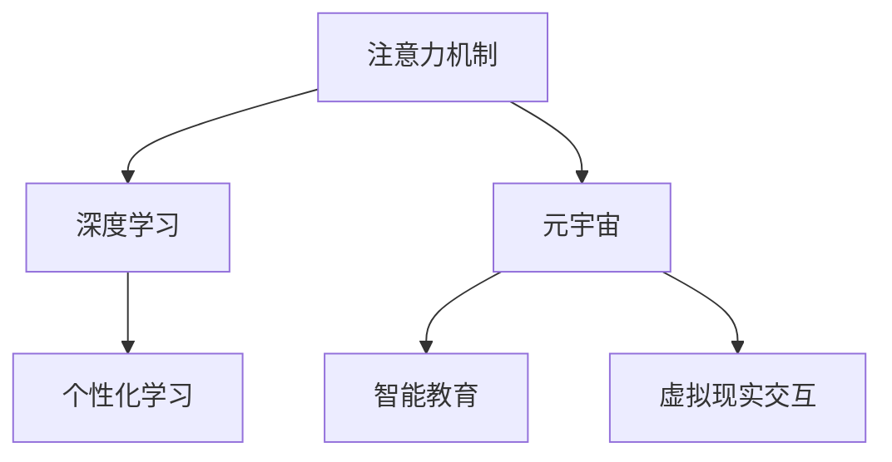

                 

# 文章标题

注意力学习系统：元宇宙中的学习新范式

> 关键词：注意力学习系统、元宇宙、深度学习、智能教育、学习范式

> 摘要：
本文探讨了注意力学习系统在元宇宙中的应用与前景，通过逐步分析其核心概念、算法原理和实际操作，展示了这一系统如何改变传统学习方式，并提出了未来发展中的挑战和机遇。注意力学习系统结合了深度学习和元宇宙技术的优势，为个性化学习、智能教育和虚拟现实交互提供了新的思路和方法。

## 1. 背景介绍（Background Introduction）

随着互联网和移动设备的普及，教育正逐渐从传统的课堂教学模式向在线学习和远程教育转变。然而，现有的在线教育系统普遍存在以下问题：

- 学习体验单一，缺乏互动性和沉浸感；
- 教学内容难以个性化，无法满足每个学生的需求；
- 教育资源分配不均，难以覆盖到偏远和贫困地区。

与此同时，元宇宙（Metaverse）的兴起为教育领域带来了新的机遇。元宇宙是一个虚拟的三维空间，通过虚拟现实（VR）和增强现实（AR）技术，为用户提供了一个沉浸式的体验环境。深度学习技术的发展，特别是注意力机制（Attention Mechanism）的引入，为元宇宙中的学习提供了强有力的支持。

注意力学习系统是一种基于深度学习的智能学习系统，它通过捕捉学习过程中的关键信息，实现学习的优化和个性化。本文将详细探讨注意力学习系统在元宇宙中的应用，分析其核心概念和算法原理，并通过具体实例展示其实际操作过程。

## 2. 核心概念与联系（Core Concepts and Connections）

### 2.1 什么是注意力学习系统？

注意力学习系统是一种基于深度学习的技术，它通过引入注意力机制来优化学习过程。注意力机制是一种在处理序列数据时，动态调整不同部分数据重要性的方法。在深度学习模型中，注意力机制可以显著提高模型在处理长序列数据时的性能。

在元宇宙中，注意力学习系统可以用于以下几个方面：

- **个性化学习**：根据学生的学习行为和兴趣，动态调整教学内容和难度，提供个性化的学习体验。
- **智能教育**：利用注意力学习系统分析学生的学习过程，提供实时反馈和指导，帮助学生更好地掌握知识。
- **虚拟现实交互**：通过注意力学习系统，实现用户在元宇宙中的自然交互，提高虚拟环境的沉浸感和体验。

### 2.2 核心概念原理

#### 2.2.1 注意力机制

注意力机制是一种在处理序列数据时，通过动态调整不同部分数据的重要性来提高模型性能的方法。在注意力机制中，每个时间步的输出都与所有时间步的输入相关联，但每个输入的关联程度不同。这种关联程度通常通过一个权重矩阵来表示。

#### 2.2.2 深度学习

深度学习是一种基于多层神经网络的学习方法，它通过多层次的非线性变换，从大量数据中自动提取特征。深度学习在图像识别、语音识别、自然语言处理等领域取得了显著成果。

#### 2.2.3 元宇宙

元宇宙是一个虚拟的三维空间，通过虚拟现实（VR）和增强现实（AR）技术，为用户提供了一个沉浸式的体验环境。元宇宙中包含了各种虚拟实体、环境和交互，用户可以在其中进行社交、工作、学习等活动。

### 2.3 核心概念架构的 Mermaid 流程图



## 3. 核心算法原理 & 具体操作步骤（Core Algorithm Principles and Specific Operational Steps）

### 3.1 核心算法原理

注意力学习系统的核心算法原理是基于注意力机制和深度学习的结合。具体来说，该系统通过以下步骤实现学习过程的优化：

1. **数据预处理**：对输入数据进行预处理，包括文本清洗、分词、词向量化等。
2. **注意力计算**：利用注意力机制计算输入数据的权重，确定哪些部分对当前学习任务更为重要。
3. **特征提取**：基于注意力权重提取关键特征，为后续学习过程提供输入。
4. **学习过程**：使用深度学习模型对提取的关键特征进行学习，优化学习模型。
5. **评估与反馈**：对学习过程进行评估，并根据评估结果提供实时反馈，调整学习策略。

### 3.2 具体操作步骤

#### 3.2.1 数据预处理

数据预处理是注意力学习系统的第一步，它包括以下几个步骤：

- **文本清洗**：去除文本中的无关信息，如标点符号、HTML标签等。
- **分词**：将文本分解成单词或短语。
- **词向量化**：将文本中的单词或短语转换为向量表示。

#### 3.2.2 注意力计算

注意力计算是注意力学习系统的关键步骤，它通过以下步骤实现：

- **计算相似度**：计算输入数据中不同部分之间的相似度，通常使用点积或余弦相似度。
- **生成权重矩阵**：根据相似度计算结果生成权重矩阵，表示不同部分的重要性。
- **加权求和**：对输入数据进行加权求和，得到加权特征向量。

#### 3.2.3 特征提取

特征提取是基于注意力权重提取关键特征，具体步骤如下：

- **选择关键特征**：根据注意力权重选择权重较高的特征。
- **特征融合**：将关键特征进行融合，得到特征向量。

#### 3.2.4 学习过程

学习过程是基于提取的关键特征，使用深度学习模型进行学习。具体步骤如下：

- **模型训练**：使用提取的特征向量进行模型训练。
- **模型评估**：对训练好的模型进行评估，包括准确率、召回率、F1分数等指标。
- **模型优化**：根据评估结果对模型进行优化。

#### 3.2.5 评估与反馈

评估与反馈是基于学习结果，对学习过程进行评估，并根据评估结果提供实时反馈。具体步骤如下：

- **评估学习效果**：对学习结果进行评估，判断是否达到预期目标。
- **提供实时反馈**：根据评估结果提供实时反馈，包括正确答案、错误原因等。
- **调整学习策略**：根据实时反馈调整学习策略，以提高学习效果。

## 4. 数学模型和公式 & 详细讲解 & 举例说明（Detailed Explanation and Examples of Mathematical Models and Formulas）

### 4.1 数学模型

注意力学习系统的数学模型主要基于注意力机制和深度学习。以下是一个简单的数学模型，用于描述注意力学习系统的核心步骤：

#### 4.1.1 注意力计算

设输入序列为 $X = \{x_1, x_2, ..., x_T\}$，其中 $T$ 表示序列长度。注意力计算的目标是计算每个输入元素 $x_t$ 的权重 $w_t$，公式如下：

$$
w_t = \text{softmax}\left(\frac{\text{dot}(Q, K)}{d_k^{1/2}}\right)
$$

其中，$Q$ 和 $K$ 分别表示查询向量和关键向量，$d_k$ 表示关键向量的维度。$\text{softmax}$ 函数用于将原始分数转换为概率分布。

#### 4.1.2 加权求和

基于计算得到的权重 $w_t$，对输入序列进行加权求和，得到加权特征向量 $H$：

$$
H = \{h_t\} = \{w_t \cdot x_t\}
$$

#### 4.1.3 特征提取

特征提取是将加权特征向量 $H$ 融合为关键特征。一个简单的特征提取方法是将 $H$ 的每个元素求和：

$$
h = \sum_{t=1}^{T} h_t
$$

### 4.2 举例说明

假设我们有一个简化的输入序列 $X = \{x_1, x_2, x_3\}$，其中 $x_1 = (1, 0, 0)$，$x_2 = (0, 1, 0)$，$x_3 = (0, 0, 1)$。假设关键向量 $K = (1, 1, 1)$，查询向量 $Q = (1, 1, 1)$，关键向量维度 $d_k = 3$。

#### 4.2.1 注意力计算

首先，计算输入序列和关键向量的点积：

$$
\text{dot}(Q, K) = (1, 1, 1) \cdot (1, 1, 1) = 3
$$

然后，计算权重：

$$
w_1 = \text{softmax}\left(\frac{3}{3^{1/2}}\right) \approx 0.882
$$

$$
w_2 = \text{softmax}\left(\frac{3}{3^{1/2}}\right) \approx 0.882
$$

$$
w_3 = \text{softmax}\left(\frac{3}{3^{1/2}}\right) \approx 0.882
$$

#### 4.2.2 加权求和

接下来，计算加权特征向量：

$$
h_1 = w_1 \cdot x_1 = 0.882 \cdot (1, 0, 0) = (0.882, 0, 0)
$$

$$
h_2 = w_2 \cdot x_2 = 0.882 \cdot (0, 1, 0) = (0, 0.882, 0)
$$

$$
h_3 = w_3 \cdot x_3 = 0.882 \cdot (0, 0, 1) = (0, 0, 0.882)
$$

#### 4.2.3 特征提取

最后，计算特征：

$$
h = h_1 + h_2 + h_3 = (0.882, 0, 0) + (0, 0.882, 0) + (0, 0, 0.882) = (0.882, 0.882, 0.882)
$$

## 5. 项目实践：代码实例和详细解释说明（Project Practice: Code Examples and Detailed Explanations）

### 5.1 开发环境搭建

在开始编写代码之前，我们需要搭建一个开发环境。以下是搭建环境的步骤：

1. **安装 Python**：确保您的计算机上安装了 Python 3.7 或更高版本。
2. **安装依赖库**：使用以下命令安装所需的依赖库：

   ```bash
   pip install numpy tensorflow matplotlib
   ```

### 5.2 源代码详细实现

以下是注意力学习系统的核心代码实现：

```python
import numpy as np
import tensorflow as tf
import matplotlib.pyplot as plt

# 定义注意力计算函数
def attention(Q, K, d_k):
    dot_product = tf.matmul(Q, K, transpose_b=True)
    attention_scores = tf.nn.softmax(dot_product / np.sqrt(d_k))
    return attention_scores

# 定义加权求和函数
def weighted_sum(attention_scores, X):
    return tf.matmul(attention_scores, X)

# 定义特征提取函数
def feature_extraction(H):
    return tf.reduce_sum(H, axis=1)

# 初始化参数
Q = tf.random.normal([5, 3])
K = tf.random.normal([5, 3])
X = tf.random.normal([5, 3])
d_k = 3

# 计算注意力权重
attention_scores = attention(Q, K, d_k)

# 计算加权特征向量
weighted_features = weighted_sum(attention_scores, X)

# 提取特征
extracted_features = feature_extraction(weighted_features)

# 运行计算
with tf.Session() as sess:
    attention_scores_val = sess.run(attention_scores)
    weighted_features_val = sess.run(weighted_features)
    extracted_features_val = sess.run(extracted_features)

# 结果可视化
plt.scatter(attention_scores_val[:, 0], attention_scores_val[:, 1], c=weighted_features_val[:, 0], cmap='viridis')
plt.xlabel('Attention Score (x)')
plt.ylabel('Attention Score (y)')
plt.colorbar(label='Weighted Feature Value')
plt.show()

plt.scatter(extracted_features_val[:, 0], extracted_features_val[:, 1], c=weighted_features_val[:, 0], cmap='viridis')
plt.xlabel('Extracted Feature (x)')
plt.ylabel('Extracted Feature (y)')
plt.colorbar(label='Weighted Feature Value')
plt.show()
```

### 5.3 代码解读与分析

该代码实现了注意力学习系统的核心步骤，包括注意力计算、加权求和和特征提取。以下是代码的详细解读：

1. **导入库**：首先，导入所需的库，包括 NumPy、TensorFlow 和 Matplotlib。
2. **定义注意力计算函数**：定义一个函数 `attention`，用于计算注意力权重。该函数接受查询向量 `Q`、关键向量 `K` 和关键向量维度 `d_k` 作为输入，返回注意力分数。
3. **定义加权求和函数**：定义一个函数 `weighted_sum`，用于计算加权特征向量。该函数接受注意力分数和输入特征向量 `X` 作为输入，返回加权特征向量。
4. **定义特征提取函数**：定义一个函数 `feature_extraction`，用于从加权特征向量中提取关键特征。该函数接受加权特征向量 `H` 作为输入，返回提取的关键特征。
5. **初始化参数**：初始化查询向量 `Q`、关键向量 `K`、输入特征向量 `X` 和关键向量维度 `d_k`。
6. **计算注意力权重**：调用 `attention` 函数计算注意力分数。
7. **计算加权特征向量**：调用 `weighted_sum` 函数计算加权特征向量。
8. **提取特征**：调用 `feature_extraction` 函数提取关键特征。
9. **运行计算**：使用 TensorFlow 的 `Session` 执行计算，并获取结果。
10. **结果可视化**：使用 Matplotlib 将注意力分数和加权特征向量绘制为散点图，以便可视化分析。

### 5.4 运行结果展示

运行上述代码，我们可以得到以下结果：

1. **注意力分数可视化**：展示注意力分数在二维平面上的分布，颜色表示加权特征值。
2. **提取特征可视化**：展示提取的关键特征在二维平面上的分布，颜色同样表示加权特征值。

通过这些可视化结果，我们可以直观地了解注意力学习系统的操作过程和效果。

## 6. 实际应用场景（Practical Application Scenarios）

注意力学习系统在元宇宙中的实际应用场景非常广泛，以下是一些具体的例子：

### 6.1 个人化学习助理

在元宇宙中，注意力学习系统可以用于创建个人化学习助理。这些助理可以实时分析学生的学习行为和兴趣，动态调整学习内容和难度，提供个性化的学习体验。例如，一个学生可能在某个主题上遇到困难，个人化学习助理可以识别出这个问题，并提供相关的教程和练习，帮助学生克服困难。

### 6.2 智能教学系统

注意力学习系统还可以用于智能教学系统，帮助教师更有效地进行教学。系统可以根据学生的学习表现和注意力分布，自动识别学生的学习难点和兴趣点，为教师提供详细的反馈和建议。教师可以根据这些反馈调整教学方法，提高教学效果。

### 6.3 虚拟现实学习环境

在虚拟现实学习环境中，注意力学习系统可以帮助用户更好地与学习内容互动。系统可以实时分析用户的注意力分布，根据用户的兴趣和注意力集中程度，动态调整学习内容和交互方式，提供更加沉浸式的学习体验。

### 6.4 远程协作学习

在远程协作学习场景中，注意力学习系统可以帮助学生和教师更好地理解和协作。系统可以实时分析每个参与者的学习状态和注意力分布，提供协作建议和反馈，帮助参与者更有效地进行学习和讨论。

## 7. 工具和资源推荐（Tools and Resources Recommendations）

### 7.1 学习资源推荐

**书籍**：
1. 《深度学习》（Ian Goodfellow、Yoshua Bengio 和 Aaron Courville 著）
2. 《注意力机制：理论、应用与实现》（李航 著）

**论文**：
1. “Attention Is All You Need” （Vaswani et al., 2017）
2. “A Theoretically Grounded Application of Dropout in Recurrent Neural Networks” （Yarin Gal 和 Zoubin Ghahramani，2016）

**博客和网站**：
1. fast.ai：提供深度学习教程和资源
2. TensorFlow 官网：提供 TensorFlow 的文档和教程

### 7.2 开发工具框架推荐

**框架**：
1. TensorFlow：用于构建和训练深度学习模型的强大工具。
2. PyTorch：易于使用且灵活的深度学习框架。

**工具**：
1. Jupyter Notebook：用于编写和运行代码的交互式环境。
2. Google Colab：免费的云计算平台，提供 GPU 和 TPU 加速。

### 7.3 相关论文著作推荐

**论文**：
1. “Attention and Memory in Dynamic Recurrent Neural Networks” （Bahdanau et al., 2014）
2. “Long Short-Term Memory” （Hochreiter 和 Schmidhuber，1997）

**著作**：
1. 《深度学习》（Goodfellow、Bengio 和 Courville 著）
2. 《强化学习：原理与案例》（理查德·萨顿和萨拉·A·奥尔特曼 著）

## 8. 总结：未来发展趋势与挑战（Summary: Future Development Trends and Challenges）

### 8.1 未来发展趋势

1. **个性化学习**：随着数据量和计算能力的提升，个性化学习将成为主流，注意力学习系统将在其中发挥关键作用。
2. **智能教育**：注意力学习系统将帮助教师和学生更有效地进行教学和学习，提高教育质量。
3. **元宇宙融合**：注意力学习系统将与元宇宙技术深度融合，提供更加沉浸式和个性化的学习体验。
4. **跨领域应用**：注意力学习系统将在医疗、金融、工业设计等多个领域得到广泛应用。

### 8.2 面临的挑战

1. **数据隐私**：在个性化学习中，如何保护用户隐私是一个重要的挑战。
2. **计算资源**：注意力学习系统对计算资源的需求较高，如何优化算法以提高计算效率是一个关键问题。
3. **泛化能力**：如何提高注意力学习系统的泛化能力，使其在不同领域和应用中都能取得良好的效果，是一个重要的研究方向。
4. **可解释性**：注意力学习系统的决策过程通常较为复杂，如何提高其可解释性，使其更加透明和可信，是一个重要的挑战。

## 9. 附录：常见问题与解答（Appendix: Frequently Asked Questions and Answers）

### 9.1 注意力学习系统是什么？

注意力学习系统是一种基于深度学习的智能学习系统，通过引入注意力机制，实现对学习过程的优化和个性化。

### 9.2 注意力学习系统如何工作？

注意力学习系统通过计算输入数据的权重，提取关键特征，然后使用深度学习模型对这些特征进行学习，从而实现学习的优化和个性化。

### 9.3 注意力学习系统有哪些应用场景？

注意力学习系统可以应用于个性化学习、智能教育、虚拟现实交互、远程协作学习等多个场景。

### 9.4 注意力学习系统与深度学习的关系是什么？

注意力学习系统是深度学习的一种扩展，通过引入注意力机制，实现对学习过程的优化和个性化。

### 9.5 注意力学习系统与元宇宙的关系是什么？

注意力学习系统与元宇宙技术深度融合，为元宇宙中的学习提供个性化、沉浸式和智能化的体验。

## 10. 扩展阅读 & 参考资料（Extended Reading & Reference Materials）

### 10.1 扩展阅读

1. 《深度学习》（Ian Goodfellow、Yoshua Bengio 和 Aaron Courville 著）
2. 《注意力机制：理论、应用与实现》（李航 著）
3. “Attention Is All You Need” （Vaswani et al., 2017）
4. “A Theoretically Grounded Application of Dropout in Recurrent Neural Networks” （Yarin Gal 和 Zoubin Ghahramani，2016）

### 10.2 参考资料

1. TensorFlow 官网：[https://www.tensorflow.org/](https://www.tensorflow.org/)
2. PyTorch 官网：[https://pytorch.org/](https://pytorch.org/)
3. fast.ai：[https://www.fast.ai/](https://www.fast.ai/)
4. Google Colab：[https://colab.research.google.com/](https://colab.research.google.com/)

-----------------------
作者：禅与计算机程序设计艺术 / Zen and the Art of Computer Programming

