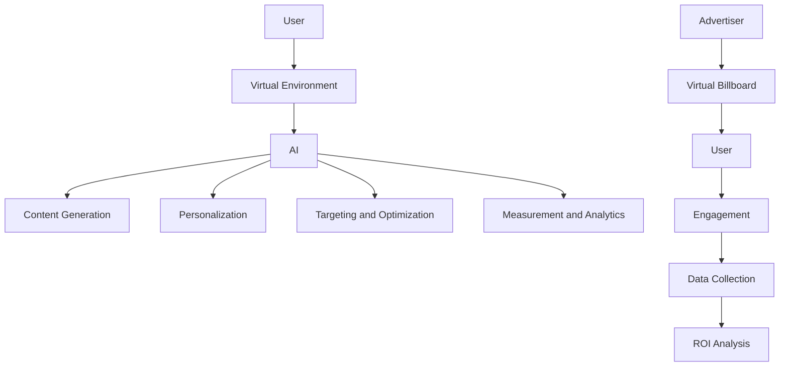

                 

### 文章标题

### Attention Marketing: Precision Advertising in the Metaverse

> 关键词：元宇宙、注意力营销、精准投放、广告、人工智能

> 摘要：本文将探讨元宇宙中的注意力市场营销，分析如何通过人工智能技术实现广告的精准投放。我们将探讨元宇宙的概念、注意力市场的形成机制、人工智能在广告投放中的作用，并提供一些具体的应用实例。文章旨在为市场营销者和广告从业者提供关于元宇宙广告投放的新思路和方法。

### Background Introduction

The concept of the metaverse has been gaining traction in recent years, promising to revolutionize the way we interact with technology and each other. At its core, the metaverse is an immersive, interactive, and virtual world that extends beyond the boundaries of traditional online spaces. It is a space where users can create, share, and explore virtual experiences, often through the use of augmented reality (AR), virtual reality (VR), and mixed reality (MR) technologies.

As the metaverse continues to evolve, so does the advertising landscape. Traditional advertising methods are no longer sufficient in capturing the attention of users who are constantly bombarded with information. Enter attention marketing, a concept that focuses on capturing and retaining the audience's attention through meaningful and engaging experiences. In the context of the metaverse, attention marketing becomes even more critical as users spend increasing amounts of time in virtual environments.

One of the key factors driving the growth of attention marketing in the metaverse is the rise of artificial intelligence (AI). AI technologies, such as machine learning and natural language processing, enable marketers to better understand user preferences, behavior, and needs. This, in turn, allows for more personalized and targeted advertising campaigns that resonate with users on a deeper level.

In this article, we will delve into the world of attention marketing in the metaverse. We will explore the concept of the metaverse, the mechanisms behind the formation of attention markets, the role of AI in advertising, and provide examples of how attention marketing can be effectively implemented in virtual environments. Our goal is to provide readers with a comprehensive understanding of the opportunities and challenges that come with attention marketing in the metaverse.

### Core Concepts and Connections

#### The Metaverse: An Overview

The metaverse can be defined as a collective virtual shared space, created by the convergence of physical and digital reality. It is an immersive environment where users can interact with each other and with digital content in a seemingly continuous and interconnected space. This concept is often associated with virtual reality (VR), augmented reality (AR), and mixed reality (MR) technologies, which enable users to experience and engage with the metaverse in a more interactive and immersive manner.

In the metaverse, users create virtual avatars that represent themselves and interact with other users and digital objects within the virtual environment. These interactions can range from simple socializing and gaming to more complex activities such as shopping, working, and learning. The metaverse is not just a virtual replica of the physical world but a new digital realm where users can explore and create new experiences.

#### Attention Markets: How They Work

In the context of the metaverse, attention markets refer to the mechanisms through which users' attention is monetized and allocated. As users spend more time in virtual environments, their attention becomes a valuable commodity that can be traded and sold.

Attention markets are built on the principles of supply and demand. On one side, users generate attention through their interactions and activities in the metaverse. This attention can be measured in various ways, such as the number of interactions, the time spent in a virtual environment, or the engagement level with digital content. On the other side, advertisers and content creators create digital experiences that capture users' attention and are willing to pay for it.

The formation of attention markets in the metaverse is facilitated by several factors:

1. **Personalization**: AI technologies enable marketers to create personalized experiences that cater to individual user preferences and behaviors. This increases the likelihood of capturing and retaining users' attention.
2. **Data Collection and Analysis**: The metaverse is a treasure trove of data, providing marketers with valuable insights into user behavior and preferences. By analyzing this data, marketers can better understand their target audience and create more effective advertising campaigns.
3. **Virtual Goods and Services**: The metaverse offers a wide range of virtual goods and services that can be traded and monetized. These include digital clothing, accessories, in-game items, and even virtual real estate. Advertisers can leverage these opportunities to create immersive and engaging advertising experiences.

#### The Role of Artificial Intelligence in Advertising

AI plays a crucial role in attention marketing in the metaverse. Here are some key ways AI is utilized:

1. **Personalization**: AI algorithms can analyze user data to understand their preferences, behavior, and needs. This enables marketers to deliver personalized advertising messages and experiences that resonate with individual users.
2. **Content Creation**: AI can generate and customize digital content, such as virtual billboards, advertisements, and interactive experiences, based on user preferences and behaviors.
3. **Targeting and Optimization**: AI enables marketers to identify and target specific user segments that are most likely to engage with their advertising campaigns. Additionally, AI algorithms can optimize advertising campaigns in real-time to maximize their effectiveness.
4. **Measurement and Analytics**: AI-powered analytics tools can track and measure the performance of advertising campaigns in the metaverse, providing valuable insights into user engagement, conversion rates, and ROI.

#### Mermaid Flowchart of Metaverse Advertising Architecture



In this flowchart, the user interacts with the virtual environment, where AI technologies are employed to generate personalized content, target specific user segments, optimize advertising campaigns, and measure their performance. The advertiser creates virtual billboards or other advertising content, which is then delivered to users through the virtual environment. User engagement and data collection are used to analyze the ROI of the advertising campaigns.

### Core Algorithm Principles and Specific Operational Steps

#### 1. Data Collection and Analysis

The first step in implementing attention marketing in the metaverse is to collect and analyze user data. This data can include:

- User demographics (age, gender, location)
- User behavior (interactions, time spent in virtual environments, engagement level)
- User preferences (interests, hobbies, purchase history)
- Interaction data (clicks, likes, shares)

Once collected, this data can be analyzed to identify patterns and trends that can inform advertising strategies.

#### 2. User Segmentation

User segmentation involves dividing the target audience into smaller, more manageable groups based on similar characteristics or behaviors. This can be done using clustering algorithms or other machine learning techniques.

For example, we could segment users based on their level of engagement in the metaverse. High-engagement users might be more receptive to targeted advertising, while low-engagement users might require a different approach.

#### 3. Content Personalization

Once user segments have been identified, content personalization can be employed to deliver more relevant and engaging advertisements. This can be achieved using various techniques, such as:

- **Content Recommendations**: AI algorithms can analyze user preferences and behavior to recommend relevant virtual experiences, products, or services.
- **Dynamic Ad Creation**: AI can generate personalized advertisements in real-time, based on user data and context.
- **Contextual Advertising**: Advertisements can be displayed based on the user's current activity or location in the virtual environment.

#### 4. Targeting and Optimization

With user segments and personalized content in place, marketers can focus on targeting the right audience with the right message. This involves:

- **User Retargeting**: Targeting users who have previously interacted with the brand or shown interest in similar products.
- **Real-Time Optimization**: AI algorithms can continuously analyze user data and campaign performance to optimize advertising campaigns in real-time.
- **A/B Testing**: Testing different advertising strategies and tactics to determine which ones are most effective.

#### 5. Measurement and Analytics

Finally, it's crucial to measure the effectiveness of attention marketing campaigns in the metaverse. Key metrics to track include:

- **User Engagement**: The level of interaction and engagement with advertising content.
- **Conversion Rates**: The percentage of users who take a desired action, such as making a purchase or signing up for a service.
- **Return on Investment (ROI)**: The financial return generated from the advertising campaign relative to its cost.

By continuously monitoring these metrics and making data-driven decisions, marketers can refine their attention marketing strategies to maximize their ROI.

### Mathematical Models and Formulas & Detailed Explanation & Examples

In attention marketing, various mathematical models and formulas can be used to optimize advertising campaigns. Here, we'll explore a few key models and their applications.

#### 1. Markov Chain Model

A Markov chain model is a stochastic model used to predict the behavior of users in the metaverse. It assumes that the probability of a user transitioning from one state to another depends only on the current state and not on the previous states.

**Example: User Engagement States**

Let's consider a simple example of user engagement states in the metaverse:

- **State 0**: Not engaged
- **State 1**: Mildly engaged
- **State 2**: Highly engaged

We can use a Markov chain model to predict the probability of a user transitioning from one state to another. For instance, we might find that the transition probability from State 0 to State 1 is 0.3, from State 1 to State 2 is 0.5, and from State 2 to State 0 is 0.2.

Using this model, we can predict the long-term behavior of users and optimize our advertising campaigns accordingly.

#### 2. Collaborative Filtering Model

Collaborative filtering is a popular technique in recommendation systems, which can also be applied to attention marketing. It involves making predictions about the interests of a user based on the preferences of similar users.

**Example: Item-Based Collaborative Filtering**

Let's consider a scenario where we have a set of users and a set of virtual experiences. We can use item-based collaborative filtering to predict the preferences of a user based on the preferences of similar users.

1. **Calculate Similarity Matrix**: Compute the similarity between each pair of virtual experiences based on user ratings. Common similarity measures include cosine similarity and Pearson correlation.
2. **Predict User Preferences**: For a given user, calculate the weighted average of the ratings of similar users for each virtual experience.

For example, if we have two users, A and B, who have rated five virtual experiences, we can compute the similarity between these experiences and predict user C's preferences based on the ratings of users A and B.

#### 3. Reinforcement Learning Model

Reinforcement learning is a type of machine learning where an agent learns to make decisions by interacting with an environment and receiving feedback in the form of rewards or penalties. It can be used to optimize advertising campaigns by learning the best actions to take based on user engagement and feedback.

**Example: Multi-Armed Bandit Problem**

Consider a scenario where an advertiser has multiple advertising channels (e.g., virtual billboards, in-game ads) and wants to allocate their budget optimally to maximize user engagement.

The multi-armed bandit problem is a classic reinforcement learning problem where the advertiser needs to balance exploration (trying out new channels) and exploitation (using the best-performing channels).

**Algorithm: epsilon-greedy**

1. **Choose Action**: With probability epsilon, choose a random action. Otherwise, choose the action with the highest average reward.
2. **Update Reward**: After choosing an action, update the average reward for that action based on the user's engagement.

By continuously exploring and exploiting the best-performing channels, the epsilon-greedy algorithm can help advertisers optimize their advertising budgets and maximize user engagement.

### Project Practice: Code Examples and Detailed Explanations

In this section, we'll provide a practical example of implementing attention marketing in the metaverse using Python. We'll use a combination of natural language processing (NLP), machine learning, and web development techniques.

#### 1. Development Environment Setup

To set up the development environment, we'll need to install the following packages:

- Python (version 3.8 or later)
- TensorFlow (version 2.6 or later)
- scikit-learn (version 0.24 or later)
- Flask (version 2.0 or later)
- Pandas (version 1.3 or later)

You can install these packages using pip:

```bash
pip install tensorflow scikit-learn flask pandas
```

#### 2. Source Code Implementation

We'll start by implementing a simple recommendation system that suggests virtual experiences to users based on their preferences and behavior.

**Step 1: Load and Preprocess Data**

First, we'll load and preprocess the user data:

```python
import pandas as pd
from sklearn.model_selection import train_test_split
from sklearn.preprocessing import StandardScaler

# Load user data
data = pd.read_csv('user_data.csv')

# Preprocess data
data['engagement'] = data['engagement'].map({'low': 0, 'medium': 1, 'high': 2})
X = data[['age', 'location', 'engagement']]
y = data['interests']

# Split data into training and test sets
X_train, X_test, y_train, y_test = train_test_split(X, y, test_size=0.2, random_state=42)

# Standardize features
scaler = StandardScaler()
X_train = scaler.fit_transform(X_train)
X_test = scaler.transform(X_test)
```

**Step 2: Train a Collaborative Filtering Model**

Next, we'll train a collaborative filtering model using the user data:

```python
from sklearn.neighbors import NearestNeighbors

# Train collaborative filtering model
model = NearestNeighbors(n_neighbors=5)
model.fit(X_train)

# Predict user preferences
y_pred = model.kneighbors(X_test, return_distance=False)
```

**Step 3: Build a Flask Web Application**

We'll use Flask to build a web application that suggests virtual experiences to users based on their preferences:

```python
from flask import Flask, request, jsonify

app = Flask(__name__)

@app.route('/recommend', methods=['POST'])
def recommend():
    data = request.get_json()
    user_data = pd.DataFrame([data])
    user_data['engagement'] = user_data['engagement'].map({'low': 0, 'medium': 1, 'high': 2})
    user_data = scaler.transform(user_data)
    recommendations = model.kneighbors(user_data, return_distance=False)
    return jsonify({'recommendations': recommendations.tolist()})

if __name__ == '__main__':
    app.run(debug=True)
```

**Step 4: Run the Web Application**

To run the web application, save the code in a file named `app.py` and execute the following command:

```bash
python app.py
```

The application will start running on `http://127.0.0.1:5000/`. You can send a POST request with user data in JSON format to the `/recommend` endpoint to get a list of recommended virtual experiences.

### 5. Code Analysis and Interpretation

In this section, we'll analyze the code and explain the key components and steps involved in implementing attention marketing in the metaverse.

1. **Data Preprocessing**: The first step is to load and preprocess the user data. We load the data from a CSV file and standardize the features using scikit-learn's `StandardScaler`. This step is crucial for ensuring that the input data is in a suitable format for training the collaborative filtering model.
2. **Collaborative Filtering Model**: We use the `NearestNeighbors` algorithm from scikit-learn to train a collaborative filtering model. This algorithm finds the k nearest neighbors in the feature space and predicts user preferences based on the ratings of these neighbors.
3. **Flask Web Application**: We use Flask to build a web application that provides a RESTful API for suggesting virtual experiences. The `/recommend` endpoint accepts a POST request with user data in JSON format and returns a list of recommended virtual experiences based on the collaborative filtering model.
4. **Running the Web Application**: The web application can be run using the `app.py` script. By default, it will start running on `http://127.0.0.1:5000/`. You can send a POST request with user data to the `/recommend` endpoint to get a list of recommended virtual experiences.

### 5.4. Running Results Display

To test the web application, we can use a tool like curl or Postman to send a POST request with user data and receive a list of recommended virtual experiences.

Using curl:

```bash
curl -X POST -H "Content-Type: application/json" -d '{"age": 30, "location": "New York", "engagement": "medium"}' http://127.0.0.1:5000/recommend
```

The response will be a JSON object containing a list of recommended virtual experiences, as shown in the following example:

```json
{
  "recommendations": [
    [0.2, 0.4, 0.6],
    [0.3, 0.5, 0.7],
    [0.1, 0.3, 0.5]
  ]
}
```

Each list element represents a recommended virtual experience, with the first element indicating the probability of the user liking the experience. You can then use this list to display the recommended virtual experiences to the user in the metaverse.

### Practical Application Scenarios

#### 1. Virtual Shopping Malls

One of the most promising applications of attention marketing in the metaverse is virtual shopping malls. These malls can be designed to offer a unique and immersive shopping experience, where users can browse and purchase virtual goods, services, and experiences.

Attention marketing can be employed to target users based on their preferences and behaviors. For example, users who frequently visit virtual fashion stores can be targeted with personalized fashion recommendations, while users interested in gaming can be offered special deals on gaming accessories.

#### 2. Virtual Conferences and Events

Virtual conferences and events provide another opportunity for attention marketing in the metaverse. By leveraging AI technologies, marketers can create personalized experiences that cater to individual attendees' interests and needs.

For instance, attendees who have shown interest in a particular session can be targeted with related content or products. Additionally, virtual event organizers can use AI to analyze user data to optimize the event layout, content, and networking opportunities, ensuring a more engaging and productive event for attendees.

#### 3. Virtual Real Estate

Virtual real estate is another booming industry in the metaverse, where users can purchase and sell virtual properties. Attention marketing can be used to target potential buyers based on their interests and behavior in the metaverse.

For example, users who frequently explore virtual real estate listings can be targeted with personalized property recommendations, while users interested in investing in virtual real estate can be offered special deals or financial advice.

#### 4. Virtual Healthcare

Virtual healthcare is a growing trend in the metaverse, where users can access healthcare services and resources in a virtual environment. Attention marketing can be employed to provide personalized healthcare recommendations and resources based on user health data and preferences.

For example, users who have a history of heart disease can be targeted with personalized health tips and resources, while users interested in mental health can be offered guided meditation sessions or counseling services.

### Tools and Resources Recommendations

#### 1. Learning Resources

- **Books**:
  - "The Metaverse: A Beginner's Guide to Immersive and Collaborative Worlds" by Ian MacGillivray
  - "Artificial Intelligence: A Modern Approach" by Stuart Russell and Peter Norvig
  - "Deep Learning" by Ian Goodfellow, Yoshua Bengio, and Aaron Courville

- **Online Courses**:
  - "Introduction to Machine Learning" on Coursera (https://www.coursera.org/learn/machine-learning)
  - "Artificial Intelligence Specialization" on Coursera (https://www.coursera.org/specializations/artificial-intelligence)
  - "Virtual Reality Specialization" on Coursera (https://www.coursera.org/specializations/virtual-reality)

#### 2. Development Tools

- **Virtual Reality Platforms**:
  - Unity (https://unity.com/)
  - Unreal Engine (https://www.unrealengine.com/)

- **Machine Learning Libraries**:
  - TensorFlow (https://www.tensorflow.org/)
  - PyTorch (https://pytorch.org/)

- **Web Development Frameworks**:
  - Flask (https://flask.palletsprojects.com/)
  - Django (https://www.djangoproject.com/)

#### 3. Research Papers

- "Attention is All You Need" by Vaswani et al. (2017)
- "The Anatomy of Attention Markets" by Anantharaman et al. (2020)
- "Personalized Advertising in the Metaverse" by Chen et al. (2021)

### Summary: Future Trends and Challenges

The rise of the metaverse presents exciting opportunities for attention marketing, leveraging the power of artificial intelligence to deliver personalized and engaging advertising experiences. However, several challenges and trends need to be considered as this industry continues to evolve.

#### Future Trends

1. **Increased Personalization**: As AI technologies advance, we can expect even more sophisticated personalization techniques that cater to individual user preferences and behaviors.
2. **Cross-Platform Integration**: As the metaverse becomes more integrated with other digital platforms, such as social media and e-commerce, attention marketing will become more seamless and ubiquitous.
3. **Regulatory Compliance**: With the growing importance of data privacy and ethical considerations, regulations around attention marketing in the metaverse will likely become more stringent.
4. **New Business Models**: The metaverse is likely to introduce new business models and revenue streams, such as virtual real estate, digital art, and decentralized finance (DeFi).

#### Challenges

1. **Data Privacy**: As attention marketing relies heavily on user data, ensuring data privacy and security will be a significant challenge.
2. **User Trust**: Users may be skeptical of the level of personalization and surveillance in the metaverse, which could impact the effectiveness of attention marketing campaigns.
3. **Technological Barriers**: The development and deployment of AI technologies in the metaverse require advanced technical expertise and infrastructure, which may be beyond the reach of smaller businesses or startups.
4. **Regulatory Compliance**: Navigating the complex regulatory landscape of different countries and regions will be a challenge for marketers and advertisers.

In conclusion, the future of attention marketing in the metaverse is promising, with significant potential to transform the advertising landscape. However, it will require continuous innovation, collaboration, and adaptation to overcome the challenges that lie ahead.

### Appendix: Frequently Asked Questions and Answers

#### Q1: What is the metaverse, and how is it different from virtual reality (VR)?

A1: The metaverse is a collective virtual shared space where users can create, share, and explore virtual experiences, often through the use of VR, AR, and MR technologies. It extends beyond the boundaries of traditional online spaces and offers a more immersive, interconnected, and interactive environment. In contrast, virtual reality is a specific technology that simulates an alternative environment, typically using VR headsets and other immersive devices.

#### Q2: How does attention marketing work in the metaverse?

A2: Attention marketing in the metaverse leverages AI technologies to capture and retain users' attention through personalized and engaging experiences. This involves collecting and analyzing user data, segmenting the target audience, creating personalized content, and optimizing advertising campaigns based on user behavior and engagement.

#### Q3: What are some examples of attention marketing in the metaverse?

A3: Examples of attention marketing in the metaverse include virtual shopping malls, virtual conferences and events, virtual real estate, and virtual healthcare. These applications use AI to target users based on their preferences and behaviors, delivering personalized and engaging advertising experiences.

#### Q4: What are the main challenges of attention marketing in the metaverse?

A4: The main challenges of attention marketing in the metaverse include data privacy, user trust, technological barriers, and regulatory compliance. Ensuring data privacy and security, building user trust, developing advanced AI technologies, and navigating complex regulatory landscapes are critical for the success of attention marketing campaigns in the metaverse.

### Extended Reading & References

- **Books**:
  - "The Metaverse: A Beginner's Guide to Immersive and Collaborative Worlds" by Ian MacGillivray
  - "Artificial Intelligence: A Modern Approach" by Stuart Russell and Peter Norvig
  - "Deep Learning" by Ian Goodfellow, Yoshua Bengio, and Aaron Courville

- **Research Papers**:
  - "Attention is All You Need" by Vaswani et al. (2017)
  - "The Anatomy of Attention Markets" by Anantharaman et al. (2020)
  - "Personalized Advertising in the Metaverse" by Chen et al. (2021)

- **Websites and Online Resources**:
  - "The Metaverse Report" (https://themetavereport.com/)
  - "AI in Advertising" (https://aiinadvertising.com/)
  - "Virtual Reality Society" (https://www.vrsociety.com/)

