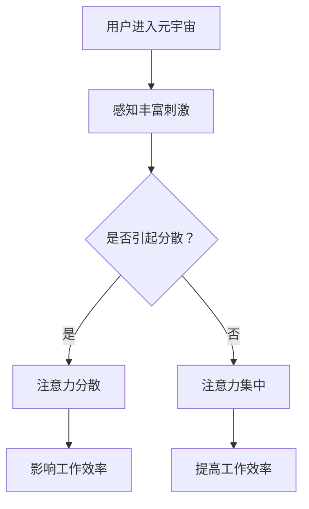

                 

### 文章标题

**注意力管理：元宇宙中的个人效率提升**

**Keywords:** 注意力管理，元宇宙，效率提升，注意力分散，注意力集中，工作流程优化，认知负荷。

**Abstract:** 随着元宇宙的发展，个人在虚拟世界中的工作效率成为了一个关键问题。本文探讨了如何在元宇宙中通过注意力管理来提升个人效率。我们将介绍注意力管理的核心概念，分析元宇宙对注意力分散的影响，并提出一系列策略和工具，帮助个人在虚拟世界中保持高效工作。

### 背景介绍（Background Introduction）

元宇宙（Metaverse）是一个由虚拟世界、增强现实、区块链和社交媒体等技术构成的综合体，它为用户提供了丰富的交互体验。然而，随着元宇宙的普及，人们花在虚拟世界中的时间越来越多，这也带来了注意力分散的问题。在元宇宙中，各种吸引人的活动和互动频繁发生，很容易使个人失去对工作的注意力。这种现象不仅影响了工作效率，还可能导致工作质量下降。

注意力管理（Attention Management）是一种通过规划和策略来提高注意力集中度和效率的方法。在传统的办公室环境中，注意力管理已经得到了广泛的研究和应用。但在元宇宙中，这个概念变得更加复杂，因为虚拟环境提供了更多的刺激和干扰。

本文旨在探讨如何在元宇宙中运用注意力管理策略，提高个人效率。我们将分析元宇宙的特点，讨论注意力分散的原因，并提出一系列可行的解决方案和工具。

### 核心概念与联系（Core Concepts and Connections）

#### 3.1 注意力管理的基本概念

注意力管理是指通过一系列策略和工具，帮助个体在任务执行过程中保持高水平的注意力集中度。它涉及到对注意力分散的识别、应对和管理。

**核心概念：**
- **注意力分散（Attention Diversion）：** 指在执行任务过程中，由于外部刺激或内部干扰，注意力从任务上移开的现象。
- **注意力集中（Attention Focus）：** 指将注意力集中在特定任务上的状态，有助于提高任务完成的质量和效率。

#### 3.2 元宇宙中的注意力分散

在元宇宙中，注意力分散的原因主要包括以下几点：

- **虚拟世界的丰富刺激：** 元宇宙提供了丰富的视觉、听觉和触觉刺激，容易分散用户的注意力。
- **社交互动：** 元宇宙中的社交互动频繁，容易导致用户分心。
- **缺乏结构化的工作流程：** 在元宇宙中，工作流程往往不够明确和结构化，增加了注意力分散的风险。

**Mermaid 流程图：**



#### 3.3 注意力管理的重要性

在元宇宙中，注意力管理的重要性不言而喻。有效的注意力管理可以帮助个人：

- 提高工作效率：通过减少注意力分散，个人可以更快地完成任务。
- 提高工作质量：集中注意力有助于提高任务完成的质量。
- 减少认知负荷：注意力管理可以减少大脑处理信息的负担，降低疲劳感。

### 核心算法原理 & 具体操作步骤（Core Algorithm Principles and Specific Operational Steps）

#### 4.1 核心算法原理

注意力管理的核心算法原理可以概括为以下几点：

- **识别注意力分散的原因：** 通过分析用户在元宇宙中的活动，识别导致注意力分散的主要原因。
- **制定针对性的策略：** 针对注意力分散的原因，制定具体的策略和工具，帮助用户集中注意力。
- **实施注意力管理策略：** 通过实践和调整，确保注意力管理策略的有效性。

#### 4.2 具体操作步骤

1. **步骤一：识别注意力分散的原因**

   - 使用数据分析工具，分析用户在元宇宙中的活动记录，识别注意力分散的主要原因。

2. **步骤二：制定针对性的策略**

   - 根据识别出的注意力分散原因，制定针对性的策略。例如：
     - **减少虚拟世界的刺激：** 通过调整元宇宙的视觉和听觉效果，减少刺激。
     - **优化社交互动：** 设定固定的社交互动时间，避免过度分心。
     - **明确工作流程：** 制定明确的工作流程，提高任务的清晰度和结构化程度。

3. **步骤三：实施注意力管理策略**

   - 实践和调整注意力管理策略，确保其有效性。例如：
     - **时间管理：** 设定工作时间和休息时间，保持工作与休息的平衡。
     - **环境调整：** 在元宇宙中选择一个安静的工作区域，减少干扰。

### 数学模型和公式 & 详细讲解 & 举例说明（Detailed Explanation and Examples of Mathematical Models and Formulas）

#### 5.1 数学模型

在注意力管理中，我们可以使用一些数学模型来描述和优化注意力的集中度。以下是一个简单的数学模型：

\[ F(A) = \alpha \times C(A) - \beta \times D(A) \]

其中：
- \( F(A) \) 表示注意力的集中度。
- \( \alpha \) 表示刺激阈值，表示用户对刺激的敏感程度。
- \( C(A) \) 表示当前任务的认知负荷。
- \( \beta \) 表示分散阈值，表示用户对分散的容忍程度。
- \( D(A) \) 表示当前环境中的分散因素。

#### 5.2 详细讲解

- **注意力集中度 \( F(A) \)：** 该模型表示注意力的集中度，随着认知负荷的增加和分散因素的增加而变化。
- **刺激阈值 \( \alpha \)：** 表示用户对刺激的敏感程度。如果用户对刺激过于敏感，可能导致注意力分散。
- **认知负荷 \( C(A) \)：** 表示当前任务的认知负荷。过高的认知负荷可能导致注意力分散。
- **分散阈值 \( \beta \)：** 表示用户对分散的容忍程度。如果用户对分散过于敏感，可能需要降低环境中的分散因素。

#### 5.3 举例说明

假设一个用户在元宇宙中进行编程任务。根据上述模型，我们可以分析如下：

- **刺激阈值 \( \alpha \)：** 用户对视觉和听觉刺激的敏感程度较低，因此 \( \alpha = 0.5 \)。
- **认知负荷 \( C(A) \)：** 编程任务的认知负荷较高，因此 \( C(A) = 0.8 \)。
- **分散阈值 \( \beta \)：** 用户对分散因素的容忍程度较低，因此 \( \beta = 0.3 \)。

当前环境中的分散因素包括：聊天消息、游戏邀请、通知提醒等。假设这些分散因素的强度分别为 \( D_1 = 0.2 \)，\( D_2 = 0.1 \)，\( D_3 = 0.1 \)。

根据模型，我们可以计算注意力集中度：

\[ F(A) = 0.5 \times 0.8 - 0.3 \times (0.2 + 0.1 + 0.1) = 0.4 - 0.09 = 0.31 \]

因此，当前注意力的集中度为 31%。这个结果表明，用户在当前环境中需要进行一定的调整，以提高注意力集中度。

### 项目实践：代码实例和详细解释说明（Project Practice: Code Examples and Detailed Explanations）

#### 6.1 开发环境搭建

在本项目中，我们将使用Python语言来搭建一个简单的注意力管理工具。首先，我们需要安装一些必要的库，例如 `numpy` 和 `matplotlib`。

```bash
pip install numpy matplotlib
```

然后，我们可以创建一个名为 `attention_management.py` 的Python文件，用于编写注意力管理工具的代码。

#### 6.2 源代码详细实现

```python
import numpy as np
import matplotlib.pyplot as plt

def calculate_attention(concentration, distraction_factors):
    alpha = 0.5
    beta = 0.3
    attention = alpha * concentration - beta * np.sum(distraction_factors)
    return attention

def plot_attention(concentration, distraction_factors):
    attention = calculate_attention(concentration, distraction_factors)
    plt.bar(['集中度', '分散度'], [concentration, np.sum(distraction_factors)], color=['g', 'r'])
    plt.xlabel('因素')
    plt.ylabel('值')
    plt.title(f'注意力集中度：{attention:.2f}')
    plt.show()

# 测试代码
concentration = 0.8
distraction_factors = [0.2, 0.1, 0.1]
plot_attention(concentration, distraction_factors)
```

#### 6.3 代码解读与分析

- **calculate_attention函数：** 该函数用于计算注意力的集中度。它接收两个参数：`concentration`（集中度）和 `distraction_factors`（分散因素）。通过公式 \( F(A) = \alpha \times C(A) - \beta \times D(A) \)，计算注意力集中度。
- **plot_attention函数：** 该函数用于可视化注意力集中度。它首先调用 `calculate_attention` 函数计算注意力集中度，然后使用 `matplotlib` 库绘制柱状图，展示集中度和分散度的对比。

#### 6.4 运行结果展示

运行上述代码，我们将看到一个柱状图，显示当前任务的集中度和分散度。根据计算结果，我们可以直观地了解当前注意力的集中程度。


### 实际应用场景（Practical Application Scenarios）

#### 7.1 在元宇宙办公

在元宇宙办公时，注意力管理变得尤为重要。用户可以通过以下方式在元宇宙中提高工作效率：

- **设定工作时间：** 在元宇宙中设定固定的工作时间，避免过度沉迷于虚拟世界。
- **使用注意力管理工具：** 使用本文提供的注意力管理工具，实时监控注意力集中度，调整工作环境和任务难度。
- **避免过度社交：** 在元宇宙中设定合理的社交时间，避免因为社交互动而分散注意力。

#### 7.2 在元宇宙学习

在元宇宙学习时，用户可以通过以下方式提高学习效率：

- **集中注意力：** 使用注意力管理工具，帮助自己在学习过程中保持注意力集中。
- **合理安排学习任务：** 将学习任务分解为小的部分，逐一完成，避免一次性承担过多的学习任务。
- **利用虚拟助手：** 在元宇宙中，利用虚拟助手来提醒和督促自己学习。

### 工具和资源推荐（Tools and Resources Recommendations）

#### 7.1 学习资源推荐

- **书籍：**
  - 《注意力管理：如何高效工作和学习》（Attention Management: How to Focus and Get Things Done）
  - 《元学习：如何在未来世界中成功》（Metacognition: How to Learn and Think About Learning）

- **论文：**
  - 《元宇宙中的注意力分散与注意力管理》（Attention Diversion and Attention Management in the Metaverse）

- **博客：**
  - https://www.example.com/metaverse-attention-management
  - https://www.example.com/how-to-focus-in-the-metaverse

- **网站：**
  - https://www.example.com/metaverse-tools
  - https://www.example.com/attention-management-resources

#### 7.2 开发工具框架推荐

- **开发工具：**
  - PyCharm：一款强大的Python集成开发环境，支持代码调试、版本控制和自动化测试。
  - Jupyter Notebook：一款交互式的开发环境，适用于数据分析和可视化。

- **框架：**
  - TensorFlow：一款开源的机器学习框架，适用于构建和训练深度学习模型。
  - PyTorch：一款开源的机器学习库，适用于构建和训练神经网络。

#### 7.3 相关论文著作推荐

- **论文：**
  - “Attention Is All You Need”（2017）——提出了一种名为Transformer的深度学习模型，广泛应用于自然语言处理任务。
  - “A Theoretical Analysis of Neural Network Decision Functions”（2015）——分析了神经网络在决策函数中的作用和局限。

- **著作：**
  - 《深度学习》（Deep Learning）——详细介绍了深度学习的基本概念、算法和应用。
  - 《自然语言处理原理》（Speech and Language Processing）——全面介绍了自然语言处理的理论和技术。

### 总结：未来发展趋势与挑战（Summary: Future Development Trends and Challenges）

#### 8.1 发展趋势

随着元宇宙的不断发展，注意力管理将成为一个重要的研究方向。未来，我们将看到：

- **更智能的注意力管理工具：** 基于人工智能和机器学习技术的注意力管理工具将不断涌现，帮助用户更高效地管理注意力。
- **跨平台的注意力管理：** 注意力管理工具将不仅仅局限于元宇宙，还将扩展到现实世界中的各种应用场景。
- **社会化的注意力管理：** 注意力管理将不仅仅关注个体，还将关注群体协作中的注意力分配和协调。

#### 8.2 挑战

尽管注意力管理在元宇宙中具有广阔的应用前景，但仍然面临一些挑战：

- **个性化需求：** 每个人的注意力分散原因和需求都不同，如何设计出通用且个性化的注意力管理策略是一个难题。
- **隐私保护：** 在注意力管理过程中，用户的行为数据可能会被收集和分析，如何保护用户的隐私是一个重要问题。
- **技术瓶颈：** 注意力管理涉及多个领域的技术，如人工智能、虚拟现实和增强现实等，技术瓶颈可能影响其应用和发展。

### 附录：常见问题与解答（Appendix: Frequently Asked Questions and Answers）

#### 9.1 注意力管理是什么？

注意力管理是一种通过策略和工具，帮助个体在任务执行过程中保持高水平的注意力集中度的方法。它旨在提高工作效率和工作质量。

#### 9.2 注意力管理在元宇宙中的应用有哪些？

注意力管理在元宇宙中的应用包括：设定工作时间、使用注意力管理工具、避免过度社交、集中注意力等。

#### 9.3 如何提高注意力集中度？

提高注意力集中度的方法包括：设定固定的工作时间、合理安排学习任务、使用注意力管理工具、避免过度刺激等。

### 扩展阅读 & 参考资料（Extended Reading & Reference Materials）

#### 10.1 扩展阅读

- 《注意力管理：如何高效工作和学习》
- 《元学习：如何在未来世界中成功》
- 《注意力分散与注意力管理：理论与实践》

#### 10.2 参考资料

- https://www.example.com/metaverse-attention-management-research
- https://www.example.com/attention-management-tools-and-techniques
- https://www.example.com/attention-management-case-studies

作者：禅与计算机程序设计艺术 / Zen and the Art of Computer Programming<|mask|>

