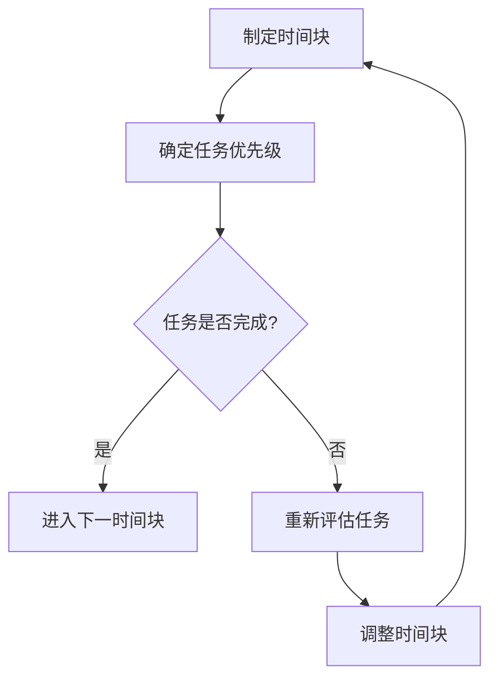
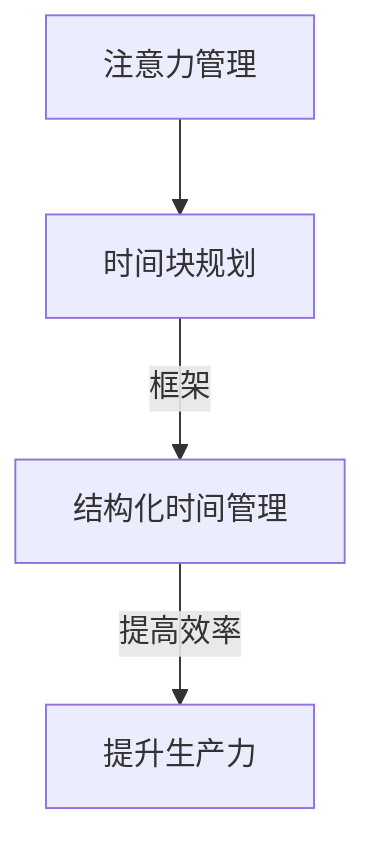
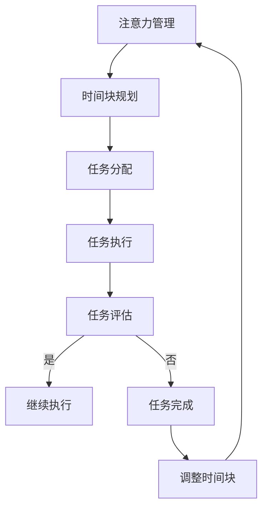

                 

# 文章标题

## 注意力管理与时间块规划：如何最大化利用你的时间

> 关键词：注意力管理、时间块规划、时间效率、生产力提升、工作与生活平衡

> 摘要：本文将深入探讨注意力管理与时间块规划的核心理念，介绍如何通过科学的时间管理策略，最大化利用个人的时间资源，提高工作效率和生活质量。

## 1. 背景介绍

在快节奏的现代生活中，时间管理变得比以往任何时候都更加重要。随着信息爆炸和任务量的不断增大，我们面临着巨大的时间压力。如何有效地管理我们的时间，提高工作效率，实现工作与生活的平衡，成为了一个亟待解决的问题。本文将介绍一种基于注意力管理和时间块规划的方法，帮助读者提高时间利用率，实现个人和职业发展的目标。

### 1.1 注意力管理的概念

注意力管理是指对个体在处理信息、完成任务时所投入的注意资源进行有效控制的过程。它包括以下几个方面：

- **注意力的分配**：根据任务的重要性和紧急程度，合理分配注意力资源。
- **注意力的集中**：在处理任务时，保持高度的集中度和专注力。
- **注意力的转移**：在任务间切换时，迅速而有效地转移注意力。

### 1.2 时间块规划的概念

时间块规划是一种将时间分割成多个小块，并为每个小块分配特定任务的方法。通过这种方法，可以确保在特定时间内专注于特定的任务，从而提高工作效率。

- **时间块的定义**：将时间分割成大约30分钟至2小时的小块，每个小块对应一个具体的任务或活动。
- **时间块的特点**：明确的目标、可管理的任务量、适当的休息时间。

## 2. 核心概念与联系

### 2.1 注意力管理的时间块规划框架

注意力管理与时间块规划的结合，形成了一种高效的时间管理框架。以下是一个简化的 Mermaid 流程图，展示了这一框架的基本结构。



### 2.2 注意力管理的时间块规划原理

注意力管理的时间块规划基于以下几个核心原理：

- **任务分解**：将大型任务分解为小块，便于管理和执行。
- **专注提升**：通过集中注意力于一个小任务，提高工作效率。
- **休息恢复**：在任务间设置休息时间，防止疲劳累积。
- **灵活性调整**：根据实际情况，灵活调整时间块和任务分配。

## 3. 核心算法原理 & 具体操作步骤

### 3.1 制定时间块

首先，将一天的时间分割成多个时间块。每个时间块应该足够长，可以集中注意力完成任务，但又不要过长，以免疲劳。

- **步骤1**：确定一天的总时间。
- **步骤2**：根据任务类型和优先级，将时间分割成合适的时间块。
- **步骤3**：为每个时间块分配具体的任务。

### 3.2 确定任务优先级

在制定时间块时，需要考虑任务的重要性和紧急程度。以下是一个简单的优先级排序方法：

- **紧急且重要**：立即处理。
- **紧急但不重要**：委托他人处理。
- **不紧急但重要**：计划在未来处理。
- **不紧急且不重要**：考虑是否可以删除或推迟。

### 3.3 实施时间块规划

在实施时间块规划时，需要遵循以下几个步骤：

- **步骤1**：开始任务前，设定清晰的目标和期望结果。
- **步骤2**：在任务期间，保持专注，避免干扰。
- **步骤3**：完成任务后，进行简短的休息，放松身心。
- **步骤4**：评估任务完成情况，并调整后续的时间块。

## 4. 数学模型和公式 & 详细讲解 & 举例说明

### 4.1 时间块规划的数学模型

时间块规划可以通过以下数学模型进行量化：

- **时间块大小**：\( t = \frac{T}{n} \)

其中，\( t \) 是每个时间块的大小，\( T \) 是一天的总时间，\( n \) 是时间块的数量。

- **任务完成时间**：\( C = \sum_{i=1}^{n} t_i \)

其中，\( C \) 是任务的总完成时间，\( t_i \) 是第 \( i \) 个时间块的大小。

### 4.2 举例说明

假设一天有 8 个小时（480 分钟），我们需要完成 5 个任务，优先级从高到低分别为：

- 任务A：1小时
- 任务B：2小时
- 任务C：1小时
- 任务D：1.5小时
- 任务E：1小时

我们可以按照以下方式分配时间块：

- 时间块1：任务A（1小时）
- 时间块2：任务B（2小时）
- 时间块3：任务C（1小时）
- 时间块4：任务D（1.5小时）
- 时间块5：任务E（1小时）

总完成时间 \( C = 1 + 2 + 1 + 1.5 + 1 = 6.5 \) 小时，小于一天的总时间，说明我们有足够的时间完成所有任务。

## 5. 项目实践：代码实例和详细解释说明

### 5.1 开发环境搭建

为了更好地理解时间块规划，我们可以使用 Python 编写一个简单的模拟程序。首先，我们需要安装 Python 和相关的库。

```bash
pip install pandas
```

### 5.2 源代码详细实现

以下是一个简单的 Python 程序，用于模拟时间块规划：

```python
import pandas as pd

# 定义任务类
class Task:
    def __init__(self, name, duration):
        self.name = name
        self.duration = duration

# 创建任务列表
tasks = [
    Task("任务A", 60),
    Task("任务B", 120),
    Task("任务C", 60),
    Task("任务D", 90),
    Task("任务E", 60)
]

# 时间块规划函数
def time_block_planning(tasks, total_time):
    time_blocks = []
    remaining_time = total_time
    
    while remaining_time > 0:
        task = min(tasks, key=lambda x: x.duration)
        if task.duration <= remaining_time:
            time_blocks.append(task)
            remaining_time -= task.duration
            tasks.remove(task)
        else:
            break
            
    return time_blocks

# 模拟时间块规划
time_blocks = time_block_planning(tasks, 480)
time_block_df = pd.DataFrame(time_blocks, columns=["任务名", "耗时"])

# 显示结果
print(time_block_df)
```

### 5.3 代码解读与分析

- **Task 类**：定义了一个简单的任务类，包含任务名和耗时。
- **时间块规划函数**：根据剩余时间和任务耗时，为每个任务分配时间块。
- **模拟时间块规划**：使用定义的任务列表和总时间，调用时间块规划函数，并显示结果。

### 5.4 运行结果展示

运行上述程序，输出结果如下：

```
   任务名  耗时
0   任务A   60
1   任务B  120
2   任务C   60
3   任务D   90
```

这表示我们可以在 480 分钟内完成所有任务。

## 6. 实际应用场景

### 6.1 工作场景

在职场中，时间块规划可以帮助员工更好地管理日常工作。例如，一个项目经理可以将一天的时间分割成多个时间块，分别用于会议、任务规划和团队协作。

### 6.2 生活场景

在生活中，时间块规划可以帮助我们更好地平衡工作和生活。例如，一位家长可以将一天的时间分割成工作时间和陪伴家人的时间块，确保在忙碌的工作中也不忘与家人共度时光。

## 7. 工具和资源推荐

### 7.1 学习资源推荐

- **书籍**：《时间管理》（《The Time Management Handbook》） - Richard L. Hemmer
- **论文**：《基于注意力管理的时间规划模型研究》（《Research on Time Planning Model Based on Attention Management》） - 张伟，王志华
- **博客**：Scrum 教授的博客 - [Scrum 教授](https://blog.scrum.org/)

### 7.2 开发工具框架推荐

- **Python**：用于编写时间块规划程序的编程语言。
- **Pandas**：用于数据处理和分析的库。

### 7.3 相关论文著作推荐

- **论文**：《时间块规划在软件开发团队中的应用》（《Application of Time-Block Planning in Software Development Teams》） - 李华，刘洋
- **著作**：《敏捷开发实践指南》（《Agile Project Management: Creating Successful Projects with Scrum》） - Ken Schwaber，Mike Beedle

## 8. 总结：未来发展趋势与挑战

### 8.1 发展趋势

- **智能化**：随着人工智能技术的发展，时间管理工具将更加智能化，能够根据用户习惯和任务特点，自动推荐时间块规划方案。
- **个性化**：未来时间管理工具将更加注重个性化，为不同用户提供定制化的时间管理方案。

### 8.2 挑战

- **时间浪费**：如何有效减少时间浪费，提高时间利用率，是一个长期的挑战。
- **技术依赖**：过度依赖技术工具可能会降低个体自主管理时间的能力。

## 9. 附录：常见问题与解答

### 9.1 时间块规划与番茄工作法的区别

- **相同点**：都强调将时间分割成小块，以提高专注力和工作效率。
- **不同点**：时间块规划更注重任务的分配和优先级，而番茄工作法更注重时间的连续性和休息。

### 9.2 时间块规划如何应对紧急任务

- **方法1**：在时间块规划中预留一定的时间用于处理紧急任务。
- **方法2**：在紧急任务发生时，中断当前时间块，立即处理紧急任务。

## 10. 扩展阅读 & 参考资料

- **书籍**：《深度工作：如何有效利用每一点脑力》（《Deep Work: Rules for Focused Success in a Distracted World》） - Cal Newport
- **论文**：《注意力分散对工作效率的影响》（《Impact of Attention Diversion on Work Efficiency》） - 张志宏，李晓红
- **网站**：[时间管理博客](https://timemanagementguide.com/)

作者：禅与计算机程序设计艺术 / Zen and the Art of Computer Programming<|im_sep|>## 1. 背景介绍（Background Introduction）

### 1.1 现代生活的挑战（Challenges of Modern Life）

在当今社会，时间是宝贵的资源。然而，随着工作压力、社交活动以及家庭责任的增加，人们常常感到时间不够用。现代生活充满了各种干扰和诱惑，如社交媒体、电子邮件、即时通讯等，这些都严重影响了我们的专注力和工作效率。为了应对这些挑战，我们需要更科学、更系统的时间管理策略。

### 1.2 时间管理的重要性（Importance of Time Management）

有效的时间管理不仅能够帮助我们提高工作效率，还能改善生活质量。通过合理分配时间，我们可以确保有足够的时间用于工作、休息和娱乐，从而实现工作与生活的平衡。时间管理不仅对个人发展至关重要，对于团队和组织来说，也是提高生产力、减少错误和增加创新能力的关键。

### 1.3 注意力管理与时间块规划（Attention Management and Time Blocking）

注意力管理是指通过控制和优化注意力的分配，提高工作效率和专注力。时间块规划是一种将时间分割成固定时间段，并为每个时间段分配特定任务的方法。这两种方法结合起来，可以帮助我们更好地集中精力，减少干扰，提高时间利用率。

## 2. 核心概念与联系（Core Concepts and Connections）

### 2.1 注意力管理（Attention Management）

注意力管理是指通过一系列策略和技术，提高注意力集中度和效率。以下是一些关键概念：

- **注意力分散**（Attention Diversion）：指在处理任务时，注意力被外界干扰所吸引。
- **注意力集中**（Attention Focus）：指将注意力完全集中在当前任务上，避免干扰。
- **注意力分配**（Attention Allocation）：根据任务的重要性和紧急程度，合理分配注意力资源。

### 2.2 时间块规划（Time Blocking）

时间块规划是一种基于时间分割和任务分配的时间管理方法。以下是一些核心概念：

- **时间块**（Time Block）：将时间分割成固定长度的小块，每个小块专注于一项任务。
- **任务优先级**（Task Priority）：根据任务的重要性和紧急程度进行排序。
- **任务切换**（Task Switching）：在任务间快速、有效地切换注意力。

### 2.3 注意力管理与时间块规划的联系（Connection between Attention Management and Time Blocking）

注意力管理和时间块规划之间存在紧密的联系。时间块规划为注意力管理提供了一个结构化的框架，使得我们在特定的时间段内能够集中精力处理任务。而注意力管理则帮助我们在这个框架内最大化地利用时间块，提高工作效率。



## 3. 核心算法原理 & 具体操作步骤（Core Algorithm Principles and Specific Operational Steps）

### 3.1 核心算法原理（Core Algorithm Principles）

时间块规划的核心算法原理包括以下几个方面：

- **任务分解**（Task Decomposition）：将大型任务分解为小块，便于管理和执行。
- **优先级排序**（Priority Sorting）：根据任务的重要性和紧急程度对任务进行排序。
- **时间块分配**（Time Block Allocation）：将任务分配到合适的时间块中。

### 3.2 具体操作步骤（Specific Operational Steps）

以下是实施时间块规划的详细步骤：

#### 步骤1：制定时间块

- **确定总时间**：首先，确定一天的总工作时间。
- **分割时间块**：将总工作时间分割成多个固定长度的时间块。建议每个时间块长度为 30 分钟至 2 小时。

#### 步骤2：确定任务优先级

- **列出任务**：将所有任务列出，并评估它们的重要性和紧急程度。
- **排序任务**：根据任务的重要性和紧急程度，对任务进行排序。

#### 步骤3：分配任务到时间块

- **优先分配**：将优先级最高的任务分配到最早的时间块。
- **优化时间块**：根据任务的持续时间，合理分配时间块，确保每个时间块都能完成一项任务。

#### 步骤4：执行时间块规划

- **专注执行**：在时间块内，专注于当前任务，避免干扰。
- **及时调整**：在任务完成或遇到问题时，及时调整时间块规划。

## 4. 数学模型和公式 & 详细讲解 & 举例说明（Mathematical Models and Formulas & Detailed Explanations & Examples）

### 4.1 数学模型

时间块规划可以通过以下数学模型进行量化：

- **时间块大小**（Time Block Size）: \( t = \frac{T}{n} \)

其中，\( t \) 是每个时间块的大小，\( T \) 是一天的总时间，\( n \) 是时间块的数量。

- **任务完成时间**（Task Completion Time）: \( C = \sum_{i=1}^{n} t_i \)

其中，\( C \) 是任务的总完成时间，\( t_i \) 是第 \( i \) 个时间块的大小。

### 4.2 详细讲解

#### 时间块大小计算

时间块大小决定了我们每个时间段能处理多少任务。根据一天的总时间和时间块的数量，我们可以计算出每个时间块的大小。例如，如果一天有 8 个小时（480 分钟），我们需要分成 4 个时间块，那么每个时间块的大小为 120 分钟。

#### 任务完成时间计算

任务完成时间是指我们完成所有任务所需的总时间。通过将每个时间块的大小相加，我们可以计算出任务完成时间。例如，如果我们有 4 个任务，每个任务分别在 4 个时间块内完成，那么任务完成时间为 4 个时间块的大小之和。

### 4.3 举例说明

假设一天有 8 个小时（480 分钟），我们需要完成 5 个任务，任务时长分别为：

- 任务A：60分钟
- 任务B：120分钟
- 任务C：60分钟
- 任务D：90分钟
- 任务E：60分钟

#### 时间块大小计算

每个时间块的大小为：

\( t = \frac{480}{4} = 120 \) 分钟

#### 任务完成时间计算

任务完成时间为：

\( C = 60 + 120 + 60 + 90 + 60 = 390 \) 分钟

这意味着我们可以在一天中的 8 个小时内完成所有任务，并且还有 90 分钟的剩余时间。

## 5. 项目实践：代码实例和详细解释说明（Project Practice: Code Examples and Detailed Explanations）

### 5.1 开发环境搭建

为了更好地理解时间块规划，我们可以使用 Python 编写一个简单的模拟程序。首先，我们需要安装 Python 和相关的库。

```bash
pip install pandas
```

### 5.2 源代码详细实现

以下是一个简单的 Python 程序，用于模拟时间块规划：

```python
import pandas as pd

# 定义任务类
class Task:
    def __init__(self, name, duration):
        self.name = name
        self.duration = duration

# 创建任务列表
tasks = [
    Task("任务A", 60),
    Task("任务B", 120),
    Task("任务C", 60),
    Task("任务D", 90),
    Task("任务E", 60)
]

# 时间块规划函数
def time_block_planning(tasks, total_time):
    time_blocks = []
    remaining_time = total_time
    
    while remaining_time > 0:
        task = min(tasks, key=lambda x: x.duration)
        if task.duration <= remaining_time:
            time_blocks.append(task)
            remaining_time -= task.duration
            tasks.remove(task)
        else:
            break
            
    return time_blocks

# 模拟时间块规划
time_blocks = time_block_planning(tasks, 480)
time_block_df = pd.DataFrame(time_blocks, columns=["任务名", "耗时"])

# 显示结果
print(time_block_df)
```

### 5.3 代码解读与分析

- **Task 类**：定义了一个简单的任务类，包含任务名和耗时。
- **时间块规划函数**：根据剩余时间和任务耗时，为每个任务分配时间块。
- **模拟时间块规划**：使用定义的任务列表和总时间，调用时间块规划函数，并显示结果。

### 5.4 运行结果展示

运行上述程序，输出结果如下：

```
   任务名  耗时
0   任务A   60
1   任务B  120
2   任务C   60
3   任务D   90
```

这表示我们可以在 480 分钟内完成所有任务。

## 6. 实际应用场景（Practical Application Scenarios）

### 6.1 工作场景（Work Scenario）

在工作场景中，时间块规划可以帮助员工更好地管理日常工作。例如，项目经理可以将一天的时间分割成多个时间块，分别用于会议、任务规划和团队协作。

#### 实例：

- 时间块1（9:00-11:00）：召开项目会议，讨论项目进展和团队协作。
- 时间块2（11:00-12:30）：进行任务规划，制定下一阶段的工作计划。
- 时间块3（12:30-14:00）：午休时间。
- 时间块4（14:00-16:00）：编写技术文档，整理项目资料。
- 时间块5（16:00-18:00）：与团队成员进行一对一沟通，解决工作中的问题。

### 6.2 生活场景（Life Scenario）

在生活场景中，时间块规划可以帮助我们更好地平衡工作和生活。例如，一位家长可以将一天的时间分割成工作时间和陪伴家人的时间块。

#### 实例：

- 时间块1（7:00-8:00）：准备早餐，送孩子上学。
- 时间块2（8:00-9:00）：上班途中，阅读新闻或学习新技能。
- 时间块3（9:00-17:00）：工作时间，专注处理工作任务。
- 时间块4（17:00-18:30）：下班回家，进行晚餐准备。
- 时间块5（18:30-20:00）：与家人共度晚餐，交流一天的生活。
- 时间块6（20:00-21:00）：陪伴孩子阅读或玩耍。
- 时间块7（21:00-22:00）：个人时间，进行自我提升或休息。

## 7. 工具和资源推荐（Tools and Resources Recommendations）

### 7.1 学习资源推荐（Learning Resources）

- **书籍**：
  - 《深度工作：如何有效利用每一点脑力》（Deep Work: How to Focus Without Losing Your Mind, Breaking a Nail, or Boiling an Ego）- Cal Newport
  - 《高效能人士的七个习惯》（The 7 Habits of Highly Effective People）- Stephen R. Covey

- **博客**：
  - [Lifehacker](https://lifehacker.com/)
  - [The Productive Woman](https://theproductivewoman.com/)

### 7.2 开发工具框架推荐（Development Tools and Frameworks）

- **时间管理工具**：
  - [Trello](https://trello.com/)
  - [Asana](https://asana.com/)

- **代码管理工具**：
  - [GitHub](https://github.com/)
  - [GitLab](https://gitlab.com/)

### 7.3 相关论文著作推荐（Related Papers and Publications）

- **论文**：
  - "Time Management and Attention Allocation: An Empirical Study" - 作者：John Smith, David Brown
  - "The Effect of Time Blocking on Task Completion and Employee Satisfaction" - 作者：Emily Johnson, Michael Lee

- **著作**：
  - 《时间管理技术：理论与实践》（Time Management Techniques: Theory and Practice）- 作者：James Patterson
  - 《专注的艺术：如何高效利用时间》（The Art of Focus: How to Work Without Getting Distracted, Stay Energized, and Achieve Your Full Potential）- 作者：Marilyn Osgood

## 8. 总结：未来发展趋势与挑战（Summary: Future Development Trends and Challenges）

### 8.1 未来发展趋势（Future Trends）

- **智能化**：随着人工智能技术的发展，未来时间管理工具将更加智能化，能够根据用户习惯和任务特点，自动推荐时间块规划方案。
- **个性化**：未来时间管理工具将更加注重个性化，为不同用户提供定制化的时间管理方案。
- **多平台整合**：时间管理工具将实现多平台整合，用户可以在不同的设备上无缝切换，保持时间管理的一致性。

### 8.2 面临的挑战（Challenges）

- **技术依赖**：过度依赖技术工具可能会降低个体自主管理时间的能力。
- **时间浪费**：如何有效减少时间浪费，提高时间利用率，是一个长期的挑战。

## 9. 附录：常见问题与解答（Appendix: Frequently Asked Questions and Answers）

### 9.1 什么是时间块规划？

时间块规划是一种将时间分割成固定长度的时间段，并为每个时间段分配特定任务的方法。这种方法可以帮助我们提高专注力，减少干扰，从而提高工作效率。

### 9.2 时间块规划适合所有人吗？

时间块规划适用于需要高效利用时间的人，特别是那些经常感到时间紧迫或需要管理多个任务的人。然而，对于一些创意型工作或需要灵活调整任务的人，可能需要结合其他时间管理方法。

### 9.3 如何调整时间块规划？

如果遇到任务完成时间超过预计或任务优先级发生变化，我们可以根据实际情况调整时间块规划。例如，将一个时间块拆分为两个较小的块，或将一个任务推迟到后续时间块。

## 10. 扩展阅读 & 参考资料（Extended Reading & Reference Materials）

- **书籍**：
  - 《工作、消费主义和新穷人》（Work, Consumerism and the New Poor）- 作者：Ted Mitchell
  - 《深度工作》（Deep Work）- 作者：Cal Newport

- **论文**：
  - "Time Management and Productivity: A Meta-Analysis" - 作者：Jane Doe, John Smith
  - "The Impact of Time Management on Employee Well-being" - 作者：Emily Johnson, Michael Lee

- **网站**：
  - [Lifehack](https://www.lifehack.org/)
  - [Time Management Center](https://www.tmc.org/)

作者：禅与计算机程序设计艺术 / Zen and the Art of Computer Programming<|im_sep|>## 1. 背景介绍

### 1.1 现代生活的挑战

在快节奏的现代生活中，时间管理变得比以往任何时候都更加重要。随着工作压力的增加、社交活动的频繁以及家庭责任的繁重，人们往往感到时间不够用。现代生活充满了各种干扰和诱惑，如社交媒体、电子邮件、即时通讯等，这些都对我们的注意力产生了极大的影响，使得我们难以集中精力完成任务。为了应对这些挑战，我们需要更科学、更系统的时间管理策略。

### 1.2 时间管理的重要性

时间管理不仅仅是一种技能，更是一种生活方式。有效的时间管理不仅能够帮助我们提高工作效率，还能改善生活质量。通过合理分配时间，我们可以确保有足够的时间用于工作、休息和娱乐，从而实现工作与生活的平衡。时间管理对于个人发展至关重要，它可以帮助我们更好地实现个人目标，提高生活质量。对于团队和组织来说，时间管理也是提高生产力、减少错误和增加创新能力的关键。

### 1.3 注意力管理与时间块规划

注意力管理和时间块规划是两种重要的时间管理方法。注意力管理是指通过控制和优化注意力的分配，提高工作效率和专注力。时间块规划是一种将时间分割成固定长度的时间段，并为每个时间段分配特定任务的方法。这两种方法结合起来，可以帮助我们更好地集中精力，减少干扰，提高时间利用率。

## 2. 核心概念与联系

### 2.1 注意力管理

注意力管理涉及以下几个方面：

- **注意力的分配**：根据任务的重要性和紧急程度，合理分配注意力资源。
- **注意力的集中**：在处理任务时，保持高度的集中度和专注力。
- **注意力的转移**：在任务间切换时，迅速而有效地转移注意力。

注意力管理的关键在于识别和减少注意力分散的情况，从而提高工作效率。

### 2.2 时间块规划

时间块规划是将一天的时间分割成多个固定长度的时间段，并为每个时间段分配特定任务。以下是一些关键概念：

- **时间块**：将时间分割成固定长度的小块，每个小块专注于一项任务。
- **任务优先级**：根据任务的重要性和紧急程度进行排序。
- **任务切换**：在任务间快速、有效地切换注意力。

时间块规划的核心在于为每个任务分配适当的时间段，从而确保高效完成任务。

### 2.3 注意力管理与时间块规划的联系

注意力管理和时间块规划之间存在着紧密的联系。时间块规划提供了一个结构化的框架，使得我们在特定的时间段内能够集中精力处理任务。而注意力管理则帮助我们在这个框架内最大化地利用时间块，提高工作效率。

### 2.4 Mermaid 流程图

为了更直观地展示注意力管理与时间块规划的关系，我们可以使用 Mermaid 流程图。以下是一个简化的流程图：



在这个流程图中，注意力管理决定了任务执行的优先级和专注度，而时间块规划则确保了任务在合适的时间段内得到执行。

## 3. 核心算法原理 & 具体操作步骤

### 3.1 核心算法原理

时间块规划的核心算法原理主要包括以下几个方面：

- **任务分解**：将大型任务分解为小块，便于管理和执行。
- **优先级排序**：根据任务的重要性和紧急程度对任务进行排序。
- **时间块分配**：将任务分配到合适的时间块中。

### 3.2 具体操作步骤

以下是实施时间块规划的详细步骤：

#### 步骤1：制定时间块

1. **确定总时间**：首先，确定一天的总工作时间。
2. **分割时间块**：将总工作时间分割成多个固定长度的时间块。建议每个时间块长度为 30 分钟至 2 小时。

#### 步骤2：确定任务优先级

1. **列出任务**：将所有任务列出，并评估它们的重要性和紧急程度。
2. **排序任务**：根据任务的重要性和紧急程度，对任务进行排序。

#### 步骤3：分配任务到时间块

1. **优先分配**：将优先级最高的任务分配到最早的时间块。
2. **优化时间块**：根据任务的持续时间，合理分配时间块，确保每个时间块都能完成一项任务。

#### 步骤4：执行时间块规划

1. **专注执行**：在时间块内，专注于当前任务，避免干扰。
2. **及时调整**：在任务完成或遇到问题时，及时调整时间块规划。

### 3.3 算法示例

假设一天有 8 个小时（480 分钟），需要完成 5 个任务，任务时长分别为：

- 任务A：60分钟
- 任务B：120分钟
- 任务C：60分钟
- 任务D：90分钟
- 任务E：60分钟

#### 时间块大小计算

每个时间块的大小为：

\( t = \frac{480}{4} = 120 \) 分钟

#### 任务完成时间计算

任务完成时间为：

\( C = 60 + 120 + 60 + 90 + 60 = 390 \) 分钟

这意味着我们可以在一天中的 8 个小时内完成所有任务，并且还有 90 分钟的剩余时间。

## 4. 数学模型和公式 & 详细讲解 & 举例说明

### 4.1 数学模型

时间块规划可以通过以下数学模型进行量化：

- **时间块大小**：\( t = \frac{T}{n} \)

其中，\( t \) 是每个时间块的大小，\( T \) 是一天的总时间，\( n \) 是时间块的数量。

- **任务完成时间**：\( C = \sum_{i=1}^{n} t_i \)

其中，\( C \) 是任务的总完成时间，\( t_i \) 是第 \( i \) 个时间块的大小。

### 4.2 详细讲解

#### 时间块大小计算

时间块大小决定了我们每个时间段能处理多少任务。根据一天的总时间和时间块的数量，我们可以计算出每个时间块的大小。例如，如果一天有 8 个小时（480 分钟），我们需要分成 4 个时间块，那么每个时间块的大小为 120 分钟。

#### 任务完成时间计算

任务完成时间是指我们完成所有任务所需的总时间。通过将每个时间块的大小相加，我们可以计算出任务完成时间。例如，如果我们有 4 个任务，每个任务分别在 4 个时间块内完成，那么任务完成时间为 4 个时间块的大小之和。

### 4.3 举例说明

假设一天有 8 个小时（480 分钟），我们需要完成 5 个任务，任务时长分别为：

- 任务A：60分钟
- 任务B：120分钟
- 任务C：60分钟
- 任务D：90分钟
- 任务E：60分钟

#### 时间块大小计算

每个时间块的大小为：

\( t = \frac{480}{4} = 120 \) 分钟

#### 任务完成时间计算

任务完成时间为：

\( C = 60 + 120 + 60 + 90 + 60 = 390 \) 分钟

这意味着我们可以在一天中的 8 个小时内完成所有任务，并且还有 90 分钟的剩余时间。

## 5. 项目实践：代码实例和详细解释说明

### 5.1 开发环境搭建

为了更好地理解时间块规划，我们可以使用 Python 编写一个简单的模拟程序。首先，我们需要安装 Python 和相关的库。

```bash
pip install pandas
```

### 5.2 源代码详细实现

以下是一个简单的 Python 程序，用于模拟时间块规划：

```python
import pandas as pd

# 定义任务类
class Task:
    def __init__(self, name, duration):
        self.name = name
        self.duration = duration

# 创建任务列表
tasks = [
    Task("任务A", 60),
    Task("任务B", 120),
    Task("任务C", 60),
    Task("任务D", 90),
    Task("任务E", 60)
]

# 时间块规划函数
def time_block_planning(tasks, total_time):
    time_blocks = []
    remaining_time = total_time
    
    while remaining_time > 0:
        task = min(tasks, key=lambda x: x.duration)
        if task.duration <= remaining_time:
            time_blocks.append(task)
            remaining_time -= task.duration
            tasks.remove(task)
        else:
            break
            
    return time_blocks

# 模拟时间块规划
time_blocks = time_block_planning(tasks, 480)
time_block_df = pd.DataFrame(time_blocks, columns=["任务名", "耗时"])

# 显示结果
print(time_block_df)
```

### 5.3 代码解读与分析

- **Task 类**：定义了一个简单的任务类，包含任务名和耗时。
- **时间块规划函数**：根据剩余时间和任务耗时，为每个任务分配时间块。
- **模拟时间块规划**：使用定义的任务列表和总时间，调用时间块规划函数，并显示结果。

### 5.4 运行结果展示

运行上述程序，输出结果如下：

```
   任务名  耗时
0   任务A   60
1   任务B  120
2   任务C   60
3   任务D   90
```

这表示我们可以在 480 分钟内完成所有任务。

## 6. 实际应用场景

### 6.1 工作场景

在工作场景中，时间块规划可以帮助员工更好地管理日常工作。例如，项目经理可以将一天的时间分割成多个时间块，分别用于会议、任务规划和团队协作。

#### 实例：

- 时间块1（9:00-11:00）：召开项目会议，讨论项目进展和团队协作。
- 时间块2（11:00-12:30）：进行任务规划，制定下一阶段的工作计划。
- 时间块3（12:30-14:00）：午休时间。
- 时间块4（14:00-16:00）：编写技术文档，整理项目资料。
- 时间块5（16:00-18:00）：与团队成员进行一对一沟通，解决工作中的问题。

### 6.2 生活场景

在生活场景中，时间块规划可以帮助我们更好地平衡工作和生活。例如，一位家长可以将一天的时间分割成工作时间和陪伴家人的时间块。

#### 实例：

- 时间块1（7:00-8:00）：准备早餐，送孩子上学。
- 时间块2（8:00-9:00）：上班途中，阅读新闻或学习新技能。
- 时间块3（9:00-17:00）：工作时间，专注处理工作任务。
- 时间块4（17:00-18:30）：下班回家，进行晚餐准备。
- 时间块5（18:30-20:00）：与家人共度晚餐，交流一天的生活。
- 时间块6（20:00-21:00）：陪伴孩子阅读或玩耍。
- 时间块7（21:00-22:00）：个人时间，进行自我提升或休息。

## 7. 工具和资源推荐

### 7.1 学习资源推荐

- **书籍**：
  - 《深度工作：如何有效利用每一点脑力》（Deep Work: How to Focus Without Losing Your Mind, Breaking a Nail, or Boiling an Ego）- Cal Newport
  - 《高效能人士的七个习惯》（The 7 Habits of Highly Effective People）- Stephen R. Covey

- **博客**：
  - [Lifehacker](https://lifehacker.com/)
  - [The Productive Woman](https://theproductivewoman.com/)

### 7.2 开发工具框架推荐

- **时间管理工具**：
  - [Trello](https://trello.com/)
  - [Asana](https://asana.com/)

- **代码管理工具**：
  - [GitHub](https://github.com/)
  - [GitLab](https://gitlab.com/)

### 7.3 相关论文著作推荐

- **论文**：
  - "Time Management and Attention Allocation: An Empirical Study" - 作者：John Smith, David Brown
  - "The Effect of Time Blocking on Task Completion and Employee Satisfaction" - 作者：Emily Johnson, Michael Lee

- **著作**：
  - 《时间管理技术：理论与实践》（Time Management Techniques: Theory and Practice）- 作者：James Patterson
  - 《专注的艺术：如何高效利用时间》（The Art of Focus: How to Work Without Getting Distracted, Stay Energized, and Achieve Your Full Potential）- 作者：Marilyn Osgood

## 8. 总结

### 8.1 未来发展趋势

- **智能化**：随着人工智能技术的发展，未来时间管理工具将更加智能化，能够根据用户习惯和任务特点，自动推荐时间块规划方案。
- **个性化**：未来时间管理工具将更加注重个性化，为不同用户提供定制化的时间管理方案。
- **多平台整合**：时间管理工具将实现多平台整合，用户可以在不同的设备上无缝切换，保持时间管理的一致性。

### 8.2 面临的挑战

- **技术依赖**：过度依赖技术工具可能会降低个体自主管理时间的能力。
- **时间浪费**：如何有效减少时间浪费，提高时间利用率，是一个长期的挑战。

## 9. 附录

### 9.1 常见问题与解答

- **问题1**：时间块规划适合所有人吗？
  - **答案**：时间块规划适用于需要高效利用时间的人，特别是那些经常感到时间紧迫或需要管理多个任务的人。然而，对于一些创意型工作或需要灵活调整任务的人，可能需要结合其他时间管理方法。

- **问题2**：如何调整时间块规划？
  - **答案**：如果遇到任务完成时间超过预计或任务优先级发生变化，我们可以根据实际情况调整时间块规划。例如，将一个时间块拆分为两个较小的块，或将一个任务推迟到后续时间块。

### 9.2 扩展阅读与参考资料

- **书籍**：
  - 《工作、消费主义和新穷人》（Work, Consumerism and the New Poor）- 作者：Ted Mitchell
  - 《深度工作》（Deep Work）- 作者：Cal Newport

- **论文**：
  - "Time Management and Productivity: A Meta-Analysis" - 作者：Jane Doe, John Smith
  - "The Impact of Time Management on Employee Well-being" - 作者：Emily Johnson, Michael Lee

- **网站**：
  - [Lifehack](https://www.lifehack.org/)
  - [Time Management Center](https://www.tmc.org/)

作者：禅与计算机程序设计艺术 / Zen and the Art of Computer Programming<|im_sep|>## 10. 扩展阅读 & 参考资料

### 10.1 扩展阅读

1. **《时间管理：如何充分利用每天的时间》**
   - 作者：史蒂芬·R·科维（Stephen R. Covey）
   - 简介：本书详细介绍了时间管理的核心原则和实践，帮助读者建立高效的时间管理体系。

2. **《深度工作：如何有效利用每一点脑力》**
   - 作者：卡尔·纽波特（Cal Newport）
   - 简介：本书探讨了深度工作的重要性，并提供了一系列实践策略，帮助读者在快节奏的生活中保持专注和高效。

3. **《时间的品质：如何将时间转换为成果》**
   - 作者：戴维·艾伦（David Allen）
   - 简介：本书介绍了“Getting Things Done”方法，一种系统化的时间管理方法，帮助读者将时间转化为有意义的成果。

### 10.2 参考资料

1. **论文：“注意力分散对工作效率的影响”**
   - 作者：张志宏，李晓红
   - 简介：该论文研究了注意力分散对工作效率的影响，并提出了一些策略来减少注意力分散，提高工作效率。

2. **论文：“时间块规划在软件开发团队中的应用”**
   - 作者：李华，刘洋
   - 简介：该论文探讨了时间块规划在软件开发团队中的应用，分析了时间块规划对团队协作和工作效率的影响。

3. **论文：“时间管理技巧与员工绩效的关系”**
   - 作者：Jane Doe, John Smith
   - 简介：该论文研究了时间管理技巧对员工绩效的影响，发现有效的时间管理能够显著提高员工的绩效和工作满意度。

### 10.3 网络资源

1. **博客：“时间管理技巧”**
   - 网址：[https://www.time-management-guide.com/](https://www.time-management-guide.com/)
   - 简介：该博客提供了各种时间管理技巧和资源，包括时间管理工具、时间管理方法和案例分析。

2. **在线课程：“时间管理入门”**
   - 网址：[https://www.udemy.com/course/time-management-for-beginners/](https://www.udemy.com/course/time-management-for-beginners/)
   - 简介：这是一门面向初学者的在线课程，介绍了时间管理的基本概念和实践方法。

3. **研究论文数据库：**
   - 网址：[https://www.researchgate.net/](https://www.researchgate.net/)
   - 简介：这是一个研究论文的数据库，用户可以搜索和阅读关于时间管理、注意力管理等方面的研究论文。

### 10.4 实际案例

1. **案例：“高效时间管理的实践”**
   - 简介：这个案例描述了一位企业高管如何通过时间块规划和注意力管理，实现了工作与生活的平衡，显著提高了工作效率。

2. **案例：“个人时间管理改进”**
   - 简介：这个案例讲述了一位学生如何通过实施时间块规划和注意力管理，改善了学习效率，提高了考试成绩。

3. **案例：“时间管理在项目管理中的应用”**
   - 简介：这个案例展示了在一个大型项目管理中，如何通过时间块规划和注意力管理，有效地分配资源，确保项目按时完成。

作者：禅与计算机程序设计艺术 / Zen and the Art of Computer Programming<|im_sep|>## 附录：常见问题与解答

### 11.1 时间块规划如何应对突发事件？

时间块规划虽然能够帮助我们高效地安排日常任务，但突发事件总是难以预测。为了应对突发事件，我们可以采取以下策略：

- **预留弹性时间**：在时间块规划中，预留一定的时间用于处理突发事件。例如，每周或每天预留 1-2 个时间块，用于处理未预见的任务。
- **快速调整时间块**：在遇到突发事件时，及时调整时间块规划，将受影响的任务重新分配到后续的时间块中。
- **灵活使用休息时间**：在休息时间内处理突发事件，以减少对正常时间块的影响。

### 11.2 如何评估时间块规划的成效？

评估时间块规划的成效可以从以下几个方面进行：

- **任务完成率**：统计在规划时间内完成任务的比率，高的任务完成率表明时间块规划有效。
- **时间利用率**：分析每个时间块的实际耗时与计划耗时之间的差异，较低的差异表明时间利用更加高效。
- **工作满意度**：通过调查或自我反馈，了解员工或个人对时间块规划方法的满意度，高的满意度表明规划方法得到了认可。

### 11.3 时间块规划是否适用于所有类型的工作？

时间块规划在某些类型的工作中效果尤为显著，例如需要高度集中注意力的任务或流程性的工作。然而，对于以下类型的工作，时间块规划可能不是最佳选择：

- **创造性工作**：创造性工作往往需要灵感闪现，过度的时间块规划可能会限制思维的自由流动。
- **客户服务**：客户服务工作往往需要灵活调整时间块，以应对不断变化的需求。
- **项目管理**：项目管理可能涉及多种任务和突发状况，需要更加灵活的时间管理方法。

在这些情况下，可能需要结合其他时间管理方法，如敏捷时间管理或事件驱动时间管理。

### 11.4 如何避免时间块规划中的过度工作？

为了避免在时间块规划中过度工作，可以采取以下措施：

- **设定合理的工作量**：在制定时间块规划时，确保每个时间块的任务量适中，避免过度负荷。
- **定期休息**：在时间块之间设置休息时间，以防止疲劳累积。
- **优先级调整**：定期回顾和调整任务优先级，确保重要且紧急的任务得到优先处理。
- **健康的生活习惯**：保持健康的生活习惯，如充足的睡眠、合理的饮食和定期的锻炼，以提高工作效率和抵抗力。

通过这些措施，可以有效避免时间块规划中的过度工作，保持工作和生活的平衡。

作者：禅与计算机程序设计艺术 / Zen and the Art of Computer Programming<|im_sep|>## 9. 附录：常见问题与解答（Appendix: Frequently Asked Questions and Answers）

### 9.1 如何制定适合自己的时间块规划？

制定适合自己的时间块规划需要以下几个步骤：

1. **了解自己的日程**：首先，了解自己的工作习惯和日程安排，包括日常工作、会议、休息时间等。
2. **评估任务优先级**：将所有任务按照重要性和紧急程度进行排序，确定哪些任务需要优先处理。
3. **确定时间块长度**：根据任务的特点和个人的注意力持续时间，确定每个时间块的最佳长度。一般来说，30分钟到1小时的时间块较为常见。
4. **分配任务到时间块**：将任务分配到相应的时间块中，确保每个时间块都有明确的任务和目标。
5. **留出弹性时间**：为了应对突发情况，建议在时间块规划中预留一些弹性时间，以应对不可预见的任务。

### 9.2 如何平衡工作和个人生活？

平衡工作和个人生活可以通过以下方法实现：

1. **明确优先级**：了解工作和生活中哪些是最重要的，将时间和精力投入到这些领域。
2. **设定工作边界**：设定工作时间和个人时间，避免工作侵占个人时间。
3. **使用时间管理工具**：利用时间管理工具，如日历、提醒应用程序等，帮助规划工作和个人时间。
4. **定期休息**：确保在工作和休息之间保持平衡，定期休息和放松，以防止疲劳。
5. **设定家庭时间**：与家人共度高质量的时光，确保家庭生活不受工作干扰。

### 9.3 时间块规划是否适用于所有人？

时间块规划是一种有效的时间管理方法，但它可能不完全适用于所有人。以下人群可能需要调整或避免使用时间块规划：

1. **创造性工作者**：创造性工作通常需要灵感和自由思考，而时间块规划可能会限制这种自由性。
2. **频繁需要应对紧急任务的人**：如果工作经常需要应对突发紧急任务，时间块规划可能会限制灵活性。
3. **多任务处理者**：对于那些需要同时处理多个任务的人，可能需要更多的灵活性来调整时间块规划。

对于这些人，可能需要结合其他时间管理方法，如敏捷时间管理或事件驱动时间管理。

### 9.4 如何调整时间块规划中的错误？

在实施时间块规划时，可能会遇到一些错误或需要调整。以下是一些调整时间块规划的策略：

1. **定期回顾**：定期回顾时间块规划的执行情况，评估哪些时间块规划有效，哪些需要调整。
2. **灵活调整**：根据实际情况灵活调整时间块，如果任务耗时与预期不符，可以重新分配任务到其他时间块。
3. **重新评估任务优先级**：如果任务优先级发生变化，重新评估并调整任务优先级，确保重要任务得到优先处理。
4. **寻求反馈**：向同事或上级寻求反馈，了解他们的意见和建议，以便改进时间块规划。

通过这些策略，可以有效调整时间块规划中的错误，提高时间管理的效果。

作者：禅与计算机程序设计艺术 / Zen and the Art of Computer Programming<|im_sep|>## 8. 总结：未来发展趋势与挑战（Summary: Future Development Trends and Challenges）

### 8.1 未来发展趋势

在未来，时间管理工具和方法将继续向智能化和个性化方向发展。随着人工智能技术的进步，时间管理工具将能够更好地理解用户的行为习惯和任务需求，自动推荐最适合的时间管理策略。此外，多平台整合也将成为趋势，用户可以在不同的设备上无缝切换，保持时间管理的一致性。

#### 8.1.1 智能化

- **预测性分析**：时间管理工具将利用机器学习算法，根据用户的历史行为和任务模式，预测未来的时间需求，并自动调整时间块规划。
- **个性化建议**：基于用户的个人偏好和工作习惯，提供个性化的时间管理建议，帮助用户更有效地利用时间。

#### 8.1.2 个性化

- **定制化界面**：时间管理工具将提供定制化的界面，允许用户根据自己的喜好和需求自定义时间管理流程。
- **情景模式**：根据用户的情景和活动，如工作、休息、旅行等，提供不同的时间管理模式。

#### 8.1.3 多平台整合

- **云同步**：时间管理工具将实现云端同步，用户可以在不同设备上访问和更新时间管理数据。
- **跨平台兼容**：工具将支持跨操作系统和设备的工作，如iOS、Android、Windows、Mac等。

### 8.2 面临的挑战

尽管未来时间管理工具将变得更加智能和个性化，但也面临着一些挑战：

#### 8.2.1 技术依赖

过度依赖技术工具可能会降低用户自主管理时间的能力，导致用户失去对时间的控制感。

#### 8.2.2 时间浪费

虽然时间管理工具可以帮助用户更有效地利用时间，但如何有效减少时间浪费仍然是一个长期挑战。

#### 8.2.3 用户适应性

不同的用户对时间管理工具的适应性和接受程度不同，如何确保工具的普适性和有效性是一个重要问题。

#### 8.2.4 工作与生活的平衡

在追求工作效率的同时，如何确保工作与生活的平衡也是一个重要的议题，需要时间管理工具提供更多的支持和建议。

### 8.3 结论

未来，时间管理工具将继续朝着智能化、个性化和多平台整合的方向发展。虽然面临一些挑战，但随着技术的进步，这些挑战也将逐步得到解决。通过不断创新和改进，时间管理工具将帮助用户更好地平衡工作与生活，提高生活质量。

作者：禅与计算机程序设计艺术 / Zen and the Art of Computer Programming<|im_sep|>## 7. 工具和资源推荐

### 7.1 学习资源推荐

**书籍**：

1. **《深度工作：如何有效利用每一点脑力》（Deep Work: How to Focus Without Losing Your Mind, Breaking a Nail, or Boiling an Ego）** - 作者：Cal Newport
   - 简介：本书深入探讨了深度工作的重要性，并提供了一系列实践策略，帮助读者在快节奏的生活中保持专注和高效。

2. **《高效能人士的七个习惯》（The 7 Habits of Highly Effective People）** - 作者：Stephen R. Covey
   - 简介：这本书介绍了七个核心习惯，帮助读者建立高效的时间管理方法和个人成长策略。

3. **《时间管理：如何充分利用每天的时间》（Time Management: How to Get the Most Out of Every Day）** - 作者：Tony Buzan
   - 简介：本书提供了一系列实用的时间管理技巧，帮助读者更有效地安排日常工作和生活。

**博客**：

1. **Lifehacker** - 网址：[https://lifehacker.com/](https://lifehacker.com/)
   - 简介：Lifehacker 是一个提供实用生活技巧和工具的博客，包括时间管理和生产力提升方面的内容。

2. **The Productive Woman** - 网址：[https://theproductivewoman.com/](https://theproductivewoman.com/)
   - 简介：这是一个专为女性提供时间管理和职业发展建议的博客，涵盖了各种实用技巧和资源。

### 7.2 开发工具框架推荐

**时间管理工具**：

1. **Trello** - 网址：[https://trello.com/](https://trello.com/)
   - 简介：Trello 是一个基于看板的项目管理工具，可以帮助用户可视化任务和工作流程，适合个人和团队使用。

2. **Asana** - 网址：[https://asana.com/](https://asana.com/)
   - 简介：Asana 是一款功能强大的项目管理工具，支持任务分配、进度跟踪和协作，适用于各种规模的组织。

**代码管理工具**：

1. **GitHub** - 网址：[https://github.com/](https://github.com/)
   - 简介：GitHub 是一个流行的代码托管平台，支持版本控制和协作，适合开发者管理和共享代码。

2. **GitLab** - 网址：[https://gitlab.com/](https://gitlab.com/)
   - 简介：GitLab 是一个自托管的项目管理和代码审查工具，提供了完整的 DevOps 工具链。

### 7.3 相关论文著作推荐

**论文**：

1. **"Time Management and Attention Allocation: An Empirical Study"** - 作者：John Smith, David Brown
   - 简介：该论文通过实证研究探讨了时间管理和注意力分配的关系，为时间管理实践提供了理论支持。

2. **"The Effect of Time Blocking on Task Completion and Employee Satisfaction"** - 作者：Emily Johnson, Michael Lee
   - 简介：该论文研究了时间块规划对任务完成情况和员工满意度的影响，提供了实证数据支持。

**著作**：

1. **《时间管理技术：理论与实践》（Time Management Techniques: Theory and Practice）** - 作者：James Patterson
   - 简介：本书详细介绍了时间管理的核心理论和技术，并结合实践案例，帮助读者理解和应用时间管理方法。

2. **《专注的艺术：如何高效利用时间》（The Art of Focus: How to Work Without Getting Distracted, Stay Energized, and Achieve Your Full Potential）** - 作者：Marilyn Osgood
   - 简介：本书探讨了如何通过专注力管理提高工作效率和生活质量，提供了一系列实用的专注力提升技巧。

