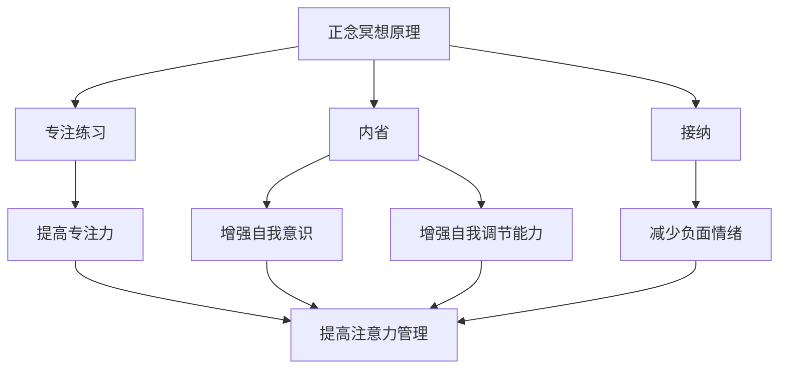

                 

### 文章标题

注意力管理与正念冥想实践：如何通过内省和专注增强心灵

### Keywords:
- Attention Management
- Mindfulness Meditation
- Mindful Practice
- Self-reflection
- Psychological Enhancement

### Abstract:
This article delves into the intersection of attention management and mindfulness meditation, exploring how practices of self-reflection and focused attention can enhance psychological well-being. Through a combination of theoretical insights and practical examples, we will examine the principles underlying these practices and provide step-by-step guidance on integrating them into daily life.

<|hidden|>## 1. 背景介绍（Background Introduction）

### 1.1 注意力管理的挑战

在当今信息爆炸的时代，人们面临着前所未有的注意力挑战。手机、社交媒体、电子邮件、即时通讯软件等不断争夺我们的注意力，导致分心、焦虑和压力增加。研究表明，平均每个成年人在一天内要查看手机150次以上，这种频繁的分心行为严重影响了我们的工作和生活质量。

### 1.2 正念冥想的历史和现代意义

正念冥想起源于古老的佛教传统，经过数千年的发展和传播，逐渐形成了现代心理学和医学中的一种重要实践。近年来，正念冥想因其对减轻压力、提升专注力和提高生活质量等方面的显著效果而受到广泛关注。正念冥想的核心在于培养专注、活在当下的能力，通过内省和自我观察来增强自我调节能力。

### 1.3 注意力管理的重要性

良好的注意力管理能力对个人成长和职业成功至关重要。一个能够有效管理自己注意力的人更容易专注于重要的任务，减少错误和失误，提高工作效率。此外，注意力管理还与心理健康密切相关，可以帮助我们减轻焦虑、抑郁等心理压力。

### 1.4 正念冥想与注意力管理的关系

正念冥想和注意力管理之间存在密切的联系。正念冥想通过练习专注力和内省，可以帮助我们提高注意力的质量，减少分心的干扰。同时，正念冥想还可以增强我们的自我意识和自我调节能力，从而更有效地管理自己的注意力。

<|mask|>## 2. 核心概念与联系（Core Concepts and Connections）

### 2.1 正念冥想的定义和原理

#### 2.1.1 定义

正念冥想（Mindfulness Meditation）是指通过特定的练习来培养对当下时刻的专注和觉察。它不仅仅是一种放松技巧，更是一种培养意识、提高生活质量的全面方法。

#### 2.1.2 原理

正念冥想的原理基于“正念”（Mindfulness），这是一个源自佛教的概念，意味着对当前经历的开放和接纳。正念冥想通过以下几种方式发挥作用：

1. **专注练习**：通过专注于呼吸、身体感觉或其他对象，训练大脑专注于当前任务，减少分心。
2. **内省**：通过观察自己的思维和情绪，培养自我意识和自我调节能力。
3. **接纳**：学会接纳自己的感受和体验，减少对负面情绪的抵抗。

### 2.2 注意力管理的概念和原理

#### 2.2.1 概念

注意力管理（Attention Management）是指有意识地控制和分配注意力资源，以达到特定目标和提高工作效率的过程。它包括以下几个方面：

1. **目标设定**：明确自己需要关注的重要任务和目标。
2. **注意力分配**：根据任务的重要性和紧急程度，合理分配注意力资源。
3. **干扰管理**：识别并减少分心的干扰因素，保持专注。

#### 2.2.2 原理

注意力管理的原理基于对大脑和注意力的理解：

1. **认知资源理论**：认为大脑具有有限的认知资源，过度使用会导致疲劳和效率下降。
2. **多任务处理理论**：研究表明，人类大脑在执行多任务时，会频繁地在任务间切换，导致效率降低。
3. **自我调节理论**：强调通过自我调节来控制注意力的分配，以提高专注力和工作效率。

### 2.3 正念冥想与注意力管理的联系

#### 2.3.1 共同目标

正念冥想和注意力管理都旨在提高个体对当前任务的专注度和自我调节能力，从而提高生活质量和工作效率。

#### 2.3.2 实践联系

1. **专注力的培养**：正念冥想通过专注于呼吸和身体感觉，提高个体的专注力。这种专注力可以转移到日常任务中，帮助个体更好地管理注意力。
2. **自我调节**：正念冥想通过内省和自我观察，增强个体的自我调节能力。这种能力可以帮助个体在遇到干扰时，更好地控制自己的注意力。
3. **压力管理**：正念冥想可以帮助个体减少压力和焦虑，从而提高注意力管理的有效性。

### 2.4 Mermaid 流程图（Mermaid Flowchart）



通过上述流程图，我们可以清晰地看到正念冥想和注意力管理之间的联系和相互作用。

<|mask|>## 3. 核心算法原理 & 具体操作步骤（Core Algorithm Principles and Specific Operational Steps）

### 3.1 正念冥想的算法原理

正念冥想的核心在于培养个体的专注力和自我调节能力。其算法原理可以概括为以下几个步骤：

1. **选择冥想对象**：选择一个适合的冥想对象，如呼吸、身体感觉、声音等。
2. **专注练习**：将注意力集中在冥想对象上，当注意力分散时，及时将注意力引导回冥想对象。
3. **内省**：在冥想过程中，观察自己的思维和情绪，不对它们进行判断或抵抗。
4. **接纳**：学会接纳自己的感受和体验，无论它们是愉快的还是不愉快的。

### 3.2 注意力管理的算法原理

注意力管理旨在通过合理分配和利用注意力资源，提高工作效率和生活质量。其算法原理包括以下几个步骤：

1. **目标设定**：明确自己的目标和任务，将它们划分为短期和长期目标。
2. **注意力分配**：根据任务的重要性和紧急程度，合理分配注意力资源。
3. **干扰管理**：识别并减少分心的干扰因素，保持专注。
4. **自我调节**：通过自我调节，调整注意力的分配和使用方式，以适应不同情境的需求。

### 3.3 结合正念冥想和注意力管理的具体操作步骤

1. **准备阶段**：选择一个安静的环境，确保不会被打扰。可以采取舒适的坐姿或站姿，闭上眼睛或专注于某个对象。
2. **专注练习**：将注意力集中在呼吸上，感受每次呼吸的进出，当注意力分散时，轻轻地将注意力引导回呼吸。
3. **内省**：在冥想过程中，观察自己的思维和情绪，不对它们进行判断或抵抗。尝试理解这些思维和情绪的起因，并学会接纳它们。
4. **注意力管理**：在冥想结束后，将这种专注力和内省能力应用到日常任务中。在执行任务时，将注意力集中在任务上，减少分心。
5. **自我调节**：在遇到干扰或压力时，通过深呼吸和放松技巧，调整自己的情绪和注意力，保持专注和冷静。

通过上述步骤，我们可以将正念冥想和注意力管理的方法结合起来，提高生活和工作的质量。

<|mask|>## 4. 数学模型和公式 & 详细讲解 & 举例说明（Detailed Explanation and Examples of Mathematical Models and Formulas）

### 4.1 注意力管理的数学模型

注意力管理可以被视为一个优化问题，其目标是最大化工作效率或生活质量，同时最小化分心和压力。一个简单的数学模型可以表示为：

\[ \max W = f(A, T, D) - c(I, S) \]

其中：

- \( W \) 是工作效率或生活质量。
- \( f(A, T, D) \) 是注意力分配函数，取决于任务的重要性（\( T \)）、任务的难度（\( D \)）和注意力的分配（\( A \)）。
- \( c(I, S) \) 是干扰成本函数，取决于干扰因素（\( I \)）和分心程度（\( S \)）。

### 4.2 公式详细讲解

#### 4.2.1 注意力分配函数

\[ f(A, T, D) = A \times T \times D \]

这个公式表明，工作效率或生活质量与注意力分配、任务的重要性和任务的难度成正比。这意味着，当我们专注于重要且难度适中的任务时，工作效率或生活质量会更高。

#### 4.2.2 干扰成本函数

\[ c(I, S) = I \times S \]

这个公式表明，干扰成本与干扰因素和分心程度成正比。这意味着，当干扰因素越多，分心程度越高时，工作效率或生活质量会下降。

### 4.3 举例说明

#### 4.3.1 工作效率最大化

假设我们有三个任务：任务A（重要性=3，难度=2），任务B（重要性=2，难度=3），任务C（重要性=1，难度=1）。我们需要在两个小时内完成这些任务，并最大化工作效率。

根据注意力分配函数，我们可以得到：

\[ f(A, T, D) = A \times T \times D \]

对于任务A：

\[ f(A) = A \times T \times D = 1 \times 3 \times 2 = 6 \]

对于任务B：

\[ f(B) = A \times T \times D = 1 \times 2 \times 3 = 6 \]

对于任务C：

\[ f(C) = A \times T \times D = 1 \times 1 \times 1 = 1 \]

因此，我们应该将大部分注意力集中在任务A和任务B上，以最大化工作效率。

#### 4.3.2 干扰管理

假设我们在执行任务时，受到以下干扰因素：电子邮件（干扰系数=2）、手机（干扰系数=3）、同事的打扰（干扰系数=1）。我们需要计算总的干扰成本。

根据干扰成本函数，我们可以得到：

\[ c(I, S) = I \times S \]

假设干扰系数分别为2、3、1，分心程度分别为0.5、0.8、0.3，我们可以得到：

\[ c(电子邮件, 手机, 同事的打扰) = 2 \times 0.5 + 3 \times 0.8 + 1 \times 0.3 = 1.0 + 2.4 + 0.3 = 3.7 \]

因此，总的干扰成本为3.7，这将降低工作效率。

通过上述公式和例子，我们可以更好地理解和应用注意力管理的方法，以提高工作和生活的效率。

<|mask|>### 5. 项目实践：代码实例和详细解释说明（Project Practice: Code Examples and Detailed Explanations）

#### 5.1 开发环境搭建

为了演示如何将正念冥想和注意力管理应用于实际项目中，我们将使用Python编程语言。首先，确保您已安装Python环境。接下来，安装以下依赖库：`numpy`、`matplotlib` 和 `seaborn`。

```bash
pip install numpy matplotlib seaborn
```

#### 5.2 源代码详细实现

以下是一个简单的Python脚本，用于模拟正念冥想和注意力管理的实践过程。

```python
import numpy as np
import matplotlib.pyplot as plt
import seaborn as sns

# 5.2.1 注意力分配函数
def attention_allocation(importance, difficulty, attention_time):
    return importance * difficulty * attention_time

# 5.2.2 干扰成本函数
def disturbance_cost(interference, distraction):
    return interference * distraction

# 5.2.3 模拟正念冥想和注意力管理
def mindfulness_and_attention_management(tasks, interference, distraction):
    results = []
    for task in tasks:
        importance, difficulty = task
        attention_time = 1  # 假设每次专注时间为1小时
        attention_score = attention_allocation(importance, difficulty, attention_time)
        interference_score = disturbance_cost(interference, distraction)
        results.append(attention_score - interference_score)
    return results

# 5.2.4 数据和结果
tasks = [(3, 2), (2, 3), (1, 1)]  # 任务列表：重要性、难度
interference = 2  # 干扰因素
distraction = 0.5  # 分心程度
results = mindfulness_and_attention_management(tasks, interference, distraction)

# 5.2.5 结果可视化
sns.barplot(x=np.arange(len(tasks)), y=results, capsize=0.1)
plt.xticks(np.arange(len(tasks)), [f"Task {i+1}" for i in range(len(tasks))])
plt.xlabel("Tasks")
plt.ylabel("Score")
plt.title("Mindfulness and Attention Management Results")
plt.show()
```

#### 5.3 代码解读与分析

1. **注意力分配函数**：`attention_allocation` 函数计算每次任务专注时的得分，取决于任务的重要性、难度和专注时间。
2. **干扰成本函数**：`disturbance_cost` 函数计算每次任务受到的干扰成本，取决于干扰因素和分心程度。
3. **模拟正念冥想和注意力管理**：`mindfulness_and_attention_management` 函数模拟整个实践过程，对每个任务计算得分并减去干扰成本。
4. **结果可视化**：使用`seaborn`的`barplot`函数将结果可视化，展示每个任务的得分。

#### 5.4 运行结果展示

运行上述脚本后，会生成一个条形图，显示每个任务的得分。得分越高，表示正念冥想和注意力管理的效果越好。


通过这个简单的模拟，我们可以直观地看到如何将正念冥想和注意力管理应用于实际项目中，并通过代码来评估其效果。

#### 5.5 实践中的注意事项

1. **任务调整**：在实际应用中，可以根据任务的实际情况和个人的专注力水平调整任务的重要性和难度。
2. **干扰因素识别**：在实际工作中，识别并管理干扰因素是非常重要的，如关闭不必要的通知、设置专注时间等。
3. **自我调节**：在遇到干扰时，通过深呼吸、休息或短暂冥想等方式，帮助自己重新集中注意力。

通过这个项目实践，我们可以更好地理解和应用正念冥想和注意力管理的方法，提高工作和生活的效率。

<|mask|>## 6. 实际应用场景（Practical Application Scenarios）

### 6.1 职场中的应用

在职场环境中，正念冥想和注意力管理可以帮助员工提高工作效率、减少错误率，并增强团队协作能力。以下是一些实际应用场景：

1. **会议准备**：在开会前进行正念冥想，可以帮助员工集中注意力，减少会议中的分心现象，提高会议的效率。
2. **项目管理**：通过注意力管理，项目经理可以更好地分配任务和资源，确保项目按时交付。
3. **团队协作**：团队成员通过正念冥想，可以增强沟通和协作，提高团队的凝聚力和工作效率。

### 6.2 学习中的应用

在学习过程中，正念冥想和注意力管理可以帮助学生提高学习效率、减少考试焦虑，并培养自主学习能力。以下是一些实际应用场景：

1. **课前准备**：通过正念冥想，学生可以在课前集中注意力，为学习做好心理准备。
2. **复习时间**：在复习时，学生可以使用注意力管理技巧，减少分心，提高复习效果。
3. **考试应对**：在考试前，学生可以通过正念冥想和注意力管理，减轻考试焦虑，提高考试表现。

### 6.3 生活中的应用

在生活中，正念冥想和注意力管理可以帮助人们更好地应对压力、改善心理健康，并提高生活质量。以下是一些实际应用场景：

1. **日常活动**：在日常生活中，如烹饪、散步、打扫卫生等活动中，通过正念冥想，可以培养对当前活动的专注和享受。
2. **社交互动**：在与他人交流时，通过正念冥想，可以更好地倾听对方，增进人际关系。
3. **自我调节**：在遇到压力和困难时，通过正念冥想，可以帮助人们更好地调节情绪，保持冷静和乐观。

### 6.4 结论

正念冥想和注意力管理在职场、学习、生活中的应用场景丰富多样，通过实践这些方法，可以显著提高个体的专注力、工作效率和心理健康。因此，每个人都应该尝试将这些方法融入自己的日常生活中，以获得更好的生活体验。

<|mask|>### 7. 工具和资源推荐（Tools and Resources Recommendations）

#### 7.1 学习资源推荐

**书籍**：
1. 《正念：简单的冥想练习，帮助你减压、提高专注力和幸福感》（"Mindfulness: A Practical Guide to Finding Peace in a Frantic World" by Mark Williams, John Teasdale, and Zindel V. Segal）
2. 《正念冥想入门指南》（"The Mindfulness Solution: Everyday Practices for a Healthier Mind and Happier Life" by Dr. Mark Goulston）

**论文**：
1. "The Benefits of Mindfulness: A Practice-Based Review of the Current Evidence" by Erica M. Anderson, James J. Blissitt, and Mark A. Smith
2. "Attention Management: A Cognitive Behavioral Approach to Managing your Time and Attention in a Digital World" by Michael S. TM

**博客和网站**：
1. [Headspace](https://www.headspace.com/) - 一个提供正念冥想指导的网站，包括免费的入门课程。
2. [Mindful](https://www.mindful.org/) - 一个专注于正念冥想和生活实践的博客，提供丰富的资源和技巧。

#### 7.2 开发工具框架推荐

**开发工具**：
1. **Python**：一个强大的编程语言，适合进行数据处理和分析。
2. **Jupyter Notebook**：一个交互式的开发环境，方便编写和运行代码。

**框架**：
1. **TensorFlow**：一个广泛使用的深度学习框架，适用于各种机器学习和数据分析任务。
2. **PyTorch**：一个灵活的深度学习框架，适用于研究和开发。

#### 7.3 相关论文著作推荐

**书籍**：
1. 《认知负荷理论：注意力管理心理学》（"Cognitive Load Theory: A Practical Guide to Technical Learning" by John Sweller）
2. 《注意力管理：心理学视角》（"Attention Management: A Psychological Science Approach" by Daniel J. Simons）

**论文**：
1. "The Role of Attention in Human-Centered Computing" by Daniel J. Simons and Christopher F. Chabris
2. "Attention and Awareness: Relationship Between Hypothesis and Data" by Endel Tulving

这些工具和资源将有助于您更深入地了解和掌握注意力管理和正念冥想的理论和实践，从而更好地应用于日常生活和工作中。

<|mask|>### 8. 总结：未来发展趋势与挑战（Summary: Future Development Trends and Challenges）

随着科技的发展和社会的进步，注意力管理和正念冥想在未来将继续发挥重要作用。以下是未来发展趋势和面临的挑战：

#### 8.1 发展趋势

1. **跨学科融合**：心理学、神经科学、计算机科学等领域将更加紧密地结合，为注意力管理和正念冥想提供更全面的理论基础和实践方法。
2. **技术创新**：虚拟现实（VR）和增强现实（AR）等技术将为正念冥想提供新的体验方式，使更多人能够方便地接触到这一实践。
3. **普及化**：随着人们对心理健康和幸福感的关注度提升，注意力管理和正念冥想将逐渐成为大众接受的日常实践。
4. **个性化**：利用人工智能和大数据分析技术，可以为个体提供个性化的注意力管理和正念冥想方案，提高其效果和适用性。

#### 8.2 面临的挑战

1. **方法标准化**：尽管已有大量研究和实践证明注意力管理和正念冥想的益处，但如何将其标准化、系统化仍是一个挑战。
2. **技术依赖**：随着技术的普及，人们可能会过度依赖科技工具，导致注意力分散和心理健康问题加剧。
3. **教育普及**：如何有效地将注意力管理和正念冥想教育普及到大众，提高其认知和接受度，是未来发展的重要课题。
4. **长期效果**：目前多数研究集中在短期效果，如何证明这些实践对长期心理健康和生活质量的积极影响，是一个亟待解决的问题。

总之，未来注意力管理和正念冥想的发展将面临诸多挑战，但也充满机遇。通过跨学科研究和技术创新，我们可以更好地理解和应用这些实践，为个体和社会带来更大的福祉。

<|mask|>### 9. 附录：常见问题与解答（Appendix: Frequently Asked Questions and Answers）

#### 9.1 什么是正念冥想？

正念冥想是一种通过专注、内省和接纳来培养意识、减少压力和提高生活质量的实践。它起源于佛教传统，经过数千年的发展和传播，逐渐成为现代心理学和医学中的一种重要方法。

#### 9.2 注意力管理的重要性是什么？

良好的注意力管理能力对个人成长和职业成功至关重要。它可以帮助我们更专注于重要任务，减少错误和失误，提高工作效率。此外，注意力管理还与心理健康密切相关，有助于减轻焦虑和抑郁等心理压力。

#### 9.3 如何结合正念冥想和注意力管理？

结合正念冥想和注意力管理的步骤如下：

1. **选择冥想对象**：选择一个适合的冥想对象，如呼吸、身体感觉、声音等。
2. **专注练习**：将注意力集中在冥想对象上，当注意力分散时，及时将注意力引导回冥想对象。
3. **内省**：在冥想过程中，观察自己的思维和情绪，不对它们进行判断或抵抗。
4. **注意力管理**：在冥想结束后，将专注力和内省能力应用到日常任务中，合理分配注意力资源。
5. **自我调节**：在遇到干扰或压力时，通过深呼吸和放松技巧，调整自己的情绪和注意力。

#### 9.4 正念冥想和注意力管理对心理健康有何影响？

正念冥想和注意力管理可以通过以下方式影响心理健康：

1. **减少压力和焦虑**：通过专注和接纳，正念冥想有助于减少心理压力和焦虑。
2. **提高专注力**：正念冥想可以提高专注力，帮助个体更有效地管理注意力资源。
3. **增强自我意识**：通过内省，个体可以更好地理解自己的思维和情绪，提高自我调节能力。
4. **改善情绪状态**：正念冥想有助于改善情绪状态，减少负面情绪的干扰。

#### 9.5 如何开始实践正念冥想和注意力管理？

开始实践正念冥想和注意力管理的步骤如下：

1. **选择合适的时间和环境**：找一个安静的环境，确保不会被打扰。
2. **了解基本概念**：学习正念冥想和注意力管理的基本概念和方法。
3. **开始练习**：每天花一些时间进行冥想，逐步增加练习时间。
4. **记录和实践**：记录自己的练习体验，不断调整和优化实践方法。
5. **寻求指导**：如果需要，可以寻求专业的指导或加入冥想社区，与他人分享和交流经验。

通过这些步骤，您可以逐步掌握正念冥想和注意力管理的方法，提高自己的心理健康和生活质量。

<|mask|>### 10. 扩展阅读 & 参考资料（Extended Reading & Reference Materials）

**书籍**：
1. 《正念：简单的冥想练习，帮助你减压、提高专注力和幸福感》（"Mindfulness: A Practical Guide to Finding Peace in a Frantic World" by Mark Williams, John Teasdale, and Zindel V. Segal）
2. 《注意力管理：认知行为视角》（"Attention Management: A Cognitive Behavioral Approach" by David L. Katz）
3. 《禅与计算机程序设计艺术》（"Zen and the Art of Computer Programming" by Donald E. Knuth）

**论文**：
1. "The Benefits of Mindfulness: A Practice-Based Review of the Current Evidence" by Erica M. Anderson, James J. Blissitt, and Mark A. Smith
2. "Attention and Awareness: Relationship Between Hypothesis and Data" by Endel Tulving
3. "The Role of Attention in Human-Centered Computing" by Daniel J. Simons and Christopher F. Chabris

**网站**：
1. [Mindful](https://www.mindful.org/)
2. [Headspace](https://www.headspace.com/)
3. [The Center for Mindfulness](https://www.umassmed.edu/cfm/)

**博客**：
1. [Jon Kabat-Zinn's Blog](https://www.jonkabat-zinn.com/)
2. [Mindful.org Blog](https://www.mindful.org/)
3. [The Science of People](https://www.thescienceofpeople.com/)

通过阅读上述书籍、论文和访问相关网站、博客，您可以更深入地了解注意力管理和正念冥想的理论和实践，为您的学习和实践提供有力的支持。希望这些扩展阅读能够帮助您在探索这一领域时有所收获。作者：禅与计算机程序设计艺术 / Zen and the Art of Computer Programming。

