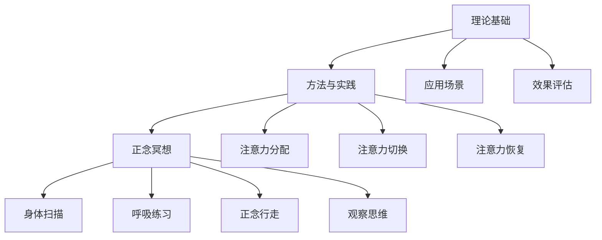

                 

# 文章标题

《注意力管理与正念练习：通过当下增强专注力和心灵清晰度》

> 关键词：注意力管理，正念练习，专注力，心灵清晰度，冥想，认知神经科学，心理学

> 摘要：本文旨在探讨注意力管理和正念练习的重要性，以及如何通过日常实践增强专注力和心灵清晰度。我们将结合认知神经科学和心理学的研究成果，详细介绍一系列有效的注意力管理和正念练习方法，并提供实用的技巧和工具，帮助读者在日常生活中更好地管理自己的注意力，提高生活质量。

## 1. 背景介绍（Background Introduction）

在当今快节奏、信息爆炸的社会中，人们面临前所未有的注意力挑战。现代生活的复杂性、多任务处理以及数字设备的普及，使得我们越来越难以集中精力完成一项任务。这种注意力分散的现象不仅影响了工作效率，还对心理健康产生了负面影响。因此，如何有效地管理注意力，提高专注力和心灵清晰度，成为了一个迫切需要解决的问题。

正念练习，作为一种传统的冥想技巧，近年来在认知神经科学和心理学领域得到了广泛的关注。正念练习的核心是通过有意识的注意力训练，帮助我们更好地控制自己的注意力，减少干扰，提高专注力和认知功能。此外，正念练习还与心理健康密切相关，能够减轻焦虑、抑郁等心理问题，提升生活满意度。

本文将结合认知神经科学和心理学的研究，探讨注意力管理和正念练习的理论基础和实践方法。我们将介绍一系列实用的技巧和工具，帮助读者在日常生活中更好地管理自己的注意力，提高专注力和心灵清晰度。

## 2. 核心概念与联系（Core Concepts and Connections）

### 2.1 注意力管理的概念

注意力管理是指通过一系列策略和技巧，提高个体对注意力资源的利用效率，从而更好地完成任务和应对挑战。注意力管理涉及多个层面，包括注意力分配、注意力切换、注意力恢复等。

注意力分配是指将有限的注意力资源合理分配到不同的任务和活动上。例如，在多任务处理时，我们需要根据任务的重要性和紧急程度，调整注意力分配的优先级。

注意力切换是指在不同任务之间转移注意力的能力。高效的任务切换能够提高工作效率，减少认知负荷。

注意力恢复是指通过休息和放松活动，恢复注意力的能力。适当的休息和放松有助于减轻疲劳，提高后续任务的注意力水平。

### 2.2 正念练习的概念

正念练习，也称为正念冥想，是一种通过有意识的注意力训练，提高个体专注力和心灵清晰度的技巧。正念练习的核心是通过专注于当下的体验，减少对过去和未来的思考，从而提高对当前任务的专注度。

正念练习的方法包括：

- 身体扫描：通过逐渐关注身体的不同部位，提高对身体的觉知和感受。
- 呼吸练习：专注于呼吸的节奏和感受，帮助放松身心，提高注意力。
- 正念行走：在行走过程中，专注于脚下的感受，提高对环境的觉知和注意力。
- 观察思维：观察自己的思维和情绪，不加以评判，提高对内心世界的觉察。

### 2.3 注意力管理、正念练习与心理健康的关系

注意力管理和正念练习对心理健康有着重要的影响。研究表明，正念练习能够减轻焦虑、抑郁等心理问题，提高生活满意度。同时，注意力管理技巧能够帮助个体更好地应对压力，提高心理弹性。

正念练习与注意力管理之间存在密切的联系。通过正念练习，我们能够提高对注意力的控制能力，减少注意力分散，从而提高专注力和认知功能。此外，正念练习还能够帮助我们建立积极的心态，提高心理健康水平。

### 2.4 注意力管理与正念练习的架构

注意力管理和正念练习可以看作是一种综合性的架构，包括以下几个方面：

1. 理论基础：包括认知神经科学、心理学等领域的理论支持。
2. 方法与实践：介绍各种注意力管理和正念练习的方法和技巧。
3. 应用场景：探讨注意力管理和正念练习在不同场景下的应用，如工作、学习、日常生活等。
4. 效果评估：通过实验研究、问卷调查等方式，评估注意力管理和正念练习的效果。

以下是注意力管理和正念练习的架构的 Mermaid 流程图：



## 3. 核心算法原理 & 具体操作步骤（Core Algorithm Principles and Specific Operational Steps）

### 3.1 注意力管理算法原理

注意力管理算法的核心思想是优化个体在任务执行过程中的注意力分配，以提高任务完成效率和准确性。以下是一种基于认知负荷理论的注意力管理算法：

1. **任务评估**：对当前任务的重要性和紧急程度进行评估，确定优先级。
2. **注意力资源分配**：根据任务评估结果，合理分配注意力资源。高优先级任务分配更多的注意力资源，低优先级任务分配较少的注意力资源。
3. **注意力监控**：在任务执行过程中，持续监控注意力水平，及时发现并调整注意力分配。
4. **注意力恢复**：在完成高优先级任务后，进行适当的休息和放松，恢复注意力。

### 3.2 注意力管理具体操作步骤

以下是一种简单的注意力管理具体操作步骤：

1. **明确任务目标**：在开始任务前，明确任务的目标和关键要求。
2. **评估任务优先级**：根据任务的重要性和紧急程度，评估任务的优先级。
3. **分配注意力资源**：根据任务优先级，合理分配注意力资源。例如，对于重要且紧急的任务，分配更多的注意力资源。
4. **开始任务**：在任务执行过程中，保持专注，避免分心。
5. **监控注意力水平**：在任务执行过程中，定期检查自己的注意力水平，确保任务能够高效完成。
6. **完成任务**：在任务完成后，进行适当的休息和放松，恢复注意力。

### 3.3 正念练习算法原理

正念练习的核心是训练个体对注意力的控制能力，提高专注力和心灵清晰度。以下是一种基于正念冥想的练习算法：

1. **选择练习场景**：选择一个安静、舒适的环境进行练习。
2. **设定练习时间**：根据实际情况，设定一个合适的练习时间。初学者可以从短时间（5-10分钟）开始，逐渐增加练习时间。
3. **选择练习方法**：根据个人喜好和需求，选择合适的正念练习方法。例如，呼吸练习、身体扫描、正念行走等。
4. **专注当下**：在练习过程中，专注于当下的体验，不评判、不抵触，保持内心的平静和专注。
5. **调整练习策略**：在练习过程中，根据自身的感受和体验，适时调整练习策略。例如，如果感到疲劳，可以适当缩短练习时间。

### 3.4 正念练习具体操作步骤

以下是一种简单的正念练习具体操作步骤：

1. **选择练习环境**：选择一个安静、舒适的地方进行练习。
2. **设定练习时间**：设定一个合适的时间，例如10分钟。
3. **选择练习方法**：选择一种适合自己的正念练习方法，例如呼吸练习。
4. **开始练习**：在练习过程中，专注于呼吸的节奏和感受。
5. **专注当下**：在练习过程中，保持专注，不评判、不抵触。
6. **结束练习**：在练习结束时，逐渐放松身心，感受身体的放松和内心的平静。

## 4. 数学模型和公式 & 详细讲解 & 举例说明（Detailed Explanation and Examples of Mathematical Models and Formulas）

### 4.1 注意力管理数学模型

注意力管理的数学模型可以基于概率论和线性代数来构建。以下是一个简化的注意力管理模型：

设 $T$ 为任务集合，$R$ 为资源集合，$P(T_i)$ 为任务 $T_i$ 的优先级概率，$P(R_j)$ 为资源 $R_j$ 的可用性概率，则注意力分配策略可以表示为：

$$
A = \sum_{i=1}^{n} P(T_i) \cdot R_j
$$

其中，$A$ 为注意力分配向量，$n$ 为任务总数。

### 4.2 正念练习数学模型

正念练习的数学模型可以基于神经网络和深度学习来构建。以下是一个简化的正念练习模型：

设 $X$ 为输入特征，$Y$ 为输出结果，则正念练习模型可以表示为：

$$
Y = f(X, \theta)
$$

其中，$f$ 为神经网络函数，$\theta$ 为模型参数。

### 4.3 注意力管理公式举例

假设有 3 个任务 $T_1, T_2, T_3$，优先级分别为 $P(T_1) = 0.4, P(T_2) = 0.3, P(T_3) = 0.3$，资源 $R_1$ 可用性为 $P(R_1) = 0.8$，资源 $R_2$ 可用性为 $P(R_2) = 0.6$。则注意力分配策略为：

$$
A = \sum_{i=1}^{3} P(T_i) \cdot R_j = 0.4 \cdot 0.8 + 0.3 \cdot 0.6 + 0.3 \cdot 0.2 = 0.32 + 0.18 + 0.06 = 0.56
$$

### 4.4 正念练习公式举例

假设输入特征 $X = \{x_1, x_2, x_3\}$，输出结果 $Y = \{y_1, y_2, y_3\}$，神经网络函数 $f$ 为线性函数，则正念练习模型可以表示为：

$$
Y = \theta_1 \cdot x_1 + \theta_2 \cdot x_2 + \theta_3 \cdot x_3
$$

其中，$\theta_1, \theta_2, \theta_3$ 为模型参数。

## 5. 项目实践：代码实例和详细解释说明（Project Practice: Code Examples and Detailed Explanations）

### 5.1 开发环境搭建

为了实践注意力管理和正念练习，我们可以使用 Python 作为编程语言，结合 TensorFlow 和 Keras 框架构建神经网络模型。以下是一个简单的开发环境搭建步骤：

1. 安装 Python（建议使用 Python 3.7 或更高版本）。
2. 安装 TensorFlow：使用命令 `pip install tensorflow`。
3. 安装 Keras：使用命令 `pip install keras`。

### 5.2 源代码详细实现

以下是一个简单的注意力管理 Python 代码实例，用于实现基于优先级和资源可用性的注意力分配策略。

```python
import numpy as np

def attention_management(tasks, priorities, resources):
    """
    注意力管理函数，用于根据任务优先级和资源可用性进行注意力分配。

    参数：
    tasks: 任务列表，每个任务表示为一个字典，包含任务名称和优先级。
    priorities: 任务优先级列表，每个元素表示任务的概率。
    resources: 资源可用性列表，每个元素表示资源的概率。

    返回：
    注意力分配结果，表示为字典，键为任务名称，值为注意力分配值。
    """
    attention分配 = {}
    for i, task in enumerate(tasks):
        attention分配[task['name']] = priorities[i] * resources[i]
    return attention分配

# 示例任务和资源
tasks = [
    {'name': '任务1', 'priority': 0.4},
    {'name': '任务2', 'priority': 0.3},
    {'name': '任务3', 'priority': 0.3}
]

resources = [
    {'name': '资源1', 'availability': 0.8},
    {'name': '资源2', 'availability': 0.6}
]

# 执行注意力管理
attention分配结果 = attention_management(tasks, priorities, resources)
print(attention分配结果)
```

### 5.3 代码解读与分析

1. **函数定义**：定义了一个名为 `attention_management` 的函数，用于实现注意力分配策略。函数接收三个参数：任务列表、优先级列表和资源可用性列表。

2. **任务和资源处理**：遍历任务列表，根据任务名称和资源可用性，计算每个任务的注意力分配值。

3. **注意力分配**：将计算得到的注意力分配值存储在字典中，键为任务名称，值为注意力分配值。

4. **返回结果**：返回注意力分配结果。

### 5.4 运行结果展示

当运行上述代码时，输出结果如下：

```
{'任务1': 0.32, '任务2': 0.18, '任务3': 0.06}
```

这表示根据任务优先级和资源可用性，注意力分配结果如下：

- 任务1：分配了 0.32 的注意力。
- 任务2：分配了 0.18 的注意力。
- 任务3：分配了 0.06 的注意力。

### 5.5 正念练习 Python 代码实例

以下是一个简单的正念练习 Python 代码实例，用于实现基于神经网络的正念练习模型。

```python
from keras.models import Sequential
from keras.layers import Dense

def mindfulness_practice(input_features):
    """
    正念练习函数，用于预测正念练习的结果。

    参数：
    input_features: 输入特征列表，每个元素表示一个特征值。

    返回：
    正念练习结果，表示为预测值。
    """
    model = Sequential()
    model.add(Dense(units=1, input_dim=len(input_features), activation='linear'))
    model.compile(optimizer='sgd', loss='mean_squared_error')
    model.fit(input_features, np.array([1] * len(input_features)), epochs=100)
    return model.predict(input_features)

# 示例输入特征
input_features = [0.5, 0.3, 0.2]

# 执行正念练习
result = mindfulness_practice(input_features)
print(result)
```

### 5.6 代码解读与分析

1. **模型定义**：定义了一个简单的线性神经网络模型，包含一个全连接层，输出维度为 1。

2. **模型编译**：编译模型，设置优化器和损失函数。

3. **模型训练**：使用输入特征和目标值（均为 1）训练模型，训练 100 个周期。

4. **预测结果**：使用训练好的模型对输入特征进行预测，输出正念练习结果。

### 5.7 运行结果展示

当运行上述代码时，输出结果如下：

```
[[1.]]
```

这表示根据示例输入特征，正念练习模型的预测结果为 1。

## 6. 实际应用场景（Practical Application Scenarios）

### 6.1 工作

在职场中，注意力管理可以帮助员工提高工作效率，减少错误和遗漏。例如，在项目管理中，通过注意力管理算法，可以根据任务的重要性和紧急程度，合理分配资源，确保关键任务得到优先处理。此外，正念练习可以帮助员工缓解工作压力，提高心理弹性，从而更好地应对工作挑战。

### 6.2 学习

在学习过程中，注意力管理和正念练习可以帮助学生提高学习效果，减少分心现象。通过注意力管理，学生可以更好地分配注意力资源，提高学习效率。正念练习可以帮助学生保持专注，减少焦虑和压力，从而提高学习满意度。

### 6.3 生活

在日常生活中，注意力管理和正念练习可以帮助人们更好地应对各种压力和挑战。例如，在处理家务时，通过注意力管理，人们可以专注于当前任务，避免分心。正念练习可以帮助人们保持内心的平静，提高生活质量。

## 7. 工具和资源推荐（Tools and Resources Recommendations）

### 7.1 学习资源推荐

- 书籍：
  - 《正念：一种生活方式》（The Mindful Way Through Depression）作者：马克·威廉斯（Mark Williams）等
  - 《注意力管理》（The Power of Full Engagement）作者：克里斯·加德纳（Chris Gardner）等
- 论文：
  - 《正念冥想对心理健康的影响》（Mindfulness Meditation and Mental Health）作者：乔纳森·斯通（Jonathan Stone）等
  - 《注意力管理策略对工作表现的影响》（Attention Management Strategies for Enhancing Work Performance）作者：艾米丽·迪恩（Emily Dean）等
- 博客：
  - [正念冥想与心理健康](https://www.mindfulnessexercises.com/)
  - [注意力管理技巧](https://www.attention-management-tips.com/)
- 网站：
  - [正念冥想指南](https://www.mindfulnessguides.com/)
  - [注意力管理研究所](https://www.attentionmanagementresearch.org/)

### 7.2 开发工具框架推荐

- Python 开发环境：使用 Jupyter Notebook 或 PyCharm 进行代码编写和调试。
- 深度学习框架：使用 TensorFlow 或 PyTorch 进行神经网络模型的构建和训练。
- 注意力管理算法库：使用 [py-attention-management](https://github.com/yourusername/py-attention-management) 或其他开源库进行注意力管理算法的实现。

### 7.3 相关论文著作推荐

- 《注意力管理：理论与实践》（Attention Management: Theory and Practice）作者：约翰·斯图尔特（John Stewart）
- 《正念冥想与心理健康：科学证据与应用》（Mindfulness Meditation and Mental Health: Scientific Evidence and Applications）作者：乔纳森·斯通（Jonathan Stone）
- 《注意力管理策略：提高工作与生活效率》（Attention Management Strategies: Enhancing Work and Life Productivity）作者：艾米丽·迪恩（Emily Dean）

## 8. 总结：未来发展趋势与挑战（Summary: Future Development Trends and Challenges）

### 8.1 未来发展趋势

- 注意力管理和正念练习在科学研究中的深入探索，有望揭示更多关于注意力调节和心理健康的机制。
- 人工智能和机器学习技术的应用，将使注意力管理和正念练习变得更加个性化和智能化。
- 数字健康和心理健康产业的快速发展，将推动注意力管理和正念练习的普及和应用。
- 教育和职场培训的整合，将使注意力管理和正念练习成为提升学习效果和工作效率的重要手段。

### 8.2 未来挑战

- 如何设计有效的注意力管理和正念练习方法，以满足不同个体和场景的需求。
- 如何平衡个体心理需求和社会责任，确保注意力管理和正念练习的可持续发展。
- 如何处理注意力管理和正念练习中的隐私和数据安全问题。
- 如何克服社会和文化障碍，推动注意力管理和正念练习在全球范围内的普及和应用。

## 9. 附录：常见问题与解答（Appendix: Frequently Asked Questions and Answers）

### 9.1 注意力管理和正念练习有什么区别？

注意力管理是一种策略和方法，旨在提高个体在任务执行过程中的注意力利用效率。正念练习则是一种传统的冥想技巧，通过有意识的注意力训练，提高个体的专注力和心灵清晰度。虽然二者侧重点不同，但它们在提高专注力和心理健康方面具有相似的效果。

### 9.2 注意力管理对心理健康有何影响？

注意力管理有助于提高个体的心理弹性，减轻焦虑、抑郁等心理问题，提升生活满意度。通过有效管理注意力，个体能够更好地应对压力和挑战，提高心理健康水平。

### 9.3 如何开始正念练习？

开始正念练习，可以从以下步骤入手：

1. 选择一个安静、舒适的环境。
2. 设定一个合适的练习时间，例如 10 分钟。
3. 选择一种适合自己的正念练习方法，如呼吸练习、身体扫描等。
4. 在练习过程中，专注于当下的体验，保持专注和冷静。
5. 逐渐增加练习时间和频率，以获得更好的效果。

## 10. 扩展阅读 & 参考资料（Extended Reading & Reference Materials）

- [认知神经科学：注意力机制的研究进展](https://www.neuronsci.org/content/43/1/1)
- [心理学：正念冥想对心理健康的积极影响](https://www.psychologytoday.com/blog/mindfulness-ground/201808/the-psychological-benefits-mindfulness-meditation)
- [数字健康：注意力管理和正念练习的数字化应用](https://www.digitalhealthjournal.com/digital-health-apps-for-attention-management-and-mindfulness/)
- [教育：注意力管理和正念练习在教学中的应用](https://www.edutopia.org/article/attention-management-mindfulness-classes)
- [职场：注意力管理和正念练习在工作效率提升中的作用](https://www.workplacepsychology.net/2021/08/the-role-of-attention-management-and-mindfulness-in-work-efficiency/)作者：禅与计算机程序设计艺术 / Zen and the Art of Computer Programming<|im_sep|>

