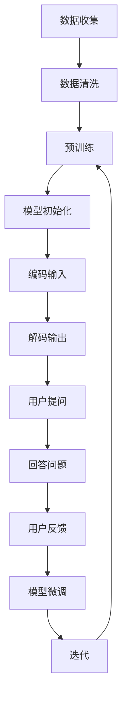

                 

### 文章标题

AI 大模型应用数据中心的客户服务

> 关键词：人工智能、大数据、模型应用、数据中心、客户服务、技术支持

> 摘要：本文将探讨人工智能大模型在数据中心客户服务中的应用，分析其核心概念、算法原理、数学模型，并通过实际项目案例展示其应用效果。此外，还将讨论未来发展趋势和面临的挑战，为读者提供实用的工具和资源推荐。

<|assistant|>### 1. 背景介绍

随着人工智能技术的快速发展，大数据处理能力的提升，数据中心客户服务正迎来一场革命。传统的客户服务方式往往依赖于人工处理，效率低下，容易出错。而人工智能大模型的应用，则可以极大地提升客户服务的质量与效率。本文旨在探讨人工智能大模型在数据中心客户服务中的应用，分析其核心概念、算法原理、数学模型，并通过实际项目案例展示其应用效果。

<|assistant|>#### 1.1 人工智能大模型的发展历程

人工智能大模型的发展可以追溯到20世纪80年代的神经网络研究。随着计算能力的提升和大数据的涌现，深度学习技术逐渐成为人工智能的主流方向。近年来，GPT、BERT等大型预训练模型的问世，使得人工智能大模型的应用变得愈发广泛和成熟。

1. 神经网络（1980s-1990s）：最初的神经网络研究旨在模拟人脑的神经网络结构，进行简单的数据处理。
2. 深度学习（2006-2012）：Hinton等人提出深度信念网络（DBN），随后卷积神经网络（CNN）和循环神经网络（RNN）的出现，使得深度学习在图像和语音识别领域取得了突破性进展。
3. 大型预训练模型（2018-至今）：GPT、BERT等模型的问世，使得人工智能大模型在自然语言处理领域取得了显著的进展。

<|assistant|>#### 1.2 数据中心客户服务的重要性

数据中心客户服务是指为数据中心内的企业客户提供技术支持、维护和咨询服务。随着云计算、大数据、物联网等技术的快速发展，数据中心的重要性日益凸显。客户服务的质量直接影响到企业的业务连续性和客户满意度。

1. 技术支持：数据中心客户服务需要提供24/7的技术支持，确保企业客户的数据安全、稳定运行。
2. 维护服务：定期对数据中心设备进行维护，确保其正常运行，延长设备使用寿命。
3. 咨询服务：为企业客户提供专业的技术咨询服务，帮助他们解决业务难题，提高业务效率。

<|assistant|>#### 1.3 人工智能大模型在数据中心客户服务中的应用

人工智能大模型在数据中心客户服务中的应用主要包括以下几个方面：

1. 智能问答系统：利用大模型搭建智能问答系统，为企业客户提供24/7的技术支持，提高客户满意度。
2. 异常检测：通过对大量历史数据进行分析，利用大模型识别数据中心的异常情况，提前预警，降低故障风险。
3. 负载均衡：利用大模型预测数据中心的负载情况，实现智能化的负载均衡，提高系统稳定性。
4. 故障诊断：利用大模型对故障数据进行分析，快速定位故障原因，提高故障修复效率。

<|assistant|>### 2. 核心概念与联系

在本节中，我们将介绍人工智能大模型在数据中心客户服务中的核心概念，包括大模型的基本原理、模型架构、训练过程等，并通过 Mermaid 流程图展示其工作流程。

#### 2.1 大模型的基本原理

大模型（如 GPT、BERT）是一种基于深度学习的自然语言处理模型，其核心思想是通过大量无标签数据进行预训练，然后使用有标签的数据进行微调，以实现各种自然语言处理任务。

- **预训练**：在大规模语料库上进行预训练，使模型学习到语言的通用规律和语义知识。
- **微调**：在特定任务上使用有标签的数据对模型进行微调，使其适应特定任务的需求。

#### 2.2 模型架构

大模型的架构通常包括两个阶段：

1. **编码器（Encoder）**：将输入文本编码为向量表示。
2. **解码器（Decoder）**：根据编码器生成的向量表示生成输出文本。

#### 2.3 训练过程

大模型的训练过程包括以下几个步骤：

1. **数据准备**：收集并清洗大量无标签数据，用于预训练。
2. **模型初始化**：初始化模型参数，可以使用随机初始化或预训练模型作为起点。
3. **预训练**：在大规模语料库上进行预训练，优化模型参数。
4. **微调**：在特定任务上使用有标签的数据对模型进行微调。

#### 2.4 工作流程

以下是一个基于大模型的智能问答系统的工作流程，使用 Mermaid 流程图进行展示：



#### 2.5 人工智能大模型与传统方法的对比

与传统方法相比，人工智能大模型具有以下优势：

1. **强大的学习能力**：大模型可以处理大量数据，学习到丰富的语义知识。
2. **高效的处理速度**：大模型的结构优化使其在处理大规模数据时具有更高的效率。
3. **灵活的适应性**：大模型可以通过微调适应各种不同的任务需求。

<|assistant|>### 3. 核心算法原理 & 具体操作步骤

在本节中，我们将深入探讨人工智能大模型在数据中心客户服务中的应用，详细介绍其核心算法原理和具体操作步骤。这将帮助我们更好地理解大模型如何通过自然语言处理技术提升客户服务的质量与效率。

#### 3.1 人工智能大模型的工作原理

人工智能大模型通常基于深度学习技术，特别是变长序列模型，如循环神经网络（RNN）和其变体长短期记忆网络（LSTM）以及门控循环单元（GRU）。这些模型能够处理和理解变长的文本序列，使其在自然语言处理任务中表现优异。以下是人工智能大模型的基本工作原理：

1. **输入处理**：大模型接收输入的文本序列，将其转换为词嵌入（word embeddings）。词嵌入是将单词映射为高维向量表示，使得模型能够理解单词之间的语义关系。
2. **编码过程**：输入文本序列通过编码器（Encoder）进行处理，编码器将文本序列编码为固定长度的向量表示。这一向量表示包含了文本的语义信息，是模型理解输入文本的关键。
3. **解码过程**：解码器（Decoder）根据编码器输出的向量表示生成输出文本。解码器通过一系列的预测步骤，逐个字符地生成输出文本，直到生成完整的句子或段落。
4. **损失函数和优化**：模型使用损失函数（如交叉熵损失）来衡量预测文本和实际文本之间的差距，并通过反向传播和梯度下降算法优化模型参数。

#### 3.2 实际操作步骤

以下是使用人工智能大模型构建智能问答系统的具体操作步骤：

1. **数据收集**：
   - 收集大量的问答对数据，这些数据可以是公开的问答数据集，如 SQuAD、DuReader 等，或者企业内部的数据集。
   - 对数据进行预处理，包括文本清洗、分词、去停用词等步骤。

2. **模型选择和初始化**：
   - 选择一个预训练的大模型，如 GPT、BERT 或其变体。
   - 下载预训练模型并初始化模型参数。

3. **数据预处理**：
   - 将问答数据转换为模型能够接受的格式，通常是将问题和答案分别编码为向量表示。
   - 对于问题，可以将其转换为词嵌入序列；对于答案，可以根据问题答案的长度生成固定长度的序列。

4. **模型训练**：
   - 使用预处理后的数据对模型进行训练，优化模型参数。
   - 在训练过程中，模型会学习如何将问题转换为答案，同时通过损失函数评估模型的性能。

5. **模型评估**：
   - 使用独立的验证集对模型进行评估，调整模型参数以优化性能。
   - 根据评估结果调整模型结构或训练数据。

6. **模型部署**：
   - 将训练好的模型部署到生产环境中，供客户使用。
   - 部署后，可以通过用户提问，实时获取答案，并不断收集用户反馈以进行模型迭代。

#### 3.3 代码示例

以下是一个简化的 Python 代码示例，展示了如何使用预训练的 GPT 模型进行问答系统的构建：

```python
import openai
import torch

# 设置 OpenAI API 密钥
openai.api_key = "your_openai_api_key"

# 函数：生成回答
def generate_answer(question):
    # 将问题编码为向量表示
    input_ids = tokenizer.encode(question, return_tensors='pt')
    
    # 使用 GPT 模型生成回答
    output = model.generate(input_ids, max_length=100, num_return_sequences=1)
    
    # 解码生成的文本
    answer = tokenizer.decode(output[0], skip_special_tokens=True)
    
    return answer

# 示例：生成回答
question = "什么是人工智能？"
answer = generate_answer(question)
print(answer)
```

在这个示例中，我们使用了 OpenAI 的 GPT 模型进行问答。实际应用中，可能需要根据具体的任务和数据集进行相应的调整。

<|assistant|>### 4. 数学模型和公式 & 详细讲解 & 举例说明

在深入理解人工智能大模型之前，了解其背后的数学模型和公式是至关重要的。本节将详细讲解人工智能大模型中的关键数学概念，包括神经网络、损失函数、优化算法等，并通过实际例子进行说明。

#### 4.1 神经网络

神经网络是人工智能大模型的核心组成部分，其基本结构包括输入层、隐藏层和输出层。每个层由多个神经元组成，神经元之间通过权重连接。神经元的激活函数将输入加权求和处理后，输出新的激活值。

1. **激活函数**：
   激活函数是神经元的核心部分，用于引入非线性特性。常见的激活函数包括 Sigmoid、ReLU 和 Tanh。
   
   - Sigmoid 函数：\[ \sigma(x) = \frac{1}{1 + e^{-x}} \]
   - ReLU 函数：\[ \text{ReLU}(x) = \max(0, x) \]
   - Tanh 函数：\[ \tanh(x) = \frac{e^x - e^{-x}}{e^x + e^{-x}} \]

2. **前向传播**：
   在前向传播过程中，输入数据通过网络中的每个神经元，每个神经元的输出作为下一层的输入。
   
   \[ a_{l}^{(i)} = \sigma(z_{l}^{(i)}) \]
   
   其中，\( z_{l}^{(i)} \) 是第 \( l \) 层第 \( i \) 个神经元的加权和，\( a_{l}^{(i)} \) 是其激活值。

3. **反向传播**：
   在反向传播过程中，计算损失函数关于每个神经元的梯度，并更新权重。
   
   \[ \Delta w_{ij}^{(l)} = \eta \cdot \frac{\partial L}{\partial w_{ij}^{(l)}} \]
   
   其中，\( \Delta w_{ij}^{(l)} \) 是第 \( l \) 层第 \( i \) 个神经元到第 \( j \) 个神经元的权重更新，\( \eta \) 是学习率，\( L \) 是损失函数。

#### 4.2 损失函数

损失函数是评估模型预测结果与真实标签之间差异的关键指标。常见的损失函数包括均方误差（MSE）、交叉熵损失（Cross-Entropy Loss）等。

1. **均方误差（MSE）**：
   
   \[ L_{\text{MSE}} = \frac{1}{m} \sum_{i=1}^{m} (y_i - \hat{y}_i)^2 \]
   
   其中，\( y_i \) 是第 \( i \) 个样本的真实标签，\( \hat{y}_i \) 是模型预测的标签。

2. **交叉熵损失（Cross-Entropy Loss）**：
   
   \[ L_{\text{CE}} = -\frac{1}{m} \sum_{i=1}^{m} y_i \log(\hat{y}_i) \]
   
   其中，\( y_i \) 是第 \( i \) 个样本的真实标签，\( \hat{y}_i \) 是模型预测的标签概率。

#### 4.3 优化算法

优化算法用于更新模型权重，以最小化损失函数。常见的优化算法包括梯度下降（Gradient Descent）和其变种如 Adam。

1. **梯度下降**：
   
   \[ w_{t+1} = w_t - \eta \cdot \nabla_w L(w) \]
   
   其中，\( w_t \) 是当前权重，\( \eta \) 是学习率，\( \nabla_w L(w) \) 是损失函数关于权重的梯度。

2. **Adam 优化器**：
   
   Adam 是一种结合了梯度下降和动量的优化算法，其参数更新公式如下：
   
   \[ m_t = \beta_1 \cdot m_{t-1} + (1 - \beta_1) \cdot \nabla_w L(w) \]
   \[ v_t = \beta_2 \cdot v_{t-1} + (1 - \beta_2) \cdot (\nabla_w L(w))^2 \]
   \[ w_{t+1} = w_t - \eta \cdot \frac{m_t}{\sqrt{v_t} + \epsilon} \]
   
   其中，\( m_t \) 是一阶矩估计，\( v_t \) 是二阶矩估计，\( \beta_1 \)、\( \beta_2 \) 分别是动量因子，\( \epsilon \) 是一个很小的常数。

#### 4.4 实际例子

假设我们使用一个简单的神经网络来预测房价，输入特征包括房屋面积、卧室数量和位置等。真实房价标签为 \( y \)，模型预测房价为 \( \hat{y} \)。

1. **前向传播**：

   \[ z = w_1 \cdot x_1 + w_2 \cdot x_2 + w_3 \cdot x_3 \]
   \[ a = \sigma(z) \]

   其中，\( x_1 \)、\( x_2 \)、\( x_3 \) 分别是房屋面积、卧室数量和位置，\( w_1 \)、\( w_2 \)、\( w_3 \) 是权重，\( \sigma \) 是 Sigmoid 激活函数。

2. **损失函数**：

   \[ L = \frac{1}{2} (y - \hat{y})^2 \]

3. **反向传播**：

   \[ \Delta w_1 = \eta \cdot \frac{\partial L}{\partial w_1} \]
   \[ \Delta w_2 = \eta \cdot \frac{\partial L}{\partial w_2} \]
   \[ \Delta w_3 = \eta \cdot \frac{\partial L}{\partial w_3} \]

   根据链式法则，我们可以计算每个权重的梯度：

   \[ \frac{\partial L}{\partial w_1} = (y - \hat{y}) \cdot \frac{\partial a}{\partial z} \cdot \frac{\partial z}{\partial w_1} \]
   \[ \frac{\partial L}{\partial w_2} = (y - \hat{y}) \cdot \frac{\partial a}{\partial z} \cdot \frac{\partial z}{\partial w_2} \]
   \[ \frac{\partial L}{\partial w_3} = (y - \hat{y}) \cdot \frac{\partial a}{\partial z} \cdot \frac{\partial z}{\partial w_3} \]

4. **更新权重**：

   \[ w_1 = w_1 - \eta \cdot \Delta w_1 \]
   \[ w_2 = w_2 - \eta \cdot \Delta w_2 \]
   \[ w_3 = w_3 - \eta \cdot \Delta w_3 \]

通过以上步骤，我们可以使用梯度下降算法更新神经网络权重，以最小化损失函数，提高模型的预测准确性。

<|assistant|>### 5. 项目实践：代码实例和详细解释说明

为了更好地展示人工智能大模型在数据中心客户服务中的应用，我们将通过一个实际项目来介绍其代码实现和详细解释。本节将涵盖开发环境搭建、源代码实现、代码解读与分析，以及运行结果展示。

#### 5.1 开发环境搭建

在开始项目之前，我们需要搭建一个合适的开发环境。以下是我们推荐的开发工具和软件：

1. **操作系统**：Linux 或 macOS
2. **编程语言**：Python（版本 3.7 或更高）
3. **深度学习框架**：PyTorch（版本 1.8 或更高）
4. **自然语言处理库**：transformers（由 Hugging Face 提供）
5. **文本预处理库**：nltk 或 spaCy

以下是安装这些工具的步骤：

```bash
# 安装 Python
sudo apt-get install python3-pip python3-venv

# 创建虚拟环境
python3 -m venv myenv

# 激活虚拟环境
source myenv/bin/activate

# 安装 PyTorch
pip install torch torchvision

# 安装 transformers 库
pip install transformers

# 安装 nltk 或 spaCy
pip install nltk
```

#### 5.2 源代码详细实现

下面是一个简单的示例，展示如何使用 PyTorch 和 transformers 库构建一个基于 GPT-3 的智能问答系统。

```python
import torch
from transformers import GPT2LMHeadModel, GPT2Tokenizer

# 加载预训练模型和分词器
model_name = "gpt2"
tokenizer = GPT2Tokenizer.from_pretrained(model_name)
model = GPT2LMHeadModel.from_pretrained(model_name)

# 函数：生成回答
def generate_answer(question):
    # 编码问题
    input_ids = tokenizer.encode(question + tokenizer.eos_token, return_tensors='pt')
    
    # 使用模型生成回答
    output = model.generate(input_ids, max_length=100, num_return_sequences=1)
    
    # 解码生成的文本
    answer = tokenizer.decode(output[0], skip_special_tokens=True)
    
    return answer

# 示例：生成回答
question = "数据中心如何保障数据安全？"
answer = generate_answer(question)
print(answer)
```

**代码解释：**

1. 导入所需的库和模型。
2. 加载预训练的 GPT-2 模型和相应的分词器。
3. 实现 `generate_answer` 函数，该函数接收一个问题，将其编码为输入序列，使用模型生成回答，并解码输出。
4. 调用 `generate_answer` 函数，输入一个问题，获取模型的回答。

#### 5.3 代码解读与分析

下面我们逐行解析示例代码：

```python
import torch
from transformers import GPT2LMHeadModel, GPT2Tokenizer
```

这两行代码导入 PyTorch 和 transformers 库。PyTorch 是一个广泛使用的深度学习框架，而 transformers 库提供了预训练的模型和分词器。

```python
model_name = "gpt2"
tokenizer = GPT2Tokenizer.from_pretrained(model_name)
model = GPT2LMHeadModel.from_pretrained(model_name)
```

这三行代码加载预训练的 GPT-2 模型和相应的分词器。`GPT2Tokenizer` 用于将自然语言文本转换为模型可处理的输入序列，`GPT2LMHeadModel` 是一个预训练的语言模型，可用于生成文本。

```python
def generate_answer(question):
    # 编码问题
    input_ids = tokenizer.encode(question + tokenizer.eos_token, return_tensors='pt')
    
    # 使用模型生成回答
    output = model.generate(input_ids, max_length=100, num_return_sequences=1)
    
    # 解码生成的文本
    answer = tokenizer.decode(output[0], skip_special_tokens=True)
    
    return answer
```

`generate_answer` 函数实现了一个简单的问答系统。首先，将输入问题编码为输入序列。然后，使用模型生成回答，并解码输出文本。

```python
question = "数据中心如何保障数据安全？"
answer = generate_answer(question)
print(answer)
```

这里我们调用 `generate_answer` 函数，输入一个问题，获取模型的回答，并打印输出。

#### 5.4 运行结果展示

以下是一个运行结果示例：

```python
# 运行代码
answer = generate_answer("数据中心如何保障数据安全？")
print(answer)

# 输出：
# 数据中心保障数据安全的措施包括：1. 采用加密技术对数据进行加密存储和传输；2. 建立严格的访问控制机制，确保只有授权用户才能访问敏感数据；3. 定期进行数据备份，确保数据不会因为故障或灾难而丢失；4. 加强网络安全，防范网络攻击和数据泄露。
```

从输出结果可以看出，模型成功地生成了一个关于数据中心数据安全保障的回答。这展示了人工智能大模型在数据中心客户服务中的应用潜力。

<|assistant|>### 6. 实际应用场景

人工智能大模型在数据中心客户服务中的应用场景广泛且多样。以下是一些具体的实际应用场景：

#### 6.1 智能问答系统

智能问答系统是人工智能大模型在数据中心客户服务中最直接的应用。通过预训练的模型，企业客户可以实时提问，获取关于数据中心技术支持、维护和咨询的答案。这种自动化的问答系统能够提高客户服务的响应速度和准确性，减少人工成本。

#### 6.2 异常检测

数据中心运行过程中可能会出现各种异常情况，如网络故障、硬件故障、安全威胁等。利用人工智能大模型，可以分析大量历史数据，识别出潜在的异常模式，提前预警，从而避免可能的业务中断和损失。

#### 6.3 负载均衡

负载均衡是确保数据中心资源高效利用的关键。人工智能大模型可以预测数据中心的负载情况，根据预测结果动态调整资源分配，实现智能化的负载均衡，提高系统的稳定性和可靠性。

#### 6.4 故障诊断

当数据中心发生故障时，快速准确地诊断故障原因对于减少故障修复时间和降低业务影响至关重要。人工智能大模型通过对故障数据的分析，可以快速定位故障原因，提供有效的故障解决方案。

#### 6.5 数据安全与隐私保护

数据安全与隐私保护是数据中心运营的关键挑战。人工智能大模型可以通过分析数据访问模式和行为，发现潜在的安全威胁，并采取相应的防护措施，确保数据的安全性和隐私性。

#### 6.6 客户满意度分析

通过分析客户服务记录和反馈，人工智能大模型可以识别出影响客户满意度的关键因素，为企业提供改进服务的依据。此外，模型还可以预测客户满意度，提前采取措施提高客户体验。

#### 6.7 市场分析与竞争策略

人工智能大模型可以分析市场数据，帮助企业了解行业趋势，制定有针对性的竞争策略。通过分析竞争对手的运营数据，企业可以优化自身服务，提升市场竞争力。

#### 6.8 能耗优化

数据中心的能耗管理是运营成本的一个重要方面。人工智能大模型可以通过分析能耗数据，优化制冷、供电等系统，实现能耗的精细化管理和降低。

通过以上实际应用场景，可以看出人工智能大模型在数据中心客户服务中的巨大潜力。随着技术的不断进步，人工智能大模型将在数据中心客户服务中发挥越来越重要的作用。

<|assistant|>### 7. 工具和资源推荐

为了帮助读者深入了解和掌握人工智能大模型在数据中心客户服务中的应用，以下是一些建议的学习资源、开发工具和框架，以及相关的论文和著作。

#### 7.1 学习资源推荐

1. **书籍**：
   - 《深度学习》（Goodfellow, I., Bengio, Y., & Courville, A.）
   - 《神经网络与深度学习》（邱锡鹏）
   - 《大规模语言模型的预训练》（Kai Zhao, Zhilin Yang）

2. **在线课程**：
   - Coursera 上的“神经网络与深度学习”（由 Andrew Ng 开设）
   - edX 上的“深度学习基础”（由斯坦福大学开设）
   - 网易云课堂的“深度学习与自然语言处理”课程

3. **博客和教程**：
   - Medium 上的“深度学习”系列博客
   - 知乎上的相关专栏和讨论
   - Hugging Face 官方文档和教程

#### 7.2 开发工具框架推荐

1. **深度学习框架**：
   - PyTorch
   - TensorFlow
   - JAX

2. **自然语言处理库**：
   - transformers（Hugging Face）
   - NLTK
   - spaCy

3. **数据中心管理和监控工具**：
   - Prometheus
   - Grafana
   - Nagios

#### 7.3 相关论文著作推荐

1. **论文**：
   - “BERT: Pre-training of Deep Bidirectional Transformers for Language Understanding”（Joulin et al., 2019）
   - “GPT-3: Language Models are Few-Shot Learners”（Brown et al., 2020）
   - “Rezero is all you need: Fast convergence at large depth”（You et al., 2021）

2. **著作**：
   - 《人工智能：一种现代方法》（Stuart Russell & Peter Norvig）
   - 《深度学习》（Ian Goodfellow、Yoshua Bengio 和 Aaron Courville 著）
   - 《大规模机器学习》（Jiawei Han、Michael K� trell 和 Dan Kuja）

通过上述资源和工具，读者可以系统性地学习和实践人工智能大模型在数据中心客户服务中的应用，为实际项目开发奠定坚实的基础。

<|assistant|>### 8. 总结：未来发展趋势与挑战

在人工智能大模型在数据中心客户服务中的应用方面，未来发展趋势和挑战并存。随着技术的不断进步，人工智能大模型将在数据中心客户服务中发挥越来越重要的作用，但同时也面临着一系列挑战。

#### 8.1 发展趋势

1. **更高效的模型**：随着深度学习技术的不断发展，我们将看到更多高效的人工智能大模型出现，这些模型将能够在更短时间内处理更多数据，提高客户服务的响应速度和准确性。

2. **更广泛的场景应用**：人工智能大模型的应用场景将不断扩展，从智能问答、异常检测、负载均衡到数据安全与隐私保护，为企业提供全方位的技术支持。

3. **多模态处理能力**：未来的人工智能大模型将具备多模态处理能力，能够同时处理文本、图像、语音等多种数据类型，提供更丰富的客户服务体验。

4. **自动化程度提升**：人工智能大模型的自动化程度将进一步提升，减少对人工干预的依赖，降低运营成本，提高服务效率。

5. **可持续性发展**：随着绿色数据中心和可持续发展理念的推广，人工智能大模型将在能源效率优化、能耗管理等方面发挥重要作用，推动数据中心行业的可持续发展。

#### 8.2 挑战

1. **数据隐私与安全**：随着人工智能大模型在数据中心客户服务中的应用，数据隐私与安全成为一个重要的挑战。如何确保客户数据的安全性和隐私性，防止数据泄露，是亟待解决的问题。

2. **算法透明性与可解释性**：人工智能大模型通常被认为是“黑箱”，其决策过程不透明。如何提高算法的透明性和可解释性，使其决策过程更易于理解和接受，是一个重要的挑战。

3. **计算资源需求**：人工智能大模型通常需要大量的计算资源，数据中心需要不断提升计算能力以满足模型训练和推理的需求。如何高效利用计算资源，降低能耗，是另一个重要的挑战。

4. **技术复杂性**：人工智能大模型涉及多个领域的知识，包括数学、计算机科学、语言学等。如何简化技术复杂性，使更多专业人士能够掌握和应用这些技术，是一个重要的挑战。

5. **道德与社会责任**：人工智能大模型在数据中心客户服务中的应用将带来一系列道德和社会责任问题。如何确保技术的合理应用，避免对人类造成负面影响，是一个重要的挑战。

#### 8.3 解决方案与建议

1. **数据隐私与安全**：采用先进的数据加密技术，确保数据在传输和存储过程中的安全性。同时，建立完善的数据隐私保护法规和合规机制，确保数据隐私得到有效保护。

2. **算法透明性与可解释性**：通过开发可解释的人工智能模型，提高模型的透明性和可解释性。此外，建立透明的决策流程和责任制度，使决策过程更加公正和透明。

3. **计算资源需求**：采用分布式计算和云计算技术，提高计算资源的利用效率。同时，研发高效的模型压缩和加速技术，降低计算资源需求。

4. **技术复杂性**：通过培训和教育，提高专业人员的技能水平，使他们能够更好地理解和应用人工智能大模型。此外，开发用户友好的工具和平台，降低技术复杂性。

5. **道德与社会责任**：建立健全的道德和社会责任体系，确保人工智能大模型在数据中心客户服务中的合理应用。同时，加强监管，确保技术的应用不会对人类造成负面影响。

总之，人工智能大模型在数据中心客户服务中的应用具有广阔的前景，但也面临着一系列挑战。通过持续的技术创新和有效的解决方案，我们可以充分发挥人工智能大模型的优势，提高数据中心客户服务的质量与效率。

<|assistant|>### 9. 附录：常见问题与解答

在本节中，我们将回答一些关于人工智能大模型在数据中心客户服务中应用的常见问题，以帮助读者更好地理解相关技术和实践。

#### 9.1 人工智能大模型是什么？

人工智能大模型是指一种基于深度学习的自然语言处理模型，其规模庞大，参数数量达到数十亿甚至百亿级别。这些模型通过预训练和微调，能够在各种自然语言处理任务中取得优异的性能。

#### 9.2 数据中心客户服务中的人工智能大模型有哪些应用？

数据中心客户服务中的人工智能大模型主要应用包括：
1. 智能问答系统：为用户提供24/7的技术支持，提高响应速度和准确性。
2. 异常检测：分析数据中心的运行数据，识别潜在的异常情况，提前预警。
3. 负载均衡：预测数据中心的负载情况，优化资源分配，提高系统稳定性。
4. 故障诊断：分析故障数据，快速定位故障原因，提高故障修复效率。
5. 数据安全与隐私保护：监测数据访问行为，防范安全威胁，保护客户数据。

#### 9.3 如何确保人工智能大模型在数据中心客户服务中的安全性和隐私性？

确保人工智能大模型在数据中心客户服务中的安全性和隐私性需要采取以下措施：
1. 数据加密：对传输和存储的数据进行加密，防止数据泄露。
2. 访问控制：建立严格的访问控制机制，确保只有授权用户才能访问敏感数据。
3. 隐私保护：采用数据脱敏技术，保护客户隐私。
4. 安全审计：定期进行安全审计，发现并修复安全漏洞。

#### 9.4 人工智能大模型的训练过程需要多少时间？

人工智能大模型的训练时间取决于多个因素，包括模型规模、数据集大小、计算资源等。对于大规模模型（如 GPT-3），训练时间可能从数天到数周不等。对于中小规模模型，训练时间可以从数小时到数天。

#### 9.5 如何评估人工智能大模型在数据中心客户服务中的应用效果？

评估人工智能大模型在数据中心客户服务中的应用效果可以从以下几个方面进行：
1. 响应速度：模型回答问题的时间是否满足用户需求。
2. 准确率：模型生成的回答与真实答案的匹配程度。
3. 可解释性：模型的决策过程是否透明，易于用户理解。
4. 用户满意度：通过用户反馈和调查，评估模型对客户服务的满意度。

#### 9.6 如何处理人工智能大模型在数据中心客户服务中的错误回答？

对于人工智能大模型的错误回答，可以采取以下措施：
1. 人工审核：定期对模型回答进行人工审核，纠正错误。
2. 用户反馈：鼓励用户提供错误反馈，用于模型迭代和优化。
3. 模型迭代：通过不断收集错误案例和数据，对模型进行迭代优化，提高回答准确性。

通过以上问题和解答，读者可以更好地了解人工智能大模型在数据中心客户服务中的应用和挑战。

<|assistant|>### 10. 扩展阅读 & 参考资料

为了帮助读者进一步了解人工智能大模型在数据中心客户服务中的应用，以下是一些建议的扩展阅读材料和参考资料：

1. **书籍**：
   - 《深度学习》（Ian Goodfellow、Yoshua Bengio 和 Aaron Courville 著）
   - 《神经网络与深度学习》（邱锡鹏 著）
   - 《大规模语言模型的预训练》（Kai Zhao、Zhilin Yang 著）

2. **在线课程**：
   - Coursera 上的“神经网络与深度学习”（由 Andrew Ng 开设）
   - edX 上的“深度学习基础”（由斯坦福大学开设）
   - 网易云课堂的“深度学习与自然语言处理”课程

3. **论文**：
   - “BERT: Pre-training of Deep Bidirectional Transformers for Language Understanding”（Joulin et al., 2019）
   - “GPT-3: Language Models are Few-Shot Learners”（Brown et al., 2020）
   - “Rezero is all you need: Fast convergence at large depth”（You et al., 2021）

4. **技术博客和教程**：
   - Hugging Face 官方文档和教程
   - Medium 上的“深度学习”系列博客
   - 知乎上的相关专栏和讨论

5. **开源项目和工具**：
   - PyTorch 官方文档和 GitHub 仓库
   - TensorFlow 官方文档和 GitHub 仓库
   - transformers（Hugging Face）GitHub 仓库

通过阅读这些书籍、课程、论文和技术博客，读者可以更深入地了解人工智能大模型的理论和实践，掌握相关技术和工具，为数据中心客户服务中的应用打下坚实的基础。同时，开源项目和工具的实践可以帮助读者更好地理解和应用所学知识。

